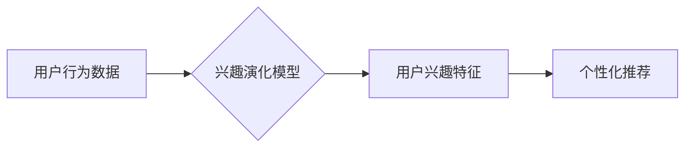

                 

## 推荐系统中的用户兴趣演化模型

> 关键词：推荐系统、用户兴趣、演化模型、协同过滤、深度学习、个性化推荐、数据挖掘

## 1. 背景介绍

推荐系统作为互联网时代的重要技术之一，旨在根据用户的历史行为、偏好和上下文信息，为用户推荐感兴趣的内容或商品。传统的推荐系统主要依赖于协同过滤和内容过滤等方法，但这些方法往往难以捕捉用户兴趣的动态变化。随着用户行为数据的不断积累和深度学习技术的快速发展，用户兴趣演化模型逐渐成为推荐系统研究的热点。

用户兴趣演化是指用户兴趣随着时间推移而发生变化的现象。用户的兴趣受多种因素影响，例如年龄、性别、生活方式、社会环境、流行趋势等。传统的推荐系统往往假设用户的兴趣是静态的，无法有效地应对用户兴趣的演化。

用户兴趣演化模型旨在捕捉用户兴趣随时间变化的动态特征，并利用这些特征进行更精准的推荐。这类模型可以帮助推荐系统更好地理解用户的需求，提供更个性化的推荐体验。

## 2. 核心概念与联系

### 2.1 用户兴趣演化

用户兴趣演化是指用户对特定物品或主题的偏好随着时间推移而发生变化的现象。用户兴趣的演化可以是渐进的、突变的、周期性的，甚至随机的。

### 2.2 推荐系统

推荐系统是一种信息过滤系统，旨在根据用户的历史行为、偏好和上下文信息，为用户推荐感兴趣的内容或商品。推荐系统可以分为基于内容的推荐、基于协同过滤的推荐、基于知识图谱的推荐等多种类型。

### 2.3 关联性

用户兴趣演化模型需要分析用户行为数据之间的关联性，例如用户对不同物品的交互行为、用户在不同时间段的兴趣偏好等。通过挖掘这些关联性，模型可以更好地理解用户的兴趣演化规律。

**核心概念与架构流程图**



## 3. 核心算法原理 & 具体操作步骤

### 3.1 算法原理概述

用户兴趣演化模型通常采用以下几种算法原理：

* **时序分析:** 通过分析用户行为数据的时间序列，识别用户兴趣的演化趋势。
* **隐语义模型:** 利用矩阵分解等技术，挖掘用户和物品之间的隐含关系，并根据这些关系预测用户的兴趣演化。
* **深度学习:** 使用深度神经网络，学习用户兴趣的复杂非线性特征，并进行更精准的预测。

### 3.2 算法步骤详解

以时序分析算法为例，用户兴趣演化模型的具体操作步骤如下：

1. **数据收集:** 收集用户行为数据，例如用户对物品的点击、评分、购买等行为。
2. **数据预处理:** 对用户行为数据进行清洗、转换和特征提取。
3. **模型训练:** 使用时序分析算法，训练用户兴趣演化模型。
4. **模型评估:** 使用测试数据评估模型的性能，例如准确率、召回率等。
5. **个性化推荐:** 根据训练好的模型，为用户推荐个性化的内容或商品。

### 3.3 算法优缺点

**时序分析算法**

* **优点:** 能够捕捉用户兴趣随时间变化的动态特征，预测用户未来的兴趣偏好。
* **缺点:** 对数据量要求较高，需要大量的历史行为数据才能训练出准确的模型。

**隐语义模型**

* **优点:** 能够挖掘用户和物品之间的隐含关系，即使用户行为数据稀疏也能进行推荐。
* **缺点:** 难以捕捉用户兴趣的动态变化，推荐结果可能不够个性化。

**深度学习算法**

* **优点:** 能够学习用户兴趣的复杂非线性特征，预测用户兴趣的演化趋势更加准确。
* **缺点:** 对数据量和计算资源要求较高，模型训练时间较长。

### 3.4 算法应用领域

用户兴趣演化模型广泛应用于以下领域：

* **电商推荐:** 为用户推荐个性化的商品，提高转化率。
* **内容推荐:** 为用户推荐个性化的新闻、视频、音乐等内容，提升用户粘性。
* **社交推荐:** 为用户推荐新的朋友、兴趣小组等，拓展社交圈。
* **教育推荐:** 为学生推荐个性化的学习资源，提高学习效率。

## 4. 数学模型和公式 & 详细讲解 & 举例说明

### 4.1 数学模型构建

用户兴趣演化模型可以采用以下数学模型进行构建：

* **马尔可夫模型:** 假设用户兴趣在不同时间点服从马尔可夫链，即用户在当前时间点的兴趣状态只依赖于其前一个时间点的兴趣状态。

* **隐马尔可夫模型:** 扩展了马尔可夫模型，引入了隐状态，可以更准确地捕捉用户兴趣的动态变化。

* **深度神经网络:** 使用多层神经网络，学习用户兴趣的复杂非线性特征，并进行更精准的预测。

### 4.2 公式推导过程

以马尔可夫模型为例，其状态转移概率矩阵为 P，其中 P(i,j) 表示用户从状态 i 转移到状态 j 的概率。

$$
P = \begin{bmatrix}
p_{11} & p_{12} & \cdots & p_{1n} \\
p_{21} & p_{22} & \cdots & p_{2n} \\
\vdots & \vdots & \ddots & \vdots \\
p_{n1} & p_{n2} & \cdots & p_{nn}
\end{bmatrix}
$$

用户在时间 t 的兴趣状态为 S(t)，则用户在时间 t+1 的兴趣状态 S(t+1) 可以通过以下公式计算：

$$
S(t+1) = \arg\max_j \sum_i P(i,j) * P(S(t) = i)
$$

### 4.3 案例分析与讲解

假设用户对不同类型的电影有不同的兴趣，例如喜剧、动作、爱情等。我们可以将这些电影类型作为用户兴趣的状态，并根据用户的历史观看记录构建马尔可夫模型。

例如，如果用户过去观看过多部喜剧电影，那么其在未来观看喜剧电影的概率会更高。通过训练马尔可夫模型，我们可以预测用户的未来兴趣偏好，并为其推荐相应的电影。

## 5. 项目实践：代码实例和详细解释说明

### 5.1 开发环境搭建

* **操作系统:** Ubuntu 18.04
* **编程语言:** Python 3.6
* **深度学习框架:** TensorFlow 2.0
* **数据处理库:** Pandas, NumPy

### 5.2 源代码详细实现

```python
import tensorflow as tf
from tensorflow.keras.models import Sequential
from tensorflow.keras.layers import Embedding, LSTM, Dense

# 数据预处理
# ...

# 模型构建
model = Sequential()
model.add(Embedding(input_dim=vocab_size, output_dim=embedding_dim))
model.add(LSTM(units=128))
model.add(Dense(units=num_classes, activation='softmax'))

# 模型编译
model.compile(optimizer='adam', loss='categorical_crossentropy', metrics=['accuracy'])

# 模型训练
model.fit(X_train, y_train, epochs=10, batch_size=32)

# 模型评估
loss, accuracy = model.evaluate(X_test, y_test)
print('Test Loss:', loss)
print('Test Accuracy:', accuracy)

# 模型预测
predictions = model.predict(X_new)
```

### 5.3 代码解读与分析

* **Embedding层:** 将用户和物品的ID转换为稠密的向量表示，捕捉其潜在的语义关系。
* **LSTM层:** 学习用户兴趣随时间变化的动态特征，捕捉用户行为序列中的长期依赖关系。
* **Dense层:** 将 LSTM层的输出映射到不同兴趣类型的概率分布。
* **模型训练:** 使用训练数据训练模型，并使用测试数据评估模型的性能。
* **模型预测:** 使用训练好的模型预测用户的未来兴趣偏好。

### 5.4 运行结果展示

* **训练过程:** 监控模型的损失函数和准确率的变化，观察模型的训练效果。
* **测试结果:** 展示模型在测试数据集上的准确率和损失函数值，评估模型的泛化能力。
* **预测结果:** 展示模型对新用户的兴趣预测结果，验证模型的实用性。

## 6. 实际应用场景

### 6.1 电商推荐

用户兴趣演化模型可以帮助电商平台更精准地推荐商品，提高用户转化率。例如，可以根据用户的浏览历史、购买记录、收藏列表等数据，预测用户的未来购买偏好，并推荐相应的商品。

### 6.2 内容推荐

用户兴趣演化模型可以帮助内容平台为用户推荐个性化的新闻、视频、音乐等内容，提升用户粘性。例如，可以根据用户的阅读习惯、观看历史、点赞记录等数据，预测用户的未来兴趣偏好，并推荐相应的新闻、视频、音乐等内容。

### 6.3 社交推荐

用户兴趣演化模型可以帮助社交平台为用户推荐新的朋友、兴趣小组等，拓展社交圈。例如，可以根据用户的兴趣爱好、社交关系、互动行为等数据，预测用户的未来社交需求，并推荐相应的用户或兴趣小组。

### 6.4 未来应用展望

随着用户行为数据的不断积累和深度学习技术的不断发展，用户兴趣演化模型将在更多领域得到应用，例如：

* **个性化教育:** 为学生推荐个性化的学习资源，提高学习效率。
* **医疗保健:** 为患者推荐个性化的医疗方案，提高治疗效果。
* **金融服务:** 为用户推荐个性化的理财产品，提高投资收益。

## 7. 工具和资源推荐

### 7.1 学习资源推荐

* **书籍:**
    * 《推荐系统》 by  Koren, Yehuda
    * 《深度学习》 by  Goodfellow, Bengio, Courville
* **在线课程:**
    * Coursera: Machine Learning
    * Udacity: Deep Learning Nanodegree
* **博客:**
    * Towards Data Science
    * Machine Learning Mastery

### 7.2 开发工具推荐

* **Python:** 广泛应用于数据科学和机器学习领域，拥有丰富的库和工具。
* **TensorFlow:** 开源深度学习框架，支持多种硬件平台和部署方式。
* **PyTorch:** 开源深度学习框架，以其灵活性和易用性而闻名。

### 7.3 相关论文推荐

* **Sequential Recommendation with Recurrent Neural Networks** by Hidasi, et al.
* **Hybrid Recommender Systems: A Survey** by Adomavicius, G. and Tuzhilin, A.
* **Deep Learning for Recommender Systems: A Survey** by Wang, et al.

## 8. 总结：未来发展趋势与挑战

### 8.1 研究成果总结

用户兴趣演化模型在推荐系统领域取得了显著的成果，能够更精准地捕捉用户兴趣的动态变化，并为用户提供更个性化的推荐体验。

### 8.2 未来发展趋势

* **多模态数据融合:** 将文本、图像、音频等多种数据类型融合到用户兴趣演化模型中，构建更全面的用户画像。
* **联邦学习:** 利用联邦学习技术，在保护用户隐私的前提下，训练更强大的用户兴趣演化模型。
* **个性化解释:** 为用户提供对推荐结果的个性化解释，提升用户对推荐系统的信任度。

### 8.3 面临的挑战

* **数据稀疏性:** 用户行为数据往往是稀疏的，难以训练出准确的模型。
* **冷启动问题:** 新用户或新物品缺乏历史行为数据，难以进行推荐。
* **用户隐私保护:** 用户兴趣演化模型需要处理大量用户隐私数据，需要采取有效的隐私保护措施。

### 8.4 研究展望

未来，用户兴趣演化模型的研究将继续朝着更精准、更个性化、更安全的方向发展，为用户提供更智能、更便捷的推荐体验。

## 9. 附录：常见问题与解答

* **Q1: 用户兴趣演化模型的训练数据有哪些？**

* **A1:** 用户兴趣演化模型的训练数据包括用户行为数据，例如用户对物品的点击、评分、购买等行为。

* **Q2: 用户兴趣演化模型的评估指标有哪些？**

* **A2:** 用户兴趣演化模型的评估指标包括准确率、召回率、F1-score等。

* **Q3: 用户兴趣演化模型有哪些应用场景？**

* **A3:** 用户兴趣演化模型广泛应用于电商推荐、内容推荐、社交推荐等领域。


作者：禅与计算机程序设计艺术 / Zen and the Art of Computer Programming 
<end_of_turn>

