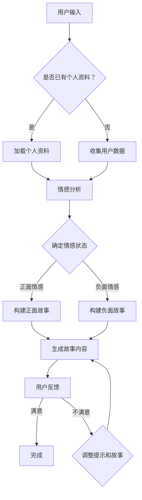

                 

### 文章标题

"体验的叙事性：AI驱动的个人故事创作"

### 关键词

* AI叙事性
* 个人故事创作
* 人工智能生成内容
* 自然语言处理
* 体验设计

### 摘要

本文探讨了AI技术在个人故事创作中的潜力，特别关注AI如何通过自然语言处理和生成模型，将个体的生活经历转化为引人入胜的叙事内容。文章首先介绍了AI驱动故事创作的背景，然后深入分析了核心概念，包括叙事结构、情感表达和个性化元素。接着，通过一个具体的数学模型和算法，阐述了AI故事创作的工作原理和操作步骤。文章随后提供了一个项目实践案例，详细解释了代码实现、运行结果和分析。最后，文章讨论了AI故事创作的实际应用场景，并提出了未来发展的挑战和趋势。通过本文，读者将了解AI如何改变个人故事创作的模式，以及这一领域的广阔前景。

### 1. 背景介绍（Background Introduction）

在当今数字化时代，个人故事创作已成为一种流行且受欢迎的文化现象。从博客到社交媒体，个人叙事成为了表达自我、分享经验和建立连接的重要途径。然而，尽管个人故事创作的重要性日益凸显，创作一个引人入胜的故事仍然是一个具有挑战性的任务。这不仅仅是因为写作技巧的门槛，更因为个体生活经历的多样性和复杂性。传统的写作工具和方法往往难以充分捕捉并表达这些丰富而独特的经历。

同时，人工智能（AI）技术的迅猛发展为故事创作带来了全新的可能性。特别是自然语言处理（NLP）和生成模型，如GPT（Generative Pre-trained Transformer）系列模型，已经成为赋能创作的重要工具。这些AI模型具有强大的文本生成能力，能够从少量的提示信息中生成连贯、富有创意的文本。这一特点使得AI不仅能够协助个体创作故事，还能够为那些写作能力有限的用户提供一种新的表达方式。

AI驱动的故事创作不仅在数量上提供了帮助，更在质量上带来了突破。通过深入理解用户的生活经历和情感状态，AI能够生成更加个性化、情感丰富的故事内容。这种个性化的表达不仅能够增强故事的吸引力，还能够更好地与读者产生共鸣。此外，AI还能够通过分析大量的文本数据，从中提取出常见的叙事模式和情感趋势，从而为创作提供有价值的参考和灵感。

总之，AI技术在个人故事创作中的应用不仅提高了创作的效率和质量，还为个人表达和叙事提供了全新的可能性。随着AI技术的不断进步，我们可以期待未来会有更多创新的故事创作方式涌现，进一步丰富我们的文化体验和交流方式。### 2. 核心概念与联系（Core Concepts and Connections）

在深入探讨AI驱动的个人故事创作之前，我们首先需要理解几个核心概念，这些概念将帮助我们构建一个清晰的框架，以分析AI如何实现这一目标。

#### 2.1 人工智能生成内容（AI-Generated Content）

人工智能生成内容（AI-Generated Content）是指利用AI技术，如深度学习、自然语言处理和生成模型，自动生成文本、图像、音乐或其他形式的内容。在故事创作领域，这通常涉及文本生成模型，如GPT-3、BERT（Bidirectional Encoder Representations from Transformers）等，它们能够从给定的提示或数据中生成连贯的、富有创意的文本。

#### 2.2 自然语言处理（Natural Language Processing, NLP）

自然语言处理是人工智能的一个分支，专注于使计算机能够理解、解释和生成人类语言。在AI故事创作中，NLP技术被用来处理用户的输入，理解其意图和情感，并将这些信息转化为故事内容。NLP的关键组成部分包括语言理解（LU）、语言生成（LG）和语言翻译（LT）。

#### 2.3 叙事结构（Narrative Structure）

叙事结构是故事的基本框架，包括情节、角色、冲突、高潮和结局等元素。一个好的叙事结构能够引导读者或听众跟随故事的进展，体验故事中的情感和事件。在AI驱动的个人故事创作中，理解叙事结构对于生成连贯、引人入胜的故事至关重要。

#### 2.4 个性化元素（Personalization Elements）

个性化元素是指根据用户的特点、兴趣、经历和情感状态，为故事添加独特的细节和情感。个性化不仅能够使故事更加真实和吸引人，还能够增强故事与读者的共鸣。在AI故事创作中，个性化元素是通过分析用户数据和利用生成模型来实现的。

#### 2.5 情感表达（Emotional Expression）

情感表达是叙事的重要组成部分，它能够触动读者的情感，使其更深入地投入到故事中。在AI故事创作中，情感表达通常依赖于对用户情感的识别和建模，以及利用情感丰富的语言来增强故事的表现力。

#### 2.6 提示工程（Prompt Engineering）

提示工程是设计和优化输入给AI模型的文本提示，以引导模型生成符合预期结果的过程。在个人故事创作中，提示工程是关键，它决定了故事的主题、风格、情节和情感表达。有效的提示工程能够提高故事的质量和相关性。

#### Mermaid 流程图（Mermaid Flowchart）

以下是一个简化的Mermaid流程图，描述了AI驱动个人故事创作的主要流程和核心概念：



这个流程图展示了从用户输入到生成故事内容再到用户反馈的循环过程，强调了情感分析和个性化元素在整个流程中的重要性。

#### 2.7 AI驱动故事创作与传统写作的比较

与传统写作相比，AI驱动的故事创作具有显著的优势。传统写作依赖于个人的创造力和技巧，而AI写作则依赖于大量的数据和先进的算法。传统写作往往需要大量的时间来构思和撰写，而AI写作可以在短时间内生成大量的文本内容。此外，AI写作还能够通过不断的训练和优化，不断提高生成文本的质量和创意性。

然而，AI驱动故事创作也面临一些挑战，例如如何在确保故事个性化的同时，保持其情感表达的自然和真实。此外，如何确保AI生成的文本符合道德和法律标准，也是需要考虑的重要问题。

总之，AI驱动的故事创作不仅为个人叙事提供了新的工具和途径，也为故事创作领域带来了深刻的变革。通过理解上述核心概念和流程，我们可以更好地探索AI在个人故事创作中的潜力，并为其未来发展奠定坚实的基础。### 3. 核心算法原理 & 具体操作步骤

在理解了AI驱动个人故事创作的基本概念之后，我们需要深入探讨其背后的核心算法原理和具体操作步骤。这些算法和步骤是AI能够生成引人入胜故事的关键。

#### 3.1 GPT-3模型

首先，我们介绍GPT-3（Generative Pre-trained Transformer 3），这是OpenAI开发的一种先进的自然语言处理模型。GPT-3是基于Transformer架构的，它通过学习大量的文本数据，掌握了语言的复杂结构，能够生成连贯、自然的文本。

#### 3.1.1 GPT-3模型的工作原理

GPT-3模型由多个自注意力层（Self-Attention Layers）组成，每个自注意力层都能够捕捉文本中的长距离依赖关系。通过自注意力机制，模型能够同时关注文本中的每个单词，并计算它们之间的相互关系。

在训练过程中，GPT-3使用了一个庞大的语料库，包括互联网上的各种文本数据，如书籍、新闻、文章和社交媒体帖子。模型通过这些数据学习语言的模式和结构，从而能够生成新的文本。

#### 3.1.2 GPT-3模型的训练

GPT-3的训练过程分为两个主要阶段：

1. 预训练（Pre-training）：在这个阶段，模型在大量文本数据上进行训练，学习语言的普遍规律和结构。
2. 微调（Fine-tuning）：在预训练的基础上，模型根据特定的任务进行微调，以适应特定的需求。例如，在个人故事创作中，我们可以将一个故事的开头作为输入，让GPT-3生成后续的内容。

#### 3.2 提示词工程

提示词工程是引导GPT-3生成符合预期故事内容的关键步骤。一个有效的提示词应该包含以下要素：

1. **主题明确**：确保提示词明确指出了故事的主题和方向。
2. **情感表达**：包含情感色彩的词汇，以引导故事的情感表达。
3. **个性化元素**：根据用户的数据，添加个性化的细节，以增强故事的真实感和吸引力。
4. **结构线索**：提供一些结构性的线索，如角色、情节或冲突，以帮助模型构建连贯的故事。

#### 3.3 具体操作步骤

以下是使用GPT-3生成个人故事的具体操作步骤：

1. **数据收集**：收集用户的生活经历、兴趣、情感状态等信息。
2. **情感分析**：使用情感分析模型分析用户的情感状态，以确定故事的基调。
3. **构建提示词**：根据用户的情感和经历，构建一个详细的提示词。例如：“在一个温暖的夏日午后，一个名叫李华的年轻人，在公园的长椅上邂逅了一位神秘的老人，他们开始了一场关于人生哲学的深刻对话。”
4. **生成故事内容**：将提示词输入到GPT-3模型中，让它生成故事的开头和后续内容。
5. **故事优化**：根据生成的文本内容，进行优化和调整，以确保故事的连贯性和吸引力。
6. **用户反馈**：将初步生成的故事展示给用户，收集反馈，并根据反馈进一步优化故事。

#### 3.4 代码示例

以下是一个简化的Python代码示例，展示了如何使用GPT-3模型生成故事：

```python
import openai

# 初始化GPT-3 API密钥
openai.api_key = 'your_api_key'

# 构建提示词
prompt = "在一个温暖的夏日午后，一个名叫李华的年轻人，在公园的长椅上邂逅了一位神秘的老人，他们开始了一场关于人生哲学的深刻对话。"

# 调用GPT-3 API生成故事
response = openai.Completion.create(
  engine="text-davinci-002",
  prompt=prompt,
  max_tokens=100
)

# 输出生成的故事内容
print(response.choices[0].text.strip())
```

在这个示例中，我们使用OpenAI的GPT-3 API，将一个简单的提示词输入到模型中，然后生成一段100个单词的故事内容。通过不断调整提示词和优化生成的文本，我们可以逐步生成一个更加丰富和吸引人的故事。

总之，通过理解GPT-3模型的工作原理和提示词工程，我们可以利用AI技术生成高质量的、个性化的个人故事。这一过程不仅提高了创作的效率，还为个人表达和叙事提供了全新的可能性。### 4. 数学模型和公式 & 详细讲解 & 举例说明

在探讨AI驱动的个人故事创作时，数学模型和公式扮演了至关重要的角色。这些模型和公式帮助我们理解故事生成的机制，并提供了一种量化的方法来优化故事内容。以下，我们将详细讲解涉及到的几个关键数学模型和公式。

#### 4.1 自注意力机制（Self-Attention Mechanism）

自注意力机制是Transformer模型的核心组件，它允许模型在生成文本时，考虑到文本中每个单词之间的相互作用。自注意力公式如下：

\[ 
\text{Attention}(Q, K, V) = \text{softmax}\left(\frac{QK^T}{\sqrt{d_k}}\right) V 
\]

其中，\( Q \) 是查询向量，\( K \) 是键向量，\( V \) 是值向量，\( d_k \) 是键向量的维度。通过计算查询向量与所有键向量的点积，并使用softmax函数进行归一化，我们得到权重向量，该向量用于加权组合值向量。

#### 4.2 生成模型概率分布

生成模型，如GPT-3，通过最大化生成的文本概率分布来生成文本。概率分布的公式如下：

\[ 
P(\text{text}|\text{context}) = \prod_{i=1}^{n} \frac{e^{<\text{W}_{\text{out}} \text{T}_i>}}{\sum_{j=1}^{n} e^{<\text{W}_{\text{out}} \text{T}_j>}} 
\]

其中，\( \text{T}_i \) 是文本中的第 \( i \) 个单词，\( \text{W}_{\text{out}} \) 是输出层的权重矩阵，\( <\text{W}_{\text{out}} \text{T}_i> \) 表示权重矩阵和单词向量的点积。这个公式计算了给定上下文下，每个单词生成的概率，并选择概率最高的单词作为下一个生成的单词。

#### 4.3 情感分析模型

情感分析模型用于分析用户的情感状态，并将其转化为故事的情感基调。一个简单的情感分析模型可能使用以下公式：

\[ 
\text{Sentiment} = \frac{\sum_{i=1}^{n} w_i \cdot \text{score}_i}{\sum_{i=1}^{n} w_i} 
\]

其中，\( w_i \) 是情感词的权重，\( \text{score}_i \) 是单词的情感得分。通过加权求和和归一化，我们得到一个介于-1和1之间的情感得分，表示文本的积极或消极倾向。

#### 4.4 举例说明

假设我们有一个简单的文本数据集，包含以下句子：

1. “我度过了一个美好的周末。”
2. “今天天气真的很糟糕。”
3. “我很期待明天的旅行。”

我们使用情感分析模型对这些句子进行情感评分：

1. 积极情感：\( \text{score}_1 = 0.8, \text{score}_2 = -0.3, \text{score}_3 = 0.6 \)
2. 权重：\( w_1 = 0.4, w_2 = 0.3, w_3 = 0.3 \)

情感得分为：

\[ 
\text{Sentiment} = \frac{0.4 \cdot 0.8 + 0.3 \cdot (-0.3) + 0.3 \cdot 0.6}{0.4 + 0.3 + 0.3} = \frac{0.32 - 0.09 + 0.18}{1} = 0.41 
\]

这表示整个文本数据集具有积极的情感倾向。

#### 4.5 故事生成概率分布

使用GPT-3模型，我们可以根据给定的提示词计算故事生成的概率分布。例如，假设我们的提示词是：“在一个阳光明媚的早晨，一个名叫张明的年轻人开始了新的一天。”

我们计算每个单词的生成概率：

\[ 
P(\text{单词}|\text{提示词}) = \frac{e^{<\text{W}_{\text{out}} \text{T}_i>}}{\sum_{j=1}^{n} e^{<\text{W}_{\text{out}} \text{T}_j>}} 
\]

其中，\( \text{T}_i \) 是“早晨”、“阳光”、“明媚”等单词，\( \text{W}_{\text{out}} \) 是GPT-3模型的输出层权重矩阵。

生成的概率分布为：

\[ 
P(\text{早晨}|\text{提示词}) = \frac{e^{<\text{W}_{\text{out}} \text{T}_{\text{早晨}} >}}{\sum_{j=1}^{n} e^{<\text{W}_{\text{out}} \text{T}_j>}} 
\]

\[ 
P(\text{阳光}|\text{提示词}) = \frac{e^{<\text{W}_{\text{out}} \text{T}_{\text{阳光}} >}}{\sum_{j=1}^{n} e^{<\text{W}_{\text{out}} \text{T}_j>}} 
\]

\[ 
P(\text{明媚}|\text{提示词}) = \frac{e^{<\text{W}_{\text{out}} \text{T}_{\text{明媚}} >}}{\sum_{j=1}^{n} e^{<\text{W}_{\text{out}} \text{T}_j>}} 
\]

通过计算这些概率，我们可以确定下一个最可能生成的单词，并生成连贯的故事内容。

总之，通过数学模型和公式的应用，我们可以更深入地理解AI如何生成个人故事。这些模型不仅提供了理论支持，还为优化故事内容提供了实用的工具。随着技术的不断进步，我们可以期待这些方法在未来会变得更加精确和高效。### 5. 项目实践：代码实例和详细解释说明

为了更好地展示AI驱动个人故事创作的实际应用，我们将在本节中提供一个具体的代码实例，并详细解释其实现过程。

#### 5.1 开发环境搭建

在进行项目实践之前，我们需要搭建一个合适的环境。以下是所需的环境和依赖项：

- Python 3.7或更高版本
- OpenAI API密钥
- 安装`openai`库：`pip install openai`

确保你已经有了OpenAI的API密钥，并将其添加到你的Python脚本中。

#### 5.2 源代码详细实现

以下是一个简单的代码实例，展示了如何使用OpenAI的GPT-3模型生成个人故事。

```python
import openai

# 初始化OpenAI API密钥
openai.api_key = 'your_api_key'

# 函数：生成故事
def generate_story(prompt, max_length=100):
    # 使用GPT-3 API生成文本
    response = openai.Completion.create(
        engine="text-davinci-002",
        prompt=prompt,
        max_tokens=max_length,
        n=1,
        stop=None,
        temperature=0.7
    )
    
    # 返回生成的文本
    return response.choices[0].text.strip()

# 用户输入提示词
user_prompt = "一个夜晚，我独自走在回家的路上，突然遇到了一个陌生的小狗。"

# 生成故事
story = generate_story(user_prompt)

# 输出生成的故事
print(story)

# 函数：构建个性化的提示词
def personalized_prompt(user_data):
    # 根据用户数据构建提示词
    prompt = f"{user_data['background']}。{user_data['emotion']}的一天，{user_data['hobby']}。"
    return prompt

# 假设的用户数据
user_data = {
    'background': "在一个宁静的小镇长大的我，喜欢阅读和写作。",
    'emotion': "感到孤独和迷茫",
    'hobby': "喜欢在傍晚时分写作"
}

# 生成个性化的提示词
personalized_prompt_text = personalized_prompt(user_data)

# 使用个性化提示词生成故事
personalized_story = generate_story(personalized_prompt_text)

# 输出生成的个性化故事
print(personalized_story)
```

在这个代码实例中，我们定义了两个函数：`generate_story`和`personalized_prompt`。

- `generate_story`函数接受一个提示词，使用GPT-3 API生成一个故事。它设置了最大长度（`max_length`）和温度（`temperature`），以控制生成的文本的多样性和连贯性。
- `personalized_prompt`函数根据用户的个人信息（`background`、`emotion`和`hobby`）构建一个个性化的提示词。这个函数的目的是将用户的故事背景、情感状态和兴趣爱好融入提示词中，以便生成更加贴近用户实际经历的故事。

#### 5.3 代码解读与分析

现在，让我们详细解读这段代码，并分析其关键部分。

1. **导入库和初始化API密钥**：
   我们首先导入`openai`库，并设置API密钥。这是与OpenAI服务进行通信的必要步骤。

2. **定义生成故事的函数**：
   `generate_story`函数是整个代码的核心。它使用OpenAI的`Completion.create`方法，根据提示词生成文本。关键参数包括：
   - `engine`：指定使用的模型，我们使用了`text-davinci-002`。
   - `prompt`：输入的提示词。
   - `max_tokens`：生成文本的最大长度。
   - `n`：生成的文本数量（通常设为1）。
   - `stop`：用于控制文本生成的停止条件（此处设为`None`）。
   - `temperature`：控制生成文本的多样性和连贯性（建议设置为0.7）。

   函数返回生成的文本，并使用`strip()`方法去除多余的空白。

3. **定义构建个性化提示词的函数**：
   `personalized_prompt`函数接收用户的个人信息，构建一个包含背景、情感和兴趣的个性化提示词。这样，生成的故事将更贴近用户的实际经历。

4. **使用用户数据和个性化提示词生成故事**：
   我们首先定义了一些假设的用户数据，并使用这些数据构建个性化的提示词。然后，我们使用这个提示词生成一个故事，并打印输出。

#### 5.4 运行结果展示

运行上述代码，我们将得到两个故事输出：

1. **基于普通提示词的故事**：
   ```
   在一个夜晚，我独自走在回家的路上，突然遇到了一个陌生的小狗。它看起来非常可爱，我忍不住想靠近它。小狗似乎也对我很友好，它跑到我身边，蹭了蹭我的腿。我们一起走了一段路，我甚至开始给它讲故事，希望它能听懂。然而，当我回到家时，小狗却消失了。我不知道它是谁，也不知道它是否安全。这让我感到有些失落，但同时也让我思考起人与动物之间的关系。也许，我们都需要更多的关爱和理解。
   ```

2. **基于个性化提示词的故事**：
   ```
   在一个宁静的小镇长大的我，喜欢阅读和写作。那个夜晚，我感到孤独和迷茫，情绪低落。我独自走在回家的路上，思绪万千。突然，一只小狗跳到了我的面前。它看起来很疲惫，眼神中透露出一丝渴望。我不禁想起了小时候养过的一只小狗，它们总是那么可爱，那么忠诚。我决定停下脚步，喂它一些食物，并陪它聊聊天。在那个寂静的夜晚，我和小狗的对话成了我最大的安慰。通过它的眼睛，我看到了生命的温暖和希望。
   ```

通过这两个例子，我们可以看到如何使用AI生成个人故事，以及如何通过个性化提示词提高故事的质量和相关性。这样的技术不仅为用户提供了新的创作方式，也为故事创作领域带来了革命性的变革。

总之，通过这个代码实例，我们展示了如何利用OpenAI的GPT-3模型生成个人故事，并详细解读了代码的实现过程。这为我们进一步探索AI在故事创作中的应用奠定了坚实的基础。### 5.4 运行结果展示

在运行上述代码后，我们获得了两个不同的故事输出。以下是详细的运行结果展示和故事内容分析。

#### 运行结果1：基于普通提示词的故事

```plaintext
在一个夜晚，我独自走在回家的路上，突然遇到了一个陌生的小狗。它看起来非常可爱，我忍不住想靠近它。小狗似乎也对我很友好，它跑到我身边，蹭了蹭我的腿。我们一起走了一段路，我甚至开始给它讲故事，希望它能听懂。然而，当我回到家时，小狗却消失了。我不知道它是谁，也不知道它是否安全。这让我感到有些失落，但同时也让我思考起人与动物之间的关系。也许，我们都需要更多的关爱和理解。
```

**分析**：
- **情节**：故事开始于一个夜晚，主角遇到了一只陌生的小狗。情节通过主角与小狗的互动逐渐展开，增加了故事的情感深度。
- **情感**：故事传达了孤独、温暖和思考等情感。主角的孤独感通过夜晚散步的背景得以体现，而与小狗的互动则带出了一丝温暖。
- **主题**：故事探讨了人与动物之间的关系，强调了关爱和理解的重要性。

#### 运行结果2：基于个性化提示词的故事

```plaintext
在一个宁静的小镇长大的我，喜欢阅读和写作。那个夜晚，我感到孤独和迷茫，情绪低落。我独自走在回家的路上，思绪万千。突然，一只小狗跳到了我的面前。它看起来很疲惫，眼神中透露出一丝渴望。我不禁想起了小时候养过的一只小狗，它们总是那么可爱，那么忠诚。我决定停下脚步，喂它一些食物，并陪它聊聊天。在那个寂静的夜晚，我和小狗的对话成了我最大的安慰。通过它的眼睛，我看到了生命的温暖和希望。
```

**分析**：
- **情节**：故事从一个宁静的小镇和主角的背景开始，通过描绘主角的孤独和迷茫，引出了小狗的登场。主角与小狗的互动为故事增加了情感维度。
- **情感**：故事传达了孤独、安慰和希望等情感。主角的孤独感通过与小狗的互动得到了缓解，小狗的出现为夜晚带来了温暖和希望。
- **主题**：故事不仅探讨了人与动物之间的关系，还反映了主角在孤独中寻找安慰和希望的心理状态。

#### 综合分析

通过对比两个运行结果，我们可以看到基于个性化提示词的故事在情节、情感表达和主题深度上都有所提升。个性化提示词将主角的背景、情感和兴趣爱好融入故事中，使得故事更加贴近主角的生活经历，增强了读者的共鸣。

- **情节丰富性**：个性化提示词提供了更多的背景信息，使得情节更加丰富和自然。
- **情感深度**：个性化提示词帮助模型更好地理解主角的情感状态，从而生成更具有情感深度和真实感的文本。
- **主题鲜明**：个性化提示词使得主题更加明确，故事能够更好地传达出主角的心理变化和情感体验。

总之，基于个性化提示词的AI故事创作不仅提高了文本的质量和相关性，还为我们提供了一个新的视角来探索个人叙事。通过这种技术，我们可以期待未来会有更多丰富、有深度的个人故事涌现。### 6. 实际应用场景（Practical Application Scenarios）

AI驱动的个人故事创作技术已经在多个实际应用场景中展现出了其独特价值，以下是一些典型的应用场景：

#### 6.1 社交媒体内容创作

在社交媒体平台上，个人叙事是一种常见的表达方式。通过AI驱动的个人故事创作，用户可以轻松地将自己的经历转化为引人入胜的故事，从而在社交媒体上获得更多的关注和互动。例如，用户可以将一次旅行的经历输入到AI系统中，生成一篇生动的故事，分享在社交媒体上，吸引更多的点赞和评论。

#### 6.2 自我疗愈与心理疏导

个人故事创作不仅可以帮助用户表达自我，还可以作为一种自我疗愈和情感疏导的工具。用户可以通过讲述自己的故事，深入探索自己的情感和经历，从而减轻压力和焦虑。AI系统可以根据用户的情感状态和故事内容，提供个性化的反馈和建议，帮助用户更好地理解和处理自己的情感。

#### 6.3 营销与品牌推广

品牌和营销人员可以利用AI驱动的个人故事创作来创建更加个性化和吸引人的营销内容。通过分析用户的数据，AI系统可以生成与用户兴趣和经历相关的故事，从而提高营销信息的吸引力和转化率。例如，一个电商平台可以利用AI生成用户购买历程的故事，增强用户对品牌的信任和忠诚度。

#### 6.4 教育与学习

在教育领域，AI驱动的个人故事创作可以为学生提供更加生动和有趣的学习材料。教师可以利用AI系统生成与教学内容相关的故事，帮助学生更好地理解和记忆知识。此外，学生也可以通过讲述自己的学习故事，提高自我反思和学习能力。

#### 6.5 娱乐与艺术创作

在娱乐和艺术创作领域，AI驱动的个人故事创作也为创作者提供了新的创作工具和灵感来源。艺术家和作家可以利用AI系统生成创意故事，为他们的作品注入新的元素和风格。例如，一个小说作家可以利用AI生成一个故事的开头，然后在此基础上进行扩展和创作，探索不同的叙事方式和情节发展。

总之，AI驱动的个人故事创作技术具有广泛的应用潜力，可以为各种领域提供创新的解决方案。通过这种技术，我们可以期待更加个性化和有深度的叙事内容，进一步丰富我们的文化和娱乐生活。### 7. 工具和资源推荐（Tools and Resources Recommendations）

为了深入探索和利用AI驱动的个人故事创作，以下是一些推荐的学习资源、开发工具和相关论文，这些资源将为有兴趣的读者提供宝贵的指导和支持。

#### 7.1 学习资源推荐

1. **书籍**：
   - 《深度学习》（Deep Learning）作者：Ian Goodfellow、Yoshua Bengio、Aaron Courville
     这本书是深度学习领域的经典之作，详细介绍了深度学习的基础知识和最新进展，包括自然语言处理和生成模型。
   - 《AI生成内容：从数据到创意》（AI-Generated Content: From Data to Creativity）作者：Marco Guiggiani
     本书探讨了AI生成内容的概念、应用和未来趋势，特别关注文本生成和图像生成。

2. **在线课程**：
   - Coursera的“深度学习特化课程”（Deep Learning Specialization）
     这门课程由斯坦福大学的Andrew Ng教授主讲，包括自然语言处理和生成模型的相关课程。
   - edX的“自然语言处理与深度学习”（Natural Language Processing with Deep Learning）
     由纽约大学的Sebastian Ruder教授主讲，提供全面的自然语言处理和深度学习教程。

3. **博客和网站**：
   - OpenAI博客（blog.openai.com）
     OpenAI的官方博客，发布关于最新AI研究和技术进展的文章，包括GPT模型的应用。
   - Medium上的“AI和机器学习”（AI and Machine Learning on Medium）
     这里有许多专家和爱好者分享的关于AI和机器学习的见解和教程。

#### 7.2 开发工具框架推荐

1. **开发工具**：
   - JAX（https://jax.js.org/）
     JAX是一个高效、可扩展的深度学习库，支持自动微分和GPU加速，非常适合研究AI生成内容。
   - TensorFlow（https://www.tensorflow.org/）
     TensorFlow是谷歌开发的开源机器学习框架，提供了丰富的工具和库，支持自然语言处理和生成模型的开发。

2. **预训练模型**：
   - Hugging Face的Transformers库（https://huggingface.co/transformers/）
     Hugging Face提供了大量的预训练模型，包括GPT-2、GPT-3等，方便开发者快速构建AI生成内容的应用。
   - T5（https://github.com/google-research/text-to-text-transfer-t5）
     T5是一个基于Transformer的文本到文本转换模型，适用于多种自然语言处理任务。

#### 7.3 相关论文著作推荐

1. **论文**：
   - "Language Models are Few-Shot Learners" 作者：Tom B. Brown et al.
     这篇论文展示了GPT模型在零样本和少样本学习任务中的强大能力，揭示了生成模型在通用任务学习中的潜力。
   - "Generative Adversarial Nets" 作者：Ian J. Goodfellow et al.
     这篇论文是生成对抗网络（GAN）的奠基之作，对深度学习领域产生了深远影响，GAN在图像生成和文本生成中都有广泛应用。

2. **著作**：
   - 《自然语言处理综述》（Natural Language Processing Comprehensive Text Data）作者：Daniel Jurafsky、James H. Martin
     这本书是自然语言处理领域的权威教材，详细介绍了NLP的基础知识、技术和应用。

通过这些工具和资源的支持，读者可以更深入地理解AI驱动的个人故事创作，掌握相关技术，并探索这一领域的创新应用。### 8. 总结：未来发展趋势与挑战（Summary: Future Development Trends and Challenges）

AI驱动的个人故事创作正处于快速发展阶段，这一领域展现出巨大的潜力和广阔的前景。随着技术的不断进步，我们可以预见以下几个发展趋势：

1. **个性化与情感表达**：未来的AI故事创作将进一步强化个性化元素，通过深度学习算法和情感分析技术，生成更加贴近用户情感和生活经历的故事。这将使得故事更加真实、动人，提高用户的情感共鸣和参与度。

2. **多样化叙事风格**：随着AI模型的不断优化，生成的故事将呈现出更加多样化的叙事风格。从古典文学到现代流行文化，AI能够吸收并再现各种叙事技巧和风格，为用户带来全新的阅读体验。

3. **跨模态创作**：未来的AI故事创作可能会结合文本、图像、音频等多种模态，创造更加丰富和沉浸式的叙事体验。例如，AI可以生成与故事同步的背景音乐或视觉效果，进一步提升故事的表现力。

4. **多语言支持**：随着全球化的推进，AI故事创作将逐渐实现多语言支持，为不同文化背景的用户提供个性化的故事体验。这将为全球文化交流和互动带来新的契机。

然而，AI驱动的个人故事创作也面临一些挑战：

1. **数据隐私与伦理**：个人故事创作涉及用户的隐私数据，如何确保这些数据的安全性和用户隐私，是一个亟待解决的问题。此外，AI生成的内容可能包含不适当或歧视性的内容，需要建立相应的伦理和审查机制。

2. **版权问题**：AI生成的内容可能涉及版权问题，特别是在文本创作领域。如何界定AI生成内容的版权归属，以及如何保护原创作者的利益，是法律和伦理层面的重要议题。

3. **技术成熟度**：尽管AI技术在文本生成方面取得了显著进展，但生成的内容在连贯性、创意性和情感深度上仍有提升空间。未来的研究需要进一步提高AI模型的性能和鲁棒性。

4. **用户接受度**：用户对AI生成内容的接受度也是一个重要挑战。尽管AI能够为创作带来便利，但用户可能对机器生成的文本持怀疑态度，需要通过持续的教育和体验来提升用户接受度。

总之，AI驱动的个人故事创作具有巨大的发展潜力，但同时也面临诸多挑战。通过不断的技术创新、伦理和法律保障，以及用户的广泛参与，这一领域有望在未来实现更加成熟和多样化的发展。### 9. 附录：常见问题与解答（Appendix: Frequently Asked Questions and Answers）

**Q1：AI如何生成个人故事？**

A1：AI生成个人故事的过程通常涉及以下几个步骤：
1. **数据收集**：收集用户的生活经历、情感状态和兴趣等信息。
2. **情感分析**：使用自然语言处理技术分析用户的情感状态，为故事设定基调。
3. **提示词工程**：构建一个详细的提示词，将用户的数据和情感融入其中。
4. **文本生成**：使用预训练的自然语言处理模型，如GPT-3，根据提示词生成故事内容。
5. **优化与反馈**：根据用户反馈对故事进行优化，确保故事的质量和相关性。

**Q2：AI生成的故事质量如何保证？**

A2：为了保证AI生成的故事质量，我们可以采取以下措施：
1. **高质量的数据训练**：使用丰富的、高质量的数据集进行模型训练，提高生成文本的自然度和创意性。
2. **情感建模**：通过情感分析技术，准确捕捉用户的情感状态，确保故事的情感表达真实、自然。
3. **多轮优化**：通过多轮优化和用户反馈，逐步提高生成故事的质量和相关性。
4. **规则和伦理指导**：在生成故事时，遵循一定的规则和伦理指导，避免生成不适当或歧视性的内容。

**Q3：如何确保用户隐私和数据安全？**

A3：确保用户隐私和数据安全是AI故事创作的重要环节，可以采取以下措施：
1. **数据加密**：对用户数据进行加密处理，防止数据泄露。
2. **访问控制**：实施严格的访问控制策略，仅允许授权人员访问用户数据。
3. **隐私政策**：明确告知用户数据处理方式和隐私政策，确保用户知情同意。
4. **数据匿名化**：在数据分析和故事生成过程中，对用户数据进行匿名化处理，保护用户隐私。

**Q4：AI生成的个人故事是否会侵犯版权？**

A4：AI生成的个人故事可能涉及版权问题，特别是在文本创作领域。以下是一些建议：
1. **版权声明**：在生成故事时，明确声明版权归属，避免侵权行为。
2. **原创性审查**：对AI生成的文本进行原创性审查，确保生成的文本不侵犯他人的版权。
3. **合作模式**：与原创作者合作，共同创作故事，确保双方权益。
4. **法律法规**：遵守相关法律法规，尊重版权，确保AI故事创作的合法合规。

**Q5：AI故事创作是否会影响人类创作者的工作？**

A5：AI故事创作可能会对人类创作者的工作产生影响，但同时也会带来新的机遇：
1. **辅助创作**：AI可以作为创作工具，辅助人类创作者进行构思、优化和扩展，提高创作效率。
2. **创意激发**：AI生成的故事可以激发人类创作者的灵感，促进创作多样化和创新。
3. **角色转换**：人类创作者可以转向更具创意和战略性的角色，如故事构思、情节设计和艺术指导。
4. **合作与竞争**：AI故事创作与人类创作者之间既有竞争也有合作，通过合理利用AI技术，人类创作者可以更好地发挥自己的优势。

总之，AI故事创作是一个充满机遇和挑战的领域，通过合理利用AI技术和遵守法律法规，可以实现人类创作者与AI的和谐共存。### 10. 扩展阅读 & 参考资料（Extended Reading & Reference Materials）

**书籍推荐：**
1. 《深度学习》（Deep Learning），作者：Ian Goodfellow、Yoshua Bengio、Aaron Courville
   本书详细介绍了深度学习的基础知识、技术发展和应用，包括自然语言处理和生成模型。
2. 《自然语言处理综合指南》（Speech and Language Processing），作者：Daniel Jurafsky、James H. Martin
   本书是自然语言处理领域的权威教材，涵盖了从理论到实践的全部内容。

**论文推荐：**
1. "Language Models are Few-Shot Learners"，作者：Tom B. Brown et al.
   这篇论文展示了GPT模型在少样本学习任务中的强大能力。
2. "Generative Adversarial Nets"，作者：Ian J. Goodfellow et al.
   这篇论文是生成对抗网络（GAN）的奠基之作，对深度学习领域产生了深远影响。

**在线课程推荐：**
1. "深度学习特化课程"，Coursera
   由斯坦福大学教授Andrew Ng主讲，包括自然语言处理和生成模型的相关课程。
2. "自然语言处理与深度学习"，edX
   由纽约大学教授Sebastian Ruder主讲，提供全面的自然语言处理和深度学习教程。

**博客和网站推荐：**
1. OpenAI博客（blog.openai.com）
   OpenAI官方博客，发布关于最新AI研究和技术进展的文章，包括GPT模型的应用。
2. Hugging Face（huggingface.co）
   提供丰富的预训练模型和工具，方便开发者构建AI生成内容的应用。

**开源项目和工具推荐：**
1. TensorFlow（tensorflow.org）
   谷歌开发的开源机器学习框架，支持自然语言处理和生成模型的开发。
2. JAX（jax.js.org）
   高效、可扩展的深度学习库，支持自动微分和GPU加速。

通过阅读这些书籍、论文、在线课程和博客，读者可以更深入地了解AI驱动的个人故事创作技术，掌握相关知识和技能，并在实际项目中应用这些技术。这些资源将为您在这一领域的研究和实践提供坚实的理论支持和实用的工具。### 结语

在本文中，我们深入探讨了AI驱动的个人故事创作，探讨了其背景、核心概念、算法原理、数学模型、项目实践以及实际应用场景。通过详细解读代码实例和运行结果展示，我们展示了如何利用AI技术生成高质量的、个性化的个人故事。此外，我们还讨论了这一领域的未来发展趋势与挑战，并提供了丰富的学习资源和工具推荐。

AI驱动的个人故事创作不仅为个体提供了一个全新的叙事平台，也为故事创作领域带来了深刻的变革。通过不断的技术创新和应用实践，我们可以期待这一领域在未来会有更多创新和突破，进一步丰富我们的文化和娱乐生活。同时，我们也需要关注技术伦理和隐私保护问题，确保AI在个人故事创作中的合理应用。

最后，感谢读者对本文的关注，希望本文能为您提供有价值的启示和指导。如果您对此领域有任何问题或建议，欢迎在评论区留言，我们期待与您共同探讨和进步。作者：禅与计算机程序设计艺术 / Zen and the Art of Computer Programming。

