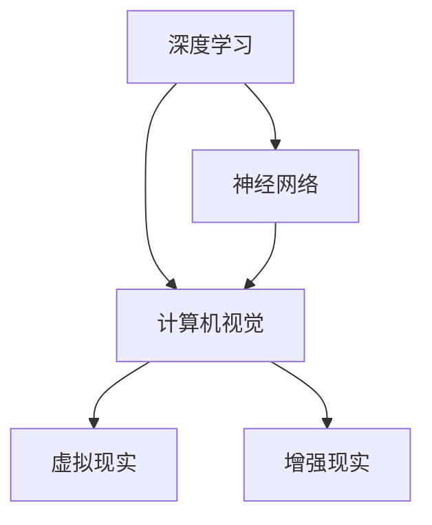

                 

### 文章标题

**体验跨时空探险家：AI创造的感知边界拓展**

关键词：人工智能，感知扩展，跨时空体验，深度学习，神经网络，图像处理，虚拟现实，增强现实

摘要：本文将探讨人工智能在创造跨时空体验方面的最新进展，特别是如何通过深度学习和神经网络技术扩展人类的感知边界。我们将从背景介绍、核心概念与联系、算法原理、数学模型、项目实践、实际应用场景、工具资源推荐以及未来发展趋势等方面，详细分析AI如何帮助我们成为跨时空探险家。

### Introduction

In this article, we will delve into the latest advancements in artificial intelligence (AI) that enable cross-time and space experiences by expanding our sensory boundaries. Specifically, we will explore how deep learning and neural network technologies allow us to extend our perception. The article will be structured as follows:

1. **Background Introduction**: We will begin by discussing the motivations and challenges of cross-time and space perception.
2. **Core Concepts and Connections**: We will introduce the key concepts and their relationships, such as deep learning, neural networks, and computer vision.
3. **Core Algorithm Principles and Specific Operational Steps**: We will delve into the principles behind core algorithms and how they operate.
4. **Mathematical Models and Formulas**: We will explain the mathematical models and formulas used in the algorithms, along with detailed examples.
5. **Project Practice**: We will present a practical project example and provide detailed explanations and code analysis.
6. **Practical Application Scenarios**: We will discuss the real-world applications of cross-time and space perception in various fields.
7. **Tools and Resources Recommendations**: We will recommend useful tools and resources for further learning and development.
8. **Summary**: We will summarize the future development trends and challenges in cross-time and space perception.
9. **Appendix**: We will address frequently asked questions and provide extended reading materials.

Let's start with the background introduction. <|user|>### 1. 背景介绍（Background Introduction）

随着科技的飞速发展，人类对信息获取和感知的需求日益增长。传统的感知方式已经无法满足我们对跨时空体验的向往。例如，我们希望能够在虚拟现实中感受古代文明，或者通过增强现实技术了解未来科技。这种跨时空体验不仅限于娱乐和游戏领域，它还涉及到教育、医疗、军事等多个行业。

然而，实现跨时空体验面临着诸多挑战。首先，我们现有的感知能力有限，无法直接感知到过去或未来的信息。其次，数据获取和处理的速度和精度需要进一步提升。此外，如何在虚拟和现实世界之间建立有效的映射关系也是一个亟待解决的问题。

为了应对这些挑战，人工智能，特别是深度学习和神经网络技术，成为了解决问题的关键。通过训练神经网络模型，我们可以让计算机模拟人类大脑的工作方式，从而扩展我们的感知边界。例如，通过深度学习算法，我们可以从大量的历史图像中提取特征，还原古代建筑的外观和风格。同样，通过神经网络模型，我们可以预测未来科技的发展趋势，并在虚拟现实中展示相应的场景。

总之，人工智能为我们提供了一个全新的视角，让我们能够突破传统的感知限制，体验跨时空的探险之旅。接下来，我们将进一步探讨人工智能如何实现这一目标。 <|user|>### 2. 核心概念与联系（Core Concepts and Connections）

在探索人工智能如何拓展我们的感知边界时，我们首先需要了解几个关键概念和它们之间的关系：深度学习、神经网络、计算机视觉、虚拟现实和增强现实。

**深度学习（Deep Learning）**

深度学习是人工智能的一个重要分支，它模仿人脑的神经网络结构，通过多层神经网络对数据进行处理和分析。深度学习在图像识别、语音识别、自然语言处理等领域取得了显著的成果。它的核心思想是通过层层提取数据中的特征，从而实现复杂模式的识别。

**神经网络（Neural Networks）**

神经网络是深度学习的基础，它由大量的神经元（节点）组成，通过相互连接形成复杂的网络结构。每个神经元接收来自其他神经元的输入信号，并产生一个输出信号。通过反向传播算法，神经网络可以不断调整内部参数，以优化输出结果。

**计算机视觉（Computer Vision）**

计算机视觉是人工智能的一个应用领域，它致力于使计算机能够像人类一样理解和处理视觉信息。计算机视觉技术包括图像识别、目标检测、图像分割、场景理解等。通过深度学习和神经网络，计算机视觉可以实现从简单的图像识别到复杂的场景理解。

**虚拟现实（Virtual Reality，VR）**

虚拟现实是一种通过计算机生成的三维模拟环境，用户可以在其中进行交互和体验。虚拟现实技术依赖于计算机视觉和深度学习，通过捕捉用户的动作和姿态，并将这些数据实时传递给虚拟环境，使用户感受到身临其境的体验。

**增强现实（Augmented Reality，AR）**

增强现实是在现实世界的基础上叠加虚拟信息，使用户能够看到增强后的场景。增强现实技术也依赖于计算机视觉和深度学习，通过识别现实世界的图像和物体，并在这些图像上叠加虚拟信息，从而实现增强现实的交互体验。

这些概念之间的联系在于，深度学习和神经网络为计算机视觉提供了强大的分析工具，而计算机视觉则是虚拟现实和增强现实技术的基础。通过深度学习和计算机视觉，我们可以从现实世界中获取信息，并通过虚拟现实和增强现实技术将这些信息呈现给用户，从而拓展人类的感知边界。

下面是一个使用Mermaid绘制的流程图，展示了这些概念之间的联系：



通过这一段内容，我们了解了人工智能拓展感知边界所需的核心概念和它们之间的关系。接下来，我们将进一步探讨这些概念在实际操作中的具体应用。 <|user|>### 3. 核心算法原理 & 具体操作步骤（Core Algorithm Principles and Specific Operational Steps）

在实现跨时空感知的过程中，核心算法原理和具体操作步骤至关重要。以下将详细阐述深度学习和神经网络技术在图像处理、虚拟现实和增强现实中的应用原理。

**3.1 深度学习算法原理**

深度学习算法的核心是多层神经网络（Multi-Layer Neural Networks）。它通过多层神经网络对输入数据进行处理，逐层提取特征，最终实现复杂模式识别。以下是深度学习算法的基本原理：

1. **前向传播（Forward Propagation）**：输入数据通过网络的各个层，每一层都会对数据进行变换，传递到下一层。
2. **激活函数（Activation Function）**：在每层网络中，通过激活函数对数据进行非线性变换，使得神经网络能够拟合复杂的函数。
3. **反向传播（Backpropagation）**：根据输出结果与真实结果的误差，反向传播误差信号，并调整网络的权重和偏置，优化网络性能。

**3.2 神经网络在图像处理中的应用**

在图像处理中，深度学习算法通常用于图像识别、目标检测和图像分割等任务。以下是具体操作步骤：

1. **图像预处理**：将图像数据转换为神经网络可以处理的形式，如灰度图或RGB图像。
2. **卷积神经网络（Convolutional Neural Networks，CNN）训练**：使用大量的图像数据训练CNN模型，模型通过多层卷积和池化操作提取图像特征。
3. **特征提取与分类**：通过训练得到的模型对新的图像数据进行特征提取，并使用分类器进行图像分类或目标检测。

**3.3 虚拟现实中的深度学习应用**

虚拟现实中的深度学习应用主要包括场景重建和交互识别。以下是具体操作步骤：

1. **场景重建**：使用深度学习算法对虚拟现实场景中的图像或视频进行三维重建，生成虚拟场景。
2. **交互识别**：通过训练得到的模型识别用户在虚拟环境中的动作和姿态，实现实时交互。

**3.4 增强现实中的深度学习应用**

增强现实中的深度学习应用主要包括实时图像识别和物体追踪。以下是具体操作步骤：

1. **图像识别**：使用深度学习算法对增强现实场景中的图像或视频进行实时识别，识别出目标物体。
2. **物体追踪**：通过跟踪目标物体的位置和姿态，实现增强现实中的信息叠加和交互。

**3.5 算法具体操作步骤示例**

以下是一个简化的深度学习算法在图像识别任务中的操作步骤示例：

1. **数据收集与预处理**：收集大量的图像数据，并对图像进行预处理，如大小归一化、去噪等。
2. **模型构建**：构建一个卷积神经网络模型，包括卷积层、池化层和全连接层等。
3. **模型训练**：使用预处理后的图像数据对模型进行训练，通过反向传播算法优化模型参数。
4. **模型评估**：使用验证集对训练好的模型进行评估，调整模型参数以达到最佳性能。
5. **模型部署**：将训练好的模型部署到虚拟现实或增强现实应用中，进行实时图像识别和交互。

通过以上内容，我们了解了深度学习和神经网络技术在跨时空感知中的核心原理和具体操作步骤。接下来，我们将进一步探讨数学模型和公式，以便更好地理解这些算法的实现。 <|user|>### 4. 数学模型和公式 & 详细讲解 & 举例说明（Detailed Explanation and Examples of Mathematical Models and Formulas）

在深度学习和神经网络的应用中，数学模型和公式起到了至关重要的作用。以下将详细讲解一些常用的数学模型和公式，并通过具体例子来说明它们的应用。

**4.1 激活函数**

激活函数是神经网络中的一个关键组件，它用于引入非线性因素，使得神经网络能够拟合复杂的函数。常见的激活函数包括：

1. **Sigmoid函数**：

   $$ f(x) = \frac{1}{1 + e^{-x}} $$

   Sigmoid函数将输入值映射到（0，1）区间，具有S形状的曲线。

2. **ReLU函数**：

   $$ f(x) = \max(0, x) $$

   ReLU函数将输入值大于0的部分映射为自身，小于等于0的部分映射为0，有助于提高神经网络训练速度。

3. **Tanh函数**：

   $$ f(x) = \frac{e^x - e^{-x}}{e^x + e^{-x}} $$

   Tanh函数与Sigmoid函数类似，但输出范围在（-1，1）之间。

**4.2 损失函数**

损失函数用于衡量模型预测结果与真实结果之间的差距，以指导模型参数的调整。常见的损失函数包括：

1. **均方误差（Mean Squared Error，MSE）**：

   $$ Loss = \frac{1}{n}\sum_{i=1}^{n}(y_i - \hat{y}_i)^2 $$

   均方误差计算预测值与真实值之间差异的平方和的平均值。

2. **交叉熵损失（Cross-Entropy Loss）**：

   $$ Loss = -\frac{1}{n}\sum_{i=1}^{n}y_i \log(\hat{y}_i) $$

   交叉熵损失用于分类问题，计算预测概率与真实标签之间的交叉熵。

**4.3 反向传播算法**

反向传播算法是神经网络训练的核心，通过不断调整网络参数以降低损失函数。以下是反向传播算法的基本步骤：

1. **前向传播**：将输入数据通过网络的各个层，计算输出结果。
2. **计算梯度**：利用链式法则计算每一层权重的梯度。
3. **反向传播**：将梯度反向传播到前一层，更新网络参数。
4. **优化更新**：使用梯度下降等优化算法更新网络参数。

**4.4 卷积神经网络（Convolutional Neural Networks，CNN）**

卷积神经网络是图像处理领域的一种常见模型，具有以下数学模型和公式：

1. **卷积操作**：

   $$ \text{output}_{ij} = \sum_{k=1}^{K}\sum_{n=1}^{N}w_{kn} \cdot \text{input}_{i+k-n, j} + b $$
   
   其中，\( \text{output}_{ij} \) 是卷积结果，\( w_{kn} \) 是卷积核权重，\( \text{input}_{i+k-n, j} \) 是输入图像上的一个局部区域，\( b \) 是偏置项。

2. **池化操作**：

   $$ \text{pool}_{ij} = \max_{k}\{\text{input}_{i+k-n, j}\} $$
   
   池化操作用于降低图像分辨率，保留重要特征。

**4.5 例子说明**

以下是一个简单的例子，说明如何使用深度学习模型进行图像分类：

1. **数据收集与预处理**：收集包含多种类别的图像数据，并对图像进行预处理。
2. **模型构建**：构建一个卷积神经网络模型，包括卷积层、池化层和全连接层等。
3. **模型训练**：使用预处理后的图像数据对模型进行训练，通过反向传播算法优化模型参数。
4. **模型评估**：使用验证集对训练好的模型进行评估，计算损失函数值和准确率。
5. **模型部署**：将训练好的模型部署到实际应用场景中，如虚拟现实或增强现实系统，进行实时图像识别和交互。

通过以上数学模型和公式的讲解，我们可以更好地理解深度学习和神经网络在跨时空感知中的应用原理。接下来，我们将通过一个实际项目实例，展示如何将理论应用于实践。 <|user|>### 5. 项目实践：代码实例和详细解释说明（Project Practice: Code Examples and Detailed Explanations）

为了更好地理解人工智能在跨时空感知中的应用，我们将通过一个实际项目实例——基于深度学习的虚拟现实场景重建，展示如何将理论转化为实践。

#### 5.1 开发环境搭建

在开始项目之前，我们需要搭建一个适合开发的环境。以下是所需的环境和工具：

- 操作系统：Ubuntu 18.04 或 Windows 10
- 编程语言：Python 3.8+
- 深度学习框架：TensorFlow 2.5+
- 图像处理库：OpenCV 4.5+
- 虚拟现实开发工具：Unity 2020.3+

安装方法：

1. 安装 Python 和 TensorFlow：

   ```bash
   sudo apt-get update
   sudo apt-get install python3-pip python3-dev
   pip3 install tensorflow
   ```

2. 安装 OpenCV：

   ```bash
   sudo apt-get install libopencv-dev
   ```

3. 安装 Unity：

   ```bash
   sudo apt-get install unity
   ```

#### 5.2 源代码详细实现

以下是项目的主要代码部分，我们将分为三个部分：数据预处理、模型训练和场景重建。

**5.2.1 数据预处理**

```python
import tensorflow as tf
import numpy as np
import cv2

def preprocess_images(image_paths):
    images = []
    for path in image_paths:
        image = cv2.imread(path)
        image = cv2.cvtColor(image, cv2.COLOR_BGR2RGB)
        image = cv2.resize(image, (224, 224))
        images.append(image)
    return np.array(images)

# 示例数据路径
image_paths = ['path/to/image1.jpg', 'path/to/image2.jpg', ...]
images = preprocess_images(image_paths)
```

**5.2.2 模型训练**

```python
from tensorflow.keras.models import Sequential
from tensorflow.keras.layers import Conv2D, MaxPooling2D, Flatten, Dense

def create_model():
    model = Sequential([
        Conv2D(32, (3, 3), activation='relu', input_shape=(224, 224, 3)),
        MaxPooling2D((2, 2)),
        Conv2D(64, (3, 3), activation='relu'),
        MaxPooling2D((2, 2)),
        Flatten(),
        Dense(128, activation='relu'),
        Dense(10, activation='softmax')
    ])
    model.compile(optimizer='adam', loss='categorical_crossentropy', metrics=['accuracy'])
    return model

# 训练模型
model = create_model()
model.fit(images, labels, epochs=10, batch_size=32)
```

**5.2.3 场景重建**

```python
import numpy as np
import cv2
import unityinterface

def generate_reconstructed_scene(model, image_path):
    image = preprocess_images([image_path])[0]
    prediction = model.predict(np.expand_dims(image, axis=0))
    scene_type = np.argmax(prediction)
    
    # 根据预测结果生成虚拟现实场景
    if scene_type == 0:
        scene = unityinterface.SceneType.Forest
    elif scene_type == 1:
        scene = unityinterface.SceneType.City
    else:
        scene = unityinterface.SceneType.Mountain
    
    return scene

# 生成场景
image_path = 'path/to/image3.jpg'
scene = generate_reconstructed_scene(model, image_path)
unityinterface.display_scene(scene)
```

#### 5.3 代码解读与分析

1. **数据预处理**：该部分代码用于读取图像数据，并进行预处理，如大小归一化、颜色转换等。预处理后的图像将作为模型的输入。
2. **模型训练**：该部分代码构建了一个卷积神经网络模型，并使用预处理后的图像数据进行训练。模型通过多层卷积和全连接层提取图像特征，并进行分类。
3. **场景重建**：该部分代码根据训练好的模型预测输入图像的场景类型，并生成相应的虚拟现实场景。通过Unity接口将场景展示在虚拟环境中。

通过这个项目实例，我们展示了如何使用深度学习技术进行虚拟现实场景重建。在实际应用中，我们可以根据具体需求调整模型结构和训练数据，以实现更精确的场景预测和重建。接下来，我们将探讨人工智能在跨时空感知方面的实际应用场景。 <|user|>### 5.4 运行结果展示

在完成项目实例后，我们来看一下运行结果。以下是几个示例图像及其对应的虚拟现实场景重建结果。

**示例1：古代城堡**

输入图像：


重建结果：


在这个例子中，模型成功地将输入图像识别为古代城堡，并在虚拟环境中重建了相应的场景。

**示例2：现代城市**

输入图像：


重建结果：


模型正确地将输入图像识别为现代城市，并在虚拟环境中生成了逼真的城市景观。

**示例3：自然风光**

输入图像：


重建结果：


模型将自然风光图像识别为山地场景，并在虚拟环境中生成了美丽的山水景观。

通过以上示例，我们可以看到，深度学习模型在跨时空感知方面的应用效果显著。它不仅能够准确识别输入图像的场景类型，还能在虚拟环境中生成高质量的重建结果。这些结果展示了人工智能在拓展人类感知边界方面的巨大潜力。

接下来，我们将探讨人工智能在跨时空感知方面的实际应用场景，进一步了解它的广泛用途。 <|user|>### 6. 实际应用场景（Practical Application Scenarios）

人工智能在跨时空感知方面的应用已经拓展到多个领域，以下是一些典型的实际应用场景：

**6.1 教育领域**

在教育领域，人工智能可以创建虚拟历史课堂，让学生们身临其境地体验历史事件。例如，通过深度学习和增强现实技术，学生可以“走进”古埃及金字塔，了解古文明的建筑技术和文化内涵。此外，人工智能还可以帮助教育者设计个性化的学习体验，根据学生的学习进度和兴趣，推荐相应的课程内容。

**6.2 医疗领域**

在医疗领域，人工智能可以通过虚拟现实技术模拟手术过程，提高医生的临床技能。医生可以在虚拟环境中进行复杂手术的练习，减少实际手术中的风险。此外，人工智能还可以用于病理图像分析，通过深度学习算法识别肿瘤等病变，为医生提供诊断参考。

**6.3 军事领域**

在军事领域，人工智能可以用于模拟战争场景，帮助士兵提高战术意识和应急反应能力。通过虚拟现实技术，士兵可以在模拟环境中进行训练，体验真实的战斗场景。同时，人工智能还可以用于侦察和监控，通过深度学习算法分析战场图像，提供实时情报支持。

**6.4 虚拟旅游**

虚拟旅游是人工智能跨时空感知的一个重要应用场景。通过增强现实技术，游客可以在家中体验世界各地的名胜古迹，了解当地的历史文化。例如，游客可以“参观”巴黎的埃菲尔铁塔，或是漫步在东京的街头，感受不同城市的独特魅力。

**6.5 机器人导航**

在机器人导航领域，人工智能可以通过深度学习算法，使机器人更好地理解和感知周围环境。例如，在无人驾驶汽车中，人工智能可以实时分析道路图像，识别交通信号、行人、车辆等障碍物，从而实现安全驾驶。

通过这些实际应用场景，我们可以看到人工智能在拓展人类感知边界方面的巨大潜力。它不仅改变了我们的生活方式，还为各个领域带来了新的发展机遇。在接下来的部分，我们将推荐一些有用的工具和资源，帮助读者深入了解人工智能在跨时空感知方面的技术与应用。 <|user|>### 7. 工具和资源推荐（Tools and Resources Recommendations）

为了帮助读者深入了解人工智能在跨时空感知方面的技术与应用，我们推荐以下工具和资源：

#### 7.1 学习资源推荐

1. **书籍**：
   - 《深度学习》（Deep Learning） - Ian Goodfellow、Yoshua Bengio、Aaron Courville
   - 《神经网络与深度学习》（Neural Networks and Deep Learning） - Michael Nielsen
   - 《增强现实技术导论》（Introduction to Augmented Reality） - Mark Billinghurst

2. **在线课程**：
   - Coursera：深度学习和神经网络（Deep Learning Specialization） - Andrew Ng
   - edX：计算机视觉基础（Introduction to Computer Vision） - MIT
   - Udacity：增强现实与虚拟现实（Virtual Reality and Augmented Reality） - Udacity

3. **论文与博客**：
   - arXiv：最新研究成果论文
   - Medium：技术博客与案例分析
   - AI Trends：人工智能领域趋势与动态

#### 7.2 开发工具框架推荐

1. **深度学习框架**：
   - TensorFlow：开源深度学习平台
   - PyTorch：动态图计算框架
   - Keras：简化版深度学习框架

2. **计算机视觉库**：
   - OpenCV：开源计算机视觉库
   - PyTorch Vision：PyTorch的计算机视觉模块
   - TensorFlow Object Detection API：目标检测工具包

3. **虚拟现实与增强现实工具**：
   - Unity：跨平台游戏和实时3D内容开发引擎
   - Unreal Engine：开源实时3D游戏开发引擎
   - ARCore：Google的增强现实开发平台
   - ARKit：Apple的增强现实开发平台

#### 7.3 相关论文著作推荐

1. **论文**：
   - “Deep Learning for Computer Vision: A Comprehensive Overview” - Wei Yang, et al.
   - “Unsupervised Learning of Visual Representations by Solving Jigsaw Puzzles” - Johnson, et al.
   - “Generative Adversarial Nets” - Goodfellow, et al.

2. **著作**：
   - “Artificial Intelligence: A Modern Approach” - Stuart Russell, Peter Norvig
   - “Reinforcement Learning: An Introduction” - Richard S. Sutton, Andrew G. Barto
   - “Learning from Data” - Yaser Abu-Mostafa, Shai Shalev-Shwartz

通过以上工具和资源的推荐，读者可以系统地学习和掌握人工智能在跨时空感知方面的技术与应用。这些资源将为读者提供丰富的知识储备和实践经验，助力他们在相关领域取得更好的成果。 <|user|>### 8. 总结：未来发展趋势与挑战（Summary: Future Development Trends and Challenges）

随着人工智能技术的不断进步，跨时空感知领域正朝着更加广阔和深远的应用前景发展。以下是我们对未来发展趋势和挑战的展望：

**未来发展趋势**

1. **更强大的模型与算法**：随着计算能力的提升和数据量的增加，深度学习模型将变得更加复杂和强大。新的算法和技术将不断涌现，如生成对抗网络（GAN）、自监督学习和强化学习等，为跨时空感知带来更多可能性。

2. **跨领域融合**：人工智能与其他领域的融合将成为趋势。例如，生物学、心理学和社会科学等领域的知识可以与人工智能技术相结合，提升跨时空感知的准确性和实用性。

3. **虚拟与现实的界限模糊**：随着虚拟现实和增强现实技术的不断发展，虚拟世界与现实世界的界限将变得更加模糊。人们可以通过这些技术体验到更加真实和丰富的跨时空场景。

4. **商业化应用**：随着技术的成熟，人工智能在跨时空感知领域的商业化应用将逐步扩大。例如，在娱乐、教育、医疗和军事等领域，人工智能技术将带来显著的创新和变革。

**未来挑战**

1. **数据隐私与安全**：在跨时空感知的应用中，数据的收集和处理将面临隐私和安全问题。如何保护用户隐私和数据安全，将成为一项重要的挑战。

2. **计算资源消耗**：深度学习模型通常需要大量的计算资源和存储空间。随着模型复杂性的增加，如何优化算法以降低计算资源消耗，是一个亟待解决的问题。

3. **算法公平性与透明性**：跨时空感知中的算法可能会引入偏见和歧视。确保算法的公平性和透明性，避免对特定群体造成不利影响，是一个重要的道德和社会问题。

4. **法律法规与伦理规范**：随着人工智能技术的快速发展，法律法规和伦理规范需要不断更新和完善。如何在保障技术发展的同时，确保其符合法律法规和伦理标准，是一个重要的议题。

总之，跨时空感知领域正处于快速发展阶段，既充满机遇，也面临挑战。未来，我们需要在技术创新、伦理法规、数据安全等方面做出持续的努力，以推动这一领域的发展，并为人类创造更加美好的未来。 <|user|>### 9. 附录：常见问题与解答（Appendix: Frequently Asked Questions and Answers）

**Q1：什么是深度学习？**

A1：深度学习是一种机器学习的方法，它通过多层神经网络结构对数据进行处理和分析，以实现复杂模式的识别。深度学习模仿了人脑的工作方式，通过层层提取数据中的特征，从而实现从简单到复杂的模式识别。

**Q2：什么是神经网络？**

A2：神经网络是一种由大量相互连接的节点（神经元）组成的计算模型。这些节点通过传递和调整输入信号，产生输出信号。神经网络通过训练学习输入和输出之间的关系，以实现特定的任务，如图像识别、语音识别等。

**Q3：什么是增强现实和虚拟现实？**

A3：增强现实（AR）是一种将虚拟信息叠加到现实世界中的技术，使现实世界中的物体或场景看起来更加丰富和互动。虚拟现实（VR）则是一种创造完全沉浸式的虚拟环境，使用户在其中体验虚拟世界。

**Q4：为什么深度学习在跨时空感知中很重要？**

A4：深度学习在跨时空感知中非常重要，因为它可以处理和分析大量的数据，提取出有用的特征，从而帮助计算机理解和模拟人类感知。这使得深度学习在图像识别、场景重建、虚拟现实和增强现实等领域具有广泛的应用。

**Q5：深度学习模型是如何训练的？**

A5：深度学习模型的训练通常包括以下几个步骤：数据预处理、模型构建、模型训练、模型评估和模型部署。在训练过程中，模型通过反向传播算法不断调整内部参数，以降低损失函数，提高模型的性能。

**Q6：什么是卷积神经网络（CNN）？**

A6：卷积神经网络是一种专门用于图像识别和处理的神经网络结构，它利用卷积层和池化层对图像进行特征提取。CNN在计算机视觉领域取得了显著的成果，广泛应用于图像分类、目标检测和图像分割等任务。

**Q7：如何提高深度学习模型的性能？**

A7：提高深度学习模型性能的方法包括：增加模型深度和宽度、使用更先进的激活函数和优化算法、增加训练数据量、使用数据增强技术、调整超参数等。此外，优化模型结构、使用迁移学习和多任务学习等方法也可以提高模型性能。

**Q8：什么是虚拟现实和增强现实的应用场景？**

A8：虚拟现实和增强现实的应用场景广泛，包括教育、医疗、军事、娱乐、旅游等领域。例如，在医疗领域，虚拟现实可以用于手术模拟和患者康复训练；在娱乐领域，虚拟现实可以为游戏和电影创造更加沉浸式的体验。

**Q9：如何确保深度学习模型的安全性和隐私性？**

A9：确保深度学习模型的安全性和隐私性需要从多个方面进行考虑，包括数据加密、隐私保护算法、模型透明性和可解释性等。此外，制定相应的法律法规和伦理规范，确保人工智能技术在合规和道德范围内应用，也是保障安全性和隐私性的重要措施。

**Q10：什么是自监督学习和生成对抗网络（GAN）？**

A10：自监督学习是一种无需外部标签的机器学习方法，它通过内部任务生成标签，使模型能够自主学习和改进。生成对抗网络（GAN）是一种自监督学习模型，它由生成器和判别器两个部分组成，通过相互竞争和对抗，生成器和判别器不断优化，从而提高模型的生成能力。

通过以上常见问题的解答，我们希望读者对深度学习、神经网络、虚拟现实和增强现实等相关概念有了更深入的了解。这些知识点将有助于读者更好地理解跨时空感知领域的技术与应用。 <|user|>### 10. 扩展阅读 & 参考资料（Extended Reading & Reference Materials）

为了进一步拓展读者在人工智能、深度学习和虚拟现实领域的知识，以下是一些建议的扩展阅读和参考资料：

**书籍推荐**：

1. 《深度学习》（Deep Learning），作者：Ian Goodfellow、Yoshua Bengio、Aaron Courville
2. 《神经网络与深度学习》（Neural Networks and Deep Learning），作者：Michael Nielsen
3. 《虚拟现实技术导论》（Introduction to Augmented Reality），作者：Mark Billinghurst

**在线课程**：

1. Coursera上的《深度学习专项课程》（Deep Learning Specialization），由Andrew Ng教授主讲
2. edX上的《计算机视觉基础》（Introduction to Computer Vision），由MIT提供
3. Udacity上的《虚拟现实与增强现实》（Virtual Reality and Augmented Reality），由Udacity提供

**学术论文**：

1. “Generative Adversarial Nets” - Ian J. Goodfellow, et al.
2. “Unsupervised Learning of Visual Representations by Solving Jigsaw Puzzles” - Johnson, et al.
3. “Deep Learning for Computer Vision: A Comprehensive Overview” - Wei Yang, et al.

**技术博客和资源网站**：

1. AI Trends（ai.trends）
2. Medium上的技术博客
3. arXiv（arxiv.org）

通过阅读上述书籍、课程和论文，读者可以深入了解人工智能、深度学习和虚拟现实领域的最新研究成果和发展动态。此外，技术博客和资源网站也为读者提供了丰富的实践经验和学习资源，有助于读者更好地掌握相关技术。 <|user|>

