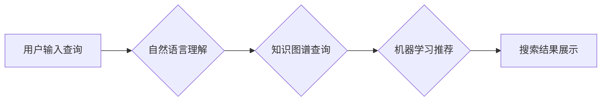

                 

## 搜索引擎与AI伦理的平衡

> 关键词：搜索引擎、人工智能、伦理、偏见、透明度、可解释性、公平性、隐私

### 1. 背景介绍

搜索引擎作为信息时代的核心基础设施，连接着用户和海量信息，其发展与人类社会息息相关。近年来，人工智能（AI）技术的飞速发展为搜索引擎带来了革命性的变革，例如自然语言处理、机器学习等技术，使得搜索引擎更加智能化、个性化。然而，AI技术的应用也带来了新的伦理挑战，例如算法偏见、数据隐私、信息操控等问题，这些问题需要我们认真思考和解决。

### 2. 核心概念与联系

搜索引擎的核心功能是根据用户查询关键词，从海量数据中检索出最相关的信息并进行排序展示。传统的搜索引擎主要依靠关键词匹配和网页链接分析算法来实现。而AI技术的应用，则使得搜索引擎能够更深入地理解用户意图，提供更精准、更个性化的搜索结果。

**AI与搜索引擎的融合主要体现在以下几个方面：**

* **自然语言理解 (NLU):** AI技术可以帮助搜索引擎理解用户自然语言的查询，而不是仅仅依赖关键词匹配。例如，用户可能使用更复杂的句子或带有隐含含义的查询，AI技术可以帮助搜索引擎识别这些意图，并提供更准确的搜索结果。
* **机器学习 (ML):** AI技术可以利用机器学习算法从海量数据中学习用户行为模式，从而个性化推荐搜索结果。例如，搜索引擎可以根据用户的搜索历史、浏览记录、地理位置等信息，预测用户可能感兴趣的内容，并将其推荐到搜索结果页面。
* **知识图谱 (KG):** AI技术可以构建知识图谱，将不同实体和关系进行连接，从而帮助搜索引擎理解查询背后的语义关系。例如，用户查询“苹果公司创始人”，搜索引擎可以利用知识图谱找到“苹果公司”和“史蒂夫·乔布斯”之间的关系，并提供更全面的搜索结果。

**Mermaid 流程图：**



### 3. 核心算法原理 & 具体操作步骤

#### 3.1  算法原理概述

搜索引擎的核心算法原理是通过对网页内容进行分析和排序，将与用户查询最相关的网页展示在搜索结果页面上。常见的搜索算法包括：

* **TF-IDF算法:** 基于词频和逆向文档频率，衡量词语在文档中的重要性。
* **PageRank算法:** 基于网页链接分析，衡量网页的重要性。
* **BM25算法:** 基于词频、文档长度和查询长度，衡量文档与查询的相关性。

#### 3.2  算法步骤详解

**以TF-IDF算法为例，其具体操作步骤如下：**

1. **词频统计:** 对网页内容中的每个词语进行统计，记录其在该网页中出现的次数。
2. **逆向文档频率计算:** 计算每个词语在整个文档集合中出现的频率，并将其作为逆向文档频率 (IDF) 值。IDF值越高，表示该词语在文档集合中越独特，其重要性越高。
3. **TF-IDF值计算:** 将词语在网页中的词频 (TF) 与其逆向文档频率 (IDF) 相乘，得到该词语在该网页中的 TF-IDF 值。
4. **网页评分:** 对网页中所有词语的 TF-IDF 值进行加权求和，得到该网页的总评分。
5. **排序展示:** 根据网页评分从高到低排序，将搜索结果展示给用户。

#### 3.3  算法优缺点

**TF-IDF算法的优点:**

* 计算简单，易于实现。
* 可以有效地衡量词语在文档中的重要性。

**TF-IDF算法的缺点:**

* 无法考虑词语之间的语义关系。
* 对长尾关键词的处理效果较差。

#### 3.4  算法应用领域

TF-IDF算法广泛应用于搜索引擎、文本挖掘、信息检索等领域。

### 4. 数学模型和公式 & 详细讲解 & 举例说明

#### 4.1  数学模型构建

TF-IDF算法的数学模型可以表示为：

$$TF-IDF(t, d) = TF(t, d) \times IDF(t)$$

其中：

* $TF-IDF(t, d)$ 表示词语 $t$ 在文档 $d$ 中的 TF-IDF 值。
* $TF(t, d)$ 表示词语 $t$ 在文档 $d$ 中的词频。
* $IDF(t)$ 表示词语 $t$ 在整个文档集合中的逆向文档频率。

#### 4.2  公式推导过程

* **词频 (TF):**

$$TF(t, d) = \frac{f(t, d)}{\sum_{i=1}^{N} f(i, d)}$$

其中：

* $f(t, d)$ 表示词语 $t$ 在文档 $d$ 中出现的次数。
* $N$ 表示文档 $d$ 中所有词语的总数。

* **逆向文档频率 (IDF):**

$$IDF(t) = log_{10} \frac{N}{df(t)}$$

其中：

* $N$ 表示整个文档集合的大小。
* $df(t)$ 表示词语 $t$ 在整个文档集合中出现的文档数。

#### 4.3  案例分析与讲解

假设有一个文档集合包含 1000 个文档，其中一个文档包含 10 个词语，其中“人工智能” 这个词语出现了 2 次。

* **词频 (TF):**

$$TF("人工智能", d) = \frac{2}{10} = 0.2$$

* **逆向文档频率 (IDF):**

假设“人工智能” 这个词语在整个文档集合中出现了 100 个文档。

$$IDF("人工智能") = log_{10} \frac{1000}{100} = log_{10} 10 = 1$$

* **TF-IDF 值:**

$$TF-IDF("人工智能", d) = 0.2 \times 1 = 0.2$$

### 5. 项目实践：代码实例和详细解释说明

#### 5.1  开发环境搭建

* Python 3.x
* scikit-learn 库
* NLTK 库

#### 5.2  源代码详细实现

```python
from sklearn.feature_extraction.text import TfidfVectorizer

# 文档集合
documents = [
    "人工智能是未来发展的重要方向",
    "机器学习是人工智能的重要组成部分",
    "深度学习是机器学习的一种重要算法"
]

# 创建 TF-IDF 向量化器
vectorizer = TfidfVectorizer()

# 将文档集合转换为 TF-IDF 向量
tfidf_matrix = vectorizer.fit_transform(documents)

# 打印 TF-IDF 向量
print(tfidf_matrix.toarray())
```

#### 5.3  代码解读与分析

* `TfidfVectorizer()` 创建 TF-IDF 向量化器对象。
* `fit_transform()` 方法将文档集合转换为 TF-IDF 向量。
* `toarray()` 方法将 TF-IDF 向量转换为 NumPy 数组，方便打印和分析。

#### 5.4  运行结果展示

运行上述代码，将输出一个 TF-IDF 向量矩阵，其中每一行代表一个文档，每一列代表一个词语，每个元素表示该词语在该文档中的 TF-IDF 值。

### 6. 实际应用场景

* **搜索引擎结果排序:** TF-IDF 算法可以用于衡量网页与用户查询的相关性，从而对搜索结果进行排序。
* **文本分类:** TF-IDF 算法可以用于提取文本中的关键词，并根据关键词的权重对文本进行分类。
* **信息检索:** TF-IDF 算法可以用于从海量文档中检索出与用户查询最相关的文档。

### 6.4  未来应用展望

随着人工智能技术的不断发展，搜索引擎将更加智能化、个性化。例如，搜索引擎将能够理解用户的隐含意图，提供更精准的搜索结果；搜索引擎将能够根据用户的兴趣爱好，推荐更相关的资讯和内容。

### 7. 工具和资源推荐

#### 7.1  学习资源推荐

* **书籍:**
    * "Introduction to Information Retrieval" by Christopher D. Manning, Prabhakar Raghavan, and Hinrich Schütze
    * "Mining the Social Web" by Matthew A. Russell
* **在线课程:**
    * Coursera: "Information Retrieval" by University of Washington
    * edX: "Natural Language Processing" by DeepLearning.AI

#### 7.2  开发工具推荐

* **Python:** 
    * scikit-learn: 机器学习库
    * NLTK: 自然语言处理库
    * SpaCy: 自然语言处理库
* **Elasticsearch:** 搜索引擎平台

#### 7.3  相关论文推荐

* "Learning to Rank for Information Retrieval" by Andrew Y. Ng and Daphne Koller
* "BERT: Pre-training of Deep Bidirectional Transformers for Language Understanding" by Jacob Devlin et al.

### 8. 总结：未来发展趋势与挑战

#### 8.1  研究成果总结

近年来，人工智能技术在搜索引擎领域取得了显著的进展，例如自然语言理解、机器学习、知识图谱等技术，使得搜索引擎更加智能化、个性化。

#### 8.2  未来发展趋势

* **更深层次的理解:** 搜索引擎将能够更深入地理解用户的意图，提供更精准、更个性化的搜索结果。
* **多模态搜索:** 搜索引擎将能够处理多种数据类型，例如文本、图像、音频、视频等，提供更丰富的搜索体验。
* **个性化推荐:** 搜索引擎将能够根据用户的兴趣爱好、行为模式等信息，提供更精准的个性化推荐。

#### 8.3  面临的挑战

* **算法偏见:** AI算法可能会受到训练数据的影响，导致算法偏见，从而影响搜索结果的公平性。
* **数据隐私:** 搜索引擎需要收集大量的用户数据，如何保护用户隐私是一个重要的挑战。
* **信息操控:** AI技术可以被用于操纵搜索结果，传播虚假信息，这需要我们加强监管和伦理约束。

#### 8.4  研究展望

未来，搜索引擎将继续朝着更智能化、更个性化、更安全的方向发展。我们需要加强对 AI 伦理的关注，制定相应的规范和制度，确保 AI 技术的健康发展。

### 9. 附录：常见问题与解答

* **什么是 TF-IDF 算法?**

TF-IDF 算法是一种用于衡量词语在文档中的重要性的算法。

* **TF-IDF 算法的优点是什么?**

TF-IDF 算法计算简单，易于实现，可以有效地衡量词语在文档中的重要性。

* **TF-IDF 算法的缺点是什么?**

TF-IDF 算法无法考虑词语之间的语义关系，对长尾关键词的处理效果较差。


作者：禅与计算机程序设计艺术 / Zen and the Art of Computer Programming 
<end_of_turn>

