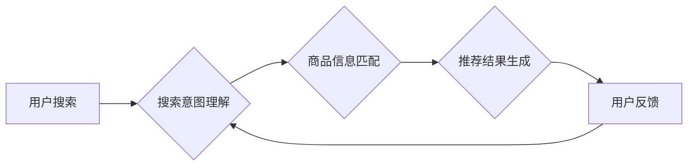

                 

## 1. 背景介绍

在当今数字经济时代，电商平台已成为人们获取商品和服务的首选方式。而搜索推荐系统作为电商平台的核心功能之一，直接影响着用户体验、转化率和平台的商业成功。传统的搜索推荐系统主要依赖于基于规则的算法和协同过滤技术，但随着用户行为数据的爆炸式增长和个性化需求的不断提升，这些传统方法已难以满足用户的需求。

近年来，人工智能（AI）技术，特别是深度学习技术，在搜索推荐领域取得了突破性进展。大模型的出现为搜索推荐系统带来了新的机遇和挑战。大模型具备强大的泛化能力和学习能力，能够从海量数据中学习到更复杂的模式和关系，从而提供更精准、个性化的推荐结果。

## 2. 核心概念与联系

### 2.1 搜索推荐系统

搜索推荐系统旨在根据用户的搜索历史、浏览记录、购买行为等数据，预测用户对特定商品的兴趣，并推荐相关商品。其核心目标是提高用户满意度和转化率。

### 2.2 AI 大模型

AI 大模型是指在海量数据上训练的深度学习模型，具有强大的泛化能力和学习能力。常见的AI大模型包括：

* **Transformer模型**: 擅长处理序列数据，例如文本和代码，在自然语言处理领域取得了显著成果。
* **BERT模型**: 基于Transformer架构，专门用于理解文本语义，在搜索引擎和问答系统中应用广泛。
* **GPT模型**: 能够生成流畅自然的文本，在文本创作、机器翻译等领域展现出强大的能力。

### 2.3 大模型融合

大模型融合是指将多个不同类型的AI大模型组合在一起，协同工作以完成更复杂的任务。例如，可以将Transformer模型用于理解用户搜索意图，将BERT模型用于匹配商品信息，将GPT模型用于生成个性化推荐文案。

**Mermaid 流程图**



## 3. 核心算法原理 & 具体操作步骤

### 3.1 算法原理概述

大模型融合在搜索推荐系统中的应用主要基于以下核心算法原理：

* **多模态融合**: 将文本、图像、视频等多种数据类型融合在一起，构建更全面的用户画像和商品信息。
* **知识图谱**: 利用知识图谱中的语义关系，增强商品信息的理解和匹配能力。
* **强化学习**: 通过用户反馈数据，不断优化推荐算法，提高推荐效果。

### 3.2 算法步骤详解

1. **数据预处理**: 收集用户行为数据、商品信息数据等，并进行清洗、转换、特征提取等预处理操作。
2. **模型训练**: 利用预处理后的数据，训练不同的AI大模型，例如Transformer模型、BERT模型、GPT模型等。
3. **模型融合**: 将训练好的不同类型模型组合在一起，构建一个完整的搜索推荐系统。
4. **推荐结果生成**: 根据用户的搜索请求，利用融合模型进行预测，生成个性化的推荐结果。
5. **用户反馈收集**: 收集用户的点击、购买、评价等反馈数据，用于模型的后续优化。

### 3.3 算法优缺点

**优点**:

* **精准度提升**: 大模型的强大学习能力能够从海量数据中学习到更复杂的模式和关系，从而提供更精准的推荐结果。
* **个性化增强**: 大模型融合能够结合多种数据类型和用户特征，提供更个性化的推荐体验。
* **可扩展性强**: 大模型架构灵活，可以根据实际需求进行扩展和调整。

**缺点**:

* **训练成本高**: 大模型的训练需要大量的计算资源和时间。
* **模型复杂度高**: 大模型的结构复杂，调试和维护难度较大。
* **数据依赖性强**: 大模型的性能依赖于训练数据的质量和数量。

### 3.4 算法应用领域

大模型融合在搜索推荐系统中的应用领域非常广泛，例如：

* **电商平台**: 推荐商品、个性化营销、用户画像分析等。
* **内容平台**: 推荐文章、视频、音乐等内容。
* **社交平台**: 推荐好友、群组、话题等。
* **金融平台**: 推荐理财产品、贷款服务等。

## 4. 数学模型和公式 & 详细讲解 & 举例说明

### 4.1 数学模型构建

大模型融合在搜索推荐系统中的数学模型通常基于以下几个方面：

* **用户兴趣建模**: 利用用户的历史行为数据，构建用户兴趣的数学模型，例如基于协同过滤的矩阵分解模型、基于深度学习的兴趣嵌入模型等。
* **商品特征建模**: 利用商品的属性信息、描述文本等，构建商品特征的数学模型，例如词嵌入模型、商品分类模型等。
* **推荐策略建模**: 根据用户兴趣和商品特征，设计推荐策略的数学模型，例如基于排序的推荐策略、基于概率的推荐策略等。

### 4.2 公式推导过程

例如，基于协同过滤的矩阵分解模型，其目标是学习用户-商品交互矩阵的低维表示，从而预测用户对商品的评分。

**公式**:

$$
R = U V^T
$$

其中：

* $R$ 是用户-商品交互矩阵。
* $U$ 是用户特征矩阵。
* $V$ 是商品特征矩阵。

通过最小化预测评分与实际评分之间的误差，可以学习到用户和商品的低维表示，从而实现推荐。

### 4.3 案例分析与讲解

例如，在电商平台中，可以利用大模型融合技术，构建一个个性化商品推荐系统。

* **用户兴趣建模**: 利用用户的浏览历史、购买记录、评价等数据，训练一个深度学习模型，学习用户的兴趣偏好。
* **商品特征建模**: 利用商品的属性信息、描述文本、图片等数据，训练一个词嵌入模型，学习商品的特征表示。
* **推荐策略建模**: 根据用户的兴趣偏好和商品特征，设计一个基于排序的推荐策略，将最符合用户兴趣的商品排在前面。

通过大模型融合，可以实现更精准、个性化的商品推荐，提高用户体验和转化率。

## 5. 项目实践：代码实例和详细解释说明

### 5.1 开发环境搭建

* **操作系统**: Linux/macOS
* **编程语言**: Python
* **深度学习框架**: TensorFlow/PyTorch
* **其他工具**: Git、Docker等

### 5*2 源代码详细实现

```python
# 导入必要的库
import tensorflow as tf

# 定义用户兴趣建模的模型
class UserInterestModel(tf.keras.Model):
    def __init__(self):
        super(UserInterestModel, self).__init__()
        # 定义模型层
        self.embedding = tf.keras.layers.Embedding(input_dim=vocab_size, output_dim=embedding_dim)
        self.dense = tf.keras.layers.Dense(units=128, activation='relu')
        self.output = tf.keras.layers.Dense(units=num_categories)

    def call(self, inputs):
        # 前向传播
        x = self.embedding(inputs)
        x = tf.reduce_mean(x, axis=1)
        x = self.dense(x)
        outputs = self.output(x)
        return outputs

# 定义商品特征建模的模型
class ItemFeatureModel(tf.keras.Model):
    # ...

# 定义推荐策略的模型
class RecommendationModel(tf.keras.Model):
    # ...

# 训练模型
model.compile(optimizer='adam', loss='mse')
model.fit(train_data, train_labels, epochs=10)

# 生成推荐结果
predictions = model.predict(test_data)
```

### 5.3 代码解读与分析

* **用户兴趣建模**: 使用Embedding层将用户的历史行为数据转换为向量表示，然后通过全连接层和输出层预测用户的兴趣类别。
* **商品特征建模**: 使用词嵌入模型学习商品的特征表示，例如Word2Vec、GloVe等。
* **推荐策略建模**: 根据用户的兴趣偏好和商品特征，设计一个基于排序的推荐策略，例如基于点积相似度的排序算法。

### 5.4 运行结果展示

通过训练和测试模型，可以评估推荐系统的性能，例如准确率、召回率、NDCG等指标。

## 6. 实际应用场景

### 6.1 电商平台

大模型融合在电商平台的应用场景非常广泛，例如：

* **商品推荐**: 根据用户的浏览历史、购买记录、评价等数据，推荐个性化的商品。
* **个性化营销**: 根据用户的兴趣偏好，推送个性化的广告和促销信息。
* **用户画像分析**: 利用用户的行为数据，构建用户画像，了解用户的消费习惯和需求。

### 6.2 内容平台

大模型融合在内容平台的应用场景包括：

* **内容推荐**: 根据用户的阅读历史、点赞记录等数据，推荐个性化的文章、视频、音乐等内容。
* **内容分类**: 利用大模型学习内容的语义特征，实现自动内容分类。
* **内容生成**: 利用大模型生成个性化的内容，例如新闻摘要、产品描述等。

### 6.3 社交平台

大模型融合在社交平台的应用场景包括：

* **好友推荐**: 根据用户的兴趣爱好和社交关系，推荐潜在的好友。
* **群组推荐**: 根据用户的兴趣爱好和群组属性，推荐合适的群组。
* **话题推荐**: 根据用户的兴趣爱好和热门话题，推荐相关的讨论话题。

### 6.4 未来应用展望

随着AI技术的不断发展，大模型融合在搜索推荐系统中的应用场景将更加广泛，例如：

* **多模态推荐**: 将文本、图像、视频等多种数据类型融合在一起，提供更丰富的推荐体验。
* **跨平台推荐**: 将用户行为数据跨平台整合，提供更精准的个性化推荐。
* **实时推荐**: 利用实时数据流，实现动态的推荐更新，提供更及时的信息。

## 7. 工具和资源推荐

### 7.1 学习资源推荐

* **书籍**:
    * 《深度学习》 - Ian Goodfellow, Yoshua Bengio, Aaron Courville
    * 《自然语言处理》 - Dan Jurafsky, James H. Martin
* **在线课程**:
    * Coursera: 深度学习 Specialization
    * Udacity: 自然语言处理 Nanodegree
* **博客**:
    * The Gradient
    * Towards Data Science

### 7.2 开发工具推荐

* **深度学习框架**: TensorFlow, PyTorch
* **自然语言处理库**: NLTK, spaCy
* **数据处理工具**: Pandas, NumPy

### 7.3 相关论文推荐

* BERT: Pre-training of Deep Bidirectional Transformers for Language Understanding
* GPT-3: Language Models are Few-Shot Learners
* Transformer: Attention Is All You Need

## 8. 总结：未来发展趋势与挑战

### 8.1 研究成果总结

大模型融合在搜索推荐系统中的应用取得了显著成果，能够提供更精准、个性化的推荐体验，提升用户满意度和平台商业成功。

### 8.2 未来发展趋势

* **模型规模和能力的提升**: 大模型的规模和能力将不断提升，能够学习到更复杂的模式和关系，提供更精准的推荐。
* **多模态融合的深入研究**: 将文本、图像、视频等多种数据类型融合在一起，提供更丰富的推荐体验。
* **个性化推荐的增强**: 利用更细粒度的用户特征和行为数据，提供更个性化的推荐。
* **可解释性和透明性的提升**: 研究大模型的决策机制，提高推荐结果的可解释性和透明性。

### 8.3 面临的挑战

* **训练成本**: 大模型的训练需要大量的计算资源和时间，成本较高。
* **模型复杂度**: 大模型的结构复杂，调试和维护难度较大。
* **数据依赖性**: 大模型的性能依赖于训练数据的质量和数量，数据获取和处理是一个挑战。
* **伦理和安全问题**: 大模型的应用可能带来伦理和安全问题，例如数据隐私、算法偏见等，需要引起重视。

### 8.4 研究展望

未来，大模型融合在搜索推荐系统中的研究将更加深入，探索更先进的模型架构、训练方法和应用场景，为用户提供更智能、更个性化的推荐体验。

## 9. 附录：常见问题与解答

* **Q1: 大模型融合的训练成本如何降低？**

* **A1**: 可以利用分布式训练、模型压缩、知识蒸馏等技术降低训练成本。

* **Q2: 如何解决大模型的模型复杂度问题？**

* **A2**: 可以采用模型剪枝、模型蒸馏等方法简化模型结构，提高模型的可解释性和维护性。

* **Q3: 如何保证大模型的公平性和避免算法偏见？**

* **A3**: 需要关注训练数据的代表性，采用公平性评估指标，并进行算法调优，尽量减少算法偏见。


作者：禅与计算机程序设计艺术 / Zen and the Art of Computer Programming 
<end_of_turn>

