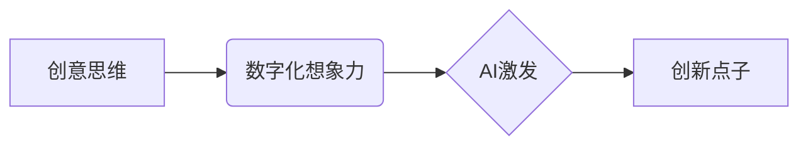

                 

##  数字化想象力培养皿：AI激发的创意思维孵化器

> 关键词：人工智能、创意思维、算法、数学模型、代码实现、应用场景、未来趋势

## 1. 背景介绍

在信息爆炸的时代，人类面临着前所未有的机遇和挑战。数据量的激增、计算能力的飞跃以及算法的不断进步，为我们打开了通往数字化想象力的新大门。人工智能（AI）作为科技发展的重要驱动力，正在深刻地改变着我们的生活和工作方式。

然而，AI技术本身并不能直接创造想象力。想象力是人类独有的能力，它源于对世界的不断探索、理解和重新组合。AI更像是一个强大的工具，可以帮助我们放大、加速和拓展想象力的边界。

本文将探讨如何利用AI技术构建“数字化想象力培养皿”，激发创意思维，孵化出更多创新点子。

## 2. 核心概念与联系

**2.1 创意思维**

创意思维是指能够产生新颖、独特、有价值的思想和概念的能力。它包括以下几个关键要素：

* **联想能力:**  能够从已有的知识和经验中，建立新的联系和关联。
* **想象力:**  能够构建虚拟场景，探索不同的可能性。
* **批判性思维:**  能够对想法进行评估和分析，识别优劣和潜在问题。
* **执行力:**  能够将想法付诸实践，创造出实际的产品或服务。

**2.2 数字化想象力**

数字化想象力是指在数字环境中，利用数据、算法和技术工具，进行创意思考和创新实践的能力。它融合了传统想象力与数字技术的优势，能够帮助我们：

* **探索更广阔的可能性:**  数据和算法可以提供丰富的素材和灵感，帮助我们突破思维定式，探索更广阔的可能性。
* **快速迭代和验证:**  数字工具可以帮助我们快速构建原型，进行实验和测试，缩短创新周期。
* **协同创作和分享:**  数字平台可以连接不同领域的专家和创作者，促进协同创作和知识共享。

**2.3 AI激发的创意思维**

人工智能技术正在为数字化想象力注入新的活力。AI算法能够：

* **自动生成创意内容:**  例如，AI可以根据给定的主题和风格，自动生成图像、音乐、文本等创意内容。
* **提供个性化建议:**  AI可以根据用户的兴趣和偏好，提供个性化的创意建议和灵感。
* **辅助创意决策:**  AI可以分析大量数据，帮助用户识别趋势和模式，做出更明智的创意决策。

**2.4  核心概念关系图**



## 3. 核心算法原理 & 具体操作步骤

**3.1 算法原理概述**

AI激发创意思维的核心算法主要包括：

* **生成对抗网络 (GAN):**  GAN由两个神经网络组成，一个是生成器，负责生成新的数据；另一个是鉴别器，负责判断数据是否真实。通过不断的对抗和学习，GAN能够生成越来越逼真的数据，包括图像、文本、音频等。
* **变分自编码器 (VAE):**  VAE是一种用于数据压缩和重构的算法。它将输入数据编码成一个低维表示，然后解码成原始数据。通过学习数据之间的潜在结构，VAE可以生成新的数据，并进行创意组合。
* **强化学习 (RL):**  RL是一种基于奖励机制的学习算法。它通过不断尝试和学习，找到最优的策略来完成任务。RL可以用于训练AI模型，使其能够根据用户的反馈，不断改进创意输出。

**3.2 算法步骤详解**

以GAN为例，其具体操作步骤如下：

1. **初始化生成器和鉴别器:**  随机初始化两个神经网络的权重。
2. **生成器训练:**  生成器根据随机噪声输入，生成新的数据样本。
3. **鉴别器训练:**  鉴别器对真实数据和生成器生成的假数据进行分类，并根据分类结果更新权重。
4. **迭代训练:**  重复步骤2和3，直到生成器能够生成逼真的数据，而鉴别器无法区分真实数据和假数据。

**3.3 算法优缺点**

**优点:**

* **生成新颖的创意内容:**  AI算法能够突破人类思维定式，生成全新的创意内容。
* **提高效率:**  AI可以自动化许多创意过程，提高效率和产出。
* **个性化定制:**  AI可以根据用户的需求，提供个性化的创意解决方案。

**缺点:**

* **缺乏情感和人文关怀:**  AI生成的创意可能缺乏情感和人文关怀。
* **伦理和版权问题:**  AI生成的创意内容的版权归属问题尚待解决。
* **算法偏见:**  AI算法可能受到训练数据的影响，产生偏见或歧视性结果。

**3.4 算法应用领域**

* **艺术创作:**  生成图像、音乐、文学作品等。
* **设计创新:**  设计产品、建筑、服装等。
* **营销推广:**  创作广告文案、视频、社交媒体内容等。
* **教育培训:**  提供个性化学习内容、模拟场景等。

## 4. 数学模型和公式 & 详细讲解 & 举例说明

**4.1 数学模型构建**

GAN的数学模型主要包括两个部分：生成器G和鉴别器D。

* **生成器G:**  输入随机噪声z，输出生成的数据样本x。

* **鉴别器D:**  输入数据样本x，输出判断该样本是否真实（真实为1，假为0）的概率。

**4.2 公式推导过程**

* **生成器损失函数:**  生成器希望生成的数据样本能够被鉴别器误判为真实数据。因此，生成器的损失函数是鉴别器对生成样本的判别概率的负值。

$$L_G(G,D) = -E_{z \sim p_z(z)}[log(D(G(z)))]$$

* **鉴别器损失函数:**  鉴别器希望能够正确区分真实数据和生成数据。因此，鉴别器的损失函数是真实数据和生成数据被误判的概率之和。

$$L_D(D,G) = -E_{x \sim p_{data}(x)}[log(D(x))] - E_{z \sim p_z(z)}[log(1-D(G(z)))]$$

**4.3 案例分析与讲解**

例如，在图像生成领域，GAN可以用来生成逼真的照片、风景画等。

* **训练数据:**  使用大量真实图像作为训练数据。
* **生成器:**  学习从随机噪声中生成图像。
* **鉴别器:**  学习区分真实图像和生成图像。

通过不断的训练，生成器能够生成越来越逼真的图像，而鉴别器也能够越来越准确地识别真实图像和生成图像。

## 5. 项目实践：代码实例和详细解释说明

**5.1 开发环境搭建**

* **操作系统:**  Linux或macOS
* **编程语言:**  Python
* **深度学习框架:**  TensorFlow或PyTorch
* **其他工具:**  Git、Jupyter Notebook

**5.2 源代码详细实现**

以下是一个简单的GAN代码示例，使用TensorFlow框架实现：

```python
import tensorflow as tf

# 定义生成器网络
def generator(z):
    # ...

# 定义鉴别器网络
def discriminator(x):
    # ...

# 定义损失函数和优化器
optimizer_G = tf.keras.optimizers.Adam(learning_rate=0.0002)
optimizer_D = tf.keras.optimizers.Adam(learning_rate=0.0002)

# 训练循环
for epoch in range(num_epochs):
    for batch in dataset:
        # 训练鉴别器
        with tf.GradientTape() as tape_D:
            real_output = discriminator(real_images)
            fake_output = discriminator(generated_images)
            loss_D = ...

        gradients_D = tape_D.gradient(loss_D, discriminator.trainable_variables)
        optimizer_D.apply_gradients(zip(gradients_D, discriminator.trainable_variables))

        # 训练生成器
        with tf.GradientTape() as tape_G:
            fake_output = discriminator(generated_images)
            loss_G = ...

        gradients_G = tape_G.gradient(loss_G, generator.trainable_variables)
        optimizer_G.apply_gradients(zip(gradients_G, generator.trainable_variables))

```

**5.3 代码解读与分析**

* **网络结构:**  代码中定义了生成器和鉴别器网络的结构。
* **损失函数:**  定义了生成器和鉴别器的损失函数，用于衡量模型的训练效果。
* **优化器:**  使用Adam优化器来更新模型参数。
* **训练循环:**  代码实现了训练循环，包括训练鉴别器和生成器。

**5.4 运行结果展示**

训练完成后，可以生成新的图像数据，并与真实图像进行比较。

## 6. 实际应用场景

**6.1 艺术创作**

* **图像生成:**  生成逼真的照片、风景画、人物肖像等。
* **音乐创作:**  生成新的音乐旋律、节奏和和声。
* **文学创作:**  生成诗歌、小说、剧本等。

**6.2 设计创新**

* **产品设计:**  生成新的产品外观、功能和结构。
* **建筑设计:**  生成新的建筑方案、布局和结构。
* **服装设计:**  生成新的服装款式、图案和颜色。

**6.3 营销推广**

* **广告文案创作:**  生成吸引人的广告文案、标语和 slogan。
* **视频制作:**  生成创意视频、动画和特效。
* **社交媒体内容:**  生成个性化的社交媒体内容，例如图片、文字、视频等。

**6.4 未来应用展望**

* **个性化教育:**  根据学生的学习风格和需求，生成个性化的学习内容和教学方案。
* **医疗诊断:**  辅助医生进行疾病诊断，例如识别病灶、预测病情发展等。
* **科学研究:**  加速科学研究，例如模拟实验、探索新材料等。

## 7. 工具和资源推荐

**7.1 学习资源推荐**

* **书籍:**

    * 《深度学习》
    * 《生成对抗网络》
    * 《机器学习实战》

* **在线课程:**

    * Coursera: 深度学习
    * Udacity: 
    * fast.ai: 深度学习

**7.2 开发工具推荐**

* **深度学习框架:**

    * TensorFlow
    * PyTorch
    * Keras

* **编程语言:**

    * Python

* **数据可视化工具:**

    * Matplotlib
    * Seaborn

**7.3 相关论文推荐**

* 《Generative Adversarial Networks》
* 《Deep Convolutional Generative Adversarial Networks》
* 《Progressive Growing of GANs for Improved Quality, Stability, and Variation》

## 8. 总结：未来发展趋势与挑战

**8.1 研究成果总结**

近年来，AI技术在创意领域取得了显著进展，例如图像生成、文本创作、音乐作曲等。GAN、VAE等算法为AI激发创意思维提供了强大的工具。

**8.2 未来发展趋势**

* **更强大的算法:**  研究更强大的AI算法，能够生成更高质量、更具创意的输出。
* **跨模态生成:**  实现不同模态（例如文本、图像、音频）之间的跨模态生成。
* **个性化定制:**  根据用户的需求和偏好，提供更个性化的创意解决方案。
* **伦理和社会影响:**  深入研究AI激发创意思维的伦理和社会影响，确保其安全、可控和可持续发展。

**8.3 面临的挑战**

* **算法可解释性:**  AI算法的决策过程往往难以理解，这可能会导致信任问题和伦理争议。
* **数据偏见:**  AI算法可能受到训练数据的影响，产生偏见或歧视性结果。
* **版权和知识产权:**  AI生成的创意内容的版权归属问题尚待解决。

**8.4 研究展望**

未来，我们需要继续探索AI激发创意思维的可能性，并积极应对其带来的挑战。通过跨学科合作，我们可以构建更加安全、可控和可持续的数字化想象力培养皿，为人类社会创造更多价值。


## 9. 附录：常见问题与解答

**9.1 如何选择合适的AI算法？**

选择合适的AI算法取决于具体的应用场景和需求。例如，如果需要生成逼真的图像，可以使用GAN；如果需要压缩和重构数据，可以使用VAE。

**9.2 如何解决AI算法的偏见问题？**

可以通过以下方法解决AI算法的偏见问题：

* 使用更全面、更代表性的训练数据。
* 开发算法去偏见的方法。
* 对AI算法的输出进行人工审核和修正。

**9.3 AI生成的创意内容的版权归属问题如何解决？**

目前，AI生成的创意内容的版权归属问题尚无定论。需要通过法律法规和社会共识来解决。

**9.4 如何学习AI激发创意思维的相关知识？**

可以通过阅读书籍、参加在线课程、学习开源代码等方式学习相关知识。

**9.5 未来AI激发创意思维的发展趋势是什么？**

未来AI激发创意思维的发展趋势包括：更强大的算法、跨模态生成、个性化定制、伦理和社会影响等方面。


作者：禅与计算机程序设计艺术 / Zen and the Art of Computer Programming 
<end_of_turn>

