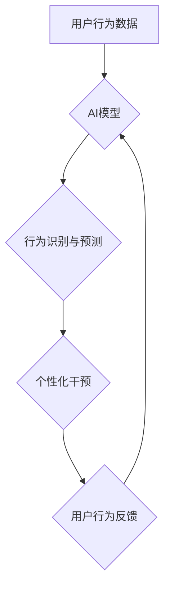

                 

## 数字化意志力：AI增强的自我控制

> 关键词：人工智能、意志力、自我控制、行为调节、深度学习、强化学习、数字健康

### 1. 背景介绍

在当今信息爆炸的时代，我们面临着前所未有的诱惑和干扰。从社交媒体的推送到电子游戏的吸引，从购物网站的促销到各种信息流的轰炸，我们的注意力和意志力不断受到挑战。这使得自我控制变得越来越重要，它成为我们保持专注、实现目标和过上充实生活的关键。然而，人类的意志力并非永不枯竭的资源，它会随着时间推移而减弱，尤其是在面对持续的诱惑和压力时。

人工智能（AI）技术的快速发展为增强自我控制提供了新的可能性。通过利用AI的强大计算能力和学习能力，我们可以开发出智能系统来帮助我们识别、理解和应对各种诱惑，从而提升我们的意志力，实现更有效的自我调节。

### 2. 核心概念与联系

**2.1  意志力与自我控制**

意志力是指我们克服冲动、延迟满足和坚持目标的能力。它是一个复杂的认知过程，涉及到多个脑区和神经递质的协同作用。自我控制则是意志力的具体体现，它指的是我们能够根据自己的目标和价值观，控制自己的行为和情绪，从而实现预期的结果。

**2.2  AI增强自我控制**

AI增强自我控制是指利用人工智能技术来辅助人类提升自我控制能力。这可以通过多种方式实现，例如：

* **行为识别和预测:** AI算法可以分析我们的行为模式，识别潜在的诱惑和风险因素，并预测我们可能面临的自我控制挑战。
* **个性化干预:** 基于对个体行为和心理特征的分析，AI系统可以提供个性化的建议和干预措施，帮助我们更好地应对诱惑和挑战。
* **反馈和奖励机制:** AI系统可以提供实时反馈和奖励，鼓励我们坚持目标和做出积极的行为选择。

**2.3  核心架构**



### 3. 核心算法原理 & 具体操作步骤

**3.1  算法原理概述**

AI增强自我控制的核心算法通常基于深度学习和强化学习。

* **深度学习:** 用于分析用户行为数据，识别模式和特征，并构建行为预测模型。
* **强化学习:** 用于训练AI系统，使其能够根据用户的行为反馈，调整干预策略，并最终实现自我控制目标。

**3.2  算法步骤详解**

1. **数据收集:** 收集用户的行为数据，例如浏览记录、社交媒体活动、睡眠时间等。
2. **数据预处理:** 对收集到的数据进行清洗、转换和特征提取，以便于AI模型的训练。
3. **模型训练:** 利用深度学习算法训练行为预测模型，并利用强化学习算法训练AI干预系统。
4. **行为识别与预测:** 将用户的实时行为数据输入到训练好的模型中，识别潜在的诱惑和风险因素，并预测用户可能面临的自我控制挑战。
5. **个性化干预:** 根据用户的行为特征和预测结果，AI系统提供个性化的干预措施，例如提醒用户保持专注、提供替代行为建议、调整环境设置等。
6. **反馈收集与模型更新:** 收集用户的行为反馈，并将其用于更新AI模型，使其能够不断优化干预策略。

**3.3  算法优缺点**

**优点:**

* **个性化:** AI系统可以根据用户的个体特征提供个性化的干预措施。
* **实时性:** AI系统可以实时识别和应对用户的行为挑战。
* **可持续性:** AI系统可以不断学习和优化，提高自我控制效果。

**缺点:**

* **数据依赖:** AI算法需要大量的数据进行训练，否则效果可能不佳。
* **隐私问题:** 收集和使用用户的行为数据可能会引发隐私问题。
* **伦理问题:** AI系统在干预用户行为时，需要考虑伦理问题，避免过度干预或侵犯用户自由意志。

**3.4  算法应用领域**

* **数字健康:** 帮助用户控制饮食、锻炼、睡眠等健康行为。
* **学习与工作:** 帮助用户提高专注力、克服拖延症、提高工作效率。
* **情绪管理:** 帮助用户识别和调节情绪，缓解压力和焦虑。
* **社交行为:** 帮助用户控制社交媒体使用时间、避免网络成瘾。

### 4. 数学模型和公式 & 详细讲解 & 举例说明

**4.1  数学模型构建**

我们可以使用马尔可夫决策过程（MDP）来建模AI增强自我控制系统。

* **状态空间:** 用户的行为状态，例如当前正在做什么、情绪状态等。
* **动作空间:** AI系统可以采取的干预动作，例如提醒用户、提供替代行为建议等。
* **奖励函数:** 衡量用户行为是否符合目标，例如完成任务、保持专注等。
* **转移概率:** 用户从一个状态转移到另一个状态的概率，受用户行为和AI干预的影响。

**4.2  公式推导过程**

强化学习的目标是找到一个策略，使得在长期的交互过程中，用户获得最大的总奖励。可以使用贝尔曼方程来更新策略，公式如下：

$$
V(s) = \max_{\alpha} \sum_{s'} P(s' | s, \alpha) [R(s, \alpha, s') + \gamma V(s')]
$$

其中：

* $V(s)$ 是状态 $s$ 的价值函数。
* $\alpha$ 是策略。
* $P(s' | s, \alpha)$ 是从状态 $s$ 到状态 $s'$ 的转移概率。
* $R(s, \alpha, s')$ 是从状态 $s$ 执行动作 $\alpha$ 到状态 $s'$ 的奖励。
* $\gamma$ 是折扣因子，控制未来奖励的权重。

**4.3  案例分析与讲解**

假设我们想训练一个AI系统来帮助用户控制手机使用时间。我们可以将手机使用时间作为状态空间，使用时间限制、提醒用户等动作作为动作空间，将用户完成目标任务的次数作为奖励函数。通过训练强化学习模型，AI系统可以学习到最佳的干预策略，帮助用户控制手机使用时间，提高工作效率。

### 5. 项目实践：代码实例和详细解释说明

**5.1  开发环境搭建**

* Python 3.x
* TensorFlow 或 PyTorch 深度学习框架
* NumPy 科学计算库
* Pandas 数据处理库

**5.2  源代码详细实现**

```python
# 使用 TensorFlow 构建一个简单的行为预测模型
import tensorflow as tf

# 定义模型结构
model = tf.keras.models.Sequential([
    tf.keras.layers.Dense(64, activation='relu', input_shape=(10,)),
    tf.keras.layers.Dense(32, activation='relu'),
    tf.keras.layers.Dense(1, activation='sigmoid')
])

# 编译模型
model.compile(optimizer='adam', loss='binary_crossentropy', metrics=['accuracy'])

# 训练模型
model.fit(X_train, y_train, epochs=10)

# 使用模型预测用户行为
predictions = model.predict(X_test)
```

**5.3  代码解读与分析**

这段代码展示了如何使用 TensorFlow 构建一个简单的行为预测模型。

* 首先，定义了模型结构，包括输入层、隐藏层和输出层。
* 然后，编译了模型，指定了优化器、损失函数和评价指标。
* 最后，训练了模型，并使用模型预测用户行为。

**5.4  运行结果展示**

训练完成后，我们可以评估模型的性能，例如准确率、召回率等。

### 6. 实际应用场景

**6.1  数字健康**

AI增强自我控制可以帮助用户管理健康行为，例如控制饮食、锻炼、睡眠等。例如，AI系统可以根据用户的健康目标，提供个性化的饮食建议和运动计划，并提醒用户按时服药或进行健康检查。

**6.2  学习与工作**

AI增强自我控制可以帮助用户提高专注力、克服拖延症、提高工作效率。例如，AI系统可以识别用户正在进行哪些任务，并根据任务类型提供相应的干预措施，例如提醒用户休息、屏蔽干扰网站等。

**6.3  情绪管理**

AI增强自我控制可以帮助用户识别和调节情绪，缓解压力和焦虑。例如，AI系统可以分析用户的语音和文本数据，识别用户的负面情绪，并提供相应的建议，例如进行深呼吸、听舒缓的音乐等。

**6.4  未来应用展望**

随着人工智能技术的不断发展，AI增强自我控制的应用场景将更加广泛。未来，AI系统将能够更加深入地理解用户的行为模式和心理特征，提供更加个性化和有效的干预措施。

### 7. 工具和资源推荐

**7.1  学习资源推荐**

* **书籍:**《深度学习》、《强化学习：原理、算法和应用》
* **在线课程:** Coursera、edX、Udacity 等平台上的深度学习和强化学习课程。

**7.2  开发工具推荐**

* **TensorFlow:** 开源深度学习框架。
* **PyTorch:** 开源深度学习框架。
* **Keras:** 高级深度学习API，可以运行在 TensorFlow、Theano 或 CNTK 后端。

**7.3  相关论文推荐**

* **Deep Reinforcement Learning for Personalized Health Interventions**
* **Towards AI-Powered Self-Control: A Survey**

### 8. 总结：未来发展趋势与挑战

**8.1  研究成果总结**

AI增强自我控制是一个新兴的研究领域，取得了一些重要的进展。例如，已经开发出一些可以帮助用户控制手机使用时间、提高学习效率、缓解压力等方面的AI系统。

**8.2  未来发展趋势**

未来，AI增强自我控制的研究将朝着以下几个方向发展：

* **更加个性化的干预:** 利用更先进的AI算法，对用户的行为模式和心理特征进行更深入的理解，提供更加个性化的干预措施。
* **更加智能的干预策略:** 利用强化学习等算法，训练AI系统能够自主学习和优化干预策略，提高干预效果。
* **跨领域应用:** 将AI增强自我控制技术应用到更多领域，例如教育、医疗、金融等。

**8.3  面临的挑战**

AI增强自我控制技术也面临一些挑战：

* **数据隐私:** 收集和使用用户的行为数据可能会引发隐私问题，需要采取有效的隐私保护措施。
* **伦理问题:** AI系统在干预用户行为时，需要考虑伦理问题，避免过度干预或侵犯用户自由意志。
* **技术复杂性:** 开发和部署AI增强自我控制系统需要复杂的技术知识和资源。

**8.4  研究展望**

尽管面临挑战，但AI增强自我控制技术具有巨大的潜力，可以帮助人们更好地管理自己的行为，实现自我提升。未来，我们需要加强对该技术的研发和应用，并积极探索其伦理和社会影响，确保其能够真正造福人类。

### 9. 附录：常见问题与解答

**9.1  AI系统会取代人类的意志力吗？**

AI增强自我控制技术旨在帮助人类提升自我控制能力，而不是取代人类的意志力。AI系统只是一个工具，最终的决策权仍然掌握在人类手中。

**9.2  AI系统如何保证用户的隐私安全？**

开发AI增强自我控制系统时，需要采取有效的隐私保护措施，例如数据加密、匿名化处理等，确保用户的隐私安全。

**9.3  如何评估AI增强自我控制系统的效果？**

可以根据用户的行为变化、目标完成情况等指标来评估AI增强自我控制系统的效果。


作者：禅与计算机程序设计艺术 / Zen and the Art of Computer Programming 
<end_of_turn>

