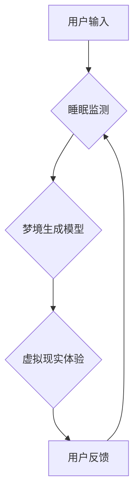

                 

## 数字化梦境：AI生成的睡眠体验

> 关键词：人工智能、睡眠、梦境生成、神经网络、深度学习、虚拟现实、生物反馈

## 1. 背景介绍

睡眠是人类维持身心健康不可或缺的自然状态。然而，现代社会生活节奏快，压力大，导致睡眠质量下降成为普遍问题。人们渴望拥有更舒适、更具控制性的睡眠体验，而人工智能技术为实现这一目标提供了新的可能性。

近年来，人工智能领域取得了长足进步，特别是深度学习技术的突破，为模拟和生成复杂的人类体验，如语言、图像、音乐等，提供了强大的工具。将人工智能应用于睡眠体验，可以实现以下目标：

* **个性化睡眠环境：**根据用户的睡眠习惯、偏好和生理状态，动态调整睡眠环境，如温度、湿度、光线、声音等，营造更舒适的睡眠氛围。
* **引导睡眠：**通过人工智能算法生成舒缓的音乐、自然声音或引导性语音，帮助用户放松身心，更快入睡。
* **改善睡眠质量：**监测用户的睡眠状态，识别睡眠障碍，并提供个性化的建议和干预措施，例如调整睡眠时间、改善睡眠环境等。
* **生成梦境体验：**利用人工智能技术模拟和生成梦境，为用户提供沉浸式的虚拟睡眠体验，帮助他们探索潜意识，体验不同的世界。

## 2. 核心概念与联系

### 2.1  睡眠与梦境

睡眠是一个复杂的生理过程，包括不同的睡眠阶段，其中快速眼动睡眠（REM）阶段与梦境密切相关。在REM阶段，大脑活动活跃，神经元连接强度增强，导致我们产生生动的梦境。

### 2.2  人工智能与梦境生成

人工智能技术可以模拟和生成人类体验，包括梦境。梦境生成的核心是理解梦境的结构和内容，并利用人工智能算法生成符合这些结构和内容的虚拟体验。

### 2.3  技术架构

**Mermaid 流程图**



**架构说明：**

* **用户输入：**用户提供睡眠数据、个人偏好、梦境主题等信息。
* **睡眠监测：**利用生物传感器监测用户的睡眠状态，如脑电波、心率、呼吸等。
* **梦境生成模型：**基于深度学习算法，利用用户输入和睡眠数据生成虚拟梦境体验。
* **虚拟现实体验：**通过VR设备呈现生成的梦境，提供沉浸式的体验。
* **用户反馈：**用户对梦境体验进行评价，反馈信息用于模型训练和优化。

## 3. 核心算法原理 & 具体操作步骤

### 3.1  算法原理概述

梦境生成模型通常基于深度学习算法，例如生成对抗网络（GAN）和变分自编码器（VAE）。

* **生成对抗网络（GAN）：**由生成器和判别器两部分组成。生成器负责生成梦境内容，判别器负责判断生成的梦境是否真实。两者相互竞争，生成器不断改进生成内容，判别器不断提高判断能力，最终达到生成逼真梦境的平衡。
* **变分自编码器（VAE）：**将输入数据编码成低维表示，然后解码成输出数据。在梦境生成中，VAE可以学习梦境的潜在结构，并根据用户输入生成符合这些结构的虚拟梦境。

### 3.2  算法步骤详解

**使用GAN生成梦境：**

1. **训练判别器：**使用真实梦境数据训练判别器，使其能够区分真实梦境和生成梦境。
2. **训练生成器：**使用判别器反馈的意见，训练生成器生成逼真的梦境内容。
3. **生成梦境：**根据用户输入和训练好的生成器，生成个性化的虚拟梦境体验。

**使用VAE生成梦境：**

1. **训练编码器：**使用真实梦境数据训练编码器，使其能够将梦境内容编码成低维表示。
2. **训练解码器：**使用编码器生成的低维表示训练解码器，使其能够解码成逼真的梦境内容。
3. **生成梦境：**根据用户输入和训练好的编码器和解码器，生成个性化的虚拟梦境体验。

### 3.3  算法优缺点

**GAN：**

* **优点：**可以生成逼真的、多样化的梦境内容。
* **缺点：**训练过程复杂，容易陷入局部最优解，生成梦境可能存在不稳定性。

**VAE：**

* **优点：**训练过程相对稳定，可以生成符合特定结构的梦境内容。
* **缺点：**生成的梦境可能缺乏多样性和逼真度。

### 3.4  算法应用领域

* **睡眠辅助治疗：**帮助睡眠障碍患者改善睡眠质量，缓解焦虑和压力。
* **心理治疗：**利用梦境生成技术帮助患者探索潜意识，处理心理问题。
* **娱乐体验：**为用户提供沉浸式的虚拟梦境体验，拓展娱乐方式。
* **艺术创作：**利用梦境生成技术创作新的艺术作品，探索梦境的艺术价值。

## 4. 数学模型和公式 & 详细讲解 & 举例说明

### 4.1  数学模型构建

梦境生成模型通常基于神经网络，其数学模型可以表示为：

$$
y = f(W_1x_1 + b_1)
$$

其中：

* $y$：生成的梦境内容
* $x_1$：用户输入数据
* $W_1$：权重矩阵
* $b_1$：偏置项
* $f$：激活函数

### 4.2  公式推导过程

GAN的训练过程涉及到两个损失函数：

* **生成器损失函数：**

$$
L_G = E_{x \sim p_{data}(x)}[D(G(z))]
$$

其中：

* $p_{data}(x)$：真实梦境数据的分布
* $D(G(z))$：判别器对生成梦境$G(z)$的判断结果

* **判别器损失函数：**

$$
L_D = E_{x \sim p_{data}(x)}[D(x)] + E_{z \sim p_z(z)}[1 - D(G(z))]
$$

其中：

* $p_z(z)$：噪声输入$z$的分布

### 4.3  案例分析与讲解

假设我们使用GAN生成梦境，其中生成器网络结构为多层感知机，判别器网络结构为卷积神经网络。

* **训练过程：**

1. 首先，使用真实梦境数据训练判别器，使其能够区分真实梦境和生成梦境。
2. 然后，使用训练好的判别器反馈意见，训练生成器生成逼真的梦境内容。
3. 迭代训练，直到生成器能够生成逼真且多样化的梦境内容。

* **案例：**

可以使用预训练的图像生成模型，例如DALL-E 2，根据用户的文字描述生成梦境图像。例如，用户输入“飞翔在云朵上”，模型可以生成相应的梦境图像。

## 5. 项目实践：代码实例和详细解释说明

### 5.1  开发环境搭建

* **操作系统：**Linux或macOS
* **编程语言：**Python
* **深度学习框架：**TensorFlow或PyTorch
* **虚拟现实框架：**OpenVR或SteamVR

### 5.2  源代码详细实现

以下是一个使用TensorFlow构建简单梦境生成模型的代码示例：

```python
import tensorflow as tf

# 定义生成器网络结构
def generator(z):
  # ...

# 定义判别器网络结构
def discriminator(x):
  # ...

# 定义损失函数和优化器
# ...

# 训练模型
# ...

# 生成梦境
dream = generator(z)
```

### 5.3  代码解读与分析

* **生成器网络：**负责生成梦境内容，通常是一个多层感知机或卷积神经网络。
* **判别器网络：**负责判断梦境内容是否真实，通常是一个卷积神经网络。
* **损失函数：**用于衡量生成器和判别器的性能，通常是二分类交叉熵损失函数。
* **优化器：**用于更新生成器和判别器的权重，通常是Adam优化器。

### 5.4  运行结果展示

训练好的模型可以根据用户输入生成虚拟梦境体验，并通过VR设备呈现给用户。

## 6. 实际应用场景

### 6.1  睡眠辅助治疗

梦境生成技术可以帮助睡眠障碍患者改善睡眠质量。例如，可以生成舒缓的梦境，帮助患者放松身心，更快入睡。

### 6.2  心理治疗

梦境可以反映个人的潜意识和心理状态。利用梦境生成技术，可以帮助患者探索潜意识，处理心理问题。

### 6.3  娱乐体验

梦境生成技术可以为用户提供沉浸式的虚拟梦境体验，拓展娱乐方式。例如，可以生成奇幻、科幻、恐怖等不同类型的梦境，满足用户的不同需求。

### 6.4  未来应用展望

随着人工智能技术的不断发展，梦境生成技术将有更广泛的应用场景，例如：

* **教育培训：**利用梦境生成技术创造沉浸式的学习环境，提高学习效率。
* **艺术创作：**利用梦境生成技术创作新的艺术作品，探索梦境的艺术价值。
* **科学研究：**利用梦境生成技术研究梦境的本质，探索人类意识的奥秘。

## 7. 工具和资源推荐

### 7.1  学习资源推荐

* **书籍：**

* 《深度学习》 by Ian Goodfellow, Yoshua Bengio, and Aaron Courville
* 《Generative Deep Learning》 by David Foster

* **在线课程：**

* Coursera: Deep Learning Specialization
* Udacity: Deep Learning Nanodegree

### 7.2  开发工具推荐

* **深度学习框架：**TensorFlow, PyTorch
* **虚拟现实框架：**OpenVR, SteamVR
* **编程语言：**Python

### 7.3  相关论文推荐

* **Generative Adversarial Networks** by Ian Goodfellow et al. (2014)
* **Variational Autoencoders for Generation** by Diederik P. Kingma and Max Welling (2013)

## 8. 总结：未来发展趋势与挑战

### 8.1  研究成果总结

梦境生成技术近年来取得了显著进展，能够生成逼真且多样化的梦境内容。

### 8.2  未来发展趋势

* **更逼真的梦境生成：**

通过改进算法模型和训练方法，生成更逼真、更具沉浸感的梦境体验。
* **个性化梦境生成：**

根据用户的个人喜好、睡眠习惯和心理状态，生成个性化的梦境体验。
* **交互式梦境生成：**

允许用户在梦境中进行交互，影响梦境的走向和内容。

### 8.3  面临的挑战

* **伦理问题：**梦境生成技术可能引发伦理问题，例如梦境内容的真实性、用户隐私保护等。
* **技术瓶颈：**梦境生成技术仍然面临着技术瓶颈，例如如何更好地模拟梦境的复杂性和随机性。
* **商业模式：**梦境生成技术的商业模式尚不成熟，需要探索新的商业模式和盈利方式。

### 8.4  研究展望

未来，梦境生成技术将继续发展，并应用于更广泛的领域。

## 9. 附录：常见问题与解答

* **Q：梦境生成技术是否安全？**

A：梦境生成技术本身是安全的，但需要谨慎使用。例如，在使用梦境生成技术进行心理治疗时，需要由专业的心理医生指导。

* **Q：梦境生成技术是否会让人上瘾？**

A：梦境生成技术可能会让人上瘾，因为梦境体验非常吸引人。因此，需要合理使用，避免过度沉迷。

* **Q：梦境生成技术会取代现实生活吗？**

A：梦境生成技术不会取代现实生活，而是可以丰富现实生活的体验。


作者：禅与计算机程序设计艺术 / Zen and the Art of Computer Programming 
<end_of_turn>

