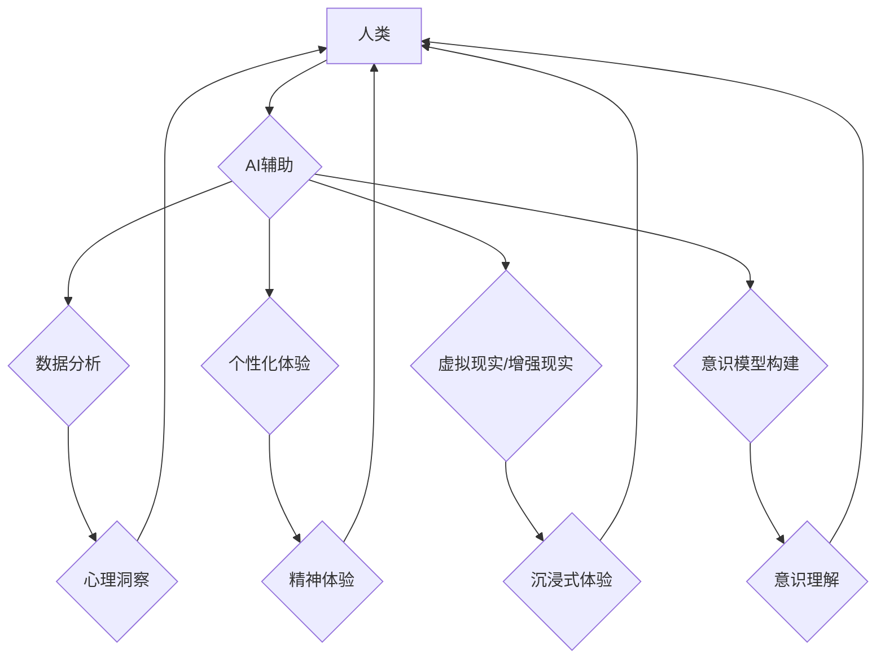

                 

## 数字化灵性：AI辅助的精神探索

> 关键词：人工智能、精神探索、数字化体验、意识模型、认知增强、伦理困境、未来趋势

## 1. 背景介绍

在信息爆炸的时代，科技发展日新月异，人工智能（AI）作为科技发展的重要支柱，正在深刻地改变着我们的生活方式和认知模式。从智能手机的语音助手到自动驾驶汽车，AI技术的应用无处不在，它不仅提高了我们的生活效率，也引发了人们对自身意识、存在和未来发展的深刻思考。

传统上，精神探索一直是人类文明发展的重要组成部分，它涉及到对自身内心世界、宇宙奥秘和人生意义的探究。然而，随着科技的进步，我们开始意识到，数字化世界也为精神探索提供了新的可能性。AI技术能够帮助我们更深入地了解自身认知机制，探索意识的本质，并构建更丰富的数字化体验，从而拓展人类精神的边界。

## 2. 核心概念与联系

**2.1  数字化灵性**

数字化灵性是指在数字化时代，通过AI技术辅助，探索和提升自身精神境界的一种新模式。它融合了传统精神探索的内涵和现代科技的优势，旨在通过数字化体验，帮助人们更深刻地理解自身、连接世界，并最终实现精神上的成长和升华。

**2.2  AI辅助精神探索**

AI技术可以为精神探索提供以下方面的支持：

* **数据分析与洞察：** AI能够分析海量数据，识别人类行为模式和心理特征，帮助人们更深入地了解自身内心世界。
* **个性化体验定制：** AI可以根据个人的需求和喜好，定制个性化的精神探索体验，例如冥想、瑜伽、艺术创作等。
* **虚拟现实与增强现实：** VR/AR技术可以构建沉浸式的虚拟环境，为人们提供更丰富的精神体验，例如模拟宗教仪式、探索宇宙奥秘等。
* **意识模型构建：** AI研究者正在尝试构建意识模型，试图理解意识的本质和运作机制，这对于人类精神探索具有重要的意义。

**2.3  架构图**



## 3. 核心算法原理 & 具体操作步骤

**3.1  算法原理概述**

AI辅助精神探索的核心算法主要包括：自然语言处理（NLP）、机器学习（ML）、深度学习（DL）等。

* **NLP:** 用于理解和分析人类语言，例如识别情绪、解读文本含义、生成对话等。
* **ML:** 用于从数据中学习模式和规律，例如预测用户行为、推荐个性化内容等。
* **DL:** 用于构建更复杂的模型，例如识别图像、语音、音乐等，并进行更深入的理解和分析。

**3.2  算法步骤详解**

1. **数据收集:** 收集用户行为数据、心理特征数据、精神体验数据等。
2. **数据预处理:** 对数据进行清洗、转换、格式化等处理，使其适合算法训练。
3. **模型训练:** 使用NLP、ML、DL等算法对数据进行训练，构建相应的模型。
4. **模型评估:** 对模型进行评估，测试其准确率、效率等指标。
5. **个性化体验定制:** 根据用户的需求和喜好，利用训练好的模型提供个性化的精神探索体验。

**3.3  算法优缺点**

**优点:**

* **个性化:** 可以根据用户的需求和喜好提供个性化的体验。
* **效率:** 可以快速分析大量数据，提供更深入的洞察。
* **可扩展性:** 可以不断学习新的数据，提升模型的准确性和效率。

**缺点:**

* **数据依赖:** 算法的性能取决于数据的质量和数量。
* **伦理问题:** 存在数据隐私、算法偏见等伦理问题需要谨慎处理。
* **意识本质的理解:** 目前AI技术还无法完全理解意识的本质，需要进一步研究和探索。

**3.4  算法应用领域**

* **精神健康:** 辅助治疗焦虑、抑郁等心理问题。
* **个人成长:** 提供个性化的冥想、瑜伽、艺术创作等体验，帮助人们提升自我认知和精神境界。
* **教育培训:** 构建沉浸式的虚拟学习环境，帮助人们更深入地理解哲学、宗教等精神文化。

## 4. 数学模型和公式 & 详细讲解 & 举例说明

**4.1  数学模型构建**

在AI辅助精神探索中，可以使用神经网络模型来模拟人类大脑的运作机制。神经网络模型由多个层级的神经元组成，每个神经元接收来自其他神经元的输入信号，并根据一定的权重进行计算，最终输出信号。

**4.2  公式推导过程**

神经网络模型的学习过程可以看作是一个参数优化过程。目标是找到最优的权重，使得模型的输出与实际目标尽可能接近。常用的优化算法包括梯度下降法、动量法、Adam算法等。

**梯度下降法:**

$$
\theta = \theta - \alpha \nabla J(\theta)
$$

其中：

* $\theta$ 是模型的参数
* $\alpha$ 是学习率
* $\nabla J(\theta)$ 是损失函数 $J(\theta)$ 的梯度

**4.3  案例分析与讲解**

例如，在构建一个AI辅助冥想应用程序时，可以使用神经网络模型来分析用户的脑电波信号，识别冥想状态，并提供相应的指导和反馈。

## 5. 项目实践：代码实例和详细解释说明

**5.1  开发环境搭建**

* Python 3.x
* TensorFlow/PyTorch 等深度学习框架
* Jupyter Notebook 等开发环境

**5.2  源代码详细实现**

```python
import tensorflow as tf

# 定义神经网络模型
model = tf.keras.models.Sequential([
    tf.keras.layers.Dense(128, activation='relu', input_shape=(100,)),
    tf.keras.layers.Dense(64, activation='relu'),
    tf.keras.layers.Dense(1, activation='sigmoid')
])

# 编译模型
model.compile(optimizer='adam', loss='binary_crossentropy', metrics=['accuracy'])

# 训练模型
model.fit(X_train, y_train, epochs=10)

# 评估模型
loss, accuracy = model.evaluate(X_test, y_test)
print('Loss:', loss)
print('Accuracy:', accuracy)
```

**5.3  代码解读与分析**

这段代码定义了一个简单的深度学习模型，用于分类任务。

* `tf.keras.models.Sequential` 创建了一个顺序模型，即层级结构。
* `tf.keras.layers.Dense` 定义了全连接层，每个神经元都连接到上一层的每个神经元。
* `activation='relu'` 指定了激活函数为ReLU函数，用于引入非线性。
* `input_shape=(100,)` 指定了输入数据的形状。
* `optimizer='adam'` 指定了优化算法为Adam算法。
* `loss='binary_crossentropy'` 指定了损失函数为二分类交叉熵损失函数。
* `metrics=['accuracy']` 指定了评估指标为准确率。

**5.4  运行结果展示**

训练完成后，可以评估模型的性能，例如准确率、损失值等。

## 6. 实际应用场景

**6.1  精神健康辅助**

AI辅助精神探索可以帮助人们更好地理解和管理自己的情绪，例如识别焦虑、抑郁等心理问题，并提供相应的治疗建议。

**6.2  个人成长与自我探索**

AI可以提供个性化的冥想、瑜伽、艺术创作等体验，帮助人们提升自我认知、减轻压力、获得精神上的平静和满足。

**6.3  宗教与哲学研究**

AI可以分析宗教经文、哲学著作等，帮助人们更深入地理解宗教和哲学思想，并探索人生意义。

**6.4  未来应用展望**

随着AI技术的不断发展，未来AI辅助精神探索将更加智能化、个性化、沉浸式。例如，可以构建虚拟宗教仪式、模拟宗教体验、提供个性化的精神指导等。

## 7. 工具和资源推荐

**7.1  学习资源推荐**

* **书籍:**《深度学习》、《人工智能简史》、《数字化时代》
* **在线课程:** Coursera、edX、Udacity 等平台提供AI、机器学习、深度学习等相关课程。
* **研究论文:** arXiv、Google Scholar 等平台提供最新的AI研究论文。

**7.2  开发工具推荐**

* **Python:** 作为AI开发的主要语言，Python拥有丰富的库和框架，例如TensorFlow、PyTorch、Keras等。
* **Jupyter Notebook:** 用于编写和运行Python代码，并可视化数据和模型结果。
* **云计算平台:** AWS、Google Cloud、Azure 等平台提供强大的计算资源和工具，支持AI模型训练和部署。

**7.3  相关论文推荐**

* **Attention Is All You Need:** https://arxiv.org/abs/1706.03762
* **Generative Pre-trained Transformer 3 (GPT-3):** https://openai.com/blog/gpt-3/
* **BERT: Pre-training of Deep Bidirectional Transformers for Language Understanding:** https://arxiv.org/abs/1810.04805

## 8. 总结：未来发展趋势与挑战

**8.1  研究成果总结**

AI辅助精神探索是一个新兴的领域，取得了一些初步成果。例如，AI可以帮助人们识别情绪、提供个性化的冥想体验、分析宗教经文等。

**8.2  未来发展趋势**

* **更深入的意识理解:** 研究者将继续探索意识的本质，构建更复杂的意识模型。
* **更个性化的体验:** AI将能够根据用户的需求和喜好，提供更个性化的精神探索体验。
* **更沉浸式的体验:** VR/AR技术将为人们提供更沉浸式的精神体验。

**8.3  面临的挑战**

* **伦理问题:** AI辅助精神探索涉及到数据隐私、算法偏见、意识控制等伦理问题需要谨慎处理。
* **技术瓶颈:** 目前AI技术还无法完全理解意识的本质，需要进一步研究和突破。
* **社会接受度:** 人们对AI辅助精神探索的接受度还需要提高。

**8.4  研究展望**

未来，AI辅助精神探索将成为一个重要的研究方向，它将帮助人们更好地理解自身、连接世界，并最终实现精神上的成长和升华。


## 9. 附录：常见问题与解答

**9.1  AI是否可以取代人类的宗教信仰？**

AI辅助精神探索可以提供新的视角和体验，但它不能取代人类的宗教信仰。宗教信仰是人类文化的重要组成部分，它涉及到信仰、仪式、伦理等多方面内容，是人类精神世界的重要支柱。

**9.2  AI辅助精神探索是否安全？**

AI辅助精神探索需要谨慎对待，例如保护用户数据隐私、避免算法偏见等。

**9.3  如何评估AI辅助精神探索的有效性？**

评估AI辅助精神探索的有效性需要多方面的指标，例如用户体验、心理指标、精神成长等。


作者：禅与计算机程序设计艺术 / Zen and the Art of Computer Programming 
<end_of_turn>

