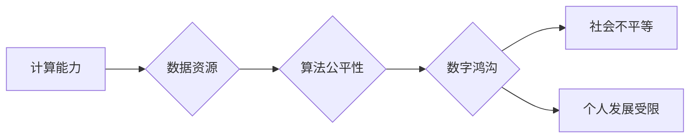

                 

## 数字鸿沟：弥合人类计算中的不平等现象

> 关键词：数字鸿沟、计算不平等、人工智能、数据科学、算法公平性、可解释性、伦理问题、教育、社会影响

### 1. 背景介绍

在当今数字时代，计算能力已成为社会发展和个人进步的关键要素。从智能手机到云计算，从自动驾驶到医疗诊断，计算技术无处不在，深刻地改变着我们的生活方式和社会结构。然而，令人担忧的是，这种计算技术的进步并没有平等地惠及所有人。 

数字鸿沟，即不同社会群体对计算资源和技术能力的 unequal access，正在日益扩大，加剧了社会的不平等现象。 

**1.1 数字鸿沟的现状**

数字鸿沟并非仅仅指网络连接的差距，更重要的是指对计算资源、数据、技术技能和数字素养的差异。 

* **经济鸿沟:** 高收入群体更容易获得先进的计算设备、高速网络和优质的数字服务，而低收入群体则面临着经济负担和技术落后的困境。
* **地理鸿沟:** 农村地区和偏远地区往往缺乏完善的网络基础设施和数字资源，导致数字服务覆盖率低，信息获取和技术应用受限。
* **教育鸿沟:** 缺乏数字技能的教育资源和培训机会，导致部分群体难以适应数字时代的需求，在就业和社会参与方面面临挑战。
* **性别鸿沟:** 女性在 STEM (科学、技术、工程和数学) 领域的人数比例仍然较低，导致女性在数字技术领域的机会和影响力不足。

**1.2 数字鸿沟的影响**

数字鸿沟对个人和社会都产生了深远的影响：

* **个人层面:** 无法平等地获取信息和资源，导致个人发展受限，难以参与数字经济和社会生活。
* **社会层面:** 加剧社会不平等，阻碍经济发展和社会进步，加剧社会分化和冲突。

### 2. 核心概念与联系

数字鸿沟的本质是计算能力和数据资源的分配不均，导致不同群体在信息获取、技术应用和社会参与方面存在差异。 

**2.1 计算能力不平等**

计算能力是指处理信息和执行任务的能力，它依赖于硬件、软件和网络基础设施等因素。 

* **硬件差距:** 高端计算设备 (如高性能服务器、GPU) 通常价格昂贵，难以普及到所有群体。
* **软件差距:** 优质的软件和应用程序往往需要付费订阅或购买，而低收入群体可能无法负担这些成本。
* **网络差距:** 高速网络连接是数字经济和社会生活的基础，但部分地区和群体缺乏可靠的网络连接。

**2.2 数据资源不平等**

数据是数字时代的宝贵资源，它可以用于训练人工智能模型、进行数据分析和决策支持。 

* **数据获取差距:** 拥有大量数据资源的企业和机构往往占据优势，而个人和小型企业则难以获取足够的优质数据。
* **数据使用差距:** 掌握数据分析和机器学习技术的群体能够更好地利用数据资源，而缺乏技术能力的群体则难以从中获益。

**2.3 算法公平性**

算法是数字技术的核心，它决定了数据如何被处理和应用。 

* **算法偏见:** 训练数据中的偏见可能会导致算法产生不公平的结果，例如在招聘、贷款和刑事司法等领域。
* **算法透明度:** 许多算法过于复杂，难以理解其决策过程，这导致算法的公平性和可解释性受到质疑。

**2.4 流程图**



### 3. 核心算法原理 & 具体操作步骤

为了弥合数字鸿沟，我们需要开发和应用公平、透明和可解释的算法。 

**3.1 算法原理概述**

公平算法旨在确保算法的决策结果不受到个人特征 (如种族、性别、年龄) 的影响。 

* **去偏见算法:** 通过识别和消除训练数据中的偏见，降低算法产生的不公平结果。
* **公平约束算法:** 在算法设计阶段引入公平性约束，例如确保不同群体获得相同的机会或资源。
* **解释性算法:** 使算法的决策过程更加透明，以便人们能够理解算法是如何做出决定的。

**3.2 算法步骤详解**

1. **数据收集和预处理:** 收集来自不同群体的样本数据，并进行清洗、标准化和去噪处理，以消除数据中的偏见和噪声。
2. **特征选择和工程:** 选择与目标任务相关的特征，并进行特征工程，例如将文本数据转换为数值向量。
3. **模型训练和评估:** 选择合适的算法模型，并使用训练数据进行模型训练。评估模型的性能，并使用公平性指标 (如均等机会、不确定性等) 评估模型的公平性。
4. **模型调优和部署:** 通过调整模型参数和算法结构，提高模型的公平性和性能。将经过调优的模型部署到实际应用场景中。

**3.3 算法优缺点**

* **优点:** 能够降低算法产生的不公平结果，提高算法的透明度和可解释性。
* **缺点:** 算法的公平性是一个复杂的问题，难以完全解决。公平算法的开发和应用需要大量的计算资源和专业知识。

**3.4 算法应用领域**

* **招聘:** 避免算法对候选人的种族、性别等特征进行歧视。
* **贷款:** 确保不同群体的贷款申请获得公平的对待。
* **刑事司法:** 降低算法对被告人的种族、性别等特征的偏见。
* **医疗保健:** 确保不同群体的患者获得公平的医疗服务。

### 4. 数学模型和公式 & 详细讲解 & 举例说明

**4.1 数学模型构建**

我们可以使用数学模型来量化算法的公平性。 

* **均等机会指标:** 衡量不同群体获得相同机会的程度。
* **不确定性指标:** 衡量算法对不同群体决策结果的不确定性。

**4.2 公式推导过程**

例如，我们可以使用均等机会指标来衡量算法在招聘中的公平性。 假设我们有一个算法用于筛选招聘候选人，我们希望确保算法对不同种族的候选人具有相同的录取率。 

我们可以使用以下公式来计算均等机会指标：

$$EOI = \frac{P_1 \times P_2}{P_1 + P_2}$$

其中：

* $P_1$ 是少数族裔候选人的录取率。
* $P_2$ 是多数族裔候选人的录取率。

如果 $EOI = 1$，则算法对不同种族的候选人具有相同的录取率，算法是公平的。 如果 $EOI < 1$，则算法对少数族裔候选人具有较低的录取率，算法存在偏见。

**4.3 案例分析与讲解**

在实际应用中，我们可以使用上述公式和指标来评估算法的公平性，并根据评估结果进行算法调优和改进。

### 5. 项目实践：代码实例和详细解释说明

**5.1 开发环境搭建**

为了实现公平算法，我们可以使用 Python 语言和相关的机器学习库 (如 scikit-learn, TensorFlow) 进行开发。

**5.2 源代码详细实现**

```python
from sklearn.linear_model import LogisticRegression
from sklearn.model_selection import train_test_split
from sklearn.metrics import accuracy_score, classification_report

# 加载数据
data = ...

# 将数据分为训练集和测试集
X_train, X_test, y_train, y_test = train_test_split(data.drop('target', axis=1), data['target'], test_size=0.2)

# 创建逻辑回归模型
model = LogisticRegression()

# 训练模型
model.fit(X_train, y_train)

# 评估模型性能
y_pred = model.predict(X_test)
accuracy = accuracy_score(y_test, y_pred)
print(f'Accuracy: {accuracy}')

# 生成分类报告
print(classification_report(y_test, y_pred))
```

**5.3 代码解读与分析**

这段代码演示了如何使用逻辑回归模型进行分类任务。 

* 首先，我们加载数据并将其分为训练集和测试集。
* 然后，我们创建逻辑回归模型并使用训练集进行模型训练。
* 最后，我们使用测试集评估模型的性能，并生成分类报告。

**5.4 运行结果展示**

运行结果将显示模型的准确率和分类报告，其中包含不同类别的准确率、召回率和 F1-score 等指标。

### 6. 实际应用场景

公平算法在各个领域都有着广泛的应用场景：

* **金融科技:** 避免算法在贷款、信用卡申请等领域对不同群体的歧视。
* **医疗保健:** 确保不同种族、性别和经济背景的患者获得公平的医疗服务和诊断。
* **教育:** 避免算法在招生、课程推荐等领域对不同学生的歧视。
* **司法系统:** 降低算法在判决、刑罚分配等领域对被告人的种族、性别等特征的偏见。

**6.4 未来应用展望**

随着人工智能技术的不断发展，公平算法将发挥越来越重要的作用，帮助我们构建更加公平、公正和包容的社会。

### 7. 工具和资源推荐

**7.1 学习资源推荐**

* **书籍:**
    * "Fairness and Machine Learning" by  Sarah M. Bender, Timnit Gebru, Angelina McMillan-Major, and  Emily M. Bender
    * "Weapons of Math Destruction: How Big Data Increases Inequality and Threatens Democracy" by Cathy O'Neil
* **在线课程:**
    * Coursera: "Fairness, Accountability, and Transparency in Machine Learning"
    * edX: "Algorithms for Social Good"

**7.2 开发工具推荐**

* **Python:** 广泛使用的编程语言，用于机器学习和数据科学。
* **scikit-learn:** Python 机器学习库，提供各种算法和工具。
* **TensorFlow:** 开源深度学习框架，用于训练和部署复杂的机器学习模型。

**7.3 相关论文推荐**

* "On the Dangers of Stochastic Parrots: Can Language Models Be Too Big?" by Emily M. Bender, Timnit Gebru, Angelina McMillan-Major, and Margaret Mitchell
* "Algorithmic Fairness" by Solon Barocas and Andrew Selbst

### 8. 总结：未来发展趋势与挑战

**8.1 研究成果总结**

近年来，在人工智能领域取得了显著的进展，公平算法的研究也取得了重要成果。 

* 已经开发出多种公平算法，并应用于各个领域。
* 出现了新的公平性指标和评估方法。
* 越来越多的研究者和企业关注公平算法的开发和应用。

**8.2 未来发展趋势**

* **更加注重算法的可解释性:** 帮助人们理解算法是如何做出决定的，从而提高算法的透明度和可信度。
* **开发更加鲁棒的公平算法:** 能够应对复杂的数据分布和潜在的攻击。
* **建立公平算法的标准和规范:** 确保算法的公平性得到保障。

**8.3 面临的挑战**

* **数据偏见:** 训练数据中的偏见难以完全消除，可能会导致算法产生不公平的结果。
* **公平性定义:** 对公平性的定义存在争议，不同的群体可能对公平有不同的理解。
* **技术复杂性:** 开发和应用公平算法需要复杂的数学和计算机科学知识。

**8.4 研究展望**

未来，我们需要继续努力，开发更加公平、透明和可解释的算法，帮助我们构建更加公正和包容的社会。


### 9. 附录：常见问题与解答

**9.1 如何评估算法的公平性？**

可以使用多种公平性指标来评估算法的公平性，例如均等机会指标、不确定性指标等。

**9.2 如何解决算法中的数据偏见？**

可以通过数据清洗、特征工程和算法调优等方法来解决算法中的数据偏见。

**9.3 如何确保算法的透明度和可解释性？**

可以通过使用可解释性算法、生成算法决策报告等方法来提高算法的透明度和可解释性。


作者：禅与计算机程序设计艺术 / Zen and the Art of Computer Programming 
<end_of_turn>

