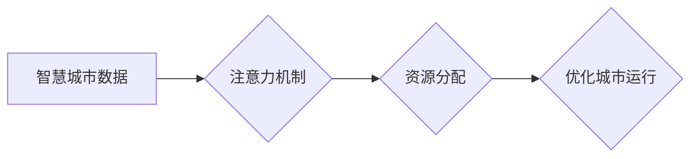

                 

## 智慧城市建设中的注意力资源分配

> 关键词：智慧城市、注意力机制、资源分配、机器学习、优化算法、数据分析、城市管理

## 1. 背景介绍

智慧城市建设是全球范围内一个重要的发展趋势，旨在通过信息技术和数据分析，提升城市管理效率、改善居民生活质量。在智慧城市中，海量数据从各种传感器、设备和应用程序不断涌入，这些数据蕴含着丰富的城市运行信息和潜在价值。然而，如何有效地处理、分析和利用这些数据，是智慧城市建设面临的重大挑战之一。

注意力机制（Attention Mechanism）作为一种模仿人类注意力机制的机器学习技术，在自然语言处理、计算机视觉等领域取得了显著成果。其核心思想是，在处理信息时，重点关注与当前任务最相关的部分，而忽略无关的信息，从而提高效率和准确性。

将注意力机制应用于智慧城市建设，可以帮助我们更有效地分配城市资源，优化城市运行。例如，我们可以利用注意力机制来：

* **预测城市交通流量:** 通过分析历史交通数据和实时路况信息，预测未来交通流量，并根据预测结果动态调整交通信号灯，优化交通流。
* **优化城市能源消耗:** 通过分析建筑物能源使用数据和天气预报，预测未来能源需求，并根据预测结果调整供暖、制冷和照明系统，降低能源消耗。
* **提高城市安全:** 通过分析监控视频和报警数据，识别潜在的安全威胁，并及时采取措施，提高城市安全水平。

## 2. 核心概念与联系

### 2.1 智慧城市数据

智慧城市的数据来源广泛，包括：

* **传感器数据:** 城市基础设施、交通工具、环境监测设备等产生的实时数据。
* **应用程序数据:** 居民使用手机、电脑等应用程序产生的数据，例如出行轨迹、消费记录、社交互动等。
* **公共服务数据:** 城市政府提供的公共服务数据，例如人口信息、医疗记录、教育信息等。

这些数据通常是海量、异构、实时变化的，需要进行有效的数据采集、存储、处理和分析。

### 2.2 注意力机制

注意力机制的核心思想是，在处理信息时，重点关注与当前任务最相关的部分，而忽略无关的信息。其工作原理可以概括为以下步骤：

1. **计算注意力权重:** 对输入数据进行编码，并计算每个数据元素与当前任务相关的权重。
2. **加权求和:** 根据注意力权重，对输入数据进行加权求和，得到一个新的表示。
3. **输出结果:** 将新的表示作为输入，进行后续的处理，例如分类、预测等。

### 2.3 资源分配

资源分配是指根据需求和优先级，将有限的资源分配到不同的任务或领域。在智慧城市建设中，资源包括但不限于：

* **资金:** 用于建设基础设施、开发应用程序、开展研究等。
* **人力:** 用于运营管理、技术开发、数据分析等。
* **能源:** 用于城市照明、交通运输、建筑供暖等。

有效地分配资源，可以提高城市运行效率，优化资源利用，促进城市可持续发展。

**Mermaid 流程图**



## 3. 核心算法原理 & 具体操作步骤

### 3.1 算法原理概述

在智慧城市建设中，注意力机制可以用于优化资源分配。例如，我们可以利用注意力机制来预测城市交通流量，并根据预测结果动态调整交通信号灯，从而优化交通流。

具体来说，我们可以将城市交通流量数据作为输入，训练一个基于注意力的预测模型。该模型会学习到哪些交通数据特征与交通流量变化相关，并根据这些特征计算出每个时间段的交通流量预测值。

### 3.2 算法步骤详解

1. **数据预处理:** 收集城市交通流量数据，并进行清洗、转换和特征工程，例如将时间信息转换为小时、天等时间粒度。
2. **模型构建:** 选择一个合适的注意力机制模型，例如Transformer、BERT等，并根据城市交通流量数据的特点进行模型参数调整。
3. **模型训练:** 使用训练数据训练注意力机制模型，并使用验证数据评估模型性能。
4. **模型部署:** 将训练好的模型部署到生产环境中，实时预测城市交通流量。
5. **资源分配:** 根据预测结果，动态调整交通信号灯，优化交通流。

### 3.3 算法优缺点

**优点:**

* **能够学习到数据中的重要特征:** 注意力机制可以学习到哪些交通数据特征与交通流量变化相关，从而提高预测精度。
* **能够处理长序列数据:** 注意力机制可以处理长序列数据，例如多个小时或多个天的交通流量数据。
* **能够解释模型决策:** 注意力权重可以解释模型决策过程，帮助我们理解哪些交通数据特征对预测结果影响最大。

**缺点:**

* **计算复杂度高:** 注意力机制的计算复杂度较高，需要较强的计算资源。
* **参数量大:** 注意力机制模型参数量较大，需要大量的训练数据才能达到较好的性能。

### 3.4 算法应用领域

注意力机制在智慧城市建设中的应用领域非常广泛，例如：

* **交通管理:** 预测交通流量、优化交通信号灯、智能导航等。
* **能源管理:** 预测能源需求、优化能源分配、智能电网等。
* **环境监测:** 预测空气质量、监测水质、管理垃圾处理等。
* **公共安全:** 识别潜在的安全威胁、预测犯罪热点、智能监控等。

## 4. 数学模型和公式 & 详细讲解 & 举例说明

### 4.1 数学模型构建

注意力机制的核心是计算每个数据元素与当前任务相关的权重。常用的注意力机制模型包括：

* **点积注意力:** 计算每个数据元素与查询向量的点积，作为注意力权重。
* **加权求和注意力:** 对点积注意力结果进行softmax归一化，得到注意力权重。
* **多头注意力:** 使用多个独立的注意力头，并对注意力头结果进行融合，提高模型的表达能力。

### 4.2 公式推导过程

**点积注意力:**

$$
\text{Attention}(Q, K, V) = \text{softmax}\left(\frac{Q K^T}{\sqrt{d_k}}\right) V
$$

其中：

* $Q$ 是查询向量。
* $K$ 是键向量。
* $V$ 是值向量。
* $d_k$ 是键向量的维度。

**加权求和注意力:**

$$
\text{Attention}(Q, K, V) = \sum_{i=1}^{n} \alpha_i V_i
$$

其中：

* $\alpha_i$ 是第 $i$ 个数据元素的注意力权重。
* $V_i$ 是第 $i$ 个数据元素的值向量。

**多头注意力:**

$$
\text{MultiHead}(Q, K, V) = \text{Concat}(head_1, head_2, ..., head_h) W^O
$$

其中：

* $head_i$ 是第 $i$ 个注意力头的输出。
* $h$ 是注意力头的数量。
* $W^O$ 是最终输出层的权重矩阵。

### 4.3 案例分析与讲解

例如，在预测城市交通流量时，我们可以使用多头注意力机制模型，将历史交通数据、实时路况信息、天气预报等数据作为输入，并根据模型学习到的注意力权重，重点关注与交通流量变化相关的关键信息。

## 5. 项目实践：代码实例和详细解释说明

### 5.1 开发环境搭建

* **操作系统:** Ubuntu 20.04 LTS
* **Python 版本:** 3.8.10
* **深度学习框架:** TensorFlow 2.5.0
* **其他依赖库:** numpy, pandas, matplotlib等

### 5.2 源代码详细实现

```python
import tensorflow as tf

# 定义多头注意力机制模型
class MultiHeadAttention(tf.keras.layers.Layer):
    def __init__(self, num_heads, key_dim):
        super(MultiHeadAttention, self).__init__()
        self.num_heads = num_heads
        self.key_dim = key_dim

        # 定义查询、键和值矩阵的权重
        self.q_dense = tf.keras.layers.Dense(key_dim)
        self.k_dense = tf.keras.layers.Dense(key_dim)
        self.v_dense = tf.keras.layers.Dense(key_dim)

        # 定义注意力权重矩阵
        self.attention_weights = tf.keras.layers.Dense(1)

    def call(self, query, key, value, mask=None):
        # 计算查询、键和值矩阵
        q = self.q_dense(query)
        k = self.k_dense(key)
        v = self.v_dense(value)

        # 分割查询、键和值矩阵
        q = tf.reshape(q, shape=(-1, tf.shape(q)[1], self.num_heads, self.key_dim // self.num_heads))
        k = tf.reshape(k, shape=(-1, tf.shape(k)[1], self.num_heads, self.key_dim // self.num_heads))
        v = tf.reshape(v, shape=(-1, tf.shape(v)[1], self.num_heads, self.key_dim // self.num_heads))

        # 计算注意力权重
        attention_scores = tf.matmul(q, k, transpose_b=True) / tf.math.sqrt(tf.cast(self.key_dim // self.num_heads, tf.float32))
        attention_weights = self.attention_weights(attention_scores)

        # softmax归一化注意力权重
        attention_weights = tf.nn.softmax(attention_weights, axis=-1)

        # 计算加权求和
        output = tf.matmul(attention_weights, v)

        # 合并注意力头
        output = tf.reshape(output, shape=(-1, tf.shape(output)[1], self.key_dim))

        return output

# 构建模型
model = tf.keras.Sequential([
    MultiHeadAttention(num_heads=8, key_dim=512),
    tf.keras.layers.Dense(10)
])

# 训练模型
model.compile(optimizer='adam', loss='mse')
model.fit(x_train, y_train, epochs=10)
```

### 5.3 代码解读与分析

* **MultiHeadAttention 类:** 定义了多头注意力机制模型，包含查询、键和值矩阵的权重，以及注意力权重矩阵。
* **call 方法:** 实现多头注意力机制的计算过程，包括计算注意力权重、softmax归一化、加权求和等步骤。
* **模型构建:** 使用 Keras API 构建一个包含多头注意力机制层的模型。
* **模型训练:** 使用 Adam 优化器和均方误差损失函数训练模型。

### 5.4 运行结果展示

训练完成后，我们可以使用测试数据评估模型性能，例如计算模型的均方误差、R-squared 等指标。

## 6. 实际应用场景

### 6.1 交通管理

* **智能交通信号灯:** 利用注意力机制预测交通流量，动态调整信号灯时长，优化交通流。
* **智能导航:** 根据实时路况信息和预测结果，提供更精准的导航路线，减少拥堵时间。
* **交通违规识别:** 利用视频监控数据和注意力机制，识别交通违规行为，提高交通安全。

### 6.2 能源管理

* **智能电网:** 利用注意力机制预测能源需求，优化能源分配，提高能源利用效率。
* **建筑节能:** 利用建筑物能源使用数据和天气预报，预测能源消耗，并根据预测结果调整供暖、制冷和照明系统，降低能源消耗。

### 6.3 环境监测

* **空气质量预测:** 利用传感器数据和天气预报，预测空气质量，及时发布预警信息。
* **水质监测:** 利用传感器数据和水质模型，预测水质变化，及时采取措施保护水资源。

### 6.4 未来应用展望

随着人工智能技术的不断发展，注意力机制在智慧城市建设中的应用场景将更加广泛。例如，我们可以利用注意力机制来：

* **个性化城市服务:** 根据居民的兴趣和需求，提供个性化的城市服务，例如推荐路线、提供生活信息等。
* **城市风险预警:** 利用多源数据，预测城市风险，例如自然灾害、交通事故等，并及时采取措施降低风险。
* **城市规划优化:** 利用注意力机制分析城市数据，优化城市规划，例如布局规划、交通规划等。

## 7. 工具和资源推荐

### 7.1 学习资源推荐

* **书籍:**
    * 《深度学习》 - Ian Goodfellow, Yoshua Bengio, Aaron Courville
    * 《Attention Is All You Need》 - Vaswani et al.
* **在线课程:**
    * Coursera: 深度学习 Specialization
    * Udacity: Deep Learning Nanodegree
* **博客和网站:**
    * TensorFlow Blog: https://blog.tensorflow.org/
    * PyTorch Blog: https://pytorch.org/blog/

### 7.2 开发工具推荐

* **深度学习框架:** TensorFlow, PyTorch, Keras
* **数据处理工具:** Pandas, NumPy
* **可视化工具:** Matplotlib, Seaborn

### 7.3 相关论文推荐

* **Attention Is All You Need:** https://arxiv.org/abs/1706.03762
* **BERT: Pre-training of Deep Bidirectional Transformers for Language Understanding:** https://arxiv.org/abs/1810.04805

## 8. 总结：未来发展趋势与挑战

### 8.1 研究成果总结

注意力机制在智慧城市建设中取得了显著成果，例如在交通管理、能源管理、环境监测等领域取得了应用。

### 8.2 未来发展趋势

* **更强大的注意力机制模型:** 研究更强大的注意力机制模型，例如Transformer-XL, Longformer等，能够处理更长序列数据，提高预测精度。
* **多模态注意力机制:** 研究能够处理多种数据类型的注意力机制，例如文本、图像、音频等，实现更全面的城市数据分析。
* **联邦学习注意力机制:** 研究在隐私保护下进行注意力机制训练的联邦学习方法，提高数据安全性和隐私保护。

### 8.3 面临的挑战

* **计算资源需求:** 注意力机制模型计算复杂度高，需要强大的计算资源支持。
* **数据标注成本:** 训练注意力机制模型需要大量的标注数据，数据标注成本较高。
* **模型解释性:** 注意力机制模型的决策过程较为复杂，需要进一步提高模型解释性。

### 8.4 研究展望

未来，我们将继续研究注意力机制在智慧城市建设中的应用，探索更强大的模型、更有效的训练方法和更全面的应用场景，为智慧城市建设提供更有效的技术支持。

## 9. 附录：常见问题与解答

**Q1: 注意力机制与传统机器学习模型相比有什么优势？**

**A1:** 注意力机制能够学习到数据中的重要特征，并重点关注与当前任务相关的关键信息，从而提高模型的预测精度和表达能力。

**Q2: 注意力机制的计算复杂度高吗？**

**A2:** 是的，注意力机制的计算复杂度较高，需要较强的计算资源支持。

**Q3: 如何评估注意力机制模型的性能？**

**A3:** 可以使用均方误差、R-squared 等指标评估注意力机制模型的性能。

**Q4: 注意力机制的应用场景有哪些？**

**A4:** 注意力机制在自然语言处理、计算机视觉、时间序列分析等领域都有广泛的应用，在智慧城市建设中，可以应用于交通管理、能源管理、环境监测等领域。


作者：禅与计算机程序设计艺术 / Zen and the Art of Computer Programming<end_of_turn>

