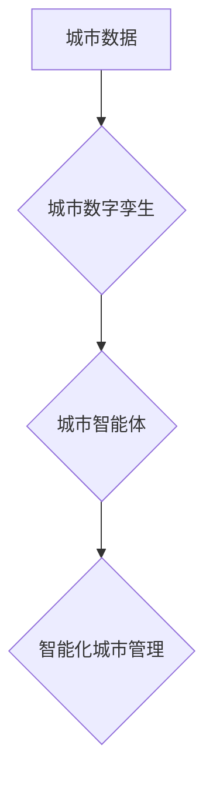

                 

## 关键词：城市数字孪生、城市智能体、人工智能、机器学习、大数据、物联网、智慧城市

## 1. 背景介绍

随着科技的飞速发展，城市化进程不断加速，城市面临着日益严峻的挑战，包括人口增长、资源短缺、环境污染、交通拥堵等。为了应对这些挑战，构建智慧城市成为全球共识。智慧城市是指利用信息技术和智能化手段，提升城市管理水平、提高城市居民生活质量的城市形态。

城市数字孪生作为智慧城市建设的重要基石，以其强大的模拟和预测能力，为城市管理决策提供科学依据，推动城市向智慧化、可持续发展迈进。城市数字孪生是指利用三维建模、传感器数据、人工智能等技术，构建与真实城市高度一致的虚拟模型，并通过实时数据交互和模拟演算，实现对城市运行状态的实时感知、分析和预测。

## 2. 核心概念与联系

### 2.1 城市数字孪生

城市数字孪生是城市信息化建设的重要组成部分，它将物理城市与虚拟城市相结合，通过数据采集、模型构建、模拟演算等技术手段，构建一个与真实城市高度一致的虚拟模型。

城市数字孪生包含以下关键要素：

* **三维建模:** 利用激光扫描、遥感影像等技术，构建城市建筑、道路、绿地等物理实体的精确三维模型。
* **传感器网络:** 通过部署各种传感器，实时采集城市环境、交通、能源、水资源等方面的关键数据。
* **数据平台:** 建立统一的数据平台，对来自不同传感器的数据进行存储、处理、分析和共享。
* **人工智能:** 利用机器学习、深度学习等人工智能技术，对城市数据进行分析和预测，为城市管理决策提供支持。

### 2.2 城市智能体

城市智能体是指基于城市数字孪生的智能化系统，它能够自主学习、决策、执行，并与城市物理系统进行交互，实现对城市运行状态的智能化管理。

城市智能体主要功能包括：

* **城市运行状态感知:** 通过传感器网络实时采集城市数据，感知城市运行状态，例如交通流量、空气质量、能源消耗等。
* **城市问题预测:** 利用人工智能技术对城市数据进行分析和预测，预警城市潜在问题，例如交通拥堵、电力短缺、环境污染等。
* **城市资源优化:** 根据城市运行状态和预测结果，优化城市资源配置，例如交通流量调度、能源分配、水资源管理等。
* **城市服务智能化:** 提供智能化城市服务，例如智能交通、智能医疗、智能教育等。

### 2.3 城市数字孪生与城市智能体的联系

城市数字孪生为城市智能体的构建提供了基础平台。城市数字孪生提供城市物理实体的虚拟模型和实时数据，而城市智能体则利用这些数据进行分析、决策和执行，实现对城市运行状态的智能化管理。

**Mermaid 流程图**



## 3. 核心算法原理 & 具体操作步骤

### 3.1 算法原理概述

城市智能体构建的核心算法主要包括：

* **机器学习算法:** 用于对城市数据进行分析和预测，例如交通流量预测、空气质量预测、能源消耗预测等。
* **深度学习算法:** 用于处理复杂的数据模式，例如图像识别、语音识别、自然语言处理等。
* **强化学习算法:** 用于训练城市智能体，使其能够自主学习和决策，例如交通流量调度、能源分配等。

### 3.2 算法步骤详解

**机器学习算法步骤:**

1. **数据收集:** 收集城市相关数据，例如交通流量、空气质量、能源消耗等。
2. **数据预处理:** 对收集到的数据进行清洗、转换、特征提取等预处理操作。
3. **模型选择:** 选择合适的机器学习算法，例如线性回归、逻辑回归、决策树、支持向量机等。
4. **模型训练:** 利用训练数据对模型进行训练，调整模型参数，使其能够准确预测城市运行状态。
5. **模型评估:** 利用测试数据对模型进行评估，评估模型的预测精度和泛化能力。
6. **模型部署:** 将训练好的模型部署到城市智能体系统中，用于实时预测城市运行状态。

**深度学习算法步骤:**

1. **数据收集:** 收集城市相关数据，例如图像、视频、文本等。
2. **数据预处理:** 对收集到的数据进行清洗、转换、增强等预处理操作。
3. **网络结构设计:** 设计合适的深度学习网络结构，例如卷积神经网络、循环神经网络等。
4. **模型训练:** 利用训练数据对模型进行训练，调整模型参数，使其能够准确识别和理解城市数据。
5. **模型评估:** 利用测试数据对模型进行评估，评估模型的识别精度和泛化能力。
6. **模型部署:** 将训练好的模型部署到城市智能体系统中，用于实时识别和理解城市数据。

**强化学习算法步骤:**

1. **环境建模:** 建立城市运行环境的虚拟模型，模拟城市物理系统。
2. **智能体设计:** 设计城市智能体的行为策略，定义智能体的动作空间和奖励函数。
3. **训练过程:** 让智能体与环境交互，根据环境反馈和奖励函数调整行为策略，使其能够在城市环境中做出最优决策。
4. **模型评估:** 利用测试环境评估智能体的决策效果，评估智能体的学习能力和执行能力。
5. **模型部署:** 将训练好的智能体部署到城市智能体系统中，用于实时决策和执行。

### 3.3 算法优缺点

**机器学习算法:**

* **优点:** 算法简单易懂，易于实现，对数据要求不高。
* **缺点:** 预测精度有限，难以处理复杂的数据模式。

**深度学习算法:**

* **优点:** 预测精度高，能够处理复杂的数据模式。
* **缺点:** 算法复杂，训练时间长，对数据要求高。

**强化学习算法:**

* **优点:** 智能体能够自主学习和决策，适应动态变化的环境。
* **缺点:** 训练过程复杂，需要大量的训练数据和计算资源。

### 3.4 算法应用领域

* **交通管理:** 交通流量预测、交通信号灯优化、智能交通拥堵缓解。
* **环境监测:** 空气质量预测、水质监测、环境污染控制。
* **能源管理:** 能源消耗预测、能源分配优化、智能电网建设。
* **公共安全:** 犯罪预测、灾害预警、应急救援指挥。

## 4. 数学模型和公式 & 详细讲解 & 举例说明

### 4.1 数学模型构建

城市智能体可以利用数学模型来描述城市运行状态和预测城市未来发展趋势。例如，可以构建交通流量模型、空气质量模型、能源消耗模型等。

**交通流量模型:**

可以利用马尔科夫链模型来描述交通流量的动态变化。马尔科夫链模型假设系统状态的未来只依赖于当前状态，而与过去状态无关。

**空气质量模型:**

可以利用微分方程模型来描述空气质量的演变过程。微分方程模型描述了空气质量随时间变化的规律，可以考虑各种影响因素，例如排放源、风速、降雨等。

### 4.2 公式推导过程

**马尔科夫链模型:**

设城市交通流量有n种状态，状态转移概率矩阵为P，则状态转移概率为：

$$P_{ij} = P(X_t = j | X_{t-1} = i)$$

其中，$X_t$表示时间t时刻的交通流量状态，$i$和$j$分别表示两个状态。

**微分方程模型:**

设空气质量浓度为$C(t)$，则空气质量浓度随时间变化的微分方程为：

$$\frac{dC}{dt} = S - K C$$

其中，$S$表示排放源强度，$K$表示空气质量衰减系数。

### 4.3 案例分析与讲解

**交通流量预测:**

利用马尔科夫链模型对城市交通流量进行预测，可以根据历史交通流量数据，计算不同状态之间的转移概率，预测未来交通流量状态。

**空气质量预警:**

利用微分方程模型对城市空气质量进行预警，可以根据天气预报、排放源强度等信息，预测未来空气质量浓度，及时发布预警信息。

## 5. 项目实践：代码实例和详细解释说明

### 5.1 开发环境搭建

* 操作系统: Ubuntu 20.04 LTS
* Python 版本: 3.8.10
* 虚拟环境: venv
* 库依赖: pandas, numpy, scikit-learn, tensorflow

### 5.2 源代码详细实现

```python
# 导入必要的库
import pandas as pd
from sklearn.model_selection import train_test_split
from sklearn.linear_model import LinearRegression

# 加载交通流量数据
data = pd.read_csv('traffic_data.csv')

# 选择特征和目标变量
features = ['hour', 'weekday', 'temperature']
target = 'traffic_volume'

# 将数据划分为训练集和测试集
X_train, X_test, y_train, y_test = train_test_split(data[features], data[target], test_size=0.2)

# 创建线性回归模型
model = LinearRegression()

# 训练模型
model.fit(X_train, y_train)

# 预测测试集数据
y_pred = model.predict(X_test)

# 评估模型性能
from sklearn.metrics import mean_squared_error
mse = mean_squared_error(y_test, y_pred)
print(f'Mean Squared Error: {mse}')
```

### 5.3 代码解读与分析

这段代码实现了对城市交通流量的线性回归预测。

1. 首先，导入必要的库，包括 pandas 用于数据处理，scikit-learn 用于机器学习模型。
2. 然后，加载交通流量数据，选择特征和目标变量。
3. 将数据划分为训练集和测试集，用于训练和评估模型。
4. 创建线性回归模型，并使用训练数据训练模型。
5. 利用训练好的模型预测测试集数据，并评估模型性能。

### 5.4 运行结果展示

运行代码后，会输出测试集数据与预测值的均方误差 (MSE) 值，该值越小，模型预测精度越高。

## 6. 实际应用场景

### 6.1 交通管理

* **智能交通信号灯控制:** 根据实时交通流量数据，动态调整交通信号灯的绿灯时间，优化交通流量，减少拥堵。
* **智能停车系统:** 利用传感器数据和机器学习算法，预测停车位空闲情况，引导车辆前往空闲停车位，提高停车效率。
* **交通拥堵预警:** 利用交通流量预测模型，预警交通拥堵区域，引导车辆避开拥堵路段，减少交通拥堵时间。

### 6.2 环境监测

* **空气质量监测和预警:** 利用传感器数据和空气质量模型，实时监测空气质量，预警空气污染事件，及时采取措施改善空气质量。
* **水质监测和预警:** 利用传感器数据和水质模型，实时监测水质，预警水污染事件，保护水资源安全。
* **环境污染控制:** 利用数据分析和机器学习算法，识别环境污染源，制定污染控制措施，减少环境污染。

### 6.3 能源管理

* **智能电网建设:** 利用传感器数据和能源消耗模型，优化能源分配，提高能源利用效率，减少能源浪费。
* **分布式能源管理:** 利用人工智能算法，协调分布式能源的运行，提高能源供应可靠性，促进清洁能源发展。
* **建筑能耗优化:** 利用传感器数据和建筑能耗模型，优化建筑能源使用，降低建筑能耗，减少碳排放。

### 6.4 未来应用展望

随着城市数字孪生和城市智能体的不断发展，未来将有更多应用场景出现，例如：

* **智慧医疗:** 利用城市数字孪生和人工智能，实现远程医疗、精准医疗、疾病预防等。
* **智慧教育:** 利用城市数字孪生和人工智能，提供个性化教育、远程教育、智慧课堂等。
* **智慧城市安全:** 利用城市数字孪生和人工智能，实现城市安全监控、犯罪预测、应急救援指挥等。


## 7. 工具和资源推荐

### 7.1 学习资源推荐

* **书籍:**
    * 《城市数字孪生》
    * 《人工智能基础》
    * 《机器学习实战》
* **在线课程:**
    * Coursera: 城市智能化
    * edX: 人工智能
    * Udacity: 机器学习工程师

### 7.2 开发工具推荐

* **编程语言:** Python
* **数据分析工具:** pandas, numpy, scikit-learn
* **深度学习框架:** TensorFlow, PyTorch
* **三维建模软件:** Blender, Maya
* **城市仿真平台:** AnyLogic, SimCity

### 7.3 相关论文推荐

* 《城市数字孪生：概念、架构和应用》
* 《基于人工智能的城市智能体》
* 《城市数字孪生在智慧城市建设中的应用》

## 8. 总结：未来发展趋势与挑战

### 8.1 研究成果总结

城市数字孪生和城市智能体是智慧城市建设的重要基石，在交通管理、环境监测、能源管理等领域取得了显著成果。

### 8.2 未来发展趋势

* **模型精度提升:** 利用更先进的机器学习算法和深度学习算法，提高城市数字孪生和城市智能体的预测精度。
* **数据融合:** 将来自不同来源的数据融合在一起，构建更全面的城市模型，提高城市智能体的决策能力。
* **边缘计算:** 将城市智能体部署到边缘计算节点，降低数据传输延迟，提高实时决策能力。
* **跨城市协同:** 建立跨城市的数据共享平台，实现城市间信息互通，共同应对城市挑战。

### 8.3 面临的挑战

* **数据安全:** 城市数字孪生和城市智能体需要处理大量敏感数据，数据安全问题需要得到有效解决。
* **算法解释性:** 许多机器学习算法的决策过程难以解释，需要开发更可解释的算法，提高城市智能体的透明度和可信度。
* **技术标准:** 城市数字孪生和城市智能体缺乏统一的技术标准，需要制定行业标准，促进技术互操作性。
* **伦理问题:** 城市智能体可能会对人们的生活产生重大影响，需要关注城市智能体的伦理问题，确保其安全、公平、可持续发展。

### 8.4 研究展望

未来，城市数字孪生和城市智能体将继续发展，为城市建设提供更强大的技术支撑，推动城市向智慧化、可持续发展迈进。


## 9. 附录：常见问题与解答

**Q1: 城市数字孪生和城市智能体有什么区别？**

**A1:** 城市数字孪生是城市物理实体的虚拟模型，而城市智能体是基于城市数字孪生的智能化系统，能够自主学习、决策、执行。

**Q2: 城市数字孪生需要哪些数据？**

**A2:** 城市数字孪生需要各种城市数据，例如交通流量数据、环境监测数据、能源消耗数据、人口数据等。

**Q3: 城市数字孪生和城市智能体有哪些应用场景？**

**A3:** 城市数字孪生和城市智能体在交通管理、环境监测、能源管理、公共安全等领域都有广泛的应用场景。

**Q4: 城市数字孪生和城市智能体面临哪些挑战？**

**A4:** 城市数字孪生和城市智能体面临数据安全、算法解释性、技术标准、伦理问题等挑战。


作者：禅与计算机程序设计艺术 / Zen and the Art of Computer Programming<end_of_turn>

