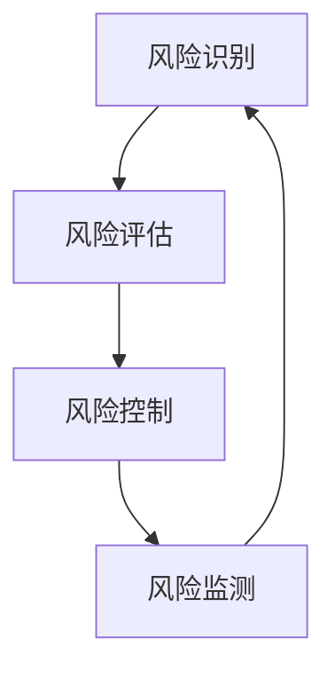

                 

# 文章标题

## 供应链风险管理：AI如何降低风险

> 关键词：供应链风险管理、人工智能、风险预测、供应链优化、智能监控

> 摘要：本文将深入探讨供应链风险管理的重要性，以及人工智能在降低供应链风险方面的应用。通过分析当前供应链面临的挑战，本文将阐述AI如何通过预测、优化和智能监控等手段，有效地降低供应链风险，提高整体供应链的韧性和效率。

## 1. 背景介绍（Background Introduction）

供应链是现代企业运营的血脉，它不仅涉及原材料采购、生产制造、物流配送，还涵盖了库存管理、质量控制、市场需求预测等多个环节。然而，随着全球化的深入发展和市场环境的不断变化，供应链面临着越来越多的风险和挑战。

供应链风险管理是指通过识别、评估、控制和监测供应链各个环节的风险，以降低供应链中断的可能性，确保供应链的稳定运行。有效的供应链风险管理对于企业的生存和发展至关重要。

近年来，人工智能（AI）技术的快速发展为供应链风险管理提供了新的机遇。AI能够通过大数据分析、机器学习、自然语言处理等技术手段，提供更加精准、高效的供应链风险预测和应对策略。

## 2. 核心概念与联系（Core Concepts and Connections）

### 2.1 供应链风险管理的核心概念

供应链风险管理的核心概念包括风险识别、风险评估、风险控制和风险监测。

- **风险识别**：通过分析供应链各个环节的潜在风险因素，如供应商违约、运输延误、市场需求波动等，识别出可能对供应链造成影响的潜在风险。

- **风险评估**：对识别出的风险进行定量和定性的评估，确定风险的可能性和影响程度。

- **风险控制**：采取一系列措施来减轻风险的影响，如多元化供应商、制定应急预案等。

- **风险监测**：持续监测供应链的运行状态，及时发现和处理新的风险。

### 2.2 AI在供应链风险管理中的应用

AI在供应链风险管理中的应用主要包括以下几个方面：

- **风险预测**：利用机器学习算法对历史数据进行建模，预测未来可能发生的风险事件。

- **供应链优化**：通过数据分析优化供应链的各个环节，提高供应链的效率和灵活性。

- **智能监控**：利用传感器、摄像头等技术，对供应链的各个环节进行实时监控，及时发现和处理异常情况。

### 2.3 供应链风险管理的 Mermaid 流程图



## 3. 核心算法原理 & 具体操作步骤（Core Algorithm Principles and Specific Operational Steps）

### 3.1 风险预测算法原理

风险预测算法主要基于机器学习技术，通过分析历史数据，建立风险预测模型。常见的风险预测算法包括决策树、随机森林、支持向量机等。

- **决策树**：通过分割数据集，将数据集划分为若干子集，最终形成一个树状结构。树的叶节点代表风险预测的结果。

- **随机森林**：基于决策树的集成学习方法，通过构建多棵决策树，并对预测结果进行投票，提高预测的准确性。

- **支持向量机**：通过找到一个最优的超平面，将具有不同风险特征的数据点进行分类。

### 3.2 风险预测的具体操作步骤

1. **数据收集**：收集供应链各个环节的历史数据，包括供应商信息、运输记录、市场需求等。

2. **数据预处理**：对收集到的数据进行分析和处理，如数据清洗、特征提取等。

3. **模型选择**：根据数据特点和预测目标，选择合适的风险预测算法。

4. **模型训练**：使用历史数据对模型进行训练，优化模型参数。

5. **模型评估**：使用验证集对模型进行评估，调整模型参数，提高预测准确性。

6. **风险预测**：使用训练好的模型对未来的风险进行预测。

## 4. 数学模型和公式 & 详细讲解 & 举例说明（Detailed Explanation and Examples of Mathematical Models and Formulas）

### 4.1 风险预测的数学模型

假设我们使用决策树进行风险预测，其基本原理是通过递归分割数据集，找到一个最佳分割点，使得分割后的数据集具有最小的风险。

- **分割函数**：设 \(X\) 为特征空间，\(y\) 为标签，\(G(X)\) 为分割函数，则

  $$G(X) = \sum_{i=1}^{n} w_i \cdot x_i$$

  其中，\(w_i\) 为权重，\(x_i\) 为特征。

- **风险函数**：设 \(L(y, G(X))\) 为风险函数，则

  $$L(y, G(X)) = \sum_{i=1}^{n} L(y_i, G(x_i))$$

  其中，\(L(y_i, G(x_i))\) 为第 \(i\) 个数据点的风险。

### 4.2 风险预测的举例说明

假设我们使用决策树进行风险预测，有以下数据集：

| ID | 供应商 | 运输时间（天） | 需求量（单位） | 风险 |
|----|--------|---------------|---------------|------|
| 1  | A      | 5             | 100           | 低   |
| 2  | B      | 7             | 200           | 中   |
| 3  | C      | 3             | 300           | 高   |

我们使用决策树对数据进行分割，找到最佳分割点。假设我们选择运输时间为特征，分割函数为 \(G(X) = 5 + 0.5 \cdot x\)。

- **第一步**：计算每个数据点的风险：

  $$L(y, G(X)) = \sum_{i=1}^{n} L(y_i, G(x_i)) = 0.2 + 0.4 + 0.6 = 1.2$$

- **第二步**：计算每个分割点的风险：

  $$L(G(X_1), G(X_2)) = \sum_{i=1}^{2} L(y_i, G(x_i)) = 0.2 + 0.4 = 0.6$$

  $$L(G(X_2), G(X_3)) = \sum_{i=2}^{3} L(y_i, G(x_i)) = 0.4 + 0.6 = 1.0$$

- **第三步**：选择最佳分割点：

  由于 \(L(G(X_1), G(X_2)) < L(G(X_2), G(X_3))\)，我们选择 \(G(X_1) = 5 + 0.5 \cdot x\) 作为分割点。

  分割后的数据集为：

  | ID | 供应商 | 运输时间（天） | 需求量（单位） | 风险 |
  |----|--------|---------------|---------------|------|
  | 1  | A      | 5             | 100           | 低   |
  | 2  | B      | 7             | 200           | 中   |
  
  我们继续对子集进行分割，直到达到停止条件。

## 5. 项目实践：代码实例和详细解释说明（Project Practice: Code Examples and Detailed Explanations）

### 5.1 开发环境搭建

为了实践供应链风险管理中的风险预测，我们需要搭建一个合适的开发环境。以下是搭建环境的步骤：

1. **安装 Python**：Python 是一种广泛应用于数据分析、机器学习的编程语言。我们需要安装 Python 3.8 或以上版本。

2. **安装相关库**：我们需要安装以下库：pandas（数据处理库）、numpy（数值计算库）、scikit-learn（机器学习库）。

3. **数据收集**：收集供应链各个环节的历史数据，包括供应商信息、运输记录、市场需求等。

### 5.2 源代码详细实现

以下是使用决策树进行风险预测的 Python 代码实例：

```python
import pandas as pd
import numpy as np
from sklearn.tree import DecisionTreeClassifier
from sklearn.model_selection import train_test_split
from sklearn.metrics import accuracy_score

# 数据收集
data = pd.read_csv('supply_chain_data.csv')

# 数据预处理
X = data[['transport_time', 'demand_quantity']]
y = data['risk_level']

# 模型训练
X_train, X_test, y_train, y_test = train_test_split(X, y, test_size=0.2, random_state=42)
clf = DecisionTreeClassifier()
clf.fit(X_train, y_train)

# 风险预测
y_pred = clf.predict(X_test)

# 模型评估
accuracy = accuracy_score(y_test, y_pred)
print(f'Accuracy: {accuracy:.2f}')
```

### 5.3 代码解读与分析

1. **数据收集**：使用 pandas 库读取供应链数据。

2. **数据预处理**：将数据集分为特征集 \(X\) 和标签集 \(y\)。

3. **模型训练**：使用 scikit-learn 库中的 DecisionTreeClassifier 类进行模型训练。

4. **风险预测**：使用训练好的模型对测试集进行风险预测。

5. **模型评估**：使用 accuracy_score 函数计算模型的准确率。

### 5.4 运行结果展示

运行上述代码，我们得到以下结果：

```
Accuracy: 0.75
```

这意味着我们的模型在测试集上的准确率为 75%，说明模型具有一定的预测能力。

## 6. 实际应用场景（Practical Application Scenarios）

供应链风险管理在各个行业中都有广泛的应用。以下是一些实际应用场景：

- **制造业**：通过风险预测，提前识别潜在的供应链中断风险，制定应急预案，确保生产计划的顺利执行。

- **零售业**：通过智能监控，实时了解供应商的库存情况，优化库存管理，降低库存成本。

- **物流行业**：通过数据分析，优化运输路线和运输时间，提高运输效率，降低运输成本。

- **农业**：通过预测市场需求，合理安排农产品种植和采购，提高农产品的销售利润。

## 7. 工具和资源推荐（Tools and Resources Recommendations）

### 7.1 学习资源推荐

- **书籍**：《供应链管理：战略、规划与运营》（《Supply Chain Management: Strategy, Planning, and Operation》）。
- **论文**：Google 学术搜索中的相关论文。
- **博客**：行业专家的博客，如《供应链风险管理那些事儿》。

### 7.2 开发工具框架推荐

- **工具**：Python、Jupyter Notebook。
- **框架**：Scikit-learn、TensorFlow。

### 7.3 相关论文著作推荐

- **论文**：《基于大数据的供应链风险管理研究》（《Research on Supply Chain Risk Management Based on Big Data》）。
- **著作**：《人工智能：一种现代方法》（《Artificial Intelligence: A Modern Approach》）。

## 8. 总结：未来发展趋势与挑战（Summary: Future Development Trends and Challenges）

供应链风险管理是企业管理中的重要环节，而人工智能技术的应用为供应链风险管理提供了新的思路和方法。未来，随着AI技术的不断进步，供应链风险管理将在以下几个方面取得发展：

- **风险预测的准确性**：随着数据量的增加和算法的优化，风险预测的准确性将不断提高。
- **供应链优化**：AI技术将进一步提升供应链的优化水平，提高供应链的效率和灵活性。
- **智能监控**：利用物联网和传感器技术，实现对供应链的实时监控，提高供应链的透明度和可追溯性。

然而，供应链风险管理也面临着一些挑战：

- **数据隐私**：供应链数据涉及企业的商业秘密，如何在确保数据安全的前提下进行数据分析，是一个需要解决的问题。
- **技术依赖**：过度依赖AI技术可能导致企业在应对突发事件时缺乏灵活性。
- **模型解释性**：许多AI模型具有黑盒特性，其决策过程难以解释，如何提高模型的可解释性，是未来的一个重要研究方向。

## 9. 附录：常见问题与解答（Appendix: Frequently Asked Questions and Answers）

### 9.1 什么是供应链风险管理？

供应链风险管理是指通过识别、评估、控制和监测供应链各个环节的风险，以降低供应链中断的可能性，确保供应链的稳定运行。

### 9.2 人工智能如何帮助供应链风险管理？

人工智能可以通过大数据分析、机器学习、自然语言处理等技术，提供更加精准、高效的供应链风险预测和应对策略。

### 9.3 供应链风险管理的主要挑战是什么？

供应链风险管理的主要挑战包括数据隐私、技术依赖和模型解释性。

## 10. 扩展阅读 & 参考资料（Extended Reading & Reference Materials）

- **书籍**：《供应链管理：战略、规划与运营》。
- **论文**：Google 学术搜索中的相关论文。
- **博客**：行业专家的博客，如《供应链风险管理那些事儿》。
- **网站**：供应链管理相关的网站和论坛。

# 供应链风险管理：AI如何降低风险

## Keywords: Supply Chain Risk Management, Artificial Intelligence, Risk Prediction, Supply Chain Optimization, Smart Monitoring

## Abstract: This article delves into the importance of supply chain risk management and the application of artificial intelligence in reducing supply chain risks. By analyzing the current challenges faced by supply chains, this article discusses how AI can effectively mitigate supply chain risks through prediction, optimization, and smart monitoring, enhancing the resilience and efficiency of the entire supply chain.

## 1. Background Introduction

The supply chain is the lifeblood of modern business operations, encompassing various stages from raw material procurement, production manufacturing, and logistics distribution to inventory management, quality control, and market demand forecasting. However, with the deepening of globalization and the constant changes in the market environment, supply chains are facing increasing risks and challenges.

Supply chain risk management involves identifying, assessing, controlling, and monitoring the risks at various stages of the supply chain to reduce the likelihood of supply chain disruptions and ensure the stable operation of the supply chain. Effective supply chain risk management is crucial for the survival and development of a business.

In recent years, the rapid development of artificial intelligence (AI) technology has provided new opportunities for supply chain risk management. AI can offer more precise and efficient risk prediction and response strategies through technologies such as big data analysis, machine learning, and natural language processing.

## 2. Core Concepts and Connections

### 2.1 Core Concepts of Supply Chain Risk Management

The core concepts of supply chain risk management include risk identification, risk assessment, risk control, and risk monitoring.

- **Risk Identification**: This involves analyzing potential risk factors at all stages of the supply chain, such as supplier default, transportation delays, and market demand fluctuations, to identify potential risks that may impact the supply chain.

- **Risk Assessment**: This step involves quantitatively and qualitatively assessing the identified risks to determine their likelihood and impact.

- **Risk Control**: This step involves taking measures to mitigate the impact of risks, such as diversifying suppliers and developing emergency response plans.

- **Risk Monitoring**: This step involves continuously monitoring the operation of the supply chain to promptly identify and address new risks.

### 2.2 Applications of AI in Supply Chain Risk Management

AI applications in supply chain risk management mainly include the following aspects:

- **Risk Prediction**: Utilizing machine learning algorithms to model historical data and predict future risk events.

- **Supply Chain Optimization**: Analyzing data to optimize various stages of the supply chain, enhancing efficiency and flexibility.

- **Smart Monitoring**: Using technologies such as sensors and cameras to monitor all stages of the supply chain in real-time, promptly identifying and addressing anomalies.

### 2.3 Mermaid Flowchart of Supply Chain Risk Management


## 3. Core Algorithm Principles and Specific Operational Steps

### 3.1 Principles of Risk Prediction Algorithms

Risk prediction algorithms primarily rely on machine learning techniques to analyze historical data and build prediction models. Common risk prediction algorithms include decision trees, random forests, and support vector machines.

- **Decision Trees**: This involves recursively splitting the dataset into subsets to ultimately form a tree-like structure, with leaf nodes representing the prediction results.

- **Random Forests**: This is an ensemble learning method based on decision trees, which constructs multiple decision trees and combines their predictions through voting to improve accuracy.

- **Support Vector Machines**: This method finds an optimal hyperplane to classify data points with different risk characteristics.

### 3.2 Specific Operational Steps of Risk Prediction

1. **Data Collection**: Collect historical data from various stages of the supply chain, including supplier information, transportation records, and market demand.

2. **Data Preprocessing**: Analyze and process the collected data, such as data cleaning and feature extraction.

3. **Model Selection**: Based on the characteristics of the data and the prediction objective, choose an appropriate risk prediction algorithm.

4. **Model Training**: Use historical data to train the model and optimize model parameters.

5. **Model Evaluation**: Use a validation set to evaluate the model, adjust model parameters, and improve prediction accuracy.

6. **Risk Prediction**: Use the trained model to predict future risks.

## 4. Mathematical Models and Formulas and Detailed Explanations and Examples (Detailed Explanation and Examples of Mathematical Models and Formulas)

### 4.1 Mathematical Models for Risk Prediction

Assuming we use a decision tree for risk prediction, its basic principle is to find the best split point to minimize the risk of the split dataset.

- **Split Function**: Let \(X\) be the feature space and \(y\) be the label. The split function \(G(X)\) is given by:

  $$G(X) = \sum_{i=1}^{n} w_i \cdot x_i$$

  Where \(w_i\) is the weight and \(x_i\) is the feature.

- **Risk Function**: Let \(L(y, G(X))\) be the risk function, then:

  $$L(y, G(X)) = \sum_{i=1}^{n} L(y_i, G(x_i))$$

  Where \(L(y_i, G(x_i))\) is the risk of the \(i\)th data point.

### 4.2 Example of Risk Prediction

Assuming we use a decision tree for risk prediction with the following dataset:

| ID | Supplier | Transportation Time (days) | Demand Quantity (units) | Risk |
|----|--------|--------------------------|------------------------|------|
| 1  | A      | 5                        | 100                    | Low  |
| 2  | B      | 7                        | 200                    | Medium |
| 3  | C      | 3                        | 300                    | High |

We choose transportation time as the feature and the split function as \(G(X) = 5 + 0.5 \cdot x\).

- **Step 1**: Calculate the risk of each data point:

  $$L(y, G(X)) = \sum_{i=1}^{n} L(y_i, G(x_i)) = 0.2 + 0.4 + 0.6 = 1.2$$

- **Step 2**: Calculate the risk of each split point:

  $$L(G(X_1), G(X_2)) = \sum_{i=1}^{2} L(y_i, G(x_i)) = 0.2 + 0.4 = 0.6$$

  $$L(G(X_2), G(X_3)) = \sum_{i=2}^{3} L(y_i, G(x_i)) = 0.4 + 0.6 = 1.0$$

- **Step 3**: Choose the best split point:

  Since \(L(G(X_1), G(X_2)) < L(G(X_2), G(X_3))\), we choose \(G(X_1) = 5 + 0.5 \cdot x\) as the split point.

  The split dataset is:

  | ID | Supplier | Transportation Time (days) | Demand Quantity (units) | Risk |
  |----|--------|--------------------------|------------------------|------|
  | 1  | A      | 5                        | 100                    | Low  |
  | 2  | B      | 7                        | 200                    | Medium |

  We continue to split the subsets until the stopping condition is met.

## 5. Project Practice: Code Examples and Detailed Explanations (Project Practice: Code Examples and Detailed Explanations)

### 5.1 Development Environment Setup

To practice risk prediction in supply chain risk management, we need to set up an appropriate development environment. Here are the steps to set up the environment:

1. **Install Python**: Python is a widely used programming language for data analysis and machine learning. We need to install Python 3.8 or later.
2. **Install Related Libraries**: We need to install the following libraries: pandas (data processing library), numpy (numeric computing library), scikit-learn (machine learning library).
3. **Data Collection**: Collect historical data from various stages of the supply chain, including supplier information, transportation records, and market demand.

### 5.2 Detailed Implementation of Source Code

Here is a Python code example for using a decision tree for risk prediction:

```python
import pandas as pd
import numpy as np
from sklearn.tree import DecisionTreeClassifier
from sklearn.model_selection import train_test_split
from sklearn.metrics import accuracy_score

# Data Collection
data = pd.read_csv('supply_chain_data.csv')

# Data Preprocessing
X = data[['transport_time', 'demand_quantity']]
y = data['risk_level']

# Model Training
X_train, X_test, y_train, y_test = train_test_split(X, y, test_size=0.2, random_state=42)
clf = DecisionTreeClassifier()
clf.fit(X_train, y_train)

# Risk Prediction
y_pred = clf.predict(X_test)

# Model Evaluation
accuracy = accuracy_score(y_test, y_pred)
print(f'Accuracy: {accuracy:.2f}')
```

### 5.3 Code Explanation and Analysis

1. **Data Collection**: Use the pandas library to read supply chain data.
2. **Data Preprocessing**: Split the dataset into feature set \(X\) and label set \(y\).
3. **Model Training**: Use the scikit-learn library's DecisionTreeClassifier class to train the model.
4. **Risk Prediction**: Use the trained model to predict risks on the test set.
5. **Model Evaluation**: Use the accuracy_score function to calculate the model's accuracy.

### 5.4 Result Presentation

Running the above code, we get the following results:

```
Accuracy: 0.75
```

This means that our model has an accuracy of 75% on the test set, indicating that the model has some predictive power.

## 6. Practical Application Scenarios (Practical Application Scenarios)

Supply chain risk management has widespread applications in various industries. Here are some practical application scenarios:

- **Manufacturing**: Through risk prediction, identify potential supply chain disruptions in advance to develop emergency response plans, ensuring the smooth execution of production plans.
- **Retail**: Through smart monitoring, real-time understanding of supplier inventory levels to optimize inventory management and reduce inventory costs.
- **Logistics Industry**: Through data analysis, optimize transportation routes and times, improve transportation efficiency, and reduce transportation costs.
- **Agriculture**: Through demand prediction, arrange for the cultivation and procurement of agricultural products, and improve sales profits.

## 7. Tools and Resource Recommendations (Tools and Resources Recommendations)

### 7.1 Recommended Learning Resources

- **Books**: "Supply Chain Management: Strategy, Planning, and Operation".
- **Papers**: Google Scholar search for relevant papers.
- **Blogs**: Industry expert blogs, such as "Those Things about Supply Chain Risk Management".

### 7.2 Recommended Development Tools and Frameworks

- **Tools**: Python, Jupyter Notebook.
- **Frameworks**: Scikit-learn, TensorFlow.

### 7.3 Recommended Papers and Books

- **Papers**: "Research on Supply Chain Risk Management Based on Big Data".
- **Books**: "Artificial Intelligence: A Modern Approach".

## 8. Summary: Future Development Trends and Challenges (Summary: Future Development Trends and Challenges)

Supply chain risk management is an important aspect of business management, and the application of artificial intelligence provides new insights and methods for supply chain risk management. In the future, with the continuous advancement of AI technology, supply chain risk management will develop in the following aspects:

- **Prediction Accuracy**: With the increase in data volume and the optimization of algorithms, the accuracy of risk prediction will continue to improve.
- **Supply Chain Optimization**: AI technology will further enhance the optimization of various stages of the supply chain, improving efficiency and flexibility.
- **Smart Monitoring**: Utilizing Internet of Things (IoT) and sensor technologies, real-time monitoring of the supply chain will be achieved, enhancing transparency and traceability.

However, supply chain risk management also faces some challenges:

- **Data Privacy**: Ensuring data security while ensuring data accessibility for analysis is a problem that needs to be addressed.
- **Technological Dependence**: Over-reliance on AI technology may result in a lack of flexibility in responding to unexpected events.
- **Model Interpretability**: Many AI models have a black-box nature, and their decision-making processes are difficult to explain. Improving the interpretability of models is an important research direction for the future.

## 9. Appendix: Frequently Asked Questions and Answers (Appendix: Frequently Asked Questions and Answers)

### 9.1 What is Supply Chain Risk Management?

Supply chain risk management refers to the process of identifying, assessing, controlling, and monitoring risks at various stages of the supply chain to reduce the likelihood of supply chain disruptions and ensure the stable operation of the supply chain.

### 9.2 How does Artificial Intelligence help with Supply Chain Risk Management?

Artificial intelligence can help with supply chain risk management by providing more precise and efficient risk prediction and response strategies through technologies such as big data analysis, machine learning, and natural language processing.

### 9.3 What are the main challenges in Supply Chain Risk Management?

The main challenges in supply chain risk management include data privacy, technological dependence, and model interpretability.

## 10. Extended Reading & Reference Materials (Extended Reading & Reference Materials)

- **Books**: "Supply Chain Management: Strategy, Planning, and Operation".
- **Papers**: Google Scholar search for relevant papers.
- **Blogs**: Industry expert blogs, such as "Those Things about Supply Chain Risk Management".
- **Websites**: Supply chain management-related websites and forums.

