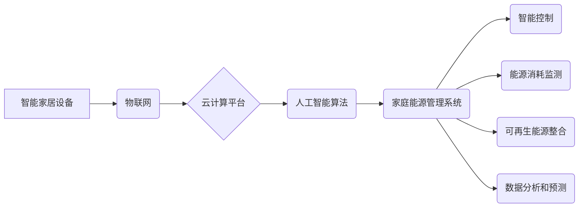

                 

## 关键词：智能家居、家庭能源管理、人工智能、机器学习、预测建模、可再生能源、物联网、边缘计算

## 1. 背景介绍

随着科技的飞速发展，智能家居已不再是科幻小说中的幻想，而是日益走进现实生活。2050年的智能家居将呈现出更加智能化、个性化、可持续化的趋势。其中，智能家电和家庭能源管理将扮演着至关重要的角色。

**1.1 智能家电的演变**

传统的智能家电主要集中在功能的自动化和远程控制上，例如智能冰箱、智能洗衣机等。未来，智能家电将更加智能化，具备更强的感知能力、学习能力和决策能力。

* **感知能力增强:** 智能家电将配备更先进的传感器，能够感知用户的需求、环境变化和家电运行状态。例如，智能烤箱能够识别食材类型和烹饪程度，自动调整温度和时间；智能空调能够根据用户的体温和环境湿度进行精准调节。
* **学习能力提升:** 通过机器学习算法，智能家电能够学习用户的习惯和偏好，并根据这些信息提供个性化的服务。例如，智能咖啡机能够根据用户的口味自动调配咖啡浓度和温度；智能音箱能够根据用户的音乐喜好推荐歌曲。
* **决策能力增强:** 智能家电将具备更强的决策能力，能够自主完成一些复杂的任务。例如，智能机器人能够根据用户的指令自动清洁房间、整理物品；智能家电系统能够根据用户的需求和能源价格自动调节家电运行时间和模式。

**1.2 家庭能源管理的挑战与机遇**

随着全球能源需求的不断增长，家庭能源管理已成为一个重要的议题。未来，智能家居将为家庭能源管理提供新的机遇。

* **能源消耗监测:** 智能家居系统能够实时监测家庭的能源消耗情况，并提供详细的用电数据和分析报告。
* **智能控制:** 智能家居系统能够根据用户的需求和能源价格自动调节家电运行时间和模式，从而降低家庭的能源消耗。
* **可再生能源整合:** 智能家居系统能够与可再生能源系统（例如太阳能电池板）进行整合，实现家庭能源的清洁化和可持续化。

## 2. 核心概念与联系

**2.1 智能家居架构**

未来智能家居将基于物联网、云计算和人工智能等技术的融合，构建一个更加智能化、开放和安全的生态系统。

* **物联网 (IoT):** 智能家居设备通过物联网协议进行通信，实现数据互联互通。
* **云计算 (Cloud Computing):** 云计算平台提供数据存储、处理和分析服务，支持智能家居系统的运行和升级。
* **人工智能 (AI):** 人工智能算法赋予智能家居设备感知、学习和决策的能力，实现智能化服务。

**2.2 家庭能源管理系统**

家庭能源管理系统是智能家居的核心组成部分之一，其主要功能包括：

* **能源消耗监测:** 实时监测家庭的用电、用气、用水等能源消耗情况。
* **智能控制:** 根据用户的需求和能源价格自动调节家电运行时间和模式。
* **可再生能源整合:** 与可再生能源系统进行整合，实现家庭能源的清洁化和可持续化。
* **数据分析和预测:** 分析家庭能源消耗数据，预测未来能源需求，并提供节能建议。

**2.3 核心概念关系图**



## 3. 核心算法原理 & 具体操作步骤

**3.1 算法原理概述**

家庭能源管理系统中常用的算法包括：

* **机器学习算法:** 用于分析家庭能源消耗数据，预测未来能源需求，并提供个性化的节能建议。
* **优化算法:** 用于优化家电运行时间和模式，降低家庭能源消耗。
* **预测建模算法:** 用于预测未来能源价格，帮助用户制定合理的能源使用策略。

**3.2 算法步骤详解**

以机器学习算法为例，其具体操作步骤如下：

1. **数据收集:** 收集家庭的用电、用气、用水等能源消耗数据，以及相关环境数据（例如温度、湿度、光照等）。
2. **数据预处理:** 对收集到的数据进行清洗、转换和特征工程，使其适合机器学习算法的训练。
3. **模型选择:** 选择合适的机器学习算法，例如线性回归、决策树、支持向量机等。
4. **模型训练:** 使用训练数据训练机器学习模型，使其能够学习家庭能源消耗的规律。
5. **模型评估:** 使用测试数据评估模型的性能，并进行模型调优。
6. **模型部署:** 将训练好的模型部署到智能家居系统中，用于预测未来能源需求和提供节能建议。

**3.3 算法优缺点**

* **优点:**

    * 能够根据用户的实际情况提供个性化的节能建议。
    * 能够预测未来能源需求，帮助用户提前做好准备。
    * 能够学习用户的习惯和偏好，提供更加智能化的服务。

* **缺点:**

    * 需要大量的训练数据，才能训练出准确的模型。
    * 模型的性能会受到数据质量的影响。
    * 模型需要定期更新，才能保持其准确性。

**3.4 算法应用领域**

* **家庭能源管理:** 预测未来能源需求，优化家电运行时间和模式，降低家庭能源消耗。
* **智能电网:** 预测电力需求，优化电力调度，提高电网效率。
* **可再生能源管理:** 预测太阳能和风能发电量，优化能源存储和分配。

## 4. 数学模型和公式 & 详细讲解 & 举例说明

**4.1 数学模型构建**

家庭能源消耗预测模型可以采用时间序列分析方法，例如ARIMA模型。ARIMA模型假设能源消耗数据具有自相关性，并利用过去的数据预测未来的值。

**4.2 公式推导过程**

ARIMA模型的公式如下：

$$
y_t = c + \phi_1 y_{t-1} + \phi_2 y_{t-2} + ... + \phi_p y_{t-p} + \theta_1 \epsilon_{t-1} + \theta_2 \epsilon_{t-2} + ... + \theta_q \epsilon_{t-q} + \epsilon_t
$$

其中：

* $y_t$ 是时间t的能源消耗值。
* $c$ 是截距项。
* $\phi_i$ 是自回归系数。
* $p$ 是自回归阶数。
* $\theta_i$ 是移动平均系数。
* $q$ 是移动平均阶数。
* $\epsilon_t$ 是白噪声项。

**4.3 案例分析与讲解**

假设我们想要预测未来一周的家庭用电量。我们可以收集过去一周的用电数据，并使用ARIMA模型进行训练。模型训练完成后，我们可以输入未来一周的环境数据（例如温度、湿度等），预测未来一周的用电量。

## 5. 项目实践：代码实例和详细解释说明

**5.1 开发环境搭建**

* 操作系统: Ubuntu 20.04 LTS
* Python 版本: 3.8.10
* 必要的库: pandas, numpy, scikit-learn, matplotlib

**5.2 源代码详细实现**

```python
import pandas as pd
from sklearn.model_selection import train_test_split
from sklearn.linear_model import LinearRegression
from sklearn.metrics import mean_squared_error

# 加载数据
data = pd.read_csv('energy_consumption.csv')

# 数据预处理
# ...

# 划分训练集和测试集
X_train, X_test, y_train, y_test = train_test_split(data[['temperature', 'humidity']], data['energy_consumption'], test_size=0.2)

# 创建线性回归模型
model = LinearRegression()

# 训练模型
model.fit(X_train, y_train)

# 预测测试集数据
y_pred = model.predict(X_test)

# 计算模型性能
mse = mean_squared_error(y_test, y_pred)
print(f'Mean Squared Error: {mse}')

# ...
```

**5.3 代码解读与分析**

* 代码首先加载能源消耗数据，并进行必要的预处理，例如缺失值处理、特征缩放等。
* 然后，代码使用sklearn库中的train_test_split函数将数据划分成训练集和测试集。
* 接着，代码创建线性回归模型，并使用训练集数据进行模型训练。
* 最后，代码使用测试集数据进行模型预测，并计算模型性能。

**5.4 运行结果展示**

运行结果将显示模型的性能指标，例如均方误差（MSE）。MSE越小，模型的预测精度越高。

## 6. 实际应用场景

**6.1 智能家居场景**

* **个性化能源管理:** 智能家居系统可以根据用户的使用习惯和能源价格波动，自动调节家电运行时间和模式，实现个性化的能源管理。
* **可再生能源整合:** 智能家居系统可以与太阳能电池板等可再生能源系统进行整合，实现家庭能源的清洁化和可持续化。
* **远程能源控制:** 用户可以通过手机APP远程控制家电的运行状态，实现节能和安全管理。

**6.2 智能电网场景**

* **电力需求预测:** 智能家居系统可以向智能电网提供家庭用电数据，帮助电网预测未来电力需求，优化电力调度。
* **负荷响应:** 智能家居系统可以根据电网的指令，调整家电的运行时间和模式，参与负荷响应，帮助电网平滑电力供需。
* **分布式能源管理:** 智能家居系统可以与分布式能源系统（例如微电网）进行整合，实现能源的本地化利用和管理。

**6.3 未来应用展望**

未来，智能家居和家庭能源管理将更加智能化、个性化和可持续化。

* **更强大的人工智能:** 更先进的人工智能算法将赋予智能家居设备更强的感知、学习和决策能力，实现更加智能化的服务。
* **更广泛的物联网连接:** 更广泛的物联网连接将使智能家居设备能够与更多设备和系统进行交互，实现更加协同的能源管理。
* **更清洁的可再生能源:** 更清洁的可再生能源将成为家庭能源的主要来源，智能家居系统将发挥更加重要的作用，实现家庭能源的清洁化和可持续化。

## 7. 工具和资源推荐

**7.1 学习资源推荐**

* **书籍:**
    * 《智能家居：未来生活的设计与实践》
    * 《物联网与云计算》
    * 《机器学习实战》
* **在线课程:**
    * Coursera: 物联网与云计算
    * edX: 机器学习
    * Udacity: 智能家居开发

**7.2 开发工具推荐**

* **物联网平台:**
    * AWS IoT
    * Azure IoT Hub
    * Google Cloud IoT Core
* **云计算平台:**
    * AWS
    * Azure
    * Google Cloud Platform
* **机器学习库:**
    * scikit-learn
    * TensorFlow
    * PyTorch

**7.3 相关论文推荐**

* **家庭能源管理:**
    * "A Review of Smart Home Energy Management Systems"
    * "Energy Consumption Prediction in Smart Homes Using Machine Learning"
* **智能家居架构:**
    * "A Survey of Smart Home Architectures"
    * "Towards a Secure and Interoperable Smart Home"

## 8. 总结：未来发展趋势与挑战

**8.1 研究成果总结**

近年来，智能家居和家庭能源管理领域取得了显著的进展。人工智能、物联网、云计算等技术的融合，为智能家居的开发和应用提供了强大的技术支撑。

**8.2 未来发展趋势**

* **更智能化的服务:** 智能家居将提供更加智能化的服务，例如自动清洁、自动烹饪、自动陪伴等。
* **更广泛的应用场景:** 智能家居将应用于更多场景，例如医疗、教育、娱乐等。
* **更安全的系统:** 智能家居系统将更加安全可靠，能够有效应对网络攻击和数据泄露。

**8.3 面临的挑战**

* **数据隐私和安全:** 智能家居系统收集大量的用户数据，如何保护用户隐私和数据安全是一个重要的挑战。
* **系统互操作性:** 目前，智能家居设备的互操作性较差，如何实现不同品牌设备的互联互通是一个重要的技术难题。
* **成本问题:** 智能家居设备的成本较高，如何降低成本，使其更加普及化是一个重要的挑战。

**8.4 研究展望**

未来，智能家居和家庭能源管理领域将继续朝着更加智能化、个性化、安全和可持续的方向发展。研究者将继续探索新的算法、新的技术和新的应用场景，为人们创造更加美好的生活体验。

## 9. 附录：常见问题与解答

**9.1 如何选择合适的智能家居设备？**

选择智能家居设备时，需要考虑以下因素：

* **功能需求:** 用户需要哪些功能？
* **兼容性:** 设备是否兼容用户的现有系统？
* **价格:** 设备的价格是否合理？
* **品牌和口碑:** 设备的品牌和口碑如何？

**9.2 如何保护智能家居系统的安全？**

保护智能家居系统的安全，需要采取以下措施：

* 使用强密码保护设备和账户。
* 定期更新设备的固件和软件。
* 使用防火墙和防病毒软件。
* 谨慎连接未知的设备和网络。

**9.3 智能家居系统是否会泄露用户隐私？**

智能家居系统收集的用户数据可能会泄露，但可以通过以下措施降低风险：

* 选择信誉良好的品牌和产品。
* 阅读产品隐私政策，了解数据收集和使用方式。
* 设置隐私保护选项，限制数据收集和共享。
* 定期检查设备的权限设置，删除不需要的权限。


作者：禅与计算机程序设计艺术 / Zen and the Art of Computer Programming<end_of_turn>

