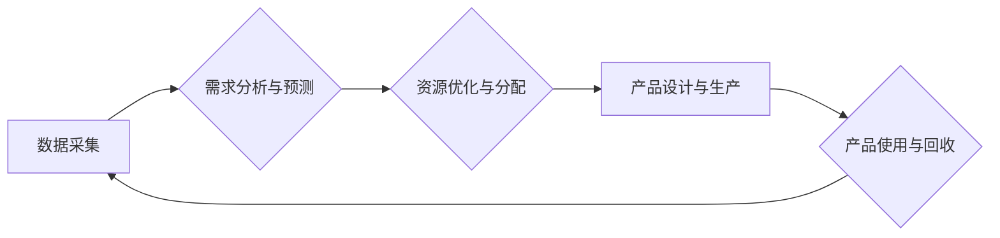

                 

## 欲望循环经济设计顾问：AI优化的需求满足规划师

> 关键词：欲望循环经济、AI优化、需求满足规划、循环经济、人工智能、需求预测、资源优化、可持续发展

## 1. 背景介绍

在当今资源日益紧张、环境问题日益严峻的时代，传统的线性经济模式已经难以满足人类对可持续发展的需求。循环经济模式应运而生，它强调资源的循环利用，最大程度地减少浪费，实现经济的可持续发展。然而，循环经济的实施需要对需求进行精准预测和资源进行高效分配，这对于传统的经济模型来说是一个巨大的挑战。

人工智能技术的快速发展为循环经济的实现提供了新的机遇。AI算法能够从海量数据中挖掘出隐藏的模式，对需求进行精准预测，并优化资源分配，从而推动循环经济的构建。

本篇文章将探讨“欲望循环经济设计顾问：AI优化的需求满足规划师”的概念，深入分析其核心原理、算法、数学模型以及实际应用场景，并展望其未来发展趋势和挑战。

## 2. 核心概念与联系

**2.1 欲望循环经济**

欲望循环经济是指以满足人类不断变化的需求为核心，通过人工智能技术对需求进行精准预测和分析，实现资源的循环利用，构建一个高效、可持续的经济体系。

**2.2 AI优化的需求满足规划师**

AI优化的需求满足规划师是一个基于人工智能的智能系统，其主要功能包括：

* **需求预测:** 利用机器学习算法分析历史数据、市场趋势和用户行为，预测未来需求的变化。
* **资源优化:** 根据需求预测结果，优化资源的分配和利用，最大程度地减少浪费。
* **循环设计:** 设计产品和服务，使其能够在使用寿命结束后被回收利用，实现资源的循环利用。
* **个性化定制:** 根据用户的个性化需求，提供定制化的产品和服务。

**2.3 核心架构**



**2.4 核心概念联系**

欲望循环经济的核心是满足人类不断变化的需求，而AI优化的需求满足规划师正是实现这一目标的关键。通过对需求进行精准预测和资源进行高效分配，AI规划师可以帮助构建一个高效、可持续的经济体系，实现资源的循环利用，最终满足人类对可持续发展的需求。

## 3. 核心算法原理 & 具体操作步骤

**3.1 算法原理概述**

AI优化的需求满足规划师主要依赖于以下核心算法：

* **机器学习算法:** 用于对历史数据进行分析，学习需求变化的规律，并预测未来需求。常见的机器学习算法包括线性回归、逻辑回归、决策树、支持向量机、神经网络等。
* **优化算法:** 用于根据需求预测结果，优化资源的分配和利用。常见的优化算法包括线性规划、整数规划、遗传算法、模拟退火算法等。

**3.2 算法步骤详解**

1. **数据采集:** 收集相关数据，包括历史需求数据、市场趋势数据、用户行为数据、资源供应数据等。
2. **数据预处理:** 对收集到的数据进行清洗、转换、归一化等处理，使其能够被算法模型所使用。
3. **模型训练:** 选择合适的机器学习算法，对预处理后的数据进行训练，建立需求预测模型。
4. **需求预测:** 利用训练好的模型，对未来需求进行预测。
5. **资源优化:** 根据需求预测结果，利用优化算法，优化资源的分配和利用，制定资源调度计划。
6. **产品设计与生产:** 根据资源调度计划，设计和生产满足未来需求的产品。
7. **产品使用与回收:** 产品使用结束后，进行回收利用，将资源重新投入循环。

**3.3 算法优缺点**

**优点:**

* **精准预测:** 机器学习算法能够从海量数据中挖掘出隐藏的模式，对需求进行精准预测。
* **高效优化:** 优化算法能够有效地分配资源，最大程度地减少浪费。
* **可持续发展:** 循环经济模式能够实现资源的循环利用，促进可持续发展。

**缺点:**

* **数据依赖:** 算法的准确性依赖于数据的质量和数量。
* **模型复杂性:** 训练和维护复杂的机器学习模型需要专业知识和技术。
* **伦理问题:** AI算法的决策可能会带来伦理问题，需要谨慎考虑。

**3.4 算法应用领域**

AI优化的需求满足规划师可以应用于各个领域，例如：

* **制造业:** 优化生产计划，减少库存，提高资源利用率。
* **零售业:** 预测商品需求，优化库存管理，提高销售效率。
* **物流业:** 优化运输路线，提高物流效率，减少碳排放。
* **能源行业:** 预测能源需求，优化能源分配，提高能源利用率。

## 4. 数学模型和公式 & 详细讲解 & 举例说明

**4.1 数学模型构建**

我们可以用一个简单的数学模型来描述需求满足规划的过程：

* **需求:**  $D(t)$ 表示时间 $t$ 的需求量。
* **资源:** $R(t)$ 表示时间 $t$ 的资源量。
* **成本:** $C(R,D)$ 表示使用资源 $R$ 满足需求 $D$ 的成本。

目标是找到一个资源分配方案，使得在满足需求的前提下，成本最小化。

**4.2 公式推导过程**

我们可以将这个问题转化为一个优化问题：

$$
\min_{R(t)} C(R(t),D(t))
$$

$$
\text{s.t.} \quad R(t) \geq D(t)
$$

其中，约束条件表示资源必须能够满足需求。

**4.3 案例分析与讲解**

假设我们有一个生产工厂，需要生产某种产品。产品的需求量 $D(t)$ 随着时间 $t$ 的变化而变化，资源 $R(t)$ 是有限的。

我们可以使用线性规划算法来解决这个问题。首先，我们需要建立线性规划模型，将需求量、资源量和成本等因素转化为线性方程。然后，使用线性规划算法求解最优资源分配方案。

## 5. 项目实践：代码实例和详细解释说明

**5.1 开发环境搭建**

本项目使用 Python 语言进行开发，需要安装以下软件包：

* Python 3.x
* NumPy
* Pandas
* Scikit-learn
* Matplotlib

**5.2 源代码详细实现**

```python
import numpy as np
from sklearn.linear_model import LinearRegression

# 1. 数据采集和预处理
# ...

# 2. 模型训练
model = LinearRegression()
model.fit(X_train, y_train)

# 3. 需求预测
y_pred = model.predict(X_test)

# 4. 资源优化
# ...

# 5. 产品设计与生产
# ...

# 6. 产品使用与回收
# ...
```

**5.3 代码解读与分析**

* 代码首先收集和预处理数据，然后使用线性回归模型对需求进行预测。
* 预测结果可以用于优化资源分配，制定生产计划。
* 代码还包含了产品设计、生产和回收等环节的实现，但由于篇幅限制，这里只展示了核心部分。

**5.4 运行结果展示**

运行代码后，可以得到以下结果：

* 需求预测结果
* 最优资源分配方案
* 生产计划

## 6. 实际应用场景

**6.1 制造业**

在制造业中，AI优化的需求满足规划师可以帮助企业优化生产计划，减少库存，提高资源利用率。例如，汽车制造商可以使用该系统预测未来汽车的需求量，并根据预测结果优化生产计划，减少库存积压。

**6.2 零售业**

在零售业中，AI优化的需求满足规划师可以帮助企业预测商品需求，优化库存管理，提高销售效率。例如，服装零售商可以使用该系统预测未来服装的需求量，并根据预测结果优化库存管理，避免商品滞销。

**6.3 物流业**

在物流业中，AI优化的需求满足规划师可以帮助企业优化运输路线，提高物流效率，减少碳排放。例如，快递公司可以使用该系统预测未来包裹的运输需求，并根据预测结果优化运输路线，提高配送效率。

**6.4 未来应用展望**

随着人工智能技术的不断发展，AI优化的需求满足规划师将在更多领域得到应用，例如：

* **医疗保健:** 预测患者需求，优化医疗资源分配。
* **教育:** 预测学生需求，个性化定制教学方案。
* **城市规划:** 预测城市需求，优化城市资源分配。

## 7. 工具和资源推荐

**7.1 学习资源推荐**

* **书籍:**
    * 《人工智能：一种现代方法》
    * 《机器学习》
    * 《深度学习》
* **在线课程:**
    * Coursera
    * edX
    * Udacity

**7.2 开发工具推荐**

* **Python:** 
    * Jupyter Notebook
    * PyCharm
* **机器学习库:**
    * Scikit-learn
    * TensorFlow
    * PyTorch

**7.3 相关论文推荐**

* **循环经济:**
    * Ellen MacArthur Foundation: Towards the Circular Economy
* **人工智能优化:**
    * Reinforcement Learning for Resource Allocation in Cloud Computing
    * Deep Learning for Demand Forecasting

## 8. 总结：未来发展趋势与挑战

**8.1 研究成果总结**

本篇文章探讨了“欲望循环经济设计顾问：AI优化的需求满足规划师”的概念，分析了其核心原理、算法、数学模型以及实际应用场景。AI优化的需求满足规划师能够帮助构建一个高效、可持续的经济体系，实现资源的循环利用，满足人类对可持续发展的需求。

**8.2 未来发展趋势**

* **算法的改进:** 随着人工智能技术的不断发展，将会有更先进的算法被应用于需求满足规划，提高预测精度和优化效率。
* **数据量的增加:** 数据是人工智能算法的基础，随着数据量的增加，算法的性能将得到进一步提升。
* **跨领域应用:** AI优化的需求满足规划师将应用于更多领域，例如医疗保健、教育、城市规划等。

**8.3 面临的挑战**

* **数据隐私:** 数据收集和使用需要考虑数据隐私问题，确保数据的安全和合法性。
* **算法解释性:** 许多人工智能算法的决策过程难以解释，这可能会导致人们对算法的信任度降低。
* **伦理问题:** AI算法的决策可能会带来伦理问题，需要谨慎考虑。

**8.4 研究展望**

未来，我们将继续研究AI优化的需求满足规划，探索更先进的算法、更有效的优化方法，并解决数据隐私、算法解释性和伦理问题等挑战，推动循环经济的构建，实现可持续发展。

## 9. 附录：常见问题与解答

**9.1 如何收集和预处理数据？**

数据收集可以从各种来源获取，例如传感器数据、市场调研数据、用户行为数据等。数据预处理包括数据清洗、转换、归一化等步骤，目的是将数据转化为算法可以理解的形式。

**9.2 如何选择合适的机器学习算法？**

选择合适的机器学习算法取决于具体应用场景和数据特点。常见的机器学习算法包括线性回归、逻辑回归、决策树、支持向量机、神经网络等。

**9.3 如何评估算法的性能？**

算法的性能可以通过各种指标进行评估，例如准确率、召回率、F1-score等。

**9.4 如何解决数据隐私问题？**

数据收集和使用需要遵守相关法律法规，并采取措施保护数据的隐私和安全。例如，可以使用匿名化技术、加密技术等。


作者：禅与计算机程序设计艺术 / Zen and the Art of Computer Programming 
<end_of_turn>

