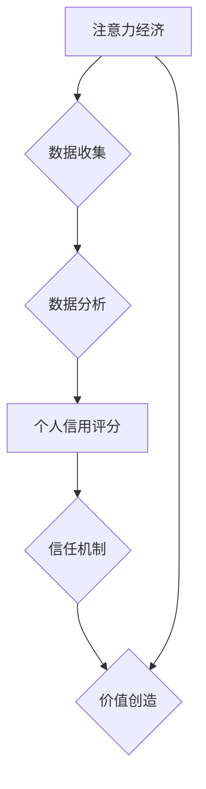

                 

##  注意力经济与个人信用体系的构建

> 关键词：注意力经济、个人信用体系、数据可信度、算法模型、去中心化信任、区块链技术、Web3.0

## 1. 背景介绍

在数字时代，信息爆炸和网络环境的日益复杂化，人们面临着巨大的信息洪流。如何有效地获取、筛选和利用信息，成为了一个至关重要的挑战。同时，随着互联网的普及和社交媒体的兴起，个人数据也变得越来越重要，如何保护个人隐私和数据安全，建立可信赖的个人信用体系，也成为了一个亟待解决的问题。

注意力经济的概念应运而生，它强调了在信息过载的时代，人们对信息的注意力是稀缺资源，而能够有效吸引和利用用户注意力的内容和平台，能够获得更大的价值。个人信用体系则旨在建立一个基于数据和算法的信任机制，通过对个人的行为、信用记录和社会评价进行评估，为个人提供更公平、透明和可信赖的信用评级。

## 2. 核心概念与联系

### 2.1 注意力经济

注意力经济是指在信息爆炸的时代，人们对信息的注意力是稀缺资源，而能够有效吸引和利用用户注意力的内容和平台，能够获得更大的价值。

**核心要素：**

* **注意力：** 作为一种稀缺资源，注意力是人们在信息洪流中选择和处理信息的能力。
* **竞争：** 在注意力经济中，各种内容和平台都在争夺用户的注意力，形成激烈的竞争。
* **价值：** 能够有效吸引和利用用户注意力的内容和平台，能够获得更大的价值，例如广告收入、用户增长和品牌影响力。

### 2.2 个人信用体系

个人信用体系是指基于数据和算法，对个人的行为、信用记录和社会评价进行评估，为个人提供更公平、透明和可信赖的信用评级。

**核心要素：**

* **数据：** 个人信用体系需要收集和分析大量的个人数据，例如交易记录、社交行为、评价信息等。
* **算法：** 算法模型用于对个人数据进行分析和评估，并生成信用评分。
* **信用评级：** 信用评级是个人信用体系的核心输出，它反映了个人在信用方面的表现和风险水平。

### 2.3 连接

注意力经济和个人信用体系之间存在着密切的联系。

* **数据驱动：** 个人信用体系需要大量的数据作为基础，而注意力经济的平台和内容，也能够产生大量的用户数据。
* **信任机制：** 个人信用体系建立了基于数据和算法的信任机制，而注意力经济也需要建立信任机制，才能有效吸引和留住用户。
* **价值创造：** 个人信用体系能够为个人提供更公平、透明和可信赖的信用评级，从而帮助个人获得更多的机会和资源。而注意力经济能够为个人提供更个性化、更精准的信息和服务，从而提升个人生活质量。

**Mermaid 流程图：**



## 3. 核心算法原理 & 具体操作步骤

### 3.1 算法原理概述

个人信用体系的核心算法通常基于机器学习和深度学习技术，通过对历史数据进行训练，建立一个能够预测个人信用风险的模型。常见的算法模型包括：

* **逻辑回归：** 用于分类问题，可以预测个人是否会发生信用违约。
* **支持向量机：** 用于分类问题，可以找到最佳的分隔超平面，将信用良好和信用不良的个人区分开来。
* **决策树：** 用于分类和回归问题，可以根据一系列规则，对个人进行信用评估。
* **随机森林：** 结合多个决策树，提高预测精度。
* **神经网络：** 可以处理复杂的数据关系，并具有较高的预测精度。

### 3.2 算法步骤详解

1. **数据收集：** 收集个人相关的各种数据，例如交易记录、社交行为、评价信息等。
2. **数据预处理：** 对收集到的数据进行清洗、转换和特征工程，使其适合算法模型的训练。
3. **模型选择：** 根据具体的需求和数据特点，选择合适的算法模型。
4. **模型训练：** 使用训练数据对算法模型进行训练，使其能够学习到数据中的规律。
5. **模型评估：** 使用测试数据对模型的性能进行评估，例如准确率、召回率、F1-score等。
6. **模型优化：** 根据评估结果，对模型参数进行调整，提高模型的性能。
7. **模型部署：** 将训练好的模型部署到生产环境中，用于对新用户的信用进行评估。

### 3.3 算法优缺点

**优点：**

* **数据驱动：** 基于数据和算法的评估，更加客观和科学。
* **可量化：** 信用评分可以量化个人信用风险，方便比较和决策。
* **可扩展：** 算法模型可以根据需要进行扩展和改进。

**缺点：**

* **数据偏差：** 数据收集和处理过程中可能存在偏差，影响算法模型的准确性。
* **黑盒问题：** 复杂的算法模型难以解释，难以理解模型的决策过程。
* **隐私安全：** 个人数据的使用需要谨慎处理，避免泄露和滥用。

### 3.4 算法应用领域

个人信用体系的算法模型可以应用于多个领域，例如：

* **金融服务：** 评估贷款申请、设定信用额度、防范欺诈等。
* **保险业：** 评估保险风险、设定保费、防范欺诈等。
* **电商平台：** 评估用户信用，提供信用支付、信用分期等服务。
* **社交平台：** 评估用户行为，识别潜在风险用户。

## 4. 数学模型和公式 & 详细讲解 & 举例说明

### 4.1 数学模型构建

个人信用评分模型通常采用评分函数的形式，将个人数据映射到一个信用评分。评分函数可以根据不同的算法模型和评估指标，采用不同的数学公式。

例如，逻辑回归模型的评分函数可以表示为：

$$
P(Y=1|X) = \frac{1}{1 + e^{-(w^T X + b)}}
$$

其中：

* $P(Y=1|X)$ 是个人信用违约的概率。
* $X$ 是个人数据特征向量。
* $w$ 是模型参数向量。
* $b$ 是模型偏置项。

### 4.2 公式推导过程

逻辑回归模型的评分函数是通过最大似然估计方法推导出来的。最大似然估计的目标是找到模型参数，使得模型能够最大化预测结果与真实结果的匹配度。

### 4.3 案例分析与讲解

假设我们有一个个人信用评分模型，该模型使用逻辑回归算法，并包含以下特征：

* 年龄
* 收入
* 贷款历史
* 逾期记录

我们可以使用训练数据对模型进行训练，并得到模型参数 $w$ 和 $b$。然后，我们可以使用新的个人数据 $X$，代入评分函数，计算出该用户的信用违约概率 $P(Y=1|X)$。

例如，如果一个用户的年龄为 30 岁，收入为 50000 美元，贷款历史良好，没有逾期记录，那么我们可以使用模型参数 $w$ 和 $b$，计算出该用户的信用违约概率。如果该概率很低，那么该用户的信用评分就会较高。

## 5. 项目实践：代码实例和详细解释说明

### 5.1 开发环境搭建

* **操作系统：** Linux 或 macOS
* **编程语言：** Python
* **库依赖：** scikit-learn、pandas、numpy

### 5.2 源代码详细实现

```python
import pandas as pd
from sklearn.linear_model import LogisticRegression
from sklearn.model_selection import train_test_split

# 加载数据
data = pd.read_csv('credit_data.csv')

# 划分训练集和测试集
X = data.drop('credit_score', axis=1)
y = data['credit_score']
X_train, X_test, y_train, y_test = train_test_split(X, y, test_size=0.2, random_state=42)

# 创建逻辑回归模型
model = LogisticRegression()

# 训练模型
model.fit(X_train, y_train)

# 评估模型性能
accuracy = model.score(X_test, y_test)
print(f'模型准确率: {accuracy}')

# 使用模型预测新的信用评分
new_data = pd.DataFrame({
    'age': [30],
    'income': [50000],
    'loan_history': ['good'],
    'overdue_record': ['none']
})
predicted_score = model.predict(new_data)
print(f'预测的信用评分: {predicted_score}')
```

### 5.3 代码解读与分析

* **数据加载和预处理：** 使用 pandas 库加载数据，并进行必要的预处理，例如特征工程。
* **模型选择和训练：** 选择逻辑回归模型，并使用训练数据进行模型训练。
* **模型评估：** 使用测试数据评估模型的性能，例如准确率。
* **模型预测：** 使用训练好的模型对新的数据进行预测，例如预测用户的信用评分。

### 5.4 运行结果展示

运行代码后，会输出模型的准确率和对新数据的预测结果。

## 6. 实际应用场景

### 6.1 金融服务

* **贷款审批：** 基于个人信用评分，银行和金融机构可以更快速、更准确地评估贷款申请，降低贷款风险。
* **信用额度设定：** 根据个人信用评分，为用户设定不同的信用额度，避免过度放贷和信用风险。
* **欺诈检测：** 通过分析用户的信用行为和交易记录，识别潜在的欺诈行为，保护金融机构和用户的利益。

### 6.2 电商平台

* **信用支付：** 为用户提供信用支付服务，例如分期付款、免押金租赁等，提升用户购物体验。
* **信用分期：** 根据用户的信用评分，为用户提供不同的分期付款方案，降低用户的购货成本。
* **商品推荐：** 根据用户的信用评分和消费习惯，推荐更符合用户需求的商品，提升用户购物满意度。

### 6.3 其他领域

* **保险业：** 评估保险风险，设定保费，防范欺诈。
* **社交平台：** 评估用户行为，识别潜在风险用户，维护平台安全。
* **租房平台：** 评估租客信用，降低房东风险。

### 6.4 未来应用展望

随着人工智能技术的不断发展，个人信用体系的应用场景将会更加广泛，例如：

* **去中心化信用体系：** 基于区块链技术，构建去中心化的个人信用体系，提高数据安全性和透明度。
* **个人数据所有权：** 用户可以拥有和控制自己的个人数据，并选择与哪些平台和服务共享数据。
* **个性化信用服务：** 根据用户的信用评分和需求，提供个性化的信用服务，例如信用保险、信用贷款等。

## 7. 工具和资源推荐

### 7.1 学习资源推荐

* **书籍：**
    * 《机器学习》 - 周志华
    * 《深度学习》 - Ian Goodfellow
* **在线课程：**
    * Coursera: Machine Learning
    * edX: Deep Learning
* **博客和网站：**
    * Towards Data Science
    * Machine Learning Mastery

### 7.2 开发工具推荐

* **编程语言：** Python
* **机器学习库：** scikit-learn, TensorFlow, PyTorch
* **数据分析工具：** pandas, NumPy

### 7.3 相关论文推荐

* **Attention is All You Need:** https://arxiv.org/abs/1706.03762
* **BERT: Pre-training of Deep Bidirectional Transformers for Language Understanding:** https://arxiv.org/abs/1810.04805

## 8. 总结：未来发展趋势与挑战

### 8.1 研究成果总结

注意力经济和个人信用体系的结合，为构建更加公平、透明和可信赖的数字社会提供了新的思路和方法。

### 8.2 未来发展趋势

* **去中心化信任：** 基于区块链技术，构建去中心化的个人信用体系，提高数据安全性和透明度。
* **个人数据所有权：** 用户可以拥有和控制自己的个人数据，并选择与哪些平台和服务共享数据。
* **个性化信用服务：** 根据用户的信用评分和需求，提供个性化的信用服务，例如信用保险、信用贷款等。

### 8.3 面临的挑战

* **数据隐私和安全：** 个人信用体系需要处理大量敏感数据，如何保护数据隐私和安全是一个重要的挑战。
* **算法公平性和可解释性：** 算法模型可能存在偏差，导致不公平的信用评估结果。如何提高算法的公平性和可解释性，是一个需要解决的问题。
* **监管和法律框架：** 个人信用体系的应用需要完善的监管和法律框架，以确保其合法合规和可持续发展。

### 8.4 研究展望

未来，个人信用体系的研究将更加注重以下几个方面：

* **隐私保护技术：** 研究更加有效的隐私保护技术，例如联邦学习、同态加密等，保障个人数据安全。
* **算法公平性：** 研究算法公平性评估方法和算法调优技术，减少算法偏差，提高信用评估的公平性。
* **可解释性研究：** 研究更易于理解的算法模型，提高算法的可解释性，增强用户对信用评分的信任。


## 9. 附录：常见问题与解答

**1. 个人信用评分是如何计算的？**

个人信用评分是基于个人数据和算法模型计算出来的，具体计算方法取决于不同的算法模型和评估指标。

**2. 个人信用评分会影响我的日常生活吗？**

是的，个人信用评分可能会影响你的日常生活，例如贷款审批、保险费率、租房资格等。

**3. 如何提高我的个人信用评分？**

可以通过以下方式提高个人信用评分：

* 准时还款
* 控制负债率
* 维护良好的信用记录
* 避免频繁申请贷款

**4. 个人信用评分的数据来源是什么？**

个人信用评分的数据来源包括：

* 银行贷款记录
* 信用卡使用记录
* 电话账单
* 租房记录
* 社交行为等

**5. 个人信用评分是公开的吗？**

个人信用评分的公开程度取决于不同的国家和地区，以及不同的信用机构的政策。

**作者：禅与计算机程序设计艺术 / Zen and the Art of Computer Programming**<end_of_turn>

