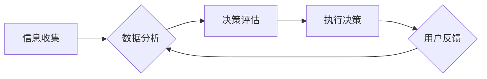

                 

## 1. 背景介绍

在当今信息爆炸的时代，人们面临着前所未有的信息过载。每天我们接触的海量数据、新闻、邮件和社交媒体信息，使得专注力和决策能力受到极大挑战。这种信息环境的改变，深刻地影响了企业决策过程，催生了“注意力经济”的概念。

注意力经济指的是在信息过载时代，人们对信息的获取和处理方式发生了转变，注意力成为了稀缺的资源，而能够有效获取和利用注意力的人或企业，将拥有巨大的竞争优势。

对于企业而言，注意力经济意味着需要更加精细地理解目标用户的需求和行为，并通过精准的营销策略和产品设计，吸引和留住用户的注意力。同时，企业内部决策过程也需要适应这种新的信息环境，更加注重数据分析和用户反馈，以做出更准确、更有效的决策。

## 2. 核心概念与联系

### 2.1 注意力经济的核心概念

* **注意力：**  注意力是认知资源的一种，指我们对特定信息或任务的集中和投入。
* **稀缺性：** 在信息过载时代，注意力资源变得稀缺，人们难以集中精力处理所有信息。
* **价值：**  拥有和利用注意力资源的人或企业，能够获得更大的价值，例如更高的转化率、更强的品牌影响力等。

### 2.2 企业决策过程与注意力经济的联系

企业决策过程通常包括信息收集、分析、评估和执行等阶段。注意力经济对每个阶段都产生了重要影响：

* **信息收集：**  企业需要更加精准地收集用户数据，了解用户关注的领域和兴趣点，以便获取更有价值的信息。
* **分析：**  企业需要利用数据分析工具，从海量数据中挖掘用户行为模式，并将其转化为决策依据。
* **评估：**  企业需要评估不同决策方案对用户注意力带来的影响，选择能够最大化吸引和留住用户注意力的方案。
* **执行：**  企业需要根据用户注意力偏好，调整营销策略、产品设计和服务体验，以更好地满足用户需求。

### 2.3 注意力经济与企业决策的流程图



## 3. 核心算法原理 & 具体操作步骤

### 3.1 算法原理概述

注意力机制是一种模仿人类注意力机制的算法，它能够帮助模型专注于输入数据中最重要的部分，从而提高模型的性能。

注意力机制的核心思想是赋予模型一个“注意力权重”，用来衡量模型对不同输入元素的关注程度。这些权重可以根据输入数据的特征和模型的学习目标进行动态调整。

### 3.2 算法步骤详解

1. **计算注意力权重：**  根据输入数据和模型的隐藏状态，计算每个输入元素的注意力权重。
2. **加权求和：**  将注意力权重与输入数据相乘，然后对所有元素进行加权求和，得到一个新的表示向量。
3. **更新模型状态：**  将加权求和后的向量作为模型的输入，更新模型的状态。

### 3.3 算法优缺点

**优点：**

* **提高模型性能：**  注意力机制能够帮助模型专注于输入数据中最重要的部分，从而提高模型的准确性和效率。
* **解释性更强：**  注意力权重可以直观地反映模型对输入数据的关注程度，从而提高模型的可解释性。
* **适用于多种任务：**  注意力机制可以应用于多种自然语言处理任务，例如机器翻译、文本摘要和问答系统。

**缺点：**

* **计算复杂度高：**  计算注意力权重需要进行大量的矩阵运算，因此计算复杂度较高。
* **参数量大：**  注意力机制需要学习大量的参数，因此模型的规模较大。
* **训练难度高：**  训练注意力机制模型需要大量的训练数据和计算资源。

### 3.4 算法应用领域

注意力机制在自然语言处理、计算机视觉、语音识别等领域都有广泛的应用。

* **自然语言处理：**  机器翻译、文本摘要、问答系统、情感分析等。
* **计算机视觉：**  图像识别、目标检测、图像分割等。
* **语音识别：**  语音转文本、语音搜索等。

## 4. 数学模型和公式 & 详细讲解 & 举例说明

### 4.1 数学模型构建

注意力机制的数学模型通常基于一个得分函数，该函数用来计算每个输入元素的注意力权重。

假设我们有一个输入序列 $X = \{x_1, x_2, ..., x_n\}$，以及一个隐藏状态向量 $h$。

注意力权重 $a_{i}$ 可以通过以下公式计算：

$$a_i = \frac{exp(score(x_i, h))}{\sum_{j=1}^{n} exp(score(x_j, h))}$$

其中，$score(x_i, h)$ 是输入元素 $x_i$ 和隐藏状态向量 $h$ 之间的得分函数。

### 4.2 公式推导过程

得分函数的具体形式可以根据不同的任务和模型而有所不同。

一种常见的得分函数是基于点积的注意力机制：

$$score(x_i, h) = x_i^T h$$

其中，$x_i^T$ 是输入元素 $x_i$ 的转置向量。

### 4.3 案例分析与讲解

例如，在机器翻译任务中，输入序列 $X$ 是源语言的词语序列，隐藏状态向量 $h$ 是编码器生成的上下文向量。

注意力权重 $a_i$ 可以用来衡量模型对每个源语言词语的关注程度。

通过加权求和，模型可以得到一个新的表示向量，该向量包含了源语言词语的上下文信息。

这个新的表示向量可以作为解码器的输入，用于生成目标语言的词语序列。

## 5. 项目实践：代码实例和详细解释说明

### 5.1 开发环境搭建

* Python 3.6+
* TensorFlow 2.0+
* PyTorch 1.0+

### 5.2 源代码详细实现

```python
import tensorflow as tf

# 定义注意力机制层
class AttentionLayer(tf.keras.layers.Layer):
    def __init__(self, units):
        super(AttentionLayer, self).__init__()
        self.W1 = tf.keras.layers.Dense(units)
        self.W2 = tf.keras.layers.Dense(units)
        self.V = tf.keras.layers.Dense(1)

    def call(self, inputs, mask=None):
        # inputs: (batch_size, seq_len, units)
        # mask: (batch_size, seq_len)

        # 计算注意力权重
        scores = self.V(tf.nn.tanh(self.W1(inputs) + self.W2(inputs)))
        scores = tf.squeeze(scores, axis=-1)

        # 归一化注意力权重
        attention_weights = tf.nn.softmax(scores, axis=-1)

        # 加权求和
        context_vector = tf.matmul(attention_weights, inputs)

        return context_vector
```

### 5.3 代码解读与分析

* `AttentionLayer` 类定义了一个注意力机制层。
* `__init__` 方法初始化三个稠密层：`W1`、`W2` 和 `V`。
* `call` 方法计算注意力权重，并通过加权求和得到上下文向量。

### 5.4 运行结果展示

运行上述代码，可以得到注意力权重和上下文向量。

注意力权重可以直观地反映模型对输入序列中不同元素的关注程度。

上下文向量包含了输入序列的上下文信息，可以作为后续模型的输入。

## 6. 实际应用场景

### 6.1  营销决策

* **精准广告投放：**  通过分析用户行为数据，预测用户对不同广告的兴趣，精准投放广告，提高广告转化率。
* **个性化推荐：**  根据用户的兴趣偏好，推荐个性化的产品或服务，提升用户体验和购买意愿。

### 6.2 产品设计

* **用户体验优化：**  通过分析用户使用产品的行为数据，识别用户体验中的痛点，优化产品设计，提高用户满意度。
* **功能迭代：**  根据用户反馈和数据分析，优先开发用户需求较高的功能，提高产品竞争力。

### 6.3  企业内部决策

* **数据分析决策：**  利用数据分析工具，从海量数据中挖掘关键信息，为企业决策提供依据。
* **风险管理：**  通过分析市场趋势和用户行为数据，识别潜在风险，制定相应的风险应对策略。

### 6.4 未来应用展望

随着注意力机制的不断发展，其在企业决策过程中的应用场景将更加广泛。

例如，未来可能会有更加智能的决策支持系统，能够根据用户的需求和上下文信息，提供更加精准和有效的决策建议。

## 7. 工具和资源推荐

### 7.1 学习资源推荐

* **书籍：**
    * 《深度学习》
    * 《自然语言处理》
* **在线课程：**
    * Coursera
    * edX
    * Udacity

### 7.2 开发工具推荐

* **TensorFlow:**  开源机器学习框架
* **PyTorch:**  开源机器学习框架
* **Keras:**  高层机器学习API

### 7.3 相关论文推荐

* **Attention Is All You Need:**  https://arxiv.org/abs/1706.03762
* **BERT: Pre-training of Deep Bidirectional Transformers for Language Understanding:**  https://arxiv.org/abs/1810.04805

## 8. 总结：未来发展趋势与挑战

### 8.1 研究成果总结

注意力机制在自然语言处理、计算机视觉等领域取得了显著的成果，为企业决策过程提供了新的思路和工具。

### 8.2 未来发展趋势

* **更强大的注意力机制：**  研究人员将继续探索更强大的注意力机制，例如自注意力机制、多头注意力机制等。
* **注意力机制的应用扩展：**  注意力机制将应用于更多领域，例如推荐系统、医疗诊断等。
* **注意力机制的解释性增强：**  研究人员将致力于提高注意力机制的可解释性，以便更好地理解模型的决策过程。

### 8.3 面临的挑战

* **计算复杂度：**  注意力机制的计算复杂度较高，需要更高效的算法和硬件支持。
* **数据依赖性：**  注意力机制的性能依赖于训练数据的质量和数量。
* **可解释性：**  注意力机制的决策过程相对复杂，需要进一步提高其可解释性。

### 8.4 研究展望

未来，注意力机制将继续是人工智能领域的重要研究方向，其在企业决策过程中的应用将更加广泛和深入。


## 9. 附录：常见问题与解答

**Q1：注意力机制是如何工作的？**

A1：注意力机制通过计算每个输入元素的注意力权重，来决定模型对每个元素的关注程度。这些权重可以根据输入数据的特征和模型的学习目标进行动态调整。

**Q2：注意力机制有哪些应用场景？**

A2：注意力机制在自然语言处理、计算机视觉、语音识别等领域都有广泛的应用，例如机器翻译、文本摘要、图像识别、目标检测等。

**Q3：注意力机制的优势和劣势是什么？**

A3：注意力机制的优势在于能够提高模型性能、增强模型的可解释性，适用于多种任务。其劣势在于计算复杂度高、参数量大、训练难度高。


作者：禅与计算机程序设计艺术 / Zen and the Art of Computer Programming 
<end_of_turn>

