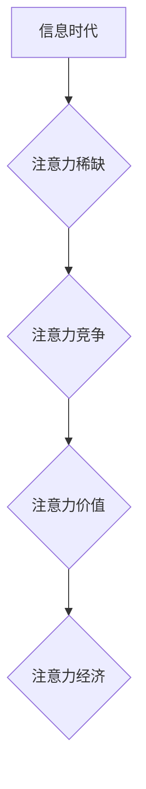

                 

## 1. 背景介绍

随着科技的飞速发展，人类进入信息爆炸时代，人们每天接触的信息量呈指数级增长。这种信息过载导致人们的注意力变得稀缺，注意力成为了最宝贵的资源。因此，"注意力经济"应运而生，它强调了在信息时代，获取和保持用户注意力对于个人和组织的成功至关重要。

城市公共空间作为人们生活、工作、休闲的重要场所，也受到注意力经济的影响。传统的城市公共空间设计往往注重功能性和美观性，而忽略了人们在空间中的注意力体验。随着人们对生活品质的追求不断提高，城市公共空间的设计需要更加注重用户体验，特别是注意力体验。

## 2. 核心概念与联系

### 2.1 注意力经济

注意力经济是指在信息时代，注意力成为了最稀缺的资源，而获取和保持用户注意力成为了商业和个人竞争的关键。

**核心原理：**

* **注意力稀缺：** 人类注意力有限，无法同时处理大量信息。
* **注意力竞争：** 各种信息来源都在争夺用户的注意力。
* **注意力价值：** 获取和保持用户注意力具有巨大的价值。

**架构：**



### 2.2 城市公共空间

城市公共空间是指城市中供公众使用的开放空间，包括公园、广场、街道、公共建筑等。

**核心功能：**

* **提供公共服务：** 例如交通、商业、文化等。
* **促进社会交往：** 为人们提供交流、互动、休闲的场所。
* **提升城市形象：** 营造宜居、宜业、宜游的城市环境。

**联系：**

注意力经济对城市公共空间设计的影响主要体现在以下几个方面：

* **用户体验：** 城市公共空间的设计需要更加注重用户体验，特别是注意力体验。
* **信息交互：** 城市公共空间可以作为信息交互的平台，利用科技手段吸引和引导用户的注意力。
* **空间组织：** 城市公共空间的组织和布局需要考虑用户的注意力流向，引导用户在空间中停留和互动。

## 3. 核心算法原理 & 具体操作步骤

### 3.1 算法原理概述

注意力机制是一种模仿人类注意力机制的算法，它能够学习到哪些信息对任务最相关，并对这些信息给予更多的关注。

**核心思想：**

* **注意力权重：** 为每个输入元素分配一个权重，表示其对任务的 relevance。
* **加权求和：** 根据注意力权重对输入元素进行加权求和，得到最终的输出。

### 3.2 算法步骤详解

1. **输入数据：** 将输入数据作为序列进行处理。
2. **计算注意力权重：** 使用注意力机制计算每个输入元素的注意力权重。
3. **加权求和：** 根据注意力权重对输入元素进行加权求和，得到最终的输出。

### 3.3 算法优缺点

**优点：**

* **提高模型性能：** 注意力机制能够帮助模型学习到更重要的信息，从而提高模型的性能。
* **解释性更强：** 注意力权重可以直观地反映模型对哪些信息更加关注，提高模型的解释性。

**缺点：**

* **计算复杂度高：** 注意力机制的计算复杂度较高，需要更多的计算资源。
* **参数量大：** 注意力机制需要更多的参数，可能会导致模型过拟合。

### 3.4 算法应用领域

注意力机制在自然语言处理、计算机视觉、语音识别等领域都有广泛的应用。

## 4. 数学模型和公式 & 详细讲解 & 举例说明

### 4.1 数学模型构建

注意力机制的数学模型可以表示为：

$$
\text{Attention}(Q, K, V) = \text{softmax}\left(\frac{Q K^T}{\sqrt{d_k}}\right) V
$$

其中：

* $Q$：查询矩阵
* $K$：键矩阵
* $V$：值矩阵
* $d_k$：键向量的维度
* $\text{softmax}$：softmax函数

### 4.2 公式推导过程

注意力机制的公式推导过程如下：

1. 计算查询矩阵 $Q$ 和键矩阵 $K$ 的点积，并除以 $\sqrt{d_k}$。
2. 对点积结果应用 softmax 函数，得到注意力权重矩阵。
3. 将注意力权重矩阵与值矩阵 $V$ 进行加权求和，得到最终的输出。

### 4.3 案例分析与讲解

**举例说明：**

假设我们有一个句子 "我爱吃苹果"，我们想要计算每个词语对句子整体含义的注意力权重。

1. 将句子中的每个词语作为输入，得到查询矩阵 $Q$、键矩阵 $K$ 和值矩阵 $V$。
2. 计算 $Q$ 和 $K$ 的点积，并除以 $\sqrt{d_k}$。
3. 对点积结果应用 softmax 函数，得到每个词语的注意力权重。
4. 将注意力权重与 $V$ 进行加权求和，得到最终的句子表示。

## 5. 项目实践：代码实例和详细解释说明

### 5.1 开发环境搭建

* Python 3.x
* TensorFlow 或 PyTorch

### 5.2 源代码详细实现

```python
import tensorflow as tf

# 定义注意力机制
def attention_layer(inputs, key, value, mask=None):
    # 计算注意力权重
    attention_weights = tf.matmul(inputs, key, transpose_b=True) / tf.math.sqrt(tf.cast(key.shape[-1], tf.float32))
    if mask is not None:
        attention_weights = attention_weights + (mask * -1e9)
    attention_weights = tf.nn.softmax(attention_weights, axis=-1)
    # 加权求和
    output = tf.matmul(attention_weights, value)
    return output

# 示例代码
inputs = tf.random.normal([3, 5, 128])
key = tf.random.normal([3, 5, 64])
value = tf.random.normal([3, 5, 128])

output = attention_layer(inputs, key, value)
print(output.shape)
```

### 5.3 代码解读与分析

* `attention_layer` 函数定义了注意力机制的计算过程。
* `tf.matmul` 函数计算矩阵乘积。
* `tf.math.sqrt` 函数计算平方根。
* `tf.nn.softmax` 函数计算 softmax 函数。
* `tf.cast` 函数将数据类型转换为 float32。
* `mask` 参数用于屏蔽某些输入元素，例如在机器翻译中屏蔽已经翻译过的词语。

### 5.4 运行结果展示

运行上述代码，输出结果为 `(3, 5, 128)`，表示注意力机制的输出维度与值矩阵相同。

## 6. 实际应用场景

### 6.1 城市公共空间设计

* **智能导览系统：** 利用注意力机制，根据用户的兴趣和位置，推荐附近的景点和服务。
* **个性化体验：** 根据用户的行为和偏好，定制不同的公共空间体验，例如灯光、音乐、景观等。
* **互动设施设计：** 设计更具吸引力和互动性的公共设施，例如数字艺术装置、互动游戏等。

### 6.2 其他应用场景

* **教育领域：** 帮助学生更好地理解和记忆知识。
* **医疗领域：** 辅助医生诊断和治疗疾病。
* **金融领域：** 识别欺诈交易和预测市场趋势。

### 6.4 未来应用展望

随着人工智能技术的不断发展，注意力机制将在更多领域得到应用，为人们的生活带来更多便利和乐趣。

## 7. 工具和资源推荐

### 7.1 学习资源推荐

* **书籍：**
    * 《深度学习》
    * 《Attention Is All You Need》
* **在线课程：**
    * Coursera
    * edX
* **博客和论坛：**
    * TensorFlow Blog
    * PyTorch Forum

### 7.2 开发工具推荐

* **TensorFlow:** 开源机器学习框架
* **PyTorch:** 开源机器学习框架
* **Keras:** 高级深度学习API

### 7.3 相关论文推荐

* 《Attention Is All You Need》
* 《BERT: Pre-training of Deep Bidirectional Transformers for Language Understanding》
* 《Transformer-XL: Attentive Language Models Beyond a Fixed-Length Context》

## 8. 总结：未来发展趋势与挑战

### 8.1 研究成果总结

注意力机制是一种重要的机器学习算法，它能够帮助模型学习到更重要的信息，从而提高模型的性能。注意力机制在自然语言处理、计算机视觉、语音识别等领域都有广泛的应用。

### 8.2 未来发展趋势

* **更有效的注意力机制：** 研究更有效的注意力机制，例如自注意力机制、多头注意力机制等。
* **注意力机制的应用扩展：** 将注意力机制应用到更多领域，例如机器人、自动驾驶等。
* **注意力机制的解释性：** 研究注意力机制的解释性，使其更加透明和可理解。

### 8.3 面临的挑战

* **计算复杂度：** 注意力机制的计算复杂度较高，需要更多的计算资源。
* **参数量大：** 注意力机制需要更多的参数，可能会导致模型过拟合。
* **数据依赖性：** 注意力机制的性能依赖于数据的质量和数量。

### 8.4 研究展望

未来，注意力机制的研究将继续深入，并应用到更多领域，为人工智能的发展做出更大的贡献。

## 9. 附录：常见问题与解答

* **什么是注意力机制？**

注意力机制是一种模仿人类注意力机制的算法，它能够学习到哪些信息对任务最相关，并对这些信息给予更多的关注。

* **注意力机制的应用场景有哪些？**

注意力机制在自然语言处理、计算机视觉、语音识别等领域都有广泛的应用。

* **如何实现注意力机制？**

可以使用 TensorFlow 或 PyTorch 等机器学习框架实现注意力机制。

作者：禅与计算机程序设计艺术 / Zen and the Art of Computer Programming


<end_of_turn>

