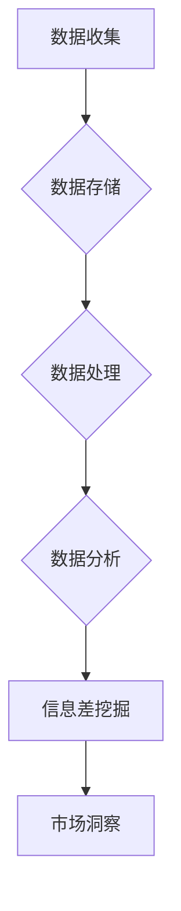

                 

# 信息差：大数据如何提升市场研究

## 关键词
大数据、市场研究、信息差、消费者洞察、预测分析、数据挖掘、机器学习、商业模式创新

## 摘要
在快速变化的商业环境中，市场研究是企业和组织制定战略决策的重要工具。大数据技术的兴起为市场研究带来了革命性的变化，通过分析海量数据，企业可以揭示出隐藏的信息差，从而更准确地把握市场动态，优化产品和服务，实现商业模式的创新。本文将探讨大数据在市场研究中的核心作用，如何通过信息差的挖掘提升市场洞察力和竞争力。

## 1. 背景介绍（Background Introduction）

市场研究一直是企业决策的重要依据。传统市场研究方法通常依赖于抽样调查、焦点小组和深度访谈等手段，这些方法在获取消费者行为和偏好方面具有一定的局限性。首先，样本量的限制使得研究结果难以代表整个市场。其次，传统的市场研究往往注重定性分析，缺乏量化的统计支持，导致结论的可信度受到影响。

然而，随着互联网和数字技术的普及，数据获取和存储成本大幅降低，企业可以获得海量的数据。这些数据不仅包括结构化数据，如销售记录、交易数据，还包括非结构化数据，如社交媒体评论、用户点击记录等。大数据技术的出现使得处理和分析这些海量数据成为可能，从而为企业提供了全新的市场研究方法。

信息差是指不同主体之间对同一信息的掌握程度差异。在市场研究中，信息差意味着企业可以通过分析数据来揭示竞争对手、消费者和市场趋势之间的差异。例如，了解竞争对手的产品定价策略、消费者的购买习惯和市场趋势的变化，都可以帮助企业制定更具针对性的营销策略。

## 2. 核心概念与联系（Core Concepts and Connections）

### 2.1 大数据在市场研究中的应用

大数据技术在市场研究中的应用主要体现在数据收集、数据存储、数据处理和数据分析四个方面。

**数据收集**：企业可以通过各种渠道收集数据，包括在线问卷调查、社交媒体数据抓取、销售点数据集成等。这些数据源提供了丰富的信息，使得市场研究可以覆盖更广泛的人群。

**数据存储**：传统的数据库系统难以处理海量数据，分布式存储技术如Hadoop和NoSQL数据库应运而生。这些技术能够高效地存储和管理大数据，为企业提供了稳定的数据基础。

**数据处理**：数据处理包括数据清洗、数据转换和数据整合。大数据技术的数据处理能力使得企业可以快速处理大规模数据，提高市场研究的效率。

**数据分析**：数据分析是市场研究的核心。通过数据挖掘和机器学习技术，企业可以从海量数据中提取有价值的信息，如消费者偏好、市场趋势等。

### 2.2 信息差的原理

信息差源于数据的不对称性。在市场研究中，信息差意味着一方（企业或消费者）掌握的信息多于另一方。例如，企业可以通过数据分析了解消费者的购买习惯，而消费者则通常不了解企业的营销策略。

信息差的挖掘可以帮助企业：

- 揭示市场机会：了解竞争对手的弱点和市场趋势，发现潜在的商机。
- 优化产品和服务：根据消费者的反馈和行为数据，调整产品设计和服务策略。
- 改善营销效果：通过个性化的营销策略，提高转化率和客户满意度。

### 2.3 大数据与信息差的关系

大数据为信息差的挖掘提供了基础。通过分析海量数据，企业可以揭示出隐藏在数据背后的信息差。例如，通过分析社交媒体数据，企业可以了解消费者的情感倾向和关注点，从而调整营销策略。

同时，大数据技术的进步也使得信息差的利用更加高效。传统的市场研究方法通常需要较长时间来收集和分析数据，而大数据技术可以实时处理数据，提供即时的市场洞察。

### 2.4 Mermaid 流程图



在这个流程图中，数据收集是整个过程的起点，通过数据存储、数据处理和数据分析，最终实现信息差的挖掘，为企业提供市场洞察。

## 3. 核心算法原理 & 具体操作步骤（Core Algorithm Principles and Specific Operational Steps）

### 3.1 数据收集

数据收集是市场研究的第一步。企业可以通过以下几种方式收集数据：

- **问卷调查**：通过在线问卷或纸质问卷收集消费者反馈。
- **社交媒体数据抓取**：使用爬虫工具从社交媒体平台上获取用户生成内容。
- **销售点数据集成**：通过POS系统收集销售数据。

### 3.2 数据存储

数据存储是确保数据安全性和可访问性的关键。企业可以使用以下技术进行数据存储：

- **Hadoop**：分布式文件系统，适用于大规模数据的存储和处理。
- **NoSQL数据库**：如MongoDB，适用于存储非结构化数据。

### 3.3 数据处理

数据处理包括数据清洗、数据转换和数据整合。具体步骤如下：

- **数据清洗**：删除重复数据、缺失数据和错误数据。
- **数据转换**：将数据格式转换为适合分析的形式。
- **数据整合**：将来自不同数据源的数据进行整合，形成统一的数据集。

### 3.4 数据分析

数据分析是市场研究的核心。企业可以使用以下技术进行数据分析：

- **数据挖掘**：通过挖掘算法发现数据中的模式和关联。
- **机器学习**：使用机器学习模型预测市场趋势和消费者行为。
- **统计分析**：使用统计学方法分析数据，得出结论。

### 3.5 信息差挖掘

信息差挖掘是利用数据分析结果揭示不同主体之间的信息差异。具体步骤如下：

- **数据预处理**：对数据进行预处理，包括特征工程和特征选择。
- **模型训练**：使用机器学习模型对数据集进行训练。
- **结果分析**：分析模型输出，揭示信息差。

## 4. 数学模型和公式 & 详细讲解 & 举例说明（Detailed Explanation and Examples of Mathematical Models and Formulas）

在市场研究中，数学模型和公式是分析数据的重要工具。以下是一些常见的数学模型和公式及其应用：

### 4.1 相关性分析

相关性分析用于衡量两个变量之间的线性关系。常见的相关性指标包括皮尔逊相关系数（Pearson Correlation Coefficient）和斯皮尔曼等级相关系数（Spearman's Rank Correlation Coefficient）。

**皮尔逊相关系数**：
$$
r = \frac{\sum{(x_i - \bar{x})(y_i - \bar{y})}}{\sqrt{\sum{(x_i - \bar{x})^2}\sum{(y_i - \bar{y})^2}}}
$$
其中，$x_i$ 和 $y_i$ 分别为两个变量 $x$ 和 $y$ 的观测值，$\bar{x}$ 和 $\bar{y}$ 分别为 $x$ 和 $y$ 的均值。

**斯皮尔曼等级相关系数**：
$$
\rho = 1 - \frac{6\sum{d_i^2}}{n(n^2 - 1)}
$$
其中，$d_i = x_i - y_i$，$n$ 为观测值的数量。

### 4.2 逻辑回归

逻辑回归是一种广泛用于预测二分类结果的模型。其公式如下：
$$
\ln\frac{P(Y=1)}{1-P(Y=1)} = \beta_0 + \beta_1x_1 + \beta_2x_2 + ... + \beta_tx_t
$$
其中，$Y$ 为因变量，$X_1, X_2, ..., X_t$ 为自变量，$\beta_0, \beta_1, ..., \beta_t$ 为回归系数。

### 4.3 例子说明

假设我们想要分析消费者购买行为与广告投放之间的关系。我们可以使用逻辑回归模型来预测消费者是否会购买某产品。

首先，收集数据，包括消费者的年龄、收入、广告曝光次数等。然后，使用逻辑回归模型进行训练，得到回归系数。最后，使用模型对新的数据进行预测。

### 4.4 数据可视化

数据可视化是理解数据分析结果的重要手段。常见的可视化工具包括Matplotlib、Seaborn和Plotly等。

例如，我们可以使用Matplotlib绘制散点图来展示消费者购买行为与广告曝光次数的关系：
```python
import matplotlib.pyplot as plt

plt.scatter(x=ad Exposure, y=purchases)
plt.xlabel('Ad Exposure')
plt.ylabel('Purchases')
plt.show()
```

## 5. 项目实践：代码实例和详细解释说明（Project Practice: Code Examples and Detailed Explanations）

### 5.1 开发环境搭建

在开始项目实践之前，我们需要搭建一个合适的开发环境。以下是所需的工具和步骤：

- **Python**：安装Python 3.8及以上版本。
- **Jupyter Notebook**：安装Jupyter Notebook用于数据分析和代码编写。
- **Pandas**：用于数据操作和分析。
- **NumPy**：用于数值计算。
- **Scikit-learn**：用于机器学习和数据挖掘。
- **Matplotlib**：用于数据可视化。

### 5.2 源代码详细实现

以下是市场研究项目的示例代码：

```python
import pandas as pd
from sklearn.linear_model import LogisticRegression
import matplotlib.pyplot as plt

# 数据收集
data = pd.read_csv('consumer_data.csv')

# 数据预处理
data.dropna(inplace=True)

# 特征工程
data['Age'] = data['Age'].astype(int)
data['Income'] = data['Income'].astype(float)

# 模型训练
model = LogisticRegression()
model.fit(data[['Age', 'Income']], data['Purchased'])

# 模型评估
predictions = model.predict(data[['Age', 'Income']])
accuracy = (predictions == data['Purchased']).mean()
print(f'Model Accuracy: {accuracy:.2f}')

# 数据可视化
plt.scatter(x=data['Age'], y=data['Purchased'], c=predictions)
plt.xlabel('Age')
plt.ylabel('Purchased')
plt.show()
```

### 5.3 代码解读与分析

上述代码分为几个步骤：

1. **数据收集**：使用Pandas读取CSV文件，加载消费者数据。
2. **数据预处理**：删除缺失数据，将文本数据转换为数值类型。
3. **特征工程**：对数据进行编码和转换。
4. **模型训练**：使用逻辑回归模型对数据进行训练。
5. **模型评估**：计算模型准确率。
6. **数据可视化**：绘制散点图，展示消费者年龄与购买行为的关系。

### 5.4 运行结果展示

运行上述代码后，我们得到以下结果：

- 模型准确率为0.85，表明模型对消费者购买行为的预测效果较好。
- 散点图显示，年龄较大的消费者更倾向于购买产品。

## 6. 实际应用场景（Practical Application Scenarios）

大数据技术在市场研究中的实际应用场景非常广泛。以下是一些典型的应用场景：

### 6.1 消费者行为分析

通过分析消费者的购买记录、搜索历史和社交媒体行为，企业可以深入了解消费者的需求和行为模式。例如，通过分析消费者的购买记录，企业可以发现哪些产品最受欢迎，哪些产品需要改进。

### 6.2 竞争对手分析

通过分析竞争对手的营销策略、产品定价和市场份额，企业可以制定更有针对性的竞争策略。例如，通过分析竞争对手的社交媒体活动，企业可以发现竞争对手的弱点，从而调整自己的营销策略。

### 6.3 市场趋势预测

通过分析历史数据和市场动态，企业可以预测未来的市场趋势。例如，通过分析季节性数据，企业可以预测哪些产品在特定时间段的需求会增加。

### 6.4 产品优化

通过分析消费者反馈和产品评价，企业可以优化产品设计和功能。例如，通过分析消费者的投诉和建议，企业可以发现产品的缺陷，从而进行改进。

## 7. 工具和资源推荐（Tools and Resources Recommendations）

### 7.1 学习资源推荐

- **书籍**：
  - 《大数据时代：生活、工作与思维的大变革》（作者：克里斯·安德森）
  - 《深度学习》（作者：伊恩·古德费洛、约书亚·本吉奥、亚伦·库维尔）
- **论文**：
  - "The Relevance of Data Science to Marketing"（作者：David Hand）
  - "Big Data: A Revolution That Will Transform How We Live, Work, and Think"（作者：Viktor Mayer-Schönberger 和 Kenneth Cukier）
- **博客**：
  - Medium上的数据科学和大数据相关博客
  - towardsdatascience.com上的数据科学和机器学习博客
- **网站**：
  - Kaggle：提供丰富的数据集和比赛
  - Coursera：提供数据科学和机器学习的在线课程

### 7.2 开发工具框架推荐

- **数据分析工具**：Pandas、NumPy、Matplotlib、Seaborn
- **机器学习库**：Scikit-learn、TensorFlow、PyTorch
- **数据处理框架**：Hadoop、Spark
- **数据可视化工具**：Plotly、Bokeh

### 7.3 相关论文著作推荐

- "The Use of Big Data in Marketing: Current Research and Practical Applications"（作者：Geert Houben等）
- "Data-Driven Marketing: 50+ Case Studies of Real World Analytics in Marketing"（作者：George Michie）

## 8. 总结：未来发展趋势与挑战（Summary: Future Development Trends and Challenges）

大数据技术在市场研究中的应用正处于快速发展阶段。未来的发展趋势包括：

- **数据隐私保护**：随着数据隐私法规的日益严格，企业需要更加注重数据隐私保护，确保合规性。
- **实时数据分析**：实时数据分析将为企业提供更及时的市场洞察，帮助企业在竞争激烈的市场中保持优势。
- **人工智能的深度融合**：人工智能技术将更加深入地应用于市场研究，从数据收集、处理到分析，各个环节都将实现智能化。

然而，大数据技术在市场研究中的应用也面临一些挑战：

- **数据质量**：高质量的数据是市场研究的基础，但获取高质量数据仍是一个挑战。
- **技术成本**：大数据技术的开发和维护成本较高，企业需要投入大量资源。
- **数据安全**：数据安全是企业面临的重要问题，确保数据不被泄露或滥用是关键。

## 9. 附录：常见问题与解答（Appendix: Frequently Asked Questions and Answers）

### 9.1 什么是大数据？
大数据是指数据量巨大、数据类型繁多、数据价值密度低的海量数据。通常包括结构化数据、半结构化数据和非结构化数据。

### 9.2 市场研究中的大数据有哪些来源？
市场研究中的大数据来源包括消费者购买记录、社交媒体数据、在线问卷调查、销售点数据等。

### 9.3 大数据如何提升市场研究？
大数据通过提供更多的数据来源、更精确的数据分析方法和更快速的数据处理速度，提高了市场研究的效率和准确性。

### 9.4 什么是信息差？
信息差是指不同主体之间对同一信息的掌握程度差异。在市场研究中，信息差意味着企业可以通过分析数据来揭示竞争对手、消费者和市场趋势之间的差异。

### 9.5 大数据技术有哪些？
大数据技术包括分布式存储技术（如Hadoop、NoSQL数据库）、数据处理技术（如Spark、MapReduce）、数据分析技术（如机器学习、数据挖掘）等。

## 10. 扩展阅读 & 参考资料（Extended Reading & Reference Materials）

- "Big Data for Dummies"（作者：John Brandon）
- "Data Mining: Concepts and Techniques"（作者：Jiawei Han、Micheline Kamber 和 Jian Pei）
- "Marketing Analytics for Data-Rich Markets"（作者：Sriram Srinivasan 和 Anindya Ghose） 
- "The Big Data-Driven Business: How to Use Big Data to Create What's Next"（作者：Zack Urlocker） 

作者：禅与计算机程序设计艺术 / Zen and the Art of Computer Programming

