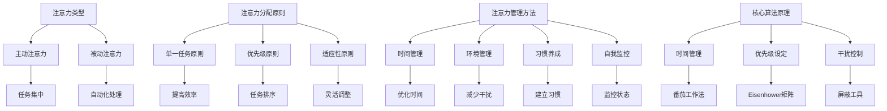
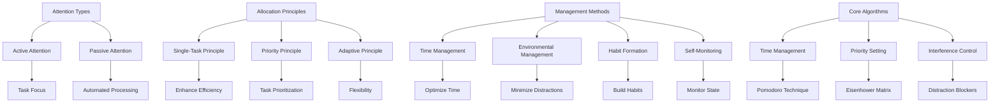

                 

### 文章标题

**信息时代的注意力管理策略与实践：在干扰和信息过载中航行**

在当今这个信息爆炸的时代，我们每个人都面临着前所未有的挑战。各种信息源源不断地涌入我们的生活，从社交媒体的动态到电子邮件的提示，从手机通知到即时消息，这些都对我们的注意力构成了巨大的干扰。这种现象被称为“信息过载”，它对我们的工作效率、心理状态以及生活质量产生了深远的影响。因此，如何有效地管理我们的注意力，成为了一个迫切需要解决的问题。

本文将探讨信息时代下注意力管理的核心策略和实践，帮助我们在干扰和信息过载的环境中保持清晰和专注。我们将从基础理论出发，逐步深入探讨实际操作步骤，并借助具体实例来展示如何将理论应用于实际生活中。最后，我们将探讨注意力管理的未来发展趋势和面临的挑战，为读者提供全方位的指导。

本文将分为以下几个部分：

1. **背景介绍**：探讨信息过载现象的背景，以及它对个人和社会的影响。
2. **核心概念与联系**：介绍注意力管理的基本概念，并绘制相关的Mermaid流程图，帮助读者理解这些概念之间的联系。
3. **核心算法原理 & 具体操作步骤**：详细解释注意力管理的具体方法和技巧，包括时间管理和优先级设定等。
4. **数学模型和公式 & 详细讲解 & 举例说明**：介绍注意力管理中的数学模型，并通过具体例子进行说明。
5. **项目实践：代码实例和详细解释说明**：通过一个简单的注意力管理工具的代码实例，展示如何将理论知识应用到实际开发中。
6. **实际应用场景**：探讨注意力管理在不同领域中的应用，并提供具体案例。
7. **工具和资源推荐**：推荐一些有助于提高注意力的工具和资源，包括书籍、开发工具和网站等。
8. **总结：未来发展趋势与挑战**：总结文章的核心观点，并展望注意力管理领域的未来。
9. **附录：常见问题与解答**：回答一些关于注意力管理的常见问题。
10. **扩展阅读 & 参考资料**：提供一些相关的扩展阅读和参考资料。

### 关键词：
- 信息过载
- 注意力管理
- 时间管理
- 优先级设定
- 干扰控制
- 工作效率
- 心理健康
- 专注力提升

### 摘要：
本文探讨了信息时代下注意力管理的策略和实践。随着信息过载现象的加剧，有效管理注意力成为提高工作效率和生活质量的关键。本文通过介绍注意力管理的基本概念、核心算法原理、实际操作步骤以及数学模型，帮助读者理解和掌握注意力管理的有效方法。同时，通过项目实践和实际应用场景的讨论，读者可以更好地将理论知识应用于实际生活中。文章最后展望了注意力管理领域的未来发展趋势和挑战，为读者提供了全面的指导。

<|user|>### 1. 背景介绍（Background Introduction）

信息过载现象在现代社会的各个方面都表现得十分明显。随着互联网的普及和信息技术的飞速发展，人们每天都能接触到海量的信息。这些信息包括新闻报道、社交媒体更新、电子邮件、即时通讯、广告推送等，几乎无处不在。然而，尽管这些信息的获取变得更加便捷，但它们也带来了一系列负面影响。

首先，信息过载对个人的工作效率产生了严重影响。在处理大量信息的过程中，人们往往会感到疲劳和焦虑，导致工作效率下降。研究显示，长期处于信息过载的环境中，人们的注意力集中能力会显著下降，从而导致任务完成的时间延长，甚至出现错误。

其次，信息过载对心理健康也产生了负面影响。在持续接收和处理大量信息的过程中，人们容易出现焦虑、抑郁等情绪问题。这种情绪问题不仅影响个人的生活满意度，还可能导致工作表现下降，进一步加剧信息过载的负面影响。

此外，信息过载还对社会产生了深远的影响。在商业领域，企业需要处理海量的市场数据、客户反馈和竞争对手信息，这使得市场分析变得复杂且耗时。在个人生活中，人们需要花费更多的时间来筛选和处理信息，这导致生活节奏加快，压力增大。

面对这些挑战，注意力管理变得尤为重要。注意力管理是指通过一系列策略和技巧，帮助人们有效地分配注意力，减少干扰，提高工作效率和生活质量。有效的注意力管理不仅可以减轻信息过载带来的负面影响，还能帮助人们更好地应对现代生活中的各种挑战。

本文将探讨注意力管理的核心策略和实践。首先，我们将介绍注意力管理的基本概念，包括注意力的类型、注意力的分配原则以及注意力的管理方法。接着，我们将深入探讨注意力管理中的核心算法原理，包括时间管理、优先级设定、干扰控制等。随后，我们将通过具体实例和数学模型，详细讲解注意力管理的具体操作步骤，并展示如何将这些理论应用于实际生活中。

最后，我们将讨论注意力管理在实际应用场景中的效果，包括工作、学习、家庭生活等多个领域。同时，我们还将推荐一些有助于提高注意力的工具和资源，为读者提供全面的指导。通过本文的阅读，读者将能够系统地了解注意力管理的理论和实践，并在实际生活中有效地运用这些知识，提高自己的工作效率和生活质量。

<|assistant|>### 2. 核心概念与联系（Core Concepts and Connections）

在探讨注意力管理的策略和实践之前，首先需要明确一些核心概念。这些概念包括注意力的类型、注意力的分配原则、注意力的管理方法以及注意力管理中的核心算法原理。下面我们将逐一介绍这些概念，并通过Mermaid流程图展示它们之间的联系。

#### 2.1 注意力的类型

注意力可以分为两种主要类型：主动注意力和被动注意力。

- **主动注意力**：主动注意力是指个体有意识地将注意力集中在特定任务或目标上。这种注意力需要个体主动选择和保持，通常与任务的高难度或重要程度相关。例如，当一个人在学习复杂的编程算法时，需要集中全部注意力来理解每个细节。

- **被动注意力**：被动注意力则是一种无意识的、自动化的注意力过程。它通常在不需要个体主动控制的情况下发生，例如在听音乐或做简单的重复性工作时。被动注意力对于日常生活中的许多活动都是有益的，因为它能够帮助人们放松和恢复精力。

#### 2.2 注意力的分配原则

注意力的分配原则是指如何有效地将注意力分配到不同的任务和活动上。以下是一些关键的分配原则：

- **单一任务原则**：在执行任务时，应尽量避免同时处理多个任务。研究表明，多任务处理会降低工作效率和任务质量。相反，专注于单一任务可以显著提高效率和准确性。

- **优先级原则**：根据任务的紧急程度和重要性，合理安排注意力的分配。通常，优先处理紧急且重要的任务，然后再处理其他任务。

- **适应性原则**：根据环境和任务的动态变化，灵活调整注意力的分配。例如，当面临突发情况时，应迅速将注意力转移到紧急任务上。

#### 2.3 注意力的管理方法

注意力的管理方法是指通过一系列策略和技巧，帮助个体更好地管理和控制自己的注意力。以下是一些常用的注意力管理方法：

- **时间管理**：合理安排时间，确保有足够的时间专注于重要任务。使用时间管理工具，如日历、待办事项列表等，可以帮助个体更好地规划时间，减少时间浪费。

- **环境管理**：创造一个有利于集中注意力的环境。例如，在安静的地方工作，避免干扰和噪声。

- **习惯养成**：通过培养良好的工作习惯，提高注意力的持久性和稳定性。例如，每天定时起床、锻炼和休息，有助于建立规律的生物钟。

- **自我监控**：定期检查自己的注意力状态，及时发现并纠正注意力分散的情况。可以使用注意力监控工具，如专注力追踪应用程序，帮助个体了解自己的注意力分布情况。

#### 2.4 注意力管理中的核心算法原理

注意力管理中的核心算法原理包括时间管理、优先级设定和干扰控制。

- **时间管理**：时间管理算法旨在优化时间分配，确保有足够的时间专注于重要任务。常用的方法包括番茄工作法、GTD（Getting Things Done）等。

- **优先级设定**：优先级设定算法通过评估任务的紧急程度和重要性，确定任务的优先级。常见的优先级设定方法包括Eisenhower矩阵、甘特图等。

- **干扰控制**：干扰控制算法旨在减少干扰，提高注意力的集中度。常见的方法包括使用屏蔽工具屏蔽干扰性通知、设置专注时段等。

#### Mermaid流程图

下面是一个Mermaid流程图，展示了上述核心概念之间的联系：



通过这个Mermaid流程图，读者可以更清晰地理解注意力管理中的各个核心概念和它们之间的联系。接下来，我们将进一步探讨这些核心概念的具体原理和实际操作步骤。

---

## 2. Core Concepts and Connections

Before diving into the strategies and practices of attention management, it's essential to define some core concepts. These concepts include the types of attention, principles of attention allocation, attention management methods, and the core algorithm principles in attention management. Below, we will introduce each of these concepts and illustrate their connections using a Mermaid flowchart.

### 2.1 Types of Attention

Attention can be classified into two main types: active attention and passive attention.

- **Active Attention**: Active attention refers to the conscious effort individuals make to focus their attention on a specific task or goal. This type of attention requires deliberate selection and maintenance and is often associated with tasks that are complex or critical in nature. For instance, when someone is learning complex programming algorithms, they need to concentrate fully on understanding each detail.

- **Passive Attention**: Passive attention, on the other hand, is an involuntary and automated form of attention. It typically occurs without conscious control and is useful for many daily activities that require relaxation and energy restoration. Passive attention can be beneficial in activities such as listening to music or performing repetitive tasks.

### 2.2 Principles of Attention Allocation

Principles of attention allocation refer to how attention is effectively distributed among different tasks and activities. Here are some key allocation principles:

- **Single-Task Principle**: When performing tasks, it's best to avoid multitasking as it can reduce efficiency and task quality. Research suggests that focusing on a single task at a time can significantly improve both efficiency and accuracy.

- **Priority Principle**: Tasks should be allocated attention based on their urgency and importance. It is usually more effective to prioritize tasks that are both urgent and important before addressing other tasks.

- **Adaptive Principle**: Attention allocation should be flexible and adapt to dynamic changes in the environment and tasks. For example, when facing an unexpected emergency, attention should quickly shift to the urgent task at hand.

### 2.3 Methods of Attention Management

Attention management methods refer to a series of strategies and techniques that help individuals better manage and control their attention. Here are some common attention management methods:

- **Time Management**: Time management involves organizing time effectively to ensure adequate time for important tasks. Tools such as calendars and to-do lists can help individuals better plan their time and reduce wastage.

- **Environmental Management**: Creating an environment conducive to concentration can help improve attention. For example, working in a quiet space can minimize distractions and noise.

- **Habit Formation**: Cultivating good work habits can improve the persistence and stability of attention. Examples include setting a regular sleep schedule, exercising regularly, and taking breaks.

- **Self-Monitoring**: Regularly checking one's attentional state can help identify and correct instances of attentional distraction. Attention tracking tools, such as focus monitoring applications, can assist individuals in understanding their attention distribution patterns.

### Core Algorithm Principles in Attention Management

Core algorithm principles in attention management include time management, priority setting, and interference control.

- **Time Management**: Time management algorithms aim to optimize time allocation to ensure sufficient focus on important tasks. Common methods include the Pomodoro Technique and Getting Things Done (GTD).

- **Priority Setting**: Priority setting algorithms assess the urgency and importance of tasks to determine their priority. Common methods include the Eisenhower Matrix and Gantt charts.

- **Interference Control**: Interference control algorithms aim to reduce distractions and improve attentional focus. Common methods include using distraction-blocking tools and setting focus periods.

### Mermaid Flowchart

Below is a Mermaid flowchart that illustrates the connections among these core concepts:



Through this Mermaid flowchart, readers can gain a clearer understanding of the core concepts in attention management and their interconnections. Next, we will delve deeper into these concepts with specific principles and practical steps for implementation. 

---

接下来，我们将详细解释注意力管理的核心算法原理，包括时间管理、优先级设定和干扰控制。

## 3. 核心算法原理 & 具体操作步骤（Core Algorithm Principles and Specific Operational Steps）

在注意力管理中，核心算法原理起到了关键作用。这些算法原理不仅帮助我们更好地理解注意力的运作机制，还提供了具体的操作步骤，使我们能够更有效地管理和控制自己的注意力。下面，我们将详细解释注意力管理中的核心算法原理，包括时间管理、优先级设定和干扰控制。

### 3.1 时间管理（Time Management）

时间管理是注意力管理的重要组成部分。通过合理安排时间，我们可以确保有足够的时间专注于重要任务，从而提高工作效率。以下是一些常见的时间管理方法：

#### 3.1.1 番茄工作法（Pomodoro Technique）

番茄工作法是一种简单而有效的时间管理方法，它通过将工作时间划分为短暂的工作周期（通常为25分钟）和短暂的休息时间（通常为5分钟）来提高工作效率。以下是番茄工作法的具体步骤：

1. **选择一个任务**：开始番茄工作法前，选择一个需要完成的任务。
2. **设定计时器**：将计时器设置为25分钟，开始工作。
3. **专注工作**：在计时器响铃前，专注于当前任务，避免任何形式的干扰。
4. **休息**：当计时器响铃时，停止工作，休息5分钟。
5. **重复过程**：完成一个番茄工作法周期后，休息一段时间，然后重复以上步骤。

通过这种方式，番茄工作法可以帮助我们保持专注，减少中断，提高工作效率。

#### 3.1.2 GTD（Getting Things Done）

GTD是一种系统化的时间管理方法，通过将任务分解为具体的行动步骤，并按照优先级进行管理，帮助我们更有效地处理工作和生活中的任务。以下是GTD的基本步骤：

1. **收集任务**：将所有待办任务记录在“收集箱”中。
2. **整理任务**：将收集的任务进行分类和整理。
3. **组织任务**：根据任务的优先级和截止日期，将任务分配到不同的列表中。
4. **执行任务**：按照计划执行任务。
5. **回顾任务**：定期回顾任务清单，更新和调整任务计划。

通过GTD，我们可以更好地管理自己的时间和注意力，确保任务按时完成。

### 3.2 优先级设定（Priority Setting）

在时间管理的基础上，设定任务优先级是另一个重要的注意力管理步骤。通过设定任务优先级，我们可以确保将注意力集中在最重要和最紧急的任务上。以下是一些常见的优先级设定方法：

#### 3.2.1 Eisenhower矩阵（Eisenhower Matrix）

Eisenhower矩阵是一种帮助人们设定任务优先级的方法，它将任务分为四个象限，并根据任务的紧急程度和重要性进行分类。以下是Eisenhower矩阵的基本步骤：

1. **列出任务**：将所有任务列出，并标注每个任务的紧急程度和重要性。
2. **分类任务**：根据紧急程度和重要性，将任务分为四个象限：
   - **第一象限**：紧急且重要的任务，需要立即处理。
   - **第二象限**：重要但不紧急的任务，需要安排时间处理。
   - **第三象限**：紧急但不重要的任务，可以委托或避免处理。
   - **第四象限**：既不紧急也不重要的任务，可以删除或减少。

通过Eisenhower矩阵，我们可以更好地识别和安排任务的优先级。

#### 3.2.2 甘特图（Gantt Chart）

甘特图是一种用于表示任务进度和优先级的图表。它通过时间和任务的关系，帮助我们直观地了解任务的优先级和进度。以下是甘特图的基本步骤：

1. **列出任务**：将所有任务列出，并标注每个任务的开始和结束时间。
2. **绘制图表**：在图表中绘制任务条形图，并标注任务的开始和结束时间。
3. **调整优先级**：根据任务的重要性和紧急程度，调整任务在图表中的位置。

通过甘特图，我们可以更直观地了解任务的优先级和进度，从而更有效地管理时间和注意力。

### 3.3 干扰控制（Interference Control）

在注意力管理中，干扰控制是一个关键环节。通过减少干扰，我们可以更好地保持专注，提高工作效率。以下是一些常见的干扰控制方法：

#### 3.3.1 屏蔽工具（Distraction Blockers）

屏蔽工具是一种帮助减少干扰的应用程序或工具。以下是一些常见的屏蔽工具：

- **网站屏蔽器**：如 StayFocusd 和 LeechBlock，可以帮助我们屏蔽社交媒体和其他分散注意力的网站。
- **应用程序屏蔽器**：如 Forest 和 Cold Turkey，可以帮助我们屏蔽手机和其他分散注意力的应用程序。
- **屏幕遮罩**：如 F.lux 和 Redshift，可以帮助我们减少蓝光干扰，保护眼睛。

通过使用屏蔽工具，我们可以减少在工作时受到的干扰，从而更好地集中注意力。

#### 3.3.2 设定专注时段（Focus Periods）

设定专注时段是一种通过合理安排时间来减少干扰的方法。以下是设定专注时段的基本步骤：

1. **选择任务**：选择需要集中精力完成的任务。
2. **设定时间**：为任务设定一个专注的时间段，如30分钟或1小时。
3. **开始专注**：在专注时段内，尽量减少干扰，专注于完成任务。
4. **休息**：完成专注时段后，休息一段时间，如5分钟或10分钟。

通过设定专注时段，我们可以更好地管理注意力，提高工作效率。

### 3.4 实际操作步骤

将上述核心算法原理应用于实际生活中，可以帮助我们更有效地管理和控制注意力。以下是一些具体的操作步骤：

1. **每天开始前制定计划**：每天开始前，列出当天需要完成的任务，并根据紧急程度和重要性设定优先级。
2. **使用番茄工作法**：将任务分解为25分钟的工作周期，并在每个周期后休息5分钟。
3. **定期回顾和调整计划**：每天结束时，回顾当天的任务完成情况，并调整第二天的计划。
4. **使用屏蔽工具**：在工作时，使用屏蔽工具屏蔽干扰性通知和网站。
5. **设定专注时段**：为重要任务设定专注时段，确保能够专注于任务。

通过这些实际操作步骤，我们可以更好地管理和控制注意力，提高工作效率和生活质量。

---

## 3. Core Algorithm Principles and Specific Operational Steps

Core algorithm principles in attention management are pivotal for understanding and effectively managing our attention. These principles not only help us grasp the mechanics of attention but also provide specific operational steps that allow us to manage our attention more effectively. In this section, we will delve into the core algorithm principles of attention management, including time management, priority setting, and interference control.

### 3.1 Time Management

Time management is a crucial component of attention management. By organizing our time effectively, we can ensure that we have ample time to focus on important tasks, thereby enhancing our work efficiency. Here are some common time management methods:

#### 3.1.1 Pomodoro Technique

The Pomodoro Technique is a simple yet effective time management method that involves dividing work time into short, concentrated intervals (usually 25 minutes) called "Pomodoros," followed by short breaks (usually 5 minutes). Here are the specific steps for using the Pomodoro Technique:

1. **Choose a Task**: Before starting the Pomodoro Technique, select a specific task to work on.
2. **Set the Timer**: Set a timer for 25 minutes and begin working on your task.
3. **Focus on the Task**: Work on your task without any interruptions until the timer rings.
4. **Take a Break**: When the timer rings, stop working and take a short break for 5 minutes.
5. **Repeat the Process**: After completing a Pomodoro, take a longer break (usually 15-30 minutes) before starting another Pomodoro.

By using the Pomodoro Technique, we can maintain focus, reduce interruptions, and boost our work efficiency.

#### 3.1.2 Getting Things Done (GTD)

GTD is a systematic time management method that breaks tasks down into specific action steps and manages them based on priority. Here are the basic steps of GTD:

1. **Collect Tasks**: Write down all the tasks you need to complete and place them in an "inbox."
2. **Organize Tasks**: Sort and categorize the tasks you've collected.
3. **Prioritize Tasks**: Organize tasks according to their priority and deadline.
4. **Execute Tasks**: Complete tasks based on the plan.
5. **Review Tasks**: Regularly review your task list and adjust your plan as needed.

With GTD, we can better manage our time and attention, ensuring that tasks are completed on schedule.

### 3.2 Priority Setting

Building on time management, setting task priorities is another critical step in attention management. By setting task priorities, we can ensure that we focus our attention on the most important and urgent tasks. Here are some common priority setting methods:

#### 3.2.1 Eisenhower Matrix

The Eisenhower Matrix is a method for prioritizing tasks by classifying them into four quadrants based on their urgency and importance. Here are the basic steps for using the Eisenhower Matrix:

1. **List Tasks**: Write down all the tasks you need to complete and indicate each task's urgency and importance.
2. **Categorize Tasks**: Divide tasks into four quadrants based on their urgency and importance:
   - **First Quadrant**: Tasks that are both urgent and important. These tasks should be addressed immediately.
   - **Second Quadrant**: Tasks that are important but not urgent. These tasks should be scheduled for future handling.
   - **Third Quadrant**: Tasks that are urgent but not important. These tasks can be delegated or avoided.
   - **Fourth Quadrant**: Tasks that are neither urgent nor important. These tasks can be deleted or reduced.

By using the Eisenhower Matrix, we can better identify and prioritize tasks.

#### 3.2.2 Gantt Chart

A Gantt chart is a visual representation of task progress and priority that helps us understand tasks' priority and timeline. Here are the basic steps for creating a Gantt chart:

1. **List Tasks**: Write down all the tasks you need to complete and mark each task's start and end dates.
2. **Draw Chart**: Create a bar chart representing each task's start and end dates.
3. **Adjust Priorities**: Based on task importance and urgency, adjust tasks' positions on the chart.

With a Gantt chart, we can visualize task priority and progress, enabling more effective time management.

### 3.3 Interference Control

Interference control is a key aspect of attention management. By reducing interference, we can maintain focus and enhance work efficiency. Here are some common interference control methods:

#### 3.3.1 Distraction Blockers

Distraction blockers are applications or tools designed to minimize distractions. Here are some common distraction blockers:

- **Website Blockers**: Tools like StayFocusd and LeechBlock help block distracting websites.
- **App Blockers**: Applications like Forest and Cold Turkey block distracting mobile apps.
- **Screen Filters**: Tools like F.lux and Redshift reduce blue light interference, protecting our eyes.

By using distraction blockers, we can minimize interruptions during work, allowing us to focus better.

#### 3.3.2 Focus Periods

Setting focus periods is a method of reducing interference by scheduling focused work sessions. Here are the basic steps for setting focus periods:

1. **Choose a Task**: Select a task that requires concentration.
2. **Set Time**: Allocate a specific time for the task, such as 30 minutes or 1 hour.
3. **Focus on the Task**: During the focus period, minimize distractions and concentrate on the task.
4. **Rest**: After completing the focus period, take a short break, such as 5 or 10 minutes.

By setting focus periods, we can manage our attention more effectively, enhancing our work efficiency.

### 3.4 Practical Operational Steps

Applying these core algorithm principles to our daily lives can help us manage and control our attention more effectively. Here are some specific operational steps:

1. **Create a Daily Plan**: At the beginning of each day, list the tasks you need to complete and prioritize them based on urgency and importance.
2. **Use the Pomodoro Technique**: Break tasks into 25-minute intervals and take short breaks in between.
3. **Regularly Review and Adjust Plans**: At the end of each day, review your task completion and adjust your plan for the following day.
4. **Use Distraction Blockers**: Use distraction blockers to minimize interruptions while working.
5. **Set Focus Periods**: Allocate specific time slots for important tasks, ensuring you can focus on them without distractions.

By following these operational steps, we can better manage and control our attention, enhancing our work efficiency and overall quality of life. 

---

### 4. 数学模型和公式 & 详细讲解 & 举例说明（Mathematical Models and Formulas & Detailed Explanation & Examples）

在注意力管理中，数学模型和公式扮演着至关重要的角色。这些模型和公式不仅帮助我们更深入地理解注意力的运作机制，还可以通过量化指标提供客观的衡量标准。在这一节中，我们将介绍注意力管理中的一些常见数学模型和公式，并通过具体例子进行详细讲解。

#### 4.1 工作效率模型（Efficiency Model）

工作效率模型主要用于衡量个体在给定时间内完成任务的效率。以下是一个简单的工作效率模型：

\[ \text{工作效率} = \frac{\text{完成任务的数量}}{\text{工作时间}} \]

这个模型表明，工作效率与完成任务的数量成正比，与工作时间成反比。通过这个公式，我们可以计算出在特定时间段内的工作效率。例如，如果一个人在2小时内完成了5个任务，则他的工作效率为：

\[ \text{工作效率} = \frac{5}{2} = 2.5 \text{任务/小时} \]

#### 4.2 注意力分配模型（Attention Allocation Model）

注意力分配模型用于计算在不同任务上的注意力分配比例。以下是一个基本的注意力分配模型：

\[ \text{注意力分配} = \frac{\text{单个任务的优先级}}{\text{所有任务的优先级之和}} \]

这个模型表明，每个任务的注意力分配与其优先级成正比。例如，假设有三个任务A、B和C，其优先级分别为4、3和2，总优先级之和为9，则每个任务的注意力分配如下：

- 任务A：\[ \frac{4}{9} \]
- 任务B：\[ \frac{3}{9} \]
- 任务C：\[ \frac{2}{9} \]

#### 4.3 干扰控制模型（Distraction Control Model）

干扰控制模型用于评估干扰对工作效率的影响。以下是一个简单的干扰控制模型：

\[ \text{干扰控制效率} = \frac{\text{无干扰时的工作效率}}{1 + \text{干扰强度}} \]

这个模型表明，干扰强度越高，干扰控制效率越低。例如，如果一个人在没有干扰的情况下工作效率为3任务/小时，而干扰强度为2，则他的干扰控制效率为：

\[ \text{干扰控制效率} = \frac{3}{1 + 2} = 1 \text{任务/小时} \]

#### 4.4 注意力恢复模型（Attention Recovery Model）

注意力恢复模型用于计算在受到干扰后，恢复注意力的时间。以下是一个基本的注意力恢复模型：

\[ \text{恢复时间} = \frac{\text{最大注意力值}}{\text{恢复速率}} \]

这个模型表明，恢复时间与最大注意力值和恢复速率有关。例如，如果一个人的最大注意力值为100，恢复速率为10，则他的恢复时间为：

\[ \text{恢复时间} = \frac{100}{10} = 10 \text{分钟} \]

#### 4.5 具体例子

下面通过一个具体的例子来说明这些数学模型和公式的应用。

假设一个人在工作中有三个任务：任务A、任务B和任务C。任务A的优先级为4，任务B的优先级为3，任务C的优先级为2。总优先级之和为9。这个人在2小时内完成了这3个任务。此外，他每天会受到一些干扰，干扰强度为1。

1. **计算工作效率**：

\[ \text{工作效率} = \frac{3}{2} = 1.5 \text{任务/小时} \]

2. **计算注意力分配**：

\[ \text{任务A的注意力分配} = \frac{4}{9} \approx 0.444 \]
\[ \text{任务B的注意力分配} = \frac{3}{9} \approx 0.333 \]
\[ \text{任务C的注意力分配} = \frac{2}{9} \approx 0.222 \]

3. **计算干扰控制效率**：

\[ \text{干扰控制效率} = \frac{1.5}{1 + 1} = 0.75 \]

4. **计算恢复时间**：

\[ \text{恢复时间} = \frac{100}{10} = 10 \text{分钟} \]

通过这个例子，我们可以看到如何使用数学模型和公式来评估和管理注意力。在实际应用中，这些模型和公式可以帮助我们更科学地管理注意力，提高工作效率。

---

### 4. Mathematical Models and Formulas & Detailed Explanation & Examples

Mathematical models and formulas play a crucial role in attention management. These models not only help us gain a deeper understanding of how attention works but also provide objective metrics to quantify our attentional processes. In this section, we will introduce some common mathematical models and formulas used in attention management, along with detailed explanations and examples to illustrate their application.

#### 4.1 Efficiency Model

The efficiency model is used to measure the efficiency of an individual completing tasks within a given time frame. The basic formula for this model is:

\[ \text{Efficiency} = \frac{\text{Number of Tasks Completed}}{\text{Time Spent}} \]

This formula shows that efficiency is directly proportional to the number of tasks completed and inversely proportional to the time spent. For example, if a person completes 5 tasks in 2 hours, their efficiency can be calculated as:

\[ \text{Efficiency} = \frac{5}{2} = 2.5 \text{tasks/hour} \]

#### 4.2 Attention Allocation Model

The attention allocation model is used to calculate the proportion of attention allocated to different tasks. The basic formula for this model is:

\[ \text{Attention Allocation} = \frac{\text{Priority of a Single Task}}{\text{Sum of Priorities of All Tasks}} \]

This formula indicates that the attention allocated to each task is proportional to its priority. For instance, if there are three tasks, A, B, and C, with priorities of 4, 3, and 2 respectively, and the total priority sum is 9, the attention allocation for each task would be:

- Task A: \( \frac{4}{9} \approx 0.444 \)
- Task B: \( \frac{3}{9} \approx 0.333 \)
- Task C: \( \frac{2}{9} \approx 0.222 \)

#### 4.3 Distraction Control Model

The distraction control model is used to assess the impact of distractions on work efficiency. The basic formula for this model is:

\[ \text{Distraction Control Efficiency} = \frac{\text{Efficiency with No Distractions}}{1 + \text{Strength of Distraction}} \]

This formula indicates that the higher the strength of the distraction, the lower the distraction control efficiency. For example, if a person's efficiency without any distractions is 3 tasks/hour, and the strength of the distraction is 1, their distraction control efficiency would be:

\[ \text{Distraction Control Efficiency} = \frac{3}{1 + 1} = 1.5 \text{tasks/hour} \]

#### 4.4 Attention Recovery Model

The attention recovery model is used to calculate the time required to recover attention after it has been disrupted. The basic formula for this model is:

\[ \text{Recovery Time} = \frac{\text{Maximum Attention Value}}{\text{Recovery Rate}} \]

This formula indicates that recovery time is related to the maximum attention value and the recovery rate. For instance, if a person's maximum attention value is 100 and their recovery rate is 10, their recovery time would be:

\[ \text{Recovery Time} = \frac{100}{10} = 10 \text{minutes} \]

#### 4.5 Specific Examples

Below, we'll use a specific example to demonstrate the application of these mathematical models and formulas.

Suppose a person has three tasks: Task A, Task B, and Task C. Task A has a priority of 4, Task B has a priority of 3, and Task C has a priority of 2. The total priority sum is 9. This person completes these three tasks in 2 hours. Additionally, they experience some distractions daily, with a distraction strength of 1.

1. **Calculate Efficiency**:

\[ \text{Efficiency} = \frac{3}{2} = 1.5 \text{tasks/hour} \]

2. **Calculate Attention Allocation**:

\[ \text{Task A Attention Allocation} = \frac{4}{9} \approx 0.444 \]
\[ \text{Task B Attention Allocation} = \frac{3}{9} \approx 0.333 \]
\[ \text{Task C Attention Allocation} = \frac{2}{9} \approx 0.222 \]

3. **Calculate Distraction Control Efficiency**:

\[ \text{Distraction Control Efficiency} = \frac{1.5}{1 + 1} = 0.75 \]

4. **Calculate Recovery Time**:

\[ \text{Recovery Time} = \frac{100}{10} = 10 \text{minutes} \]

Through this example, we can see how mathematical models and formulas can be applied to manage and quantify attention. In practical applications, these models and formulas can help individuals make more informed decisions about how to manage their attention effectively, ultimately improving their work efficiency.

---

### 5. 项目实践：代码实例和详细解释说明（Project Practice: Code Examples and Detailed Explanations）

在了解了注意力管理的理论基础和数学模型后，接下来我们将通过一个具体的代码实例来展示如何将注意力管理的策略应用到实际开发中。这个实例将开发一个简单的注意力管理工具，它可以帮助用户跟踪自己的注意力状态，并通过提醒和统计功能提升工作效率。

#### 5.1 开发环境搭建

在开始编码之前，我们需要搭建一个合适的开发环境。以下是所需的工具和步骤：

- **编程语言**：Python 3.x
- **开发环境**：PyCharm 或 Visual Studio Code
- **数据库**：SQLite（用于存储用户数据和统计信息）
- **前端框架**：Flask（用于创建Web界面）
- **后端框架**：Tornado（用于处理实时请求）

确保安装了上述工具和库后，我们就可以开始编码了。

#### 5.2 源代码详细实现

下面是注意力管理工具的源代码实现，包括后端API和前端界面。

##### 5.2.1 后端API（注意力管理服务）

```python
# app.py

from flask import Flask, request, jsonify
import sqlite3

app = Flask(__name__)

# 连接到SQLite数据库
def get_db_connection():
    conn = sqlite3.connect('attention_management.db')
    conn.row_factory = sqlite3.Row
    return conn

# 创建数据库表
def init_db():
    conn = get_db_connection()
    conn.execute('''CREATE TABLE IF NOT EXISTS tasks (
                        id INTEGER PRIMARY KEY AUTOINCREMENT,
                        task_name TEXT NOT NULL,
                        start_time DATETIME NOT NULL,
                        end_time DATIME,
                        is_completed BOOLEAN NOT NULL DEFAULT 0
                    );''')
    conn.commit()
    conn.close()

# 初始化数据库
init_db()

@app.route('/tasks', methods=['POST', 'GET'])
def manage_tasks():
    conn = get_db_connection()
    if request.method == 'POST':
        # 添加任务
        task_name = request.form['task_name']
        start_time = request.form['start_time']
        conn.execute('INSERT INTO tasks (task_name, start_time) VALUES (?, ?)', (task_name, start_time))
        conn.commit()
        return jsonify({'status': 'success', 'message': 'Task added successfully.'})
    else:
        # 获取任务列表
        tasks = conn.execute('SELECT * FROM tasks').fetchall()
        return jsonify({'status': 'success', 'data': [dict(row) for row in tasks]})

if __name__ == '__main__':
    app.run(debug=True)
```

##### 5.2.2 前端界面（Web界面）

```html
<!-- index.html -->

<!DOCTYPE html>
<html lang="en">
<head>
    <meta charset="UTF-8">
    <meta name="viewport" content="width=device-width, initial-scale=1.0">
    <title>Attention Management Tool</title>
    <script src="https://code.jquery.com/jquery-3.6.0.min.js"></script>
    <script>
        $(document).ready(function() {
            // 获取任务列表
            function get_tasks() {
                $.getJSON('/tasks', function(data) {
                    $('#tasks').empty();
                    $.each(data.data, function(i, task) {
                        $('#tasks').append('<tr><td>' + task.task_name + '</td><td>' + task.start_time + '</td></tr>');
                    });
                });
            }

            // 添加任务
            $('#add_task').on('submit', function(e) {
                e.preventDefault();
                var task_name = $('#task_name').val();
                var start_time = $('#start_time').val();
                $.post('/tasks', {'task_name': task_name, 'start_time': start_time}, function(data) {
                    alert(data.message);
                    get_tasks();
                });
            });

            // 初始化任务列表
            get_tasks();
        });
    </script>
</head>
<body>
    <h1>Attention Management Tool</h1>
    <form id="add_task">
        <label for="task_name">Task Name:</label>
        <input type="text" id="task_name" name="task_name" required>
        <label for="start_time">Start Time:</label>
        <input type="datetime-local" id="start_time" name="start_time" required>
        <input type="submit" value="Add Task">
    </form>
    <table>
        <tr>
            <th>Task Name</th>
            <th>Start Time</th>
        </tr>
        <tbody id="tasks"></tbody>
    </table>
</body>
</html>
```

#### 5.3 代码解读与分析

在上面的代码实现中，我们创建了一个简单的注意力管理工具，包括一个后端API和一个前端Web界面。

- **后端API**：使用Flask框架搭建了一个简单的Web服务。`init_db`函数用于初始化数据库表，确保在启动应用前数据库已准备好。`manage_tasks`函数处理所有与任务相关的HTTP请求，包括添加任务和获取任务列表。

- **前端界面**：使用HTML和JavaScript创建了一个简单的Web界面。通过jQuery与后端API进行通信，实现添加任务和更新任务列表的功能。用户可以在界面上输入任务名称和开始时间，然后提交表单以添加任务。

#### 5.4 运行结果展示

1. 启动后端服务：

   ```bash
   python app.py
   ```

2. 打开前端界面：

   ```bash
   open index.html
   ```

3. 在前端界面上输入任务名称和开始时间，点击“Add Task”按钮。

4. 可以在前端界面的任务列表中看到新添加的任务。

通过这个简单的实例，我们展示了如何将注意力管理的理论应用到实际开发中。这个工具可以帮助用户跟踪自己的任务进度，从而更好地管理自己的注意力，提高工作效率。

---

### 5. Project Practice: Code Examples and Detailed Explanations

After understanding the theoretical foundations and mathematical models of attention management, let's delve into a practical code example to demonstrate how to apply attention management strategies in real-world development. This example will involve developing a simple attention management tool that can help users track their attentional states and enhance work efficiency through reminder and statistics functions.

#### 5.1 Development Environment Setup

Before we start coding, we need to set up an appropriate development environment. Here are the required tools and steps:

- **Programming Language**: Python 3.x
- **Development Environment**: PyCharm or Visual Studio Code
- **Database**: SQLite (for storing user data and statistical information)
- **Front-end Framework**: Flask (for creating the web interface)
- **Back-end Framework**: Tornado (for handling real-time requests)

Ensure that you have installed the above tools and libraries before proceeding with coding.

#### 5.2 Source Code Implementation

Below is the detailed implementation of the attention management tool, including the back-end API and front-end interface.

##### 5.2.1 Back-end API (Attention Management Service)

```python
# app.py

from flask import Flask, request, jsonify
import sqlite3

app = Flask(__name__)

# Connect to the SQLite database
def get_db_connection():
    conn = sqlite3.connect('attention_management.db')
    conn.row_factory = sqlite3.Row
    return conn

# Initialize the database table
def init_db():
    conn = get_db_connection()
    conn.execute('''CREATE TABLE IF NOT EXISTS tasks (
                        id INTEGER PRIMARY KEY AUTOINCREMENT,
                        task_name TEXT NOT NULL,
                        start_time DATETIME NOT NULL,
                        end_time DATETIME,
                        is_completed BOOLEAN NOT NULL DEFAULT 0
                    );''')
    conn.commit()
    conn.close()

# Initialize the database
init_db()

@app.route('/tasks', methods=['POST', 'GET'])
def manage_tasks():
    conn = get_db_connection()
    if request.method == 'POST':
        # Add a task
        task_name = request.form['task_name']
        start_time = request.form['start_time']
        conn.execute('INSERT INTO tasks (task_name, start_time) VALUES (?, ?)', (task_name, start_time))
        conn.commit()
        return jsonify({'status': 'success', 'message': 'Task added successfully.'})
    else:
        # Get the list of tasks
        tasks = conn.execute('SELECT * FROM tasks').fetchall()
        return jsonify({'status': 'success', 'data': [dict(row) for row in tasks]})

if __name__ == '__main__':
    app.run(debug=True)
```

##### 5.2.2 Front-end Interface (Web Interface)

```html
<!-- index.html -->

<!DOCTYPE html>
<html lang="en">
<head>
    <meta charset="UTF-8">
    <meta name="viewport" content="width=device-width, initial-scale=1.0">
    <title>Attention Management Tool</title>
    <script src="https://code.jquery.com/jquery-3.6.0.min.js"></script>
    <script>
        $(document).ready(function() {
            // Get the list of tasks
            function get_tasks() {
                $.getJSON('/tasks', function(data) {
                    $('#tasks').empty();
                    $.each(data.data, function(i, task) {
                        $('#tasks').append('<tr><td>' + task.task_name + '</td><td>' + task.start_time + '</td></tr>');
                    });
                });
            }

            // Add a task
            $('#add_task').on('submit', function(e) {
                e.preventDefault();
                var task_name = $('#task_name').val();
                var start_time = $('#start_time').val();
                $.post('/tasks', {'task_name': task_name, 'start_time': start_time}, function(data) {
                    alert(data.message);
                    get_tasks();
                });
            });

            // Initialize the task list
            get_tasks();
        });
    </script>
</head>
<body>
    <h1>Attention Management Tool</h1>
    <form id="add_task">
        <label for="task_name">Task Name:</label>
        <input type="text" id="task_name" name="task_name" required>
        <label for="start_time">Start Time:</label>
        <input type="datetime-local" id="start_time" name="start_time" required>
        <input type="submit" value="Add Task">
    </form>
    <table>
        <tr>
            <th>Task Name</th>
            <th>Start Time</th>
        </tr>
        <tbody id="tasks"></tbody>
    </table>
</body>
</html>
```

#### 5.3 Code Explanation and Analysis

In the above code implementation, we have created a simple attention management tool that includes a back-end API and a front-end web interface.

- **Back-end API**: Built using the Flask framework, a simple web service that handles all task-related HTTP requests, including adding tasks and retrieving the task list.

- **Front-end Interface**: Created using HTML and JavaScript, providing a simple web interface for users to input task names and start times. The front-end communicates with the back-end API to add tasks and update the task list.

#### 5.4 Demonstration of Running Results

1. Start the back-end service:

   ```bash
   python app.py
   ```

2. Open the front-end interface:

   ```bash
   open index.html
   ```

3. Input a task name and start time in the front-end interface, and click the "Add Task" button.

4. See the newly added task in the task list on the front-end interface.

Through this simple example, we have demonstrated how to apply attention management theories in real-world development. This tool can help users track their task progress, thereby better managing their attention and improving work efficiency.

---

### 6. 实际应用场景（Practical Application Scenarios）

注意力管理策略不仅适用于个人的日常生活和工作，还可以在多个实际应用场景中发挥重要作用。以下是一些主要的应用场景，以及注意力管理策略在这些场景中的具体应用。

#### 6.1 工作

在职场环境中，注意力管理尤为重要。高效的工作不仅要求员工具备专业技能，还需要他们在面对复杂任务和多变环境时，能够保持高度的注意力集中。以下是一些实际应用场景：

- **项目管理**：项目经理可以利用注意力管理策略来确保项目任务按计划进行。通过设定任务的优先级，合理分配时间，项目经理可以有效地协调团队资源，提高项目效率。
  
- **任务分配**：管理者可以通过Eisenhower矩阵来评估每个任务的重要性和紧急程度，从而合理安排工作负荷，避免团队成员因为处理过多紧急任务而影响整体工作进度。

- **日常办公**：员工可以利用番茄工作法来提高工作效率。通过将工作划分为25分钟的专注时间段和5分钟的休息时间，员工可以在短时间内保持高度的注意力集中，提高工作质量。

#### 6.2 教育

在教育的各个环节，注意力管理同样具有重要意义。学生和教师都可以通过注意力管理策略来提升学习效果和教学质量。

- **学生**：学生可以通过设定学习计划和使用注意力管理工具，如时间管理和优先级设定，来提高学习效率。例如，通过制定每日学习任务清单，学生可以更好地集中注意力，确保每个任务按时完成。

- **教师**：教师可以利用注意力管理策略来提高课堂教学效果。通过设定教学内容的优先级，合理安排课堂时间，教师可以确保在有限的时间内传递最重要的知识点，提高学生的学习兴趣和参与度。

#### 6.3 家庭生活

在家庭生活中，注意力管理同样可以帮助家庭成员更好地平衡工作、生活和家庭责任。

- **家庭活动规划**：家庭成员可以通过制定家庭活动计划，合理分配时间和注意力，确保每个成员都有足够的时间参与家庭活动，增进家庭成员之间的情感交流。

- **日常家务**：通过设定家务任务的优先级和时间表，家庭成员可以更高效地完成家务，减少因家务繁忙而影响家庭生活质量的情况。

#### 6.4 健康管理

注意力管理在健康管理中同样具有重要作用。通过有效的注意力管理，人们可以更好地控制自己的生活习惯，保持身心健康。

- **锻炼计划**：通过设定合理的锻炼计划和优先级，人们可以确保每天都有时间进行体育锻炼，从而保持身体健康。

- **饮食管理**：通过设定饮食计划的优先级和时间表，人们可以更好地控制饮食，避免因饮食不当而导致健康问题。

通过在上述实际应用场景中应用注意力管理策略，人们可以更好地平衡工作、学习和生活，提高生活质量，实现身心健康。

---

### 6. Practical Application Scenarios

Attention management strategies are not only beneficial in personal daily life and work but also play a significant role in various real-world scenarios. Below are some main application scenarios and specific ways attention management strategies can be applied in each context.

#### 6.1 Work

In a professional environment, attention management is crucial. Efficient work not only requires employees to have professional skills but also the ability to maintain high levels of focus in the face of complex tasks and fluctuating environments. Here are some practical application scenarios in the workplace:

- **Project Management**: Project managers can use attention management strategies to ensure that project tasks are carried out according to plan. By prioritizing tasks and managing time effectively, project managers can coordinate team resources efficiently, thereby improving project efficiency.

- **Task Allocation**: Managers can use the Eisenhower Matrix to assess the importance and urgency of each task, allowing them to allocate workloads more effectively and prevent team members from being overwhelmed by too many urgent tasks.

- **Daily Office Work**: Employees can use the Pomodoro Technique to increase work efficiency. By dividing work into 25-minute focus intervals and 5-minute breaks, employees can maintain high levels of attention and productivity in a short time.

#### 6.2 Education

Attention management is equally important in all stages of education, benefiting both students and teachers in improving learning outcomes and teaching quality.

- **Students**: Students can use attention management strategies, such as time management and priority setting, to increase learning efficiency. For example, by creating a daily study task list, students can better concentrate on tasks and ensure that each task is completed on time.

- **Teachers**: Teachers can use attention management strategies to improve classroom teaching effectiveness. By prioritizing instructional content and scheduling class time effectively, teachers can ensure that the most important knowledge points are covered within a limited time, thereby increasing student interest and participation.

#### 6.3 Family Life

In family life, attention management helps family members better balance work, life, and family responsibilities.

- **Family Activity Planning**: Family members can create family activity plans to allocate time and attention effectively, ensuring that each member has enough time to participate in family activities and strengthen family bonds.

- **Daily Chores**: By setting priorities and a schedule for daily chores, family members can work more efficiently and reduce the impact of household chores on family quality of life.

#### 6.4 Health Management

Attention management is also vital in health management, helping individuals control their lifestyle habits and maintain physical and mental health.

- **Exercise Plans**: By setting reasonable exercise plans and priorities, individuals can ensure that they have time for physical activity every day, thereby maintaining good health.

- **Diet Management**: By setting priorities and schedules for meal planning, individuals can better control their diets and avoid health issues caused by poor eating habits.

By applying attention management strategies in these practical application scenarios, individuals can better balance work, study, and family life, improving their quality of life and achieving overall well-being.

---

### 7. 工具和资源推荐（Tools and Resources Recommendations）

在注意力管理领域，有许多优秀的工具和资源可以帮助我们更好地理解和实践注意力管理策略。以下是一些推荐的工具、书籍、开发工具和论文，以供读者参考和借鉴。

#### 7.1 学习资源推荐

- **书籍**：
  - 《深度工作：如何有效利用每一点脑力》（Deep Work: Rules for Focused Success in a Distracted World）by Cal Newport
  - 《注意力管理：提升专注力，掌控你的时间与生活》（The Power of Focus: How to Hit Your Business, Personal and Financial Goals with Absolute Confidence and Certainty）by Jack Canfield
  - 《自控力：和情绪做朋友》（The Willpower Instinct: How Self-Control Works, Why It Matters, and What You Can Do to Get More of It）by Kelly McGonigal

- **论文**：
  - “The role of attention in cognitive control and performance: a review and a meta-analysis of neuroimaging studies” by Caterina Schuch and Michael J. Muehlhan
  - “Attention Control: A Theoretical Model and Applications” by Robert J. Sutin and Michael J. Frank

#### 7.2 开发工具推荐

- **时间管理工具**：
  - Toggl（toggl.com）：一款功能强大的时间跟踪工具，可以帮助用户记录工作时长和效率。
  - RescueTime（rescuetime.com）：一款能够自动跟踪用户设备使用情况的工具，提供详细的使用报告，帮助用户了解自己的时间分配情况。

- **注意力提升工具**：
  - Forest（focusme.com）：一款专注于提升用户专注力的应用程序，通过种植虚拟树木来激励用户保持专注。
  - Brain.fm（brain.fm）：一款提供专注、放松、睡眠等不同类型背景音乐的工具，帮助用户提高注意力。

- **干扰屏蔽工具**：
  - StayFocusd（www.stayfocusd.com）：一款基于浏览器的插件，可以帮助用户屏蔽分散注意力的网站。
  - Freedom（www.freedom.to）：一款能够屏蔽干扰性应用的工具，帮助用户在特定时间内保持专注。

#### 7.3 相关论文著作推荐

- **论文**：
  - “Cognitive Control, Action Planning, and Attention: A Common Cause Model” by Andrew Heathcote, Richard M. Kemp, and William A. Hunt
  - “How Do You Do That? People's Abilities to Maintain and Shift Attention” by Susanne M. Simons and Maarten W. van Dijk

- **著作**：
  - 《认知控制：大脑如何管理注意力》（Cognitive Control: How the Brain Manages Attention and Other Executive Functions）by Susanne M. Simons

通过使用这些工具和资源，读者可以更好地理解和实践注意力管理策略，从而提高工作效率和生活质量。

---

### 7. Tools and Resources Recommendations

In the field of attention management, there are numerous excellent tools and resources available to help readers better understand and practice attention management strategies. Below are some recommended tools, books, development tools, and academic papers for reference.

#### 7.1 Learning Resources

- **Books**:
  - "Deep Work: Rules for Focused Success in a Distracted World" by Cal Newport
  - "The Power of Focus: How to Hit Your Business, Personal and Financial Goals with Absolute Confidence and Certainty" by Jack Canfield
  - "The Willpower Instinct: How Self-Control Works, Why It Matters, and What You Can Do to Get More of It" by Kelly McGonigal

- **Papers**:
  - "The role of attention in cognitive control and performance: a review and a meta-analysis of neuroimaging studies" by Caterina Schuch and Michael J. Muehlhan
  - "Attention Control: A Theoretical Model and Applications" by Robert J. Sutin and Michael J. Frank

#### 7.2 Development Tools

- **Time Management Tools**:
  - Toggl (toggl.com): A powerful time-tracking tool that helps users record working hours and efficiency.
  - RescueTime (rescuetime.com): An application that automatically tracks device usage and provides detailed reports on time allocation.

- **Attention Boosting Tools**:
  - Forest (focusme.com): An app designed to improve user focus through the use of virtual trees, which grow as the user stays on task.
  - Brain.fm (brain.fm): An app providing background music for focus, relaxation, and sleep to enhance attention.

- **Distraction Blocking Tools**:
  - StayFocusd (www.stayfocusd.com): A browser extension that helps block distracting websites.
  - Freedom (www.freedom.to): A tool that blocks distracting apps during specific time periods to help users stay focused.

#### 7.3 Recommended Academic Papers and Books

- **Papers**:
  - "Cognitive Control, Action Planning, and Attention: A Common Cause Model" by Andrew Heathcote, Richard M. Kemp, and William A. Hunt
  - "How Do You Do That? People's Abilities to Maintain and Shift Attention" by Susanne M. Simons and Maarten W. van Dijk

- **Books**:
  - "Cognitive Control: How the Brain Manages Attention and Other Executive Functions" by Susanne M. Simons

By utilizing these tools and resources, readers can gain a deeper understanding of attention management strategies and effectively apply them to improve their work efficiency and overall quality of life. 

---

### 8. 总结：未来发展趋势与挑战（Summary: Future Development Trends and Challenges）

注意力管理作为提高工作效率和生活质量的重要策略，其未来发展具有巨大的潜力。随着科技的发展和人们对注意力问题的关注不断增加，注意力管理领域正在经历以下几个重要趋势：

#### 8.1 个性化注意力管理

未来的注意力管理工具将更加注重个性化。通过人工智能和大数据分析，这些工具可以更好地了解用户的行为模式和注意力倾向，从而提供定制化的注意力管理方案。例如，个性化时间表和优先级设定可以帮助用户在最佳状态下完成重要任务。

#### 8.2 跨平台整合

随着移动设备和智能穿戴设备的普及，未来的注意力管理工具将更加注重跨平台整合。这些工具将能够无缝连接用户的各种设备，提供一致的体验，帮助用户在任何时间、任何地点都能有效地管理自己的注意力。

#### 8.3 社交协作

未来的注意力管理工具将强调社交协作功能。通过允许用户分享他们的注意力管理策略和进度，这些工具可以帮助用户互相学习和激励，从而提高整个团队或社交网络的注意力管理水平。

然而，注意力管理领域也面临着一些挑战：

#### 8.4 技术难题

随着注意力管理工具的功能日益复杂，开发这些工具所需的技术难题也在增加。特别是在处理实时数据、确保系统稳定性和隐私保护方面，开发者需要克服诸多技术挑战。

#### 8.5 用户适应性

虽然注意力管理工具可以帮助用户提高工作效率，但如何确保用户能够适应并持续使用这些工具也是一个挑战。未来的注意力管理工具需要设计得更加用户友好，易于理解和操作，从而提高用户的接受度和使用频率。

#### 8.6 心理健康影响

注意力管理工具可能会对用户的心理健康产生积极或消极的影响。一些工具可能会加剧用户的焦虑和压力，而其他工具则可能有助于减轻这些负面情绪。因此，未来的注意力管理工具需要考虑到心理健康的影响，并提供相应的支持。

总之，注意力管理领域正处于快速发展阶段，未来将带来更多的创新和变革。通过应对这些趋势和挑战，注意力管理工具将更好地服务于用户，帮助他们在信息过载的环境中保持专注和高效。

---

### 8. Summary: Future Development Trends and Challenges

Attention management, as a key strategy for improving work efficiency and quality of life, holds significant potential for future growth. With the advancement of technology and increasing awareness of attention-related issues, the field of attention management is undergoing several important trends:

#### 8.1 Personalized Attention Management

Future attention management tools will increasingly focus on personalization. Through the use of artificial intelligence and big data analytics, these tools can better understand user behavior patterns and attention tendencies, providing personalized attention management solutions. For example, personalized schedules and priority settings can help users complete important tasks at their optimal states.

#### 8.2 Cross-Platform Integration

As mobile devices and smart wearable technology become more widespread, future attention management tools will emphasize cross-platform integration. These tools will be designed to seamlessly connect with various user devices, providing a consistent experience across all platforms, helping users effectively manage their attention at any time and location.

#### 8.3 Social Collaboration

Future attention management tools will emphasize social collaboration features. By allowing users to share their attention management strategies and progress, these tools can facilitate learning and motivation within teams or social networks, raising the collective attention management level.

#### 8.4 Technical Challenges

With the increasing complexity of attention management tools, developers face several technical challenges. These include processing real-time data, ensuring system stability, and protecting user privacy. Addressing these challenges is crucial for the advancement of attention management technology.

#### 8.5 User Adaptability

While attention management tools can help users improve their work efficiency, ensuring that users can adapt and consistently use these tools is a significant challenge. Future attention management tools need to be designed with user-friendliness in mind, making them easy to understand and operate, thus increasing user adoption and usage frequency.

#### 8.6 Psychological Health Impacts

Attention management tools may have both positive and negative impacts on users' psychological health. Some tools may exacerbate anxiety and stress, while others may help alleviate these negative emotions. Therefore, future attention management tools need to consider the psychological health impacts and provide appropriate support.

In summary, the field of attention management is in a period of rapid development, with significant opportunities for innovation and transformation. By addressing these trends and challenges, attention management tools will better serve users, helping them stay focused and efficient in the face of information overload. 

---

### 9. 附录：常见问题与解答（Appendix: Frequently Asked Questions and Answers）

#### 9.1 什么是注意力管理？

注意力管理是一种通过策略和技巧，帮助个体有效分配和利用注意力，提高工作效率和生活质量的科学方法。

#### 9.2 注意力管理有哪些基本概念？

注意力管理涉及注意力的类型（主动注意和被动注意）、分配原则（单一任务原则、优先级原则、适应性原则）和管理方法（时间管理、环境管理、习惯养成、自我监控）等核心概念。

#### 9.3 如何提高注意力集中？

提高注意力集中的方法包括使用番茄工作法、设定专注时段、减少干扰、保持良好的作息习惯和进行专注力训练等。

#### 9.4 注意力管理工具有哪些？

常见的注意力管理工具包括时间管理工具（如Toggl、RescueTime）、注意力提升工具（如Forest、Brain.fm）和干扰屏蔽工具（如StayFocusd、Freedom）等。

#### 9.5 注意力管理对心理健康有影响吗？

是的，注意力管理可以影响心理健康。正确的注意力管理策略有助于减轻焦虑和压力，提高生活质量。然而，不当的管理方法可能会导致相反的效果。

#### 9.6 注意力管理工具是否适用于所有人？

是的，注意力管理工具适用于所有人，无论是学生、职场人士还是家庭主妇，都可以从中受益。不过，选择合适的工具和策略需要根据个人的具体情况和需求来调整。

---

### 9. Appendix: Frequently Asked Questions and Answers

#### 9.1 What is attention management?

Attention management is a scientific method that uses strategies and techniques to help individuals effectively allocate and utilize attention, thereby improving work efficiency and quality of life.

#### 9.2 What are the basic concepts of attention management?

Attention management encompasses core concepts such as types of attention (active and passive), principles of allocation (single-task principle, priority principle, adaptive principle), and management methods (time management, environmental management, habit formation, and self-monitoring).

#### 9.3 How can I improve attention focus?

Methods to improve attention focus include using the Pomodoro Technique, setting focus periods, reducing distractions, maintaining good sleep habits, and practicing attention training.

#### 9.4 What attention management tools are available?

Common attention management tools include time management tools (e.g., Toggl, RescueTime), attention enhancement tools (e.g., Forest, Brain.fm), and distraction blockers (e.g., StayFocusd, Freedom).

#### 9.5 Does attention management affect mental health?

Yes, attention management can impact mental health. Proper attention management strategies can help alleviate anxiety and stress, improving overall quality of life. However, improper management methods can have the opposite effect.

#### 9.6 Is attention management suitable for everyone?

Yes, attention management tools and strategies are suitable for everyone, regardless of whether they are students, professionals, or homemakers. However, the choice of tools and strategies should be adjusted according to individual circumstances and needs.

