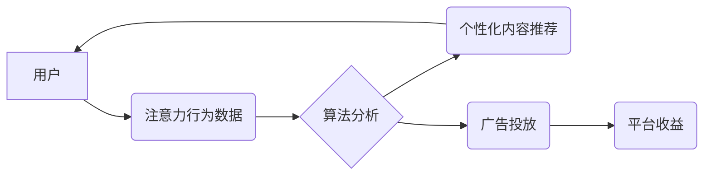

                 

## 注意力资本主义：AI时代的新经济模式

> 关键词：注意力、资本主义、AI、深度学习、数据驱动、经济模式、算法、用户行为

### 1. 背景介绍

在数字时代，信息爆炸和网络连接的普及，使得人类的注意力成为一种稀缺资源。传统经济模式以生产和消费为核心，而注意力资本主义则将注意力作为新的生产要素和价值载体。随着人工智能技术的飞速发展，特别是深度学习算法的突破，AI系统能够更加精准地捕捉和分析用户的注意力行为，从而推动注意力资本主义的快速发展。

注意力资本主义的本质是利用算法和数据驱动，通过提供个性化、吸引人的内容和服务，获取用户的注意力，并将其转化为经济价值。这是一种新的经济模式，其特点是：

* **数据驱动：**  注意力资本主义的核心是数据，通过收集和分析用户的注意力行为数据，AI系统能够精准地预测用户的兴趣和需求，从而提供更精准的个性化内容和服务。
* **算法优化：**  深度学习算法能够不断学习和优化，提高对用户注意力的捕捉和引导能力，从而实现更有效的注意力获取和转化。
* **个性化体验：**  注意力资本主义通过个性化推荐和内容定制，为用户提供更加吸引人的体验，从而增强用户的粘性和参与度。
* **注意力经济：**  用户的注意力成为一种新的经济资源，可以通过广告、付费内容、数据交易等方式进行变现。

### 2. 核心概念与联系

注意力资本主义的核心概念包括：

* **注意力：**  指个体对特定信息或刺激的认知焦点，是认知过程的基础。
* **数据：**  用户注意力行为的数据，包括浏览记录、点击行为、停留时间等。
* **算法：**  用于分析用户注意力数据，预测用户兴趣和需求，并提供个性化内容和服务的算法。
* **平台：**  提供内容和服务的平台，例如社交媒体、搜索引擎、电商平台等。

这些概念相互关联，共同构成了注意力资本主义的生态系统。

**Mermaid 流程图**



### 3. 核心算法原理 & 具体操作步骤

#### 3.1  算法原理概述

注意力资本主义的核心算法主要包括：

* **推荐算法：**  基于用户的历史行为数据，预测用户可能感兴趣的内容，并进行个性化推荐。
* **内容分发算法：**  根据用户的注意力行为数据，优化内容的展示顺序和位置，提高用户参与度。
* **广告投放算法：**  根据用户的兴趣和行为特征，精准投放广告，提高广告转化率。

这些算法通常基于深度学习技术，例如神经网络、强化学习等，能够不断学习和优化，提高算法的准确性和效率。

#### 3.2  算法步骤详解

以推荐算法为例，其具体操作步骤如下：

1. **数据收集：**  收集用户的历史行为数据，包括浏览记录、点击行为、停留时间、评分等。
2. **数据预处理：**  对收集到的数据进行清洗、转换和特征提取，以便于算法训练。
3. **模型训练：**  使用深度学习算法，例如协同过滤、内容基准、深度神经网络等，对预处理后的数据进行训练，构建推荐模型。
4. **模型评估：**  使用测试数据对训练好的模型进行评估，并根据评估结果进行模型调优。
5. **个性化推荐：**  根据用户的最新行为数据，利用训练好的推荐模型，预测用户可能感兴趣的内容，并进行个性化推荐。

#### 3.3  算法优缺点

**优点：**

* **精准度高：**  深度学习算法能够学习用户复杂的兴趣和需求，提供更加精准的个性化推荐。
* **效率高：**  算法能够自动学习和优化，提高推荐效率。
* **可扩展性强：**  算法能够处理海量数据，并适应不断变化的用户需求。

**缺点：**

* **数据依赖性强：**  算法的性能依赖于数据的质量和数量。
* **黑盒效应：**  深度学习算法的决策过程较为复杂，难以解释，导致算法的可解释性较差。
* **隐私风险：**  算法需要收集和分析用户的个人数据，存在隐私泄露的风险。

#### 3.4  算法应用领域

注意力资本主义的算法广泛应用于以下领域：

* **社交媒体：**  个性化推荐好友、内容和广告。
* **搜索引擎：**  精准匹配用户搜索意图，提供相关结果。
* **电商平台：**  推荐商品、个性化促销和广告投放。
* **视频平台：**  推荐视频、个性化内容播放顺序。
* **新闻平台：**  推荐新闻文章、个性化新闻订阅。

### 4. 数学模型和公式 & 详细讲解 & 举例说明

#### 4.1  数学模型构建

注意力机制的数学模型通常基于概率论和线性代数，其核心思想是通过一个注意力权重来分配不同输入的关注度，从而提高模型对重要信息的捕捉能力。

#### 4.2  公式推导过程

假设我们有一个输入序列 $x = (x_1, x_2, ..., x_n)$，其中每个元素 $x_i$ 代表一个词或特征。我们想要学习一个注意力权重 $a_i$，来分配每个输入元素的关注度。

注意力权重 $a_i$ 可以通过以下公式计算：

$$a_i = \frac{exp(e_i)}{\sum_{j=1}^{n} exp(e_j)}$$

其中 $e_i$ 是每个输入元素 $x_i$ 的注意力得分，可以由以下公式计算：

$$e_i = f(x_i, h)$$

其中 $f$ 是一个神经网络函数， $h$ 是隐藏状态向量。

#### 4.3  案例分析与讲解

例如，在机器翻译任务中，注意力机制可以帮助模型关注源语言中与目标语言中当前词语相关的词语，从而提高翻译的准确性。

### 5. 项目实践：代码实例和详细解释说明

#### 5.1  开发环境搭建

* Python 3.x
* TensorFlow 或 PyTorch 深度学习框架
* Jupyter Notebook 或 VS Code 代码编辑器

#### 5.2  源代码详细实现

```python
import tensorflow as tf

# 定义注意力机制层
class AttentionLayer(tf.keras.layers.Layer):
    def __init__(self, units):
        super(AttentionLayer, self).__init__()
        self.W1 = tf.keras.layers.Dense(units)
        self.W2 = tf.keras.layers.Dense(units)
        self.v = tf.keras.layers.Dense(1)

    def call(self, inputs):
        # inputs: (batch_size, seq_len, units)
        h = self.W1(inputs)
        a = tf.nn.tanh(self.W2(inputs))
        scores = self.v(a)
        attention_weights = tf.nn.softmax(scores, axis=1)
        context_vector = tf.matmul(attention_weights, inputs)
        return context_vector

# 示例代码
model = tf.keras.Sequential([
    tf.keras.layers.Embedding(input_dim=10000, output_dim=128),
    AttentionLayer(units=64),
    tf.keras.layers.Dense(units=10, activation='softmax')
])

model.compile(optimizer='adam', loss='sparse_categorical_crossentropy', metrics=['accuracy'])
```

#### 5.3  代码解读与分析

* `AttentionLayer` 类定义了一个注意力机制层，包含三个密集层 `W1`, `W2` 和 `v`。
* `call` 方法计算注意力权重和上下文向量。
* 示例代码构建了一个简单的文本分类模型，其中包含一个注意力机制层。

#### 5.4  运行结果展示

运行代码并训练模型，可以观察模型的准确率和训练过程中的注意力权重分布，从而验证注意力机制的效果。

### 6. 实际应用场景

注意力资本主义已经渗透到我们生活的方方面面，例如：

* **社交媒体推荐：**  Facebook、Instagram 等社交媒体平台利用注意力算法推荐个性化内容，提高用户粘性和参与度。
* **搜索引擎结果排序：**  Google 等搜索引擎利用注意力算法分析用户搜索意图，并优化搜索结果的排序，提高用户体验。
* **个性化广告投放：**  广告平台利用注意力算法精准投放广告，提高广告转化率。
* **内容分发平台：**  YouTube、Netflix 等内容分发平台利用注意力算法推荐个性化视频，提高用户观看时长。

### 6.4  未来应用展望

注意力资本主义的应用场景还在不断扩展，未来可能应用于：

* **教育领域：**  个性化学习推荐、注意力监测和提升。
* **医疗领域：**  疾病诊断、个性化治疗方案推荐。
* **金融领域：**  风险评估、投资决策支持。

### 7. 工具和资源推荐

#### 7.1  学习资源推荐

* **书籍：**
    * 《深度学习》
    * 《Attention Is All You Need》
* **在线课程：**
    * Coursera 深度学习课程
    * Udacity AI 课程

#### 7.2  开发工具推荐

* **TensorFlow:**  开源深度学习框架
* **PyTorch:**  开源深度学习框架
* **Jupyter Notebook:**  交互式代码编辑器

#### 7.3  相关论文推荐

* 《Attention Is All You Need》
* 《BERT: Pre-training of Deep Bidirectional Transformers for Language Understanding》

### 8. 总结：未来发展趋势与挑战

#### 8.1  研究成果总结

注意力资本主义的研究取得了显著成果，深度学习算法在捕捉和分析用户注意力方面取得了突破，推动了注意力资本主义的快速发展。

#### 8.2  未来发展趋势

* **更精准的注意力预测：**  研究更先进的算法，提高对用户注意力的预测精度。
* **更个性化的体验：**  利用用户行为数据，提供更加个性化的内容和服务。
* **更安全的隐私保护：**  研究隐私保护机制，保障用户数据安全。

#### 8.3  面临的挑战

* **算法可解释性：**  深度学习算法的决策过程较为复杂，难以解释，需要研究更可解释的算法。
* **数据偏差：**  算法的性能依赖于数据的质量和数量，数据偏差会导致算法的偏见和歧视。
* **伦理问题：**  注意力资本主义可能会导致用户注意力过度集中，影响用户的健康和生活，需要关注其伦理问题。

#### 8.4  研究展望

未来，注意力资本主义的研究将更加注重算法的可解释性、数据公平性和伦理问题，以确保其健康发展。

### 9. 附录：常见问题与解答

* **什么是注意力资本主义？**

注意力资本主义是一种利用算法和数据驱动，通过获取用户的注意力，将其转化为经济价值的新经济模式。

* **注意力资本主义有哪些应用场景？**

注意力资本主义广泛应用于社交媒体推荐、搜索引擎结果排序、个性化广告投放、内容分发平台等领域。

* **注意力资本主义有哪些挑战？**

注意力资本主义面临着算法可解释性、数据偏差、伦理问题等挑战。

* **如何应对注意力资本主义带来的挑战？**

需要研究更可解释的算法、关注数据公平性和伦理问题，并制定相应的政策和监管措施。


作者：禅与计算机程序设计艺术 / Zen and the Art of Computer Programming 
<end_of_turn>

