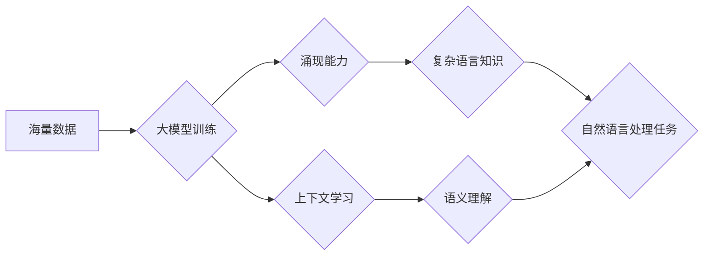

                 

## 涌现能力与上下文学习：大模型的核心优势结合

> 关键词：大模型、涌现能力、上下文学习、Transformer、深度学习、人工智能

## 1. 背景介绍

近年来，深度学习在人工智能领域取得了突破性进展，其中大模型扮演着越来越重要的角色。大模型，通常指参数量超过数十亿甚至千亿的深度学习模型，凭借其海量参数和强大的计算能力，在自然语言处理、计算机视觉、语音识别等领域展现出令人惊叹的性能。然而，大模型的成功并非仅仅源于参数量的增加，更重要的是其所蕴含的**涌现能力**和**上下文学习**能力。

涌现能力是指复杂系统中，由简单规则的相互作用产生的复杂行为，这些行为在系统设计中并非显式定义，而是自然地“涌现”出来。上下文学习则是指模型能够理解和利用文本序列中的上下文信息，从而更好地理解语义和生成更流畅、更自然的文本。

大模型通过海量数据训练，学习到丰富的语言知识和模式，从而具备了强大的涌现能力和上下文学习能力。这使得它们能够在各种任务中表现出色，并不断突破人工智能的边界。

## 2. 核心概念与联系

### 2.1 涌现能力

涌现能力是复杂系统中的一种现象，它指的是由简单规则的相互作用产生的复杂行为。这些行为并非显式定义，而是自然地“涌现”出来。

例如，蚂蚁群体虽然个体简单，但通过简单的规则，例如跟随同伴和寻找食物，可以形成复杂的觅食行为和群体组织结构。

在深度学习领域，涌现能力体现在大模型训练过程中。通过大量的文本数据训练，模型学习到复杂的语言知识和模式，从而能够完成各种自然语言处理任务。

### 2.2 上下文学习

上下文学习是指模型能够理解和利用文本序列中的上下文信息，从而更好地理解语义和生成更流畅、更自然的文本。

例如，在句子“我爱吃苹果”中，“苹果”的含义取决于前面的上下文“我爱吃”。如果上下文是“我爱吃香蕉”，那么“苹果”的含义就不同了。

Transformer模型是上下文学习的代表性架构，它通过**自注意力机制**能够捕捉文本序列中的长距离依赖关系，从而更好地理解上下文信息。

### 2.3 核心概念联系

大模型的涌现能力和上下文学习能力是相互关联的。

* **上下文学习**为大模型提供了理解语言的框架，帮助其学习到复杂的语言知识和模式。
* **涌现能力**则使得大模型能够将这些知识和模式应用到各种任务中，并产生出令人惊叹的性能。

**Mermaid 流程图**



## 3. 核心算法原理 & 具体操作步骤

### 3.1 算法原理概述

大模型的核心算法原理是深度学习，特别是**Transformer**架构。Transformer模型通过**自注意力机制**和**多头注意力机制**能够捕捉文本序列中的长距离依赖关系，从而更好地理解上下文信息。

### 3.2 算法步骤详解

1. **数据预处理:** 将文本数据进行清洗、分词、词嵌入等预处理操作，以便模型能够理解和处理数据。
2. **模型构建:** 根据Transformer架构构建模型，包括编码器、解码器和注意力机制等模块。
3. **模型训练:** 使用海量数据训练模型，通过反向传播算法优化模型参数，使得模型能够更好地预测目标输出。
4. **模型评估:** 使用测试数据评估模型的性能，例如准确率、召回率、F1-score等指标。
5. **模型部署:** 将训练好的模型部署到实际应用场景中，例如聊天机器人、机器翻译、文本摘要等。

### 3.3 算法优缺点

**优点:**

* **强大的上下文学习能力:** Transformer模型能够捕捉文本序列中的长距离依赖关系，从而更好地理解上下文信息。
* **高效的训练速度:** Transformer模型的并行训练能力强，能够在较短的时间内完成训练。
* **广泛的应用场景:** Transformer模型在自然语言处理、计算机视觉、语音识别等领域都有广泛的应用。

**缺点:**

* **参数量大:** Transformer模型的参数量很大，需要大量的计算资源进行训练和部署。
* **训练数据需求高:** Transformer模型需要大量的训练数据才能达到良好的性能。
* **可解释性差:** Transformer模型的内部机制比较复杂，难以解释其决策过程。

### 3.4 算法应用领域

* **自然语言处理:** 机器翻译、文本摘要、问答系统、聊天机器人等。
* **计算机视觉:** 图像分类、目标检测、图像生成等。
* **语音识别:** 语音转文本、语音合成等。
* **其他领域:** 代码生成、药物发现、金融预测等。

## 4. 数学模型和公式 & 详细讲解 & 举例说明

### 4.1 数学模型构建

Transformer模型的核心是**自注意力机制**，它通过计算每个词与所有其他词之间的相关性来捕捉文本序列中的长距离依赖关系。

**自注意力机制**可以表示为以下公式：

$$
Attention(Q, K, V) = softmax(\frac{QK^T}{\sqrt{d_k}})V
$$

其中：

* $Q$：查询矩阵
* $K$：键矩阵
* $V$：值矩阵
* $d_k$：键向量的维度
* $softmax$：softmax函数

### 4.2 公式推导过程

自注意力机制的公式推导过程如下：

1. 将输入序列中的每个词分别转换为查询向量 $Q$、键向量 $K$ 和值向量 $V$。
2. 计算每个查询向量与所有键向量的点积，并进行归一化处理，得到注意力权重。
3. 将注意力权重与值向量进行加权求和，得到最终的输出。

### 4.3 案例分析与讲解

例如，在句子“我爱吃苹果”中，每个词的查询向量、键向量和值向量分别为：

* 我：$Q_1$, $K_1$, $V_1$
* 爱：$Q_2$, $K_2$, $V_2$
* 吃：$Q_3$, $K_3$, $V_3$
* 苹果：$Q_4$, $K_4$, $V_4$

自注意力机制会计算每个词与所有其他词之间的注意力权重，例如，$Q_1$ 与 $K_4$ 的点积代表“我”与“苹果”之间的相关性。

最终的输出将是每个词的加权平均值，其中每个词的权重取决于其与其他词之间的相关性。

## 5. 项目实践：代码实例和详细解释说明

### 5.1 开发环境搭建

* Python 3.7+
* PyTorch 1.7+
* CUDA 10.2+

### 5.2 源代码详细实现

```python
import torch
import torch.nn as nn

class Transformer(nn.Module):
    def __init__(self, vocab_size, embedding_dim, num_heads, num_layers):
        super(Transformer, self).__init__()
        self.embedding = nn.Embedding(vocab_size, embedding_dim)
        self.encoder = nn.TransformerEncoder(nn.TransformerEncoderLayer(embedding_dim, num_heads), num_layers)

    def forward(self, x):
        x = self.embedding(x)
        x = self.encoder(x)
        return x
```

### 5.3 代码解读与分析

* **`__init__` 方法:** 初始化模型参数，包括词嵌入层、编码器层等。
* **`forward` 方法:** 定义模型的正向传播过程，将输入序列转换为输出序列。
* **`embedding` 层:** 将输入的词索引转换为词向量。
* **`encoder` 层:** 使用 Transformer 编码器对输入序列进行编码，捕捉文本序列中的长距离依赖关系。

### 5.4 运行结果展示

使用训练好的 Transformer 模型可以进行各种自然语言处理任务，例如机器翻译、文本摘要、问答系统等。

## 6. 实际应用场景

### 6.1 机器翻译

Transformer 模型在机器翻译领域取得了突破性进展，例如 Google 的 Transformer 模型能够实现比传统机器翻译模型更高的翻译质量。

### 6.2 文本摘要

Transformer 模型能够自动生成文本摘要，例如 OpenAI 的 GPT-3 模型能够生成高质量的新闻摘要。

### 6.3 聊天机器人

Transformer 模型可以用于构建更智能的聊天机器人，例如 Facebook 的 BlenderBot 可以进行自然流畅的对话。

### 6.4 未来应用展望

随着大模型技术的不断发展，其应用场景将会更加广泛，例如：

* **个性化教育:** 根据学生的学习情况提供个性化的学习内容和辅导。
* **医疗诊断:** 辅助医生进行疾病诊断和治疗方案制定。
* **科学研究:** 加速科学研究的进程，例如药物发现、材料设计等。

## 7. 工具和资源推荐

### 7.1 学习资源推荐

* **书籍:**
    * 《深度学习》 by Ian Goodfellow, Yoshua Bengio, Aaron Courville
    * 《Transformer 详解》 by Jay Alammar
* **在线课程:**
    * Coursera: Deep Learning Specialization
    * fast.ai: Practical Deep Learning for Coders

### 7.2 开发工具推荐

* **PyTorch:** 深度学习框架
* **TensorFlow:** 深度学习框架
* **Hugging Face Transformers:** 预训练 Transformer 模型库

### 7.3 相关论文推荐

* **Attention Is All You Need** by Vaswani et al. (2017)
* **BERT: Pre-training of Deep Bidirectional Transformers for Language Understanding** by Devlin et al. (2018)
* **GPT-3: Language Models are Few-Shot Learners** by Brown et al. (2020)

## 8. 总结：未来发展趋势与挑战

### 8.1 研究成果总结

大模型在自然语言处理、计算机视觉、语音识别等领域取得了显著的成果，其涌现能力和上下文学习能力为人工智能的发展带来了新的机遇。

### 8.2 未来发展趋势

* **模型规模进一步扩大:** 随着计算资源的不断提升，大模型的规模将会进一步扩大，从而带来更强大的性能。
* **多模态学习:** 大模型将能够处理多种模态的数据，例如文本、图像、音频等，从而实现更全面的理解和生成。
* **可解释性增强:** 研究人员将致力于提高大模型的可解释性，使得其决策过程更加透明和可理解。

### 8.3 面临的挑战

* **训练成本高:** 大模型的训练成本非常高，需要大量的计算资源和数据。
* **数据安全和隐私:** 大模型的训练需要使用大量的敏感数据，因此数据安全和隐私保护是一个重要的挑战。
* **伦理问题:** 大模型的应用可能会带来一些伦理问题，例如偏见、歧视、虚假信息等，需要引起足够的重视。

### 8.4 研究展望

未来，大模型研究将继续朝着更强大、更智能、更安全的方向发展，为人类社会带来更多福祉。

## 9. 附录：常见问题与解答

* **Q: 大模型的训练需要多少数据？**

A: 大模型的训练需要大量的训练数据，通常需要数十亿甚至千亿个样本。

* **Q: 大模型的训练需要多少计算资源？**

A: 大模型的训练需要大量的计算资源，通常需要数百甚至数千个GPU。

* **Q: 大模型的应用场景有哪些？**

A: 大模型的应用场景非常广泛，例如机器翻译、文本摘要、聊天机器人、图像生成、语音识别等。

作者：禅与计算机程序设计艺术 / Zen and the Art of Computer Programming


<end_of_turn>

