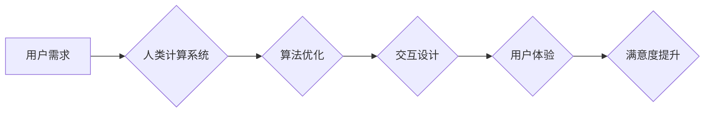

                 

## 用户体验至上：人类计算如何提升满意度

> 关键词：用户体验、人类计算、满意度、交互设计、算法优化、人工智能、认知科学、用户研究

### 1. 背景介绍

在当今以数据为驱动的时代，技术日新月异，人工智能（AI）正在深刻地改变着我们与世界交互的方式。然而，在追求技术进步的同时，我们不能忽视用户体验（UX）的重要性。用户体验是指用户与产品或服务交互时所感受到的整体感受，它直接影响着用户对产品的满意度、忠诚度和最终的决策。

人类计算是指将人类的智慧和计算能力相结合，以提高计算效率和解决复杂问题。它强调人与机器的协作，充分利用人类的创造力、批判性思维和情感智能，弥补机器学习算法的局限性。

随着AI技术的不断发展，人类计算正在成为一种重要的计算模式。然而，在将AI技术应用于人类计算的过程中，我们必须始终将用户体验放在首位。只有设计出易于使用、高效、愉悦的用户体验，才能真正实现人类计算的价值。

### 2. 核心概念与联系

#### 2.1 用户体验

用户体验是一个多维度的概念，涵盖了用户对产品或服务的感知、情感、认知和行为。它包括以下几个关键方面：

* **可用性:** 产品或服务是否易于使用和理解。
* **易用性:** 产品或服务是否直观易操作。
* **效率:** 用户完成任务所需的时间和精力。
* **满意度:** 用户对产品或服务的整体感受。
* **情感:** 用户在使用产品或服务时所产生的情感体验。

#### 2.2 人类计算

人类计算是一种将人类的智慧和计算能力相结合的计算模式。它强调人与机器的协作，充分利用人类的创造力、批判性思维和情感智能，弥补机器学习算法的局限性。

#### 2.3 核心概念联系

用户体验和人类计算之间存在着密切的联系。人类计算的目标是通过人机协作来提高计算效率和解决复杂问题。而用户体验则是衡量人类计算是否成功的关键指标。只有设计出易于使用、高效、愉悦的用户体验，才能真正实现人类计算的价值。

**Mermaid 流程图**



### 3. 核心算法原理 & 具体操作步骤

#### 3.1 算法原理概述

在人类计算中，算法设计是至关重要的。我们需要设计出能够有效地利用人类智慧和计算能力的算法。

一种常用的算法是**启发式算法**，它通过启发式规则来指导搜索过程，并最终找到一个近似最优的解。启发式算法能够在有限的时间内找到一个可接受的解，但它不一定能够找到最优解。

#### 3.2 算法步骤详解

1. **问题定义:** 首先需要明确要解决的问题，并将其转化为算法可以处理的形式。
2. **启发式规则设计:** 根据问题的特点，设计出能够引导搜索过程的启发式规则。
3. **搜索空间探索:** 利用启发式规则，在搜索空间中探索可能的解。
4. **解评估:** 对每个可能的解进行评估，选择最优或近似最优的解。

#### 3.3 算法优缺点

**优点:**

* 能够在有限的时间内找到一个可接受的解。
* 适用于复杂问题，难以用精确算法解决。

**缺点:**

* 不一定能够找到最优解。
* 启发式规则的设计需要经验和技巧。

#### 3.4 算法应用领域

启发式算法广泛应用于人工智能、优化问题、游戏设计等领域。例如，在人工智能领域，启发式算法被用于机器学习、自然语言处理等任务。

### 4. 数学模型和公式 & 详细讲解 & 举例说明

#### 4.1 数学模型构建

在人类计算中，我们可以使用数学模型来描述用户和算法之间的交互关系。例如，我们可以使用**贝叶斯网络**来建模用户对信息的感知和决策过程。

#### 4.2 公式推导过程

贝叶斯网络是一种概率图模型，它可以表示变量之间的依赖关系。在人类计算中，我们可以使用贝叶斯网络来建模用户对信息的感知和决策过程。

假设我们有一个贝叶斯网络，其中包含以下变量：

* **U:** 用户的知识
* **I:** 用户接收到的信息
* **D:** 用户的决策

我们可以使用贝叶斯定理来推导用户决策的概率分布：

$$P(D|U,I) = \frac{P(I|U,D)P(U)P(D)}{P(I)}$$

其中：

* $P(D|U,I)$ 是用户在已知知识和信息的情况下做出决策的概率。
* $P(I|U,D)$ 是用户在已知知识和决策的情况下接收到的信息的概率。
* $P(U)$ 是用户的知识分布。
* $P(D)$ 是用户的决策分布。
* $P(I)$ 是信息的概率分布。

#### 4.3 案例分析与讲解

例如，假设我们有一个用户识别图像的任务。用户需要根据图像信息做出识别决策。我们可以使用贝叶斯网络来建模用户识别图像的过程。

在贝叶斯网络中，用户知识可以表示为用户对不同图像类别之前的认知程度。用户接收到的信息可以表示为图像的特征信息。用户决策可以表示为用户对图像类别的识别结果。

通过使用贝叶斯定理，我们可以计算出用户在已知知识和信息的情况下做出识别决策的概率。

### 5. 项目实践：代码实例和详细解释说明

#### 5.1 开发环境搭建

为了实现人类计算系统，我们需要搭建一个合适的开发环境。

* **操作系统:** Linux 或 macOS
* **编程语言:** Python
* **深度学习框架:** TensorFlow 或 PyTorch
* **数据存储:** MongoDB 或 PostgreSQL

#### 5.2 源代码详细实现

以下是一个简单的代码示例，演示了如何使用Python和TensorFlow实现一个简单的图像识别模型：

```python
import tensorflow as tf

# 定义模型结构
model = tf.keras.models.Sequential([
  tf.keras.layers.Conv2D(32, (3, 3), activation='relu', input_shape=(28, 28, 1)),
  tf.keras.layers.MaxPooling2D((2, 2)),
  tf.keras.layers.Conv2D(64, (3, 3), activation='relu'),
  tf.keras.layers.MaxPooling2D((2, 2)),
  tf.keras.layers.Flatten(),
  tf.keras.layers.Dense(10, activation='softmax')
])

# 编译模型
model.compile(optimizer='adam',
              loss='sparse_categorical_crossentropy',
              metrics=['accuracy'])

# 训练模型
model.fit(x_train, y_train, epochs=5)

# 评估模型
loss, accuracy = model.evaluate(x_test, y_test)
print('Test loss:', loss)
print('Test accuracy:', accuracy)
```

#### 5.3 代码解读与分析

这段代码定义了一个简单的卷积神经网络模型，用于识别手写数字。

* `tf.keras.models.Sequential` 创建了一个顺序模型，其中层级依次连接。
* `tf.keras.layers.Conv2D` 定义了一个卷积层，用于提取图像特征。
* `tf.keras.layers.MaxPooling2D` 定义了一个最大池化层，用于降低特征图的维度。
* `tf.keras.layers.Flatten` 将多维特征图转换为一维向量。
* `tf.keras.layers.Dense` 定义了一个全连接层，用于分类。
* `model.compile` 编译模型，指定优化器、损失函数和评估指标。
* `model.fit` 训练模型，使用训练数据进行训练。
* `model.evaluate` 评估模型，使用测试数据计算损失和准确率。

#### 5.4 运行结果展示

训练完成后，我们可以使用测试数据评估模型的性能。

### 6. 实际应用场景

#### 6.1 医疗诊断

人类计算可以帮助医生更快、更准确地诊断疾病。例如，我们可以使用AI算法分析患者的医学影像数据，并结合医生的经验和判断，做出更准确的诊断。

#### 6.2 科学研究

人类计算可以加速科学研究的进程。例如，我们可以使用AI算法分析海量科研数据，发现新的科学规律和知识。

#### 6.3 教育教学

人类计算可以提高教育教学的效率和质量。例如，我们可以使用AI算法个性化推荐学习内容，并提供实时反馈和指导。

#### 6.4 未来应用展望

随着AI技术的不断发展，人类计算将在更多领域得到应用。例如，我们可以使用人类计算来解决气候变化、能源危机等全球性挑战。

### 7. 工具和资源推荐

#### 7.1 学习资源推荐

* **书籍:**
    * 《深度学习》
    * 《机器学习》
    * 《人工智能：一种现代方法》
* **在线课程:**
    * Coursera
    * edX
    * Udacity

#### 7.2 开发工具推荐

* **编程语言:** Python
* **深度学习框架:** TensorFlow, PyTorch
* **数据可视化工具:** Matplotlib, Seaborn

#### 7.3 相关论文推荐

* **《Attention Is All You Need》**
* **《BERT: Pre-training of Deep Bidirectional Transformers for Language Understanding》**
* **《Generative Pre-trained Transformer 3》**

### 8. 总结：未来发展趋势与挑战

#### 8.1 研究成果总结

人类计算是一个新兴的领域，近年来取得了显著的进展。

* **算法优化:** 出现了许多新的算法，能够更有效地利用人类智慧和计算能力。
* **交互设计:** 人机交互的设计越来越人性化，能够更好地满足用户的需求。
* **应用场景:** 人类计算正在被应用于越来越多的领域，取得了令人瞩目的成果。

#### 8.2 未来发展趋势

* **更智能的算法:** 未来将出现更智能、更强大的算法，能够更好地理解和模拟人类的思维方式。
* **更自然的交互:** 人机交互将更加自然、流畅，例如通过语音、手势等方式进行交互。
* **更广泛的应用:** 人类计算将被应用于更多领域，例如医疗、教育、金融等。

#### 8.3 面临的挑战

* **数据隐私:** 人类计算需要处理大量用户数据，如何保护用户隐私是一个重要的挑战。
* **算法偏见:** 算法可能会存在偏见，导致不公平的结果。
* **伦理问题:** 人类计算可能会引发一些伦理问题，例如人工智能的责任和义务。

#### 8.4 研究展望

未来，人类计算的研究将继续深入，探索更智能、更安全、更可持续的人机协作模式。

### 9. 附录：常见问题与解答

#### 9.1 什么是人类计算？

人类计算是指将人类的智慧和计算能力相结合，以提高计算效率和解决复杂问题的一种计算模式。

#### 9.2 人类计算有哪些应用场景？

人类计算的应用场景非常广泛，例如医疗诊断、科学研究、教育教学等。

#### 9.3 如何设计一个好的人类计算系统？

设计一个好的人类计算系统需要考虑以下几个方面：

* **用户体验:** 系统应该易于使用、高效、愉悦。
* **算法优化:** 算法应该能够有效地利用人类智慧和计算能力。
* **交互设计:** 人机交互应该自然、流畅。
* **数据隐私:** 系统应该能够保护用户隐私。


作者：禅与计算机程序设计艺术 / Zen and the Art of Computer Programming 
<end_of_turn>

