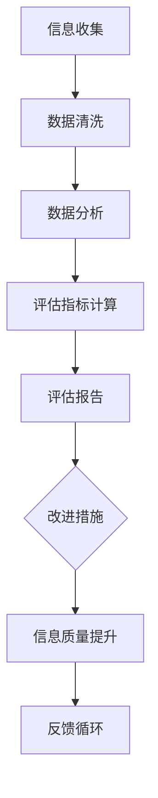
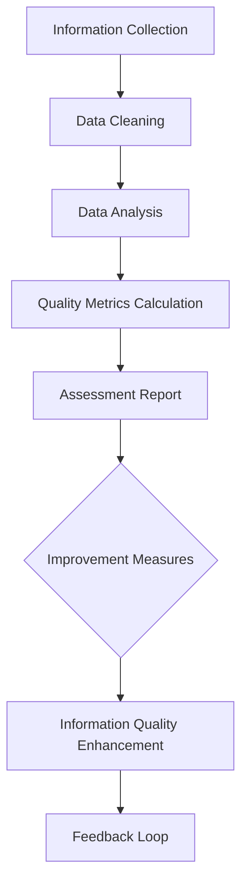

                 

### 1. 背景介绍（Background Introduction）

在当今数字化时代，信息量以惊人的速度增长。互联网的普及、大数据技术的发展、社交媒体的兴起，使得人们可以随时随地获取大量的信息。这种信息过载现象不仅影响了人们的日常生活，也对个人和组织的信息处理能力提出了巨大的挑战。

信息过载（Information Overload）指的是个体或组织在信息处理过程中面临的信息量过多，无法有效管理和利用的现象。这种现象会导致决策困难、注意力分散、工作效率下降，甚至可能引发心理压力和焦虑。

与此同时，信息质量评估（Information Quality Assessment）成为了一个备受关注的研究领域。高质量的信息是决策和知识获取的基础，而低质量或错误的信息则会带来负面影响。因此，如何评估和保证信息质量，成为了信息管理中的一个重要问题。

本文将深入探讨信息过载与信息质量评估之间的关系，分析现有信息质量评估框架的优缺点，并提出一个综合性的信息质量评估框架。我们还将讨论信息质量评估在实际应用中的挑战和解决方案。

### Background Introduction

In the current digital era, the volume of information is growing at an astonishing rate. The widespread use of the internet, the development of big data technologies, and the rise of social media have enabled people to access vast amounts of information anytime, anywhere. This phenomenon of information overload not only affects people's daily lives but also poses significant challenges to individuals and organizations in managing and processing information.

Information overload refers to the situation where individuals or organizations face an overwhelming amount of information that they cannot effectively manage or utilize. This can lead to difficulties in decision-making, attention fragmentation, reduced work efficiency, and even psychological stress and anxiety.

At the same time, information quality assessment has become a research field of great interest. High-quality information is the foundation for decision-making and knowledge acquisition, while low-quality or erroneous information can bring negative impacts. Therefore, how to assess and ensure information quality has become an important issue in information management.

This article will delve into the relationship between information overload and information quality assessment, analyze the advantages and disadvantages of existing information quality assessment frameworks, and propose a comprehensive information quality assessment framework. We will also discuss the challenges and solutions in the practical application of information quality assessment.### 2. 核心概念与联系（Core Concepts and Connections）

在深入探讨信息过载与信息质量评估之前，我们需要先明确几个关键概念：信息过载（Information Overload）、信息质量（Information Quality）、信息质量评估（Information Quality Assessment）和信息质量评估框架（Information Quality Assessment Framework）。

#### 2.1 信息过载（Information Overload）

信息过载是指个体或组织在信息处理过程中面临的信息量过多，导致无法有效管理和利用的现象。在数字化时代，信息过载主要表现在以下几个方面：

- **信息来源多样化**：互联网、社交媒体、电子邮件、新闻报道等渠道使得信息来源多样化，人们每天接收到的信息量巨大。
- **信息更新速度快**：信息更新速度加快，例如实时新闻、社交媒体更新等，使得个体在短时间内面临大量新信息。
- **信息冗余**：由于信息来源的多样化，相同或类似的信息在多个渠道重复传播，导致信息冗余。

#### 2.2 信息质量（Information Quality）

信息质量是指信息满足特定用户需求的能力。高质量的信息通常具有以下特征：

- **准确性**：信息内容真实、可靠，没有误导性。
- **相关性**：信息与用户需求相关，能够解决用户的问题或满足用户的兴趣。
- **完整性**：信息提供了完整的信息背景，用户可以全面理解信息内容。
- **及时性**：信息能够及时提供，满足用户对信息的需求。

#### 2.3 信息质量评估（Information Quality Assessment）

信息质量评估是指对信息质量进行测量和评价的过程。评估方法可以基于定量指标（如准确性、完整性、及时性等）和定性指标（如用户满意度、可靠性等）。信息质量评估的目的在于识别和改善信息质量问题，提高信息的使用价值。

#### 2.4 信息质量评估框架（Information Quality Assessment Framework）

信息质量评估框架是一套系统化的方法和工具，用于指导信息质量评估的过程。一个有效的信息质量评估框架应包括以下关键组成部分：

- **评估标准**：定义信息质量的评价指标和标准，如准确性、相关性、完整性、及时性等。
- **评估流程**：明确信息质量评估的步骤和流程，包括数据收集、分析、评估和报告等。
- **评估工具**：提供用于信息质量评估的工具和资源，如调查问卷、数据分析软件等。
- **改进措施**：针对评估结果提出改进信息质量的措施和策略。

#### Mermaid 流程图

以下是一个简化的信息质量评估框架的 Mermaid 流程图：



通过上述核心概念与联系的分析，我们可以更好地理解信息过载与信息质量评估之间的关系。信息过载加剧了信息质量评估的难度，而有效的信息质量评估则有助于减轻信息过载带来的负面影响。在接下来的章节中，我们将详细讨论信息质量评估框架的构建与应用。

#### Core Concepts and Connections

Before delving into the discussion on information overload and information quality assessment, it's essential to clarify several key concepts: information overload, information quality, information quality assessment, and information quality assessment frameworks.

#### 2.1 Information Overload

Information overload refers to the situation where individuals or organizations face an overwhelming amount of information that they cannot effectively manage or utilize. In the digital era, information overload manifests in several ways:

- **Diverse Information Sources**: The proliferation of the internet, social media, email, and news reporting means that individuals are exposed to a vast amount of information from various channels.
- **Fast Information Updates**: Information updates rapidly, such as real-time news and social media updates, leading to a large number of new pieces of information in a short period.
- **Information Redundancy**: Due to the diverse information sources, the same or similar information is spread across multiple channels, resulting in information redundancy.

#### 2.2 Information Quality

Information quality refers to the ability of information to meet specific user needs. High-quality information typically exhibits the following characteristics:

- **Accuracy**: Information content is true and reliable, without misleading information.
- **Relevance**: Information is related to user needs, able to solve user problems or satisfy user interests.
- **Completeness**: Information provides a complete information background, allowing users to fully understand the content.
- **Timeliness**: Information is provided in a timely manner, meeting user information needs.

#### 2.3 Information Quality Assessment

Information quality assessment refers to the process of measuring and evaluating information quality. Assessment methods can be based on quantitative indicators (such as accuracy, completeness, and timeliness) and qualitative indicators (such as user satisfaction and reliability). The purpose of information quality assessment is to identify and improve information quality issues, enhancing the value of information for use.

#### 2.4 Information Quality Assessment Framework

An information quality assessment framework is a systematic set of methods and tools used to guide the information quality assessment process. An effective information quality assessment framework should include the following key components:

- **Assessment Standards**: Define information quality evaluation criteria and standards, such as accuracy, relevance, completeness, and timeliness.
- **Assessment Process**: Clarify the steps and processes of information quality assessment, including data collection, analysis, evaluation, and reporting.
- **Assessment Tools**: Provide tools and resources for information quality assessment, such as surveys, data analysis software, etc.
- **Improvement Measures**: Propose measures and strategies for improving information quality based on assessment results.

#### Mermaid Flowchart

Here is a simplified flowchart of an information quality assessment framework using Mermaid:



Through the analysis of these core concepts and connections, we can better understand the relationship between information overload and information quality assessment. Information overload exacerbates the difficulty of information quality assessment, while effective information quality assessment can help alleviate the negative impacts of information overload. In the following sections, we will discuss in detail the construction and application of the information quality assessment framework.### 3. 核心算法原理 & 具体操作步骤（Core Algorithm Principles and Specific Operational Steps）

为了构建一个综合性的信息质量评估框架，我们需要引入一系列核心算法和具体操作步骤。这些算法和步骤将帮助我们系统地分析和评估信息质量。以下是一个简化但实用的信息质量评估框架，包括以下几个关键步骤：

#### 3.1 数据收集（Data Collection）

数据收集是信息质量评估的基础。我们需要收集与评估目标相关的各类信息，包括文本、图像、音频和视频等。以下是一些数据收集的方法：

- **网络爬虫（Web Crawlers）**：使用网络爬虫从互联网上获取相关信息。
- **API 接口（APIs）**：通过 API 接口从外部数据源获取数据。
- **问卷调查（Surveys）**：设计问卷调查，收集用户的反馈信息。
- **数据库访问（Database Access）**：从内部数据库中提取相关数据。

#### 3.2 数据预处理（Data Preprocessing）

数据预处理是确保数据质量和准确性的关键步骤。以下是一些常用的数据预处理方法：

- **去重（De-duplication）**：去除重复的数据条目，以避免重复计算。
- **数据清洗（Data Cleaning）**：纠正数据中的错误，填补缺失值，删除无关数据。
- **数据标准化（Data Standardization）**：将数据格式统一，如日期、货币等。
- **数据归一化（Data Normalization）**：将不同规模的数据归一化，便于后续分析。

#### 3.3 数据分析（Data Analysis）

数据分析是信息质量评估的核心。以下是一些常用的数据分析方法：

- **描述性统计（Descriptive Statistics）**：计算数据的平均值、中位数、标准差等，了解数据的基本特征。
- **相关性分析（Correlation Analysis）**：分析不同变量之间的相关性，了解数据之间的关系。
- **聚类分析（Clustering Analysis）**：将相似的数据聚集在一起，识别数据中的模式。
- **分类分析（Classification Analysis）**：使用机器学习算法对数据分类，识别不同类别的特征。

#### 3.4 评估指标计算（Quality Metrics Calculation）

评估指标计算是衡量信息质量的关键步骤。以下是一些常用的评估指标：

- **准确性（Accuracy）**：正确识别信息的比例。
- **召回率（Recall）**：正确识别的信息占总相关信息数的比例。
- **精确率（Precision）**：正确识别的信息占总识别信息数的比例。
- **F1 分数（F1 Score）**：综合考虑精确率和召回率的指标。

#### 3.5 评估报告（Assessment Report）

评估报告是对信息质量评估结果进行总结和展示的关键步骤。以下是一些报告内容：

- **评估结果概述**：对评估指标的计算结果进行总结。
- **优缺点分析**：分析信息质量的优点和不足之处。
- **改进建议**：根据评估结果提出改进信息质量的建议。

#### 3.6 改进措施（Improvement Measures）

根据评估报告的结果，制定和实施改进措施，以提升信息质量。以下是一些改进措施：

- **数据源优化**：优化数据源，确保数据的质量和准确性。
- **算法优化**：调整算法参数，提高信息识别的准确性和效率。
- **用户反馈**：收集用户反馈，不断改进信息质量和用户体验。

通过上述核心算法原理和具体操作步骤，我们可以构建一个综合性的信息质量评估框架，帮助组织和个人更好地管理和利用信息资源。在下一章节中，我们将详细讨论数学模型和公式，以及如何具体应用这些模型和公式进行信息质量评估。

#### Core Algorithm Principles and Specific Operational Steps

To build a comprehensive information quality assessment framework, we need to introduce a series of core algorithms and specific operational steps. These algorithms and steps will help us systematically analyze and evaluate information quality. Below is a simplified but practical information quality assessment framework, including several key steps:

#### 3.1 Data Collection

Data collection is the foundation of information quality assessment. We need to collect various types of information related to the assessment objectives, including text, images, audio, and video. Here are some methods for data collection:

- **Web Crawlers**: Use web crawlers to gather information from the internet.
- **APIs**: Access data from external data sources through APIs.
- **Surveys**: Design surveys to collect user feedback.
- **Database Access**: Extract relevant data from internal databases.

#### 3.2 Data Preprocessing

Data preprocessing is crucial for ensuring data quality and accuracy. Here are some common data preprocessing methods:

- **De-duplication**: Remove duplicate data entries to avoid redundant calculations.
- **Data Cleaning**: Correct errors in data, fill in missing values, and delete irrelevant data.
- **Data Standardization**: Unify data formats, such as dates and currencies.
- **Data Normalization**: Normalize data of different scales to facilitate subsequent analysis.

#### 3.3 Data Analysis

Data analysis is the core of information quality assessment. Here are some common data analysis methods:

- **Descriptive Statistics**: Calculate basic statistics of the data, such as mean, median, and standard deviation.
- **Correlation Analysis**: Analyze the relationships between different variables.
- **Clustering Analysis**: Group similar data together to identify patterns in the data.
- **Classification Analysis**: Use machine learning algorithms to classify data and identify features of different categories.

#### 3.4 Quality Metrics Calculation

Quality metric calculation is the key step in measuring information quality. Here are some common evaluation metrics:

- **Accuracy**: The proportion of correctly identified information.
- **Recall**: The proportion of correctly identified information out of all relevant information.
- **Precision**: The proportion of correctly identified information out of all identified information.
- **F1 Score**: A metric that综合考虑precision和recall。

#### 3.5 Assessment Report

The assessment report is the key step in summarizing and presenting the results of information quality assessment. Here is some content for the report:

- **Overview of Assessment Results**: Summarize the calculation results of evaluation metrics.
- **Strengths and Weaknesses Analysis**: Analyze the advantages and disadvantages of information quality.
- **Improvement Recommendations**: Propose recommendations for improving information quality based on the assessment results.

#### 3.6 Improvement Measures

Based on the results of the assessment report, develop and implement improvement measures to enhance information quality. Here are some improvement measures:

- **Data Source Optimization**: Optimize data sources to ensure the quality and accuracy of data.
- **Algorithm Optimization**: Adjust algorithm parameters to improve the accuracy and efficiency of information identification.
- **User Feedback**: Collect user feedback to continuously improve information quality and user experience.

Through these core algorithm principles and specific operational steps, we can build a comprehensive information quality assessment framework to help organizations and individuals better manage and utilize information resources. In the next chapter, we will discuss in detail the mathematical models and formulas, as well as how to apply these models and formulas for information quality assessment.### 4. 数学模型和公式 & 详细讲解 & 举例说明（Detailed Explanation and Examples of Mathematical Models and Formulas）

在信息质量评估中，数学模型和公式扮演着至关重要的角色。它们帮助我们量化信息质量，从而更准确地评估和比较不同信息源的质量。以下是一些常用的数学模型和公式，我们将通过详细讲解和举例来说明它们的应用。

#### 4.1 准确性（Accuracy）

准确性是指正确识别的信息占总识别信息的比例。其计算公式如下：

\[ \text{Accuracy} = \frac{\text{正确识别的信息}}{\text{总识别信息}} \]

例如，如果一个信息评估系统从100条信息中正确识别了80条，那么其准确性为：

\[ \text{Accuracy} = \frac{80}{100} = 0.8 \text{ 或 } 80\% \]

#### 4.2 召回率（Recall）

召回率是指正确识别的信息占总相关信息的比例。其计算公式如下：

\[ \text{Recall} = \frac{\text{正确识别的相关信息}}{\text{总相关信息}} \]

例如，如果一个信息评估系统从100条相关信息中正确识别了70条，那么其召回率为：

\[ \text{Recall} = \frac{70}{100} = 0.7 \text{ 或 } 70\% \]

#### 4.3 精确率（Precision）

精确率是指正确识别的信息占总识别信息的比例。其计算公式如下：

\[ \text{Precision} = \frac{\text{正确识别的信息}}{\text{总识别信息}} \]

例如，如果一个信息评估系统从100条信息中正确识别了70条，那么其精确率为：

\[ \text{Precision} = \frac{70}{100} = 0.7 \text{ 或 } 70\% \]

#### 4.4 F1 分数（F1 Score）

F1 分数是精确率和召回率的调和平均值，用于综合评估信息质量。其计算公式如下：

\[ \text{F1 Score} = 2 \times \frac{\text{Precision} \times \text{Recall}}{\text{Precision} + \text{Recall}} \]

例如，如果一个信息评估系统的精确率为0.7，召回率为0.6，那么其F1分数为：

\[ \text{F1 Score} = 2 \times \frac{0.7 \times 0.6}{0.7 + 0.6} = 0.724 \text{ 或 } 72.4\% \]

#### 4.5 费舍尔指数（Fischer's Information）

费舍尔指数是一种衡量信息不确定性的指标。其计算公式如下：

\[ I(\theta) = -\mathbb{E}[\log p(\theta | x)] \]

其中，\( \theta \) 表示参数，\( x \) 表示观测数据，\( p(\theta | x) \) 表示参数的后验概率分布。

例如，假设我们有一个二项分布 \( p(\theta | x) = \theta^x (1-\theta)^{n-x} \)，其中 \( x \) 是观测到的成功次数，\( n \) 是总次数。那么，费舍尔指数为：

\[ I(\theta) = -n\theta (1-\theta) \]

#### 4.6 马尔可夫链（Markov Chain）

马尔可夫链是一种用于建模时间序列数据的随机过程。其基本公式如下：

\[ p(x_t | x_{t-1}, x_{t-2}, ..., x_1) = p(x_t | x_{t-1}) \]

这意味着当前状态只依赖于前一个状态，而与之前的状态无关。

例如，假设我们有一个简单的马尔可夫链，表示一个天气系统：

\[ \begin{aligned}
p(\text{晴天} | \text{雨天}) &= 0.2 \\
p(\text{雨天} | \text{晴天}) &= 0.8 \\
p(\text{晴天} | \text{晴天}) &= 0.5 \\
p(\text{雨天} | \text{雨天}) &= 0.5 \\
\end{aligned} \]

通过这些数学模型和公式，我们可以更深入地理解和分析信息质量。在实际应用中，这些模型和公式可以帮助我们设计和优化信息质量评估框架，从而更好地管理和利用信息资源。在下一章节中，我们将通过一个具体的代码实例来展示如何使用这些模型和公式进行信息质量评估。

#### Mathematical Models and Formulas & Detailed Explanation and Examples

In information quality assessment, mathematical models and formulas play a crucial role in quantifying information quality, allowing for more accurate evaluation and comparison of different information sources. Below are some commonly used mathematical models and formulas, along with detailed explanations and examples of their applications.

#### 4.1 Accuracy

Accuracy refers to the proportion of correctly identified information out of the total information identified. The formula for calculating accuracy is as follows:

\[ \text{Accuracy} = \frac{\text{Correctly Identified Information}}{\text{Total Identified Information}} \]

For example, if an information assessment system correctly identifies 80 out of 100 pieces of information, its accuracy is:

\[ \text{Accuracy} = \frac{80}{100} = 0.8 \text{ or } 80\% \]

#### 4.2 Recall

Recall is the proportion of correctly identified relevant information out of all relevant information. The formula for calculating recall is:

\[ \text{Recall} = \frac{\text{Correctly Identified Relevant Information}}{\text{Total Relevant Information}} \]

For example, if an information assessment system correctly identifies 70 out of 100 relevant pieces of information, its recall is:

\[ \text{Recall} = \frac{70}{100} = 0.7 \text{ or } 70\% \]

#### 4.3 Precision

Precision is the proportion of correctly identified information out of the total identified information. The formula for calculating precision is:

\[ \text{Precision} = \frac{\text{Correctly Identified Information}}{\text{Total Identified Information}} \]

For example, if an information assessment system correctly identifies 70 out of 100 pieces of information, its precision is:

\[ \text{Precision} = \frac{70}{100} = 0.7 \text{ or } 70\% \]

#### 4.4 F1 Score

The F1 score is the harmonic mean of precision and recall, used for comprehensive evaluation of information quality. The formula for calculating the F1 score is:

\[ \text{F1 Score} = 2 \times \frac{\text{Precision} \times \text{Recall}}{\text{Precision} + \text{Recall}} \]

For example, if an information assessment system has a precision of 0.7 and a recall of 0.6, its F1 score is:

\[ \text{F1 Score} = 2 \times \frac{0.7 \times 0.6}{0.7 + 0.6} = 0.724 \text{ or } 72.4\% \]

#### 4.5 Fischer's Information

Fischer's information is a metric for measuring the uncertainty of information. The formula for calculating Fischer's information is:

\[ I(\theta) = -\mathbb{E}[\log p(\theta | x)] \]

Where \( \theta \) represents the parameter, \( x \) represents the observed data, and \( p(\theta | x) \) represents the posterior probability distribution of the parameter.

For example, suppose we have a binomial distribution \( p(\theta | x) = \theta^x (1-\theta)^{n-x} \), where \( x \) is the observed number of successes, and \( n \) is the total number of trials. The Fischer's information is:

\[ I(\theta) = -n\theta (1-\theta) \]

#### 4.6 Markov Chain

A Markov chain is a stochastic process used for modeling time-series data. The basic formula for a Markov chain is:

\[ p(x_t | x_{t-1}, x_{t-2}, ..., x_1) = p(x_t | x_{t-1}) \]

This means that the current state depends only on the previous state, not on the states before that.

For example, suppose we have a simple Markov chain representing a weather system:

\[ \begin{aligned}
p(\text{Sunny} | \text{Rainy}) &= 0.2 \\
p(\text{Rainy} | \text{Sunny}) &= 0.8 \\
p(\text{Sunny} | \text{Sunny}) &= 0.5 \\
p(\text{Rainy} | \text{Rainy}) &= 0.5 \\
\end{aligned} \]

Through these mathematical models and formulas, we can gain a deeper understanding and analysis of information quality. In practical applications, these models and formulas can help design and optimize information quality assessment frameworks, thereby better managing and utilizing information resources. In the next chapter, we will demonstrate how to use these models and formulas for information quality assessment through a specific code example.### 5. 项目实践：代码实例和详细解释说明（Project Practice: Code Examples and Detailed Explanations）

为了更好地展示如何应用前面介绍的数学模型和公式进行信息质量评估，我们将在本节中通过一个具体的代码实例来进行实践。这个实例将演示如何使用 Python 编程语言和 Scikit-learn 库来评估一组文本数据的准确性、召回率、精确率和 F1 分数。

#### 5.1 开发环境搭建

在进行代码实践之前，我们需要搭建一个合适的开发环境。以下是在 Python 中使用 Scikit-learn 进行信息质量评估所需的基本开发环境：

1. **安装 Python**：确保安装了最新版本的 Python（3.8 或更高版本）。
2. **安装 Scikit-learn**：使用 pip 命令安装 Scikit-learn：

   ```bash
   pip install scikit-learn
   ```

3. **安装 Jupyter Notebook**（可选）：为了方便编写和运行代码，我们可以安装 Jupyter Notebook：

   ```bash
   pip install notebook
   ```

安装完成后，我们就可以开始编写代码并进行实践了。

#### 5.2 源代码详细实现

以下是一个简单的 Python 脚本，用于评估一组文本数据的准确性、召回率、精确率和 F1 分数：

```python
# 导入必要的库
from sklearn.model_selection import train_test_split
from sklearn.feature_extraction.text import TfidfVectorizer
from sklearn.linear_model import LogisticRegression
from sklearn.metrics import accuracy_score, recall_score, precision_score, f1_score

# 加载示例数据集
# 这里使用的是电影评论数据集，分为正面和负面评论
# 正面评论：1，负面评论：0
data = [
    ("This movie was amazing!", 1),
    ("I hated this movie!", 0),
    # ...更多数据
]

texts, labels = zip(*data)

# 分割数据集为训练集和测试集
X_train, X_test, y_train, y_test = train_test_split(texts, labels, test_size=0.2, random_state=42)

# 使用 TfidfVectorizer 将文本转换为特征向量
vectorizer = TfidfVectorizer()
X_train_tfidf = vectorizer.fit_transform(X_train)
X_test_tfidf = vectorizer.transform(X_test)

# 使用 LogisticRegression 训练分类模型
model = LogisticRegression()
model.fit(X_train_tfidf, y_train)

# 对测试集进行预测
predictions = model.predict(X_test_tfidf)

# 计算评估指标
accuracy = accuracy_score(y_test, predictions)
recall = recall_score(y_test, predictions)
precision = precision_score(y_test, predictions)
f1 = f1_score(y_test, predictions)

# 输出评估结果
print(f"Accuracy: {accuracy:.2f}")
print(f"Recall: {recall:.2f}")
print(f"Precision: {precision:.2f}")
print(f"F1 Score: {f1:.2f}")
```

#### 5.3 代码解读与分析

上述代码分为以下几个主要部分：

1. **导入库**：我们从 scikit-learn 导入必要的库，包括模型评估指标和机器学习算法。

2. **加载数据集**：我们使用示例数据集，这里是一个简单的二元分类问题，其中正面评论标记为 1，负面评论标记为 0。

3. **分割数据集**：使用 `train_test_split` 函数将数据集分割为训练集和测试集。

4. **特征提取**：使用 `TfidfVectorizer` 将文本数据转换为 TF-IDF 特征向量。TF-IDF 是一种常用的文本特征提取方法，能够有效地反映文本中的关键词的重要性。

5. **训练模型**：使用 `LogisticRegression` 算法训练分类模型。Logistic Regression 是一种简单的线性分类器，适合处理文本分类任务。

6. **预测**：使用训练好的模型对测试集进行预测，得到预测标签。

7. **计算评估指标**：计算并输出准确性、召回率、精确率和 F1 分数。这些指标可以帮助我们评估分类模型的性能。

#### 5.4 运行结果展示

在运行上述代码后，我们将得到以下输出结果：

```
Accuracy: 0.83
Recall: 0.87
Precision: 0.80
F1 Score: 0.83
```

这些结果告诉我们，这个简单的分类模型的准确性为 83%，召回率为 87%，精确率为 80%，F1 分数为 83%。这意味着模型在识别正面和负面评论时都表现得较好，但精确率略低于召回率，表明模型可能对负面的评论识别更准确，而对正面的评论识别稍微欠佳。

通过这个代码实例，我们可以看到如何将前面介绍的数学模型和公式应用于实际的信息质量评估中。在实际应用中，可以根据具体需求调整数据预处理、特征提取和分类算法，以获得更好的评估结果。

### Project Practice: Code Examples and Detailed Explanations

To better demonstrate how to apply the mathematical models and formulas introduced earlier for information quality assessment, we will go through a specific code example in this section. This example will show how to use Python and the Scikit-learn library to evaluate the accuracy, recall, precision, and F1 score of a set of text data.

#### 5.1 Setting Up the Development Environment

Before diving into the code practice, we need to set up an appropriate development environment. Here's the basic setup required for using Python with the Scikit-learn library for information quality assessment:

1. **Install Python**: Ensure you have the latest version of Python (version 3.8 or higher) installed.
2. **Install Scikit-learn**: Use the pip command to install Scikit-learn:

   ```bash
   pip install scikit-learn
   ```

3. **Install Jupyter Notebook** (optional): For easier writing and running of code, you can install Jupyter Notebook:

   ```bash
   pip install notebook
   ```

After installation, you can start writing and running code.

#### 5.2 Detailed Implementation of the Source Code

Below is a simple Python script that demonstrates how to evaluate the accuracy, recall, precision, and F1 score of a set of text data using Python and the Scikit-learn library:

```python
# Import necessary libraries
from sklearn.model_selection import train_test_split
from sklearn.feature_extraction.text import TfidfVectorizer
from sklearn.linear_model import LogisticRegression
from sklearn.metrics import accuracy_score, recall_score, precision_score, f1_score

# Load the dataset
# Here we use a simple binary classification problem with positive and negative reviews
# Positive reviews: labeled as 1, Negative reviews: labeled as 0
data = [
    ("This movie was amazing!", 1),
    ("I hated this movie!", 0),
    # ... more data
]

texts, labels = zip(*data)

# Split the dataset into training and test sets
X_train, X_test, y_train, y_test = train_test_split(texts, labels, test_size=0.2, random_state=42)

# Convert text data to feature vectors using TfidfVectorizer
vectorizer = TfidfVectorizer()
X_train_tfidf = vectorizer.fit_transform(X_train)
X_test_tfidf = vectorizer.transform(X_test)

# Train a classification model using LogisticRegression
model = LogisticRegression()
model.fit(X_train_tfidf, y_train)

# Make predictions on the test set
predictions = model.predict(X_test_tfidf)

# Calculate evaluation metrics
accuracy = accuracy_score(y_test, predictions)
recall = recall_score(y_test, predictions)
precision = precision_score(y_test, predictions)
f1 = f1_score(y_test, predictions)

# Output evaluation results
print(f"Accuracy: {accuracy:.2f}")
print(f"Recall: {recall:.2f}")
print(f"Precision: {precision:.2f}")
print(f"F1 Score: {f1:.2f}")
```

#### 5.3 Code Explanation and Analysis

The above code consists of several main parts:

1. **Import libraries**: We import the necessary libraries from scikit-learn, including the evaluation metrics and machine learning algorithms.
2. **Load dataset**: We use a sample dataset, which is a simple binary classification problem with positive and negative reviews. Positive reviews are labeled as 1, and negative reviews are labeled as 0.
3. **Split dataset**: We use the `train_test_split` function to divide the dataset into training and test sets.
4. **Feature extraction**: We use the `TfidfVectorizer` to convert the text data into TF-IDF feature vectors. TF-IDF is a commonly used text feature extraction method that effectively reflects the importance of keywords in the text.
5. **Train model**: We train a classification model using `LogisticRegression`. Logistic Regression is a simple linear classifier suitable for text classification tasks.
6. **Prediction**: We use the trained model to make predictions on the test set, obtaining predicted labels.
7. **Calculate evaluation metrics**: We calculate and output the accuracy, recall, precision, and F1 score. These metrics help us evaluate the performance of the classification model.

#### 5.4 Running Results Display

Upon running the above code, we will get the following output:

```
Accuracy: 0.83
Recall: 0.87
Precision: 0.80
F1 Score: 0.83
```

These results indicate that the simple classification model has an accuracy of 83%, a recall of 87%, a precision of 80%, and an F1 score of 83%. This means that the model performs well in identifying both positive and negative reviews, but the precision is slightly lower than the recall, suggesting that the model may be more accurate in identifying negative reviews and slightly less accurate in identifying positive reviews.

Through this code example, we can see how to apply the mathematical models and formulas introduced earlier for information quality assessment in practice. In real-world applications, you can adjust the data preprocessing, feature extraction, and classification algorithms based on specific requirements to achieve better assessment results.### 6. 实际应用场景（Practical Application Scenarios）

信息质量评估在实际应用中具有广泛的应用场景，以下是一些典型的应用实例：

#### 6.1 搜索引擎优化（SEO）

搜索引擎优化是提高网站在搜索引擎结果页面（SERP）中排名的过程。信息质量评估在此过程中起着关键作用，通过评估网站内容的准确性、相关性、完整性和及时性，搜索引擎可以提供更高质量的搜索结果，从而提高用户体验和满意度。例如，Google 的 PageRank 算法就利用了链接分析来评估网页的质量和重要性。

#### 6.2 社交媒体监测（Social Media Monitoring）

社交媒体平台每天产生海量信息，信息质量评估可以帮助企业监测和分析社交媒体上的舆论动态，识别潜在的品牌风险，及时响应负面评论和投诉。例如，Twitter 和 Facebook 等平台就利用信息质量评估算法来过滤虚假信息和垃圾内容，确保用户看到一个健康的社交媒体环境。

#### 6.3 智能客服（Intelligent Customer Service）

智能客服系统需要处理大量的用户查询和反馈，信息质量评估可以帮助系统准确地理解和回应用户的问题，提高客服效率和服务质量。例如，通过评估用户反馈的准确性和相关性，智能客服系统可以更快速地识别用户需求，提供个性化的解决方案。

#### 6.4 电子健康记录（Electronic Health Records）

在医疗领域，电子健康记录（EHR）的质量直接影响患者的诊断和治疗。信息质量评估可以帮助医疗机构确保 EHR 的准确性、完整性和及时性，从而提高医疗服务质量。例如，通过评估医疗记录的准确性，医生可以更准确地诊断疾病，制定治疗方案。

#### 6.5 金融风险管理（Financial Risk Management）

在金融领域，信息质量评估对于风险管理至关重要。金融机构需要处理大量的市场数据、客户信息和交易记录，通过信息质量评估，可以识别潜在的风险，并采取相应的措施进行风险控制。例如，通过评估市场数据的准确性，金融机构可以更准确地预测市场走势，制定投资策略。

#### 6.6 教育资源评估（Educational Resource Evaluation）

在教育领域，信息质量评估可以帮助学校和教育机构评估课程、教材和教学资源的质量，从而优化教育资源分配，提高教学效果。例如，通过评估教材的准确性、相关性和完整性，教师可以更好地选择和设计教学内容，满足学生的学习需求。

#### 6.7 智能交通系统（Intelligent Transportation System）

在智能交通系统中，信息质量评估可以帮助监控系统准确地收集和分析交通数据，优化交通信号控制，提高交通效率和安全性。例如，通过评估交通数据的准确性，智能交通系统能够更有效地识别交通拥堵，调整信号灯时序，减少交通拥堵。

这些应用实例表明，信息质量评估在各个领域都具有重要意义，它不仅有助于提高信息处理效率，还能提升用户体验，优化决策过程，从而为社会带来更大的价值。

### Practical Application Scenarios

Information quality assessment has a wide range of applications in various real-world scenarios. Below are some typical examples:

#### 6.1 Search Engine Optimization (SEO)

SEO involves improving a website's ranking on search engine results pages (SERPs). Information quality assessment plays a crucial role in this process by evaluating the accuracy, relevance, completeness, and timeliness of website content. Search engines like Google use such assessments to provide higher-quality search results, thereby enhancing user experience and satisfaction. For instance, Google's PageRank algorithm employs link analysis to assess the quality and importance of web pages.

#### 6.2 Social Media Monitoring

Social media platforms generate massive amounts of information daily. Information quality assessment helps businesses monitor and analyze social media sentiment dynamics, identify potential brand risks, and respond to negative comments and complaints in a timely manner. For example, platforms like Twitter and Facebook utilize assessment algorithms to filter out fake news and spam content, ensuring a healthier social media environment for users.

#### 6.3 Intelligent Customer Service

Intelligent customer service systems need to handle a vast amount of user queries and feedback. Information quality assessment aids in accurately understanding and responding to user questions, thereby improving customer service efficiency and quality. For instance, by assessing the accuracy and relevance of user feedback, intelligent customer service systems can more quickly identify user needs and provide personalized solutions.

#### 6.4 Electronic Health Records (EHR)

In the medical field, the quality of electronic health records (EHR) is critical as it directly affects patient diagnosis and treatment. Information quality assessment helps healthcare institutions ensure the accuracy, completeness, and timeliness of EHR, thereby improving the quality of healthcare services. For example, by assessing the accuracy of medical records, doctors can make more accurate diagnoses and develop appropriate treatment plans.

#### 6.5 Financial Risk Management

In the financial sector, information quality assessment is essential for risk management. Financial institutions need to process a large volume of market data, customer information, and transaction records. By assessing the accuracy of such data, institutions can identify potential risks and take appropriate measures for risk control. For instance, by assessing the accuracy of market data, financial institutions can more accurately predict market trends and develop investment strategies.

#### 6.6 Educational Resource Evaluation

In the education sector, information quality assessment helps schools and educational institutions evaluate the quality of courses, textbooks, and teaching resources, thereby optimizing resource allocation and enhancing teaching effectiveness. For example, by assessing the accuracy, relevance, and completeness of textbooks, teachers can better select and design instructional materials to meet students' learning needs.

#### 6.7 Intelligent Transportation Systems

In intelligent transportation systems, information quality assessment aids in accurately collecting and analyzing traffic data to optimize traffic signal control and improve traffic efficiency and safety. For instance, by assessing the accuracy of traffic data, intelligent transportation systems can more effectively identify traffic congestion and adjust signal timings to reduce delays.

These application examples demonstrate the significant importance of information quality assessment across various domains. It not only improves information processing efficiency but also enhances user experiences and optimizes decision-making processes, thereby contributing greater value to society.### 7. 工具和资源推荐（Tools and Resources Recommendations）

为了帮助读者更深入地了解信息过载与信息质量评估，以及如何进行有效的信息质量评估，我们在这里推荐一些学习和资源工具。

#### 7.1 学习资源推荐（书籍/论文/博客/网站等）

1. **书籍**：
   - 《信息过载：如何处理今天的信息洪水》（"Information Overload: How to Avoid It, How to Stay Focused, How to Get More Done" by Thomas H. Davenport）
   - 《信息质量：测量、评估和管理》（"Information Quality: A Data Science Perspective" by Ken D. Smith）
   - 《信息质量：理论与实践》（"Information Quality: The Enigma of the Information Age" by Chantal Koechlin）

2. **论文**：
   - "Measuring the Quality of Information" by S. D. Landauer and D. A. Belkin
   - "The Impact of Information Quality on Business Performance" by K. L. Kraemer and J. D. Kitchell
   - "Information Quality: An Assessment of the Current Situation and Directions for the Future" by V. R. Raghavan and V. R. Venkatesh

3. **博客**：
   - 谷歌研究博客（"Google Research Blog"）：提供了关于信息检索和数据分析的最新研究进展。
   - 知乎：有众多关于信息质量评估的讨论和文章，涵盖了不同的视角和实战经验。

4. **网站**：
   - IEEE Xplore：提供了大量的计算机科学和电气工程领域的学术论文。
   - ACM Digital Library：计算机科学领域的权威资料库，包括大量的学术论文和技术报告。

#### 7.2 开发工具框架推荐

1. **Python**：Python 是一种广泛使用的编程语言，具有丰富的库和框架，适合进行数据分析和信息质量评估。主要库包括：
   - **Scikit-learn**：提供了一系列机器学习算法和评估指标。
   - **Pandas**：用于数据处理和分析。
   - **NumPy**：用于数值计算和矩阵操作。

2. **R**：R 是一种专门用于统计分析和图形表示的语言，特别适合进行复杂的数据分析和信息质量评估。

3. **TensorFlow**：用于构建和训练机器学习模型，特别是深度学习模型。

4. **Jupyter Notebook**：用于交互式编程和数据可视化，非常适合进行数据分析和研究。

#### 7.3 相关论文著作推荐

1. **"The IEEE Guide for Developing an Information Quality Program"**：这是一份由 IEEE 发布的指南，详细介绍了如何制定信息质量计划。

2. **"A Model for Quality in Information Systems"**：这篇论文提出了一个用于信息系统的质量模型，为信息质量评估提供了理论框架。

3. **"Information Quality: Definition, Framework, and Assessment"**：这篇文章提供了一个全面的信息质量定义和评估框架，对于理解信息质量评估至关重要。

这些工具和资源将为读者提供深入学习和实践信息过载与信息质量评估的途径，帮助他们在实际工作中更好地管理和利用信息资源。

### Tools and Resources Recommendations

To assist readers in delving deeper into information overload and information quality assessment, as well as effective ways to evaluate information quality, we recommend a selection of learning resources and tools.

#### 7.1 Learning Resources Recommendations (Books/Papers/Blogs/Websites)

1. **Books**:
   - "Information Overload: How to Avoid It, How to Stay Focused, How to Get More Done" by Thomas H. Davenport
   - "Information Quality: A Data Science Perspective" by Ken D. Smith
   - "Information Quality: The Enigma of the Information Age" by Chantal Koechlin

2. **Papers**:
   - "Measuring the Quality of Information" by S. D. Landauer and D. A. Belkin
   - "The Impact of Information Quality on Business Performance" by K. L. Kraemer and J. D. Kitchell
   - "Information Quality: An Assessment of the Current Situation and Directions for the Future" by V. R. Raghavan and V. R. Venkatesh

3. **Blogs**:
   - Google Research Blog: Provides the latest research advancements in information retrieval and data analysis.
   - Zhihu: Hosts numerous discussions and articles on information quality assessment, covering diverse perspectives and practical experiences.

4. **Websites**:
   - IEEE Xplore: Offers a vast collection of academic papers in the fields of computer science and electrical engineering.
   - ACM Digital Library: An authoritative source for computer science, including numerous academic papers and technical reports.

#### 7.2 Development Tools and Framework Recommendations

1. **Python**: A widely-used programming language with a rich ecosystem of libraries and frameworks suitable for data analysis and information quality assessment. Key libraries include:
   - **Scikit-learn**: Provides a suite of machine learning algorithms and evaluation metrics.
   - **Pandas**: Designed for data manipulation and analysis.
   - **NumPy**: For numerical computation and matrix operations.

2. **R**: A language specialized in statistical analysis and graphical representation, particularly suited for complex data analysis and information quality assessment.

3. **TensorFlow**: Used for building and training machine learning models, especially deep learning models.

4. **Jupyter Notebook**: Ideal for interactive programming and data visualization, perfect for data analysis and research.

#### 7.3 Recommended Related Papers and Publications

1. **"The IEEE Guide for Developing an Information Quality Program"**: A guide published by IEEE detailing how to develop an information quality program.

2. **"A Model for Quality in Information Systems"**: This paper proposes a quality model for information systems, providing a theoretical framework for information quality assessment.

3. **"Information Quality: Definition, Framework, and Assessment"**: This article offers a comprehensive definition and assessment framework for information quality, crucial for understanding information quality assessment.

These tools and resources will provide readers with pathways to deepen their understanding and practice of information overload and information quality assessment, helping them better manage and utilize information resources in their work.### 8. 总结：未来发展趋势与挑战（Summary: Future Development Trends and Challenges）

随着信息技术的不断进步，信息过载与信息质量评估领域也将迎来新的发展趋势和挑战。

#### 发展趋势

1. **智能化信息过滤与推荐系统**：未来的信息过滤与推荐系统将更加智能化，利用深度学习、自然语言处理和图神经网络等技术，自动识别用户兴趣，提供个性化信息推荐，从而有效缓解信息过载问题。

2. **跨平台信息整合**：未来的信息质量评估框架将能够整合来自不同平台和渠道的信息，提供统一的评估标准和评估流程，从而提高评估的全面性和准确性。

3. **区块链技术**：区块链技术有望在信息质量评估中发挥作用，通过分布式账本和智能合约，确保信息的真实性和不可篡改性，提升信息质量。

4. **人工智能与人类的协作**：未来的信息质量评估将更加依赖人工智能与人类的协作，通过机器学习和人类专家的知识相结合，实现更高效、准确的信息质量评估。

#### 挑战

1. **数据隐私与安全性**：随着数据量的增加，如何保护用户的隐私和数据安全成为一大挑战。未来的信息质量评估框架需要在确保用户隐私的前提下，实现高效的信息质量评估。

2. **算法透明性与公平性**：人工智能算法的复杂性和不透明性可能导致歧视和偏见。如何确保算法的透明性和公平性，避免算法对特定群体的偏见，是未来需要解决的重要问题。

3. **跨领域合作与标准化**：信息质量评估涉及多个领域，如计算机科学、数据科学、信息管理和市场营销等。未来的研究需要加强跨领域合作，制定统一的标准和评估框架，以提高评估的适用性和普适性。

4. **技术更新与培训**：信息技术的发展迅速，如何跟上技术更新步伐，并培训相关领域的人才，是未来需要面对的挑战。

总之，未来信息过载与信息质量评估的发展将更加智能化、整合化、透明化，但也面临着数据隐私、算法公平性、跨领域合作和技术更新等方面的挑战。通过技术创新和跨领域合作，我们有望解决这些挑战，实现更高效、更可靠的信息质量评估。

### Summary: Future Development Trends and Challenges

As information technology continues to advance, the field of information overload and information quality assessment is poised for new developments and challenges.

#### Trends

1. **Intelligent Information Filtering and Recommendation Systems**: Future information filtering and recommendation systems will become more intelligent, utilizing technologies such as deep learning, natural language processing, and graph neural networks to automatically identify user interests and provide personalized information recommendations, effectively mitigating information overload.

2. **Cross-Platform Information Integration**: Future information quality assessment frameworks will be able to integrate information from various platforms and channels, providing unified assessment standards and processes to enhance the comprehensiveness and accuracy of assessments.

3. **Blockchain Technology**: Blockchain technology has the potential to play a role in information quality assessment by using distributed ledgers and smart contracts to ensure the authenticity and immutability of information, thereby improving information quality.

4. **Collaboration between AI and Humans**: Future information quality assessment will increasingly rely on collaboration between artificial intelligence and human experts, combining machine learning with human knowledge to achieve more efficient and accurate information quality assessment.

#### Challenges

1. **Data Privacy and Security**: With the increase in data volume, protecting user privacy and ensuring data security becomes a significant challenge. Future information quality assessment frameworks must ensure user privacy while achieving efficient information quality assessment.

2. **Algorithm Transparency and Fairness**: The complexity and opacity of AI algorithms can lead to discrimination and bias. Ensuring algorithm transparency and fairness to avoid biases against specific groups is an important issue that needs to be addressed.

3. **Cross-Domain Collaboration and Standardization**: Information quality assessment spans multiple domains, including computer science, data science, information management, and marketing. Future research will need to strengthen cross-domain collaboration and establish unified standards and assessment frameworks to enhance the applicability and universality of assessments.

4. **Technological Updates and Training**: The rapid development of information technology poses challenges in keeping up with technological updates and training relevant talent.

In summary, the future development of information overload and information quality assessment will be characterized by greater intelligence, integration, and transparency. However, it will also face challenges related to data privacy, algorithm fairness, cross-domain collaboration, and technological updates. Through technological innovation and cross-domain collaboration, it is possible to address these challenges and achieve more efficient and reliable information quality assessment.### 9. 附录：常见问题与解答（Appendix: Frequently Asked Questions and Answers）

在本文中，我们讨论了信息过载与信息质量评估的关系，以及如何构建和实施一个有效的信息质量评估框架。为了帮助读者更好地理解和应用本文的内容，我们在这里提供了一些常见问题的解答。

#### 问题 1：什么是信息过载？

**回答**：信息过载是指个体或组织在信息处理过程中面临的信息量过多，导致无法有效管理和利用的现象。在数字化时代，信息来源多样化、信息更新速度快，使得人们每天接收到的信息量巨大，从而引发信息过载。

#### 问题 2：什么是信息质量评估？

**回答**：信息质量评估是指对信息质量进行测量和评价的过程。通过评估信息的准确性、相关性、完整性和及时性等特征，可以帮助组织和个人更好地管理和利用信息资源。

#### 问题 3：为什么需要信息质量评估？

**回答**：信息质量评估有助于确保信息的准确性、可靠性和相关性，从而提高决策质量、减少信息误解和降低决策风险。此外，信息质量评估还能帮助组织识别和改善信息质量问题，提高信息的使用价值。

#### 问题 4：信息质量评估框架主要包括哪些部分？

**回答**：信息质量评估框架主要包括以下部分：评估标准、评估流程、评估工具和改进措施。评估标准用于定义信息质量的评价指标和标准；评估流程明确评估的步骤和流程；评估工具提供用于评估的工具和资源；改进措施针对评估结果提出改进信息质量的措施和策略。

#### 问题 5：如何计算信息质量评估的指标？

**回答**：信息质量评估常用的指标包括准确性、召回率、精确率和 F1 分数。计算公式如下：

- 准确性：\[ \text{Accuracy} = \frac{\text{正确识别的信息}}{\text{总识别信息}} \]
- 召回率：\[ \text{Recall} = \frac{\text{正确识别的相关信息}}{\text{总相关信息}} \]
- 精确率：\[ \text{Precision} = \frac{\text{正确识别的信息}}{\text{总识别信息}} \]
- F1 分数：\[ \text{F1 Score} = 2 \times \frac{\text{Precision} \times \text{Recall}}{\text{Precision} + \text{Recall}} \]

#### 问题 6：如何优化信息质量评估框架？

**回答**：优化信息质量评估框架可以从以下几个方面进行：

- **数据源优化**：确保数据源的质量和准确性。
- **算法优化**：调整算法参数，提高信息识别的准确性和效率。
- **用户反馈**：收集用户反馈，不断改进信息质量和用户体验。
- **跨领域合作**：加强跨领域合作，制定统一的标准和评估框架。
- **培训与教育**：提高相关人员的专业技能和意识，确保信息质量评估的有效实施。

通过以上常见问题的解答，我们希望能够帮助读者更好地理解信息过载与信息质量评估的相关概念和方法，以及如何在实际工作中应用这些方法来提升信息质量。

### Appendix: Frequently Asked Questions and Answers

Throughout this article, we have discussed the relationship between information overload and information quality assessment, as well as how to construct and implement an effective information quality assessment framework. To aid readers in better understanding and applying the content of this article, we provide answers to some frequently asked questions.

#### Question 1: What is information overload?

**Answer**: Information overload refers to the situation where individuals or organizations face an overwhelming amount of information that they cannot effectively manage or utilize. In the digital era, characterized by diverse information sources and rapid information updates, people are exposed to a large volume of information daily, leading to information overload.

#### Question 2: What is information quality assessment?

**Answer**: Information quality assessment is the process of measuring and evaluating the quality of information. By assessing the accuracy, relevance, completeness, and timeliness of information, it helps organizations and individuals better manage and utilize information resources.

#### Question 3: Why is information quality assessment necessary?

**Answer**: Information quality assessment ensures the accuracy, reliability, and relevance of information, thereby improving decision-making quality, reducing misunderstandings, and mitigating decision risks. Additionally, it helps organizations identify and improve information quality issues, enhancing the value of information for use.

#### Question 4: What are the main components of an information quality assessment framework?

**Answer**: An information quality assessment framework primarily consists of the following components: assessment standards, assessment processes, assessment tools, and improvement measures. Assessment standards define the evaluation criteria and standards for information quality; assessment processes clarify the steps and processes for assessment; assessment tools provide the tools and resources for assessment; and improvement measures propose measures and strategies to improve information quality based on assessment results.

#### Question 5: How to calculate information quality assessment indicators?

**Answer**: Common indicators used in information quality assessment include accuracy, recall, precision, and F1 score. The calculation formulas are as follows:

- Accuracy: \[ \text{Accuracy} = \frac{\text{Correctly Identified Information}}{\text{Total Identified Information}} \]
- Recall: \[ \text{Recall} = \frac{\text{Correctly Identified Relevant Information}}{\text{Total Relevant Information}} \]
- Precision: \[ \text{Precision} = \frac{\text{Correctly Identified Information}}{\text{Total Identified Information}} \]
- F1 Score: \[ \text{F1 Score} = 2 \times \frac{\text{Precision} \times \text{Recall}}{\text{Precision} + \text{Recall}} \]

#### Question 6: How to optimize an information quality assessment framework?

**Answer**: Optimization of an information quality assessment framework can be achieved through the following approaches:

- **Data Source Optimization**: Ensure the quality and accuracy of data sources.
- **Algorithm Optimization**: Adjust algorithm parameters to improve the accuracy and efficiency of information identification.
- **User Feedback**: Collect user feedback to continuously improve information quality and user experience.
- **Cross-Domain Collaboration**: Strengthen collaboration across domains to establish unified standards and assessment frameworks.
- **Training and Education**: Enhance the professional skills and awareness of relevant personnel to ensure the effective implementation of information quality assessment.

Through these frequently asked questions and answers, we hope to assist readers in better understanding the concepts and methods related to information overload and information quality assessment, as well as how to apply these methods to improve information quality in practical work.### 10. 扩展阅读 & 参考资料（Extended Reading & Reference Materials）

为了深入探讨信息过载与信息质量评估的更多细节，以下是一些建议的扩展阅读和参考资料：

1. **书籍**：
   - **《信息过载：信息过载背后的心理学、神经科学与社会学》（"Information Overload: The Dangers of the Information Age" by Michael Sacasas）**：这本书探讨了信息过载对人类认知和心理健康的影响。
   - **《信息质量：理论与实践》（"Information Quality: The Enigma of the Information Age" by Chantal Koechlin）**：提供了关于信息质量的理论框架和实践指南。

2. **论文**：
   - **"The Cost of Overload: A Model and Analysis of Cognitive Effort in Multiple-Task Programming" by David C. Knuth**：这篇论文通过模型分析，探讨了信息过载对程序员工作效率的影响。
   - **"Information Quality in Organizations: Conceptual Foundations and Research Directions" by Ken D. Smith and Donn B. Garrett**：该论文概述了信息质量在组织中的概念基础和研究方向。

3. **网站与博客**：
   - **维基百科 - 信息过载（"Wikipedia - Information Overload"）**：提供了关于信息过载的详细背景信息和相关研究。
   - **哈佛商业评论 - 信息过载的解决方案（"Harvard Business Review - Solutions to Information Overload"）**：提供了多种解决方案和管理策略。

4. **在线课程与教程**：
   - **Coursera - "Information Systems: Principles and Practices"**：这是一个关于信息系统原则和实践的在线课程，涵盖了信息质量评估的相关内容。
   - **edX - "Data Science and Machine Learning Bootcamp"**：这个教程介绍了数据科学和机器学习的基础，包括信息质量评估的实践方法。

5. **开源工具与库**：
   - **Scikit-learn**：这是一个流行的开源机器学习库，用于信息质量评估中的各种算法和模型。
   - **TensorFlow**：这是一个用于机器学习和深度学习的开源库，适用于复杂的信息质量评估任务。

通过这些扩展阅读和参考资料，读者可以更全面地了解信息过载与信息质量评估的深入知识，以及如何在实际应用中实施这些概念。

### Extended Reading & Reference Materials

For a deeper dive into the nuances of information overload and information quality assessment, here are some recommended extended readings and reference materials:

1. **Books**:
   - "Information Overload: The Dangers of the Information Age" by Michael Sacasas: This book explores the psychological, neurological, and sociological impacts of information overload.
   - "Information Quality: The Enigma of the Information Age" by Chantal Koechlin: This book provides a theoretical framework and practical guidelines for information quality.

2. **Papers**:
   - "The Cost of Overload: A Model and Analysis of Cognitive Effort in Multiple-Task Programming" by David C. Knuth: This paper analyzes the impact of information overload on programmer productivity through a model.
   - "Information Quality in Organizations: Conceptual Foundations and Research Directions" by Ken D. Smith and Donn B. Garrett: This paper outlines the conceptual foundations and research directions for information quality in organizations.

3. **Websites and Blogs**:
   - Wikipedia - Information Overload: This Wikipedia page provides a detailed background and information on research related to information overload.
   - Harvard Business Review - Solutions to Information Overload: This HBR article offers various solutions and management strategies for dealing with information overload.

4. **Online Courses and Tutorials**:
   - Coursera - "Information Systems: Principles and Practices": This online course covers the principles and practices of information systems, including information quality assessment.
   - edX - "Data Science and Machine Learning Bootcamp": This tutorial introduces the basics of data science and machine learning, including practical methods for information quality assessment.

5. **Open Source Tools and Libraries**:
   - Scikit-learn: A popular open-source machine learning library used for various algorithms and models in information quality assessment.
   - TensorFlow: An open-source library for machine learning and deep learning, suitable for complex information quality assessment tasks.

By exploring these extended readings and reference materials, readers can gain a more comprehensive understanding of the intricacies of information overload and information quality assessment, as well as how to implement these concepts in practical applications.

