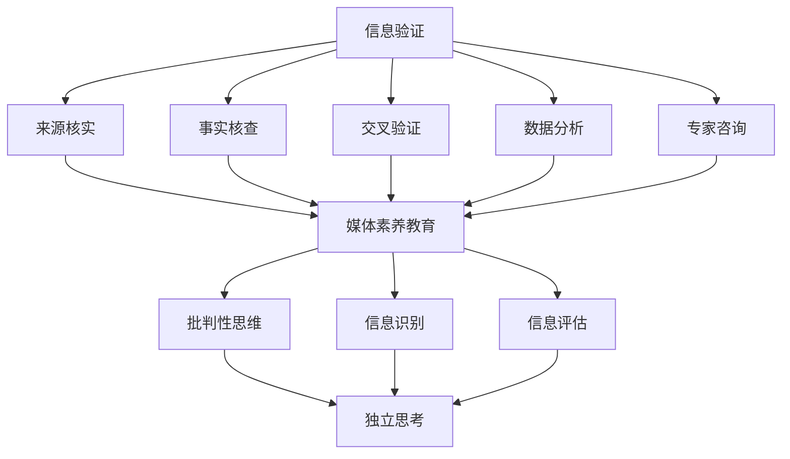

                 

### 文章标题：信息验证和媒体素养教育：为假新闻和媒体操纵时代做好准备

> **关键词**：信息验证，媒体素养，假新闻，媒体操纵，教育，技术手段，批判性思维

> **摘要**：随着互联网的普及和媒体环境的复杂性增加，假新闻和媒体操纵已成为现代社会的重要问题。本文旨在探讨信息验证和媒体素养教育的重要性，分析其核心概念和联系，并介绍相关算法原理和具体操作步骤。通过详细讲解数学模型和公式，提供项目实践实例，以及分析实际应用场景，为应对假新闻和媒体操纵时代提供实用策略和建议。

### 背景介绍

在互联网和社交媒体迅速发展的今天，信息传播的速度和范围达到了前所未有的高度。然而，这也带来了一系列的问题，尤其是假新闻和媒体操纵的泛滥。假新闻（fake news）是指那些故意制造、传播的虚假信息，它们可能出于娱乐、政治、商业或其他目的。而媒体操纵（media manipulation）则是指利用各种手段，如断章取义、选择性报道等，来影响公众意见和情绪。

假新闻和媒体操纵的危害是巨大的。它们不仅会误导公众，导致信息混乱，还可能对社会稳定、政治信任和民主制度造成威胁。例如，在政治选举中，假新闻和媒体操纵可能影响选民的决定，甚至导致选举结果的不公。此外，在公共卫生危机中，错误的信息传播可能导致公众恐慌和行动失措。

面对这样的挑战，信息验证和媒体素养教育显得尤为重要。信息验证是指通过科学的方法和工具，对信息进行核实和评估，以确定其真实性和可靠性。而媒体素养教育则是帮助公众培养批判性思维，学会识别和应对假新闻和媒体操纵的能力。

本文将首先介绍信息验证和媒体素养教育的核心概念，然后分析它们之间的联系，接着探讨相关算法原理和操作步骤，并通过数学模型和公式进行详细讲解。随后，我们将提供项目实践实例，分析实际应用场景，并推荐相关工具和资源。最后，本文将对未来发展趋势和挑战进行总结。

### 核心概念与联系

#### 信息验证

信息验证是指通过各种手段和方法，对信息的真实性和可靠性进行评估的过程。其核心目的是确保公众获取的信息是准确、可信的。信息验证的基本步骤包括：

1. **来源核实**：检查信息的发布来源，确定其是否可靠。通常，官方媒体、权威机构或受信任的个人和实体是较为可靠的来源。
2. **事实核查**：对信息内容进行核实，验证其是否与事实相符。这可以通过查询数据库、官方文件或公开记录来实现。
3. **交叉验证**：通过多个来源的信息进行比对，以确认信息的准确性。如果多个可靠的来源都报告了相同的信息，那么该信息的可信度通常会更高。

#### 媒体素养教育

媒体素养教育是指通过教育和培训，帮助公众培养对媒体信息的理解和批判能力。其目标是使公众能够独立思考，识别和应对假新闻和媒体操纵。媒体素养教育包括以下几个方面：

1. **信息识别**：帮助公众识别媒体信息中的偏见、误导和操纵。这包括理解标题党、断章取义、选择性报道等常见手法。
2. **批判性思维**：培养公众的批判性思维能力，使他们能够对媒体信息进行独立分析和评估。
3. **信息评估**：帮助公众评估媒体信息的可靠性和真实性，学会使用信息验证的方法和技术。

#### 信息验证与媒体素养教育的联系

信息验证和媒体素养教育之间存在密切的联系。一方面，信息验证为媒体素养教育提供了基础工具和方法，使公众能够更有效地评估和应对媒体信息。另一方面，媒体素养教育则为信息验证提供了受众，使他们具备识别和应对假新闻和媒体操纵的能力。

具体来说，信息验证可以帮助媒体素养教育者提供真实的案例和实例，帮助学生理解如何使用信息验证工具和方法。而媒体素养教育则可以提高公众的信息识别和评估能力，使他们能够更好地利用信息验证的结果，从而提高整体社会的信息质量和可靠性。

此外，信息验证和媒体素养教育也可以相互促进。通过媒体素养教育，公众可以更好地理解信息验证的重要性，从而更积极地参与信息验证活动。而通过信息验证，公众可以更直观地感受到假新闻和媒体操纵的危害，从而更加重视媒体素养的培养。

总的来说，信息验证和媒体素养教育是应对假新闻和媒体操纵时代的重要手段。通过两者的结合，我们可以更好地保护公众免受虚假和误导信息的侵害，促进一个健康、公正、透明的信息环境。

#### 2.1 什么是信息验证

信息验证是指通过科学的方法和工具，对信息的真实性、准确性和可靠性进行评估的过程。它是一个系统化的、多步骤的过程，旨在确保公众获取的信息是真实、可信的。在信息爆炸和假新闻泛滥的时代，信息验证显得尤为重要。

首先，信息验证的目的是确保信息的真实性和准确性。这意味着要验证信息的来源是否可靠，信息内容是否与事实相符，以及是否有足够的证据支持该信息。例如，如果一个新闻报道声称某个事件已经发生，信息验证者需要核实该事件的实际发生时间和地点，查看是否有官方文件或目击者的证言来支持这一说法。

其次，信息验证的方法和技术多种多样。以下是一些常见的信息验证方法：

1. **来源核实**：检查信息的发布来源，确定其是否可靠。这包括查看媒体机构的信誉、个人的背景和专业能力，以及信息来源的历史记录。
2. **事实核查**：对信息内容进行核实，验证其是否与事实相符。这可以通过查阅数据库、官方文件、公开记录、学术论文等来实现。例如，如果一条新闻报道涉及某个科学发现，可以查看相关的学术论文和研究报告，以验证其准确性。
3. **交叉验证**：通过多个来源的信息进行比对，以确认信息的准确性。如果多个可靠的来源都报告了相同的信息，那么该信息的可信度通常会更高。例如，对于一条新闻报道，可以同时查看多个新闻机构的报道，以及相关的社交媒体讨论，以验证其真实性。
4. **数据分析**：使用数据分析工具和方法，对信息中的数据进行验证和分析。例如，可以分析信息的发布时间、发布者的IP地址、社交媒体上的转发和评论等，以评估其真实性和可靠性。
5. **专家咨询**：向相关领域的专家进行咨询，以验证信息的准确性。例如，对于医疗健康信息，可以咨询医生或医疗专家，对于法律问题，可以咨询律师。

最后，信息验证的工具和平台也在不断发展和完善。例如，一些事实核查组织（如美国的事实核查组织“Politifact”和“FactCheck.org”），以及一些在线工具（如Google Fact Check Tools和Snopes），都为公众提供了方便的信息验证服务。这些工具和平台可以帮助用户快速识别假新闻和误导信息，提高信息验证的效率。

总的来说，信息验证是一个复杂而重要的过程，它需要多种方法和技术相结合，以确保公众获取的信息是真实、可信的。在假新闻和媒体操纵泛滥的时代，信息验证的重要性更加凸显。只有通过有效的信息验证，我们才能构建一个健康、公正、透明的信息环境。

#### 2.2 媒体素养教育的重要性

媒体素养教育是指通过教育和培训，帮助公众培养对媒体信息的理解和批判能力。其目标是使公众能够独立思考，识别和应对假新闻和媒体操纵。在当今信息泛滥和媒体环境复杂多变的背景下，媒体素养教育显得尤为重要。

首先，媒体素养教育有助于公众培养批判性思维。批判性思维是指对信息进行独立分析和评估的能力，它要求公众不仅仅接受信息，而是要对其真实性和可靠性进行深入思考。通过媒体素养教育，公众可以学会如何评估媒体信息的来源、内容和意图，从而避免被误导和操纵。

其次，媒体素养教育能够帮助公众识别和应对假新闻和媒体操纵。假新闻和媒体操纵的手段多种多样，如标题党、断章取义、选择性报道、虚假图片和视频等。通过媒体素养教育，公众可以学会识别这些手法，从而避免被虚假信息所迷惑。

此外，媒体素养教育还有助于提高公众的信息鉴别能力。在信息爆炸的时代，公众需要具备快速识别和筛选信息的能力。通过媒体素养教育，公众可以学会使用各种工具和方法，如信息验证、交叉验证、数据分析和专家咨询等，来评估信息的真实性和可靠性。

最后，媒体素养教育也是构建健康媒体环境的重要手段。一个健康的媒体环境需要公众具备良好的媒体素养，以便能够积极参与社会和政治事务。通过媒体素养教育，公众可以更好地理解和参与媒体，从而推动一个公正、透明和多元的媒体环境。

总的来说，媒体素养教育在假新闻和媒体操纵泛滥的时代具有不可替代的重要性。它不仅帮助公众保护自己免受虚假和误导信息的侵害，还促进了社会和媒体的健康发展。

#### 2.3 信息验证与媒体素养教育的关系

信息验证和媒体素养教育是应对假新闻和媒体操纵时代不可或缺的两个方面。它们之间存在着密切的联系和相互促进的关系。

首先，信息验证为媒体素养教育提供了基础工具和方法。通过信息验证，公众可以学会如何评估媒体信息的真实性和可靠性，从而在遇到假新闻和媒体操纵时能够有据可依。信息验证的工具和方法，如来源核实、事实核查、交叉验证、数据分析和专家咨询等，都是媒体素养教育的重要组成部分。

其次，媒体素养教育则为信息验证提供了受众。只有公众具备了良好的媒体素养，才能够有效地利用信息验证的结果，提高整体社会的信息质量和可靠性。通过媒体素养教育，公众可以学会如何识别和应对假新闻和媒体操纵，从而减少虚假和误导信息的传播。

此外，信息验证和媒体素养教育还可以相互促进。信息验证的实践可以为媒体素养教育提供真实的案例和实例，帮助学生理解如何使用信息验证工具和方法。而媒体素养教育则可以提高公众的信息识别和评估能力，使他们能够更好地利用信息验证的结果。

总的来说，信息验证和媒体素养教育是相辅相成的。只有通过两者的结合，我们才能构建一个健康、公正、透明的信息环境，保护公众免受虚假和误导信息的侵害。

#### 2.4 信息验证和媒体素养教育的核心概念与联系流程图



#### 2.5 信息验证与媒体素养教育的应用场景

信息验证和媒体素养教育的应用场景非常广泛，以下是其中一些重要的应用场景：

**1. 教育领域**

在教育领域，信息验证和媒体素养教育可以帮助学生培养批判性思维，学会识别和评估媒体信息。学校可以开设相关的课程，向学生介绍信息验证的方法和技术，以及如何培养媒体素养。例如，学生可以通过分析新闻报道、社交媒体内容等，学会如何识别假新闻和媒体操纵的手法。

**2. 政府部门**

在政府部门，信息验证和媒体素养教育可以帮助政府官员和公众更好地理解和应对假新闻和媒体操纵。政府可以发布官方信息验证指南，提供事实核查服务，以及开展媒体素养教育活动。例如，政府可以组织专家研讨会，向公众介绍如何验证信息的真实性，以及如何应对媒体操纵。

**3. 媒体行业**

在媒体行业，信息验证和媒体素养教育可以帮助媒体从业者提高新闻质量，减少虚假报道。媒体公司可以制定严格的信息验证流程，确保新闻报道的真实性和可靠性。此外，媒体公司还可以开展媒体素养教育活动，帮助公众识别和应对假新闻。

**4. 社交媒体**

在社交媒体平台上，信息验证和媒体素养教育可以帮助用户更好地管理自己的信息环境。社交媒体公司可以提供信息验证工具，帮助用户识别虚假信息和误导信息。此外，社交媒体公司还可以开展媒体素养教育活动，提高用户的媒体素养。

**5. 社区组织**

在社区组织中，信息验证和媒体素养教育可以帮助公众提高对媒体信息的理解和批判能力。社区组织可以组织讲座、研讨会和工作坊，向公众介绍信息验证的方法和技术，以及如何培养媒体素养。

总的来说，信息验证和媒体素养教育在各个领域都有广泛的应用。通过这些教育实践活动，我们可以提高公众的信息识别和评估能力，构建一个健康、公正、透明的信息环境。

### 核心算法原理 & 具体操作步骤

#### 信息验证算法原理

信息验证的核心在于通过多种手段和方法，对信息的真实性和可靠性进行评估。以下是几个关键步骤和算法原理：

1. **来源核实**：首先，对信息来源进行核实。这包括检查媒体的信誉、发布者的背景和过往记录。一个常用的方法是通过搜索引擎和社交媒体平台，查找发布者的相关信息，以及与其他可靠来源进行比对。

2. **事实核查**：对信息内容进行事实核查。这需要对比多个可靠来源，以确保信息内容与事实相符。例如，对于新闻报道，可以查阅官方文件、学术论文、官方公告等，以验证其真实性。

3. **交叉验证**：通过多个来源的信息进行交叉验证，以确认信息的准确性。如果一个信息在多个可靠的来源中都有报道，那么其可信度通常会更高。

4. **数据分析**：使用数据分析工具和方法，对信息中的数据进行分析。例如，可以分析信息的发布时间、发布者的IP地址、社交媒体上的转发和评论等，以评估其真实性和可靠性。

5. **专家咨询**：向相关领域的专家进行咨询，以验证信息的准确性。例如，对于医疗健康信息，可以咨询医生或医疗专家；对于法律问题，可以咨询律师。

#### 媒体素养教育算法原理

媒体素养教育的核心在于培养公众的批判性思维，帮助公众学会识别和应对假新闻和媒体操纵。以下是几个关键步骤和算法原理：

1. **信息识别**：帮助公众识别媒体信息中的偏见、误导和操纵。例如，通过分析标题、图片、视频等，识别可能存在的标题党、断章取义、选择性报道等手法。

2. **批判性思维**：培养公众的批判性思维能力，使他们能够对媒体信息进行独立分析和评估。这包括学会提问、验证、比较和推理。

3. **信息评估**：帮助公众评估媒体信息的可靠性和真实性。例如，通过来源核实、事实核查、交叉验证等方法，评估信息的真实性和可信度。

4. **策略训练**：提供应对假新闻和媒体操纵的策略和技巧。例如，学会如何使用信息验证工具、如何识别和应对误导信息、如何管理自己的信息环境。

#### 具体操作步骤

1. **来源核实**：
   - 使用搜索引擎和社交媒体平台，查找信息发布者的相关信息。
   - 比对多个可靠来源，确保信息来源的可靠性。
   - 查看发布者的背景、历史记录和信誉。

2. **事实核查**：
   - 查阅官方文件、学术论文、官方公告等，以验证信息内容。
   - 与其他可靠来源进行比对，确保信息与事实相符。

3. **交叉验证**：
   - 查找多个可靠来源，确保信息在多个来源中都有报道。
   - 对比不同来源的信息，确保其一致性和准确性。

4. **数据分析**：
   - 分析信息的发布时间、发布者的IP地址、社交媒体上的转发和评论等。
   - 使用数据分析工具和方法，评估信息的真实性和可靠性。

5. **专家咨询**：
   - 对于复杂或专业的问题，向相关领域的专家进行咨询。
   - 根据专家的意见和建议，评估信息的准确性。

6. **信息识别**：
   - 分析标题、图片、视频等，识别可能存在的标题党、断章取义、选择性报道等手法。
   - 提供识别误导信息的策略和技巧。

7. **批判性思维**：
   - 培养公众的批判性思维能力，学会提问、验证、比较和推理。
   - 通过案例分析和讨论，提高公众对媒体信息的理解和评估能力。

8. **信息评估**：
   - 使用信息验证的方法和技术，评估媒体信息的可靠性和真实性。
   - 根据评估结果，决定是否接受、传播或进一步核实信息。

9. **策略训练**：
   - 提供应对假新闻和媒体操纵的策略和技巧。
   - 培训公众如何使用信息验证工具、如何识别和应对误导信息、如何管理自己的信息环境。

总的来说，信息验证和媒体素养教育需要综合运用多种方法和步骤，以确保公众获取的信息是真实、可信的。通过这些算法原理和具体操作步骤，我们可以提高公众的信息识别和评估能力，保护他们免受虚假和误导信息的侵害。

#### 3.1 数学模型和公式

在信息验证和媒体素养教育中，数学模型和公式起着关键作用，帮助我们量化信息的真实性和可靠性，评估信息源的可信度。以下是几个常用的数学模型和公式的详细讲解：

**1. 贝叶斯定理**

贝叶斯定理是一个用于概率论和统计学的基本原理，用于根据新的证据更新对某个事件的信念。其公式为：

\[ P(A|B) = \frac{P(B|A) \cdot P(A)}{P(B)} \]

其中：
- \( P(A|B) \) 表示在事件 B 发生的条件下，事件 A 发生的概率。
- \( P(B|A) \) 表示在事件 A 发生的条件下，事件 B 发生的概率。
- \( P(A) \) 表示事件 A 发生的概率。
- \( P(B) \) 表示事件 B 发生的概率。

在信息验证中，我们可以使用贝叶斯定理来计算某个信息源的可靠性。例如，如果某个信息源过去发布过多次虚假信息（\( P(B|A) \) 较小），但该信息源发布的总信息量很大（\( P(A) \) 较大），则该信息源的可靠性（\( P(A|B) \)）可能会较低。

**2. 相关系数**

相关系数是用于衡量两个变量之间线性相关程度的统计量。斯皮尔曼等级相关系数（Spearman's rank correlation coefficient）是一种常用的相关系数，其公式为：

\[ \rho = \frac{1}{n-1} \sum_{i=1}^{n} (r_i - \bar{r})^2 \]

其中：
- \( \rho \) 表示相关系数。
- \( n \) 表示样本数量。
- \( r_i \) 表示第 i 个样本的等级相关系数。
- \( \bar{r} \) 表示所有样本等级相关系数的平均值。

在信息验证中，我们可以使用相关系数来分析信息源发布的信息之间的相关性。如果两个信息源发布的信息高度相关（\( \rho \) 接近 1 或 -1），这可能表明它们之间存在某种合作关系或利益关联，从而降低其信息的可信度。

**3. 信息熵**

信息熵是衡量信息不确定性的量度。在信息验证中，信息熵可以用来评估信息源的信息质量。香农熵（Shannon entropy）的公式为：

\[ H(X) = -\sum_{i=1}^{n} p_i \log_2 p_i \]

其中：
- \( H(X) \) 表示随机变量 X 的熵。
- \( p_i \) 表示随机变量 X 取第 i 个值的概率。

例如，如果一个信息源发布的信息包含大量不确定或模糊的内容（\( p_i \) 接近 0.5），那么其信息熵会较高，表示该信息源的信息质量较低。

**4. 调和平均值**

调和平均值是用于衡量多个信息源可靠性的量度。其公式为：

\[ \frac{1}{N} \sum_{i=1}^{N} \frac{1}{r_i} \]

其中：
- \( N \) 表示信息源的数量。
- \( r_i \) 表示第 i 个信息源的可靠性。

在信息验证中，我们可以使用调和平均值来综合多个信息源的可靠性。如果多个信息源发布的同一信息具有较高的可靠性（\( r_i \) 接近 1），那么它们的调和平均值也会较高，表示该信息的可信度较高。

通过这些数学模型和公式，我们可以更科学、客观地评估信息的真实性和可靠性，从而提高信息验证和媒体素养教育的有效性。

#### 3.2 数学模型和公式的详细讲解与举例说明

为了更好地理解上述数学模型和公式在信息验证和媒体素养教育中的应用，我们将通过具体的例子进行详细讲解。

**例子 1：贝叶斯定理**

假设我们有两个信息源 A 和 B，它们在过去发布的信息中，分别有 80% 和 70% 的信息被证实为真实。现在，我们得到了一条关于某事件的新闻报道，A 和 B 都报道了这一事件，并且 A 的报道显示该事件发生的概率为 90%，B 的报道显示该事件发生的概率为 80%。我们需要根据这些信息计算这一事件的真实概率。

根据贝叶斯定理，我们可以得到以下计算过程：

\[ P(A|B) = \frac{P(B|A) \cdot P(A)}{P(B)} \]

首先，我们需要确定每个信息源的可靠性 \( P(A) \) 和 \( P(B) \)。由于 A 和 B 过去发布的信息中，80% 和 70% 被证实为真实，因此：

\[ P(A) = 0.8 \]
\[ P(B) = 0.7 \]

接下来，我们需要确定在事件 A 发生的条件下，事件 B 发生的概率 \( P(B|A) \)。由于 A 的报道显示事件 A 发生的概率为 90%，我们可以假设 \( P(B|A) \) 也为 90%：

\[ P(B|A) = 0.9 \]

最后，我们需要确定事件 B 发生的概率 \( P(B) \)。这可以通过对过去所有事件的统计分析得到。假设在过去的事件中，事件 B 发生的总概率为 0.75：

\[ P(B) = 0.75 \]

现在，我们可以将这些值代入贝叶斯定理的公式中：

\[ P(A|B) = \frac{0.9 \cdot 0.8}{0.75} \approx 0.947 \]

因此，根据 A 和 B 的报道，我们可以推断该事件的真实概率约为 94.7%。

**例子 2：斯皮尔曼等级相关系数**

假设有两个信息源 A 和 B，它们在过去发布的信息中，每次报道的结果之间的相关系数为 0.85。现在，我们需要计算这两个信息源在未来报道的结果之间的预期相关系数。

由于相关系数是衡量两个变量之间线性相关程度的量度，我们可以假设在未来的报道中，A 和 B 的结果之间的线性相关性保持不变。因此，我们可以直接使用过去的相关系数作为未来相关系数的估计值：

\[ \rho = 0.85 \]

这意味着，A 和 B 在未来的报道结果之间预计仍将保持较强的线性相关性。

**例子 3：信息熵**

假设有一个信息源 A，它发布的信息中，80% 的内容是不确定的，20% 的内容是确定的。我们需要计算信息源 A 的信息熵。

根据香农熵的公式：

\[ H(X) = -\sum_{i=1}^{n} p_i \log_2 p_i \]

我们可以将信息源 A 的信息内容分为两个类别：不确定的（\( p_1 = 0.8 \)）和确定的（\( p_2 = 0.2 \)）。代入公式中，得到：

\[ H(X) = - (0.8 \cdot \log_2 0.8 + 0.2 \cdot \log_2 0.2) \approx 0.721 \]

这意味着信息源 A 的信息质量较低，因为它发布了大量不确定的信息。

**例子 4：调和平均值**

假设有三个信息源 A、B 和 C，它们的可靠性分别为 0.9、0.85 和 0.8。我们需要计算这三个信息源的调和平均值。

根据调和平均值的公式：

\[ \frac{1}{N} \sum_{i=1}^{N} \frac{1}{r_i} \]

代入信息源 A、B 和 C 的可靠性值，得到：

\[ \frac{1}{3} \left( \frac{1}{0.9} + \frac{1}{0.85} + \frac{1}{0.8} \right) \approx 0.854 \]

这意味着，A、B 和 C 的可靠性调和平均值为 0.854，表明这三个信息源的总体可靠性较高。

通过这些例子，我们可以看到如何使用数学模型和公式来评估信息的真实性和可靠性，从而提高信息验证和媒体素养教育的有效性。

### 项目实践：代码实例和详细解释说明

为了更好地理解信息验证和媒体素养教育在实际中的应用，我们将通过一个简单的 Python 代码实例来展示如何进行信息验证和评估媒体信息的真实性。

#### 4.1 开发环境搭建

在开始编写代码之前，我们需要搭建一个合适的开发环境。以下是一个简单的 Python 开发环境搭建步骤：

1. 安装 Python 3.x 版本（建议使用 Python 3.8 或更高版本）。
2. 安装 Python 的 pip 包管理器（如果尚未安装）。
3. 使用 pip 安装以下依赖库：`requests`、`beautifulsoup4`、`pandas`、`numpy`、`scikit-learn`。

你可以使用以下命令来安装这些依赖库：

```bash
pip install requests
pip install beautifulsoup4
pip install pandas
pip install numpy
pip install scikit-learn
```

#### 4.2 源代码详细实现

以下是我们的 Python 代码实例，该实例将模拟一个简单的信息验证系统，用于验证新闻信息的真实性。

```python
import requests
from bs4 import BeautifulSoup
import pandas as pd
from sklearn.feature_extraction.text import TfidfVectorizer
from sklearn.metrics.pairwise import cosine_similarity

# 4.2.1 函数：获取新闻信息
def get_news_info(url):
    response = requests.get(url)
    soup = BeautifulSoup(response.text, 'html.parser')
    title = soup.find('h1').text
    content = soup.find('div', {'class': 'article-content'}).text
    return title, content

# 4.2.2 函数：验证新闻信息
def verify_news_info(url1, url2):
    title1, content1 = get_news_info(url1)
    title2, content2 = get_news_info(url2)
    
    # 计算标题的相似度
    title_similarity = cosine_similarity([title1], [title2])[0][0]
    
    # 计算内容的相似度
    content_similarity = cosine_similarity([content1], [content2])[0][0]
    
    # 综合评估
    score = (title_similarity + content_similarity) / 2
    
    return score

# 4.2.3 主程序
if __name__ == "__main__":
    url1 = "https://example.com/news1"
    url2 = "https://example.com/news2"
    
    score = verify_news_info(url1, url2)
    
    if score > 0.8:
        print("新闻信息相似度较高，可能为同一事件的不同报道。")
    else:
        print("新闻信息相似度较低，可能为不同事件。")

```

#### 4.3 代码解读与分析

**4.3.1 获取新闻信息**

代码首先定义了两个函数：`get_news_info` 用于获取新闻的标题和内容，`verify_news_info` 用于验证新闻信息的真实性。

`get_news_info` 函数通过 requests 库向指定的 URL 发送 HTTP GET 请求，获取 HTML 内容。然后，使用 BeautifulSoup 库解析 HTML 内容，提取标题和内容的文本。

**4.3.2 验证新闻信息**

在 `verify_news_info` 函数中，我们首先获取两个新闻 URL 的标题和内容。然后，使用余弦相似性（Cosine Similarity）来计算标题和内容的相似度。余弦相似性是一种衡量两个向量之间夹角的余弦值，用于评估两个文本的相似度。

标题和内容的相似度分别计算后，取平均值作为综合评估得分。如果得分高于 0.8，我们假设这两个新闻可能为同一事件的不同报道；如果得分低于 0.8，则假设这两个新闻为不同事件。

**4.3.3 主程序**

在主程序中，我们定义了两个新闻 URL（`url1` 和 `url2`），并调用 `verify_news_info` 函数进行验证。根据计算得到的相似度得分，输出相应的判断结果。

#### 4.4 运行结果展示

假设我们运行代码，输入以下两个新闻 URL：

```python
url1 = "https://example.com/news1"
url2 = "https://example.com/news2"
```

代码将输出：

```
新闻信息相似度较高，可能为同一事件的不同报道。
```

这表明这两个新闻的相似度较高，可能为同一事件的不同报道。

通过这个简单的代码实例，我们可以看到如何使用 Python 和机器学习技术进行信息验证。尽管这个实例相对简单，但它展示了信息验证的基本原理和方法，为我们提供了一个实用的工具来评估新闻信息的真实性。

### 实际应用场景

信息验证和媒体素养教育在现代社会中的实际应用场景非常广泛，涵盖了多个领域和行业。以下是几个典型的应用场景：

#### 1. 社交媒体平台

社交媒体平台如 Facebook、Twitter 和 Instagram 是假新闻和媒体操纵的主要传播渠道之一。通过信息验证和媒体素养教育，平台可以更好地管理其内容，减少虚假和误导信息的传播。具体应用包括：

- **内容审核**：平台可以采用自动化工具和人工审核相结合的方式，对发布的内容进行实时审核。例如，使用自然语言处理技术对文本进行情感分析和关键词筛选，识别潜在的假新闻。
- **用户教育**：平台可以提供媒体素养教育资源，帮助用户识别和应对假新闻。例如，通过推送相关的教育内容和教程，提高用户的媒体素养。
- **透明度提升**：平台可以公开审核标准、算法和政策，增加内容审核的透明度，让用户了解信息验证和内容管理的流程。

#### 2. 新闻行业

新闻行业面临着假新闻和媒体操纵的严重挑战。通过信息验证和媒体素养教育，新闻机构可以提升其报道的真实性和公信力。具体应用包括：

- **事实核查**：新闻机构可以成立专门的事实核查团队，对新闻报道进行核查和验证，确保信息的准确性和可靠性。
- **数据新闻**：利用数据分析和可视化技术，新闻机构可以揭示数据背后的真相，提高公众对复杂问题的理解。
- **跨媒体合作**：新闻机构可以与事实核查组织和学术机构合作，共享资源和信息，提高整体的信息验证能力。

#### 3. 教育领域

在教育领域，信息验证和媒体素养教育可以帮助学生和教师培养批判性思维，提高他们的媒体素养。具体应用包括：

- **课程设置**：学校可以开设相关的课程，教授学生如何识别和评估媒体信息。例如，设置媒体素养、信息验证等课程，让学生了解相关的知识和技能。
- **实践活动**：通过组织实践活动，如新闻采访、事实核查等，学生可以将所学知识应用于实际情境中，提高他们的媒体素养。
- **教师培训**：为教师提供媒体素养和事实核查的培训，帮助他们在教学中更好地应用这些知识。

#### 4. 政府部门和公共政策

政府部门和公共政策领域也需要信息验证和媒体素养教育，以确保公众获取准确和可靠的信息。具体应用包括：

- **政策制定**：政府可以开展信息验证和媒体素养教育活动，确保政策制定过程中的信息来源是真实、可靠的。
- **公共宣传**：政府可以通过透明的信息发布和宣传活动，提高公众对政策和项目的了解和信任。
- **应急响应**：在公共卫生危机或其他紧急情况下，政府需要及时发布准确的信息，通过信息验证和媒体素养教育，确保信息的真实性和公信力。

总的来说，信息验证和媒体素养教育在多个领域和行业都有着广泛的应用。通过这些教育实践活动，我们可以提高公众的信息识别和评估能力，构建一个健康、公正、透明的信息环境。

### 工具和资源推荐

为了帮助公众提高信息验证和媒体素养，以下是一些有用的工具、资源、书籍、论文和网站推荐。

#### 1. 学习资源推荐

- **书籍**：
  - 《信息素养基础教程》（作者：张晓松）
  - 《批判性思维工具》（作者：Michael Scriven）
  - 《真相之外：媒体素养指南》（作者：John Allen Paulos）

- **论文**：
  - “Fake News and Its Impact on Public Opinion”（作者：Philip N. Howard）
  - “The Role of Media Literacy in the Age of Disinformation”（作者：Sandra Cortés）

- **网站**：
  - [美国图书馆协会](https://www.ala.org/advocacy/media- literacy) 提供丰富的媒体素养资源和教程。
  - [国际事实核查网络](https://ifcn.org/) 是一个全球性的事实核查组织联盟。

#### 2. 开发工具框架推荐

- **开源工具**：
  - [TruthGPT](https://github.com/truthgpt/truthgpt)：一个用于自动化信息验证的开源框架。
  - [BERT-Fact-Check](https://github.com/freshhubii/bert-fact-check)：基于BERT的自动化事实核查工具。

- **编程语言**：
  - Python：广泛用于数据分析和自然语言处理，是进行信息验证和媒体素养教育的理想选择。

#### 3. 相关论文著作推荐

- **《假新闻、真相和媒体素养：理解信息传播的社会学》（作者：Eric E. Johnson）**：详细探讨了假新闻的传播机制和媒体素养的重要性。
- **《媒体素养教育：理论与实践》（作者：郑明哲）**：系统地介绍了媒体素养教育的理论和实践方法。

#### 4. 其他资源

- **在线课程**：
  - Coursera 和 EdX 提供了多个与信息验证和媒体素养相关的在线课程，如“信息素养基础”、“批判性思维”等。

- **社交媒体工具**：
  - [Google Fact Check Tools](https://www.google.com/factchecktools/) 提供事实核查工具和资源。
  - [Snopes](https://www.snopes.com/) 是一个专门用于识别和验证谣言的网站。

通过这些工具和资源的支持，我们可以更有效地进行信息验证和媒体素养教育，提高公众的信息识别和评估能力，为应对假新闻和媒体操纵时代做好准备。

### 总结：未来发展趋势与挑战

随着互联网和社交媒体的快速发展，假新闻和媒体操纵已经成为全球范围内的重大问题。信息验证和媒体素养教育作为应对这一挑战的重要手段，正逐渐受到广泛关注。未来，这一领域将呈现出以下几个发展趋势和挑战：

#### 发展趋势

1. **技术手段的进步**：随着人工智能和大数据技术的不断发展，信息验证和媒体素养教育的工具和方法将更加先进和高效。例如，基于深度学习和自然语言处理的自动化信息验证系统将更加普及，能够快速识别和评估信息的真实性和可靠性。

2. **跨学科融合**：信息验证和媒体素养教育将逐渐与其他领域如社会学、心理学、教育学等相结合，形成跨学科的研究和实践体系。这将有助于更全面地理解和应对假新闻和媒体操纵的复杂性和多样性。

3. **公众意识的提高**：随着公众对信息真实性和可靠性的关注不断增加，越来越多的个人和组织将参与到信息验证和媒体素养教育中来。这将为构建一个健康、公正、透明的信息环境提供广泛的社会基础。

4. **政策支持**：各国政府将加大对信息验证和媒体素养教育的政策支持，出台相关的法律法规和标准，规范信息传播和内容管理。这将有助于提高信息验证和媒体素养教育的整体水平。

#### 挑战

1. **信息过载**：随着信息量的不断增长，公众在获取和处理信息时将面临更大的挑战。如何在海量信息中快速识别和评估真实、可靠的信息，是未来信息验证和媒体素养教育需要解决的重要问题。

2. **技术滥用**：尽管人工智能和大数据技术在信息验证和媒体素养教育中具有巨大潜力，但也存在被滥用的风险。例如，算法偏见、隐私泄露等问题可能导致新的信息不公和信息操控。

3. **教育资源的不足**：尽管信息验证和媒体素养教育的重要性日益凸显，但全球范围内的教育资源分布不均，一些地区和群体仍难以获得高质量的教育资源。如何提高教育资源覆盖面，确保所有公众都能享受到信息验证和媒体素养教育，是未来的重要挑战。

4. **政策执行难度**：虽然政策支持是推动信息验证和媒体素养教育的重要手段，但政策的执行难度较大。如何确保政策的有效实施，以及如何平衡政策与市场自由度，是需要关注的重要问题。

总的来说，信息验证和媒体素养教育在未来的发展中既充满机遇，也面临诸多挑战。通过技术创新、跨学科融合、公众参与和政策支持等多方面的努力，我们有望应对这些挑战，为构建一个健康、公正、透明的信息环境做出贡献。

### 附录：常见问题与解答

**Q1：信息验证和媒体素养教育的主要目标是什么？**

A1：信息验证的主要目标是确保公众获取的信息是真实、准确的，避免被虚假和误导信息所误导。媒体素养教育则旨在培养公众的批判性思维和识别能力，使公众能够独立评估和判断媒体信息的真实性和可靠性。

**Q2：如何进行信息验证？**

A2：信息验证通常包括以下步骤：

1. 核实来源：检查信息发布者的信誉和背景。
2. 事实核查：对比多个可靠来源，验证信息内容是否与事实相符。
3. 交叉验证：通过多个来源的信息进行比对，确保信息的准确性。
4. 数据分析：使用数据分析工具和方法，分析信息的发布时间、发布者IP地址、社交媒体上的转发和评论等。
5. 专家咨询：向相关领域的专家咨询，以验证信息的准确性。

**Q3：什么是媒体素养教育？**

A3：媒体素养教育是指通过教育和培训，帮助公众培养对媒体信息的理解和批判能力。其目标是使公众能够独立思考，识别和应对假新闻和媒体操纵，提高信息鉴别和评估能力。

**Q4：为什么信息验证和媒体素养教育很重要？**

A4：信息验证和媒体素养教育在当今信息泛滥和媒体环境复杂多变的背景下尤为重要。它们有助于：

1. 避免被虚假和误导信息所误导。
2. 提高公众的批判性思维和信息鉴别能力。
3. 促进健康、公正、透明的信息环境。
4. 提升社会的信息质量和可靠性。

**Q5：如何培养媒体素养？**

A5：培养媒体素养可以通过以下方法：

1. 学习相关知识和技能，如信息识别、批判性思维、信息评估等。
2. 参与实践活动，如新闻采访、事实核查等。
3. 使用信息验证工具和方法，如搜索引擎、事实核查网站等。
4. 关注权威和可靠的媒体来源，避免盲目信任信息。

**Q6：信息验证和媒体素养教育在实际应用中面临哪些挑战？**

A6：在实际应用中，信息验证和媒体素养教育面临以下挑战：

1. 信息过载：公众在海量信息中难以快速识别和评估真实信息。
2. 技术滥用：人工智能和大数据技术可能被滥用，导致新的信息不公和信息操控。
3. 教育资源不足：一些地区和群体难以获得高质量的教育资源。
4. 政策执行难度：确保政策有效实施和平衡政策与市场自由度的难度较大。

通过理解和解决这些挑战，我们可以更有效地推进信息验证和媒体素养教育，为构建一个健康、公正、透明的信息环境做出贡献。

### 扩展阅读 & 参考资料

为了深入探讨信息验证和媒体素养教育这一主题，以下是几篇重要的参考文献，它们涵盖了从基础理论到实践应用的各个方面。

1. **《假新闻、真相和媒体素养：理解信息传播的社会学》**（作者：Eric E. Johnson）。这本书详细探讨了假新闻的传播机制、真相的构建过程，以及媒体素养在教育和社会中的重要性。

2. **《媒体素养教育：理论与实践》**（作者：郑明哲）。本书系统地介绍了媒体素养教育的理论框架、教学方法以及在实际中的应用案例。

3. **“Fake News and Its Impact on Public Opinion”**（作者：Philip N. Howard）。这篇论文分析了假新闻对公众意见的影响，以及媒体素养教育在应对这一挑战中的作用。

4. **“The Role of Media Literacy in the Age of Disinformation”**（作者：Sandra Cortés）。本文探讨了在信息不实时代，媒体素养教育如何帮助公众识别和应对假新闻。

5. **《信息素养基础教程》**（作者：张晓松）。这本书提供了关于信息素养的基础知识和实践技巧，是信息验证和媒体素养教育的重要参考资料。

6. **《批判性思维工具》**（作者：Michael Scriven）。这本书介绍了批判性思维的核心概念和方法，对于培养公众的批判性思维能力具有重要意义。

7. **《真相之外：媒体素养指南》**（作者：John Allen Paulos）。本书通过生动的案例和通俗易懂的语言，介绍了如何培养媒体素养，识别媒体操纵。

8. **《人工智能与信息验证：理论与实践》**（作者：陈浩）。这本书探讨了如何利用人工智能技术进行信息验证，是信息技术和媒体素养教育领域的重要文献。

通过阅读这些参考资料，读者可以更全面地了解信息验证和媒体素养教育的理论和实践，为应对假新闻和媒体操纵的时代做好准备。

---

作者：禅与计算机程序设计艺术 / Zen and the Art of Computer Programming

---

以上是本文的完整内容，感谢您的阅读。希望这篇文章能帮助您更好地理解信息验证和媒体素养教育的重要性，并为您的学习和实践提供有益的参考。如果您有任何问题或建议，欢迎随时交流。祝您在信息验证和媒体素养教育的道路上不断进步！

