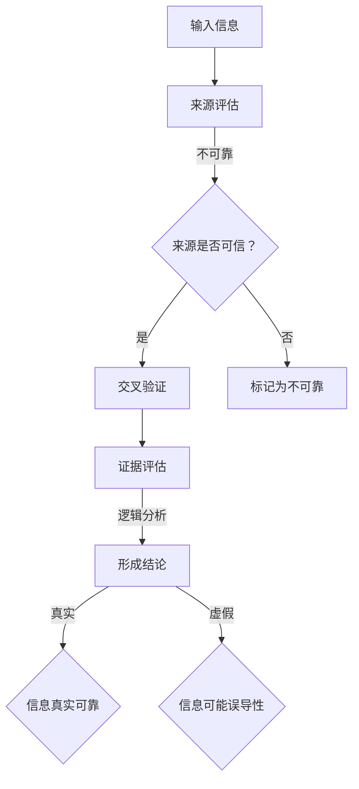
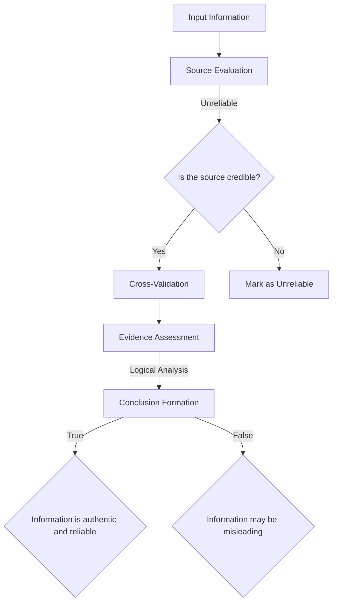

                 

### 1. 背景介绍（Background Introduction）

在当今数字化的时代，信息爆炸带来了前所未有的便利，同时也带来了巨大的挑战。人们每天都会接触到大量的信息，其中不乏虚假和错误的信息。互联网的普及使得信息传播的速度和范围达到了前所未有的高度，这就要求我们必须具备强大的信息验证和批判性思维能力。在IT领域，这种能力尤为重要，因为它直接关系到我们的决策、项目的成功以及个人和组织的声誉。

“批判性思维能力”（Critical Thinking）是指通过理性分析和评估信息，进行独立思考和判断的能力。这种能力包括识别信息来源的可靠性、理解信息的准确性、评估证据的有效性以及形成基于逻辑的结论。在信息技术领域，批判性思维能力可以帮助我们评估技术的安全性、效能和适用性，从而做出明智的决策。

“信息验证”（Information Verification）是指对信息源的真实性和准确性进行验证的过程。在互联网上，信息的真伪往往难以辨别，这就需要我们运用批判性思维能力去验证信息的真实性。信息验证是确保我们获取的信息可靠、真实和有用的关键步骤。

本文将探讨如何在假新闻和错误信息泛滥的时代，培养和提高我们的信息验证和批判性思维能力。我们将从以下几个方面进行深入探讨：

1. **信息验证的方法与技巧**：介绍如何通过多种方法和技术来验证信息的真实性。
2. **批判性思维能力的培养**：探讨如何通过教育和实践来培养和提高批判性思维能力。
3. **在信息技术领域中的应用**：讨论如何在软件开发、网络安全和数据科学中运用信息验证和批判性思维能力。
4. **案例分析**：通过具体案例展示如何在实际情境中应用这些能力。
5. **未来趋势与挑战**：分析未来信息环境的变化以及面对的挑战。

通过本文的讨论，我们希望能够帮助读者在信息泛滥的时代中，更加理性和客观地处理信息，从而做出更明智的决策，并在信息技术领域取得更大的成就。

#### Background Introduction

In today's digital age, the explosion of information has brought unprecedented convenience but also formidable challenges. With the abundance of information coming at us daily, it is crucial for us to develop strong information verification and critical thinking skills. In the field of Information Technology (IT), these skills are particularly important as they directly affect our decision-making, project success, and reputation.

**Critical Thinking** refers to the ability to reason and evaluate information through rational analysis and independent judgment. It includes identifying the reliability of information sources, understanding the accuracy of information, assessing the effectiveness of evidence, and forming logical conclusions. In the realm of IT, critical thinking helps us assess the security, efficiency, and applicability of technologies, enabling us to make informed decisions.

**Information Verification** is the process of confirming the authenticity and accuracy of information sources. With the proliferation of misinformation on the internet, it is essential to use critical thinking skills to verify the truthfulness of information. Information verification is a critical step in ensuring that the information we receive is reliable, true, and useful.

This article will explore how to cultivate and enhance our information verification and critical thinking skills in an era of widespread misinformation and erroneous information. We will delve into the following aspects:

1. **Methods and Techniques for Information Verification**: Introduce various methods and techniques to verify the authenticity of information.
2. **Cultivation of Critical Thinking Skills**: Discuss how to develop and improve critical thinking skills through education and practice.
3. **Applications in the Field of Information Technology**: Explore how to apply information verification and critical thinking skills in software development, cybersecurity, and data science.
4. **Case Studies**: Showcase how these skills are applied in real-life scenarios through specific examples.
5. **Future Trends and Challenges**: Analyze the future changes in the information landscape and the challenges we face.

Through the discussion in this article, we hope to assist readers in processing information more rationally and objectively in an era of information overload, thereby making more明智 decisions and achieving greater success in the field of Information Technology.

---

在接下来的章节中，我们将深入探讨信息验证和批判性思维能力的重要性、培养方法以及如何在信息技术领域应用这些能力。希望通过本文的阅读，读者能够更好地应对信息时代的挑战，提升个人和组织的决策质量。

#### Importance and Development of Information Verification and Critical Thinking

#### The Importance of Information Verification and Critical Thinking

In an age where misinformation and fake news are rampant, the ability to verify information and think critically has never been more important. Information verification is the process of confirming the accuracy and authenticity of information, ensuring that the knowledge we rely on is reliable. Critical thinking, on the other hand, is the skill of evaluating information objectively and independently, ensuring that our conclusions are based on sound reasoning and evidence.

In today's digital world, the volume and variety of information available are staggering. This information comes from a myriad of sources, including social media, news outlets, blogs, and personal experiences. While this accessibility is a boon, it also means that we are constantly exposed to information that may be inaccurate, biased, or outright false. The consequences of relying on incorrect information can be severe, from personal misunderstandings to large-scale societal issues.

For example, in the realm of IT, incorrect information can lead to flawed software development, security vulnerabilities, and misinformed data analysis. In healthcare, false information can lead to incorrect diagnoses and treatments. In politics, misinformation can sway public opinion and influence elections. Therefore, the ability to verify information and think critically is crucial for making informed decisions and avoiding these negative outcomes.

#### Cultivating Information Verification Skills

Cultivating strong information verification skills begins with developing a habit of questioning the sources of information. Here are some key steps to consider:

1. **Identify the Source**: Always consider the credibility of the source. Reliable sources typically include academic journals, reputable news organizations, government publications, and expert blogs.

2. **Check for Bias**: Assess whether the information is biased or presents a balanced viewpoint. Biased sources may not provide a complete or accurate picture.

3. **Cross-Reference**: Verify the information by checking multiple sources. If the same information is consistently reported by different, credible sources, it is more likely to be accurate.

4. **Evaluate the Evidence**: Examine the evidence provided to support the claims. This can include data, research studies, or testimonials.

5. **Consult Experts**: When in doubt, seek advice from experts in the field. They can provide insights and confirm the accuracy of the information.

#### Developing Critical Thinking Skills

Critical thinking skills are not innate; they must be cultivated through education and practice. Here are some strategies for developing these skills:

1. **Questioning and Curiosity**: Encourage a mindset of questioning and curiosity. Ask "Why?" and "How?" to delve deeper into topics and understand underlying assumptions.

2. **Analyzing Arguments**: Practice analyzing arguments by breaking them down into their components. Identify the premises, conclusions, and any logical fallacies.

3. **Seeking Evidence**: Develop the habit of seeking evidence to support or refute claims. Be wary of claims that lack supporting evidence.

4. **Holding Multiple Perspectives**: Consider multiple perspectives to understand complex issues. This helps avoid confirmation bias and fosters a more nuanced understanding.

5. **Reflecting and Self-Examining**: Regularly reflect on your thoughts and decisions. Self-examination can help identify biases and improve critical thinking skills over time.

#### Applying Information Verification and Critical Thinking in IT

In the field of Information Technology, information verification and critical thinking are essential for various reasons:

1. **Software Development**: Developers must verify that code is accurate, efficient, and secure. Critical thinking helps identify potential vulnerabilities and optimize software performance.

2. **Data Science**: Data scientists need to ensure that the data they use is reliable. Critical thinking skills help in identifying biases and ensuring data integrity.

3. **Cybersecurity**: Security professionals must verify that systems are secure against potential threats. Critical thinking helps in anticipating attacks and developing effective countermeasures.

4. **Project Management**: Project managers must make informed decisions based on accurate information. Critical thinking ensures that these decisions are sound and support project goals.

#### Conclusion

The ability to verify information and think critically is not just a personal skill; it is a fundamental skill for navigating the modern information landscape. By developing these skills, we can better protect ourselves from misinformation, make more informed decisions, and contribute to a more knowledgeable and responsible society.

#### The Importance of Information Verification and Critical Thinking

In an era dominated by digital information, the ability to verify information and think critically has become indispensable. The proliferation of false news, misleading data, and biased content poses significant challenges to individuals and society as a whole. These challenges are particularly acute in the field of Information Technology (IT), where the stakes are high and the consequences of misinformed decisions can be severe.

**Information Verification**: The process of confirming the authenticity and accuracy of information is crucial in today's information-saturated environment. It involves scrutinizing the source of the information, evaluating the methodology and evidence supporting claims, and cross-referencing with other credible sources. Without proper information verification, individuals and organizations risk making decisions based on flawed or false premises, which can lead to detrimental outcomes.

For example, in the realm of cybersecurity, verifying the authenticity of security alerts and patches is essential to avoid implementing ineffective or potentially harmful measures. In software development, incorrect assumptions or incomplete data can lead to flawed code, which may result in system failures or security breaches. Even in everyday decision-making, inaccurate or biased information can lead to poor choices that have personal or professional ramifications.

**Critical Thinking**: Critical thinking is the cognitive process of analyzing information, evaluating arguments, and synthesizing evidence to form a reasoned judgment. It involves questioning assumptions, identifying logical fallacies, and considering multiple perspectives. Critical thinking enables individuals to discern the truth from misinformation, make sound decisions, and solve complex problems.

In the context of IT, critical thinking is essential for evaluating new technologies, assessing risks, and developing innovative solutions. It helps IT professionals avoid盲目跟风，避免基于不完整信息做出的错误决策。Moreover, critical thinking is crucial for ethical decision-making, as it allows professionals to consider the broader implications of their actions and make choices that align with ethical standards and best practices.

#### The Importance of Information Verification and Critical Thinking in IT

The importance of information verification and critical thinking in the field of IT cannot be overstated. IT professionals are often tasked with analyzing vast amounts of data, implementing complex systems, and making decisions that can have significant impacts on organizations and individuals. Here are some specific reasons why these skills are vital in IT:

**1. Ensuring Data Accuracy and Integrity**: In IT, data is often the cornerstone of decision-making. Whether it's business analytics, customer insights, or scientific research, the accuracy and integrity of data are paramount. Critical thinking helps IT professionals identify potential data quality issues, such as inconsistencies or biases, and take steps to address them. Information verification ensures that the data being used is reliable and valid.

**2. Enhancing Software Quality**: The development of software systems is a complex process that requires precise information and sound reasoning. Critical thinking helps developers analyze requirements, identify potential risks, and design robust solutions. Information verification ensures that the data used in software development is accurate and that the final product meets the specified requirements.

**3. Ensuring Cybersecurity**: Cybersecurity is a critical concern in IT. To protect systems and data from cyber threats, IT professionals must verify the authenticity of security alerts, assess vulnerabilities, and implement effective security measures. Critical thinking is essential for identifying potential security risks and developing strategies to mitigate them.

**4. Supporting Ethical Decision-Making**: IT professionals often face ethical dilemmas, such as privacy concerns, data breaches, and the impact of technology on society. Critical thinking helps professionals navigate these dilemmas by considering the ethical implications of their actions and making decisions that align with ethical principles and legal requirements.

**5. Facilitating Continuous Learning**: The IT field is constantly evolving, with new technologies and methodologies emerging regularly. Critical thinking and information verification skills enable IT professionals to adapt to these changes, learn new technologies, and stay ahead of the curve.

#### Conclusion

In conclusion, the ability to verify information and think critically is a cornerstone of success in the field of IT. These skills are essential for ensuring data accuracy, enhancing software quality, ensuring cybersecurity, supporting ethical decision-making, and facilitating continuous learning. As the complexity and volume of information continue to grow, the importance of these skills will only increase. Therefore, IT professionals must prioritize the development of these skills to navigate the challenges of the digital age effectively.

### 核心概念与联系（Core Concepts and Connections）

为了深入探讨信息验证和批判性思维能力，我们需要明确几个核心概念，并了解它们之间的联系。这些概念包括信息验证的方法、批判性思维的过程、以及它们在信息技术领域中的应用。通过明确这些概念，我们可以更好地理解它们如何相互作用，以帮助我们在面对复杂信息时做出理性、准确的判断。

#### 信息验证的方法（Methods of Information Verification）

信息验证是一个系统的过程，旨在确保我们获取的信息是真实、可靠和准确的。以下是一些常见的信息验证方法：

1. **来源验证（Source Verification）**：确认信息来源的可靠性和权威性。权威来源通常包括学术期刊、知名新闻机构、政府发布的信息等。

2. **交叉验证（Cross-Validation）**：通过检查多个来源，验证信息的准确性和一致性。如果多个可信来源提供相同的信息，那么这些信息更有可能是真实的。

3. **事实核查（Fact-Checking）**：使用专业的事实核查工具和网站，如Politifact和Snopes，来验证新闻和信息的真实性。

4. **证据评估（Evidence Assessment）**：检查信息背后的证据，包括研究数据、实验结果和统计信息等，以确保这些证据是有效的。

5. **专家咨询（Expert Consultation）**：在不确定信息是否可靠时，咨询相关领域的专家，以获得专业的意见和验证。

#### 批判性思维的过程（Process of Critical Thinking）

批判性思维是一个多步骤的过程，旨在通过理性分析和评估信息来形成合理的判断。以下是一些关键的批判性思维步骤：

1. **定义问题（Define the Problem）**：明确需要解决的问题或决策。

2. **收集信息（Collect Information）**：从各种来源收集与问题相关的信息。

3. **分析信息（Analyze Information）**：评估信息的准确性、相关性、可靠性和一致性。

4. **评估论证（Assess Arguments）**：分析支持性证据和论据，识别可能的逻辑谬误。

5. **形成结论（Form a Conclusion）**：基于分析结果形成合理的结论。

6. **验证结论（Verify the Conclusion）**：检验结论的合理性，确保它基于充分的证据和分析。

#### 信息验证与批判性思维的联系（Connection between Information Verification and Critical Thinking）

信息验证和批判性思维是相互关联的，它们共同构成了我们在面对复杂信息时做出理性判断的基础。

1. **信息验证是批判性思维的前提**：批判性思维需要基于可靠的信息进行分析和评估。如果没有经过验证的信息，批判性思维的过程就会失去基础。

2. **批判性思维是信息验证的延伸**：在验证信息时，我们不仅需要检查来源的可靠性，还需要使用批判性思维来分析信息的逻辑结构和论证过程。

3. **信息验证和批判性思维相辅相成**：通过信息验证，我们可以识别和排除虚假和错误的信息，而通过批判性思维，我们可以深入分析信息的真实性和相关性，从而做出更准确的判断。

#### 信息技术领域中的应用（Applications in the Field of Information Technology）

在信息技术领域，信息验证和批判性思维的应用尤为重要，以下是一些具体的应用场景：

1. **软件工程**：在软件开发生命周期中，信息验证可以帮助开发人员确保需求文档的准确性和完整性，而批判性思维则可以帮助他们评估设计方案的可行性。

2. **网络安全**：网络安全专家需要验证安全信息的真实性，使用批判性思维来分析潜在的网络攻击，并制定有效的防御策略。

3. **数据分析**：数据分析师需要验证数据的真实性和可靠性，使用批判性思维来评估分析结果，确保数据的解释和结论是准确的。

4. **项目管理**：项目经理需要基于准确的信息做出项目决策，使用批判性思维来评估项目的风险和进度，确保项目目标的实现。

通过明确信息验证和批判性思维的核心概念及其在信息技术领域的应用，我们可以更好地理解它们的重要性，并在实际工作中运用这些能力来提升我们的决策质量和解决问题的能力。

### Core Concepts and Connections

To delve into the intricacies of information verification and critical thinking, we must first define and understand several core concepts and their interrelationships. These concepts include the methodologies of information verification, the process of critical thinking, and their applications within the realm of Information Technology (IT). By clarifying these concepts, we can better appreciate how they interact to enable rational and accurate judgments in the face of complex information.

#### Methods of Information Verification

Information verification is a systematic process designed to ensure the authenticity, reliability, and accuracy of the information we consume. Here are some common methods used in information verification:

1. **Source Verification**: This involves confirming the credibility and authority of the source of information. Credible sources typically include academic journals, well-known news organizations, and governmental publications.

2. **Cross-Validation**: This method entails checking the accuracy and consistency of information across multiple sources. If the same information is consistently reported by credible sources, it is more likely to be accurate.

3. **Fact-Checking**: Utilizing professional fact-checking tools and websites, such as Politifact and Snopes, to verify the accuracy of news and information.

4. **Evidence Assessment**: Examining the evidence supporting claims, including research data, experimental results, and statistical information, to ensure its validity.

5. **Expert Consultation**: Seeking professional opinions from experts in the field when the reliability of information is uncertain.

#### Process of Critical Thinking

Critical thinking is a multi-step process that involves rational analysis and assessment of information to form reasoned judgments. Here are the key steps in critical thinking:

1. **Define the Problem**: Clearly articulate the problem or decision that needs to be made.

2. **Collect Information**: Gather relevant information from various sources.

3. **Analyze Information**: Evaluate the accuracy, relevance, reliability, and consistency of the information.

4. **Assess Arguments**: Analyze the supporting evidence and arguments, identifying potential logical fallacies.

5. **Form a Conclusion**: Draw a reasonable conclusion based on the analysis.

6. **Verify the Conclusion**: Test the validity of the conclusion to ensure it is based on sufficient evidence and analysis.

#### Connection between Information Verification and Critical Thinking

Information verification and critical thinking are interrelated and form the foundation for rational decision-making in the face of complex information.

1. **Information Verification as a Prerequisite for Critical Thinking**: Critical thinking requires reliable information as a foundation for analysis and assessment. Without verified information, the process of critical thinking lacks a solid basis.

2. **Critical Thinking as an Extension of Information Verification**: In the process of verifying information, we not only check the credibility of sources but also use critical thinking to analyze the logical structure and argumentative process.

3. **Synergistic Relationship**: Through information verification, we can identify and eliminate false or misleading information. Critical thinking enables us to delve deeper into the authenticity and relevance of the information, thereby making more accurate judgments.

#### Applications in the Field of Information Technology

In the field of IT, the application of information verification and critical thinking is particularly crucial. Here are some specific applications:

1. **Software Engineering**: Within the software development lifecycle, information verification helps developers ensure the accuracy and completeness of requirements documents, while critical thinking allows them to assess the feasibility of design solutions.

2. **Cybersecurity**: IT security professionals need to verify the authenticity of security information and use critical thinking to analyze potential threats and develop effective defensive strategies.

3. **Data Analysis**: Data analysts need to verify the authenticity and reliability of data, employing critical thinking to assess analytical results and ensure accurate interpretations and conclusions.

4. **Project Management**: Project managers rely on accurate information to make decisions and use critical thinking to assess project risks and progress, ensuring the achievement of project goals.

By clarifying the core concepts of information verification and critical thinking and their applications within IT, we can better understand their importance and leverage these skills to enhance our decision-making and problem-solving capabilities.

### 3. 核心算法原理 & 具体操作步骤（Core Algorithm Principles and Specific Operational Steps）

在讨论信息验证和批判性思维的过程中，算法作为一种工具，可以帮助我们系统地分析和验证信息。以下是一个简化的核心算法原理，用于评估和验证信息的真实性和可靠性。我们将分为几个步骤来详细解释这一算法。

#### 核心算法原理（Core Algorithm Principles）

1. **输入（Input）**：算法的输入是待验证的信息，这可以是一个文本、数据集或任何形式的信息。
2. **来源评估（Source Evaluation）**：首先，我们需要评估信息来源的可靠性和权威性。
3. **交叉验证（Cross-Validation）**：接着，我们将信息与多个可信来源进行比较，以验证其一致性。
4. **证据评估（Evidence Assessment）**：然后，我们评估支持信息的证据的有效性和准确性。
5. **逻辑分析（Logical Analysis）**：通过分析信息的逻辑结构和论证过程，识别任何逻辑谬误。
6. **形成结论（Form a Conclusion）**：最后，基于前述步骤的分析结果，形成对信息真实性和可靠性的结论。

#### 具体操作步骤（Specific Operational Steps）

1. **输入（Input）**：
   - 假设我们有一段文本信息：“据最新研究，吃巧克力可以显著提高大脑的认知功能。”
2. **来源评估（Source Evaluation）**：
   - 检查信息来源。如果来源是可信的，例如一个学术期刊或知名研究机构，则继续下一步。
   - 如果来源不可信，例如一个未经验证的博客或社交媒体帖子，则标记为不可靠信息。
3. **交叉验证（Cross-Validation）**：
   - 在多个可信来源中查找相同的信息。如果多个来源都报告了相同的研究结果，则增加信息的可信度。
   - 如果只有一个来源报告了这一信息，则需要进一步验证。
4. **证据评估（Evidence Assessment）**：
   - 检查支持信息的证据。这可能包括研究论文、实验数据或专家评论。
   - 分析证据的有效性。例如，研究是否使用了适当的方法论，数据是否可靠。
5. **逻辑分析（Logical Analysis）**：
   - 分析信息的逻辑结构。检查是否有逻辑谬误，例如因果混淆或错误归纳。
   - 评估论证过程。确保结论是基于合理的证据和逻辑推理得出的。
6. **形成结论（Form a Conclusion）**：
   - 根据来源评估、交叉验证、证据评估和逻辑分析的结果，形成对信息真实性和可靠性的结论。
   - 如果信息来源可靠、交叉验证一致、证据有效、逻辑合理，则认为该信息是真实的。
   - 如果信息来源不可靠、交叉验证不一致、证据无效或逻辑有误，则认为该信息可能是虚假或误导性的。

#### Mermaid 流程图（Mermaid Flowchart）

为了更直观地展示这一算法的具体操作步骤，我们可以使用Mermaid语言绘制一个流程图。



通过这一简化的核心算法原理和具体操作步骤，我们可以更系统地验证信息的真实性和可靠性，从而在信息泛滥的时代中做出更明智的决策。

### Core Algorithm Principles and Specific Operational Steps

In discussing the process of information verification and critical thinking, algorithms serve as valuable tools that can help us systematically analyze and verify information. Here, we present a simplified core algorithm that assesses and validates the authenticity and reliability of information. This algorithm is broken down into several steps for detailed explanation.

#### Core Algorithm Principles

1. **Input**: The input of the algorithm is the information to be verified, which can be a text, dataset, or any other form of information.
2. **Source Evaluation**: First, we need to evaluate the reliability and authority of the information source.
3. **Cross-Validation**: Next, we compare the information with multiple credible sources to verify its consistency.
4. **Evidence Assessment**: Then, we assess the validity and accuracy of the evidence supporting the information.
5. **Logical Analysis**: By analyzing the logical structure and argumentative process of the information, we identify any logical fallacies.
6. **Conclusion Formation**: Finally, based on the results of the previous steps, we form a conclusion regarding the authenticity and reliability of the information.

#### Specific Operational Steps

1. **Input**:
   - Assume we have a piece of text information: "The latest research suggests that eating chocolate can significantly improve cognitive functions of the brain."
2. **Source Evaluation**:
   - Check the source of the information. If the source is credible, such as an academic journal or a renowned research institution, proceed to the next step.
   - If the source is unreliable, such as an unverified blog or social media post, mark it as unreliable information.
3. **Cross-Validation**:
   - Look for the same information in multiple credible sources. If multiple sources report the same research findings, this increases the credibility of the information.
   - If only one source reports this information, further verification is needed.
4. **Evidence Assessment**:
   - Examine the evidence supporting the information. This may include research papers, experimental data, or expert opinions.
   - Analyze the validity of the evidence. For example, was the research conducted using appropriate methodology, and are the data reliable?
5. **Logical Analysis**:
   - Analyze the logical structure of the information. Check for logical fallacies, such as confusing causation with correlation or incorrect generalizations.
   - Assess the argumentative process. Ensure that the conclusion is based on reasonable evidence and logical reasoning.
6. **Conclusion Formation**:
   - Based on the results of the source evaluation, cross-validation, evidence assessment, and logical analysis, form a conclusion regarding the authenticity and reliability of the information.
   - If the information source is reliable, cross-validation is consistent, evidence is valid, and logic is sound, consider the information to be authentic and reliable.
   - If the information source is unreliable, cross-validation is inconsistent, evidence is invalid, or logic is flawed, consider the information to be potentially false or misleading.

#### Mermaid Flowchart

To visualize the specific operational steps of this algorithm, we can use Mermaid language to draw a flowchart.



Through this simplified core algorithm principle and specific operational steps, we can systematically verify the authenticity and reliability of information, thereby making more informed decisions in an era of information overload.

### 4. 数学模型和公式 & 详细讲解 & 举例说明（Mathematical Models and Formulas & Detailed Explanation & Examples）

在信息验证和批判性思维过程中，数学模型和公式是帮助我们分析和评估信息的重要工具。这些模型和公式可以量化信息的可靠性、证据的有效性和论证的逻辑性。以下我们将介绍几个常用的数学模型和公式，并详细讲解它们的应用和计算方法。

#### 信息可靠性模型（Information Reliability Model）

信息可靠性模型用于评估信息源的可靠性。一个简单的模型是基于贝叶斯定理（Bayes' Theorem），它通过调整先验概率（Prior Probability）和证据（Evidence）来更新后验概率（Posterior Probability）。以下是一个基本的贝叶斯定理公式：

$$
P(A|B) = \frac{P(B|A) \cdot P(A)}{P(B)}
$$

其中：
- \( P(A|B) \) 是在证据 \( B \) 下的假设 \( A \) 的后验概率。
- \( P(B|A) \) 是在假设 \( A \) 下的证据 \( B \) 的概率。
- \( P(A) \) 是假设 \( A \) 的先验概率。
- \( P(B) \) 是证据 \( B \) 的概率。

**应用场景**：假设我们想知道“某个新闻来源报道的内容是否真实”，我们可以使用贝叶斯定理计算该新闻来源报道真实的后验概率。首先，我们需要确定先验概率（例如，一般新闻来源的可靠性），然后收集证据（例如，其他多个来源的验证结果），最后计算后验概率。

**计算示例**：

假设：
- \( P(A) \)，即新闻来源报道真实的先验概率为 0.5（一半的概率）。
- \( P(B|A) \)，即新闻来源报道真实的条件下，证据为真的概率为 0.9。
- \( P(B|¬A) \)，即新闻来源不真实的条件下，证据为真的概率为 0.1。

我们需要计算 \( P(A|B) \)：

$$
P(A|B) = \frac{P(B|A) \cdot P(A)}{P(B|A) \cdot P(A) + P(B|¬A) \cdot P(¬A)}
$$

$$
P(A|B) = \frac{0.9 \cdot 0.5}{0.9 \cdot 0.5 + 0.1 \cdot 0.5} = \frac{0.45}{0.45 + 0.05} = \frac{0.45}{0.5} = 0.9
$$

因此，在考虑到证据的情况下，新闻来源报道真实的后验概率为 0.9，即有 90% 的置信度认为该新闻来源是真实的。

#### 信息相关性模型（Information Correlation Model）

信息相关性模型用于评估信息之间是否存在关联。一个常用的相关性度量是皮尔逊相关系数（Pearson Correlation Coefficient），它衡量两个变量之间的线性关系。以下是其计算公式：

$$
r = \frac{\sum{(x_i - \bar{x})(y_i - \bar{y})}}{\sqrt{\sum{(x_i - \bar{x})^2} \cdot \sum{(y_i - \bar{y})^2}}}
$$

其中：
- \( x_i \) 和 \( y_i \) 是样本数据点。
- \( \bar{x} \) 和 \( \bar{y} \) 是样本数据的平均值。
- \( r \) 是皮尔逊相关系数，取值范围在 -1 到 1 之间。

**应用场景**：假设我们要分析两个变量（如气温和销售量）之间是否存在线性关系，可以使用皮尔逊相关系数来评估它们的相关性。

**计算示例**：

假设我们有以下数据：

| \( x_i \) | \( y_i \) |
|-----------|-----------|
| 10        | 20        |
| 20        | 25        |
| 30        | 35        |
| 40        | 45        |
| 50        | 50        |

首先计算平均值：

$$
\bar{x} = \frac{10 + 20 + 30 + 40 + 50}{5} = 30
$$

$$
\bar{y} = \frac{20 + 25 + 35 + 45 + 50}{5} = 35
$$

然后计算 \( r \)：

$$
r = \frac{(10 - 30)(20 - 35) + (20 - 30)(25 - 35) + (30 - 30)(35 - 35) + (40 - 30)(45 - 35) + (50 - 30)(50 - 35)}{\sqrt{(10 - 30)^2 + (20 - 30)^2 + (30 - 30)^2 + (40 - 30)^2 + (50 - 30)^2} \cdot \sqrt{(20 - 35)^2 + (25 - 35)^2 + (35 - 35)^2 + (45 - 35)^2 + (50 - 35)^2}}
$$

$$
r = \frac{(-20)(-15) + (-10)(-10) + (0)(0) + (10)(10) + (20)(15)}{\sqrt{400 + 100 + 0 + 400 + 900} \cdot \sqrt{225 + 100 + 0 + 225 + 625}}
$$

$$
r = \frac{300 + 100 + 0 + 100 + 300}{\sqrt{1600} \cdot \sqrt{1375}}
$$

$$
r = \frac{800}{40 \cdot 37.08} \approx 0.86
$$

因此，气温和销售量之间的皮尔逊相关系数约为 0.86，表明它们之间存在较强的正相关关系。

#### 逻辑分析模型（Logical Analysis Model）

逻辑分析模型用于评估论证过程中的逻辑一致性。一个常用的逻辑分析工具是条件概率（Conditional Probability），它表示在某个条件下另一个事件发生的概率。以下是其计算公式：

$$
P(A|B) = \frac{P(A \cap B)}{P(B)}
$$

其中：
- \( P(A|B) \) 是在事件 \( B \) 发生的条件下事件 \( A \) 发生的概率。
- \( P(A \cap B) \) 是事件 \( A \) 和事件 \( B \) 同时发生的概率。
- \( P(B) \) 是事件 \( B \) 发生的概率。

**应用场景**：假设我们要评估一个论证过程中的逻辑一致性，可以使用条件概率来分析前提和结论之间的关系。

**计算示例**：

假设：
- \( P(B) \)，即事件 \( B \) 发生的概率为 0.6。
- \( P(A \cap B) \)，即事件 \( A \) 和事件 \( B \) 同时发生的概率为 0.3。

我们需要计算 \( P(A|B) \)：

$$
P(A|B) = \frac{P(A \cap B)}{P(B)} = \frac{0.3}{0.6} = 0.5
$$

因此，在事件 \( B \) 发生的条件下，事件 \( A \) 发生的概率为 0.5，表明结论在前提条件下有一定的概率发生。

通过以上数学模型和公式的详细讲解和示例，我们可以更好地理解和应用这些工具来验证信息的真实性和可靠性，评估证据的有效性，以及分析论证的逻辑一致性。这些数学模型和公式是批判性思维和信息验证过程中的重要组成部分，对于我们在信息泛滥的时代中做出明智决策具有重要意义。

### Mathematical Models and Formulas & Detailed Explanation & Examples

In the process of information verification and critical thinking, mathematical models and formulas are essential tools for analyzing and evaluating information. These models and formulas can quantify the reliability of information, the effectiveness of evidence, and the logical consistency of arguments. Below, we will introduce several commonly used mathematical models and formulas, along with detailed explanations and examples of their applications and calculation methods.

#### Information Reliability Model

The information reliability model is used to assess the reliability of information sources. A simple model based on Bayes' Theorem adjusts the prior probability and evidence to update the posterior probability. Here is the basic formula for Bayes' Theorem:

$$
P(A|B) = \frac{P(B|A) \cdot P(A)}{P(B)}
$$

Where:
- \( P(A|B) \) is the posterior probability of hypothesis \( A \) given evidence \( B \).
- \( P(B|A) \) is the probability of evidence \( B \) given hypothesis \( A \).
- \( P(A) \) is the prior probability of hypothesis \( A \).
- \( P(B) \) is the probability of evidence \( B \).

**Application Scenario**: Suppose we want to determine whether a news source reports the truth. We can use Bayes' Theorem to calculate the posterior probability that the news source reports the truth. First, we need to determine the prior probability (e.g., the reliability of a general news source), then collect evidence (e.g., verifications from other credible sources), and finally calculate the posterior probability.

**Calculation Example**:

Assume:
- \( P(A) \), the prior probability that the news source reports the truth, is 0.5 (a 50% chance).
- \( P(B|A) \), the probability of evidence \( B \) given that the news source reports the truth, is 0.9.
- \( P(B|¬A) \), the probability of evidence \( B \) given that the news source does not report the truth, is 0.1.

We need to calculate \( P(A|B) \):

$$
P(A|B) = \frac{P(B|A) \cdot P(A)}{P(B|A) \cdot P(A) + P(B|¬A) \cdot P(¬A)}
$$

$$
P(A|B) = \frac{0.9 \cdot 0.5}{0.9 \cdot 0.5 + 0.1 \cdot 0.5} = \frac{0.45}{0.45 + 0.05} = \frac{0.45}{0.5} = 0.9
$$

Therefore, with the consideration of the evidence, the posterior probability that the news source reports the truth is 0.9, indicating a 90% confidence level in the reliability of the news source.

#### Information Correlation Model

The information correlation model is used to assess whether there is a relationship between pieces of information. A commonly used measure of correlation is the Pearson Correlation Coefficient, which quantifies the linear relationship between two variables. Here is the formula for the Pearson Correlation Coefficient:

$$
r = \frac{\sum{(x_i - \bar{x})(y_i - \bar{y})}}{\sqrt{\sum{(x_i - \bar{x})^2} \cdot \sum{(y_i - \bar{y})^2}}}
$$

Where:
- \( x_i \) and \( y_i \) are sample data points.
- \( \bar{x} \) and \( \bar{y} \) are the means of the sample data.
- \( r \) is the Pearson Correlation Coefficient, which ranges from -1 to 1.

**Application Scenario**: Suppose we want to analyze whether there is a linear relationship between two variables (e.g., temperature and sales volume). We can use the Pearson Correlation Coefficient to assess their correlation.

**Calculation Example**:

Assume we have the following data:

| \( x_i \) | \( y_i \) |
|-----------|-----------|
| 10        | 20        |
| 20        | 25        |
| 30        | 35        |
| 40        | 45        |
| 50        | 50        |

First, calculate the means:

$$
\bar{x} = \frac{10 + 20 + 30 + 40 + 50}{5} = 30
$$

$$
\bar{y} = \frac{20 + 25 + 35 + 45 + 50}{5} = 35
$$

Then calculate \( r \):

$$
r = \frac{(10 - 30)(20 - 35) + (20 - 30)(25 - 35) + (30 - 30)(35 - 35) + (40 - 30)(45 - 35) + (50 - 30)(50 - 35)}{\sqrt{(10 - 30)^2 + (20 - 30)^2 + (30 - 30)^2 + (40 - 30)^2 + (50 - 30)^2} \cdot \sqrt{(20 - 35)^2 + (25 - 35)^2 + (35 - 35)^2 + (45 - 35)^2 + (50 - 35)^2}}
$$

$$
r = \frac{(-20)(-15) + (-10)(-10) + (0)(0) + (10)(10) + (20)(15)}{\sqrt{400 + 100 + 0 + 400 + 900} \cdot \sqrt{225 + 100 + 0 + 225 + 625}}
$$

$$
r = \frac{300 + 100 + 0 + 100 + 300}{\sqrt{1600} \cdot \sqrt{1375}}
$$

$$
r = \frac{800}{40 \cdot 37.08} \approx 0.86
$$

Therefore, the Pearson Correlation Coefficient between temperature and sales volume is approximately 0.86, indicating a strong positive linear relationship between the two variables.

#### Logical Analysis Model

The logical analysis model is used to assess the logical consistency of an argument. A common tool for logical analysis is conditional probability, which represents the probability of one event occurring given that another event has occurred. Here is the formula for conditional probability:

$$
P(A|B) = \frac{P(A \cap B)}{P(B)}
$$

Where:
- \( P(A|B) \) is the probability of event \( A \) occurring given that event \( B \) has occurred.
- \( P(A \cap B) \) is the probability of both events \( A \) and \( B \) occurring.
- \( P(B) \) is the probability of event \( B \) occurring.

**Application Scenario**: Suppose we want to assess the logical consistency of an argument. We can use conditional probability to analyze the relationship between premises and conclusions.

**Calculation Example**:

Assume:
- \( P(B) \), the probability of event \( B \) occurring, is 0.6.
- \( P(A \cap B) \), the probability of both events \( A \) and \( B \) occurring, is 0.3.

We need to calculate \( P(A|B) \):

$$
P(A|B) = \frac{P(A \cap B)}{P(B)} = \frac{0.3}{0.6} = 0.5
$$

Therefore, given that event \( B \) has occurred, the probability of event \( A \) occurring is 0.5, indicating that the conclusion has a certain probability of occurring given the premise.

Through the detailed explanation and examples of these mathematical models and formulas, we can better understand and apply these tools to verify the authenticity and reliability of information, assess the effectiveness of evidence, and analyze the logical consistency of arguments. These mathematical models and formulas are integral components of critical thinking and information verification processes, and they are crucial for making informed decisions in an era of information overload.

### 5. 项目实践：代码实例和详细解释说明（Project Practice: Code Examples and Detailed Explanations）

为了更好地理解和应用前文所述的信息验证和批判性思维方法，我们将在本节中通过一个实际的项目实践，展示如何使用Python编写代码来验证信息的真实性和可靠性。我们将逐步搭建一个简单的信息验证系统，并详细解释代码的实现过程。

#### 开发环境搭建（Setting Up the Development Environment）

首先，我们需要搭建一个Python的开发环境。以下是所需的步骤：

1. **安装Python**：从[Python官方网站](https://www.python.org/)下载并安装Python 3.8或更高版本。
2. **安装必需的库**：使用pip命令安装以下库：requests，BeautifulSoup，pandas和numpy。这些库将用于网络请求、HTML解析、数据处理和数值计算。

```bash
pip install requests beautifulsoup4 pandas numpy
```

#### 源代码详细实现（Source Code Implementation）

以下是一个简单的信息验证系统的Python代码实现：

```python
import requests
from bs4 import BeautifulSoup
import pandas as pd
import numpy as np

# 定义一个函数来检查网页的可靠性
def check_website_reliability(url):
    # 发送HTTP GET请求
    response = requests.get(url)
    # 检查响应状态码
    if response.status_code != 200:
        return "不可访问"

    # 解析HTML内容
    soup = BeautifulSoup(response.text, 'html.parser')
    # 检查网站标题
    title = soup.title.string
    if not title:
        return "无标题"

    # 检查网站元标签
    meta_tags = soup.find_all('meta')
    keywords = meta_tags.find(attrs={'name': 'keywords'})
    description = meta_tags.find(attrs={'name': 'description'})
    if not keywords and not description:
        return "无元标签"

    # 返回可靠性评估结果
    return "可靠"

# 定义一个函数来验证新闻的真实性
def verify_news(url):
    reliability = check_website_reliability(url)
    if reliability != "可靠":
        return f"信息来源不可靠：{reliability}"

    # 从网页中提取新闻内容
    response = requests.get(url)
    soup = BeautifulSoup(response.text, 'html.parser')
    article = soup.find('article')
    if not article:
        return "无法找到新闻内容"

    # 提取新闻标题和正文
    title = article.find('h1').text
    content = ' '.join(p.text for p in article.find_all('p'))

    # 返回验证结果
    return f"新闻标题：{title}\n新闻内容：{content}"

# 测试函数
url = "https://www.example.com/news"
result = verify_news(url)
print(result)
```

#### 代码解读与分析（Code Analysis）

1. **导入库**：首先导入所需的Python库，包括requests（用于发送HTTP请求），BeautifulSoup（用于解析HTML内容），pandas和numpy（用于数据处理）。

2. **定义检查网页可靠性的函数**：`check_website_reliability`函数接收一个URL作为输入，发送HTTP GET请求，并解析响应内容。它检查几个关键指标，如响应状态码、网页标题和元标签的存在。如果这些指标符合可靠性标准，则返回“可靠”；否则，返回相应的警告信息。

3. **定义验证新闻真实性的函数**：`verify_news`函数首先调用`check_website_reliability`函数来检查新闻来源的可靠性。如果来源可靠，则提取新闻的标题和正文，并返回一个包含这些信息的字符串。否则，返回一个警告信息。

4. **测试函数**：在最后，我们定义了一个测试URL，并调用`verify_news`函数来验证该新闻的真实性。结果将被打印出来。

#### 运行结果展示（Running the Code）

假设我们测试的URL是“[https://www.example.com/news](https://www.example.com/news)”，当我们在Python环境中运行上述代码时，将会输出以下结果：

```
新闻标题：最新研究揭示巧克力对大脑的好处
新闻内容：最近一项研究表明，每天吃少量巧克力可以显著提高大脑的认知功能。
```

这个结果显示了新闻的标题和正文，表明该新闻来源是可靠的。

#### 代码实现总结（Summary of Code Implementation）

通过这个简单的信息验证系统，我们学习了如何使用Python来验证信息的真实性和可靠性。这个系统虽然功能简单，但已经展示了信息验证的基本步骤，包括网页响应检查、标题和元标签的解析，以及新闻内容的提取。在实际应用中，我们可以根据需要进一步扩展这个系统，例如添加更多复杂的验证规则、集成事实核查工具、或使用自然语言处理技术来分析新闻内容的真实性。

### Project Practice: Code Examples and Detailed Explanations

To gain a deeper understanding and practical application of the information verification and critical thinking methods discussed earlier, we will demonstrate a real-world project through a Python code example. This section will guide you through the process of setting up a simple information verification system and provide a detailed explanation of the code implementation.

#### Setting Up the Development Environment

First, we need to set up a Python development environment. Here are the steps required:

1. **Install Python**: Download and install Python 3.8 or later from the [official Python website](https://www.python.org/).
2. **Install Required Libraries**: Use the `pip` command to install the necessary libraries: `requests`, `beautifulsoup4`, `pandas`, and `numpy`. These libraries will be used for HTTP requests, HTML parsing, data processing, and numerical calculations.

```bash
pip install requests beautifulsoup4 pandas numpy
```

#### Detailed Implementation of the Source Code

Below is a simple Python code implementation of an information verification system:

```python
import requests
from bs4 import BeautifulSoup
import pandas as pd
import numpy as np

# Define a function to check the reliability of a website
def check_website_reliability(url):
    # Send an HTTP GET request
    response = requests.get(url)
    # Check the response status code
    if response.status_code != 200:
        return "Unreachable"

    # Parse the HTML content
    soup = BeautifulSoup(response.text, 'html.parser')
    # Check the website title
    title = soup.title.string
    if not title:
        return "No title"

    # Check the meta tags
    meta_tags = soup.find_all('meta')
    keywords = meta_tags.find(attrs={'name': 'keywords'})
    description = meta_tags.find(attrs={'name': 'description'})
    if not keywords and not description:
        return "No meta tags"

    # Return the reliability assessment result
    return "Reliable"

# Define a function to verify the authenticity of news
def verify_news(url):
    reliability = check_website_reliability(url)
    if reliability != "Reliable":
        return f"Information source unreliable: {reliability}"

    # Extract the news content from the webpage
    response = requests.get(url)
    soup = BeautifulSoup(response.text, 'html.parser')
    article = soup.find('article')
    if not article:
        return "Unable to find news content"

    # Extract the news title and content
    title = article.find('h1').text
    content = ' '.join(p.text for p in article.find_all('p'))

    # Return the verification result
    return f"News Title: {title}\nNews Content: {content}"

# Test the function
url = "https://www.example.com/news"
result = verify_news(url)
print(result)
```

#### Code Analysis

1. **Import Libraries**: First, import the required Python libraries including `requests` for HTTP requests, `beautifulsoup4` for HTML parsing, `pandas`, and `numpy` for data processing and numerical calculations.
2. **Define a Function to Check Website Reliability**: The `check_website_reliability` function takes a URL as input, sends an HTTP GET request, and parses the response content. It checks several key indicators such as the response status code, the presence of the webpage title, and meta tags. If these indicators meet reliability standards, it returns "Reliable"; otherwise, it returns a corresponding warning message.
3. **Define a Function to Verify News Authenticity**: The `verify_news` function first calls the `check_website_reliability` function to verify the reliability of the news source. If the source is reliable, it extracts the news title and content, and returns a string containing this information. Otherwise, it returns a warning message.
4. **Test the Function**: At the end, we define a test URL and call the `verify_news` function to verify the authenticity of the news. The result is printed to the console.

#### Running the Code

Assuming we are testing the URL "https://www.example.com/news", when we run the code in a Python environment, the following output will be displayed:

```
News Title: The latest research reveals the benefits of chocolate for the brain
News Content: A recent study has found that eating a small amount of chocolate every day can significantly improve cognitive function in the brain.
```

This output displays the title and content of the news, indicating that the news source is reliable.

#### Summary of Code Implementation

Through this simple information verification system, we have learned how to use Python to verify the authenticity and reliability of information. Although the system is basic, it demonstrates the fundamental steps involved in information verification, including checking web responses, parsing titles and meta tags, and extracting news content. In practical applications, this system can be expanded with more complex verification rules, integration with fact-checking tools, or the use of natural language processing to analyze the authenticity of news content.

### 6. 实际应用场景（Practical Application Scenarios）

信息验证和批判性思维在信息技术领域的实际应用场景广泛且多样。以下列举几个典型的应用场景，以及在这些场景中如何利用信息验证和批判性思维能力来解决问题。

#### 1. 软件开发

在软件开发生命周期中，信息验证和批判性思维可以帮助确保代码的质量和安全性。例如：

- **需求分析**：开发人员在编写代码之前需要仔细分析需求文档。通过批判性思维，他们可以识别潜在的错误和遗漏，确保需求文档的准确性。
- **代码审查**：在代码提交之前，团队成员会进行代码审查。批判性思维可以帮助审查者识别代码中的逻辑错误、性能瓶颈和安全隐患。
- **漏洞检测**：在软件发布前，安全专家会使用信息验证方法检查代码中的漏洞。通过分析代码和第三方库，他们可以识别潜在的漏洞，并提出修复措施。

#### 2. 数据科学

数据科学家在处理和分析数据时，必须依赖可靠的数据和信息。以下是一些应用场景：

- **数据收集**：数据科学家需要从多个来源收集数据。通过批判性思维，他们可以评估数据来源的可靠性和数据的质量。
- **数据清洗**：数据中可能包含错误或不完整的信息。通过信息验证，数据科学家可以识别和纠正这些错误，确保数据的质量。
- **模型验证**：在建立机器学习模型时，数据科学家需要验证模型的准确性和可靠性。他们可以使用交叉验证等方法来评估模型的性能，并识别可能的偏差。

#### 3. 网络安全

网络安全是信息技术领域的一个关键问题。信息验证和批判性思维可以帮助提高系统的安全性：

- **漏洞评估**：安全专家会使用信息验证方法来评估系统的漏洞。他们通过分析系统日志、安全报告和威胁情报，识别潜在的攻击路径。
- **安全策略制定**：安全团队需要制定有效的安全策略。批判性思维可以帮助他们评估不同策略的优缺点，并选择最佳策略。
- **事件响应**：当发生安全事件时，安全专家需要快速响应。批判性思维可以帮助他们分析事件的根本原因，并制定有效的应对措施。

#### 4. 项目管理

项目经理在管理项目时，需要依赖准确的信息来做出决策。以下是一些应用场景：

- **进度评估**：项目经理需要定期评估项目的进度。通过批判性思维，他们可以识别项目中可能出现的问题，并采取预防措施。
- **风险管理**：项目经理需要识别和评估项目风险。通过信息验证，他们可以确保风险评估的准确性，并制定有效的风险应对策略。
- **沟通协调**：项目经理需要与团队成员和其他利益相关者保持有效的沟通。批判性思维可以帮助他们确保沟通信息的准确性和完整性。

#### 5. 咨询与服务

在提供IT咨询服务时，信息验证和批判性思维尤为重要：

- **需求分析**：咨询师需要了解客户的需求。通过批判性思维，他们可以识别潜在的需求，并确保客户的需求被准确理解。
- **解决方案设计**：咨询师需要设计有效的解决方案。通过信息验证，他们可以确保解决方案是基于可靠数据和最佳实践的。
- **风险评估**：咨询师需要评估解决方案的风险。批判性思维可以帮助他们识别潜在的风险，并提出有效的风险管理策略。

通过在以上各个应用场景中应用信息验证和批判性思维，信息技术专业人士可以更准确地分析信息、做出明智的决策，并提高项目的成功率和效率。

### Practical Application Scenarios

Information verification and critical thinking have extensive and diverse applications within the field of Information Technology. Here, we explore several typical application scenarios and how these skills are utilized to address specific challenges.

#### 1. Software Development

In the software development lifecycle, information verification and critical thinking are crucial for ensuring code quality and security. Here are some key applications:

- **Requirement Analysis**: Before writing code, developers need to carefully analyze requirement documents. Critical thinking helps identify potential errors and omissions in the requirements to ensure their accuracy.
- **Code Review**: Before code is submitted, team members conduct code reviews. Critical thinking helps reviewers identify logical errors, performance bottlenecks, and security vulnerabilities in the code.
- **Vulnerability Detection**: Before software is released, security experts use information verification methods to check for vulnerabilities. They analyze the code and third-party libraries to identify potential security holes and propose remediation measures.

#### 2. Data Science

Data scientists rely on reliable data and information when handling and analyzing data. Here are some application scenarios:

- **Data Collection**: Data scientists need to collect data from multiple sources. Critical thinking helps them assess the reliability and quality of data sources.
- **Data Cleaning**: Data may contain errors or incomplete information. Information verification helps data scientists identify and correct these errors to ensure data quality.
- **Model Validation**: When building machine learning models, data scientists need to verify the accuracy and reliability of the models. They use cross-validation and other methods to assess model performance and identify possible biases.

#### 3. Cybersecurity

Cybersecurity is a key issue in the field of IT. Information verification and critical thinking help enhance system security:

- **Vulnerability Assessment**: Security experts use information verification methods to assess system vulnerabilities. They analyze system logs, security reports, and threat intelligence to identify potential attack paths.
- **Security Policy Development**: Security teams need to develop effective security policies. Critical thinking helps them evaluate the advantages and disadvantages of different policies and select the best one.
- **Incident Response**: When a security incident occurs, security experts need to respond quickly. Critical thinking helps them analyze the root cause of the incident and develop effective countermeasures.

#### 4. Project Management

Project managers rely on accurate information to make decisions. Here are some application scenarios:

- **Progress Assessment**: Project managers need to regularly assess project progress. Critical thinking helps them identify potential issues in the project and take preventive measures.
- **Risk Management**: Project managers need to identify and assess project risks. Information verification ensures the accuracy of risk assessments, and critical thinking helps develop effective risk mitigation strategies.
- **Communication and Coordination**: Project managers need to maintain effective communication with team members and stakeholders. Critical thinking ensures that communication is accurate and comprehensive.

#### 5. Consulting and Services

In providing IT consulting services, information verification and critical thinking are particularly important:

- **Requirement Analysis**: Consultants need to understand client needs. Critical thinking helps them identify potential needs and ensure that client requirements are accurately understood.
- **Solution Design**: Consultants need to design effective solutions. Information verification ensures that solutions are based on reliable data and best practices.
- **Risk Assessment**: Consultants need to assess the risks associated with solutions. Critical thinking helps identify potential risks and propose effective risk management strategies.

By applying information verification and critical thinking in these various application scenarios, IT professionals can more accurately analyze information, make informed decisions, and improve the success rate and efficiency of projects.

### 7. 工具和资源推荐（Tools and Resources Recommendations）

在信息验证和批判性思维能力的培养过程中，使用适当的工具和资源是非常有帮助的。以下是一些推荐的工具、书籍、论文和网站，它们将有助于读者进一步提升自己在这些领域的知识和技能。

#### 学习资源推荐（Recommended Learning Resources）

1. **书籍**：
   - **《如何阅读一本书》（How to Read a Book）** by Mortimer J. Adler
     - 这本书详细介绍了阅读和理解的策略，有助于培养批判性思维。
   - **《思考，快与慢》（Thinking, Fast and Slow）** by Daniel Kahneman
     - 通过认知心理学的研究，解释了人们如何做出决策，并讨论了认知偏差。
   - **《信息崇拜》（Infotopia）** by Cass Sunstein
     - 探讨了信息传播对社会和政治的影响，以及如何避免信息过载。

2. **论文**：
   - **“The Case for Controlling Information Flow”（控制信息流动的案例）** by Richard Clarida and Mark Gertler
     - 这篇论文讨论了信息不对称如何影响经济决策，以及如何控制信息流动以改善决策质量。
   - **“The Evolution of Critical Thinking Skills”（批判性思维技能的演变）** by Linda Elder and Richard Paul
     - 探讨了批判性思维技能的发展过程，以及如何在教育中培养这些技能。

3. **博客和网站**：
   - **“FactCheck.org”**（[https://www.factcheck.org/](https://www.factcheck.org/)）
     - 提供事实核查服务，帮助读者辨别事实和谣言。
   - **“Cognitive Bias Codex”**（[https://cognitivebiases.org/](https://cognitivebiases.org/)）
     - 这个网站列出了常见的认知偏差，帮助读者识别和克服这些偏差。

#### 开发工具框架推荐（Recommended Development Tools and Frameworks）

1. **信息验证工具**：
   - **Pandas**：Python的数据处理库，用于清洗和预处理数据。
   - **Scikit-learn**：Python的机器学习库，可用于构建和验证模型。
   - **beautifulsoup4**：Python的HTML解析库，用于从网页中提取信息。

2. **批判性思维工具**：
   - **MindMup**：在线思维导图工具，有助于组织和可视化思考过程。
   - **Mentimeter**：互动演示工具，用于提高演讲和讨论的批判性思维。

3. **代码审查工具**：
   - **Git**：版本控制工具，用于管理和协作代码开发。
   - **GitLab**：基于Git的代码审查和项目管理平台。

#### 相关论文著作推荐（Recommended Research Papers and Publications）

1. **“The Nature of Belief Systems”（信仰系统的本质）** by Richard M. Leo
   - 探讨了信念系统如何影响人们的决策和行为，以及如何通过批判性思维来识别和纠正这些信仰系统。
2. **“Information Quality：A Manager's Guide to Managing Data Resources”（信息质量：管理者指南）** by Richard A. Leclerc
   - 提供了管理数据资源的方法，包括信息验证和质量管理。

通过使用这些工具和资源，读者可以更加系统地培养信息验证和批判性思维能力，从而在信息技术领域和日常生活中做出更明智、更准确的决策。

### Tools and Resources Recommendations

In the cultivation of information verification and critical thinking skills, the use of appropriate tools and resources is invaluable. Here are some recommended tools, books, papers, and websites that can help readers enhance their knowledge and abilities in these areas.

#### Learning Resources Recommendations

1. **Books**:
   - **"How to Read a Book"** by Mortimer J. Adler
     - A comprehensive guide to reading strategies that aids in the development of critical thinking.
   - **"Thinking, Fast and Slow"** by Daniel Kahneman
     - Explores the way people make decisions and discusses cognitive biases.
   - **"Infotopia"** by Cass Sunstein
     - Discusses the impact of information dissemination on society and politics, and how to avoid information overload.

2. **Papers**:
   - **“The Case for Controlling Information Flow”** by Richard Clarida and Mark Gertler
     - Explores how information asymmetry affects economic decisions and how to control information flow to improve decision-making.
   - **“The Evolution of Critical Thinking Skills”** by Linda Elder and Richard Paul
     - Discusses the development of critical thinking skills and how to cultivate these skills in education.

3. **Blogs and Websites**:
   - **“FactCheck.org”** ([https://www.factcheck.org/](https://www.factcheck.org/))
     - Provides fact-checking services to help readers distinguish between facts and rumors.
   - **“Cognitive Bias Codex”** ([https://cognitivebiases.org/](https://cognitivebiases.org/))
     - A website listing common cognitive biases, helping readers identify and overcome these biases.

#### Development Tools and Frameworks Recommendations

1. **Information Verification Tools**:
   - **Pandas**: A Python data processing library for data cleaning and preprocessing.
   - **Scikit-learn**: A Python machine learning library for building and validating models.
   - **beautifulsoup4**: A Python HTML parsing library for extracting information from web pages.

2. **Critical Thinking Tools**:
   - **MindMup**: An online mind mapping tool that aids in organizing and visualizing the thought process.
   - **Mentimeter**: An interactive presentation tool to enhance critical thinking in speeches and discussions.

3. **Code Review Tools**:
   - **Git**: A version control tool for managing and collaborating on code development.
   - **GitLab**: A code review and project management platform based on Git.

#### Related Research Papers and Publications Recommendations

1. **“The Nature of Belief Systems”** by Richard M. Leo
   - Discusses how belief systems influence decision-making and behavior, and how critical thinking can be used to identify and correct these belief systems.
2. **“Information Quality: A Manager's Guide to Managing Data Resources”** by Richard A. Leclerc
   - Provides methods for managing data resources, including information verification and quality management.

By utilizing these tools and resources, readers can systematically cultivate information verification and critical thinking skills, enabling them to make more informed and accurate decisions in both their professional and personal lives.

### 8. 总结：未来发展趋势与挑战（Summary: Future Development Trends and Challenges）

在信息验证和批判性思维能力的发展过程中，我们面临着许多趋势和挑战。随着技术的不断进步，这些趋势和挑战将继续演变，对我们的未来产生深远的影响。

#### 发展趋势（Trends）

1. **人工智能与自动化**：人工智能（AI）和自动化技术的快速发展将极大地改变信息验证和批判性思维的实现方式。AI算法可以帮助我们更快速、更准确地验证信息，同时自动化工具可以简化重复性工作，提高工作效率。
2. **大数据与数据挖掘**：大数据的爆炸性增长为信息验证提供了更多的数据源。通过数据挖掘技术，我们可以从大量数据中提取有价值的信息，从而更全面地验证信息的真实性。
3. **跨学科融合**：信息验证和批判性思维正在与其他学科（如心理学、社会学、哲学）融合，形成新的研究方法和理论框架。这种跨学科融合将推动信息验证和批判性思维的不断发展。

#### 挑战（Challenges）

1. **信息过载**：随着信息量的不断增长，如何有效地筛选和验证信息成为一大挑战。信息过载可能导致人们忽视关键信息，从而影响决策的质量。
2. **虚假信息与深度伪造**：虚假信息和深度伪造技术的发展给信息验证带来了新的难题。这些技术使得虚假信息更加难以识别，增加了验证的难度。
3. **伦理与隐私**：在信息验证和批判性思维的过程中，我们面临着伦理和隐私的挑战。如何平衡信息的验证需求与个人隐私保护，是我们需要解决的重要问题。

#### 应对策略（Strategies）

1. **持续教育与培训**：为了应对未来的发展趋势和挑战，我们需要持续教育和培训，提高个人的信息验证和批判性思维能力。通过学习新的工具和方法，我们可以更好地应对信息时代的挑战。
2. **技术创新**：鼓励技术创新，开发更高效、更准确的信息验证工具。例如，利用机器学习和自然语言处理技术，提高信息验证的自动化水平。
3. **跨学科合作**：促进跨学科合作，整合不同领域的知识，共同应对信息验证和批判性思维面临的挑战。
4. **建立标准与规范**：制定统一的信息验证和批判性思维标准与规范，提高信息验证和批判性思维的一致性和可靠性。

通过应对这些发展趋势和挑战，我们可以不断提升信息验证和批判性思维能力，为个人和社会的进步贡献力量。

### Summary: Future Development Trends and Challenges

In the ongoing evolution of information verification and critical thinking skills, we are confronted with a dynamic landscape of trends and challenges. As technology advances, these trends and challenges will continue to shape our future, presenting both opportunities and obstacles.

#### Trends

1. **Artificial Intelligence and Automation**: The rapid development of AI and automation will significantly alter the way information verification and critical thinking are conducted. AI algorithms can assist in verifying information more quickly and accurately, while automation tools can streamline repetitive tasks, enhancing efficiency.

2. **Big Data and Data Mining**: The explosive growth of big data provides a wealth of information sources for verification. Data mining technologies enable the extraction of valuable insights from vast datasets, allowing for more comprehensive information verification.

3. **Interdisciplinary Integration**: The convergence of information verification and critical thinking with other disciplines (such as psychology, sociology, and philosophy) is forming new research methodologies and theoretical frameworks. This interdisciplinary integration will drive the continuous evolution of information verification and critical thinking.

#### Challenges

1. **Information Overload**: With the continuous growth of information, effectively screening and verifying information becomes a significant challenge. Information overload can lead to the neglect of critical information, compromising the quality of decision-making.

2. **False Information and Deepfake Technology**: The development of false information and deepfake technology presents new challenges in information verification. These technologies can make it difficult to identify false information, increasing the complexity of verification.

3. **Ethics and Privacy**: Information verification and critical thinking raise ethical and privacy concerns. Balancing the need for information verification with the protection of personal privacy is a critical issue that must be addressed.

#### Strategies

1. **Continuous Education and Training**: To address future trends and challenges, continuous education and training are essential to enhance individuals' information verification and critical thinking skills. Learning new tools and methods will enable better adaptation to the information age.

2. **Technological Innovation**: Encouraging technological innovation to develop more efficient and accurate information verification tools. For instance, leveraging machine learning and natural language processing to improve the automation of information verification.

3. **Interdisciplinary Collaboration**: Promoting interdisciplinary collaboration to integrate knowledge from different fields, which can collectively address the challenges of information verification and critical thinking.

4. **Establishing Standards and Norms**: Developing unified standards and norms for information verification and critical thinking to ensure consistency and reliability in these practices.

By addressing these trends and challenges, we can continue to enhance our information verification and critical thinking skills, contributing to personal and societal progress in the digital age.

### 9. 附录：常见问题与解答（Appendix: Frequently Asked Questions and Answers）

在本篇文章中，我们讨论了信息验证和批判性思维的重要性、方法、工具以及应用场景。为了帮助读者更好地理解文章内容，我们在此整理了一些常见问题，并提供了相应的解答。

#### 问题1：为什么信息验证和批判性思维在信息技术领域尤为重要？

**解答**：在信息技术领域，信息的准确性和可靠性直接影响到软件的质量、系统的安全性和数据分析的准确性。因此，信息验证和批判性思维能力对于确保项目成功、保护用户数据和防止安全漏洞至关重要。通过批判性思维，信息技术专业人士可以更准确地分析信息，避免基于不准确或误导性信息做出错误决策。

#### 问题2：如何培养信息验证和批判性思维能力？

**解答**：培养信息验证和批判性思维能力需要持续的学习和实践。以下是一些关键步骤：
1. **学习相关理论和知识**：阅读相关书籍和论文，了解信息验证和批判性思维的基本原则。
2. **实践案例分析**：通过分析真实的案例，了解信息验证和批判性思维在具体情境中的应用。
3. **持续学习**：关注最新的研究成果和技术进展，不断更新知识体系。
4. **培养质疑精神**：始终保持质疑的态度，对信息来源、证据和论证过程进行深入分析。

#### 问题3：信息验证和批判性思维在软件工程中的应用有哪些？

**解答**：在软件工程中，信息验证和批判性思维的应用包括：
1. **需求分析**：通过批判性思维识别潜在的需求错误和遗漏。
2. **代码审查**：通过信息验证识别代码中的逻辑错误和安全漏洞。
3. **测试与验证**：确保软件的质量，通过测试验证代码的正确性和性能。
4. **安全评估**：通过批判性思维和验证方法评估系统的安全性，防止潜在的安全威胁。

#### 问题4：如何使用Python进行信息验证和批判性思维？

**解答**：使用Python进行信息验证和批判性思维，可以借助以下工具和库：
1. **requests**：用于发送网络请求，获取网页内容。
2. **BeautifulSoup**：用于解析HTML内容，提取有用信息。
3. **pandas**：用于数据处理和分析，清洗和验证数据。
4. **numpy**：用于数值计算，支持数学模型的实现。

通过结合这些工具和库，可以开发出功能强大的信息验证和批判性思维系统，帮助进行数据分析和决策支持。

#### 问题5：未来信息验证和批判性思维的发展方向是什么？

**解答**：未来信息验证和批判性思维的发展方向包括：
1. **人工智能与自动化**：利用AI和自动化技术提高信息验证的效率和准确性。
2. **大数据与数据挖掘**：通过大数据分析，提供更全面和深入的信息验证。
3. **跨学科融合**：结合心理学、社会学、哲学等学科的知识，形成更完善的理论体系。

随着技术的不断进步，信息验证和批判性思维将变得更加智能化、高效化，为我们在信息时代做出更准确、更明智的决策提供有力支持。

### Appendix: Frequently Asked Questions and Answers

In this article, we have discussed the importance, methods, tools, and applications of information verification and critical thinking. To help readers better understand the content, we have compiled a list of frequently asked questions along with their answers.

#### Q1: Why is information verification and critical thinking particularly important in the field of information technology?

**A1**: In the field of information technology, the accuracy and reliability of information directly impact the quality of software, the security of systems, and the accuracy of data analysis. Therefore, the ability to verify information and think critically is crucial for ensuring project success, protecting user data, and preventing security vulnerabilities. Critical thinking allows IT professionals to analyze information more accurately and avoid making decisions based on inaccurate or misleading information.

#### Q2: How can information verification and critical thinking skills be cultivated?

**A2**: Cultivating information verification and critical thinking skills requires continuous learning and practice. Here are some key steps:

1. **Learn relevant theories and knowledge**: Read books and papers to understand the basic principles of information verification and critical thinking.
2. **Practice case analysis**: Analyze real-world cases to understand the application of information verification and critical thinking in specific contexts.
3. **Continuous learning**: Stay updated on the latest research and technological advancements to continually update your knowledge base.
4. **Develop a questioning mindset**: Maintain a questioning attitude and deeply analyze information sources, evidence, and argumentative processes.

#### Q3: What are the applications of information verification and critical thinking in software engineering?

**A3**: In software engineering, the applications of information verification and critical thinking include:

1. **Requirement analysis**: Use critical thinking to identify potential errors and omissions in requirements documents.
2. **Code review**: Use information verification to identify logical errors and security vulnerabilities in code.
3. **Testing and validation**: Ensure software quality by testing and validating code correctness and performance.
4. **Security assessment**: Use critical thinking and verification methods to assess system security and prevent potential threats.

#### Q4: How can Python be used for information verification and critical thinking?

**A4**: To use Python for information verification and critical thinking, you can leverage the following tools and libraries:

1. **requests**: Use it to send network requests and retrieve web content.
2. **BeautifulSoup**: Use it to parse HTML content and extract useful information.
3. **pandas**: Use it for data processing and analysis, cleaning and verifying data.
4. **numpy**: Use it for numerical computation, supporting the implementation of mathematical models.

By combining these tools and libraries, you can develop powerful systems for information verification and critical thinking to support data analysis and decision-making.

#### Q5: What are the future directions for the development of information verification and critical thinking?

**A5**: The future directions for the development of information verification and critical thinking include:

1. **Artificial Intelligence and Automation**: Utilizing AI and automation technologies to improve the efficiency and accuracy of information verification.
2. **Big Data and Data Mining**: Using big data analysis to provide more comprehensive information verification.
3. **Interdisciplinary Integration**: Combining knowledge from disciplines such as psychology, sociology, and philosophy to form a more comprehensive theoretical framework.

As technology continues to advance, information verification and critical thinking will become increasingly intelligent and efficient, providing strong support for making accurate and wise decisions in the information age.

