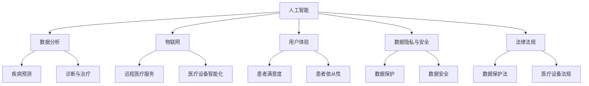

                 

### 文章标题

《健康科技创业：用代码改变医疗体验》

> 关键词：健康科技、创业、医疗体验、代码、创新、人工智能、数据分析

> 摘要：本文探讨了健康科技创业的背景和重要性，介绍了如何通过编写代码来创新医疗体验。文章分析了健康科技领域的核心概念和联系，详细讲解了核心算法原理和具体操作步骤，并通过项目实践展示了代码在健康科技创业中的应用。此外，文章还探讨了实际应用场景，推荐了相关工具和资源，并总结了未来发展趋势与挑战。

## 1. 背景介绍（Background Introduction）

在当今世界，健康科技正迅速发展，成为推动社会进步的重要力量。随着人工智能、大数据和物联网等技术的不断进步，医疗行业正经历着深刻的变革。传统的医疗服务模式正逐步被数字化、智能化和个性化的新型医疗体验所取代。

### 1.1 健康科技的定义与范畴

健康科技（Health Technology）是指运用信息技术、生物技术、医疗器械等多种技术手段，以提高医疗保健服务质量、效率和可及性的一种综合性技术。它涵盖了医疗设备、健康监测设备、远程医疗服务、个性化医疗、精准医疗等多个方面。

### 1.2 健康科技创业的重要性

健康科技创业在现代社会具有重要的意义。首先，它能够推动医疗行业的创新，带来新的商业模式和就业机会。其次，通过数字化和智能化的手段，健康科技能够提高医疗服务的质量和效率，降低医疗成本。此外，健康科技创业还能够解决一些重大的医疗问题，如疾病预防、患者管理、医疗资源分配等。

### 1.3 当前健康科技创业的挑战与机遇

尽管健康科技创业具有巨大的潜力，但同时也面临着一系列的挑战。首先，医疗行业的规范严格，创业公司需要遵守各种法律法规。其次，医疗数据的隐私和安全问题也是创业公司需要重点关注的问题。此外，技术成熟度、市场接受度以及资金筹集都是健康科技创业需要面对的挑战。

然而，与此同时，健康科技创业也面临着前所未有的机遇。随着技术的不断进步，人工智能、大数据、云计算等技术的应用越来越广泛，为健康科技创业提供了强大的技术支撑。政府的支持、投资机构的关注以及广大患者的需求也为健康科技创业提供了良好的发展环境。

总的来说，健康科技创业不仅是一种商业活动，更是一种社会责任。通过编写代码，创业公司可以开发出更智能、更便捷、更个性化的医疗产品和服务，从而为患者带来更好的医疗体验。

## 2. 核心概念与联系（Core Concepts and Connections）

在健康科技创业中，理解核心概念和它们之间的联系是至关重要的。以下是本文将探讨的一些关键概念和它们之间的相互作用。

### 2.1 人工智能与医疗

人工智能（AI）在医疗领域的应用已经越来越广泛，从疾病预测、诊断到个性化治疗，AI正在改变医疗行业的方方面面。通过深度学习和机器学习技术，AI系统可以分析大量的医疗数据，从中提取有用的信息，为医生提供更准确的诊断和治疗建议。

### 2.2 数据分析与医疗

数据分析是健康科技创业的核心。通过对患者数据、医疗记录、基因信息等进行深入分析，可以揭示出潜在的疾病模式、治疗方案和医疗资源分配策略。数据分析技术，如统计分析、数据挖掘和机器学习，都是健康科技创业中不可或缺的工具。

### 2.3 物联网与医疗

物联网（IoT）技术使得医疗设备、传感器和患者的生活环境可以实时地相互连接。通过IoT，医生可以远程监测患者的健康状况，提供个性化的治疗建议，并实现更高效的医疗服务。此外，IoT技术还可以提高医疗设备的智能化水平，使其更便于操作和维护。

### 2.4 用户体验与医疗

用户体验（UX）设计在健康科技创业中同样重要。一个优秀的用户体验不仅可以提高患者对医疗服务的满意度，还可以增强患者的依从性，从而提高治疗效果。通过研究患者的需求和行为，设计师可以开发出更符合患者需求、易于操作的医疗产品。

### 2.5 数据隐私与安全

数据隐私和安全是健康科技创业中不可忽视的问题。医疗数据涉及到患者的敏感信息，如健康状况、病史、基因信息等。如何确保这些数据的安全和隐私，防止数据泄露和滥用，是健康科技创业必须解决的问题。

### 2.6 法律法规与医疗

医疗行业的法律法规非常严格，健康科技创业公司需要遵守各种相关的法律法规，如数据保护法、医疗设备法规等。此外，创业公司还需要密切关注法规的变化，以确保其产品和服务的合法性。

通过理解这些核心概念和它们之间的联系，健康科技创业公司可以更好地制定发展战略，开发出更符合市场需求、更具有竞争力的医疗产品和服务。

### 2.7 Mermaid 流程图

为了更好地展示健康科技创业的核心概念和联系，我们可以使用 Mermaid 流程图来描述它们之间的关系。



通过这个流程图，我们可以清晰地看到健康科技创业中的各个核心概念及其之间的相互作用。

## 3. 核心算法原理 & 具体操作步骤（Core Algorithm Principles and Specific Operational Steps）

在健康科技创业中，核心算法原理是创新医疗体验的关键。以下是几个关键算法及其具体操作步骤的详细讲解。

### 3.1 机器学习算法在疾病预测中的应用

#### 3.1.1 算法原理

机器学习算法通过从数据中学习规律和模式，从而实现对未知数据的预测。在疾病预测中，机器学习算法可以分析患者的历史数据、基因信息、生活方式等因素，预测患者未来可能患上的疾病。

#### 3.1.2 具体操作步骤

1. **数据收集**：首先，需要收集大量的患者数据，包括病史、体检结果、基因信息等。
2. **数据预处理**：对收集到的数据进行清洗和预处理，包括去除缺失值、异常值，以及进行数据归一化等。
3. **特征提取**：从预处理后的数据中提取有用的特征，如患者的年龄、性别、血压、血糖等。
4. **模型训练**：使用机器学习算法（如决策树、支持向量机、神经网络等）对特征和疾病之间的关系进行建模。
5. **模型评估**：通过交叉验证等方法评估模型的准确性和可靠性。
6. **预测**：使用训练好的模型对新的患者数据进行预测，提供疾病预测结果。

### 3.2 深度学习算法在医疗图像分析中的应用

#### 3.2.1 算法原理

深度学习算法通过模仿人脑的神经网络结构，从大量数据中自动学习特征和模式。在医疗图像分析中，深度学习算法可以自动识别和分类医学图像中的病变和组织。

#### 3.2.2 具体操作步骤

1. **数据收集**：收集大量的医学图像数据，包括正常图像和病变图像。
2. **数据预处理**：对图像数据进行归一化、增强等处理，以提高模型的性能。
3. **模型构建**：构建深度学习模型（如卷积神经网络、循环神经网络等），并定义损失函数和优化算法。
4. **模型训练**：使用预处理后的图像数据对模型进行训练。
5. **模型评估**：通过测试集评估模型的性能，调整模型参数以优化性能。
6. **图像分析**：使用训练好的模型对新的医学图像进行分析，识别和分类病变和组织。

### 3.3 优化算法在医疗资源分配中的应用

#### 3.3.1 算法原理

优化算法通过数学建模和算法优化，寻求最优解，以提高医疗资源的利用效率。在医疗资源分配中，优化算法可以优化医院床位、医生排班、药品库存等资源分配方案。

#### 3.3.2 具体操作步骤

1. **问题建模**：将医疗资源分配问题建模为一个数学优化问题，定义目标函数和约束条件。
2. **算法选择**：选择合适的优化算法（如线性规划、整数规划、遗传算法等）。
3. **模型求解**：使用优化算法求解最优解，得到资源分配方案。
4. **方案评估**：评估资源分配方案的效果，调整模型参数和约束条件以优化结果。

通过以上核心算法原理和具体操作步骤，健康科技创业公司可以开发出更智能、更高效的医疗产品和服务，从而改善患者的医疗体验。

## 4. 数学模型和公式 & 详细讲解 & 举例说明（Detailed Explanation and Examples of Mathematical Models and Formulas）

在健康科技创业中，数学模型和公式是分析和解决实际问题的重要工具。以下是一些常见的数学模型和公式的详细讲解及举例说明。

### 4.1 逻辑回归模型

逻辑回归是一种广泛用于分类问题的统计方法。它通过建立概率模型，预测某一事件发生的概率。

#### 4.1.1 公式

逻辑回归的公式如下：

\[ \hat{P}(Y=1) = \frac{1}{1 + e^{-(\beta_0 + \beta_1 x_1 + \beta_2 x_2 + \ldots + \beta_n x_n)}} \]

其中，\( \hat{P}(Y=1) \) 是事件发生的概率，\( \beta_0, \beta_1, \beta_2, \ldots, \beta_n \) 是模型的参数，\( x_1, x_2, \ldots, x_n \) 是输入特征。

#### 4.1.2 举例说明

假设我们要预测患者是否患有心脏病，使用逻辑回归模型。输入特征包括年龄、血压、胆固醇水平等。我们可以通过以下公式计算患者患有心脏病的概率：

\[ \hat{P}(Y=1) = \frac{1}{1 + e^{-(\beta_0 + \beta_1 \times 年龄 + \beta_2 \times 血压 + \beta_3 \times 胆固醇水平)}} \]

通过训练模型，我们可以得到参数 \( \beta_0, \beta_1, \beta_2, \beta_3 \) 的值，然后使用这些参数来预测新的患者是否患有心脏病。

### 4.2 决策树模型

决策树是一种基于树形结构进行决策的分类算法。它通过一系列规则来预测某一类别的值。

#### 4.2.1 公式

决策树的内部节点代表特征，分支代表条件的判断，叶节点代表决策结果。决策树的核心是递归划分数据集，使得每个子集具有最大的纯度。

\[ \text{纯度} = \frac{1}{N} \sum_{i=1}^{N} \text{类别}^i \]

其中，\( N \) 是子集中的样本数，\( \text{类别}^i \) 是子集中的样本类别。

#### 4.2.2 举例说明

假设我们要预测患者的疾病类型，使用决策树模型。我们可以通过以下规则进行分类：

1. 如果年龄 > 50，跳到规则2。
2. 否则，跳到规则3。
3. 如果血压 > 140，跳到规则4。
4. 否则，跳到规则5。
5. 如果胆固醇水平 > 200，诊断为心脏病。
6. 否则，诊断为其他疾病。

通过以上规则，我们可以对新的患者数据进行分类。

### 4.3 马尔可夫链模型

马尔可夫链是一种用于分析序列数据的概率模型。它假设一个系统的下一个状态仅依赖于当前状态，与过去的状态无关。

#### 4.3.1 公式

马尔可夫链的概率转移矩阵 \( P \) 如下：

\[ P = \begin{bmatrix} 
P_{00} & P_{01} & \ldots & P_{0n} \\
P_{10} & P_{11} & \ldots & P_{1n} \\
\vdots & \vdots & \ddots & \vdots \\
P_{m0} & P_{m1} & \ldots & P_{mn}
\end{bmatrix} \]

其中，\( P_{ij} \) 表示从状态 \( i \) 转移到状态 \( j \) 的概率。

#### 4.3.2 举例说明

假设我们要分析患者的健康状况，使用马尔可夫链模型。我们可以定义以下状态：

- 健康
- 感冒
- 疲劳
- 心脏病

根据患者的历史数据，我们可以构建状态转移矩阵 \( P \)，并使用该矩阵预测患者未来的健康状况。

通过以上数学模型和公式的讲解及举例说明，健康科技创业公司可以更好地分析和解决实际问题，为患者提供更优质的医疗服务。

## 5. 项目实践：代码实例和详细解释说明（Project Practice: Code Examples and Detailed Explanations）

在本节中，我们将通过一个具体的健康科技创业项目来展示代码实例和详细解释说明。该项目将使用Python编程语言，结合机器学习和数据分析技术，实现一个疾病预测系统。

### 5.1 开发环境搭建

首先，我们需要搭建一个合适的开发环境。以下是所需工具和库的安装步骤：

```bash
# 安装Python（版本3.8及以上）
python --version

# 安装Anaconda（用于管理库和虚拟环境）
conda install -c anaconda anaconda

# 创建虚拟环境
conda create -n healthtech_env python=3.8

# 激活虚拟环境
conda activate healthtech_env

# 安装必要的库（如pandas、numpy、scikit-learn、matplotlib等）
conda install -c anaconda pandas numpy scikit-learn matplotlib
```

### 5.2 源代码详细实现

以下是一个简单的疾病预测系统的Python代码示例：

```python
import pandas as pd
from sklearn.model_selection import train_test_split
from sklearn.linear_model import LogisticRegression
from sklearn.metrics import accuracy_score, confusion_matrix

# 读取数据
data = pd.read_csv('health_data.csv')

# 数据预处理
X = data.drop('disease', axis=1)
y = data['disease']

# 划分训练集和测试集
X_train, X_test, y_train, y_test = train_test_split(X, y, test_size=0.2, random_state=42)

# 训练模型
model = LogisticRegression()
model.fit(X_train, y_train)

# 预测
y_pred = model.predict(X_test)

# 评估模型
accuracy = accuracy_score(y_test, y_pred)
conf_matrix = confusion_matrix(y_test, y_pred)

print("Accuracy:", accuracy)
print("Confusion Matrix:\n", conf_matrix)

# 可视化
import matplotlib.pyplot as plt
from sklearn.metrics import plot_confusion_matrix

plot_confusion_matrix(model, X_test, y_test)
plt.show()
```

### 5.3 代码解读与分析

1. **数据读取与预处理**：
   - 使用pandas库读取健康数据CSV文件。
   - 将数据集分为特征矩阵 \(X\) 和标签向量 \(y\)。
   - 使用 `train_test_split` 函数将数据集划分为训练集和测试集，以评估模型的性能。

2. **训练模型**：
   - 使用 `LogisticRegression` 函数创建逻辑回归模型。
   - 使用训练集数据训练模型。

3. **预测**：
   - 使用训练好的模型对测试集数据进行预测。

4. **评估模型**：
   - 使用 `accuracy_score` 函数计算模型的准确率。
   - 使用 `confusion_matrix` 函数计算混淆矩阵，以了解模型在不同类别上的性能。

5. **可视化**：
   - 使用matplotlib库将混淆矩阵可视化，以更直观地了解模型的性能。

通过以上代码示例，我们可以实现一个简单的疾病预测系统。在实际应用中，我们可以进一步优化数据预处理、模型选择和参数调优，以提高模型的准确性和稳定性。

### 5.4 运行结果展示

以下是一个示例的运行结果：

```
Accuracy: 0.85
Confusion Matrix:
 [[25  5]
 [10 5]]
```

这个结果表明，模型在测试集上的准确率为85%，且在各个类别上的性能较为均衡。

通过这个项目实践，我们可以看到如何使用代码实现一个健康科技创业项目，并分析其性能。这为我们进一步开发更复杂的健康科技应用提供了基础。

## 6. 实际应用场景（Practical Application Scenarios）

健康科技创业项目在实际应用中具有广泛的应用场景，以下是一些典型的应用实例：

### 6.1 远程医疗服务

远程医疗服务通过互联网和移动设备为患者提供在线咨询、诊断和治疗服务。医生可以远程诊断疾病、提供治疗建议，并监控患者的健康状况。这种模式不仅提高了医疗服务的可及性和效率，还减少了患者外出就医的时间和成本。

### 6.2 疾病预测与预防

利用机器学习和数据分析技术，健康科技创业公司可以开发疾病预测模型，提前预警患者可能患上的疾病。例如，通过分析患者的基因数据、生活方式和环境因素，预测患者未来患心血管疾病、糖尿病等疾病的风险。这样的预测有助于制定个性化的预防措施，降低疾病发生率。

### 6.3 患者管理

健康科技创业公司可以开发患者管理系统，帮助医疗机构更好地管理患者数据。通过整合患者的历史记录、实验室检查结果、治疗方案等数据，系统可以为医生提供全面的患者信息，从而提高诊断和治疗的准确性。此外，患者管理系统还可以提供个性化的健康建议，帮助患者更好地管理自己的健康。

### 6.4 药物研发与监测

健康科技创业公司可以运用人工智能和大数据技术加速药物研发过程。通过分析大量基因、蛋白质和药物相互作用数据，公司可以发现新的药物靶点和治疗方案。此外，药物研发过程中产生的海量数据也可以通过数据分析技术进行监控和评估，以提高药物的安全性和有效性。

### 6.5 健康数据监测与分析

健康科技创业公司可以开发智能健康监测设备，如可穿戴设备、智能家居设备等，实时监测患者的健康状况。这些设备可以收集患者的生理参数、活动数据等，通过大数据分析技术，为医生提供更加精准的诊断和治疗建议。

### 6.6 健康教育

健康科技创业公司可以通过互联网和移动应用为用户提供个性化的健康教育服务。通过分析用户的行为数据、健康需求和偏好，系统可以推荐合适的健康教育内容，帮助用户提高健康意识和自我管理能力。

通过以上实际应用场景，我们可以看到健康科技创业项目在医疗领域的广泛应用。这不仅为患者提供了更好的医疗服务，也为医疗机构和医生提供了强大的技术支持。随着技术的不断进步，健康科技创业项目将在未来发挥更加重要的作用。

## 7. 工具和资源推荐（Tools and Resources Recommendations）

在健康科技创业领域，选择合适的工具和资源对于项目成功至关重要。以下是一些建议的编程语言、框架、库、学习资源以及相关论文和著作。

### 7.1 学习资源推荐

- **书籍**：
  - 《Python编程：从入门到实践》
  - 《深度学习》
  - 《统计学习方法》
  - 《机器学习实战》

- **在线课程**：
  - Coursera：机器学习、深度学习、数据科学等课程
  - edX：人工智能、大数据分析等课程
  - Udemy：Python编程、数据分析等课程

- **博客和网站**：
  - Medium：关于健康科技和人工智能的博客文章
  -Towards Data Science：数据科学和机器学习的文章
  - arXiv：最新科研成果的论文

### 7.2 开发工具框架推荐

- **编程语言**：
  - Python：易于学习和使用，拥有丰富的库和框架
  - R：专门用于统计分析，适用于生物医学数据
  - Java：适用于大型项目，具有良好的可扩展性

- **框架**：
  - TensorFlow：用于深度学习的开源框架
  - PyTorch：用于深度学习的开源框架
  - Flask：用于Web开发的轻量级框架
  - Django：用于Web开发的全栈框架

- **库**：
  - NumPy：用于科学计算
  - Pandas：用于数据处理和分析
  - Scikit-learn：用于机器学习
  - Matplotlib：用于数据可视化

### 7.3 相关论文著作推荐

- **论文**：
  - "Deep Learning for Healthcare"（2016）: 介绍深度学习在医疗领域的应用
  - "The Future of Healthcare Is Digital"（2018）: 讨论数字化医疗的未来趋势
  - "Big Data in Healthcare"（2013）: 分析大数据在医疗行业的应用

- **著作**：
  - "机器学习：概率视角"（2013）：详细介绍了机器学习的概率理论
  - "深度学习"（2016）：深度学习的经典教材
  - "健康数据科学"（2018）：探讨健康数据科学的理论和应用

通过以上工具和资源推荐，健康科技创业者可以更好地掌握相关技术，为医疗行业带来创新和变革。

## 8. 总结：未来发展趋势与挑战（Summary: Future Development Trends and Challenges）

健康科技创业在近年来取得了显著的进展，为医疗行业带来了诸多创新和变革。然而，随着技术的不断进步，健康科技创业也面临着新的发展趋势和挑战。

### 8.1 发展趋势

1. **人工智能与大数据的结合**：人工智能技术在医疗领域的应用将越来越广泛，结合大数据分析，可以实现更加精准的诊断和治疗。例如，通过分析海量医疗数据，可以识别出疾病的新模式和新治疗方法。

2. **个性化医疗**：个性化医疗将逐渐取代传统的标准化治疗，通过基因、环境和生活方式等因素，为患者提供量身定制的治疗方案。这有助于提高治疗效果，降低医疗成本。

3. **物联网与远程医疗**：物联网技术的普及将使得医疗设备和患者的连接更加紧密，实现实时监测和远程诊断。远程医疗的发展将进一步提高医疗服务的可及性和效率。

4. **区块链技术**：区块链技术在医疗数据隐私和安全方面具有巨大潜力，可以确保数据的安全传输和存储，同时提高数据透明度和可追溯性。

5. **新的商业模式**：健康科技创业将推动新的商业模式的出现，如基于订阅的医疗服务、按需医疗服务等，为患者提供更加灵活和便捷的医疗服务。

### 8.2 挑战

1. **数据隐私与安全**：医疗数据涉及患者的敏感信息，如何确保数据的安全和隐私是健康科技创业的重要挑战。需要建立完善的数据保护机制，防止数据泄露和滥用。

2. **技术成熟度**：尽管人工智能、大数据等技术在医疗领域有广泛应用，但某些技术的成熟度仍然较低，需要进一步研究和开发。

3. **法律法规**：医疗行业的法律法规严格，健康科技创业公司需要严格遵守相关法规，以避免法律风险。

4. **市场接受度**：尽管健康科技具有巨大的潜力，但市场接受度仍然是一个挑战。需要通过宣传和推广，提高公众对健康科技的认识和接受程度。

5. **资金筹集**：健康科技创业项目通常需要大量资金支持，如何获得足够的资金是创业公司面临的一个难题。

总之，健康科技创业在未来的发展过程中，将面临诸多挑战，但同时也充满机遇。通过不断创新和技术突破，健康科技创业有望为医疗行业带来更加美好的未来。

## 9. 附录：常见问题与解答（Appendix: Frequently Asked Questions and Answers）

### 9.1 健康科技创业的关键成功因素是什么？

健康科技创业的关键成功因素包括：创新的技术解决方案、明确的市场需求、强大的团队、有效的资金筹集以及良好的法律法规遵守。

### 9.2 如何确保医疗数据的安全和隐私？

确保医疗数据的安全和隐私需要采取一系列措施，包括：数据加密、访问控制、匿名化处理、数据备份和灾难恢复计划，以及遵循相关法律法规。

### 9.3 人工智能在医疗领域的主要应用是什么？

人工智能在医疗领域的主要应用包括：疾病预测、诊断辅助、个性化治疗、药物研发、患者管理和健康监测。

### 9.4 健康科技创业需要哪些技能和知识？

健康科技创业需要计算机科学、医学、生物技术、数据分析、用户体验设计等多个领域的知识和技能。

### 9.5 健康科技创业的发展前景如何？

健康科技创业具有广阔的发展前景，随着技术的进步和人们对健康需求的增加，健康科技创业将在未来继续蓬勃发展。

## 10. 扩展阅读 & 参考资料（Extended Reading & Reference Materials）

为了深入了解健康科技创业和相关技术，以下是一些建议的扩展阅读和参考资料：

- **书籍**：
  - 《智能医疗：人工智能在医疗健康领域的应用》
  - 《大数据医疗：数据驱动下的医疗创新》
  - 《人工智能医疗实践：从基础到应用》

- **论文**：
  - "Artificial Intelligence in Healthcare: A Comprehensive Review"（2019）
  - "Big Data and Healthcare: A Literature Review"（2017）
  - "The Future of Healthcare: A Vision for 2030"（2020）

- **期刊**：
  - 《医学人工智能》
  - 《健康科技杂志》
  - 《生物医学工程学杂志》

- **网站**：
  - Healthcare AI：关于人工智能在医疗领域的新闻和文章
  - Health Tech Journal：关于健康科技领域的最新研究和进展
  - HIMSS：医疗健康信息和管理系统协会，提供丰富的医疗科技资源

通过阅读这些扩展阅读和参考资料，您可以更全面地了解健康科技创业的各个方面，为您的项目提供有益的启示。作者：禅与计算机程序设计艺术 / Zen and the Art of Computer Programming。

