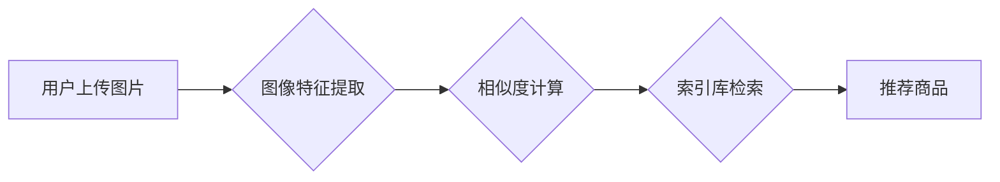

                 

##  电商平台中的图像检索技术与应用

> 关键词：图像检索、视觉搜索、深度学习、卷积神经网络、商品推荐、用户体验

## 1. 背景介绍

在当今数字经济时代，电商平台已成为人们购物的首选方式。随着移动互联网的普及和智能设备的不断发展，用户对购物体验的需求也越来越高。传统的文本搜索方式难以满足用户对商品的快速、精准、直观的检索需求。图像检索技术应运而生，它利用计算机视觉技术，识别和理解图像内容，从而实现对商品的视觉搜索。

图像检索技术在电商平台的应用具有显著的优势：

* **提升用户体验:** 用户可以通过拍摄或上传图片，快速找到与图片内容相似的商品，大大提高购物效率和便捷性。
* **丰富商品展示:**  图像检索可以帮助电商平台实现商品的多角度展示，例如通过用户上传的图片，推荐类似风格或搭配的商品，提升用户购物兴趣。
* **精准推荐:**  图像检索可以根据用户画像和浏览历史，推荐与用户兴趣相符的商品，提高推荐精准度和转化率。

## 2. 核心概念与联系

图像检索的核心是将图像转换为计算机可理解的特征向量，并通过相似度计算找到与查询图像最相似的商品图像。

**2.1 核心概念**

* **图像特征提取:**  将图像转换为数字特征向量，用于描述图像的内容和语义。
* **相似度计算:**  计算图像特征向量之间的相似度，确定图像之间的相关性。
* **索引构建:**  将商品图像及其特征向量存储在索引库中，以便快速检索。

**2.2 架构图**



## 3. 核心算法原理 & 具体操作步骤

### 3.1 算法原理概述

常用的图像检索算法包括：

* **传统特征提取算法:**  例如SIFT、SURF、ORB等，这些算法基于图像的局部特征进行描述，能够提取图像的形状、纹理等信息。
* **深度学习算法:**  例如卷积神经网络（CNN），能够自动学习图像的抽象特征，具有更高的准确性和鲁棒性。

### 3.2 算法步骤详解

以CNN算法为例，图像检索的具体步骤如下：

1. **数据预处理:**  对输入图像进行尺寸调整、归一化等预处理操作，使其符合模型输入要求。
2. **特征提取:**  利用预训练的CNN模型提取图像特征，例如VGG、ResNet、Inception等。
3. **特征向量化:**  将提取到的特征转换为稠密的特征向量，用于后续的相似度计算。
4. **相似度计算:**  使用余弦相似度、欧氏距离等度量方法计算查询图像特征向量与商品图像特征向量之间的相似度。
5. **结果排序:**  根据相似度排序，返回与查询图像最相似的商品图像。

### 3.3 算法优缺点

**传统特征提取算法:**

* **优点:**  算法简单易实现，计算效率高。
* **缺点:**  特征描述能力有限，对图像旋转、缩放、光照变化等因素敏感。

**深度学习算法:**

* **优点:**  特征描述能力强，对图像变化具有较好的鲁棒性。
* **缺点:**  模型训练复杂，计算资源需求高。

### 3.4 算法应用领域

图像检索算法广泛应用于电商平台、搜索引擎、图像识别等领域。

## 4. 数学模型和公式 & 详细讲解 & 举例说明

### 4.1 数学模型构建

图像检索的核心是将图像转换为特征向量，并通过相似度计算找到最相似的图像。

**4.1.1 特征向量表示:**

假设图像 $I$ 可以表示为一个 $N \times M$ 的像素矩阵，每个像素值 $p_{i,j}$ 代表图像在该位置的色彩信息。我们可以将图像 $I$ 转换为一个 $D$ 维的特征向量 $F_I$，其中 $D$ 是特征维度。

**4.1.2 相似度度量:**

常用的相似度度量方法包括余弦相似度、欧氏距离等。

* **余弦相似度:**  计算两个特征向量之间的夹角，夹角越小，相似度越高。

$$
\text{cosine}(F_I, F_J) = \frac{F_I \cdot F_J}{||F_I|| ||F_J||}
$$

* **欧氏距离:**  计算两个特征向量之间的距离，距离越小，相似度越高。

$$
\text{euclidean}(F_I, F_J) = \sqrt{\sum_{d=1}^{D}(F_{I,d} - F_{J,d})^2}
$$

### 4.2 公式推导过程

**4.2.1 余弦相似度推导:**

余弦相似度的计算公式可以推导如下：

1.  两个向量 $F_I$ 和 $F_J$ 的点积为：

$$
F_I \cdot F_J = \sum_{d=1}^{D} F_{I,d} F_{J,d}
$$

2.  两个向量的模长分别为：

$$
||F_I|| = \sqrt{\sum_{d=1}^{D} F_{I,d}^2}
$$

$$
||F_J|| = \sqrt{\sum_{d=1}^{D} F_{J,d}^2}
$$

3.  将点积和模长代入余弦相似度公式：

$$
\text{cosine}(F_I, F_J) = \frac{F_I \cdot F_J}{||F_I|| ||F_J||}
$$

**4.2.2 欧氏距离推导:**

欧氏距离的计算公式可以推导如下：

1.  两个向量 $F_I$ 和 $F_J$ 的差值平方和为：

$$
\sum_{d=1}^{D}(F_{I,d} - F_{J,d})^2
$$

2.  开方得到欧氏距离：

$$
\text{euclidean}(F_I, F_J) = \sqrt{\sum_{d=1}^{D}(F_{I,d} - F_{J,d})^2}
$$

### 4.3 案例分析与讲解

**4.3.1 余弦相似度案例:**

假设有两个图像特征向量 $F_I$ 和 $F_J$，它们的点积为 10，模长分别为 5 和 10。则它们的余弦相似度为：

$$
\text{cosine}(F_I, F_J) = \frac{10}{5 \times 10} = 0.2
$$

**4.3.2 欧氏距离案例:**

假设有两个图像特征向量 $F_I$ 和 $F_J$，它们的差值平方和为 100，则它们的欧氏距离为：

$$
\text{euclidean}(F_I, F_J) = \sqrt{100} = 10
$$

## 5. 项目实践：代码实例和详细解释说明

### 5.1 开发环境搭建

*   操作系统：Windows/Linux/macOS
*   编程语言：Python
*   深度学习框架：TensorFlow/PyTorch
*   图像处理库：OpenCV

### 5.2 源代码详细实现

```python
# 使用 TensorFlow 构建图像检索模型
import tensorflow as tf

# 定义 CNN 模型结构
model = tf.keras.models.Sequential([
    tf.keras.layers.Conv2D(32, (3, 3), activation='relu', input_shape=(224, 224, 3)),
    tf.keras.layers.MaxPooling2D((2, 2)),
    tf.keras.layers.Conv2D(64, (3, 3), activation='relu'),
    tf.keras.layers.MaxPooling2D((2, 2)),
    tf.keras.layers.Flatten(),
    tf.keras.layers.Dense(128, activation='relu'),
    tf.keras.layers.Dense(10, activation='softmax')
])

# 编译模型
model.compile(optimizer='adam',
              loss='categorical_crossentropy',
              metrics=['accuracy'])

# 训练模型
model.fit(train_images, train_labels, epochs=10)

# 使用模型提取特征
query_image = tf.keras.preprocessing.image.load_img('query_image.jpg', target_size=(224, 224))
query_image = tf.keras.preprocessing.image.img_to_array(query_image)
query_image = tf.expand_dims(query_image, axis=0)
query_features = model.predict(query_image)

# 计算相似度
similarity_scores = tf.reduce_sum(query_features * product_features, axis=1)
sorted_indices = tf.argsort(similarity_scores, direction='DESCENDING')

# 返回相似商品
recommended_products = product_names[sorted_indices[:5]]
```

### 5.3 代码解读与分析

*   代码首先使用 TensorFlow 构建一个 CNN 模型，用于提取图像特征。
*   模型训练完成后，使用模型提取查询图像的特征向量。
*   计算查询图像特征向量与商品图像特征向量之间的相似度。
*   根据相似度排序，返回与查询图像最相似的商品。

### 5.4 运行结果展示

运行代码后，将返回与查询图像最相似的 5 个商品名称。

## 6. 实际应用场景

### 6.1 商品搜索

用户可以通过上传图片搜索相似商品，例如搜索类似风格的衣服、鞋子等。

### 6.2 商品推荐

根据用户的浏览历史和画像，推荐与用户兴趣相符的商品，例如推荐用户可能喜欢的搭配商品。

### 6.3 个性化购物体验

根据用户的喜好和需求，提供个性化的商品推荐和购物体验。

### 6.4 未来应用展望

*   **多模态检索:**  结合文本、语音等多模态信息进行检索，提升检索的准确性和丰富度。
*   **跨平台检索:**  实现跨平台的图像检索，例如用户在手机上搜索商品，可以在电脑上查看详细商品信息。
*   **个性化推荐:**  利用用户画像和行为数据，提供更加个性化的商品推荐。

## 7. 工具和资源推荐

### 7.1 学习资源推荐

*   **书籍:**  
    *   《深度学习》
    *   《计算机视觉》
*   **在线课程:**  
    *   Coursera
    *   edX
*   **博客:**  
    *   TensorFlow Blog
    *   PyTorch Blog

### 7.2 开发工具推荐

*   **深度学习框架:**  TensorFlow, PyTorch
*   **图像处理库:**  OpenCV, Pillow
*   **数据库:**  MongoDB, Elasticsearch

### 7.3 相关论文推荐

*   **ImageNet Classification with Deep Convolutional Neural Networks**
*   **Deep Learning for Visual Understanding: A Survey**

## 8. 总结：未来发展趋势与挑战

### 8.1 研究成果总结

图像检索技术在电商平台的应用取得了显著的成果，提升了用户体验和购物效率。深度学习算法的应用使得图像检索的准确性和鲁棒性得到大幅提升。

### 8.2 未来发展趋势

*   **多模态检索:**  结合文本、语音等多模态信息进行检索，提升检索的准确性和丰富度。
*   **跨平台检索:**  实现跨平台的图像检索，例如用户在手机上搜索商品，可以在电脑上查看详细商品信息。
*   **个性化推荐:**  利用用户画像和行为数据，提供更加个性化的商品推荐。

### 8.3 面临的挑战

*   **数据标注:**  深度学习模型需要大量的标注数据进行训练，数据标注成本高昂。
*   **模型复杂度:**  深度学习模型的复杂度较高，训练和部署成本较高。
*   **隐私保护:**  图像检索技术涉及用户隐私信息，需要采取有效的隐私保护措施。

### 8.4 研究展望

未来，图像检索技术将朝着更加智能、个性化、安全的方向发展。

## 9. 附录：常见问题与解答

### 9.1 如何选择合适的图像检索算法？

选择合适的图像检索算法需要根据具体应用场景和数据特点进行选择。

*   **传统特征提取算法:**  适用于数据量较小、特征描述要求不高的场景。
*   **深度学习算法:**  适用于数据量较大、特征描述要求高的场景。

### 9.2 如何提高图像检索的准确率？

提高图像检索的准确率可以通过以下方法：

*   **使用更强大的深度学习模型:**  例如 ResNet、Inception 等。
*   **增加训练数据量:**  训练数据量越大，模型的准确率越高。
*   **使用更有效的特征提取方法:**  例如使用预训练模型提取特征。
*   **优化相似度计算方法:**  例如使用更复杂的相似度度量方法。

### 9.3 如何解决图像检索的隐私问题？

解决图像检索的隐私问题可以通过以下方法：

*   **数据脱敏:**  对图像数据进行脱敏处理，去除敏感信息。
*   **联邦学习:**  使用联邦学习技术，在不共享原始数据的情况下进行模型训练。
*   **同态加密:**  使用同态加密技术，对图像数据进行加密，保证数据安全。


作者：禅与计算机程序设计艺术 / Zen and the Art of Computer Programming<end_of_turn>

