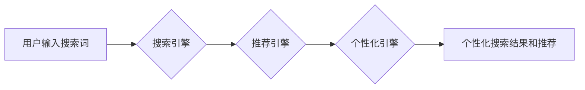

                 

## 电商平台搜索推荐系统的AI 大模型实践：提高准确率、效率与用户体验

> 关键词：电商平台、搜索推荐系统、AI 大模型、准确率、效率、用户体验、深度学习、Transformer、BERT、推荐算法、个性化推荐

## 1. 背景介绍

在当今数字经济时代，电商平台已成为人们购物的首选方式。用户每天在海量商品中寻找所需产品，高效、精准的搜索和推荐系统成为电商平台的核心竞争力。传统的搜索推荐系统主要依赖于基于规则的算法和协同过滤技术，但随着用户行为数据的爆炸式增长和商品种类日益丰富，这些传统方法面临着越来越大的挑战。

AI 大模型的出现为电商平台搜索推荐系统带来了新的机遇。AI 大模型，特别是基于 Transformer 架构的模型，能够学习用户行为、商品特征以及其他相关信息之间的复杂关系，从而实现更精准、更个性化的推荐。

## 2. 核心概念与联系

### 2.1 搜索推荐系统

电商平台搜索推荐系统旨在帮助用户快速找到所需商品，并根据用户的兴趣和偏好提供个性化的商品推荐。它通常由以下几个模块组成：

* **搜索引擎:** 处理用户搜索词，并返回与搜索词相关的商品列表。
* **推荐引擎:** 基于用户的历史行为、浏览记录、购买记录等数据，推荐与用户兴趣相关的商品。
* **个性化引擎:** 根据用户的个人特征、偏好和行为，对搜索结果和推荐结果进行个性化排序和展示。

### 2.2 AI 大模型

AI 大模型是指在海量数据上训练的深度学习模型，具有强大的学习能力和泛化能力。常见的 AI 大模型架构包括 Transformer、BERT、GPT 等。

* **Transformer:**  一种基于注意力机制的深度学习架构，能够有效处理序列数据，例如文本和时间序列数据。
* **BERT:**  一种基于 Transformer 的预训练语言模型，能够理解和生成自然语言文本。
* **GPT:**  一种基于 Transformer 的文本生成模型，能够生成流畅、连贯的文本。

### 2.3  AI 大模型在电商平台搜索推荐系统中的应用

AI 大模型可以应用于电商平台搜索推荐系统的各个模块，例如：

* **搜索结果排序:** 使用 BERT 等预训练语言模型对用户搜索词和商品标题进行语义匹配，提高搜索结果的准确率。
* **商品推荐:** 使用 Transformer 等模型学习用户行为和商品特征之间的关系，生成更精准的商品推荐。
* **个性化推荐:** 使用 AI 大模型分析用户的兴趣偏好，为用户提供个性化的商品推荐和搜索结果。

**Mermaid 流程图**



## 3. 核心算法原理 & 具体操作步骤

### 3.1  算法原理概述

在电商平台搜索推荐系统中，常用的 AI 大模型算法包括：

* **协同过滤:** 基于用户的历史行为数据，预测用户对商品的评分或购买意愿。
* **内容过滤:** 基于商品的特征信息，推荐与用户兴趣相关的商品。
* **深度学习:** 使用深度神经网络学习用户行为、商品特征以及其他相关信息之间的复杂关系，实现更精准的推荐。

### 3.2  算法步骤详解

**协同过滤算法步骤:**

1. **数据收集:** 收集用户对商品的评分或购买记录数据。
2. **用户和商品相似度计算:** 计算用户之间的相似度和商品之间的相似度。
3. **推荐生成:** 根据用户和商品的相似度，推荐用户可能感兴趣的商品。

**内容过滤算法步骤:**

1. **商品特征提取:** 从商品描述、属性等信息中提取商品特征。
2. **用户兴趣建模:** 根据用户的历史行为数据，构建用户的兴趣模型。
3. **推荐生成:** 根据商品特征和用户的兴趣模型，推荐用户可能感兴趣的商品。

**深度学习算法步骤:**

1. **数据预处理:** 对用户行为数据和商品特征数据进行预处理，例如文本处理、特征工程等。
2. **模型构建:** 使用深度神经网络模型，例如 Transformer、BERT 等，构建推荐模型。
3. **模型训练:** 使用训练数据训练推荐模型。
4. **模型评估:** 使用测试数据评估推荐模型的性能。
5. **推荐生成:** 使用训练好的推荐模型，生成对用户个性化的商品推荐。

### 3.3  算法优缺点

| 算法 | 优点 | 缺点 |
|---|---|---|
| 协同过滤 | 能够发现用户之间的隐性关系，推荐个性化商品 | 需要大量用户行为数据，容易陷入数据稀疏问题 |
| 内容过滤 | 不需要用户行为数据，能够推荐与商品特征相似的商品 | 难以捕捉用户隐性需求，推荐结果可能过于单一 |
| 深度学习 | 能够学习用户行为和商品特征之间的复杂关系，推荐结果更精准 | 需要大量数据和计算资源，模型训练复杂 |

### 3.4  算法应用领域

* **电商平台:** 商品推荐、搜索结果排序、用户画像分析等。
* **社交媒体:** 内容推荐、用户兴趣分析、广告投放等。
* **音乐平台:** 音乐推荐、用户个性化播放列表等。
* **视频平台:** 视频推荐、用户兴趣分析、内容分类等。

## 4. 数学模型和公式 & 详细讲解 & 举例说明

### 4.1  数学模型构建

在电商平台搜索推荐系统中，常用的数学模型包括：

* **协同过滤模型:** 使用矩阵分解技术，将用户-商品交互矩阵分解成用户特征矩阵和商品特征矩阵，从而预测用户对商品的评分或购买意愿。
* **内容过滤模型:** 使用机器学习算法，例如逻辑回归、支持向量机等，学习商品特征和用户兴趣之间的关系，预测用户对商品的评分或购买意愿。
* **深度学习模型:** 使用深度神经网络，例如 Transformer、BERT 等，学习用户行为、商品特征以及其他相关信息之间的复杂关系，预测用户对商品的评分或购买意愿。

### 4.2  公式推导过程

**协同过滤模型的矩阵分解公式:**

$$
R = U \cdot V^T
$$

其中：

* $R$ 是用户-商品交互矩阵。
* $U$ 是用户特征矩阵。
* $V^T$ 是商品特征矩阵的转置。

**内容过滤模型的逻辑回归公式:**

$$
P(y=1|x) = \frac{1}{1 + e^{-(w^T x + b)}}
$$

其中：

* $P(y=1|x)$ 是用户对商品点击的概率。
* $x$ 是商品特征向量。
* $w$ 是模型参数向量。
* $b$ 是模型偏置项。

### 4.3  案例分析与讲解

**案例:** 假设有一个电商平台，用户对商品的评分数据如下：

| 用户 | 商品 A | 商品 B | 商品 C |
|---|---|---|---|
| 用户 1 | 5 | 3 | 4 |
| 用户 2 | 4 | 5 | 2 |
| 用户 3 | 3 | 4 | 5 |

可以使用协同过滤模型对用户-商品交互矩阵进行分解，得到用户特征矩阵和商品特征矩阵。然后，可以使用这些特征矩阵预测用户对其他商品的评分。

**举例说明:**

假设用户 1 对商品 A 的评分为 5，可以使用用户特征矩阵和商品特征矩阵预测用户 1 对商品 B 的评分。

## 5. 项目实践：代码实例和详细解释说明

### 5.1  开发环境搭建

* **操作系统:** Linux 或 macOS
* **编程语言:** Python
* **深度学习框架:** TensorFlow 或 PyTorch
* **其他工具:** Git、Jupyter Notebook

### 5.2  源代码详细实现

```python
# 使用 TensorFlow 构建一个简单的协同过滤模型

import tensorflow as tf

# 定义用户-商品交互矩阵
ratings = tf.constant([[5, 3, 4],
                      [4, 5, 2],
                      [3, 4, 5]])

# 定义用户特征矩阵和商品特征矩阵
user_factors = tf.Variable(tf.random.normal([3, 10]))
item_factors = tf.Variable(tf.random.normal([3, 10]))

# 计算预测评分
predictions = tf.matmul(user_factors, item_factors, transpose_b=True)

# 定义损失函数
loss = tf.reduce_mean(tf.square(predictions - ratings))

# 定义优化器
optimizer = tf.keras.optimizers.Adam()

# 训练模型
for epoch in range(100):
    with tf.GradientTape() as tape:
        loss_value = loss
    gradients = tape.gradient(loss_value, [user_factors, item_factors])
    optimizer.apply_gradients(zip(gradients, [user_factors, item_factors]))

# 打印预测评分
print(predictions)
```

### 5.3  代码解读与分析

* **数据准备:** 首先，需要准备用户-商品交互数据，例如用户对商品的评分或购买记录。
* **模型构建:** 使用 TensorFlow 或 PyTorch 等深度学习框架构建协同过滤模型。
* **模型训练:** 使用训练数据训练模型，并使用损失函数和优化器来更新模型参数。
* **模型评估:** 使用测试数据评估模型的性能，例如平均绝对误差 (MAE) 或均方根误差 (RMSE)。

### 5.4  运行结果展示

运行上述代码后，会输出预测评分矩阵。

## 6. 实际应用场景

### 6.1  电商平台商品推荐

AI 大模型可以根据用户的历史购买记录、浏览记录、收藏记录等数据，推荐用户可能感兴趣的商品。例如，如果用户经常购买运动鞋，AI 大模型可以推荐用户其他类型的运动鞋、运动服饰等相关商品。

### 6.2  搜索结果排序

AI 大模型可以根据用户的搜索词和商品标题、描述等信息，对搜索结果进行排序，提高搜索结果的准确率。例如，如果用户搜索“运动鞋”，AI 大模型可以将与用户搜索词语义相似的商品排在前面。

### 6.3  个性化广告投放

AI 大模型可以分析用户的兴趣偏好和行为模式，为用户投放个性化的广告。例如，如果用户经常浏览电子产品类商品，AI 大模型可以为用户投放与电子产品相关的广告。

### 6.4  未来应用展望

AI 大模型在电商平台搜索推荐系统中的应用前景广阔，未来可能应用于以下领域：

* **更精准的推荐:** 使用更先进的 AI 大模型，例如 Transformer-XL、GPT-3 等，实现更精准的商品推荐。
* **多模态推荐:** 将文本、图像、视频等多模态数据融合到推荐系统中，提供更丰富的用户体验。
* **实时推荐:** 使用实时数据流，例如用户的实时浏览行为，进行实时商品推荐。
* **个性化营销:** 使用 AI 大模型分析用户的行为模式，为用户提供个性化的营销服务。

## 7. 工具和资源推荐

### 7.1  学习资源推荐

* **书籍:**
    * 《深度学习》 by Ian Goodfellow, Yoshua Bengio, and Aaron Courville
    * 《自然语言处理》 by Dan Jurafsky and James H. Martin
* **在线课程:**
    * Coursera: Deep Learning Specialization
    * Udacity: Deep Learning Nanodegree
* **博客和网站:**
    * TensorFlow Blog: https://blog.tensorflow.org/
    * PyTorch Blog: https://pytorch.org/blog/

### 7.2  开发工具推荐

* **深度学习框架:** TensorFlow, PyTorch
* **数据处理工具:** Pandas, NumPy
* **机器学习库:** scikit-learn
* **云计算平台:** AWS, Azure, Google Cloud

### 7.3  相关论文推荐

* BERT: Pre-training of Deep Bidirectional Transformers for Language Understanding
* Transformer: Attention Is All You Need
* Collaborative Filtering for Recommender Systems

## 8. 总结：未来发展趋势与挑战

### 8.1  研究成果总结

AI 大模型在电商平台搜索推荐系统中的应用取得了显著成果，例如：

* **提高了推荐准确率:** AI 大模型能够学习用户行为和商品特征之间的复杂关系，从而实现更精准的商品推荐。
* **提高了用户体验:** AI 大模型可以提供个性化推荐和搜索结果，提升用户购物体验。
* **提高了商业效益:** AI 大模型可以帮助电商平台提高转化率和销售额。

### 8.2  未来发展趋势

* **更强大的 AI 大模型:** 未来将出现更强大的 AI 大模型，例如多模态大模型、自监督学习大模型等，进一步提升推荐准确率和用户体验。
* **更个性化的推荐:** AI 大模型将更加深入地理解用户的需求和偏好，提供更个性化的商品推荐和服务。
* **更智能的交互:** AI 大模型将与用户进行更智能的交互，例如通过语音、图像等方式进行商品推荐。

### 8.3  面临的挑战

* **数据隐私:** AI 大模型需要大量用户数据进行训练，如何保护用户数据隐私是一个重要的挑战。
* **模型解释性:** AI 大模型的决策过程往往难以解释，如何提高模型的解释性是一个重要的研究方向。
* **模型公平性:** AI 大模型可能存在偏见，如何确保模型的公平性是一个重要的挑战。

### 8.4  研究展望

未来，AI 大模型在电商平台搜索推荐系统中的应用将继续深入发展，为用户提供更智能、更个性化的购物体验。


## 9. 附录：常见问题与解答

**Q1: 如何选择合适的 AI 大模型？**

**A1:** 选择合适的 AI 大模型需要根据具体应用场景和数据特点进行选择。例如，对于文本数据，BERT 等预训练语言模型效果较好；对于用户行为数据，协同过滤模型或深度学习模型效果较好。

**Q2: 如何解决数据稀疏问题？**

**A2:** 数据稀疏问题是协同过滤模型面临的常见挑战。可以使用以下方法解决数据稀疏问题：

* **使用矩阵分解技术:** 将用户-商品交互矩阵分解成用户特征矩阵和商品特征矩阵，从而填充缺失数据。
* **使用基于内容的过滤:** 利用商品特征信息，推荐与用户兴趣相关的商品。
* **使用混合推荐模型:** 将协同过滤模型和内容过滤模型结合使用，提高推荐效果。

**Q3: 如何评估 AI 大模型的性能？**

**A3:** 可以使用以下指标评估 AI 大模型的性能：

* **平均绝对误差 (MAE):** 计算预测评分与真实评分之间的平均绝对差。
* **均方根误差 (RMSE):** 计算预测评分与真实评分之间的平方差的平均值。
* **点击率 (CTR):** 计算用户点击推荐商品的比例。
* **转化率 (CVR):** 计算用户点击推荐商品后购买商品的比例。


作者：禅与计算机程序设计艺术 / Zen and the Art of Computer Programming<end_of_turn>

