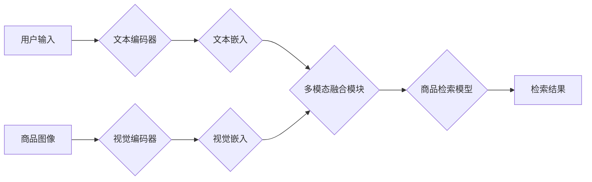

                 

## 电商搜索中的多模态商品检索深度学习模型

> 关键词：多模态检索、深度学习、电商搜索、商品图像、商品文本、BERT、视觉特征提取、融合策略

## 1. 背景介绍

随着电商行业的蓬勃发展，商品检索已成为电商平台的核心功能之一。传统的基于文本关键词的商品检索方式存在着诸多局限性，例如：

* **语义理解不足**:  单纯依靠关键词匹配难以准确理解用户搜索意图，容易出现信息不匹配的情况。
* **用户搜索行为多样化**: 用户使用多种方式进行商品搜索，包括文本关键词、图像、语音等，单一文本检索模式难以满足多样化需求。
* **商品信息丰富**:  商品信息包含文本描述、图像、价格、评价等多方面，难以充分利用这些信息进行精准检索。

为了解决上述问题，近年来，多模态商品检索技术逐渐受到关注。多模态商品检索是指利用商品的文本信息和图像信息等多种模态数据进行商品检索的技术。

## 2. 核心概念与联系

多模态商品检索的核心是将不同模态的数据融合起来，构建一个能够理解用户搜索意图的综合模型。

**2.1 核心概念**

* **多模态数据**: 指包含文本、图像、音频、视频等多种类型数据的集合。
* **模态嵌入**: 将不同模态的数据映射到同一个低维空间，使得不同模态的数据能够进行比较和融合。
* **跨模态关联**:  学习不同模态数据之间的关系，例如图像和文本之间的语义关联。
* **多模态融合**: 将不同模态的数据融合起来，构建一个综合的商品表示。

**2.2 架构图**



## 3. 核心算法原理 & 具体操作步骤

### 3.1 算法原理概述

多模态商品检索算法通常基于深度学习模型，利用神经网络学习不同模态数据之间的关系，并进行融合。常见的算法包括：

* **基于匹配的模型**:  例如，利用 Siamese 网络学习图像和文本之间的相似度，进行检索。
* **基于排序的模型**:  例如，利用 RankNet 学习图像和文本的排序关系，进行检索。
* **基于生成对抗网络的模型**:  例如，利用 GAN 生成新的商品图像，并进行检索。

### 3.2 算法步骤详解

以基于匹配的模型为例，其具体操作步骤如下：

1. **数据预处理**:  对商品图像和文本进行预处理，例如图像裁剪、文本分词等。
2. **特征提取**:  利用预训练的深度学习模型提取图像和文本的特征，例如 ResNet 和 BERT。
3. **模态嵌入**:  将提取的特征映射到同一个低维空间，例如使用线性变换或非线性变换。
4. **相似度计算**:  计算图像和文本的嵌入向量之间的相似度，例如使用余弦相似度或欧氏距离。
5. **检索结果排序**:  根据相似度排序检索结果，并返回用户查询结果。

### 3.3 算法优缺点

**优点**:

* 能够更好地理解用户搜索意图，提高检索精度。
* 能够利用商品的多方面信息进行检索，提供更丰富的检索结果。

**缺点**:

* 训练数据量大，需要大量的标注数据。
* 计算复杂度高，需要强大的计算资源。

### 3.4 算法应用领域

多模态商品检索技术广泛应用于电商搜索、图像识别、视频理解等领域。

## 4. 数学模型和公式 & 详细讲解 & 举例说明

### 4.1 数学模型构建

假设我们有图像特征向量 $v_i$ 和文本特征向量 $w_j$，我们需要计算它们之间的相似度。可以使用以下公式：

$$
s(v_i, w_j) = \frac{v_i \cdot w_j}{||v_i|| ||w_j||}
$$

其中，$s(v_i, w_j)$ 表示图像 $v_i$ 和文本 $w_j$ 之间的相似度，$\cdot$ 表示点积运算，$||v_i||$ 和 $||w_j||$ 分别表示图像 $v_i$ 和文本 $w_j$ 的欧几里得范数。

### 4.2 公式推导过程

该公式的推导过程基于向量空间的几何意义。

* 点积运算：点积运算可以衡量两个向量的夹角大小。夹角越小，点积越大，表示两个向量方向越相似。
* 欧几里得范数：欧几里得范数可以衡量向量的长度。

通过将点积运算除以两个向量的欧几里得范数，可以得到一个归一化的相似度值，范围在 -1 到 1 之间。

### 4.3 案例分析与讲解

假设我们有一张商品图像的特征向量 $v_i = [0.2, 0.5, 0.8]$ 和一个商品文本的特征向量 $w_j = [0.3, 0.6, 0.9]$。

使用上述公式计算它们的相似度：

$$
s(v_i, w_j) = \frac{[0.2, 0.5, 0.8] \cdot [0.3, 0.6, 0.9]}{|| [0.2, 0.5, 0.8] || || [0.3, 0.6, 0.9] ||}
$$

$$
s(v_i, w_j) = \frac{0.06 + 0.3 + 0.72}{\sqrt{0.04 + 0.25 + 0.64} \sqrt{0.09 + 0.36 + 0.81}}
$$

$$
s(v_i, w_j) = \frac{1.08}{\sqrt{0.93} \sqrt{1.26}}
$$

$$
s(v_i, w_j) \approx 0.92
$$

该结果表明图像 $v_i$ 和文本 $w_j$ 之间具有较高的相似度。

## 5. 项目实践：代码实例和详细解释说明

### 5.1 开发环境搭建

* Python 3.6+
* TensorFlow 2.0+
* PyTorch 1.0+
* CUDA 10.0+

### 5.2 源代码详细实现

```python
# 导入必要的库
import tensorflow as tf
from tensorflow.keras.layers import Input, Embedding, Dense, Flatten
from tensorflow.keras.models import Model

# 定义文本编码器
def text_encoder(vocab_size, embedding_dim):
    input_text = Input(shape=(max_length,))
    embedding = Embedding(vocab_size, embedding_dim)(input_text)
    encoded_text = Flatten()(embedding)
    return Model(inputs=input_text, outputs=encoded_text)

# 定义图像编码器
def image_encoder(image_shape, embedding_dim):
    input_image = Input(shape=image_shape)
    # 使用预训练的图像编码器，例如 ResNet
    encoded_image = # ...
    return Model(inputs=input_image, outputs=encoded_image)

# 定义多模态融合模块
def multimodal_fusion(text_embedding, image_embedding):
    # 使用 concat 或 add 等方式融合文本和图像特征
    fused_features = tf.concat([text_embedding, image_embedding], axis=-1)
    return fused_features

# 定义商品检索模型
def retrieval_model(embedding_dim):
    input_features = Input(shape=(embedding_dim,))
    dense = Dense(128, activation='relu')(input_features)
    output = Dense(1, activation='sigmoid')(dense)
    return Model(inputs=input_features, outputs=output)

# 训练模型
# ...

```

### 5.3 代码解读与分析

* 代码首先定义了文本编码器、图像编码器和多模态融合模块。
* 文本编码器使用 Embedding 层将文本单词映射到低维向量空间。
* 图像编码器使用预训练的图像编码器提取图像特征。
* 多模态融合模块将文本和图像特征进行融合，例如使用 concat 或 add 操作。
* 商品检索模型使用 Dense 层进行多层非线性变换，最终输出一个相似度值。

### 5.4 运行结果展示

训练完成后，可以使用模型对新的商品图像和文本进行检索，并获得相似度值。

## 6. 实际应用场景

多模态商品检索技术在电商平台的实际应用场景非常广泛，例如：

* **商品搜索**:  用户可以通过图像或文本关键词搜索商品，系统会根据用户的搜索意图返回最相关的商品结果。
* **商品推荐**:  根据用户的浏览历史、购买记录等信息，系统可以推荐与用户兴趣相关的商品。
* **视觉问答**:  用户可以通过上传商品图像提问，系统可以根据图像内容回答用户的问题。

### 6.4 未来应用展望

未来，多模态商品检索技术将朝着以下方向发展：

* **更精准的检索**:  利用更先进的深度学习模型和算法，提高检索的准确率和召回率。
* **更丰富的检索结果**:  除了文本和图像，还可以利用商品的音频、视频等多模态数据进行检索，提供更丰富的检索结果。
* **个性化检索**:  根据用户的个人喜好和需求，提供个性化的商品检索服务。

## 7. 工具和资源推荐

### 7.1 学习资源推荐

* **书籍**:
    * Deep Learning by Ian Goodfellow
    * Computer Vision: Algorithms and Applications by Richard Szeliski
* **在线课程**:
    * Stanford CS231n: Convolutional Neural Networks for Visual Recognition
    * Deep Learning Specialization by Andrew Ng

### 7.2 开发工具推荐

* **TensorFlow**:  开源深度学习框架，支持多种硬件平台。
* **PyTorch**:  开源深度学习框架，以其灵活性和易用性而闻名。
* **Keras**:  高层深度学习 API，可以方便地构建和训练深度学习模型。

### 7.3 相关论文推荐

* **Show, Attend and Tell: Neural Image Captioning with Visual Attention**
* **Deep Visual-Semantic Alignments for Generating Image Descriptions**
* **Multimodal Deep Learning for Visual Question Answering**

## 8. 总结：未来发展趋势与挑战

### 8.1 研究成果总结

多模态商品检索技术取得了显著的进展，能够有效地理解用户搜索意图，提高检索精度。

### 8.2 未来发展趋势

未来，多模态商品检索技术将朝着更精准、更丰富、更个性化的方向发展。

### 8.3 面临的挑战

* **数据标注**:  多模态数据标注成本高，需要大量的标注数据才能训练出高质量的模型。
* **模型复杂度**:  多模态检索模型通常比较复杂，需要强大的计算资源才能训练和部署。
* **跨模态关联**:  学习不同模态数据之间的语义关联仍然是一个挑战。

### 8.4 研究展望

未来研究方向包括：

* 开发更有效的跨模态关联学习方法。
* 研究更轻量级的多模态检索模型，降低计算成本。
* 利用迁移学习和自监督学习等技术，减少数据标注成本。

## 9. 附录：常见问题与解答

* **Q: 多模态商品检索技术与传统的文本检索技术相比有什么优势？**

* **A:** 多模态商品检索技术能够利用商品的多方面信息进行检索，例如图像、文本、价格等，能够更好地理解用户搜索意图，提高检索精度。

* **Q: 多模态商品检索技术有哪些应用场景？**

* **A:** 多模态商品检索技术广泛应用于电商平台的商品搜索、商品推荐、视觉问答等场景。

* **Q: 如何搭建多模态商品检索系统的开发环境？**

* **A:** 需要安装 Python 3.6+、TensorFlow 2.0+、PyTorch 1.0+ 和 CUDA 10.0+ 等软件。

* **Q: 多模态商品检索技术有哪些未来的发展趋势？**

* **A:** 未来，多模态商品检索技术将朝着更精准、更丰富、更个性化的方向发展。


作者：禅与计算机程序设计艺术 / Zen and the Art of Computer Programming 
<end_of_turn>

