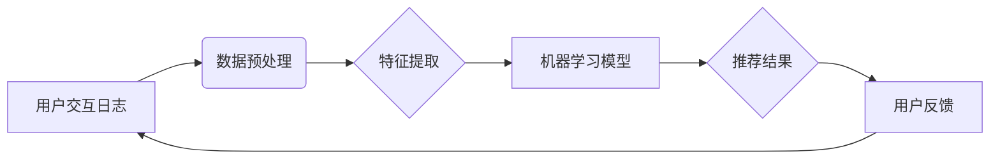

                 

## 电商搜索的用户交互日志分析与挖掘

> 关键词：电商搜索、用户交互日志、数据挖掘、推荐系统、个性化搜索、用户行为分析、机器学习

## 1. 背景介绍

在当今数据爆炸的时代，电商平台的用户交互日志已成为宝贵的资源，蕴含着丰富的用户行为信息。这些日志记录了用户在搜索、浏览、购买等环节的每一次操作，为电商平台提供了洞察用户需求、优化搜索体验、提升转化率的重要数据支撑。

电商搜索的用户交互日志分析与挖掘，旨在从海量用户行为数据中提取有价值的知识和模式，从而实现以下目标：

* **理解用户搜索行为：** 分析用户搜索词、点击行为、转化率等信息，了解用户搜索的意图、偏好和需求。
* **提升搜索结果质量：** 基于用户行为数据，对搜索算法进行优化，提高搜索结果的准确性和相关性，提升用户搜索体验。
* **个性化推荐：** 根据用户的搜索历史、浏览记录和购买行为，为用户提供个性化的商品推荐，提升用户粘性和转化率。
* **精准营销：** 通过分析用户行为数据，识别潜在客户群体，进行精准的营销推广，提高营销效率。

## 2. 核心概念与联系

电商搜索的用户交互日志分析与挖掘涉及多个核心概念，包括：

* **用户交互日志：** 记录用户在电商平台上进行的所有操作，例如搜索、浏览、添加购物车、购买等。
* **数据挖掘：** 从大规模数据中发现隐藏的模式、规律和知识。
* **机器学习：** 利用算法训练模型，从数据中学习，并进行预测或分类。
* **推荐系统：** 根据用户的历史行为和偏好，推荐相关的商品或服务。

这些概念相互关联，共同构成了电商搜索的用户交互日志分析与挖掘的整体框架。

**核心概念架构图**



## 3. 核心算法原理 & 具体操作步骤

### 3.1  算法原理概述

电商搜索的用户交互日志分析与挖掘通常采用以下几种核心算法：

* **协同过滤：** 基于用户的相似性或商品的相似性，推荐用户可能感兴趣的商品。
* **基于内容的推荐：** 根据商品的属性和描述，推荐与用户兴趣相符的商品。
* **混合推荐：** 结合协同过滤和基于内容的推荐，提高推荐效果。
* **深度学习：** 利用深度神经网络，从用户交互日志中学习更复杂的模式和特征，进行更精准的推荐。

### 3.2  算法步骤详解

以协同过滤算法为例，其具体操作步骤如下：

1. **数据收集：** 收集用户交互日志，包括用户ID、商品ID、评分、浏览记录等信息。
2. **数据预处理：** 清洗数据，处理缺失值，转换数据格式。
3. **用户相似度计算：** 计算用户之间的相似度，常用的方法包括余弦相似度、皮尔逊相关系数等。
4. **商品推荐：** 根据用户相似度，推荐与相似用户喜欢的商品。

### 3.3  算法优缺点

**协同过滤算法**

* **优点：** 可以发现用户隐性偏好，推荐个性化商品。
* **缺点：** 数据稀疏性问题，新用户新商品推荐效果差。

**基于内容的推荐算法**

* **优点：** 不需要用户历史数据，可以推荐新商品。
* **缺点：** 难以捕捉用户隐性偏好，推荐结果可能过于单一。

### 3.4  算法应用领域

电商搜索的用户交互日志分析与挖掘算法广泛应用于以下领域：

* **商品推荐：** 为用户推荐相关的商品，提升用户购物体验。
* **搜索结果优化：** 根据用户搜索行为，优化搜索结果排序，提高搜索结果的准确性和相关性。
* **个性化营销：** 根据用户行为数据，进行精准的营销推广，提高营销效率。
* **用户画像分析：** 分析用户行为数据，构建用户画像，了解用户需求和偏好。

## 4. 数学模型和公式 & 详细讲解 & 举例说明

### 4.1  数学模型构建

协同过滤算法的核心是计算用户之间的相似度。常用的相似度度量方法包括余弦相似度和皮尔逊相关系数。

**余弦相似度**

$$
\text{cosine similarity}(u,v) = \frac{u \cdot v}{||u|| ||v||}
$$

其中：

* $u$ 和 $v$ 是两个用户的向量表示。
* $u \cdot v$ 是 $u$ 和 $v$ 的点积。
* $||u||$ 和 $||v||$ 是 $u$ 和 $v$ 的模长。

**皮尔逊相关系数**

$$
\text{pearson correlation}(u,v) = \frac{\sum_{i=1}^{n}(u_i - \bar{u})(v_i - \bar{v})}{\sqrt{\sum_{i=1}^{n}(u_i - \bar{u})^2} \sqrt{\sum_{i=1}^{n}(v_i - \bar{v})^2}}
$$

其中：

* $u$ 和 $v$ 是两个用户的评分向量。
* $u_i$ 和 $v_i$ 是用户 $u$ 和 $v$ 对第 $i$ 个商品的评分。
* $\bar{u}$ 和 $\bar{v}$ 是用户 $u$ 和 $v$ 的平均评分。

### 4.2  公式推导过程

余弦相似度的推导过程如下：

1. 假设两个用户 $u$ 和 $v$ 的向量表示分别为 $u = (u_1, u_2, ..., u_m)$ 和 $v = (v_1, v_2, ..., v_m)$，其中 $m$ 是商品数量。
2. 用户 $u$ 和 $v$ 的点积为 $u \cdot v = u_1v_1 + u_2v_2 + ... + u_mv_m$。
3. 用户 $u$ 和 $v$ 的模长分别为 $||u|| = \sqrt{u_1^2 + u_2^2 + ... + u_m^2}$ 和 $||v|| = \sqrt{v_1^2 + v_2^2 + ... + v_m^2}$。
4. 因此，余弦相似度为：

$$
\text{cosine similarity}(u,v) = \frac{u \cdot v}{||u|| ||v||}
$$

### 4.3  案例分析与讲解

假设有两个用户 $u$ 和 $v$，他们的评分向量分别为：

* $u = (5, 4, 3, 2, 1)$
* $v = (4, 3, 2, 1, 5)$

计算他们的余弦相似度：

1. $u \cdot v = 5 \cdot 4 + 4 \cdot 3 + 3 \cdot 2 + 2 \cdot 1 + 1 \cdot 5 = 20 + 12 + 6 + 2 + 5 = 45$
2. $||u|| = \sqrt{5^2 + 4^2 + 3^2 + 2^2 + 1^2} = \sqrt{55}$
3. $||v|| = \sqrt{4^2 + 3^2 + 2^2 + 1^2 + 5^2} = \sqrt{55}$
4. $\text{cosine similarity}(u,v) = \frac{45}{\sqrt{55} \cdot \sqrt{55}} = \frac{45}{55} = 0.82$

因此，用户 $u$ 和 $v$ 的余弦相似度为 0.82，说明他们具有较高的相似度。

## 5. 项目实践：代码实例和详细解释说明

### 5.1  开发环境搭建

* **编程语言：** Python
* **数据处理库：** Pandas
* **机器学习库：** Scikit-learn
* **可视化库：** Matplotlib

### 5.2  源代码详细实现

```python
import pandas as pd
from sklearn.metrics.pairwise import cosine_similarity

# 加载用户交互日志数据
data = pd.read_csv('user_interaction_log.csv')

# 构建用户评分矩阵
user_item_matrix = data.pivot_table(index='user_id', columns='item_id', values='rating')

# 计算用户之间的余弦相似度
user_similarity = cosine_similarity(user_item_matrix)

# 获取用户相似度矩阵
print(user_similarity)
```

### 5.3  代码解读与分析

* **数据加载：** 使用 Pandas 库读取用户交互日志数据，并将其存储在 DataFrame 中。
* **评分矩阵构建：** 使用 `pivot_table` 方法构建用户评分矩阵，其中行表示用户ID，列表示商品ID，单元格值表示用户对商品的评分。
* **余弦相似度计算：** 使用 Scikit-learn 库的 `cosine_similarity` 函数计算用户之间的余弦相似度，并将其存储在 `user_similarity` 矩阵中。
* **输出结果：** 打印用户相似度矩阵，其中每个元素表示两个用户之间的相似度。

### 5.4  运行结果展示

运行上述代码后，将输出一个用户相似度矩阵，其中每个元素表示两个用户之间的相似度。

## 6. 实际应用场景

电商搜索的用户交互日志分析与挖掘在实际应用场景中具有广泛的应用价值：

* **个性化商品推荐：** 根据用户的搜索历史、浏览记录和购买行为，推荐与用户兴趣相符的商品，提升用户购物体验和转化率。
* **搜索结果优化：** 分析用户搜索行为，了解用户搜索的意图和偏好，优化搜索算法，提高搜索结果的准确性和相关性。
* **精准营销：** 通过分析用户行为数据，识别潜在客户群体，进行精准的营销推广，提高营销效率。
* **用户画像分析：** 分析用户行为数据，构建用户画像，了解用户需求和偏好，为产品开发和市场营销提供数据支撑。

### 6.4  未来应用展望

随着电商平台的不断发展，用户交互日志的规模和复杂度将不断增加。未来，电商搜索的用户交互日志分析与挖掘将朝着以下方向发展：

* **更精准的推荐：** 利用深度学习等先进算法，从用户交互日志中学习更复杂的模式和特征，进行更精准的商品推荐。
* **更个性化的体验：** 基于用户的实时行为和上下文信息，提供更个性化的搜索结果和推荐，提升用户体验。
* **更智能的营销：** 利用用户行为数据，进行更智能的营销策略制定和执行，提高营销效果。

## 7. 工具和资源推荐

### 7.1  学习资源推荐

* **书籍：**
    * 《数据挖掘：概念与技术》
    * 《机器学习》
    * 《推荐系统》
* **在线课程：**
    * Coursera 上的《数据挖掘》课程
    * edX 上的《机器学习》课程
    * Udemy 上的《推荐系统》课程

### 7.2  开发工具推荐

* **Python：** 广泛应用于数据分析和机器学习领域，拥有丰富的库和工具。
* **Pandas：** 用于数据处理和分析，提供高效的数据结构和操作方法。
* **Scikit-learn：** 机器学习库，提供各种算法和工具，用于分类、回归、聚类等任务。
* **TensorFlow：** 深度学习框架，用于构建和训练深度神经网络。

### 7.3  相关论文推荐

* **协同过滤算法：**
    * "Collaborative Filtering: A User-Based Approach"
    * "Item-Based Collaborative Filtering Recommendation Algorithms"
* **深度学习推荐系统：**
    * "Deep Learning for Recommender Systems"
    * "Neural Collaborative Filtering"

## 8. 总结：未来发展趋势与挑战

### 8.1  研究成果总结

电商搜索的用户交互日志分析与挖掘取得了显著的成果，为电商平台提供了有效的工具和方法，提升了用户体验和商业效益。

### 8.2  未来发展趋势

未来，电商搜索的用户交互日志分析与挖掘将朝着以下方向发展：

* **更精准的推荐：** 利用深度学习等先进算法，从用户交互日志中学习更复杂的模式和特征，进行更精准的商品推荐。
* **更个性化的体验：** 基于用户的实时行为和上下文信息，提供更个性化的搜索结果和推荐，提升用户体验。
* **更智能的营销：** 利用用户行为数据，进行更智能的营销策略制定和执行，提高营销效果。

### 8.3  面临的挑战

电商搜索的用户交互日志分析与挖掘也面临着一些挑战：

* **数据稀疏性：** 用户交互日志数据往往是稀疏的，难以训练有效的模型。
* **数据质量：** 用户交互日志数据可能存在噪声和错误，需要进行清洗和预处理。
* **隐私保护：** 用户交互日志数据包含用户的隐私信息，需要进行安全保护。

### 8.4  研究展望

未来，需要进一步研究解决数据稀疏性、数据质量和隐私保护等问题，开发更有效的算法和方法，提升电商搜索的用户交互日志分析与挖掘的水平。

## 9. 附录：常见问题与解答

**Q1：协同过滤算法的优点和缺点是什么？**

**A1：** 协同过滤算法的优点是能够发现用户隐性偏好，推荐个性化商品。缺点是数据稀疏性问题，新用户新商品推荐效果差。

**Q2：如何处理用户交互日志数据中的缺失值？**

**A2：** 可以使用多种方法处理缺失值，例如平均值填充、最近邻插值等。

**Q3：如何保护用户隐私信息？**

**A3：** 可以采用数据匿名化、差分隐私等技术保护用户隐私信息。


作者：禅与计算机程序设计艺术 / Zen and the Art of Computer Programming<end_of_turn>

