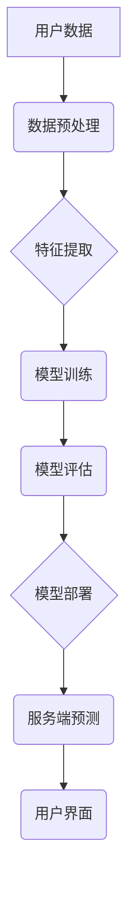

                 

## 电商行业中AI大模型的落地应用案例分析

> 关键词：电商、AI大模型、自然语言处理、推荐系统、个性化营销、图像识别、数据分析、机器学习

## 1. 背景介绍

近年来，人工智能（AI）技术飞速发展，特别是大模型的涌现，为各行各业带来了革命性的变革。电商行业作为信息化和数字化程度极高的行业，更是AI技术的应用沃土。AI大模型凭借其强大的学习能力和泛化能力，在电商领域展现出巨大的潜力，为提升用户体验、优化运营效率、挖掘商业价值提供了新的思路和方法。

传统的电商平台主要依靠规则引擎和人工干预来完成商品推荐、用户画像、客服服务等任务。然而，随着用户需求的多样化和数据量的激增，传统的模式已难以满足电商平台的快速发展需求。AI大模型的出现，为电商行业带来了新的机遇。

## 2. 核心概念与联系

**2.1  AI大模型概述**

AI大模型是指在海量数据上训练的深度学习模型，其参数规模庞大，具备强大的泛化能力和学习能力。常见的AI大模型类型包括：

* **自然语言处理（NLP）模型：**例如BERT、GPT-3等，能够理解和生成人类语言，应用于商品搜索、智能客服、内容创作等领域。
* **计算机视觉（CV）模型：**例如YOLO、ResNet等，能够识别和理解图像信息，应用于商品分类、图像搜索、视觉推荐等领域。
* **推荐系统模型：**例如Collaborative Filtering、Content-Based Filtering等，能够根据用户行为和商品特征，推荐用户感兴趣的商品。

**2.2  电商行业与AI大模型的结合**

AI大模型在电商行业中的应用场景广泛，主要包括：

* **个性化推荐：**根据用户的历史购买记录、浏览行为、兴趣偏好等信息，推荐个性化的商品，提升用户体验和转化率。
* **智能客服：**利用NLP模型构建智能客服系统，自动回复用户咨询，解决常见问题，提升客服效率。
* **商品搜索优化：**利用NLP模型理解用户搜索意图，提高搜索结果的准确性和相关性。
* **内容创作：**利用NLP模型生成商品描述、促销文案等内容，提升内容质量和效率。
* **欺诈检测：**利用机器学习模型识别异常交易行为，防止欺诈行为的发生。

**2.3  AI大模型架构**



## 3. 核心算法原理 & 具体操作步骤

**3.1  算法原理概述**

电商行业中常用的AI大模型算法主要包括：

* **深度神经网络（DNN）：**通过多层神经网络结构，学习数据中的复杂特征，应用于图像识别、自然语言处理等领域。
* **卷积神经网络（CNN）：**专门用于处理图像数据的深度神经网络，能够提取图像中的局部特征，应用于商品分类、图像搜索等领域。
* **循环神经网络（RNN）：**专门用于处理序列数据的深度神经网络，能够捕捉序列中的时间依赖关系，应用于文本生成、机器翻译等领域。
* **Transformer：**一种新型的深度神经网络架构，能够有效处理长序列数据，应用于机器翻译、文本摘要等领域。

**3.2  算法步骤详解**

1. **数据收集和预处理：**收集电商平台的海量数据，包括用户行为数据、商品信息数据、文本数据等，并进行清洗、格式化、编码等预处理操作。
2. **特征提取：**从原始数据中提取有用的特征，例如用户画像特征、商品属性特征、文本语义特征等。
3. **模型训练：**选择合适的AI大模型算法，并利用训练数据训练模型参数。
4. **模型评估：**使用测试数据评估模型的性能，例如准确率、召回率、F1-score等指标。
5. **模型部署：**将训练好的模型部署到电商平台的服务器上，以便进行实际应用。

**3.3  算法优缺点**

| 算法 | 优点 | 缺点 |
|---|---|---|
| DNN | 学习能力强，能够处理复杂数据 | 训练时间长，参数量大 |
| CNN | 特征提取能力强，适用于图像数据 | 难以处理长序列数据 |
| RNN | 能够捕捉序列中的时间依赖关系 | 训练难度大，梯度消失问题 |
| Transformer | 能够有效处理长序列数据，性能优异 | 参数量大，计算资源需求高 |

**3.4  算法应用领域**

* **商品推荐：**基于用户行为和商品特征，推荐个性化的商品。
* **智能客服：**自动回复用户咨询，解决常见问题。
* **商品搜索优化：**理解用户搜索意图，提高搜索结果的准确性和相关性。
* **内容创作：**生成商品描述、促销文案等内容。
* **欺诈检测：**识别异常交易行为，防止欺诈行为的发生。

## 4. 数学模型和公式 & 详细讲解 & 举例说明

**4.1  数学模型构建**

在电商推荐系统中，常用的数学模型包括协同过滤模型和内容过滤模型。

* **协同过滤模型：**基于用户的历史行为数据，预测用户对商品的评分或购买意愿。例如，基于用户的评分矩阵，使用矩阵分解算法进行模型训练，预测用户对未评分的商品的评分。

* **内容过滤模型：**基于商品的属性特征和用户的兴趣偏好，推荐用户可能感兴趣的商品。例如，使用TF-IDF算法计算商品和用户的语义相似度，推荐相似度高的商品。

**4.2  公式推导过程**

协同过滤模型的矩阵分解算法可以表示为：

$$
R = U V^T
$$

其中：

* $R$ 是用户-商品评分矩阵。
* $U$ 是用户特征矩阵。
* $V$ 是商品特征矩阵。

目标是学习用户特征矩阵 $U$ 和商品特征矩阵 $V$，使得预测评分与实际评分之间的误差最小化。可以使用梯度下降算法进行模型训练。

**4.3  案例分析与讲解**

假设有一个电商平台，用户购买了以下商品：

| 用户 | 商品 A | 商品 B | 商品 C |
|---|---|---|---|
| 用户 1 | 5 | 4 | 3 |
| 用户 2 | 3 | 5 | 4 |
| 用户 3 | 4 | 3 | 5 |

可以使用协同过滤模型进行商品推荐。首先，构建用户-商品评分矩阵 $R$。然后，使用矩阵分解算法学习用户特征矩阵 $U$ 和商品特征矩阵 $V$。最后，根据用户特征和商品特征，预测用户对未购买的商品的评分，并推荐评分较高的商品。

## 5. 项目实践：代码实例和详细解释说明

**5.1  开发环境搭建**

* Python 3.x
* TensorFlow 或 PyTorch 深度学习框架
* Jupyter Notebook 或 VS Code 开发环境

**5.2  源代码详细实现**

```python
import tensorflow as tf

# 定义用户-商品评分矩阵
ratings = tf.constant([[5, 4, 3],
                      [3, 5, 4],
                      [4, 3, 5]])

# 定义用户特征矩阵和商品特征矩阵
user_features = tf.Variable(tf.random.normal([3, 10]))
item_features = tf.Variable(tf.random.normal([3, 10]))

# 定义预测评分函数
def predict_rating(user_id, item_id):
  user_vector = user_features[user_id]
  item_vector = item_features[item_id]
  return tf.reduce_sum(user_vector * item_vector)

# 定义损失函数
def loss_function(predictions, actual_ratings):
  return tf.reduce_mean(tf.square(predictions - actual_ratings))

# 定义优化器
optimizer = tf.keras.optimizers.Adam()

# 训练模型
for epoch in range(100):
  with tf.GradientTape() as tape:
    predictions = predict_rating(tf.range(3), tf.range(3))
    loss = loss_function(predictions, ratings)
  gradients = tape.gradient(loss, [user_features, item_features])
  optimizer.apply_gradients(zip(gradients, [user_features, item_features]))

# 预测用户对商品的评分
predicted_rating = predict_rating(0, 2)
print(f"Predicted rating for user 0 and item 2: {predicted_rating}")
```

**5.3  代码解读与分析**

* 代码首先定义了用户-商品评分矩阵、用户特征矩阵和商品特征矩阵。
* 然后定义了预测评分函数、损失函数和优化器。
* 训练模型的过程是通过迭代更新用户特征和商品特征，使得预测评分与实际评分之间的误差最小化。
* 最后，使用训练好的模型预测用户对商品的评分。

**5.4  运行结果展示**

运行代码后，会输出用户对商品的预测评分。

## 6. 实际应用场景

**6.1  个性化推荐**

AI大模型可以根据用户的历史购买记录、浏览行为、兴趣偏好等信息，推荐个性化的商品，提升用户体验和转化率。例如，电商平台可以利用协同过滤模型或内容过滤模型，推荐用户可能感兴趣的商品。

**6.2  智能客服**

AI大模型可以构建智能客服系统，自动回复用户咨询，解决常见问题，提升客服效率。例如，电商平台可以利用NLP模型训练一个智能客服机器人，自动回复用户关于商品价格、配送时间、退换货政策等常见问题的咨询。

**6.3  商品搜索优化**

AI大模型可以理解用户搜索意图，提高搜索结果的准确性和相关性。例如，电商平台可以利用BERT模型训练一个商品搜索引擎，能够理解用户模糊的搜索词，并返回更相关的商品结果。

**6.4  未来应用展望**

* **更精准的个性化推荐：**利用多模态数据，例如用户画像、商品图像、文本描述等，构建更精准的个性化推荐模型。
* **更智能的客服服务：**利用大规模语言模型，构建更智能的客服机器人，能够理解更复杂的用户的语言表达，并提供更个性化的服务。
* **更丰富的用户体验：**利用AI大模型，构建更丰富的用户体验，例如个性化商品展示、虚拟试衣间、智能购物助手等。

## 7. 工具和资源推荐

**7.1  学习资源推荐**

* **书籍：**
    * 《深度学习》
    * 《自然语言处理》
    * 《机器学习》
* **在线课程：**
    * Coursera
    * edX
    * Udacity

**7.2  开发工具推荐**

* **TensorFlow:** https://www.tensorflow.org/
* **PyTorch:** https://pytorch.org/
* **Jupyter Notebook:** https://jupyter.org/

**7.3  相关论文推荐**

* **BERT:** Devlin, J., Chang, M. W., Lee, K., & Toutanova, K. (2018). BERT: Pre-training of deep bidirectional transformers for language understanding. arXiv preprint arXiv:1810.04805.
* **GPT-3:** Brown, T. B., Mann, B., Ryder, N., Subbiah, M., Kaplan, J., Dhariwal, P., ... & Amodei, D. (2020). Language models are few-shot learners. arXiv preprint arXiv:2005.14165.

## 8. 总结：未来发展趋势与挑战

**8.1  研究成果总结**

近年来，AI大模型在电商行业取得了显著的成果，例如个性化推荐、智能客服、商品搜索优化等领域取得了突破性进展。

**8.2  未来发展趋势**

* **模型规模和能力的提升：**未来，AI大模型的规模和能力将继续提升，能够处理更复杂的数据，提供更精准的预测和服务。
* **多模态融合：**未来，AI大模型将更加注重多模态数据融合，例如文本、图像、音频等，提供更丰富的用户体验。
* **边缘计算和联邦学习：**未来，AI大模型将更加注重边缘计算和联邦学习，能够在用户设备上进行本地处理，保护用户隐私。

**8.3  面临的挑战**

* **数据质量和隐私问题：**AI大模型的训练需要海量数据，数据质量和隐私保护是需要解决的关键问题。
* **模型解释性和可信度：**AI大模型的决策过程往往是复杂的，缺乏可解释性，难以获得用户的信任。
* **算法公平性和偏见问题：**AI大模型可能会存在算法公平性和偏见问题，需要进行充分的测试和评估。

**8.4  研究展望**

未来，AI大模型在电商行业将继续发挥重要作用，为用户提供更个性化、更智能的购物体验。研究者需要继续探索新的算法、模型架构和应用场景，解决AI大模型面临的挑战，推动AI技术在电商行业的健康发展。


## 9. 附录：常见问题与解答

**9.1  AI大模型的训练需要多少数据？**

AI大模型的训练数据量取决于模型的规模和复杂度。一般来说，训练大型语言模型需要数十亿甚至数千亿个数据点。

**9.2  如何评估AI大模型的性能？**

AI大模型的性能可以通过多种指标进行评估，例如准确率、召回率、F1-score、AUC等。具体的评估指标需要根据具体的应用场景进行选择。

**9.3  如何解决AI大模型的偏见问题？**

解决AI大模型的偏见问题需要从多个方面入手，例如：

* 使用更公平的训练数据。
* 设计更公平的算法模型。
* 对模型进行定期评估和调整。


作者：禅与计算机程序设计艺术 / Zen and the Art of Computer Programming<end_of_turn>

