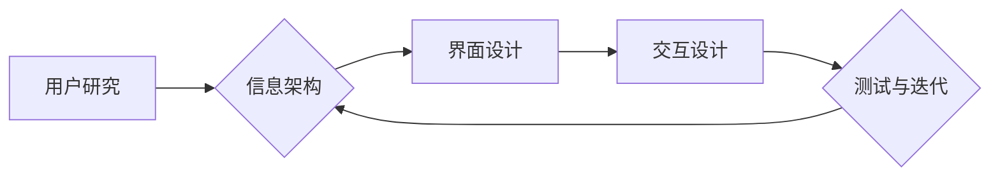

                 

## 知识付费创业中的用户体验优化

> 关键词：知识付费、用户体验、产品设计、学习平台、用户行为分析

### 1. 背景介绍

知识付费行业近年来蓬勃发展，从在线课程到付费咨询，从电子书到会员体系，各种知识产品层出不穷。然而，在激烈的市场竞争中，仅仅拥有优质的知识内容并不能保证成功。用户体验（User Experience，简称 UX）成为知识付费创业的关键因素。

用户体验是指用户与产品交互时所感受到的整体感受，包括易用性、可用性、美观度、效率、情感价值等方面。对于知识付费平台来说，良好的用户体验不仅能提升用户粘性，促进付费转化，还能增强品牌形象，建立用户信任。

### 2. 核心概念与联系

#### 2.1 用户体验设计流程

用户体验设计是一个迭代的过程，通常包括以下几个阶段：

* **用户研究:** 深入了解目标用户的需求、痛点、行为习惯等，通过访谈、问卷调查、用户行为分析等方式收集数据。
* **信息架构:**  规划知识产品的结构和导航，使用户能够轻松找到所需信息。
* **界面设计:**  设计简洁、美观、易于理解的界面，提供清晰的交互逻辑。
* **交互设计:**  设计用户与产品的交互方式，确保操作流畅、直观。
* **测试与迭代:**  通过用户测试收集反馈，不断优化产品体验。

#### 2.2  用户体验优化与知识付费

知识付费平台的用户体验优化与传统电商平台存在一些差异。

* **知识付费更注重用户学习体验:**  除了易用性和可用性，还需要考虑知识内容的呈现方式、学习进度管理、互动交流等因素。
* **用户付费意愿与信任关系密切:**  用户需要对平台的知识质量、服务水平、数据安全等方面有足够的信任，才能愿意付费。
* **用户学习行为更复杂:**  用户学习知识的过程是一个持续的探索和积累，需要平台提供个性化推荐、学习路径规划等服务。

**Mermaid 流程图**



### 3. 核心算法原理 & 具体操作步骤

#### 3.1  算法原理概述

用户体验优化算法通常基于用户行为数据分析，通过机器学习、数据挖掘等技术，识别用户偏好、学习模式、痛点等，并根据这些 insights 提供个性化推荐、优化学习路径、提升用户参与度等。

#### 3.2  算法步骤详解

1. **数据收集:** 收集用户行为数据，包括学习时长、学习进度、课程评价、互动行为等。
2. **数据清洗与预处理:**  处理数据中的缺失值、异常值、重复数据等，并进行数据转换、编码等操作。
3. **特征工程:**  提取用户行为数据中的特征，例如学习时长、课程类型偏好、学习时间段等，这些特征可以用于构建用户画像和预测用户行为。
4. **模型训练:**  使用机器学习算法，例如协同过滤、内容推荐、深度学习等，训练模型，预测用户对知识产品的兴趣、学习效果等。
5. **模型评估:**  使用测试数据评估模型的性能，例如准确率、召回率、F1-score等，并根据评估结果进行模型调优。
6. **模型部署:**  将训练好的模型部署到生产环境，实时分析用户行为数据，提供个性化推荐和优化用户体验。

#### 3.3  算法优缺点

* **优点:**  能够根据用户行为数据提供个性化推荐，提升用户学习效率和满意度。
* **缺点:**  需要大量的数据进行训练，模型的准确性依赖于数据质量，算法的复杂性也可能导致开发成本较高。

#### 3.4  算法应用领域

* **个性化学习推荐:**  根据用户的学习兴趣、进度、能力等，推荐合适的课程和学习资源。
* **学习路径规划:**  根据用户的学习目标和进度，规划个性化的学习路径，帮助用户高效完成学习目标。
* **知识内容优化:**  分析用户对知识内容的反馈，优化知识内容的结构、语言、呈现方式等，提升用户学习体验。
* **互动交流优化:**  根据用户的学习行为和兴趣，推荐合适的学习伙伴和交流平台，促进用户之间的互动和学习。

### 4. 数学模型和公式 & 详细讲解 & 举例说明

#### 4.1  数学模型构建

用户行为预测模型通常采用协同过滤算法，该算法基于用户的历史行为数据，预测用户对未来物品的兴趣。

**协同过滤算法的数学模型:**

$$
P(u, i) = \frac{\sum_{j \in N(u)} r_{u, j} * s_{j, i}}{\sum_{j \in N(u)} s_{j, i}}
$$

其中:

* $P(u, i)$ 表示用户 $u$ 对物品 $i$ 的评分预测值。
* $r_{u, j}$ 表示用户 $u$ 对物品 $j$ 的真实评分。
* $s_{j, i}$ 表示物品 $j$ 和物品 $i$ 之间的相似度。
* $N(u)$ 表示与用户 $u$ 有评分记录的物品集合。

#### 4.2  公式推导过程

协同过滤算法的核心思想是，如果用户 $u$ 和用户 $v$ 对某些物品的评分相似，那么用户 $u$ 可能会喜欢用户 $v$ 也喜欢的物品。

该公式通过计算用户 $u$ 与其他用户 $j$ 的评分相似度，以及物品 $j$ 和物品 $i$ 的相似度，来预测用户 $u$ 对物品 $i$ 的评分。

#### 4.3  案例分析与讲解

假设有一个用户 $u$ 对课程 $A$ 和课程 $B$ 都给出了高评分，而另一个用户 $v$ 对课程 $B$ 和课程 $C$ 都给出了高评分。

根据协同过滤算法，我们可以推断出用户 $u$ 和用户 $v$ 的兴趣相似，因此用户 $u$ 也可能喜欢课程 $C$。

### 5. 项目实践：代码实例和详细解释说明

#### 5.1  开发环境搭建

* **操作系统:**  Windows/macOS/Linux
* **编程语言:**  Python
* **框架:**  Django/Flask
* **数据库:**  MySQL/PostgreSQL
* **机器学习库:**  Scikit-learn/TensorFlow/PyTorch

#### 5.2  源代码详细实现

```python
# 导入必要的库
import pandas as pd
from sklearn.metrics.pairwise import cosine_similarity

# 加载用户行为数据
data = pd.read_csv('user_behavior.csv')

# 计算用户-物品评分矩阵
user_item_matrix = data.pivot_table(index='user_id', columns='item_id', values='rating')

# 计算用户-用户相似度矩阵
user_similarity = cosine_similarity(user_item_matrix)

# 获取用户 u 的相似用户
similar_users = user_similarity[0].argsort()[:-10:-1]

# 获取用户 u 相似用户喜欢的物品
recommended_items = []
for user in similar_users:
    recommended_items.extend(user_item_matrix.iloc[user].index[user_item_matrix.iloc[user] > 0])

# 去除重复推荐
recommended_items = list(set(recommended_items))

# 打印推荐结果
print(f'推荐给用户 {user_id} 的课程：{recommended_items}')
```

#### 5.3  代码解读与分析

* 该代码首先加载用户行为数据，并构建用户-物品评分矩阵。
* 然后使用余弦相似度算法计算用户之间的相似度，并获取用户 u 的相似用户。
* 最后，根据相似用户的评分信息，推荐用户 u 可能感兴趣的物品。

#### 5.4  运行结果展示

运行该代码后，将输出用户 u 可能感兴趣的课程列表。

### 6. 实际应用场景

#### 6.1  个性化学习推荐

知识付费平台可以根据用户的学习兴趣、进度、能力等，推荐合适的课程和学习资源。例如，如果用户对编程感兴趣，平台可以推荐相关的编程课程、书籍、视频等。

#### 6.2  学习路径规划

知识付费平台可以根据用户的学习目标和进度，规划个性化的学习路径，帮助用户高效完成学习目标。例如，如果用户想学习 Python 编程，平台可以根据用户的学习进度和能力，规划一个从基础语法到高级应用的学习路径。

#### 6.3  知识内容优化

知识付费平台可以分析用户对知识内容的反馈，优化知识内容的结构、语言、呈现方式等，提升用户学习体验。例如，如果用户对某个课程的讲解过于复杂，平台可以根据用户的反馈，修改课程内容，使其更易于理解。

#### 6.4  未来应用展望

随着人工智能技术的不断发展，用户体验优化在知识付费行业将发挥更重要的作用。未来，知识付费平台可能会采用更先进的算法和技术，例如深度学习、自然语言处理等，提供更个性化、智能化的学习体验。

### 7. 工具和资源推荐

#### 7.1  学习资源推荐

* **书籍:**
    * 《用户体验设计》
    * 《Don't Make Me Think》
    * 《The Design of Everyday Things》
* **在线课程:**
    * Coursera: User Experience Design Specialization
    * Udemy: The Complete UX Design Course
* **博客和网站:**
    * Nielsen Norman Group
    * UX Collective
    * Smashing Magazine

#### 7.2  开发工具推荐

* **用户行为分析工具:**
    * Google Analytics
    * Mixpanel
    * Amplitude
* **原型设计工具:**
    * Figma
    * Sketch
    * Adobe XD
* **测试工具:**
    * UserTesting
    * TryMyUI
    * Hotjar

#### 7.3  相关论文推荐

* **Recommender Systems: A Survey**
* **Collaborative Filtering: Methods and Applications**
* **Deep Learning for Recommender Systems**

### 8. 总结：未来发展趋势与挑战

#### 8.1  研究成果总结

用户体验优化在知识付费行业取得了显著的成果，例如个性化学习推荐、学习路径规划、知识内容优化等，有效提升了用户学习效率和满意度。

#### 8.2  未来发展趋势

* **更智能化的用户体验:**  利用深度学习、自然语言处理等技术，提供更精准、个性化的学习体验。
* **更沉浸式的学习体验:**  利用虚拟现实、增强现实等技术，打造更沉浸式的学习环境。
* **更协作性的学习体验:**  利用社交网络、在线社区等技术，促进用户之间的互动和协作学习。

#### 8.3  面临的挑战

* **数据隐私保护:**  用户行为数据涉及个人隐私，需要采取有效的措施保护用户数据安全。
* **算法公平性:**  算法模型可能存在偏见，需要确保算法公平公正，避免歧视和不公平现象。
* **用户信任:**  用户需要对平台的算法和数据使用方式有足够的信任，才能愿意分享个人数据。

#### 8.4  研究展望

未来，用户体验优化在知识付费行业将继续是一个重要的研究方向。需要进一步探索更智能、更沉浸、更协作的学习体验，并解决数据隐私保护、算法公平性等挑战，为用户提供更优质的学习服务。

### 9. 附录：常见问题与解答

* **Q1: 如何评估用户体验优化效果？**

* **A1:**  可以通过用户反馈、学习时长、学习进度、课程评价等指标来评估用户体验优化效果。

* **Q2: 如何收集用户行为数据？**

* **A2:**  可以通过网站分析工具、APP埋点、用户调查等方式收集用户行为数据。

* **Q3: 如何保护用户数据隐私？**

* **A3:**  需要采取以下措施保护用户数据隐私：
    * 明确告知用户数据收集和使用方式。
    * 加密用户数据传输和存储。
    * 限制数据访问权限。
    * 定期对数据安全进行评估和改进。


作者：禅与计算机程序设计艺术 / Zen and the Art of Computer Programming 
<end_of_turn>

