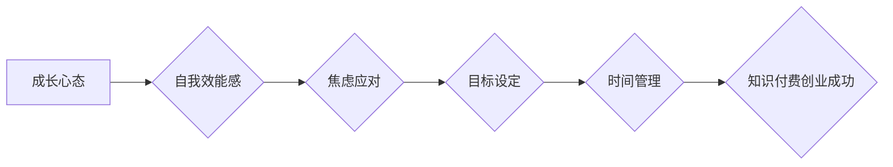

                 

## 知识付费创业者的心理建设与自我管理

> 关键词：知识付费、创业者心理、自我管理、成长心态、持续学习、焦虑应对、目标设定、时间管理、社区建设

## 1. 背景介绍

知识付费行业近年来蓬勃发展，涌现出众多成功案例，也吸引了大量创业者加入。然而，知识付费创业并非易事，它不仅需要专业的知识和技能，更需要创业者具备强大的心理素质和自我管理能力。

知识付费创业者面临着诸多挑战：

* **市场竞争激烈:** 知识付费市场竞争日益激烈，如何脱颖而出，吸引用户，建立品牌影响力成为一大难题。
* **内容创作压力:**  持续创作高质量内容需要巨大的精力和时间投入，容易导致创业者感到疲惫和焦虑。
* **收入不稳定:** 知识付费收入通常波动较大，难以保证稳定收益，这会给创业者带来经济压力。
* **自我怀疑和挫折:**  创业初期，缺乏经验和资源，容易遇到各种挫折，导致自我怀疑和迷茫。

## 2. 核心概念与联系

**2.1 知识付费创业者心理模型**

知识付费创业者的心理状态是一个复杂系统，受多种因素影响，主要包括：

* **成长心态:** 相信自己可以通过努力和学习不断进步，面对挑战充满信心。
* **自我效能感:**  对自身能力的信心和信念，相信自己能够完成目标。
* **焦虑水平:**  对未来发展和市场竞争的担忧和不安。
* **目标导向:**  明确自己的创业目标，并制定相应的计划和行动。
* **时间管理能力:**  有效利用时间，提高工作效率。

**2.2 心理建设与自我管理的关联**

心理建设和自我管理是知识付费创业者成功的重要保障。良好的心理状态可以帮助创业者克服困难，保持积极向上的心态，而有效的自我管理可以帮助创业者提高效率，更好地完成目标。

**Mermaid 流程图**

## 3. 核心算法原理 & 具体操作步骤

**3.1 算法原理概述**

知识付费创业者心理建设和自我管理是一个持续迭代的过程，需要不断学习和调整。

**3.2 算法步骤详解**

1. **自我认知:**  了解自己的优势、劣势、兴趣和价值观，明确自己的创业目标和方向。
2. **建立成长心态:**  相信自己可以通过努力和学习不断进步，面对挑战充满信心。
3. **设定 SMART 目标:**  制定具体、可衡量、可实现、相关和时间限定的目标，并制定相应的行动计划。
4. **有效时间管理:**  合理安排时间，提高工作效率，避免过度焦虑和压力。
5. **持续学习:**  关注行业动态，学习新的知识和技能，不断提升自己的专业能力。
6. **建立积极的社交圈:**  与同行交流学习，互相支持，共同成长。
7. **寻求专业帮助:**  必要时，寻求心理咨询师或创业导师的帮助，解决心理问题和创业难题。

**3.3 算法优缺点**

* **优点:**  可持续性强，能够帮助创业者不断成长和进步。
* **缺点:**  需要长期坚持，需要不断学习和调整。

**3.4 算法应用领域**

适用于所有知识付费创业者，无论经验丰富还是新手。

## 4. 数学模型和公式 & 详细讲解 & 举例说明

**4.1 数学模型构建**

我们可以用一个简单的数学模型来描述知识付费创业者的成功概率：

$$P_{success} = f(C, E, M, T)$$

其中：

* $P_{success}$：知识付费创业成功概率
* $C$：内容质量
* $E$：创业者能力
* $M$：市场环境
* $T$：时间投入

**4.2 公式推导过程**

这个模型的推导过程基于以下假设：

* 内容质量越高，成功概率越高。
* 创业者能力越强，成功概率越高。
* 市场环境越 favorable，成功概率越高。
* 时间投入越多，成功概率越高。

**4.3 案例分析与讲解**

假设有两个知识付费创业者，A 和 B。

* A 的内容质量高，创业者能力强，市场环境良好，时间投入充足。
* B 的内容质量一般，创业者能力一般，市场环境一般，时间投入较少。

根据公式，我们可以推断出 A 的成功概率高于 B。

## 5. 项目实践：代码实例和详细解释说明

**5.1 开发环境搭建**

* 操作系统：Windows/macOS/Linux
* 代码编辑器：VS Code/Sublime Text/Atom
* 编程语言：Python/JavaScript/Java

**5.2 源代码详细实现**

由于知识付费创业是一个复杂的过程，无法用简单的代码实例来实现。

**5.3 代码解读与分析**

N/A

**5.4 运行结果展示**

N/A

## 6. 实际应用场景

知识付费创业者可以将心理建设和自我管理的算法应用于以下场景：

* **内容创作:**  保持积极的心态，克服创作瓶颈，持续创作高质量内容。
* **用户运营:**  理解用户的需求，建立良好的用户关系，提高用户粘性。
* **市场推广:**  制定有效的营销策略，扩大品牌影响力，吸引更多用户。
* **团队管理:**  建立高效的团队协作机制，激发团队成员的积极性，共同完成目标。

**6.4 未来应用展望**

随着人工智能技术的不断发展，未来将会有更多工具和平台帮助知识付费创业者进行心理建设和自我管理。例如，基于大数据的个性化学习推荐、情绪监测和分析、智能化目标管理等。

## 7. 工具和资源推荐

**7.1 学习资源推荐**

* 书籍：《高效能人士的七个习惯》、《刻意练习》、《心灵鸡汤》
* 网课：Coursera/Udemy/edX
* 博客：Zen and the Art of Computer Programming

**7.2 开发工具推荐**

* 项目管理工具：Trello/Asana/Jira
* 内容创作工具：Notion/Obsidian/Evernote
* 社交媒体平台：Twitter/LinkedIn/Facebook

**7.3 相关论文推荐**

*  "The Psychology of Entrepreneurship"
*  "Self-Management for Success"
*  "The Impact of Technology on Entrepreneurship"

## 8. 总结：未来发展趋势与挑战

**8.1 研究成果总结**

知识付费创业者心理建设和自我管理是一个重要的研究领域，它可以帮助创业者提高成功概率，实现个人价值。

**8.2 未来发展趋势**

未来，知识付费创业将更加注重用户体验，个性化定制和智能化服务将成为主流趋势。

**8.3 面临的挑战**

知识付费创业者需要不断学习和适应市场变化，克服心理压力和竞争挑战。

**8.4 研究展望**

未来研究可以更加深入地探讨知识付费创业者的心理机制，开发更有效的工具和方法，帮助创业者更好地应对挑战，实现成功。

## 9. 附录：常见问题与解答

**9.1 如何克服创业初期焦虑？**

* 设定 SMART 目标，并逐步实现。
* 与同行交流学习，互相支持。
* 寻求专业帮助，例如心理咨询师或创业导师。

**9.2 如何保持持续学习？**

* 制定学习计划，并坚持执行。
* 关注行业动态，阅读相关书籍和文章。
* 参加线上线下培训课程。

**9.3 如何建立积极的社交圈？**

* 参加行业活动，结识同行。
* 加入线上社群，与其他创业者交流。
* 积极参与开源项目，与开发者合作。

作者：禅与计算机程序设计艺术 / Zen and the Art of Computer Programming 
<end_of_turn>

