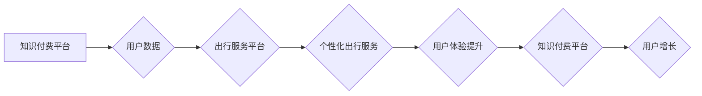

                 

## 关键词：知识付费、跨界营销、出行服务、数据驱动、个性化推荐、用户体验

## 1. 背景介绍

在当今数字经济时代，知识付费和出行服务行业都呈现出蓬勃发展的态势。知识付费平台通过提供优质的在线课程、咨询服务等，满足用户对知识和技能提升的需求；而出行服务行业则以便捷、高效的出行体验为核心，不断创新服务模式和技术手段。

然而，这两个看似独立的领域之间，却蕴藏着巨大的跨界合作潜力。通过知识付费的模式，出行服务平台可以提供更个性化、更智能化的出行体验，同时，出行服务平台的用户群体和数据资源，也能为知识付费平台带来新的增长点。

## 2. 核心概念与联系

### 2.1 知识付费

知识付费是指通过付费的方式获取知识、技能和服务的商业模式。它以内容为核心，通过线上平台提供各种形式的知识产品，例如：

* 在线课程：涵盖各个领域，从专业技能到兴趣爱好，满足不同用户的学习需求。
* 咨询服务：一对一或小班制的专业咨询，提供个性化的知识解答和指导。
* 电子书、音频课程：提供便捷的知识获取方式，方便用户随时随地学习。

### 2.2 出行服务

出行服务是指提供各种交通工具和出行相关服务的行业。它以便捷、高效、安全为核心，涵盖以下服务类型：

* 公共交通：地铁、公交、出租车等，提供城市公共交通服务。
* 私家车出行：提供租车、拼车、代驾等服务，满足个人出行需求。
* 出行信息服务：提供实时路况、导航、交通资讯等服务，帮助用户规划出行路线。

### 2.3 跨界营销

跨界营销是指两个或多个不同行业的企业合作，共同推广产品或服务，以扩大市场影响力和用户群体。

### 2.4 数据驱动

数据驱动是指利用数据分析和挖掘技术，为决策提供依据，优化运营策略和用户体验。

**核心概念与联系流程图**



## 3. 核心算法原理 & 具体操作步骤

### 3.1 算法原理概述

知识付费与出行服务跨界的核心算法原理在于数据驱动和个性化推荐。通过分析用户出行数据、知识付费偏好和行为模式，构建用户画像，并根据画像进行精准的推荐和服务定制。

### 3.2 算法步骤详解

1. **数据收集与清洗:** 收集用户出行数据、知识付费行为数据等，并进行清洗和预处理，确保数据质量。
2. **用户画像构建:** 利用机器学习算法，对用户数据进行分析，构建用户画像，包括用户出行习惯、偏好领域、学习目标等。
3. **个性化推荐:** 根据用户画像，推荐与用户兴趣和需求相匹配的知识付费产品和出行服务。
4. **服务定制:** 根据用户需求，定制个性化的出行方案和学习路径，提供更便捷、更智能的出行体验和学习服务。
5. **用户反馈收集与优化:** 收集用户反馈，不断优化算法模型和服务内容，提升用户体验。

### 3.3 算法优缺点

**优点:**

* **精准推荐:** 基于数据分析，实现精准的用户推荐，提升用户匹配度和转化率。
* **个性化服务:** 提供个性化的出行方案和学习路径，满足用户多样化需求。
* **提升用户体验:** 通过数据驱动和个性化定制，提升用户出行和学习体验。

**缺点:**

* **数据隐私安全:** 需要妥善处理用户数据，保障用户隐私安全。
* **算法模型复杂性:** 需要专业的技术团队进行算法模型开发和维护。
* **数据质量依赖:** 算法效果依赖于数据质量，需要不断优化数据收集和清洗流程。

### 3.4 算法应用领域

* **出行服务平台:** 提供个性化路线推荐、出行预订、交通信息服务等。
* **知识付费平台:** 推荐相关课程、咨询服务、学习资源等。
* **电商平台:** 推广与用户出行和学习需求相关的商品。
* **旅游平台:** 提供个性化旅游路线推荐、景点预订等服务。

## 4. 数学模型和公式 & 详细讲解 & 举例说明

### 4.1 数学模型构建

**用户兴趣模型:**

$$
P(u,c) = \frac{e^{w_u \cdot f_u + w_c \cdot f_c}}{\sum_{i=1}^{N} e^{w_u \cdot f_{u,i} + w_c \cdot f_{c,i}}}
$$

其中:

* $P(u,c)$: 用户 $u$ 对课程 $c$ 的兴趣概率。
* $w_u$: 用户 $u$ 的特征权重向量。
* $f_u$: 用户 $u$ 的特征向量。
* $w_c$: 课程 $c$ 的特征权重向量。
* $f_c$: 课程 $c$ 的特征向量。
* $N$: 所有课程的数量。

**出行需求模型:**

$$
D(u,t) = \alpha \cdot P(u,t) + \beta \cdot H(u,t)
$$

其中:

* $D(u,t)$: 用户 $u$ 在时间 $t$ 的出行需求。
* $P(u,t)$: 用户 $u$ 在时间 $t$ 的出行意愿。
* $H(u,t)$: 用户 $u$ 在时间 $t$ 的出行历史数据。
* $\alpha$, $\beta$: 权重系数。

### 4.2 公式推导过程

用户兴趣模型基于 softmax 函数，将用户和课程的特征向量进行加权求和，并通过归一化得到用户对课程的兴趣概率。出行需求模型则结合用户兴趣和出行历史数据，预测用户在特定时间段的出行需求。

### 4.3 案例分析与讲解

假设一个用户 $u$ 对编程课程感兴趣，并且在过去一周内经常在晚上出行。根据用户兴趣模型，可以计算出用户 $u$ 对编程课程的兴趣概率较高。结合出行需求模型，可以预测用户 $u$ 在晚上出行需求较高。因此，出行服务平台可以推荐用户 $u$ 晚上出行时学习编程课程的方案，例如提供晚间通勤路线推荐和编程课程学习资源。

## 5. 项目实践：代码实例和详细解释说明

### 5.1 开发环境搭建

* 操作系统: Ubuntu 20.04
* 编程语言: Python 3.8
* 框架: Flask
* 数据库: MySQL

### 5.2 源代码详细实现

```python
# app.py
from flask import Flask, request, jsonify
from sklearn.feature_extraction.text import TfidfVectorizer
from sklearn.metrics.pairwise import cosine_similarity

app = Flask(__name__)

# 用户数据
users = {
    "user1": {"interests": ["编程", "数据科学"], "history": ["晚上出行", "周末出行"]},
    "user2": {"interests": ["音乐", "电影"], "history": ["白天出行", "晚上出行"]}
}

# 课程数据
courses = {
    "course1": {"title": "Python编程入门", "description": "学习Python编程基础知识"},
    "course2": {"title": "数据科学导论", "description": "介绍数据科学的基本概念和方法"}
}

# TF-IDF向量化
vectorizer = TfidfVectorizer()
course_vectors = vectorizer.fit_transform([course["description"] for course in courses.values()])

@app.route('/recommend', methods=['POST'])
def recommend():
    user_id = request.json.get('user_id')
    user_interests = users.get(user_id, {}).get('interests', [])
    user_history = users.get(user_id, {}).get('history', [])

    # 计算用户兴趣向量
    user_vector = vectorizer.transform(user_interests)

    # 计算用户与课程的相似度
    similarities = cosine_similarity(user_vector, course_vectors)

    # 推荐课程
    recommended_courses = [
        course for score, course in zip(similarities[0], courses.values())
        if score > 0.5
    ]

    return jsonify({"recommendations": [{"title": course["title"]} for course in recommended_courses]})

if __name__ == '__main__':
    app.run(debug=True)
```

### 5.3 代码解读与分析

该代码实现了一个简单的知识付费与出行服务跨界推荐系统。

* 用户数据和课程数据存储在字典中，包含用户兴趣、出行历史和课程标题、描述等信息。
* 使用 TF-IDF 向量化技术将文本数据转换为数值向量，方便计算相似度。
* `cosine_similarity` 函数计算用户兴趣向量与课程向量之间的余弦相似度，用于推荐课程。
* API 接口 `/recommend` 接收用户 ID，并根据用户兴趣和历史数据推荐相关课程。

### 5.4 运行结果展示

当用户发送 POST 请求到 `/recommend` 接口，并提供用户 ID 时，系统会返回包含推荐课程标题的 JSON 数据。

## 6. 实际应用场景

### 6.1 出行服务平台

* **个性化路线推荐:** 根据用户出行历史、目的地和时间安排，推荐最优的出行路线，并提供实时路况信息和交通建议。
* **出行预订:** 根据用户出行需求，推荐合适的交通工具和预订服务，例如出租车、拼车、代驾等。
* **交通信息服务:** 提供实时路况、导航、交通资讯等服务，帮助用户规划出行路线和避免交通拥堵。

### 6.2 知识付费平台

* **课程推荐:** 根据用户学习目标、兴趣爱好和学习进度，推荐相关课程和学习资源。
* **学习路径定制:** 根据用户学习目标和知识结构，定制个性化的学习路径，帮助用户高效学习。
* **在线咨询服务:** 提供一对一或小班制的在线咨询服务，解答用户学习过程中遇到的问题。

### 6.3 其他场景

* **电商平台:** 推广与用户出行和学习需求相关的商品，例如旅行用品、学习工具等。
* **旅游平台:** 提供个性化旅游路线推荐、景点预订等服务，并结合知识付费内容，提供深度旅游体验。

### 6.4 未来应用展望

随着人工智能技术的发展，知识付费与出行服务跨界将呈现更加智能化、个性化的趋势。例如:

* **基于语音和图像识别的个性化推荐:** 通过语音和图像识别技术，更精准地理解用户的需求，提供更个性化的推荐服务。
* **虚拟现实和增强现实技术的应用:** 利用虚拟现实和增强现实技术，打造沉浸式的学习和出行体验。
* **大数据分析和预测:** 利用大数据分析和预测技术，更准确地预测用户需求，提供更精准的服务。

## 7. 工具和资源推荐

### 7.1 学习资源推荐

* **机器学习:** Andrew Ng 的机器学习课程 (Coursera)
* **深度学习:** 深度学习 Specialization (Coursera)
* **自然语言处理:** Stanford NLP课程 (Stanford)

### 7.2 开发工具推荐

* **Python:** 编程语言
* **Flask:** Web 框架
* **Scikit-learn:** 机器学习库
* **TensorFlow/PyTorch:** 深度学习库

### 7.3 相关论文推荐

* **Collaborative Filtering for Recommender Systems:** Adomavicius, G., & Tuzhilin, A. (2005).
* **Deep Learning Recommendations for Everyone:**  Wang-Cheng Kang, et al. (2019).
* **BERT: Pre-training of Deep Bidirectional Transformers for Language Understanding:** Devlin, J., Chang, M. W., Lee, K., & Toutanova, K. (2018).

## 8. 总结：未来发展趋势与挑战

### 8.1 研究成果总结

知识付费与出行服务跨界融合，通过数据驱动和个性化推荐，为用户提供更便捷、更智能的出行体验和学习服务。

### 8.2 未来发展趋势

* **更精准的个性化推荐:** 利用更先进的机器学习算法和数据分析技术，实现更精准的个性化推荐。
* **多模态数据融合:** 将文本、图像、语音等多模态数据融合，构建更全面的用户画像，提供更个性化的服务。
* **边缘计算和云计算的结合:** 利用边缘计算和云计算的优势，实现更实时、更高效的推荐服务。

### 8.3 面临的挑战

* **数据隐私安全:** 需要妥善处理用户数据，保障用户隐私安全。
* **算法模型复杂性:** 需要专业的技术团队进行算法模型开发和维护。
* **数据质量依赖:** 算法效果依赖于数据质量，需要不断优化数据收集和清洗流程。

### 8.4 研究展望

未来，知识付费与出行服务跨界融合将继续深入发展，为用户提供更加智能化、个性化和便捷的服务。


## 9. 附录：常见问题与解答

**Q1: 如何保障用户数据隐私安全？**

**A1:** 

* 采用加密技术保护用户数据传输和存储。
* 明确用户数据使用范围和权限，并获得用户同意。
* 遵守相关数据隐私法规和标准。

**Q2: 如何提高算法推荐的准确性？**

**A2:**

* 收集更丰富、更准确的用户数据。
* 使用更先进的机器学习算法和数据分析技术。
* 持续优化算法模型，并根据用户反馈进行调整。

**Q3: 如何应对数据质量问题？**

**A3:**

* 建立完善的数据收集和清洗流程。
* 使用数据清洗工具和技术，去除数据中的噪声和错误。
* 定期评估数据质量，并采取措施进行改进。


作者：禅与计算机程序设计艺术 / Zen and the Art of Computer Programming 
<end_of_turn>

