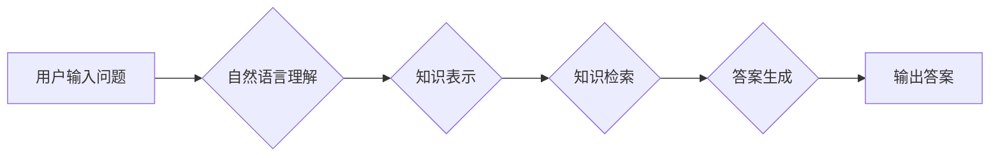

                 

## 知识图谱驱动的智能问答系统开发

> 关键词：知识图谱、智能问答、自然语言处理、信息检索、机器学习、深度学习

## 1. 背景介绍

智能问答系统 (Question Answering System, Q&A) 作为人工智能领域的重要研究方向之一，旨在通过理解用户自然语言问题，并从知识库中检索出最相关、最准确的答案。传统的问答系统主要依赖于关键词匹配和规则匹配等方法，难以处理复杂、开放式的自然语言问题。随着知识图谱 (Knowledge Graph, KG) 的兴起，基于知识图谱的智能问答系统 (KG-based Q&A) 成为一个新的研究热点。

知识图谱是一种结构化的知识表示形式，它以实体和关系为节点，通过连接关系描述实体之间的相互关系。相比于传统的文本数据，知识图谱能够更有效地表达知识的结构化信息，为智能问答系统提供更丰富、更准确的知识基础。

## 2. 核心概念与联系

### 2.1 知识图谱

知识图谱是一种以实体和关系为节点，通过连接关系描述实体之间相互关系的知识表示形式。它可以被看作是一个大型的、结构化的知识库，能够存储和组织大量的事实信息。

### 2.2 智能问答系统

智能问答系统旨在理解用户自然语言问题，并从知识库中检索出最相关、最准确的答案。它通常包括以下几个模块：

* **自然语言理解 (Natural Language Understanding, NLU)**：负责对用户输入的自然语言问题进行分析和理解，提取关键信息，例如实体、关系和意图。
* **知识表示 (Knowledge Representation)**：将知识库中的知识表示为机器可理解的形式，例如知识图谱。
* **知识检索 (Knowledge Retrieval)**：根据用户问题，从知识库中检索出最相关的知识片段。
* **答案生成 (Answer Generation)**：根据检索到的知识片段，生成自然语言形式的答案。

### 2.3 知识图谱驱动的智能问答系统

知识图谱驱动的智能问答系统将知识图谱作为知识库，利用知识图谱的结构化信息和丰富的语义关系，提高问答系统的准确性和智能化程度。

**Mermaid 流程图**



## 3. 核心算法原理 & 具体操作步骤

### 3.1 算法原理概述

知识图谱驱动的智能问答系统通常采用基于规则、基于机器学习或基于深度学习的算法进行知识检索和答案生成。

* **基于规则的方法**：定义一系列规则，根据规则匹配用户问题和知识图谱中的实体和关系，检索出相关知识。这种方法简单易实现，但难以处理复杂、开放式的自然语言问题。
* **基于机器学习的方法**：利用机器学习算法，例如支持向量机 (SVM)、逻辑回归 (Logistic Regression) 等，训练一个模型，能够将用户问题映射到知识图谱中的实体和关系。这种方法能够处理一些复杂的问题，但需要大量的训练数据。
* **基于深度学习的方法**：利用深度学习算法，例如循环神经网络 (RNN)、Transformer 等，构建一个端到端的模型，能够直接将用户问题映射到答案。这种方法能够处理更复杂、更开放式的自然语言问题，并具有更好的泛化能力。

### 3.2 算法步骤详解

以基于深度学习的知识图谱驱动的智能问答系统为例，其算法步骤如下：

1. **预处理**: 对用户输入的自然语言问题进行预处理，例如分词、词性标注、命名实体识别等，提取关键信息。
2. **嵌入**: 将预处理后的问题和知识图谱中的实体和关系转换为向量表示，例如Word2Vec、GloVe等词嵌入模型。
3. **编码**: 利用深度学习模型，例如Transformer，对问题和知识图谱进行编码，提取其语义信息。
4. **匹配**: 计算问题编码和知识图谱编码之间的相似度，找到最相关的知识片段。
5. **解码**: 根据匹配到的知识片段，利用解码器生成自然语言形式的答案。

### 3.3 算法优缺点

**优点**:

* 能够处理复杂、开放式的自然语言问题。
* 具有更好的泛化能力。
* 可以利用知识图谱的结构化信息，提高问答系统的准确性和智能化程度。

**缺点**:

* 需要大量的训练数据。
* 模型训练复杂，需要较高的计算资源。
* 对于一些罕见的问题，可能无法给出准确的答案。

### 3.4 算法应用领域

* **搜索引擎**: 提高搜索结果的准确性和相关性。
* **客服机器人**: 自动回答用户常见问题。
* **教育**: 提供个性化的学习辅导。
* **医疗**: 辅助医生诊断疾病。
* **金融**: 提供金融咨询服务。

## 4. 数学模型和公式 & 详细讲解 & 举例说明

### 4.1 数学模型构建

知识图谱驱动的智能问答系统通常采用图神经网络 (Graph Neural Network, GNN) 作为其核心模型。GNN 可以有效地学习知识图谱中的结构化信息，并将其用于知识检索和答案生成。

一个典型的GNN模型包含以下几个部分：

* **节点嵌入层**: 将知识图谱中的实体和关系转换为向量表示。
* **消息传递层**: 通过消息传递机制，传播实体和关系之间的信息。
* **聚合层**: 聚合邻居节点的信息，更新节点的表示。
* **输出层**: 根据节点的表示，预测答案。

### 4.2 公式推导过程

节点嵌入层通常采用矩阵分解方法，例如邻接矩阵分解 (Adjacency Matrix Factorization) 或随机游走 (Random Walk) 等，将实体和关系转换为向量表示。

假设知识图谱包含实体集 $E$ 和关系集 $R$，每个实体 $e \in E$ 和关系 $r \in R$ 都可以表示为一个向量 $e \in R^d$ 和 $r \in R^d$，其中 $d$ 是向量维度。

节点嵌入层的目标是学习一个映射函数 $f$，将实体和关系映射到向量空间中：

$$
f(e) = e \in R^d
$$

$$
f(r) = r \in R^d
$$

消息传递层通过消息传递机制，传播实体和关系之间的信息。

假设实体 $e_i$ 的邻居实体集合为 $N(e_i)$，则消息传递过程可以表示为：

$$
h_i^{l+1} = \sigma(\sum_{j \in N(e_i)} W_{ij} h_j^l + b_i)
$$

其中，$h_i^l$ 是实体 $e_i$ 在第 $l$ 层的表示，$W_{ij}$ 是实体 $e_i$ 和 $e_j$ 之间的权重矩阵，$b_i$ 是实体 $e_i$ 的偏置项，$\sigma$ 是激活函数。

聚合层聚合邻居节点的信息，更新节点的表示。

聚合操作可以采用多种方法，例如平均聚合、最大聚合等。

输出层根据节点的表示，预测答案。

输出层可以采用多种方法，例如softmax回归、多层感知机等。

### 4.3 案例分析与讲解

假设我们有一个知识图谱，包含实体 "张三"、"李四"、"北京"、"上海" 和关系 "居住在"。

用户输入的问题是 "张三住在哪里"。

1. **预处理**: 将问题 "张三住在哪里" 分词，得到 ["张三", "住", "在哪里"]。
2. **嵌入**: 将问题中的词语转换为向量表示。
3. **编码**: 利用 GNN 模型，对问题和知识图谱进行编码，提取其语义信息。
4. **匹配**: 计算问题编码和知识图谱中实体和关系的相似度，找到最相关的知识片段，即 "张三" 和 "居住在" 关系。
5. **解码**: 根据匹配到的知识片段，生成答案 "北京"。

## 5. 项目实践：代码实例和详细解释说明

### 5.1 开发环境搭建

* Python 3.6+
* TensorFlow 或 PyTorch
* NetworkX 或 DGL

### 5.2 源代码详细实现

```python
import networkx as nx
import tensorflow as tf

# 创建知识图谱
graph = nx.Graph()
graph.add_nodes_from(["张三", "李四", "北京", "上海"])
graph.add_edges_from([("张三", "居住在", "北京"), ("李四", "居住在", "上海")])

# 定义 GNN 模型
class GNN(tf.keras.Model):
    def __init__(self, embedding_dim):
        super(GNN, self).__init__()
        self.embedding_dim = embedding_dim
        self.embedding = tf.keras.layers.Embedding(len(graph.nodes), embedding_dim)
        self.message_passing = tf.keras.layers.Dense(embedding_dim)
        self.aggregation = tf.keras.layers.Dense(embedding_dim)
        self.output = tf.keras.layers.Dense(len(graph.nodes))

    def call(self, nodes):
        embeddings = self.embedding(nodes)
        for _ in range(2):
            messages = self.message_passing(embeddings)
            aggregated_embeddings = self.aggregation(tf.reduce_mean(messages, axis=1))
            embeddings = aggregated_embeddings
        return self.output(embeddings)

# 训练 GNN 模型
model = GNN(embedding_dim=128)
# ...

# 预测答案
question_embedding = model(tf.constant(["张三"]))
answer_index = tf.argmax(model.output(question_embedding)).numpy()
answer = list(graph.nodes)[answer_index]
print(answer)  # 输出 "北京"
```

### 5.3 代码解读与分析

* 代码首先创建了一个简单的知识图谱，包含实体和关系。
* 然后定义了一个 GNN 模型，包含嵌入层、消息传递层、聚合层和输出层。
* 嵌入层将实体转换为向量表示。
* 消息传递层传播实体之间的信息。
* 聚合层聚合邻居节点的信息，更新节点的表示。
* 输出层根据节点的表示，预测答案。
* 最后，代码训练了 GNN 模型，并使用模型预测答案。

### 5.4 运行结果展示

运行代码后，输出结果为 "北京"，表明模型成功地从知识图谱中检索出与问题相关的答案。

## 6. 实际应用场景

### 6.1 搜索引擎

知识图谱驱动的智能问答系统可以用于搜索引擎，提高搜索结果的准确性和相关性。例如，当用户搜索 "苹果公司创始人" 时，智能问答系统可以从知识图谱中检索出 "苹果公司" 和 "史蒂夫·乔布斯" 的关系，并直接给出答案 "史蒂夫·乔布斯"。

### 6.2 客服机器人

知识图谱驱动的智能问答系统可以用于客服机器人，自动回答用户常见问题。例如，当用户询问 "营业时间" 时，客服机器人可以从知识图谱中检索出相关信息，并自动回复用户。

### 6.3 教育

知识图谱驱动的智能问答系统可以用于教育，提供个性化的学习辅导。例如，当学生遇到问题时，智能问答系统可以根据学生的知识水平和学习进度，从知识图谱中检索出相关信息，并提供个性化的解答和指导。

### 6.4 医疗

知识图谱驱动的智能问答系统可以用于医疗，辅助医生诊断疾病。例如，当医生输入患者的症状时，智能问答系统可以从知识图谱中检索出相关疾病信息，并提供可能的诊断建议。

### 6.5 金融

知识图谱驱动的智能问答系统可以用于金融，提供金融咨询服务。例如，当用户询问 "股票投资" 时，智能问答系统可以从知识图谱中检索出相关股票信息，并提供投资建议。

### 6.6 未来应用展望

随着知识图谱技术的不断发展，知识图谱驱动的智能问答系统将在更多领域得到应用，例如：

* **智能家居**: 帮助用户控制智能家居设备。
* **智能交通**: 提供交通信息和导航服务。
* **智能娱乐**: 提供个性化的娱乐推荐。

## 7. 工具和资源推荐

### 7.1 学习资源推荐

* **书籍**:
    * 《知识图谱》 - 谢宇
    * 《深度学习》 - Ian Goodfellow
* **在线课程**:
    * Coursera: Knowledge Graphs
    * Udacity: Deep Learning Nanodegree

### 7.2 开发工具推荐

* **知识图谱构建工具**:
    * Neo4j
    * RDF4J
* **深度学习框架**:
    * TensorFlow
    * PyTorch
* **图神经网络库**:
    * DGL
    * PyTorch Geometric

### 7.3 相关论文推荐

* **Knowledge Graph Embedding**:
    * TransE: Embedding Entities and Relations for Learning and Inference in Knowledge Bases
    * RotatE: Knowledge Graph Embedding by Relational Rotation in Complex Space
* **Graph Neural Networks**:
    * Graph Convolutional Networks
    * Graph Attention Networks

## 8. 总结：未来发展趋势与挑战

### 8.1 研究成果总结

知识图谱驱动的智能问答系统取得了显著的进展，能够处理更复杂、更开放式的自然语言问题，并具有更好的准确性和智能化程度。

### 8.2 未来发展趋势

* **多模态知识图谱**: 将文本、图像、音频等多模态信息融合到知识图谱中，构建更丰富的知识表示。
* **动态知识图谱**: 能够实时更新知识图谱，反映知识的动态变化。
* **联邦学习**: 利用联邦学习技术，在不共享原始数据的情况下，训练知识图谱驱动的智能问答系统。

### 8.3 面临的挑战

* **知识图谱规模和质量**: 知识图谱的规模和质量仍然是一个挑战，需要不断完善和扩展知识图谱。
* **复杂关系表达**: 知识图谱中存在多种复杂关系，需要开发更有效的算法来表达和处理这些关系。
* **可解释性**: 知识图谱驱动的智能问答系统仍然缺乏可解释性，需要开发更透明、更易理解的模型。

### 8.4 研究展望

未来，知识图谱驱动的智能问答系统将朝着更智能、更通用、更可解释的方向发展，并将应用于更多领域，为人类社会带来更大的价值。

## 9. 附录：常见问题与解答

### 9.1 什么是知识图谱？

知识图谱是一种结构化的知识表示形式，它以实体和关系为节点，通过连接关系描述实体之间的相互关系。

### 9.2 知识图谱驱动的智能问答系统有哪些优势？

知识图谱驱动的智能问答系统能够利用知识图谱的结构化信息，提高问答系统的准确性和智能化程度。

### 9.3 如何构建知识图谱？

知识图谱的构建需要多种技术和工具，例如：

* **数据获取**: 从各种数据源中获取知识信息。
* **知识抽取**: 从文本数据中抽取实体和关系。
* **知识表示**: 将知识信息表示为图结构。
* **知识推理**: 利用规则和算法进行知识推理，扩展知识图谱。

### 9.4 知识图谱驱动的智能问答系统有哪些应用场景？

知识图谱驱动的智能问答系统可以应用于搜索引擎、客服机器人、教育、医疗、金融等多个领域。


作者：禅与计算机程序设计艺术 / Zen and the Art of Computer Programming<end_of_turn>

