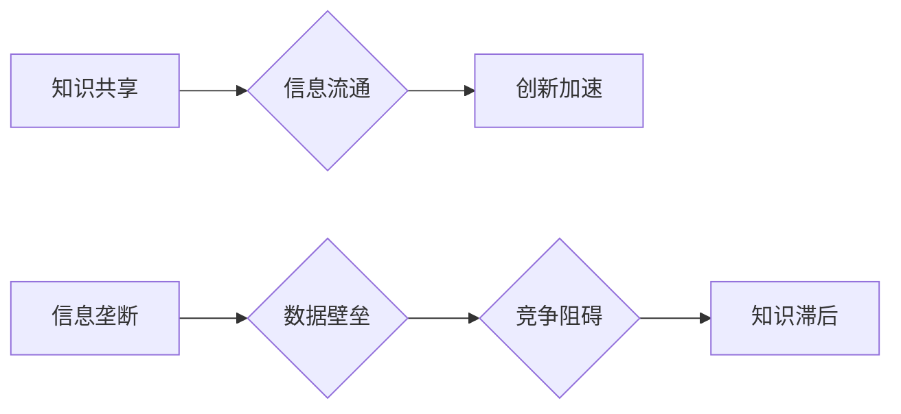

                 

## 知识的共享与垄断：信息时代的两难

> 关键词：知识共享、信息垄断、人工智能、数据驱动、开源软件、知识经济、版权、公平竞争

### 1. 背景介绍

信息时代，知识成为最宝贵的资源。互联网的普及和人工智能技术的飞速发展，使得知识的获取和传播变得前所未有的便捷。然而，知识的共享与垄断之间也日益成为一个备受关注的议题。一方面，开源软件和知识共享平台的兴起，促进了知识的自由流动和创新加速；另一方面，大型科技公司对数据的垄断和知识产权的保护，也引发了对信息公平分配和知识垄断的担忧。

### 2. 核心概念与联系

**2.1 知识共享**

知识共享是指知识的免费获取、使用、修改和传播。它基于一种开放的理念，认为知识应该被广泛共享，以促进社会进步和个人成长。知识共享的模式多种多样，包括：

* **开源软件：** 源代码公开，任何人可以自由使用、修改和分发。
* **开放式数据：** 数据公开获取和使用，促进数据驱动的创新。
* **知识共享许可证：** 允许他人以特定条件使用和传播知识产权。

**2.2 信息垄断**

信息垄断是指少数企业或个人控制着大量信息资源，并以此获取垄断优势。信息垄断的形成，往往伴随着以下因素：

* **数据壁垒：** 大型科技公司积累了海量用户数据，形成难以逾越的数据壁垒。
* **技术壁垒：** 领先的技术和算法，使得其他企业难以竞争。
* **法律法规：** 知识产权保护和反垄断法规的缺失或不完善，加剧了信息垄断。

**2.3 知识共享与信息垄断之间的关系**

知识共享和信息垄断是两个相互对立的趋势。知识共享促进知识的自由流动和创新，而信息垄断则阻碍了知识的传播和公平竞争。两者之间的博弈，将深刻影响着信息时代的未来发展。

**Mermaid 流程图**



### 3. 核心算法原理 & 具体操作步骤

**3.1 算法原理概述**

在信息时代，算法成为知识共享和信息垄断的关键因素。

* **推荐算法：** 基于用户行为和数据分析，推荐相关信息，促进知识传播。
* **搜索算法：** 帮助用户快速找到所需信息，降低信息获取门槛。
* **机器学习算法：** 从海量数据中学习知识，提高信息处理效率。

**3.2 算法步骤详解**

以推荐算法为例，其基本步骤包括：

1. **数据收集：** 收集用户行为数据，如浏览记录、搜索历史、点赞行为等。
2. **数据预处理：** 对数据进行清洗、转换和特征提取。
3. **模型训练：** 使用机器学习算法，训练推荐模型。
4. **模型评估：** 使用测试数据评估模型性能，并进行调优。
5. **推荐输出：** 根据用户特征和模型预测，输出个性化推荐结果。

**3.3 算法优缺点**

推荐算法具有以下优点：

* **个性化推荐：** 根据用户需求，提供更精准的推荐结果。
* **信息发现：** 帮助用户发现新知识和兴趣点。
* **用户体验提升：** 提高用户使用效率和满意度。

但也存在以下缺点：

* **数据依赖：** 推荐算法依赖于海量数据，数据质量直接影响推荐效果。
* **算法偏差：** 算法训练过程中可能存在偏差，导致推荐结果不公平。
* **信息茧房：** 过度个性化推荐可能导致用户陷入信息茧房，缺乏多元化信息获取。

**3.4 算法应用领域**

推荐算法广泛应用于：

* **电商平台：** 商品推荐、用户画像
* **社交媒体：** 内容推荐、好友推荐
* **视频网站：** 视频推荐、用户兴趣分析
* **新闻平台：** 新闻推荐、个性化订阅

### 4. 数学模型和公式 & 详细讲解 & 举例说明

**4.1 数学模型构建**

推荐算法通常使用矩阵分解模型，将用户和物品表示为低维向量，通过计算向量之间的相似度，预测用户对物品的评分。

**4.2 公式推导过程**

假设用户集合为U，物品集合为I，用户对物品的评分矩阵为R。矩阵分解模型的目标是找到两个低维矩阵P和Q，分别表示用户和物品的特征向量，使得预测评分与实际评分之间的误差最小。

$$
\hat{r}_{u,i} = p_u^T q_i
$$

其中，$\hat{r}_{u,i}$ 是预测评分，$p_u$ 是用户u的特征向量，$q_i$ 是物品i的特征向量。

**4.3 案例分析与讲解**

假设用户A对电影1评分为4，对电影2评分为3，用户B对电影1评分为5，对电影2评分为4。可以使用矩阵分解模型学习用户和电影的特征向量，并预测用户A对电影2的评分。

### 5. 项目实践：代码实例和详细解释说明

**5.1 开发环境搭建**

使用Python语言和相关的机器学习库，如Scikit-learn，搭建开发环境。

**5.2 源代码详细实现**

```python
from sklearn.decomposition import NMF

# 数据准备
ratings = [[4, 3], [5, 4]]

# 模型训练
model = NMF(n_components=2)
model.fit(ratings)

# 特征向量提取
user_features = model.components_

# 预测评分
predicted_rating = user_features[0] @ user_features[1]

print(predicted_rating)
```

**5.3 代码解读与分析**

代码首先使用NMF算法训练模型，将用户和电影表示为低维特征向量。然后，使用用户特征向量和电影特征向量计算预测评分。

**5.4 运行结果展示**

运行代码后，输出预测评分结果。

### 6. 实际应用场景

**6.1 电子商务平台**

推荐算法可以根据用户的购买历史、浏览记录和兴趣偏好，推荐相关商品，提高用户购买转化率。

**6.2 社交媒体平台**

推荐算法可以根据用户的关注关系、点赞行为和互动记录，推荐相关内容，提高用户活跃度和粘性。

**6.3 视频网站**

推荐算法可以根据用户的观看历史、点赞行为和评论记录，推荐相关视频，提高用户观看时长和用户留存率。

**6.4 未来应用展望**

随着人工智能技术的不断发展，推荐算法将更加精准、个性化和智能化。未来，推荐算法将应用于更多领域，例如教育、医疗、金融等，为人们提供更便捷、高效的服务。

### 7. 工具和资源推荐

**7.1 学习资源推荐**

* **书籍：** 《推荐系统实践》
* **在线课程：** Coursera上的“机器学习”课程
* **开源项目：** Surprise

**7.2 开发工具推荐**

* **Python：** 广泛应用于机器学习和数据分析
* **Scikit-learn：** Python机器学习库
* **TensorFlow：** 深度学习框架

**7.3 相关论文推荐**

* **协同过滤算法：** “Collaborative Filtering: A User-Based Approach”
* **矩阵分解模型：** “Matrix Factorization Techniques for Recommender Systems”

### 8. 总结：未来发展趋势与挑战

**8.1 研究成果总结**

信息时代，知识共享和信息垄断之间的博弈日益激烈。推荐算法等技术推动了知识的传播和应用，但也带来了新的挑战。

**8.2 未来发展趋势**

未来，知识共享和信息垄断将继续演变，人工智能技术将扮演越来越重要的角色。

* **个性化推荐：** 推荐算法将更加精准、个性化，满足用户多样化的需求。
* **跨领域知识共享：** 知识共享平台将跨越领域边界，促进不同领域的知识融合。
* **数据隐私保护：** 随着数据量的增加，数据隐私保护将成为越来越重要的议题。

**8.3 面临的挑战**

* **算法公平性：** 算法训练过程中可能存在偏差，导致推荐结果不公平。
* **信息茧房：** 过度个性化推荐可能导致用户陷入信息茧房，缺乏多元化信息获取。
* **知识产权保护：** 如何平衡知识共享和知识产权保护，是一个需要认真思考的问题。

**8.4 研究展望**

未来，需要加强对知识共享和信息垄断的理论研究，探索更加公平、高效、可持续的知识共享模式。同时，需要加强算法的透明度和可解释性，确保算法的公平性和安全性。


### 9. 附录：常见问题与解答

**9.1 如何避免信息茧房？**

* 尝试使用不同的推荐算法和平台。
* 主动探索新的领域和信息来源。
* 与不同观点的人交流，拓宽视野。

**9.2 如何保护知识产权？**

* 使用知识共享许可证，明确知识使用范围。
* 采取技术手段保护知识产权，例如加密和水印技术。
* 通过法律途径维护知识产权。


作者：禅与计算机程序设计艺术 / Zen and the Art of Computer Programming 
<end_of_turn>

