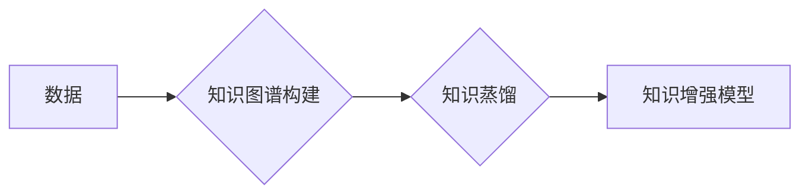

                 

## 知识的应用价值：洞察力的独特视角

> 关键词：知识图谱、知识蒸馏、深度学习、洞察力、应用价值、数据驱动

### 1. 背景介绍

在数据爆炸的时代，海量数据已成为企业和研究机构的宝贵资源。然而，单纯拥有数据并不能带来价值，真正重要的是如何从数据中提取有意义的知识，并将其转化为洞察力，最终驱动决策和创新。知识图谱、知识蒸馏等技术应运而生，为将数据转化为知识提供了新的思路和方法。

知识图谱是一种结构化的知识表示形式，它将实体和关系以图的形式进行表示，能够有效地捕捉知识之间的关联性。而知识蒸馏则是通过将深度学习模型的知识迁移到更小的模型中，从而提高模型的效率和泛化能力的技术。

这两项技术在各自领域取得了显著的成果，但如何将它们结合起来，更好地挖掘数据中的洞察力，仍然是一个值得深入探讨的问题。本文将从知识图谱和知识蒸馏的原理出发，探讨其应用价值，并分析其在未来发展中的趋势和挑战。

### 2. 核心概念与联系

#### 2.1 知识图谱

知识图谱是一种基于图结构的知识表示形式，它将世界中的实体和它们之间的关系以节点和边的方式进行表示。

* **实体 (Entity):**  知识图谱中的基本单元，代表现实世界中的事物，例如人、地点、事件等。
* **关系 (Relation):**  实体之间的连接，描述实体之间的属性或联系，例如“出生于”、“工作于”、“拥有”等。
* **属性 (Property):**  实体的特征描述，例如“姓名”、“年龄”、“职位”等。

知识图谱的优势在于：

* **结构化表示:**  知识图谱将知识以结构化的方式表示，能够有效地捕捉知识之间的关联性，方便进行推理和查询。
* **可扩展性:**  知识图谱可以不断扩展，添加新的实体和关系，以适应不断变化的知识世界。
* **可解释性:**  知识图谱的结构清晰易懂，能够帮助人们更好地理解知识之间的关系。

#### 2.2 知识蒸馏

知识蒸馏是一种机器学习技术，它通过将深度学习模型的知识迁移到更小的模型中，从而提高模型的效率和泛化能力。

知识蒸馏的基本原理是：

* **教师模型 (Teacher Model):**  一个已经训练好的大型深度学习模型，拥有丰富的知识和经验。
* **学生模型 (Student Model):**  一个更小的深度学习模型，需要学习教师模型的知识。

知识蒸馏的过程是：

1. 使用教师模型对数据进行预测。
2. 将教师模型的预测结果作为学生模型的监督信号。
3. 使用学生模型学习教师模型的知识，并不断调整模型参数，使其能够尽可能地模仿教师模型的预测结果。

#### 2.3 知识图谱与知识蒸馏的结合

将知识图谱与知识蒸馏结合起来，可以实现以下优势：

* **提升知识蒸馏的效率:**  知识图谱可以提供结构化的知识，帮助学生模型更快地学习教师模型的知识。
* **增强知识蒸馏的泛化能力:**  知识图谱可以提供丰富的背景知识，帮助学生模型更好地理解数据，提高其对未知数据的泛化能力。
* **实现知识的动态更新:**  知识图谱可以不断更新，随着新知识的加入，学生模型也能及时学习新的知识，保持其知识的时效性。

**Mermaid 流程图**



### 3. 核心算法原理 & 具体操作步骤

#### 3.1 算法原理概述

知识蒸馏算法的核心思想是利用教师模型的知识，训练一个更小的学生模型。教师模型通常是一个大型的深度学习模型，已经经过充分的训练，拥有丰富的知识和经验。学生模型则是一个更小的模型，可以更快速地部署和运行。

知识蒸馏算法通过以下步骤实现：

1. **教师模型训练:**  首先需要训练一个大型的教师模型，使其能够对目标任务进行准确的预测。
2. **知识提取:**  将教师模型的预测结果作为学生模型的监督信号。
3. **学生模型训练:**  使用学生模型学习教师模型的知识，并不断调整模型参数，使其能够尽可能地模仿教师模型的预测结果。

#### 3.2 算法步骤详解

1. **数据准备:**  收集并预处理用于训练教师模型和学生模型的数据。
2. **教师模型训练:**  使用深度学习框架，例如TensorFlow或PyTorch，训练一个大型的教师模型。教师模型的架构可以根据具体任务选择，例如卷积神经网络（CNN）用于图像分类，循环神经网络（RNN）用于文本处理。
3. **知识提取:**  将教师模型对训练数据进行预测，得到教师模型的预测结果。这些预测结果可以作为学生模型的监督信号。
4. **学生模型初始化:**  初始化一个更小的学生模型，其架构可以与教师模型类似，但参数数量更少。
5. **学生模型训练:**  使用学生模型学习教师模型的知识，并不断调整模型参数。训练过程中，使用教师模型的预测结果作为监督信号，并使用交叉熵损失函数衡量学生模型的预测结果与教师模型预测结果之间的差异。
6. **模型评估:**  在测试集上评估学生模型的性能，并与教师模型的性能进行比较。

#### 3.3 算法优缺点

**优点:**

* **提高模型效率:**  学生模型比教师模型更小，可以更快速地部署和运行。
* **增强模型泛化能力:**  知识蒸馏可以帮助学生模型更好地理解数据，提高其对未知数据的泛化能力。
* **可解释性增强:**  通过分析学生模型的权重和激活函数，可以更好地理解教师模型的知识。

**缺点:**

* **训练复杂度:**  知识蒸馏算法的训练过程比传统的深度学习算法更复杂，需要更多的计算资源和时间。
* **教师模型依赖:**  学生模型的性能依赖于教师模型的质量，如果教师模型的训练结果不理想，学生模型的性能也会受到影响。

#### 3.4 算法应用领域

知识蒸馏算法在以下领域具有广泛的应用前景:

* **图像识别:**  将大型的图像识别模型的知识迁移到更小的模型中，提高模型的效率和部署速度。
* **自然语言处理:**  将大型的语言模型的知识迁移到更小的模型中，提高模型的效率和泛化能力。
* **语音识别:**  将大型的语音识别模型的知识迁移到更小的模型中，提高模型的效率和实时性。
* **推荐系统:**  将大型的推荐模型的知识迁移到更小的模型中，提高模型的效率和个性化推荐能力。

### 4. 数学模型和公式 & 详细讲解 & 举例说明

#### 4.1 数学模型构建

知识蒸馏算法的核心是利用教师模型的知识来训练学生模型。我们可以将教师模型的预测结果看作是学生模型的“软标签”，而不是传统的硬标签。

假设教师模型的预测结果为 $p_t(x)$，学生模型的预测结果为 $p_s(x)$，其中 $x$ 是输入数据。

知识蒸馏的目标是使学生模型的预测结果尽可能地接近教师模型的预测结果。

#### 4.2 公式推导过程

常用的知识蒸馏损失函数是交叉熵损失函数，但需要对教师模型的预测结果进行调整，使其更接近学生模型的预测结果。

常用的调整方法是使用温度参数 $T$，将教师模型的预测结果进行软化：

$$
p_t'(x) = \frac{exp(p_t(x)/T)}{\sum_{i} exp(p_t(i)/T)}
$$

其中， $p_t'(x)$ 是调整后的教师模型的预测结果。

知识蒸馏损失函数可以表示为：

$$
L_{KD} = - \sum_{x} p_s(x) \log(p_t'(x))
$$

#### 4.3 案例分析与讲解

假设我们有一个图像分类任务，使用一个大型的教师模型进行训练，并得到其预测结果 $p_t(x)$。

我们希望使用知识蒸馏算法训练一个更小的学生模型，使其能够模仿教师模型的预测结果。

我们可以使用上述的知识蒸馏损失函数，将教师模型的预测结果 $p_t(x)$ 进行软化，并将其作为学生模型的监督信号进行训练。

通过训练，学生模型能够学习到教师模型的知识，并能够对新的图像进行准确的分类。

### 5. 项目实践：代码实例和详细解释说明

#### 5.1 开发环境搭建

* **操作系统:**  Ubuntu 20.04 LTS
* **Python 版本:**  3.8.10
* **深度学习框架:**  PyTorch 1.10.0
* **其他依赖库:**  numpy, pandas, matplotlib

#### 5.2 源代码详细实现

```python
import torch
import torch.nn as nn
import torch.optim as optim

# 定义教师模型
class TeacherModel(nn.Module):
    # ...

# 定义学生模型
class StudentModel(nn.Module):
    # ...

# 加载预训练的教师模型
teacher_model = TeacherModel()
teacher_model.load_state_dict(torch.load('teacher_model.pth'))

# 实例化学生模型
student_model = StudentModel()

# 定义知识蒸馏损失函数
criterion = nn.KLDivLoss(reduction='batchmean')

# 定义优化器
optimizer = optim.Adam(student_model.parameters(), lr=0.001)

# 训练循环
for epoch in range(num_epochs):
    for data, target in train_loader:
        # 前向传播
        teacher_output = teacher_model(data)
        student_output = student_model(data)

        # 计算知识蒸馏损失
        kd_loss = criterion(torch.log(student_output), teacher_output)

        # 计算总损失
        loss = kd_loss + criterion(student_output, target)

        # 反向传播
        optimizer.zero_grad()
        loss.backward()

        # 更新参数
        optimizer.step()

# 保存训练好的学生模型
torch.save(student_model.state_dict(), 'student_model.pth')
```

#### 5.3 代码解读与分析

* **教师模型和学生模型:**  代码中定义了教师模型和学生模型，教师模型是一个预训练好的大型模型，学生模型是一个更小的模型。
* **知识蒸馏损失函数:**  代码中使用交叉熵损失函数作为知识蒸馏损失函数，并对教师模型的预测结果进行软化。
* **训练循环:**  代码中使用训练循环来训练学生模型，在每个训练迭代中，首先使用教师模型对数据进行预测，然后使用学生模型对数据进行预测，并计算知识蒸馏损失和传统交叉熵损失。
* **参数更新:**  使用优化器更新学生模型的参数，使其能够最小化损失函数。

#### 5.4 运行结果展示

训练完成后，可以将训练好的学生模型用于实际应用中。

### 6. 实际应用场景

#### 6.1 医疗诊断辅助系统

知识图谱可以存储患者的病史、症状、检查结果等信息，并将其与医学知识库进行关联，帮助医生进行更准确的诊断。知识蒸馏可以将大型的医疗诊断模型的知识迁移到更小的模型中，使其能够在移动设备上运行，方便医生在临床工作中使用。

#### 6.2 智能客服系统

知识图谱可以存储公司产品、服务、政策等信息，并将其与用户问题进行关联，帮助智能客服系统更准确地理解用户需求，并提供更有效的解决方案。知识蒸馏可以将大型的对话模型的知识迁移到更小的模型中，使其能够更快速地响应用户请求，提高客服效率。

#### 6.3 个性化推荐系统

知识图谱可以存储用户的兴趣爱好、购买历史、浏览记录等信息，并将其与商品信息进行关联，帮助推荐系统更精准地推荐用户感兴趣的商品。知识蒸馏可以将大型的推荐模型的知识迁移到更小的模型中，使其能够更快速地生成推荐结果，提高用户体验。

#### 6.4 未来应用展望

随着知识图谱和知识蒸馏技术的不断发展，其应用场景将更加广泛，例如：

* **自动驾驶:**  知识图谱可以存储道路信息、交通规则等知识，帮助自动驾驶系统更好地理解周围环境，提高驾驶安全性。
* **金融风险管理:**  知识图谱可以存储金融数据、风险因素等知识，帮助金融机构更好地识别和管理风险。
* **科学研究:**  知识图谱可以存储科学文献、实验数据等知识，帮助科学家更快地发现新的知识和规律。

### 7. 工具和资源推荐

#### 7.1 学习资源推荐

* **书籍:**
    * 《深度学习》 - Ian Goodfellow, Yoshua Bengio, Aaron Courville
    * 《知识图谱》 -  张晓东
* **在线课程:**
    * Coursera: Deep Learning Specialization
    * Udacity: Deep Learning Nanodegree
* **博客和网站:**
    * Towards Data Science
    * Machine Learning Mastery

#### 7.2 开发工具推荐

* **深度学习框架:**
    * TensorFlow
    * PyTorch
    * Keras
* **知识图谱构建工具:**
    * Neo4j
    * RDF4J
* **数据可视化工具:**
    * Matplotlib
    * Seaborn

#### 7.3 相关论文推荐

* **知识蒸馏:**
    * Hinton, G., Vinyals, O., & Dean, J. (2015). Distilling the knowledge in a neural network. arXiv preprint arXiv:1503.02531.
* **知识图谱:**
    * Bizer, C., Heath, T., & Berners-Lee, T. (2009). Linked data - the story so far.
    *  

### 8. 总结：未来发展趋势与挑战

#### 8.1 研究成果总结

知识图谱和知识蒸馏技术在近年来取得了显著的进展，为数据挖掘、知识表示、机器学习等领域带来了新的思路和方法。

* **知识图谱:**  知识图谱的构建和维护技术不断成熟，能够存储和处理海量知识，并支持复杂的查询和推理。
* **知识蒸馏:**  知识蒸馏算法的性能不断提高，能够有效地将大型模型的知识迁移到更小的模型中，提高模型的效率和泛化能力。

#### 8.2 未来发展趋势

* **知识图谱的规模和复杂度:**  未来知识图谱的规模和复杂度将不断增加，需要开发更强大的知识表示和推理技术。
* **知识蒸馏的泛化能力:**  未来需要研究更有效的知识蒸馏算法，提高其对未知数据的泛化能力。
* **知识图谱与深度学习的融合:**  未来将更加注重知识图谱与深度学习的融合，开发更智能的知识推理和决策系统。

#### 8.3 面临的挑战

* **知识图谱的构建和维护:**  知识图谱的构建和维护需要大量的人工标注和知识工程工作，成本较高。
* **知识蒸馏的效率:**  知识蒸馏算法的训练过程仍然比较耗时，需要进一步提高其训练效率。
* **知识图谱的可解释性:**  知识图谱的推理过程往往比较复杂，难以解释，需要开发更易于理解的知识推理方法。

#### 8.4 研究展望

未来，我们将继续致力于知识图谱和知识蒸馏技术的研发，探索其在更多领域的应用，并解决其面临的挑战，为推动人工智能的进步做出贡献。

### 9. 附录：常见问题与解答

#### 9.1  知识蒸馏和迁移学习有什么区别？

知识蒸馏是一种迁移学习的范式，它通过将大型模型的知识迁移到更小的模型中，提高模型的效率和泛化能力。

迁移学习是一个更广泛的概念，它包括知识蒸馏，以及其他将已有的知识应用到新任务中的方法，例如：

* **参数迁移:**  直接将预训练模型的参数迁移到新任务的模型中。
* **特征提取:**  使用预训练模型提取特征，作为新任务模型的输入。

#### 9.2  知识蒸馏的应用场景有哪些？

知识蒸馏的应用场景非常广泛，例如：

* **图像识别:**  将大型的图像识别模型的知识迁移到更小的模型中，提高模型的效率和部署速度。
* **自然语言处理:**  将大型的语言模型的知识迁移到更小的模型中，提高模型的效率和泛化能力。
* **语音识别:**  将大型的语音识别模型的知识迁移到更小的模型中，提高模型的效率和实时性。
* **推荐系统:**  将大型的推荐模型的知识迁移到更小的模型中，提高模型的效率和个性化推荐能力。

#### 9.3  知识蒸馏的优缺点是什么？

**优点:**

* **提高模型效率:**  知识蒸馏可以将大型模型的知识迁移到更小的模型中，提高模型的效率和部署速度。
* **增强模型泛化能力:**  知识蒸馏可以帮助模型更好地理解数据，提高其对未知数据的泛化能力。
* **可解释性增强:**  通过分析学生模型的权重和激活函数，可以更好地理解教师模型的知识。

**缺点:**

* **训练复杂度:**  知识蒸馏算法的训练过程比传统的深度学习算法更复杂，需要更多的计算资源和时间。
* **教师模型依赖:**  学生模型的性能依赖于教师模型的质量，如果教师模型的训练结果不理想，学生模型的性能也会受到影响。


作者：禅与计算机程序设计艺术 / Zen and the Art of Computer Programming


<end_of_turn>
<end_of_turn>


