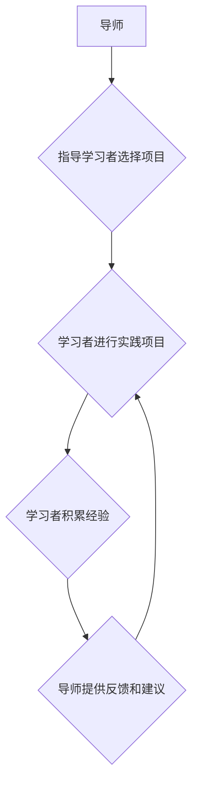

                 

## 知识的隐性传递：导师制与实践学习

> 关键词：导师制、实践学习、知识传递、隐性知识、软件开发、技术传承

## 1. 背景介绍

在瞬息万变的科技世界，知识更新的速度日新月异。对于软件开发领域而言，掌握最新的技术和工具尤为重要。然而，传统的教育模式往往侧重于理论知识的传授，而对实践经验的培养相对不足。在这种背景下，导师制与实践学习模式逐渐成为软件开发人才培养的重要途径。

导师制是一种将经验丰富的技术专家与有潜力的年轻开发者配对，通过一对一指导和知识分享的方式，帮助后者快速成长和提升的技术模式。而实践学习则强调通过实际项目和任务的完成，来积累经验、提升技能和解决问题的能力。

将导师制与实践学习相结合，可以有效弥补传统教育模式的不足，促进知识的隐性传递，帮助开发者更快地掌握实践技能，并融入到软件开发的实际工作中。

## 2. 核心概念与联系

### 2.1 导师制

导师制是一种基于人际关系的知识传递模式，其核心在于经验丰富的导师通过指导、分享和陪伴，帮助有潜力的学习者获得知识、技能和经验。

导师的角色不仅仅是提供技术指导，更重要的是：

* **提供专业知识和技能的指导：** 导师可以分享其在软件开发领域的经验和知识，帮助学习者解决技术难题，并掌握最新的技术趋势。
* **促进学习者的职业发展：** 导师可以帮助学习者制定职业规划，提供职业发展建议，并帮助他们建立人脉关系。
* **提供情感支持和鼓励：** 软件开发是一个充满挑战的领域，导师可以为学习者提供情感支持和鼓励，帮助他们克服困难，保持学习的热情。

### 2.2 实践学习

实践学习是一种以实践为基础的学习模式，其核心在于通过实际操作和项目实践，来积累经验、提升技能和解决问题的能力。

实践学习的优势在于：

* **理论联系实际：** 通过实践操作，学习者可以将理论知识应用到实际场景中，加深理解，并获得更深刻的体会。
* **培养动手能力：** 实践学习可以帮助学习者培养动手能力、解决问题的能力和团队合作能力。
* **快速提升技能：** 通过实践操作，学习者可以快速掌握新的技能和知识，并将其应用到实际工作中。

### 2.3 导师制与实践学习的结合

将导师制与实践学习相结合，可以形成一个高效的知识传递模式。导师可以指导学习者选择合适的实践项目，并提供技术支持和建议。学习者通过实践项目，可以将导师传授的知识和技能应用到实际场景中，并获得宝贵的实践经验。

**Mermaid 流程图**



## 3. 核心算法原理 & 具体操作步骤

### 3.1 算法原理概述

在导师制与实践学习模式下，知识传递的核心是将导师的隐性知识转化为学习者的显性知识。隐性知识是指难以用语言或文字表达的经验、技能和洞察力，而显性知识则是指可以通过语言或文字表达的知识。

将隐性知识转化为显性知识，需要通过以下几个步骤：

* **识别隐性知识：** 导师需要意识到自己所拥有的隐性知识，并将其识别出来。
* **提取关键信息：** 从隐性知识中提取关键信息，并将其转化为可以被学习者理解的语言或文字。
* **构建知识框架：** 将提取的关键信息组织成一个清晰的知识框架，方便学习者理解和记忆。
* **进行实践演练：** 学习者需要通过实践操作，将学习到的知识应用到实际场景中，并不断进行反思和总结。

### 3.2 算法步骤详解

1. **导师与学习者沟通：** 导师需要与学习者进行深入的沟通，了解学习者的学习目标、兴趣和能力水平。
2. **导师分享经验：** 导师可以分享其在软件开发领域的经验和知识，包括技术技巧、项目管理经验、团队合作技巧等。
3. **学习者提问和思考：** 学习者需要积极提问，并对导师分享的内容进行思考和总结。
4. **导师提供指导和反馈：** 导师需要根据学习者的提问和思考，提供具体的指导和反馈，帮助学习者解决问题和提升技能。
5. **学习者进行实践项目：** 学习者需要选择合适的实践项目，并根据导师的指导进行开发和实施。
6. **学习者反思和总结：** 学习者需要在完成实践项目后，进行反思和总结，并与导师进行交流，分享自己的经验和收获。

### 3.3 算法优缺点

**优点：**

* **高效的知识传递：** 导师制与实践学习模式可以有效地将导师的隐性知识转化为学习者的显性知识，并帮助学习者快速掌握实践技能。
* **个性化的学习体验：** 导师可以根据学习者的个体差异，提供个性化的指导和支持，帮助学习者更好地学习和成长。
* **促进团队合作：** 实践项目可以帮助学习者培养团队合作能力，并与其他开发者进行交流和学习。

**缺点：**

* **依赖导师的经验和能力：** 导师制模式的成功取决于导师的经验和能力，如果导师的水平不足，则难以有效地指导学习者。
* **资源分配不均：** 导师制模式需要投入一定的资源，例如导师的培训和时间成本，如果资源分配不均，则可能导致一些学习者无法获得足够的指导和支持。
* **难以量化评估：** 导师制与实践学习模式的成果难以量化评估，需要采用更加灵活和多元的评估方法。

### 3.4 算法应用领域

导师制与实践学习模式广泛应用于软件开发领域，例如：

* **大学课程教学：** 将导师制与实践学习相结合，可以提高软件开发课程的教学效果，帮助学生更快地掌握实践技能。
* **企业内部培训：** 企业可以利用导师制模式，将经验丰富的技术专家与新员工配对，帮助他们快速融入到工作环境中。
* **开源项目开发：** 开源项目可以利用导师制模式，帮助新贡献者更快地融入到项目开发中，并提高项目的开发效率。

## 4. 数学模型和公式 & 详细讲解 & 举例说明

### 4.1 数学模型构建

在导师制与实践学习模式下，我们可以构建一个简单的数学模型来描述知识传递的过程。

假设：

* $K_t$ 表示导师的隐性知识
* $K_l$ 表示学习者的显性知识
* $T$ 表示导师与学习者的互动时间
* $E$ 表示学习者的实践经验

则知识传递过程可以表示为：

$$K_l = f(K_t, T, E)$$

其中，$f$ 是一个复杂的函数，代表知识传递过程中的各种因素的相互作用。

### 4.2 公式推导过程

由于知识传递是一个复杂的非线性过程，很难用简单的公式来精确描述。但是，我们可以通过一些假设和简化，推导出一些基本的公式来理解知识传递的过程。

例如，我们可以假设：

* 导师的隐性知识是固定的，即 $K_t$ 是一个常数。
* 学习者的实践经验是累积的，即 $E$ 是一个递增函数。

在这种情况下，我们可以将公式简化为：

$$K_l = g(T, E)$$

其中，$g$ 是一个函数，代表知识传递过程中的时间和经验的影响。

### 4.3 案例分析与讲解

假设一个导师拥有丰富的软件开发经验，而一个学习者刚开始接触软件开发。

* 在导师的指导下，学习者参与了一个实践项目，并积累了一些实践经验。
* 随着时间的推移，学习者的实践经验不断增加，其显性知识也逐渐提升。

在这个案例中，我们可以看到时间和经验对知识传递起着重要的作用。

## 5. 项目实践：代码实例和详细解释说明

### 5.1 开发环境搭建

为了演示导师制与实践学习模式的应用，我们可以创建一个简单的代码项目，例如一个简单的文本编辑器。

开发环境搭建需要以下步骤：

1. 安装必要的软件工具，例如代码编辑器、编译器和调试器。
2. 创建一个新的项目文件夹，并配置项目环境。
3. 安装项目所需的依赖库。

### 5.2 源代码详细实现

以下是一个简单的文本编辑器代码示例，使用 Python 语言实现：

```python
# 文本编辑器

def main():
    text = ""
    while True:
        print(text)
        command = input("请输入命令 (add, delete, quit): ")
        if command == "add":
            new_text = input("请输入要添加的文本: ")
            text += new_text
        elif command == "delete":
            delete_text = input("请输入要删除的文本: ")
            text = text.replace(delete_text, "")
        elif command == "quit":
            break
        else:
            print("无效命令")

if __name__ == "__main__":
    main()
```

### 5.3 代码解读与分析

这段代码实现了一个简单的文本编辑器功能，包括添加文本、删除文本和退出程序。

* `main()` 函数是程序的主函数，负责控制程序的执行流程。
* `text` 变量存储当前编辑器的文本内容。
* `while True` 循环不断接收用户输入，并执行相应的操作。
* `input()` 函数获取用户输入的命令和文本内容。
* `if-elif-else` 语句根据用户输入的命令执行不同的操作。

### 5.4 运行结果展示

当运行这段代码时，程序会进入一个循环，不断提示用户输入命令。用户可以输入 "add" 命令添加文本，输入 "delete" 命令删除文本，输入 "quit" 命令退出程序。

## 6. 实际应用场景

导师制与实践学习模式在软件开发领域有着广泛的应用场景，例如：

### 6.1 大学课程教学

在大学软件开发课程中，导师制与实践学习模式可以帮助学生更快地掌握实践技能。例如，导师可以指导学生选择合适的项目进行开发，并提供技术支持和建议。学生可以通过实践项目，将课堂所学知识应用到实际场景中，并获得宝贵的实践经验。

### 6.2 企业内部培训

企业可以利用导师制模式，将经验丰富的技术专家与新员工配对，帮助他们快速融入到工作环境中。导师可以指导新员工学习公司的技术规范和开发流程，并帮助他们解决工作中的技术难题。

### 6.3 开源项目开发

开源项目可以利用导师制模式，帮助新贡献者更快地融入到项目开发中，并提高项目的开发效率。导师可以指导新贡献者学习项目的代码规范和开发流程，并帮助他们解决代码问题。

### 6.4 未来应用展望

随着人工智能和虚拟现实技术的不断发展，导师制与实践学习模式将更加智能化和个性化。例如，人工智能可以帮助自动匹配导师和学习者，并根据学习者的学习进度和需求，提供个性化的学习建议和指导。虚拟现实技术可以模拟真实的开发环境，让学习者在虚拟环境中进行实践操作，并获得更沉浸式的学习体验。

## 7. 工具和资源推荐

### 7.1 学习资源推荐

* **在线课程平台：** Coursera、edX、Udemy 等平台提供丰富的软件开发课程，包括理论知识和实践项目。
* **开源社区：** GitHub、GitLab 等开源社区提供大量的开源项目，可以供学习者学习和实践。
* **技术博客和论坛：** Stack Overflow、Medium 等平台上有许多技术博客和论坛，可以帮助学习者解决技术难题和获取技术资讯。

### 7.2 开发工具推荐

* **代码编辑器：** VS Code、Sublime Text、Atom 等代码编辑器可以提高代码编写效率。
* **版本控制系统：** Git 是一个常用的版本控制系统，可以帮助学习者管理代码版本和协同开发。
* **调试器：** 调试器可以帮助学习者查找和解决代码中的错误。

### 7.3 相关论文推荐

* **"The Role of Mentorship in Software Engineering Education"**
* **"A Study of the Effectiveness of Mentorship Programs in Software Development"**
* **"Mentoring in Open Source Software Development"**

## 8. 总结：未来发展趋势与挑战

### 8.1 研究成果总结

导师制与实践学习模式在软件开发领域取得了显著的成果，有效地提升了学习者的实践技能和工作效率。

### 8.2 未来发展趋势

未来，导师制与实践学习模式将更加智能化和个性化，人工智能和虚拟现实技术将为其提供更强大的支持。

### 8.3 面临的挑战

导师制与实践学习模式也面临一些挑战，例如：

* **导师资源的短缺：** 经验丰富的技术专家往往时间有限，难以承担导师的角色。
* **评估机制的完善：** 导师制与实践学习模式的成果难以量化评估，需要开发更加完善的评估机制。
* **技术变革的快速迭代：** 软件开发领域技术变革速度快，导师需要不断学习和更新知识，才能有效地指导学习者。

### 8.4 研究展望

未来，需要进一步研究导师制与实践学习模式的最佳实践，开发更加智能化和个性化的学习平台，并探索新的评估机制，以更好地促进软件开发人才的培养。

## 9. 附录：常见问题与解答

### 9.1 如何找到合适的导师？

* 可以通过学校、公司内部或开源社区寻找导师。
* 可以参加技术会议和活动，与技术专家进行交流。
* 可以通过在线平台寻找导师，例如 MentorCruise、Codementor 等。

### 9.2 如何与导师进行有效沟通？

* 提前准备好问题清单，并明确自己的学习目标。
* 积极倾听导师的建议，并提出自己的疑问。
* 定期与导师进行交流，汇报自己的学习进度和遇到的问题。

### 9.3 如何评估导师制与实践学习模式的成果？

* 可以通过学习者的技能提升、项目成果和工作表现进行评估。
* 可以通过问卷调查和访谈了解学习者的学习体验和感受。
* 可以通过跟踪学习者的职业发展轨迹，评估导师制与实践学习模式的长期影响。


作者：禅与计算机程序设计艺术 / Zen and the Art of Computer Programming<end_of_turn>

