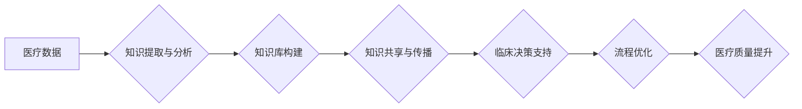

                 

## 知识管理在医疗质量改进中的作用

> 关键词：知识管理、医疗质量、数据分析、人工智能、流程优化、临床决策支持、医疗信息系统、知识共享、经验传承

## 1. 背景介绍

医疗行业正处于数字化转型和智能化升级的关键时期。随着医疗数据的爆炸式增长和人工智能技术的快速发展，如何有效地管理和利用医疗知识，提升医疗质量和患者体验，成为摆在医疗机构面前的重大挑战。

传统医疗模式中，医疗知识主要依靠医师经验积累和临床实践传承，存在着知识碎片化、信息孤岛化、知识更新缓慢等问题。而知识管理（Knowledge Management，KM）作为一种系统化的知识获取、存储、共享和应用的体系，为医疗质量改进提供了新的思路和方法。

## 2. 核心概念与联系

知识管理的核心在于将医疗机构内的知识资源整合起来，形成一个可共享、可利用的知识库，并通过各种技术手段和流程优化，将知识转化为实际的行动，最终提升医疗质量。

**知识管理在医疗质量改进中的作用**



**核心概念原理和架构**

* **知识提取与分析:** 利用自然语言处理、机器学习等技术，从海量医疗数据中提取有价值的知识，如疾病诊断、治疗方案、药物副作用等。
* **知识库构建:** 将提取的知识进行组织、分类、存储，构建一个可查询、可检索的知识库，方便医护人员获取和利用。
* **知识共享与传播:** 通过医疗信息系统、移动应用等平台，实现知识的共享和传播，打破信息孤岛，促进医护人员之间的协作。
* **临床决策支持:** 基于知识库，为医护人员提供个性化的诊断建议、治疗方案推荐等，辅助临床决策，提高诊断准确率和治疗效果。
* **流程优化:** 分析医疗流程中的瓶颈和问题，利用知识管理工具和方法，优化医疗流程，提高效率和患者体验。

## 3. 核心算法原理 & 具体操作步骤

### 3.1  算法原理概述

知识管理在医疗质量改进中，主要依赖于数据分析和机器学习算法。这些算法可以帮助我们从海量医疗数据中提取有价值的知识，并将其应用于临床决策支持、流程优化等领域。

常见的算法包括：

* **文本挖掘算法:** 用于从医疗文本数据中提取关键词、主题、关系等信息，如TF-IDF、LDA主题模型等。
* **机器学习算法:** 用于构建预测模型，例如疾病诊断、治疗效果预测等，如决策树、支持向量机、神经网络等。
* **关联规则挖掘算法:** 用于发现医疗数据中的关联规则，例如药物组合、疾病并发症等，如Apriori算法、FP-Growth算法等。

### 3.2  算法步骤详解

以文本挖掘算法为例，其具体操作步骤如下：

1. **数据预处理:** 清洗和格式化医疗文本数据，去除停用词、标点符号等，并进行分词处理。
2. **特征提取:** 利用词频统计、词向量等方法，将文本数据转换为数字特征向量。
3. **模型训练:** 选择合适的文本挖掘算法，并利用训练数据进行模型训练。
4. **模型评估:** 利用测试数据评估模型的性能，例如准确率、召回率等。
5. **知识提取:** 将训练好的模型应用于新的医疗文本数据，提取有价值的知识信息。

### 3.3  算法优缺点

**优点:**

* 可以从海量医疗数据中自动提取知识，提高效率。
* 可以发现隐藏的知识模式，提供新的见解。
* 可以帮助医护人员进行更精准的诊断和治疗。

**缺点:**

* 需要大量的训练数据，且数据质量对算法性能影响较大。
* 算法本身存在一定的局限性，无法完全替代医生的专业判断。
* 知识提取结果需要人工审核和验证。

### 3.4  算法应用领域

* **疾病诊断:** 利用文本挖掘算法分析患者病历、症状描述等信息，辅助医生进行疾病诊断。
* **治疗方案推荐:** 基于机器学习算法，根据患者的病情、病史等信息，推荐个性化的治疗方案。
* **药物副作用预测:** 利用关联规则挖掘算法，发现药物组合或药物与疾病之间的关联，预测药物副作用。
* **医疗流程优化:** 分析医疗流程中的数据，发现瓶颈和问题，优化流程，提高效率。

## 4. 数学模型和公式 & 详细讲解 & 举例说明

### 4.1  数学模型构建

知识管理在医疗质量改进中，可以利用数学模型来量化知识价值、评估知识库质量、预测知识传播效果等。

例如，我们可以利用信息熵来衡量知识库的丰富程度：

$$H(X) = - \sum_{i=1}^{n} p(x_i) \log_2 p(x_i)$$

其中：

* $H(X)$ 表示知识库的信息熵。
* $n$ 表示知识库中知识项的总数。
* $p(x_i)$ 表示知识项 $x_i$ 在知识库中的概率。

信息熵越大，知识库的丰富程度越高。

### 4.2  公式推导过程

上述公式的推导过程基于信息论的基本原理。信息熵的定义是衡量随机变量不确定性的度量。

在知识库中，每个知识项都代表着一个随机事件，其概率为该知识项在知识库中的出现频率。

信息熵的公式通过计算每个知识项的信息量（即其概率的对数）的加权平均值，来衡量整个知识库的不确定性。

### 4.3  案例分析与讲解

假设一个知识库包含以下知识项：

* 知识项 1：糖尿病
* 知识项 2：高血压
* 知识项 3：冠心病

其概率分布为：

* $p(x_1) = 0.3$
* $p(x_2) = 0.4$
* $p(x_3) = 0.3$

则该知识库的信息熵为：

$$H(X) = - (0.3 \log_2 0.3 + 0.4 \log_2 0.4 + 0.3 \log_2 0.3) \approx 1.48$$

该知识库的信息熵为 1.48，表明该知识库的知识丰富程度较高。

## 5. 项目实践：代码实例和详细解释说明

### 5.1  开发环境搭建

* 操作系统：Windows/Linux/macOS
* 编程语言：Python
* 开发工具：Jupyter Notebook、VS Code等
* 库依赖：NLTK、Scikit-learn、Pandas等

### 5.2  源代码详细实现

```python
# 导入必要的库
import nltk
from sklearn.feature_extraction.text import TfidfVectorizer

# 加载医疗文本数据
text_data = [
    "患者男性，35岁，主诉头痛、恶心、呕吐。",
    "患者女性，40岁，主诉胸痛、气短。",
    "患者男性，50岁，主诉高血压、糖尿病。",
]

# 使用 TF-IDF 向量化
vectorizer = TfidfVectorizer()
tfidf_matrix = vectorizer.fit_transform(text_data)

# 打印 TF-IDF 矩阵
print(tfidf_matrix.toarray())
```

### 5.3  代码解读与分析

* 该代码首先导入必要的库，包括自然语言处理库 NLTK 和机器学习库 Scikit-learn。
* 然后，加载医疗文本数据，并使用 TF-IDF 向量化方法将文本数据转换为数字特征向量。
* 最后，打印 TF-IDF 矩阵，展示每个文本数据在不同关键词上的权重。

### 5.4  运行结果展示

运行该代码后，会输出一个 TF-IDF 矩阵，其中每个元素代表一个文本数据在某个关键词上的权重。

例如，如果某个文本数据包含关键词 "头痛"，则该文本数据在 "头痛" 关键词上的权重会较高。

## 6. 实际应用场景

### 6.1  临床决策支持系统

知识管理技术可以用于构建临床决策支持系统，为医护人员提供个性化的诊断建议、治疗方案推荐等，辅助临床决策，提高诊断准确率和治疗效果。

例如，可以利用知识库中的疾病症状、治疗方案等信息，根据患者的病情和病史，为医生提供可能的诊断和治疗方案，并给出相应的证据支持。

### 6.2  医疗流程优化

知识管理技术可以分析医疗流程中的数据，发现瓶颈和问题，优化流程，提高效率和患者体验。

例如，可以利用知识库中的患者就诊流程、医护人员工作时间等信息，分析流程中的冗余环节和等待时间，并提出相应的优化方案。

### 6.3  医疗知识共享平台

知识管理技术可以构建医疗知识共享平台，方便医护人员之间分享经验、交流学习，促进医疗知识的传承和创新。

例如，可以利用知识库中的病例分析、手术视频等资源，为医护人员提供学习和交流平台，促进医疗知识的传播和应用。

### 6.4  未来应用展望

随着人工智能技术的不断发展，知识管理在医疗质量改进中的应用前景更加广阔。

未来，我们可以期待：

* 更智能的知识提取和分析算法，能够从更复杂、更丰富的医疗数据中提取更精准的知识。
* 更个性化的临床决策支持系统，能够根据患者的个体差异，提供更精准的诊断和治疗建议。
* 更高效的医疗流程优化，能够大幅提高医疗效率和患者体验。
* 更广泛的医疗知识共享平台，能够促进医疗知识的传播和应用，推动医疗行业的进步。

## 7. 工具和资源推荐

### 7.1  学习资源推荐

* **书籍:**
    * 《知识管理：理论与实践》
    * 《知识管理的未来》
* **在线课程:**
    * Coursera 上的知识管理课程
    * edX 上的知识管理课程

### 7.2  开发工具推荐

* **Jupyter Notebook:** 用于数据分析和机器学习开发
* **VS Code:** 用于代码编辑和调试
* **Python:** 用于数据分析和机器学习开发

### 7.3  相关论文推荐

* **"Knowledge Management in Healthcare: A Systematic Review"**
* **"The Role of Artificial Intelligence in Knowledge Management for Healthcare"**

## 8. 总结：未来发展趋势与挑战

### 8.1  研究成果总结

知识管理在医疗质量改进方面取得了显著的成果，例如：

* 提高了诊断准确率和治疗效果
* 优化了医疗流程，提高了效率
* 促进了医疗知识的共享和传承

### 8.2  未来发展趋势

未来，知识管理在医疗质量改进方面将朝着以下方向发展：

* 更智能的知识提取和分析算法
* 更个性化的临床决策支持系统
* 更高效的医疗流程优化
* 更广泛的医疗知识共享平台

### 8.3  面临的挑战

知识管理在医疗质量改进方面也面临着一些挑战：

* 医疗数据的多样性和复杂性
* 知识的隐私性和安全问题
* 知识管理技术的应用成本
* 医疗机构的文化和组织结构

### 8.4  研究展望

未来，我们需要继续加强对知识管理技术的研发，探索更有效的知识提取、分析和应用方法，并推动知识管理技术的应用推广，以更好地服务于医疗质量改进。

## 9. 附录：常见问题与解答

**1. 知识管理和医疗信息系统有什么区别？**

知识管理侧重于知识的获取、存储、共享和应用，而医疗信息系统侧重于医疗数据的管理和处理。两者可以相互补充，共同促进医疗质量改进。

**2. 如何保证知识库的准确性和可靠性？**

知识库的准确性和可靠性需要通过多方面的措施来保证，例如：

* 采用严格的数据采集和清洗流程
* 邀请专家进行知识库的审核和验证
* 建立知识库的更新机制，及时修正错误和补充新知识

**3. 知识管理技术的应用成本如何？**

知识管理技术的应用成本取决于具体的应用场景和技术方案。一般来说，需要考虑以下成本：

* 软件和硬件成本
* 人员培训成本
* 数据管理成本

**4. 知识管理技术如何解决医疗知识的隐私和安全问题？**

在应用知识管理技术时，需要采取相应的措施来保护医疗知识的隐私和安全，例如：

* 加密敏感数据
* 控制数据访问权限
* 建立数据备份和恢复机制


作者：禅与计算机程序设计艺术 / Zen and the Art of Computer Programming 
<end_of_turn>

