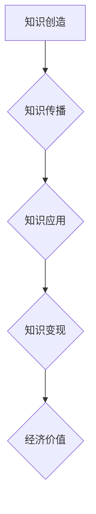

                 

## 知识经济下知识变现的多元化路径

> 关键词：知识经济、知识变现、知识产权、数字平台、人工智能、数据驱动、商业模式创新

### 1. 背景介绍

知识经济时代，知识已成为最宝贵的生产要素，其价值远超物质财富。知识的创造、传播和应用，成为推动经济发展和社会进步的引擎。然而，知识本身并不能直接带来收益，需要通过有效的变现路径才能转化为经济价值。

传统知识变现模式主要依赖于知识产权的保护和授权，例如专利、版权、商标等。但随着互联网和数字技术的快速发展，知识的获取和传播成本大幅降低，传统知识产权保护模式面临挑战。同时，知识的价值也更加多元化，不仅体现在知识本身，还体现在知识的应用、衍生产品和服务等方面。

因此，知识经济下，知识变现需要探索更加多元化、灵活化的路径，以适应新的时代需求。

### 2. 核心概念与联系

**2.1 知识经济**

知识经济是指以知识为主要生产要素、以知识创造、传播和应用为核心驱动的经济形态。其特征是：

* **知识驱动:** 知识成为生产、流通和消费的主要驱动力。
* **创新为本:** 知识创新是经济增长的主要动力。
* **信息化:** 信息技术是知识经济发展的重要基础。
* **服务化:** 服务业成为知识经济的主导产业。

**2.2 知识变现**

知识变现是指将知识转化为经济价值的过程。它包括知识的创造、传播、应用和商业化等环节。

**2.3 数字平台**

数字平台是指基于互联网技术构建的，提供信息、服务和交易的在线平台。数字平台为知识的传播和变现提供了重要的基础设施。

**2.4 人工智能**

人工智能是指模拟人类智能的计算机系统。人工智能技术可以帮助人们更高效地创造、管理和利用知识。

**2.5 数据驱动**

数据驱动是指利用数据分析和挖掘技术，为决策提供依据。数据驱动可以帮助人们更好地理解知识的价值和应用场景。

**2.6 商业模式创新**

商业模式创新是指探索新的商业模式，以适应知识经济的变革。

**2.7 流程图**



### 3. 核心算法原理 & 具体操作步骤

**3.1 算法原理概述**

知识变现算法的核心是将知识转化为可量化的价值，并通过算法模型进行优化和匹配。常见的算法包括：

* **知识图谱算法:** 建立知识图谱，将知识点和关系进行结构化表示，方便知识的检索和推理。
* **推荐算法:** 基于用户行为和知识特征，推荐相关知识和服务。
* **定价算法:** 根据知识的价值、市场需求和竞争情况，制定合理的知识价格。
* **版权保护算法:** 利用区块链技术等，保障知识产权的完整性和可追溯性。

**3.2 算法步骤详解**

1. **知识收集和整理:** 收集各种形式的知识数据，并进行整理和清洗。
2. **知识表示和建模:** 将知识数据转化为可处理的格式，例如知识图谱、文本向量等。
3. **算法模型训练:** 利用机器学习等技术，训练知识变现算法模型。
4. **知识匹配和推荐:** 根据用户需求和算法模型预测，匹配和推荐相关知识和服务。
5. **知识交易和变现:** 提供知识交易平台，实现知识的购买、授权和共享。

**3.3 算法优缺点**

* **优点:** 提高知识的发现性和利用效率，降低知识变现成本，促进知识的流通和共享。
* **缺点:** 算法模型的准确性依赖于数据质量，算法本身也可能存在偏差和局限性。

**3.4 算法应用领域**

* **教育培训:** 个性化推荐学习资源，提高学习效率。
* **科研开发:** 促进知识共享和协同创新，加速科技进步。
* **医疗健康:** 提供精准医疗服务，辅助疾病诊断和治疗。
* **文化娱乐:** 推广文化产品，满足个性化需求。

### 4. 数学模型和公式 & 详细讲解 & 举例说明

**4.1 数学模型构建**

知识变现的数学模型可以基于价值理论、信息经济学等理论构建。例如，可以构建一个知识价值评估模型，将知识的创造成本、市场需求、知识寿命等因素考虑进去，计算出知识的潜在价值。

**4.2 公式推导过程**

假设知识的价值可以表示为以下公式：

$$V = f(C, D, L)$$

其中：

* $V$ 表示知识的价值
* $C$ 表示知识的创造成本
* $D$ 表示知识的市场需求
* $L$ 表示知识的寿命

我们可以根据具体情况，对公式进行进一步推导和完善。例如，可以引入知识的独特性、适用范围、知识传播效率等因素，构建更加复杂的模型。

**4.3 案例分析与讲解**

例如，假设一个新的医疗技术专利，其创造成本为 $100 万美元，市场需求为 $500 万美元，知识寿命为 10 年。根据上述公式，我们可以计算出该知识的潜在价值为：

$$V = f(100, 500, 10)$$

通过对公式进行具体数值代入和计算，我们可以得到该知识的价值评估结果。

### 5. 项目实践：代码实例和详细解释说明

**5.1 开发环境搭建**

* 操作系统: Ubuntu 20.04
* 编程语言: Python 3.8
* 开发工具: Jupyter Notebook
* 库依赖: pandas, numpy, scikit-learn

**5.2 源代码详细实现**

```python
import pandas as pd
from sklearn.model_selection import train_test_split
from sklearn.linear_model import LinearRegression

# 加载知识数据
data = pd.read_csv("knowledge_data.csv")

# 选择特征和目标变量
features = ["创造成本", "市场需求", "知识寿命"]
target = "知识价值"

# 将数据分割为训练集和测试集
X_train, X_test, y_train, y_test = train_test_split(data[features], data[target], test_size=0.2)

# 训练线性回归模型
model = LinearRegression()
model.fit(X_train, y_train)

# 评估模型性能
# ...

# 使用模型预测知识价值
# ...
```

**5.3 代码解读与分析**

* 代码首先加载知识数据，并选择特征和目标变量。
* 然后将数据分割为训练集和测试集，用于训练和评估模型。
* 使用线性回归模型训练数据，并评估模型性能。
* 最后，可以使用训练好的模型预测新的知识价值。

**5.4 运行结果展示**

运行结果将显示模型的训练情况、评估指标以及对新知识的价值预测。

### 6. 实际应用场景

**6.1 教育培训**

* 个性化推荐学习资源，例如根据学生的学习进度和兴趣推荐相关的课程、书籍和练习题。
* 提供在线知识竞赛和问答平台，激发学生的学习兴趣和竞争意识。

**6.2 科研开发**

* 建立知识共享平台，促进科研人员之间的知识交流和合作。
* 利用知识图谱技术，挖掘科研成果中的潜在关联和价值。

**6.3 医疗健康**

* 提供个性化医疗服务，例如根据患者的病史和基因信息，推荐合适的治疗方案。
* 利用人工智能技术，辅助医生进行疾病诊断和治疗决策。

**6.4 文化娱乐**

* 推广文化产品，例如通过推荐算法，将用户感兴趣的文化产品推荐给用户。
* 提供个性化娱乐体验，例如根据用户的喜好，推荐相关的电影、音乐和游戏。

**6.5 未来应用展望**

随着人工智能、大数据和区块链技术的不断发展，知识变现的路径将更加多元化和智能化。例如：

* 基于人工智能的知识生成和创作，例如利用人工智能技术，自动生成新闻报道、诗歌、音乐等。
* 基于区块链技术的知识版权保护和交易，例如利用区块链技术，保障知识产权的完整性和可追溯性，实现知识的去中心化交易。
* 基于虚拟现实和增强现实技术的知识体验，例如利用虚拟现实和增强现实技术，创造沉浸式的知识学习和体验环境。

### 7. 工具和资源推荐

**7.1 学习资源推荐**

* **书籍:**

    * 《知识经济》 - 彼得·德鲁克
    * 《知识管理》 - 杰夫·斯蒂芬斯
    * 《数据驱动决策》 - 迈克尔·哈里斯

* **在线课程:**

    * Coursera: 知识经济与创新
    * edX: 数据科学与机器学习
    * Udemy: 知识管理与知识共享

**7.2 开发工具推荐**

* **知识图谱工具:** Neo4j, GraphDB
* **机器学习库:** scikit-learn, TensorFlow, PyTorch
* **数据分析工具:** pandas, NumPy, matplotlib

**7.3 相关论文推荐**

* **知识经济与知识变现:**

    * Nonaka, I., & Takeuchi, H. (1995). The knowledge-creating company. Oxford University Press.
    * Teece, D. J. (2007). Business models, business strategy and innovation. Long range planning, 40(10), 172-194.

* **人工智能与知识变现:**

    * Bengio, Y., Goodfellow, I., & Courville, A. (2016). Deep learning. MIT press.
    * LeCun, Y., Bengio, Y., & Hinton, G. (2015). Deep learning. Nature, 521(7553), 436-444.

### 8. 总结：未来发展趋势与挑战

**8.1 研究成果总结**

知识经济下，知识变现的路径正在不断探索和创新。人工智能、大数据和区块链技术等新兴技术的应用，为知识变现提供了新的机遇和可能性。

**8.2 未来发展趋势**

* **知识变现模式的创新:** 探索更加灵活、高效、公平的知识变现模式，例如知识共享平台、知识众包、知识租赁等。
* **人工智能技术的应用:** 利用人工智能技术，提高知识的发现、匹配和利用效率，实现知识的智能化变现。
* **数据驱动的知识价值评估:** 利用数据分析和挖掘技术，更加准确地评估知识的价值，为知识变现提供科学依据。

**8.3 面临的挑战**

* **知识产权保护:** 如何有效保护知识产权，防止知识盗窃和滥用，是知识变现面临的重大挑战。
* **数据安全和隐私:** 知识变现需要大量的数据支持，如何保障数据安全和用户隐私，是需要认真考虑的问题。
* **知识价值评估的难点:** 知识的价值是多方面的，难以量化，如何建立更加科学、准确的知识价值评估模型，是需要进一步研究的问题。

**8.4 研究展望**

未来，知识变现的研究将更加注重以下几个方面：

* **探索更加多元化的知识变现模式:** 
* **利用人工智能技术，实现知识的智能化变现:** 
* **建立更加科学、准确的知识价值评估模型:** 
* **研究知识变现对社会经济的影响:** 


### 9. 附录：常见问题与解答

**9.1 如何保护知识产权？**

* **申请专利:** 对发明创造进行专利保护，防止他人侵权。
* **注册商标:** 对品牌名称、标志等进行商标注册，防止他人冒用。
* **版权登记:** 对文学、艺术作品进行版权登记，防止他人侵权。
* **签订知识产权许可协议:** 将知识产权授权给他人使用，并明确使用范围、期限和报酬等条款。

**9.2 如何评估知识的价值？**

知识的价值是一个复杂的概念，需要综合考虑多种因素，例如：

* **知识的独特性:** 知识是否具有独特性和创新性。
* **知识的适用范围:** 知识可以应用于哪些领域和场景。
* **知识的市场需求:** 知识是否符合市场需求，是否有潜在的应用价值。
* **知识的寿命:** 知识的有效期有多长，是否会随着时间的推移而贬值。

**9.3 如何利用人工智能技术进行知识变现？**

* **知识推荐:** 利用人工智能技术，根据用户的兴趣和需求，推荐相关的知识资源。
* **知识生成:** 利用人工智能技术，自动生成新的知识，例如新闻报道、诗歌、音乐等。
* **知识翻译:** 利用人工智能技术，将知识从一种语言翻译成另一种语言，扩大知识的传播范围。

**9.4 未来知识变现的趋势是什么？**

未来知识变现的趋势将更加多元化、智能化和个性化。例如：

* **知识共享平台:** 更加普及和完善的知识共享平台，促进知识的自由流通和共享。
* **知识众包:** 利用众包平台，将知识的创造和传播任务交给大众，激发更多人的参与和贡献。
* **知识租赁:** 将知识作为一种服务，提供知识租赁模式，满足用户临时性的知识需求。


作者：禅与计算机程序设计艺术 / Zen and the Art of Computer Programming 
<end_of_turn>

