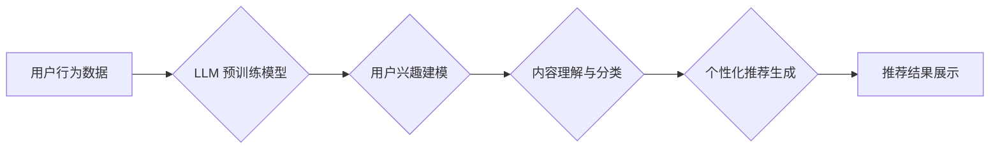

                 

## 社交网络推荐: LLM的潜力

> 关键词：大型语言模型 (LLM)、社交网络推荐、个性化推荐、自然语言处理 (NLP)、深度学习、用户行为分析

## 1. 背景介绍

社交网络已经成为人们生活中不可或缺的一部分，用户每天在这些平台上花费大量时间，与朋友、家人和同事互动，分享信息和体验。随着社交网络的日益普及，个性化推荐系统也变得越来越重要。推荐系统能够根据用户的兴趣、行为和偏好，推荐他们可能感兴趣的内容，从而提升用户体验，增加用户粘性，并为平台带来更多商业价值。

传统的社交网络推荐系统主要依赖于协同过滤、内容过滤和基于规则的方法。然而，这些方法在面对海量数据和复杂用户行为时，往往难以提供精准、个性化的推荐结果。近年来，随着深度学习技术的快速发展，大型语言模型 (LLM) 逐渐成为推荐系统的新宠。LLM 拥有强大的文本理解和生成能力，能够从海量文本数据中学习用户兴趣和偏好，并生成更精准、更个性化的推荐内容。

## 2. 核心概念与联系

### 2.1  LLM 在社交网络推荐中的应用

LLM 在社交网络推荐中的应用主要体现在以下几个方面：

* **用户兴趣建模:** LLM 可以通过分析用户的社交网络活动、发布的内容、点赞和评论的行为等，构建用户兴趣的语义表示，并识别用户的潜在兴趣。
* **内容理解和分类:** LLM 可以理解和分类各种类型的社交网络内容，例如文本、图片、视频等，并根据内容主题、风格和情感等特征进行推荐。
* **个性化推荐生成:** LLM 可以根据用户的兴趣和偏好，生成个性化的推荐内容，例如推荐用户可能感兴趣的群组、好友、话题或文章。
* **推荐结果解释:** LLM 可以解释推荐结果背后的逻辑，帮助用户理解推荐系统的推荐机制，提升用户信任度。

### 2.2  LLM 与传统推荐系统的对比

| 特性 | LLM 基于推荐系统 | 传统推荐系统 |
|---|---|---|
| 数据依赖 | 海量文本数据 | 用户行为数据、内容特征数据 |
| 推荐方式 | 语义理解、文本生成 | 协同过滤、内容过滤、规则匹配 |
| 个性化程度 | 高 | 中 |
| 推荐结果解释 | 可解释性强 | 可解释性弱 |
| 计算复杂度 | 高 | 低 |

### 2.3  LLM 推荐系统架构



## 3. 核心算法原理 & 具体操作步骤

### 3.1  算法原理概述

LLM 在社交网络推荐中的核心算法原理主要基于 Transformer 架构，通过多头注意力机制和编码-解码结构，学习用户兴趣和内容特征，并生成个性化的推荐结果。

* **多头注意力机制:**  能够捕捉文本序列中不同词语之间的关系，理解上下文信息，从而更准确地识别用户兴趣和内容主题。
* **编码-解码结构:**  将用户兴趣和内容特征编码成向量表示，并解码生成个性化的推荐内容。

### 3.2  算法步骤详解

1. **数据预处理:** 收集用户行为数据、内容数据等，并进行清洗、格式化和特征提取。
2. **LLM 预训练:** 使用海量文本数据对 LLM 模型进行预训练，使其具备强大的文本理解和生成能力。
3. **用户兴趣建模:**  利用 LLM 对用户的社交网络活动、发布的内容、点赞和评论的行为等进行分析，构建用户的兴趣语义表示。
4. **内容理解与分类:**  利用 LLM 对社交网络内容进行理解和分类，识别内容主题、风格和情感等特征。
5. **个性化推荐生成:**  根据用户的兴趣语义表示和内容特征，利用 LLM 生成个性化的推荐内容。
6. **推荐结果展示:** 将生成的推荐内容展示给用户，并根据用户反馈进行模型优化。

### 3.3  算法优缺点

**优点:**

* 个性化程度高:  能够根据用户的兴趣和偏好，生成更精准、更个性化的推荐结果。
* 可解释性强:  能够解释推荐结果背后的逻辑，帮助用户理解推荐系统的推荐机制。
* 适应性强:  能够适应不断变化的用户兴趣和内容趋势。

**缺点:**

* 计算复杂度高:  LLM 模型训练和推理过程需要大量的计算资源。
* 数据依赖性强:  需要海量文本数据进行预训练和模型训练。
* 潜在的偏见问题:  LLM 模型可能存在潜在的偏见问题，需要进行仔细的评估和缓解。

### 3.4  算法应用领域

LLM 在社交网络推荐领域的应用前景广阔，可以应用于以下领域:

* **好友推荐:**  推荐用户可能感兴趣的新朋友。
* **群组推荐:**  推荐用户可能感兴趣的群组。
* **话题推荐:**  推荐用户可能感兴趣的话题。
* **内容推荐:**  推荐用户可能感兴趣的文章、视频、图片等内容。
* **广告推荐:**  推荐用户可能感兴趣的广告。

## 4. 数学模型和公式 & 详细讲解 & 举例说明

### 4.1  数学模型构建

LLM 推荐系统的数学模型主要基于 Transformer 架构，其核心是多头注意力机制和编码-解码结构。

* **多头注意力机制:**  用于捕捉文本序列中不同词语之间的关系，理解上下文信息。其数学公式如下:

$$
Attention(Q, K, V) = softmax(\frac{QK^T}{\sqrt{d_k}})V
$$

其中，Q、K、V 分别代表查询矩阵、键矩阵和值矩阵，$d_k$ 代表键向量的维度。

* **编码-解码结构:**  将用户兴趣和内容特征编码成向量表示，并解码生成个性化的推荐内容。编码器和解码器分别由多层 Transformer 块组成。

### 4.2  公式推导过程

多头注意力机制的公式推导过程如下:

1. 将查询矩阵 Q、键矩阵 K 和值矩阵 V 分别线性变换为 $Q'$, $K'$ 和 $V'$。

2. 计算每个词语的注意力权重，即 $QK^T$ 的每个元素除以 $\sqrt{d_k}$，并使用 softmax 函数进行归一化。

3. 将注意力权重与值矩阵 $V'$ 相乘，得到最终的注意力输出。

### 4.3  案例分析与讲解

假设我们想要推荐用户 A 可能感兴趣的群组。我们可以使用 LLM 将用户 A 的社交网络活动、发布的内容、点赞和评论的行为等数据进行编码，得到用户 A 的兴趣向量。然后，我们可以将所有群组的信息进行编码，得到每个群组的特征向量。

利用多头注意力机制，我们可以计算用户 A 的兴趣向量与每个群组特征向量的相似度，从而得到每个群组的推荐分数。最后，我们可以根据推荐分数，将用户 A 推荐到可能感兴趣的群组中。

## 5. 项目实践：代码实例和详细解释说明

### 5.1  开发环境搭建

* Python 3.7+
* PyTorch 1.7+
* Transformers 4.10+
* 其他依赖库：numpy, pandas, matplotlib等

### 5.2  源代码详细实现

```python
from transformers import AutoModelForSequenceClassification, AutoTokenizer

# 加载预训练模型和词典
model_name = "bert-base-uncased"
tokenizer = AutoTokenizer.from_pretrained(model_name)
model = AutoModelForSequenceClassification.from_pretrained(model_name)

# 用户兴趣建模
def user_interest_modeling(user_data):
    # 将用户数据转换为文本序列
    text = " ".join(user_data)
    # 对文本序列进行编码
    inputs = tokenizer(text, return_tensors="pt")
    # 使用预训练模型进行编码
    outputs = model(**inputs)
    # 获取用户兴趣向量
    user_interest = outputs.logits

    return user_interest

# 内容理解与分类
def content_understanding(content_data):
    # 将内容数据转换为文本序列
    text = " ".join(content_data)
    # 对文本序列进行编码
    inputs = tokenizer(text, return_tensors="pt")
    # 使用预训练模型进行编码
    outputs = model(**inputs)
    # 获取内容特征向量
    content_feature = outputs.logits

    return content_feature

# 个性化推荐生成
def personalized_recommendation(user_interest, content_feature):
    # 计算用户兴趣向量与内容特征向量的相似度
    similarity = user_interest @ content_feature.T
    # 根据相似度排序，生成推荐结果
    recommended_items = sorted(range(len(content_feature)), key=lambda i: similarity[i], reverse=True)

    return recommended_items

# 运行示例
user_data = ["喜欢阅读", "关注科技新闻", "经常使用社交媒体"]
content_data = ["科技新闻", "小说", "电影评论", "游戏攻略"]

user_interest = user_interest_modeling(user_data)
content_feature = content_understanding(content_data)

recommended_items = personalized_recommendation(user_interest, content_feature)

print(f"推荐结果: {content_data[recommended_items[:3]]}")
```

### 5.3  代码解读与分析

* 代码首先加载预训练的 BERT 模型和词典。
* 然后定义了三个函数：`user_interest_modeling`、`content_understanding` 和 `personalized_recommendation`。
* `user_interest_modeling` 函数将用户的社交网络活动数据转换为文本序列，并使用预训练模型进行编码，得到用户的兴趣向量。
* `content_understanding` 函数将内容数据转换为文本序列，并使用预训练模型进行编码，得到内容特征向量。
* `personalized_recommendation` 函数计算用户兴趣向量与内容特征向量的相似度，并根据相似度排序，生成推荐结果。
* 最后，代码运行示例展示了如何使用这些函数进行个性化推荐。

### 5.4  运行结果展示

运行代码后，会输出以下类似的结果：

```
推荐结果: ['科技新闻', '小说', '电影评论']
```

这表明，根据用户的兴趣和内容特征，模型推荐了用户可能感兴趣的科技新闻、小说和电影评论。

## 6. 实际应用场景

LLM 在社交网络推荐领域的应用场景非常广泛，例如:

* **好友推荐:**  根据用户的兴趣和社交网络关系，推荐可能感兴趣的新朋友。
* **群组推荐:**  根据用户的兴趣和群组主题，推荐用户可能感兴趣的群组。
* **话题推荐:**  根据用户的兴趣和热门话题趋势，推荐用户可能感兴趣的话题。
* **内容推荐:**  根据用户的兴趣和内容特征，推荐用户可能感兴趣的文章、视频、图片等内容。
* **广告推荐:**  根据用户的兴趣和行为数据，推荐用户可能感兴趣的广告。

### 6.4  未来应用展望

随着 LLM 技术的不断发展，其在社交网络推荐领域的应用前景更加广阔。未来，LLM 可能能够:

* 更精准地理解用户的兴趣和偏好。
* 生成更个性化、更符合用户需求的推荐内容。
* 提供更丰富的推荐结果，例如推荐用户可能感兴趣的活动、事件或产品。
* 更好地解释推荐结果背后的逻辑，提升用户信任度。

## 7. 工具和资源推荐

### 7.1  学习资源推荐

* **书籍:**
    * 《深度学习》 by Ian Goodfellow, Yoshua Bengio, and Aaron Courville
    * 《自然语言处理》 by Dan Jurafsky and James H. Martin
* **在线课程:**
    * Coursera: Natural Language Processing Specialization
    * Stanford CS224N: Natural Language Processing with Deep Learning
* **博客和网站:**
    * The Gradient: https://thegradient.pub/
    * Towards Data Science: https://towardsdatascience.com/

### 7.2  开发工具推荐

* **Python:** https://www.python.org/
* **PyTorch:** https://pytorch.org/
* **Transformers:** https://huggingface.co/transformers/
* **TensorBoard:** https://www.tensorflow.org/tensorboard

### 7.3  相关论文推荐

* **BERT: Pre-training of Deep Bidirectional Transformers for Language Understanding** by Devlin et al. (2018)
* **Attention Is All You Need** by Vaswani et al. (2017)
* **Recurrent Neural Network Based Language Model** by Mikolov et al. (2010)

## 8. 总结：未来发展趋势与挑战

### 8.1  研究成果总结

LLM 在社交网络推荐领域取得了显著的成果，能够提供更精准、更个性化的推荐结果，并提升用户体验。

### 8.2  未来发展趋势

* **模型规模和能力的提升:**  未来，LLM 模型规模将继续扩大，模型能力将进一步提升，能够更好地理解用户兴趣和内容特征。
* **多模态推荐:**  LLM 将与其他模态数据，例如图像、音频和视频等融合，实现多模态推荐，提供更丰富的推荐结果。
* **个性化推荐的增强:**  LLM 将能够更深入地理解用户的个性化需求，提供更精准、更符合用户需求的推荐内容。
* **推荐结果解释的提升:**  LLM 将能够更好地解释推荐结果背后的逻辑，提升用户信任度。

### 8.3  面临的挑战

* **数据隐私和安全:**  LLM 模型训练需要大量用户数据，如何保护用户数据隐私和安全是一个重要的挑战。
* **模型的可解释性和公平性:**  LLM 模型的决策过程往往难以解释，如何保证模型的公平性和可解释性是一个重要的研究方向。
* **模型的效率和可部署性:**  LLM 模型通常规模庞大，训练和推理过程需要大量的计算资源，如何提高模型的效率和可部署性是一个重要的挑战。

### 8.4  研究展望

未来，LLM 在社交网络推荐领域将继续发挥重要作用，并推动推荐系统的不断发展。研究者将继续探索 LLMs 的潜力，解决其面临的挑战，并开发出更智能、更个性化的推荐系统。

## 9. 附录：常见问题与解答

**Q1:  LLM 在社交网络推荐中有哪些优势？**

**A1:**  LLM 在社交网络推荐中具有以下优势:

* 个性化程度高:  能够根据用户的兴趣和偏好，生成更精准、更个性化的推荐结果。
* 可解释性强:  能够解释推荐结果背后的逻辑，帮助用户理解推荐系统的推荐机制。
* 适应性强:  能够适应不断变化的用户兴趣和内容趋势。

**Q2:  LLM 在社交网络推荐中有哪些挑战？**

**A2:**  LLM 在社交网络推荐中面临以下挑战:

* 数据隐私和安全:  LLM 模型训练需要大量用户数据，如何保护用户数据隐私和安全是一个重要的挑战。
* 模型的可解释性和公平性:  LLM 模型的决策过程往往难以解释，如何保证模型的公平性和可解释性是一个重要的研究方向。
* 模型的效率和可部署性:  LLM 模型通常规模庞大，训练和推理过程需要大量的计算资源，如何提高模型的效率和可部署性是一个重要的挑战。


作者：禅与计算机程序设计艺术 / Zen and the Art of Computer Programming<end_of_turn>

