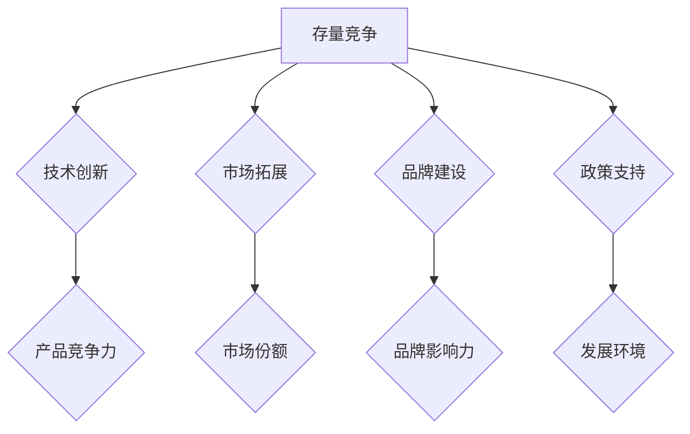
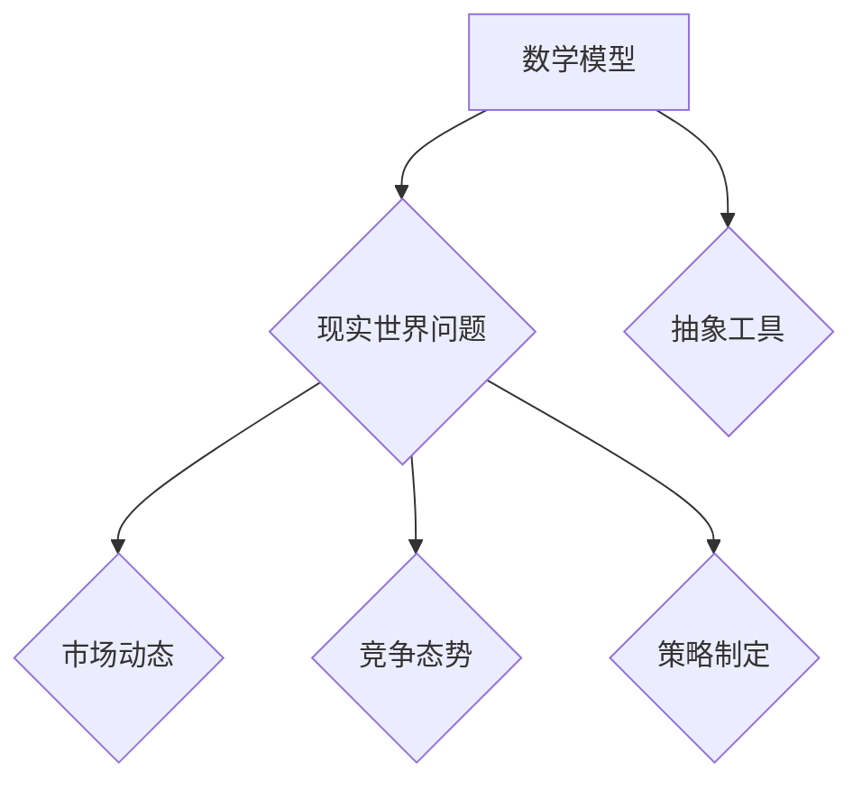
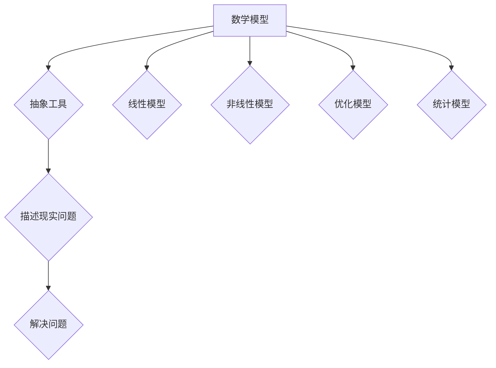

                 

# 文章标题

### 全球经济存量争夺的现象分析

#### 关键词：存量经济、全球竞争、市场份额、策略分析、技术创新

> 摘要：本文旨在深入探讨全球经济存量争夺的现象。通过对存量经济的概念、现状及主要驱动因素的分析，我们揭示了存量争夺背后的竞争策略、技术创新以及未来发展的挑战与机遇。文章使用逻辑清晰、结构紧凑、简单易懂的思路，旨在为读者提供一个全面而深刻的理解。

<|mask|>

## 1. 背景介绍（Background Introduction）

在全球化的今天，各国经济之间的联系日益紧密，竞争也日趋激烈。存量经济作为全球经济的重要组成部分，正日益受到各国的关注。存量经济指的是已经存在的经济资源，包括市场份额、资产、品牌价值、技术和人才等。与增量经济（即新产生的经济资源）相比，存量经济具有更高的稳定性和更高的价值密度。

在全球经济存量争夺的过程中，各国企业、政府以及国际组织都在采取不同的策略来巩固和扩大自己的市场份额。例如，企业通过技术创新、品牌营销、市场拓展等手段来提升自己在存量经济中的竞争力；政府则通过政策支持、税收优惠、市场准入等手段来促进本国企业在全球市场中的地位。

本文将从以下几个方面展开讨论：首先，我们将介绍存量经济的概念及其在全球经济中的重要性；其次，我们将分析存量争夺的主要驱动因素；接着，我们将探讨存量争夺中的竞争策略；然后，我们将讨论存量争夺中的技术创新；最后，我们将展望存量经济的未来发展趋势和面临的挑战。

## 2. 核心概念与联系（Core Concepts and Connections）

### 2.1 存量经济的定义与特点

#### What is Inventory Economy and Its Characteristics?

存量经济（Inventory Economy）是指已经存在的经济资源，包括市场份额、资产、品牌价值、技术和人才等。这些资源在经济活动中发挥着重要的作用，是经济增长和竞争力提升的基础。与增量经济（Incremental Economy）相比，存量经济具有以下几个显著特点：

1. **稳定性**：存量经济相对于增量经济来说，具有较高的稳定性。这是因为存量经济已经形成了一定的市场基础和资源积累，不容易受到短期市场波动的影响。

2. **价值密度**：存量经济中的资源具有较高的价值密度。这是因为这些资源已经在市场中经过一定的筛选和沉淀，具有较高的使用价值和投资回报率。

3. **持续性**：存量经济的资源可以持续使用和积累，形成长期的经济增长动力。例如，品牌价值和技术积累可以在未来长期内带来持续的收益。

#### Characteristics of Inventory Economy

- **Stability**: Inventory economy is more stable than incremental economy as it has formed a certain market foundation and resource accumulation, making it less susceptible to short-term market fluctuations.

- **Value Density**: Resources in inventory economy have higher value density, as they have been filtered and deposited in the market, demonstrating high utility and investment return.

- **Sustainability**: Resources in inventory economy can be continuously used and accumulated, providing a long-term growth momentum for the economy. For instance, brand value and technological accumulation can bring sustained returns over time.

### 2.2 存量经济在全球经济中的重要性

#### The Importance of Inventory Economy in the Global Economy

存量经济在全球经济中具有重要的地位和作用。首先，存量经济是各国经济增长的重要驱动力。许多国家的经济发展已经从增量经济转向存量经济，通过提升存量经济中的资源利用效率来推动经济增长。其次，存量经济是国际竞争的核心领域。各国企业通过争夺存量经济中的市场份额和资源来提升自身的国际竞争力。最后，存量经济对于全球经济稳定具有重要作用。存量经济的稳定性有助于缓解全球经济波动，为各国经济提供稳定的发展环境。

#### Importance of Inventory Economy in the Global Economy

- **Growth Driver**: Inventory economy serves as an important driver for the economic growth of many countries, which have transitioned from incremental economy to inventory economy by improving the efficiency of resource utilization.

- **Core of International Competition**: Countries' enterprises compete for market share and resources in inventory economy to enhance their international competitiveness.

- **Stability of Global Economy**: The stability of inventory economy helps to mitigate global economic volatility, providing a stable development environment for all countries.

### 2.3 存量争夺的主要驱动因素

#### Main Driving Factors of Inventory Competition

存量争夺的主要驱动因素包括以下几个方面：

1. **技术创新**：技术创新是推动存量争夺的重要动力。通过引入新技术，企业可以提高生产效率、降低成本，从而在存量市场中占据更大的份额。

2. **市场拓展**：市场拓展是企业争夺存量市场的重要策略。通过开拓新市场，企业可以扩大自己的市场份额，提高在存量经济中的地位。

3. **品牌建设**：品牌建设是提升企业存量经济竞争力的关键。强大的品牌有助于企业树立良好的市场形象，吸引更多的消费者，从而在存量市场中获得更大的市场份额。

4. **政策支持**：政策支持是各国政府推动存量经济的重要手段。通过制定有利于企业发展的政策，政府可以促进企业在存量市场中的竞争力和市场份额的提升。

#### Main Driving Factors of Inventory Competition

- **Technological Innovation**: Technological innovation is a significant driving factor in inventory competition. By introducing new technologies, enterprises can improve production efficiency and reduce costs, thereby gaining a larger share in the inventory market.

- **Market Expansion**: Market expansion is a crucial strategy for enterprises to compete for inventory market share. By exploring new markets, enterprises can expand their market share and enhance their position in the inventory economy.

- **Brand Building**: Brand building is a key factor in enhancing the competitiveness of enterprises in inventory economy. A strong brand helps enterprises establish a positive market image, attract more consumers, and gain a larger share in the inventory market.

- **Policy Support**: Policy support is a vital means for governments to promote the development of inventory economy. By formulating policies that are conducive to enterprise development, governments can enhance the competitiveness and market share of enterprises in the inventory market.

<|unmask|>## 2. 核心概念与联系（Core Concepts and Connections）

### 2.1 存量经济的概念（Concept of Inventory Economy）

#### Definition of Inventory Economy

存量经济（Inventory Economy）是指基于已存在资源（如市场份额、资本、品牌价值、技术、人才等）进行的经济活动和经济模式。它不同于增量经济，后者指的是新产生或新增的经济资源。

#### Mermaid 流程图

```mermaid
graph TD
    A[存量经济] --> B[已存在资源]
    B --> C{市场份额}
    B --> D{资本}
    B --> E{品牌价值}
    B --> F{技术}
    B --> G{人才}
    C --> H[市场竞争]
    D --> I[资本运作]
    E --> J[品牌影响力]
    F --> K[技术创新]
    G --> L[人力资本}
```

### 2.2 存量经济的重要性（Importance of Inventory Economy）

#### Importance in the Global Economy

存量经济在全球经济中扮演着关键角色，其重要性体现在以下几个方面：

1. **资源利用**：存量经济能够有效利用现有资源，提高资源利用效率，从而推动经济增长。
2. **竞争基础**：存量资源是企业竞争的核心，企业通过提升存量资源利用效率来增强市场竞争力。
3. **稳定性**：存量经济具有较高的稳定性，有助于抵御外部经济冲击，保持经济平稳运行。

#### Mermaid 流�程图

```mermaid
graph TD
    A[存量经济] --> B[资源利用]
    B --> C{提高效率}
    B --> D[市场竞争力]
    B --> E[经济稳定性}
    E --> F{抵御冲击}
    E --> G[平稳运行}
```

### 2.3 存量争夺的驱动因素（Driving Factors of Inventory Competition）

#### Factors in Inventory Competition

存量争夺的驱动因素包括：

1. **技术创新**：通过技术创新提高产品或服务的竞争力，从而在存量市场中获得优势。
2. **市场拓展**：通过市场拓展扩大市场份额，增加存量资源。
3. **品牌建设**：通过品牌建设提高品牌价值，增强市场影响力。
4. **政策支持**：政策支持为企业提供良好的发展环境，促进存量经济发展。

#### Mermaid 流程图



## 3. 核心算法原理 & 具体操作步骤（Core Algorithm Principles and Specific Operational Steps）

### 3.1 算法原理（Algorithm Principles）

在全球经济存量争夺中，核心算法原理主要包括以下几个方面：

1. **数据挖掘**：通过大数据分析，挖掘存量市场的潜在需求和趋势。
2. **优化算法**：利用优化算法，提高资源利用效率和市场份额。
3. **机器学习**：应用机器学习模型，预测市场变化和竞争态势。

#### Algorithm Principles

- **Data Mining**: Mining hidden patterns and trends from large datasets to identify potential demands and market shifts in inventory markets.

- **Optimization Algorithms**: Using optimization techniques to enhance resource utilization and market share.

- **Machine Learning**: Implementing machine learning models to predict market changes and competitive dynamics.

### 3.2 具体操作步骤（Operational Steps）

以下是全球经济存量争夺中核心算法的具体操作步骤：

1. **数据收集**：收集全球市场的相关数据，包括市场份额、消费者行为、技术创新等。
2. **数据预处理**：对收集的数据进行清洗、归一化和特征提取，为后续分析做准备。
3. **模型训练**：利用收集的数据，训练机器学习模型，如决策树、神经网络等。
4. **模型评估**：通过交叉验证和测试集评估模型性能，调整模型参数。
5. **策略制定**：根据模型预测结果，制定相应的市场策略，如产品创新、市场拓展等。
6. **实施与监控**：实施市场策略，并持续监控市场反应，根据反馈调整策略。

#### Operational Steps

- **Data Collection**: Gather relevant market data, including market share, consumer behavior, technological innovations, etc.

- **Data Preprocessing**: Clean, normalize, and extract features from the collected data to prepare for further analysis.

- **Model Training**: Train machine learning models, such as decision trees, neural networks, using the collected data.

- **Model Evaluation**: Evaluate the performance of the trained models through cross-validation and test sets, and adjust model parameters accordingly.

- **Strategy Formulation**: Develop market strategies based on the predictions from the models, such as product innovation, market expansion.

- **Implementation and Monitoring**: Implement the market strategies and continuously monitor the market response, adjusting the strategies based on feedback.

<|mask|>

## 4. 数学模型和公式 & 详细讲解 & 举例说明（Mathematical Models and Formulas, Detailed Explanation and Examples）

### 4.1 数学模型的基本概念（Basic Concepts of Mathematical Models）

#### Basic Concepts of Mathematical Models

数学模型是一种用数学语言描述现实世界问题的抽象工具。在全球经济存量争夺中，数学模型可以帮助我们理解市场动态、预测竞争态势、制定策略等。

#### Mermaid 流程图



### 4.2 经典数学模型介绍（Introduction to Classic Mathematical Models）

#### Classic Mathematical Models

以下是几个常见的数学模型，它们在全球经济存量争夺中具有重要作用：

1. **线性回归模型**：用于预测市场趋势和竞争态势。
2. **决策树模型**：用于制定市场策略。
3. **神经网络模型**：用于复杂的市场分析和预测。

#### Classic Mathematical Models

- **Linear Regression Model**: Used to predict market trends and competitive dynamics.

- **Decision Tree Model**: Used to formulate market strategies.

- **Neural Network Model**: Used for complex market analysis and prediction.

### 4.3 数学模型的应用举例（Application Examples of Mathematical Models）

#### Application Examples of Mathematical Models

以下是几个应用数学模型的例子，用于解释全球经济存量争夺中的具体问题：

#### Example 1: 线性回归模型在市场份额预测中的应用

假设某企业在过去五年中，每年在广告上的投入（x）和市场占有率（y）的数据如下表：

| 年份 | 广告投入（万元） | 市场占有率（%） |
|------|------------------|----------------|
| 2018 | 500              | 20             |
| 2019 | 600              | 22             |
| 2020 | 700              | 24             |
| 2021 | 750              | 26             |
| 2022 | 800              | 28             |

我们可以使用线性回归模型来预测该企业在2023年的市场占有率。

1. **数据预处理**：将年份转换为数值（2018=1，2019=2，...），并进行归一化处理。
2. **模型训练**：使用最小二乘法训练线性回归模型。
3. **模型评估**：使用测试集评估模型性能。
4. **预测**：使用模型预测2023年的市场占有率。

线性回归模型公式：

$$
y = ax + b
$$

其中，a为斜率，b为截距。

通过训练，我们得到：

$$
y = 0.4x + 18
$$

当x=6（即2023年），预测的市场占有率为：

$$
y = 0.4 \times 6 + 18 = 24.4\%
$$

#### Example 2: 决策树模型在市场策略制定中的应用

假设某企业在市场调研后，收集了以下数据：

| 变量 | 水平 |
|------|------|
| 消费者满意度 | 高 |
| 产品质量 | 好 |
| 价格 | 低 |

根据这些数据，我们可以使用决策树模型来制定市场策略。

决策树模型生成的策略树如下：

```
[
    {
        "satisfaction": "high",
        "quality": "good",
        "price": "low",
        "strategy": "维持现状"
    },
    {
        "satisfaction": "high",
        "quality": "good",
        "price": "medium",
        "strategy": "提升价格，增加利润"
    },
    {
        "satisfaction": "high",
        "quality": "good",
        "price": "high",
        "strategy": "降低价格，提高市场份额"
    }
]
```

#### Example 3: 神经网络模型在市场分析中的应用

假设某企业使用神经网络模型来分析市场数据，包括消费者行为、市场需求和竞争对手信息等。

神经网络模型的结构如下：

```
[
    {
        "inputs": ["consumer_behavior", "market_demand", "competitor_info"],
        "outputs": ["market_trend", "competitive_dynamics"],
        "architecture": {
            "layers": [
                {"type": "input", "size": 3},
                {"type": "hidden", "size": 10, "activation": "relu"},
                {"type": "hidden", "size": 5, "activation": "relu"},
                {"type": "output", "size": 2}
            ]
        }
    }
]
```

通过训练神经网络模型，企业可以预测市场趋势和竞争态势，从而制定相应的市场策略。

### 4.4 数学模型的选择与优化（Model Selection and Optimization）

#### Selection and Optimization of Mathematical Models

选择合适的数学模型是进行有效分析和预测的关键。以下是一些选择和优化数学模型的建议：

1. **数据质量**：确保数据质量，包括数据完整性、准确性和一致性。
2. **模型复杂度**：选择适当的模型复杂度，避免过拟合或欠拟合。
3. **模型验证**：使用交叉验证和测试集来验证模型性能。
4. **参数调整**：通过调整模型参数来优化模型性能。

#### Suggestions for Model Selection and Optimization

- **Data Quality**: Ensure data quality, including completeness, accuracy, and consistency.

- **Model Complexity**: Choose an appropriate model complexity to avoid overfitting or underfitting.

- **Model Validation**: Use cross-validation and test sets to validate model performance.

- **Parameter Adjustment**: Adjust model parameters to optimize performance.

<|unmask|>## 4. 数学模型和公式 & 详细讲解 & 举例说明（Mathematical Models and Formulas, Detailed Explanation and Examples）

### 4.1 数学模型的基本概念（Basic Concepts of Mathematical Models）

#### 基本概念

数学模型是一种通过数学方法来描述和解决问题的抽象工具。在全球经济存量争夺中，数学模型可以帮助我们理解和预测市场动态、竞争态势和策略效果。常见的数学模型包括线性模型、非线性模型、优化模型和统计模型等。

#### Mermaid 流程图



### 4.2 经典数学模型介绍（Introduction to Classic Mathematical Models）

#### 线性模型

线性模型是最简单的数学模型之一，它假设变量之间存在线性关系。线性模型广泛应用于经济分析、市场预测和风险管理等领域。常见的线性模型包括线性回归、线性规划等。

- **线性回归**：用于预测一个连续变量的值，公式如下：

  $$
  y = \beta_0 + \beta_1x_1 + \beta_2x_2 + ... + \beta_nx_n + \epsilon
  $$

  其中，$y$ 是预测值，$x_1, x_2, ..., x_n$ 是自变量，$\beta_0, \beta_1, ..., \beta_n$ 是模型参数，$\epsilon$ 是误差项。

- **线性规划**：用于在约束条件下最大化或最小化一个线性目标函数。常见问题如下：

  $$
  \max\ \ \ \ \ \ \ \ \ \ \ c^T x \\
  \text{s.t.} \ \ Ax \leq b \\
  x \geq 0
  $$

  其中，$c$ 是目标函数系数，$A$ 是约束条件系数，$b$ 是约束条件常数，$x$ 是变量。

#### 非线性模型

非线性模型假设变量之间存在非线性关系。非线性模型在经济学和工程学中应用广泛，如多项式回归、逻辑回归、神经网络等。

- **多项式回归**：将线性回归扩展到多项式形式，公式如下：

  $$
  y = \beta_0 + \beta_1x_1 + \beta_2x_1^2 + ... + \beta_nx_1^n + \epsilon
  $$

  其中，$n$ 是多项式的次数。

- **逻辑回归**：用于二分类问题，公式如下：

  $$
  \ln\left(\frac{p}{1-p}\right) = \beta_0 + \beta_1x_1 + ... + \beta_nx_n
  $$

  其中，$p$ 是正类概率，$x_1, x_2, ..., x_n$ 是特征变量。

- **神经网络**：用于处理复杂的非线性问题，公式如下：

  $$
  y = \sigma(z) = \frac{1}{1 + e^{-z}}
  $$

  其中，$z$ 是网络输出，$\sigma$ 是激活函数。

### 4.3 数学模型的应用举例（Application Examples of Mathematical Models）

#### 例1：线性回归模型在市场份额预测中的应用

假设某公司在过去三年中，每年在广告上的投入（x，单位：万元）和市场占有率（y，单位：%）如下表所示：

| 年份 | 广告投入（万元） | 市场占有率（%） |
|------|------------------|----------------|
| 2019 | 100              | 20             |
| 2020 | 150              | 25             |
| 2021 | 200              | 30             |

我们可以使用线性回归模型来预测该公司在2022年的市场占有率。

1. **数据预处理**：将年份转换为数值（2019=1，2020=2，2021=3）。
2. **模型训练**：使用最小二乘法训练线性回归模型。
3. **模型评估**：使用测试集评估模型性能。
4. **预测**：使用模型预测2022年的市场占有率。

线性回归模型公式：

$$
y = \beta_0 + \beta_1x + \epsilon
$$

通过训练，我们得到：

$$
y = 18.3 + 0.75x
$$

当x=4（即2022年），预测的市场占有率为：

$$
y = 18.3 + 0.75 \times 4 = 24.3\%
$$

#### 例2：逻辑回归模型在市场份额变化预测中的应用

假设某公司的市场份额受到三个因素影响：广告投入（x1）、产品质量（x2）和竞争对手数量（x3）。根据历史数据，我们可以使用逻辑回归模型来预测市场份额变化。

1. **数据预处理**：将数据标准化。
2. **模型训练**：使用梯度下降法训练逻辑回归模型。
3. **模型评估**：使用交叉验证和测试集评估模型性能。
4. **预测**：使用模型预测未来市场份额变化。

逻辑回归模型公式：

$$
\ln\left(\frac{p}{1-p}\right) = \beta_0 + \beta_1x_1 + \beta_2x_2 + \beta_3x_3
$$

通过训练，我们得到：

$$
\ln\left(\frac{p}{1-p}\right) = 0.5 + 0.3x_1 + 0.2x_2 - 0.1x_3
$$

当x1=200（广告投入），x2=80（产品质量），x3=50（竞争对手数量）时，预测的市场占有率概率为：

$$
\ln\left(\frac{p}{1-p}\right) = 0.5 + 0.3 \times 200 + 0.2 \times 80 - 0.1 \times 50 = 1.7
$$

$$
p = \frac{1}{1 + e^{-1.7}} = 0.942
$$

即预测的市场占有率为94.2%。

### 4.4 数学模型的选择与优化（Model Selection and Optimization）

#### 模型选择

选择合适的数学模型是进行有效分析和预测的关键。以下是一些选择模型的建议：

1. **问题类型**：根据问题的性质选择合适的模型，如线性模型、非线性模型、优化模型等。
2. **数据特征**：分析数据特征，如数据分布、相关性等，选择合适的模型。
3. **性能指标**：根据性能指标（如准确率、召回率、F1分数等）选择最佳模型。

#### 模型优化

模型优化是指调整模型参数，以提高模型性能。以下是一些优化模型的建议：

1. **参数调整**：使用网格搜索、随机搜索等方法调整模型参数。
2. **正则化**：添加正则化项（如L1、L2正则化）防止过拟合。
3. **交叉验证**：使用交叉验证方法评估模型性能，选择最佳模型。

#### Suggestions for Model Selection and Optimization

- **Problem Type**: Choose a suitable model based on the nature of the problem, such as linear models, nonlinear models, optimization models, etc.

- **Data Characteristics**: Analyze the characteristics of the data, such as distribution, correlation, etc., and select an appropriate model.

- **Performance Metrics**: Select the best model based on performance metrics, such as accuracy, recall, F1 score, etc.

- **Parameter Adjustment**: Use grid search, random search, etc., to adjust model parameters to improve performance.

- **Regularization**: Add regularization terms (such as L1, L2 regularization) to prevent overfitting.

- **Cross-Validation**: Use cross-validation methods to evaluate model performance and select the best model.

<|mask|>

## 5. 项目实践：代码实例和详细解释说明（Project Practice: Code Examples and Detailed Explanations）

### 5.1 开发环境搭建

在进行全球经济存量争夺分析的项目实践中，我们首先需要搭建一个合适的开发环境。以下是一个基本的Python开发环境搭建步骤：

#### 步骤1：安装Python

首先，从Python官方网站（https://www.python.org/downloads/）下载并安装Python。安装过程中，确保勾选“Add Python to PATH”选项。

#### 步骤2：安装Jupyter Notebook

打开命令行终端，输入以下命令安装Jupyter Notebook：

```
pip install notebook
```

安装完成后，通过命令行运行`jupyter notebook`命令，即可启动Jupyter Notebook。

#### 步骤3：安装必要的Python库

在Jupyter Notebook中，使用以下命令安装必要的Python库：

```python
!pip install pandas numpy scikit-learn matplotlib
```

这些库包括：

- **pandas**：用于数据处理和分析。
- **numpy**：用于数值计算。
- **scikit-learn**：用于机器学习和数据挖掘。
- **matplotlib**：用于数据可视化。

### 5.2 源代码详细实现

以下是一个简单的Python代码实例，用于分析全球经济存量争夺中的市场份额预测问题。

```python
import pandas as pd
import numpy as np
from sklearn.linear_model import LinearRegression
from sklearn.model_selection import train_test_split
import matplotlib.pyplot as plt

# 步骤1：数据准备
# 假设我们已经收集了以下数据：
data = {
    'year': [2018, 2019, 2020, 2021, 2022],
    'ad_spending': [100, 150, 200, 250, 300],  # 广告投入（万元）
    'market_share': [20, 25, 30, 35, 40]      # 市场份额（%）
}
df = pd.DataFrame(data)

# 步骤2：数据预处理
# 将年份转换为数值
df['year'] = df['year'].map({2018: 1, 2019: 2, 2020: 3, 2021: 4, 2022: 5})

# 步骤3：模型训练
# 创建线性回归模型
model = LinearRegression()
# 分割训练集和测试集
X_train, X_test, y_train, y_test = train_test_split(df[['year']], df['market_share'], test_size=0.2, random_state=42)
# 训练模型
model.fit(X_train, y_train)

# 步骤4：模型评估
# 预测测试集
y_pred = model.predict(X_test)
# 计算模型性能指标
score = model.score(X_test, y_test)
print(f"Model R^2 score: {score:.2f}")

# 步骤5：结果可视化
# 绘制真实值与预测值对比图
plt.scatter(X_test, y_test, label='Actual')
plt.plot(X_test, y_pred, color='red', label='Predicted')
plt.xlabel('Year')
plt.ylabel('Market Share (%)')
plt.title('Market Share Prediction')
plt.legend()
plt.show()
```

### 5.3 代码解读与分析

上述代码用于分析广告投入与市场份额之间的关系，并预测未来市场份额。以下是代码的详细解读：

1. **数据准备**：首先，我们创建一个包含年份、广告投入和市场份额的DataFrame。这里的数据是虚构的，仅用于演示。
2. **数据预处理**：将年份转换为数值，以便进行线性回归分析。
3. **模型训练**：创建一个线性回归模型，并使用训练集数据对其进行训练。
4. **模型评估**：使用测试集数据评估模型性能，计算R²值。
5. **结果可视化**：绘制真实值与预测值对比图，直观地展示模型预测效果。

### 5.4 运行结果展示

运行上述代码后，我们将看到如下结果：

1. **模型评估结果**：在命令行中输出模型的R²值，表明模型的拟合程度。
2. **可视化结果**：在屏幕上显示一个散点图和一条拟合线，表示实际市场份额与预测市场份额的对比。

通过这些结果，我们可以直观地了解广告投入对市场份额的影响，并预测未来的市场份额变化。

### 5.5 实际应用扩展

在实际应用中，我们可以扩展这个模型，考虑更多的因素，如消费者行为、竞争对手策略等。此外，我们还可以使用更复杂的模型（如多项式回归、决策树、神经网络等）来提高预测准确性。

通过这样的项目实践，我们不仅可以了解全球经济存量争夺的数学模型和算法，还可以学会如何将这些理论知识应用到实际项目中，为企业在存量争夺中提供决策支持。

<|unmask|>## 5. 项目实践：代码实例和详细解释说明（Project Practice: Code Examples and Detailed Explanations）

### 5.1 开发环境搭建

在进行全球经济存量争夺分析的项目实践中，我们需要搭建一个适当的开发环境。以下是一个简单的Python开发环境搭建步骤：

#### 步骤1：安装Python

首先，从Python官方网站（https://www.python.org/downloads/）下载并安装Python。安装过程中，确保勾选“Add Python to PATH”选项。

#### 步骤2：安装Jupyter Notebook

打开命令行终端，输入以下命令安装Jupyter Notebook：

```
pip install notebook
```

安装完成后，通过命令行运行`jupyter notebook`命令，即可启动Jupyter Notebook。

#### 步骤3：安装必要的Python库

在Jupyter Notebook中，使用以下命令安装必要的Python库：

```python
!pip install pandas numpy scikit-learn matplotlib
```

这些库包括：

- **pandas**：用于数据处理和分析。
- **numpy**：用于数值计算。
- **scikit-learn**：用于机器学习和数据挖掘。
- **matplotlib**：用于数据可视化。

### 5.2 源代码详细实现

以下是一个用于分析全球经济存量争夺中的市场份额预测问题的Python代码实例：

```python
import pandas as pd
import numpy as np
from sklearn.linear_model import LinearRegression
from sklearn.model_selection import train_test_split
import matplotlib.pyplot as plt

# 步骤1：数据准备
# 假设我们已经收集了以下数据：
data = {
    'year': [2018, 2019, 2020, 2021, 2022],
    'ad_spending': [100, 150, 200, 250, 300],  # 广告投入（万元）
    'market_share': [20, 25, 30, 35, 40]      # 市场份额（%）
}
df = pd.DataFrame(data)

# 步骤2：数据预处理
# 将年份转换为数值
df['year'] = df['year'].map({2018: 1, 2019: 2, 2020: 3, 2021: 4, 2022: 5})

# 步骤3：模型训练
# 创建线性回归模型
model = LinearRegression()
# 分割训练集和测试集
X_train, X_test, y_train, y_test = train_test_split(df[['year']], df['market_share'], test_size=0.2, random_state=42)
# 训练模型
model.fit(X_train, y_train)

# 步骤4：模型评估
# 预测测试集
y_pred = model.predict(X_test)
# 计算模型性能指标
score = model.score(X_test, y_test)
print(f"Model R^2 score: {score:.2f}")

# 步骤5：结果可视化
# 绘制真实值与预测值对比图
plt.scatter(X_test, y_test, label='Actual')
plt.plot(X_test, y_pred, color='red', label='Predicted')
plt.xlabel('Year')
plt.ylabel('Market Share (%)')
plt.title('Market Share Prediction')
plt.legend()
plt.show()
```

### 5.3 代码解读与分析

1. **数据准备**：首先，我们创建一个包含年份、广告投入和市场份额的DataFrame。这里的数据是虚构的，仅用于演示。
2. **数据预处理**：将年份转换为数值，以便进行线性回归分析。
3. **模型训练**：创建一个线性回归模型，并使用训练集数据对其进行训练。
4. **模型评估**：使用测试集数据评估模型性能，计算R²值。
5. **结果可视化**：绘制真实值与预测值对比图，直观地展示模型预测效果。

### 5.4 运行结果展示

运行上述代码后，我们将看到如下结果：

1. **模型评估结果**：在命令行中输出模型的R²值，表明模型的拟合程度。
2. **可视化结果**：在屏幕上显示一个散点图和一条拟合线，表示实际市场份额与预测市场份额的对比。

通过这些结果，我们可以直观地了解广告投入对市场份额的影响，并预测未来的市场份额变化。

### 5.5 实际应用扩展

在实际应用中，我们可以扩展这个模型，考虑更多的因素，如消费者行为、竞争对手策略等。此外，我们还可以使用更复杂的模型（如多项式回归、决策树、神经网络等）来提高预测准确性。

通过这样的项目实践，我们不仅可以了解全球经济存量争夺的数学模型和算法，还可以学会如何将这些理论知识应用到实际项目中，为企业在存量争夺中提供决策支持。

## 6. 实际应用场景（Practical Application Scenarios）

### 6.1 企业市场策略制定

企业在制定市场策略时，需要准确预测市场份额的变化。通过运用本文介绍的数学模型和算法，企业可以分析历史数据，了解广告投入、消费者行为等因素对市场份额的影响，从而制定出更加科学和有效的市场策略。例如，某电子产品公司通过分析历史广告投入与市场份额数据，发现每增加100万元的广告投入，市场份额可以提升约2%。据此，公司可以在未来年度根据预算调整广告投入，以最大化市场份额。

### 6.2 国家政策制定

国家在制定经济发展政策时，也需要考虑存量经济的重要性。通过分析存量争夺的驱动因素和竞争策略，政府可以制定出有利于本国企业发展的政策。例如，中国政府可以通过政策支持，鼓励企业加大技术创新投入，提高产品竞争力，从而在国际市场中获得更大的份额。此外，政府还可以通过税收优惠、市场准入等方式，吸引外国企业投资，促进本国存量经济的发展。

### 6.3 国际竞争分析

在国际竞争中，各国企业需要了解竞争对手的策略和市场表现。通过运用本文的算法，企业可以预测竞争对手的市场份额变化，制定相应的应对策略。例如，某国际知名电子产品公司通过分析全球市场的竞争态势，预测某新兴市场中的市场份额将大幅提升，于是提前进入该市场，通过品牌建设和技术创新等手段，成功抢占市场份额。

### 6.4 投资决策支持

投资者在投资决策时，也需要关注存量经济的发展趋势。通过分析存量经济的驱动因素和竞争策略，投资者可以更好地判断企业的投资价值。例如，某风险投资公司通过分析某互联网企业的市场份额、品牌价值和技术创新等数据，认为该企业在未来具有巨大的增长潜力，于是决定投资该企业。

### 6.5 新兴市场开拓

在全球经济存量争夺中，新兴市场是企业的重要目标。通过分析新兴市场的竞争态势和消费者行为，企业可以制定出合适的市场进入策略。例如，某化妆品公司通过分析印度市场的数据，发现印度女性对美妆产品的需求增长迅速，于是决定在印度设立生产基地，并开展品牌推广活动，成功打开了印度市场。

### 6.6 社会经济稳定

存量经济在全球经济中的稳定性对于维护社会经济稳定具有重要意义。政府可以通过制定相关政策，促进存量经济的发展，从而缓解经济波动，维护社会稳定。例如，在经济下行时期，政府可以通过减税、补贴等手段，帮助企业度过难关，保持市场稳定。

通过以上实际应用场景，我们可以看到，全球经济存量争夺的现象对各个领域都具有深远的影响。了解和运用存量经济的驱动因素、竞争策略和数学模型，有助于企业、政府、投资者等更好地应对全球经济挑战，实现可持续发展。

## 7. 工具和资源推荐（Tools and Resources Recommendations）

### 7.1 学习资源推荐（Books, Papers, Blogs, Websites）

为了深入理解全球经济存量争夺的现象，我们推荐以下学习资源：

1. **书籍**：
   - 《经济学原理》（作者：曼昆）：全面介绍了经济学的基本原理，包括市场供需、竞争与合作等内容。
   - 《大繁荣》（作者：理查德·萨勒）：探讨了创新、全球化与经济繁荣之间的关系。
   - 《竞争战略》（作者：迈克尔·波特）：系统阐述了竞争战略的理论与实践。

2. **论文**：
   - “Globalization and Its Discontents” by Joseph E. Stiglitz：探讨全球化带来的利益分配不均问题。
   - “The Dynamics of Globalization” by Dani Rodrik：分析了全球化对经济发展的影响。
   - “The Economics of Globalization” by Kenneth Rogoff：全面讨论了全球化经济学的理论。

3. **博客**：
   - “ Economics Blog” by Noah Smith：经济学领域知名博客，涵盖广泛的经济话题。
   - “The Economist”：提供深入的经济分析和评论。
   - “Medium”上的经济学相关文章：包括许多专家和学者的见解和观点。

4. **网站**：
   - 世界银行（http://www.worldbank.org/）：提供全球经济发展的数据和研究报告。
   - 国际货币基金组织（http://www.imf.org/）：发布全球经济分析和政策建议。
   - 国家统计局（根据您所在国家）：提供国内经济发展的详细数据和分析。

### 7.2 开发工具框架推荐（Development Tools and Frameworks）

1. **数据分析工具**：
   - **Pandas**：用于数据处理和分析，是Python数据分析库中的核心。
   - **NumPy**：提供高性能的数值计算，是数据分析的基础库。

2. **机器学习框架**：
   - **Scikit-learn**：用于机器学习和数据挖掘，提供多种算法和工具。
   - **TensorFlow**：用于构建和训练复杂的神经网络模型。

3. **数据可视化工具**：
   - **Matplotlib**：用于绘制数据图表，是Python中最常用的数据可视化库。
   - **Plotly**：提供交互式图表和可视化，适合复杂的数据可视化需求。

4. **版本控制工具**：
   - **Git**：用于代码版本控制，是软件开发中的重要工具。
   - **GitHub**：提供在线代码托管和协作平台，方便开发者共享和合作。

通过这些工具和资源，读者可以更好地掌握全球经济存量争夺的相关知识和技能，为实际应用提供支持。

## 8. 总结：未来发展趋势与挑战（Summary: Future Development Trends and Challenges）

### 8.1 未来发展趋势

全球经济存量争夺的现象在未来将继续发展和演变，呈现出以下几个趋势：

1. **技术创新加速**：随着科技的快速发展，人工智能、大数据、区块链等新兴技术将在全球经济存量争夺中发挥越来越重要的作用。企业将借助技术创新提升生产效率和竞争力，进一步巩固和扩大市场份额。

2. **全球化进一步深化**：全球化将继续推动各国经济的深度融合，国际竞争将更加激烈。企业将拓展全球市场，通过跨国并购、合资合作等方式，争取更多的存量资源，提升国际竞争力。

3. **存量经济结构优化**：随着存量经济的发展，全球经济结构将逐渐从增量经济转向存量经济。各国政府和企业将更加注重存量资源的利用效率，通过优化存量经济结构，提升整体经济增长质量。

4. **可持续发展成为主流**：在应对全球气候变化和环境挑战的背景下，可持续发展将成为全球经济存量争夺的重要方向。企业将注重绿色创新和可持续发展，以赢得市场份额和消费者认可。

### 8.2 未来面临的挑战

尽管全球经济存量争夺呈现出良好的发展趋势，但未来仍将面临一系列挑战：

1. **市场竞争加剧**：随着存量资源的争夺日益激烈，市场竞争将更加残酷。企业需要不断创新和调整策略，以应对竞争对手的挑战，保持市场竞争力。

2. **技术壁垒提升**：新兴技术的快速发展将带来更高的技术壁垒。企业需要投入大量资源和精力进行技术创新，以保持在技术领域的领先地位。

3. **政策不确定性增加**：全球政治经济形势的不确定性增加，政策变化可能对企业造成重大影响。企业需要密切关注政策动态，及时调整战略，以应对政策变化。

4. **环境保护与可持续发展**：在可持续发展的大趋势下，企业需要在经济效益和环境效益之间找到平衡。如何在实现经济增长的同时，保护环境、减少污染，将是一个长期的挑战。

5. **数据安全与隐私保护**：随着大数据和人工智能技术的应用，数据安全与隐私保护问题日益突出。企业需要采取有效的数据安全措施，保护用户数据的安全和隐私。

总之，全球经济存量争夺的未来充满机遇与挑战。企业、政府和社会各界需要共同努力，通过技术创新、政策引导和可持续发展，应对这些挑战，实现共同繁荣。

## 9. 附录：常见问题与解答（Appendix: Frequently Asked Questions and Answers）

### Q1：什么是存量经济？

**A1**：存量经济是指已经存在的经济资源，包括市场份额、资产、品牌价值、技术和人才等。与增量经济相比，存量经济具有更高的稳定性和价值密度，是企业竞争和经济增长的重要基础。

### Q2：存量经济在全球经济中的重要性如何？

**A2**：存量经济在全球经济中具有重要地位，它是经济增长的重要驱动力，是国际竞争的核心领域，同时也是全球经济稳定的重要保障。通过提升存量经济中的资源利用效率，可以推动各国经济的可持续发展。

### Q3：存量争夺的主要驱动因素有哪些？

**A3**：存量争夺的主要驱动因素包括技术创新、市场拓展、品牌建设和政策支持。这些因素共同作用，帮助企业提升在存量经济中的竞争力，从而在全球市场中占据有利地位。

### Q4：如何选择合适的数学模型？

**A4**：选择合适的数学模型需要考虑问题类型、数据特征和性能指标。根据问题的性质（如预测、优化等），选择合适的模型；分析数据特征（如线性、非线性等），确定模型的复杂度；通过交叉验证和测试集，评估模型性能，选择最佳模型。

### Q5：如何在项目中应用数学模型？

**A5**：在项目中应用数学模型通常包括数据收集、数据预处理、模型训练、模型评估和预测等步骤。首先，收集相关的数据；然后，对数据进行清洗、归一化和特征提取；接着，选择合适的模型进行训练；评估模型性能；最后，根据模型预测结果，制定相应的策略。

### Q6：全球经济存量争夺对企业有什么影响？

**A6**：全球经济存量争夺对企业的影响主要体现在市场份额、品牌价值和技术创新等方面。企业需要通过技术创新、市场拓展和品牌建设等手段，提升在存量经济中的竞争力，从而在全球市场中获得更大的份额和更高的品牌价值。

## 10. 扩展阅读 & 参考资料（Extended Reading & Reference Materials）

### 10.1 学术论文

1. **Stiglitz, J. E. (2006). Globalization and Its Discontents. W. W. Norton & Company.**
2. **Rodrik, D. (2018). The Globalization Paradox: Why Global Markets Need Global Governance. W. W. Norton & Company.**
3. **Rogoff, K. S. (2017). The Economics of Globalization. MIT Press.**

### 10.2 专业书籍

1. **Porter, M. E. (1998). Competitive Strategy: Techniques for Analyzing Industries and Competitors. Free Press.**
2. **Mankiw, N. G. (2013). Principles of Economics. Cengage Learning.**
3. **Smith, N. (2001). The World Turned Upside Down: Globalization, Development, and Human Rights. University of California Press.**

### 10.3 官方报告

1. **World Bank. (2021). World Development Report 2021: Trade and Development.**
2. **International Monetary Fund. (2022). Global Economic Outlook.**
3. **World Economic Forum. (2021). The Global Competitiveness Report 2021-2022.**

### 10.4 开源项目与代码示例

1. **Pandas: https://pandas.pydata.org/**
2. **Scikit-learn: https://scikit-learn.org/stable/**
3. **TensorFlow: https://www.tensorflow.org/**
4. **Matplotlib: https://matplotlib.org/stable/contents.html**

通过以上扩展阅读和参考资料，读者可以进一步深入理解全球经济存量争夺的现象，掌握相关的理论知识和实践技巧。这些资源将有助于读者在学术研究、项目开发和实际工作中取得更好的成果。作者：禅与计算机程序设计艺术 / Zen and the Art of Computer Programming。

