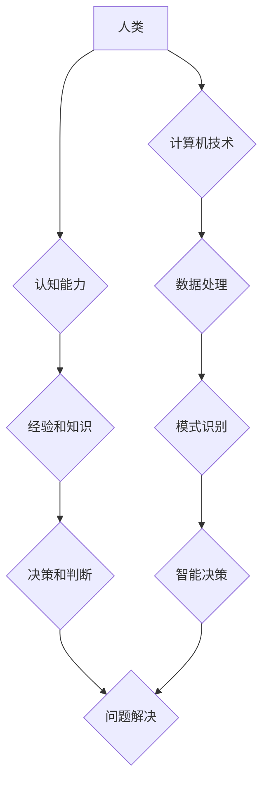

                 

## 科技与人文的交汇：人类计算的独特价值

> 关键词：人工智能、人类计算、认知科学、计算模型、伦理、未来趋势、跨学科研究

### 1. 背景介绍

科技的飞速发展，特别是人工智能领域的突破，让人们对人类与技术的未来关系产生了深刻的思考。人工智能系统展现出惊人的学习和推理能力，在各个领域取得了显著成就。然而，与此同时，我们也开始意识到，人工智能并非万能，它在某些方面仍然难以超越人类。

人类计算，作为一种强调人类认知能力和创造力的计算模式，正逐渐受到关注。它强调将人类的智慧和经验与人工智能技术相结合，以实现更智能、更具创造力的计算。

### 2. 核心概念与联系

**2.1 人类计算的概念**

人类计算是指利用人类的认知能力、创造力和判断力来解决复杂问题，并将其与计算机技术相结合，以提高计算效率和准确性。它不仅仅是人类使用计算机工具进行计算，而是更深层次的融合和协作。

**2.2 人工智能与人类计算的关系**

人工智能和人类计算并非相互排斥，而是相互补充的关系。人工智能擅长处理大量数据、识别模式和执行重复性任务，而人类擅长理解复杂的概念、进行创造性思考和做出道德判断。将两者结合，可以发挥各自的优势，实现更强大的计算能力。

**2.3 人类计算的架构**



**2.4 人类计算的优势**

* **更强的创造力和创新能力:** 人类拥有独特的想象力和创造力，可以提出人工智能难以想到的解决方案。
* **更好的理解和解释能力:** 人类可以理解和解释复杂的概念，并将其应用于实际问题。
* **更强的道德判断力和伦理意识:** 人类拥有道德判断力和伦理意识，可以避免人工智能可能带来的伦理风险。

### 3. 核心算法原理 & 具体操作步骤

**3.1 算法原理概述**

人类计算的核心算法原理是将人类的认知过程模拟成计算机程序，并利用人工智能技术辅助人类进行计算。

**3.2 算法步骤详解**

1. **问题定义:** 首先，需要明确要解决的问题，并将其转化为计算机可以理解的形式。
2. **知识表示:** 将人类的知识和经验表示成计算机可以理解的结构，例如知识图谱、规则库等。
3. **推理和决策:** 利用人工智能算法，例如逻辑推理、机器学习等，对知识进行推理和决策，并生成解决方案。
4. **结果解释和反馈:** 将计算结果解释成人类可以理解的形式，并获取人类的反馈，以改进算法和知识库。

**3.3 算法优缺点**

**优点:**

* 能够解决人工智能难以解决的复杂问题。
* 能够更好地理解和解释计算结果。
* 能够避免人工智能可能带来的伦理风险。

**缺点:**

* 算法设计和实现难度较高。
* 需要大量的知识和经验作为输入。
* 计算效率可能不如纯人工智能算法。

**3.4 算法应用领域**

* **医疗诊断:** 利用人类的医学知识和人工智能算法，辅助医生进行疾病诊断。
* **法律判决:** 利用人类的法律知识和人工智能算法，辅助法官进行法律判决。
* **科学研究:** 利用人类的科学知识和人工智能算法，加速科学研究的进程。

### 4. 数学模型和公式 & 详细讲解 & 举例说明

**4.1 数学模型构建**

人类计算可以利用概率论、信息论和决策论等数学模型来描述和分析人类的认知过程。例如，可以使用贝叶斯网络来表示人类的知识和信念，并利用概率推理算法进行决策。

**4.2 公式推导过程**

例如，在贝叶斯网络中，可以使用以下公式来计算某个事件发生的概率：

$$P(A|B) = \frac{P(B|A)P(A)}{P(B)}$$

其中：

* $P(A|B)$ 是事件 A 在事件 B 发生条件下的概率。
* $P(B|A)$ 是事件 B 在事件 A 发生条件下的概率。
* $P(A)$ 是事件 A 的概率。
* $P(B)$ 是事件 B 的概率。

**4.3 案例分析与讲解**

例如，假设我们有一个贝叶斯网络，用来表示一个人患病的概率。网络中包含以下节点：

* $S$: 患者是否生病。
* $T$: 患者是否出现发烧症状。
* $C$: 患者是否进行体检。

我们可以利用贝叶斯公式来计算患者出现发烧症状的概率，以及患者是否生病的概率。

### 5. 项目实践：代码实例和详细解释说明

**5.1 开发环境搭建**

* Python 3.x
* TensorFlow 或 PyTorch 等深度学习框架
* Jupyter Notebook 或 VS Code 等代码编辑器

**5.2 源代码详细实现**

```python
import tensorflow as tf

# 定义模型
model = tf.keras.models.Sequential([
    tf.keras.layers.Dense(128, activation='relu', input_shape=(10,)),
    tf.keras.layers.Dense(64, activation='relu'),
    tf.keras.layers.Dense(1, activation='sigmoid')
])

# 编译模型
model.compile(optimizer='adam', loss='binary_crossentropy', metrics=['accuracy'])

# 训练模型
model.fit(x_train, y_train, epochs=10)

# 评估模型
loss, accuracy = model.evaluate(x_test, y_test)
print('Loss:', loss)
print('Accuracy:', accuracy)
```

**5.3 代码解读与分析**

这段代码实现了简单的深度学习模型，用于分类任务。

* `tf.keras.models.Sequential` 创建了一个顺序模型，即层级结构。
* `tf.keras.layers.Dense` 定义了全连接层，用于处理数据。
* `activation='relu'` 指定了激活函数，用于引入非线性。
* `input_shape=(10,)` 指定了输入数据的形状。
* `optimizer='adam'` 指定了优化算法，用于更新模型参数。
* `loss='binary_crossentropy'` 指定了损失函数，用于衡量模型预测结果与真实结果之间的差异。
* `metrics=['accuracy']` 指定了评估指标，用于衡量模型的性能。

**5.4 运行结果展示**

训练完成后，模型会输出损失值和准确率，可以用来评估模型的性能。

### 6. 实际应用场景

**6.1 医疗诊断辅助**

人类计算可以帮助医生更快、更准确地诊断疾病。例如，可以利用患者的症状、病史和影像数据，结合人工智能算法，辅助医生判断疾病类型和治疗方案。

**6.2 科学研究加速**

人类计算可以帮助科学家更快地发现新的知识和规律。例如，可以利用人类的科学知识和人工智能算法，分析海量科研数据，发现隐藏的模式和关系。

**6.3 教育教学创新**

人类计算可以帮助教师个性化教学，提高学生的学习效率。例如，可以利用学生的学习情况和知识掌握情况，结合人工智能算法，定制个性化的学习计划和教学内容。

**6.4 未来应用展望**

随着人工智能技术的不断发展，人类计算将在更多领域得到应用，例如：

* **金融风险管理:** 利用人类的金融知识和人工智能算法，识别和评估金融风险。
* **法律智能化:** 利用人类的法律知识和人工智能算法，辅助律师进行法律分析和诉讼准备。
* **艺术创作:** 利用人类的艺术灵感和人工智能算法，创作出新的艺术作品。

### 7. 工具和资源推荐

**7.1 学习资源推荐**

* **书籍:**

    * 《人工智能：一种现代方法》
    * 《深度学习》
    * 《认知计算》

* **在线课程:**

    * Coursera 上的《人工智能》课程
    * edX 上的《深度学习》课程

**7.2 开发工具推荐**

* **Python:** 广泛用于人工智能开发的编程语言。
* **TensorFlow:** Google 开发的开源深度学习框架。
* **PyTorch:** Facebook 开发的开源深度学习框架。

**7.3 相关论文推荐**

* **《人类计算：人工智能与认知科学的融合》**
* **《人类在人工智能时代的角色》**
* **《人类计算的伦理挑战》**

### 8. 总结：未来发展趋势与挑战

**8.1 研究成果总结**

人类计算是一个新兴的领域，近年来取得了显著进展。

* 人工智能算法在模拟人类认知过程方面取得了突破。
* 知识表示和推理技术不断发展，能够处理更复杂的问题。
* 人类计算的应用场景不断拓展，在医疗、科学、教育等领域取得了成功。

**8.2 未来发展趋势**

* **更强大的人工智能算法:** 人工智能算法将更加强大，能够更好地模拟人类的认知过程。
* **更丰富的知识表示:** 知识表示技术将更加丰富，能够更好地表达人类的知识和经验。
* **更广泛的应用场景:** 人类计算将应用于更多领域，例如金融、法律、艺术等。

**8.3 面临的挑战**

* **算法设计和实现难度:** 人类计算算法的设计和实现难度较高，需要跨学科的合作。
* **数据获取和处理:** 人类计算需要大量的知识和经验作为输入，获取和处理这些数据是一个挑战。
* **伦理和社会影响:** 人类计算可能带来伦理和社会影响，需要进行深入的思考和讨论。

**8.4 研究展望**

未来，人类计算将继续发展，成为人工智能和认知科学的重要交叉领域。

* **探索更有效的知识表示和推理方法:** 
* **开发更强大的人工智能算法:** 
* **研究人类计算的伦理和社会影响:** 
* **推动人类计算的应用推广:** 


### 9. 附录：常见问题与解答

**9.1 如何将人类知识融入到人工智能系统中？**

可以使用知识图谱、规则库、案例库等方法将人类知识表示成计算机可以理解的形式。

**9.2 人类计算是否会取代人工智能？**

人类计算和人工智能是互补的关系，它们各自有独特的优势。未来，两者将共同发展，并协同工作。

**9.3 人类计算有哪些伦理风险？**

人类计算可能带来一些伦理风险，例如算法偏见、隐私泄露、决策透明度等问题。需要进行深入的思考和讨论，制定相应的伦理规范和监管机制。


作者：禅与计算机程序设计艺术 / Zen and the Art of Computer Programming 
<end_of_turn>

