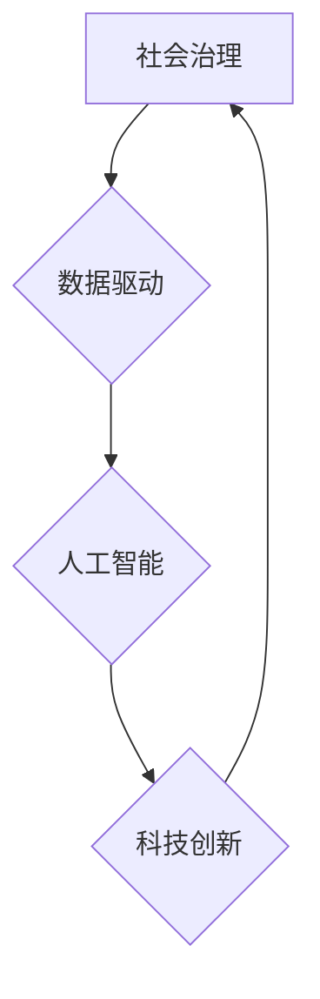

                 

## 科技创新：社会治理的新思路

> 关键词：人工智能、社会治理、科技创新、数据驱动、算法模型、伦理规范、可持续发展

## 1. 背景介绍

社会治理，作为人类社会有序运行的基础，一直以来都面临着诸多挑战。传统社会治理模式往往依赖于行政指令和法律法规，难以有效应对日益复杂的社会问题。随着科技的飞速发展，特别是人工智能（AI）技术的突破，为社会治理带来了新的机遇和挑战。

人工智能技术的应用，能够有效提升社会治理的效率、精准度和透明度。例如，在公共安全领域，AI可以辅助视频监控、预测犯罪热点、识别危险行为，提高社会安全水平；在医疗卫生领域，AI可以辅助诊断疾病、制定个性化治疗方案，提升医疗服务质量；在教育领域，AI可以个性化推荐学习内容、辅助教师教学，提高教育效率。

然而，AI技术在社会治理中的应用也面临着诸多伦理、法律和社会问题。例如，AI算法的决策过程缺乏透明度，可能导致歧视和不公平；AI技术的滥用可能侵犯个人隐私和安全；AI技术的快速发展可能导致社会结构和就业模式的剧烈变化。

因此，如何有效利用AI技术，促进社会治理的创新发展，是当前社会面临的重要课题。

## 2. 核心概念与联系

### 2.1  社会治理

社会治理是指社会成员共同参与，通过各种制度、机制和行为规范，维护社会秩序、解决社会问题，实现社会和谐发展的一种过程。

### 2.2  人工智能

人工智能是指模拟人类智能的一种计算机科学。它包括感知、学习、推理、决策、语言理解和生成等多种能力。

### 2.3  数据驱动

数据驱动是指利用数据分析和挖掘技术，为决策提供依据，推动社会治理的科学化、精准化和可持续化发展。

**核心概念与联系流程图**



## 3. 核心算法原理 & 具体操作步骤

### 3.1  算法原理概述

在社会治理领域，常用的AI算法包括：

* **机器学习算法:** 用于从数据中学习模式和规律，例如分类、回归、聚类等。
* **深度学习算法:** 基于多层神经网络，能够学习更复杂的模式和特征，例如图像识别、自然语言处理等。
* **强化学习算法:** 通过试错学习，找到最优的决策策略，例如自动驾驶、机器人控制等。

### 3.2  算法步骤详解

以机器学习算法为例，其基本步骤包括：

1. **数据收集和预处理:** 收集相关数据，并进行清洗、转换、特征工程等预处理工作。
2. **模型选择:** 根据具体问题选择合适的机器学习算法模型。
3. **模型训练:** 使用训练数据训练模型，调整模型参数，使其能够准确预测或分类。
4. **模型评估:** 使用测试数据评估模型的性能，例如准确率、召回率、F1-score等。
5. **模型部署:** 将训练好的模型部署到实际应用场景中，用于预测或分类新的数据。

### 3.3  算法优缺点

**优点:**

* **数据驱动:** 基于数据分析，决策更加科学和精准。
* **自动化:** 自动化处理大量数据和任务，提高效率。
* **个性化:** 根据用户数据，提供个性化服务和解决方案。

**缺点:**

* **数据依赖:** 算法性能依赖于数据质量和数量。
* **黑盒效应:** 算法决策过程缺乏透明度，难以解释。
* **伦理风险:** 算法可能存在偏见和歧视，导致不公平的结果。

### 3.4  算法应用领域

* **公共安全:** 犯罪预测、风险评估、视频监控。
* **医疗卫生:** 疾病诊断、个性化治疗、药物研发。
* **教育:** 个性化学习推荐、智能辅导、教学辅助。
* **交通运输:** 交通流量预测、智能驾驶、物流优化。
* **环境保护:** 环境监测、污染预测、资源管理。

## 4. 数学模型和公式 & 详细讲解 & 举例说明

### 4.1  数学模型构建

在社会治理领域，常用的数学模型包括：

* **线性回归模型:** 用于预测连续变量，例如人口增长率、犯罪率等。
* **逻辑回归模型:** 用于预测分类变量，例如违规行为、疾病风险等。
* **支持向量机模型:** 用于分类和回归问题，能够处理高维数据。
* **神经网络模型:** 用于学习复杂模式和特征，例如图像识别、自然语言处理等。

### 4.2  公式推导过程

以线性回归模型为例，其目标是找到一条直线，使得预测值与实际值之间的误差最小。

**公式:**

$$y = w_0 + w_1x_1 + w_2x_2 + ... + w_nx_n + \epsilon$$

其中：

* $y$ 是预测值
* $w_0, w_1, w_2, ..., w_n$ 是模型参数
* $x_1, x_2, ..., x_n$ 是输入特征
* $\epsilon$ 是误差项

**损失函数:**

$$L = \frac{1}{2}\sum_{i=1}^{n}(y_i - \hat{y}_i)^2$$

其中：

* $y_i$ 是实际值
* $\hat{y}_i$ 是预测值

**优化目标:**

$$min_w L(w)$$

通过梯度下降算法等优化方法，可以找到最优的模型参数 $w$。

### 4.3  案例分析与讲解

例如，可以使用线性回归模型预测城市人口增长率。

* **输入特征:** 经济发展水平、教育水平、医疗水平等
* **输出变量:** 人口增长率

通过训练模型，可以得到人口增长率与输入特征之间的关系，并预测未来人口增长率。

## 5. 项目实践：代码实例和详细解释说明

### 5.1  开发环境搭建

* **操作系统:** Linux/macOS/Windows
* **编程语言:** Python
* **深度学习框架:** TensorFlow/PyTorch
* **数据处理库:** Pandas/NumPy

### 5.2  源代码详细实现

```python
import pandas as pd
from sklearn.linear_model import LinearRegression

# 数据加载
data = pd.read_csv('population_data.csv')

# 特征选择
features = ['economic_development', 'education_level', 'medical_level']
target = 'population_growth'

# 数据分割
X = data[features]
y = data[target]

# 模型训练
model = LinearRegression()
model.fit(X, y)

# 模型评估
# ...

# 模型预测
# ...
```

### 5.3  代码解读与分析

* **数据加载:** 使用 Pandas 库加载人口数据。
* **特征选择:** 选择经济发展水平、教育水平和医疗水平作为输入特征，人口增长率作为输出变量。
* **数据分割:** 将数据分为训练集和测试集。
* **模型训练:** 使用 Scikit-learn 库的线性回归模型训练模型。
* **模型评估:** 使用测试集评估模型的性能。
* **模型预测:** 使用训练好的模型预测未来人口增长率。

### 5.4  运行结果展示

* **模型评估指标:** 准确率、R-squared 等
* **预测结果:** 未来人口增长率的预测值

## 6. 实际应用场景

### 6.1  公共安全

* **犯罪预测:** 利用历史犯罪数据，预测未来犯罪热点，加强警力部署。
* **风险评估:** 对人员、事件和地点进行风险评估，识别潜在威胁，采取预防措施。
* **视频监控:** 利用计算机视觉技术，识别异常行为，辅助视频监控。

### 6.2  医疗卫生

* **疾病诊断:** 利用机器学习算法，分析患者症状和病历数据，辅助医生诊断疾病。
* **个性化治疗:** 根据患者基因信息和病史，制定个性化治疗方案。
* **药物研发:** 利用AI技术加速药物研发，降低研发成本和时间。

### 6.3  教育

* **个性化学习推荐:** 根据学生的学习进度和兴趣，推荐个性化的学习内容。
* **智能辅导:** 利用AI技术，为学生提供智能辅导，解答疑问，提高学习效率。
* **教学辅助:** 利用AI技术辅助教师教学，例如自动批改作业、生成学习资源等。

### 6.4  未来应用展望

随着AI技术的不断发展，其在社会治理领域的应用将更加广泛和深入。例如：

* **智能城市:** 利用AI技术，打造智慧城市，提高城市管理效率和居民生活质量。
* **精准扶贫:** 利用AI技术，精准识别贫困人口，制定精准扶贫政策。
* **社会风险防控:** 利用AI技术，预测和防控社会风险，维护社会稳定。

## 7. 工具和资源推荐

### 7.1  学习资源推荐

* **在线课程:** Coursera、edX、Udacity 等平台提供人工智能相关课程。
* **书籍:** 《深度学习》、《人工智能：一种现代方法》等书籍。
* **开源项目:** TensorFlow、PyTorch、OpenCV 等开源项目。

### 7.2  开发工具推荐

* **编程语言:** Python、R 等
* **深度学习框架:** TensorFlow、PyTorch 等
* **数据处理库:** Pandas、NumPy 等
* **云计算平台:** AWS、Azure、GCP 等

### 7.3  相关论文推荐

* **《深度学习》:** Ian Goodfellow、Yoshua Bengio、Aaron Courville
* **《人工智能：一种现代方法》:** Stuart Russell、Peter Norvig
* **《机器学习》:** Tom Mitchell

## 8. 总结：未来发展趋势与挑战

### 8.1  研究成果总结

AI技术在社会治理领域的应用取得了显著成果，例如提高了公共安全水平、提升了医疗服务质量、优化了教育资源配置等。

### 8.2  未来发展趋势

* **更精准的预测:** 利用更先进的算法和更丰富的数据，实现更精准的社会问题预测。
* **更智能的决策:** 利用AI技术辅助决策，提高决策效率和准确性。
* **更个性化的服务:** 利用AI技术提供个性化的社会服务，满足不同人群的需求。

### 8.3  面临的挑战

* **数据安全和隐私保护:** AI技术的应用需要大量数据，如何保障数据安全和隐私是关键挑战。
* **算法透明度和可解释性:** AI算法的决策过程缺乏透明度，难以解释，如何提高算法透明度和可解释性是重要课题。
* **伦理规范和法律监管:** AI技术的应用可能带来伦理和法律风险，需要制定相应的规范和法律法规。

### 8.4  研究展望

未来，需要加强AI技术在社会治理领域的应用研究，探索更有效的应用场景和解决方案，同时关注AI技术的伦理、法律和社会影响，确保AI技术安全、可控、可持续地发展。

## 9. 附录：常见问题与解答

* **Q1: AI技术是否会取代人类工作？**

A1: AI技术可以自动化一些重复性工作，但不会完全取代人类工作。AI技术更像是人类的工具，可以帮助人类提高效率和创造力。

* **Q2: 如何保障AI技术的安全和可靠性？**

A2: 需要加强AI算法的安全性测试和评估，制定相应的安全规范和标准，并建立有效的监管机制。

* **Q3: 如何解决AI技术带来的伦理问题？**

A3: 需要加强AI伦理研究，制定相应的伦理规范和法律法规，并建立社会共识。


作者：禅与计算机程序设计艺术 / Zen and the Art of Computer Programming 
<end_of_turn>

