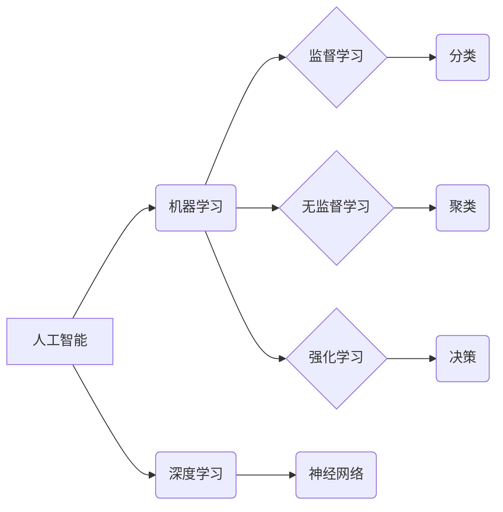

                 

## 科技创新：社会进步的阶梯

> 关键词：人工智能、科技创新、社会进步、算法、机器学习、深度学习、数据科学、未来趋势

## 1. 背景介绍

人类文明的进步离不开科技创新的推动。从火的使用到互联网的普及，每一次科技突破都深刻地改变着我们的生活方式、社会结构和认知方式。在当今信息时代，科技创新正以前所未有的速度发展，人工智能（AI）作为其中最具颠覆性的技术之一，正在迅速改变着世界。

人工智能的出现，标志着人类进入了一个新的科技时代。它赋予机器以学习、推理和决策的能力，打破了传统计算机处理信息固有的局限性。AI技术在各个领域都展现出巨大的应用潜力，例如医疗诊断、金融风险控制、交通管理、智能制造等。

然而，科技创新也面临着诸多挑战。伦理问题、数据安全、人才短缺等问题都需要我们认真思考和解决。只有在兼顾伦理和社会效益的前提下，才能确保科技创新真正造福人类。

## 2. 核心概念与联系

### 2.1  人工智能（AI）

人工智能是指模拟人类智能行为的计算机系统。它涵盖了多个子领域，例如机器学习、深度学习、自然语言处理、计算机视觉等。

### 2.2  机器学习（ML）

机器学习是人工智能的一个重要分支，它通过算法训练模型，使模型能够从数据中学习并做出预测或决策。机器学习算法可以分为监督学习、无监督学习和强化学习三大类。

### 2.3  深度学习（DL）

深度学习是机器学习的一个子领域，它使用多层神经网络来模拟人类大脑的学习过程。深度学习算法能够处理海量数据，并从中提取出复杂的特征，从而实现更精准的预测和决策。

**核心概念与联系流程图**



## 3. 核心算法原理 & 具体操作步骤

### 3.1  算法原理概述

**支持向量机（SVM）**是一种常用的机器学习算法，它用于分类和回归问题。SVM的目标是找到一个最佳的分隔超平面，将不同类别的数据点分开。

### 3.2  算法步骤详解

1. **数据预处理:** 将原始数据进行清洗、转换和特征工程，使其适合SVM算法的训练。
2. **核函数选择:** 选择合适的核函数，将数据映射到高维空间，以便找到更优的分隔超平面。常见的核函数包括线性核、多项式核、径向基函数核等。
3. **参数优化:** 通过优化算法，例如SMO算法，找到最佳的模型参数，例如惩罚参数C和核函数参数γ。
4. **模型训练:** 使用训练数据训练SVM模型，得到最佳的分隔超平面。
5. **模型预测:** 将新数据输入到训练好的模型中，根据分隔超平面的位置进行分类或回归预测。

### 3.3  算法优缺点

**优点:**

* 能够处理高维数据。
* 对非线性数据具有较好的分类能力。
* 具有较好的泛化能力。

**缺点:**

* 训练时间较长，尤其是在数据量较大时。
* 参数选择较为复杂，需要经验和技巧。
* 对数据噪声较为敏感。

### 3.4  算法应用领域

SVM算法广泛应用于图像识别、文本分类、手写识别、生物信息学等领域。

## 4. 数学模型和公式 & 详细讲解 & 举例说明

### 4.1  数学模型构建

SVM的目标是找到一个最佳的分隔超平面，使得不同类别的数据点尽可能远离超平面。

**定义:**

* 数据点: $x_i \in R^n$
* 类别标签: $y_i \in {-1, 1}$
* 分隔超平面: $w^Tx + b = 0$
* 其中，$w$是权重向量，$b$是偏置项。

**目标函数:**

SVM的目标函数是最大化分隔超平面的间隔，即最大化最小距离。

$$
\max_{w,b} \frac{2}{\|w\|}
$$

**约束条件:**

$$
y_i (w^Tx_i + b) \ge 1, \quad i = 1, 2, ..., N
$$

### 4.2  公式推导过程

通过拉格朗日乘子法，将上述目标函数和约束条件转化为无约束优化问题，并求解得到最佳的$w$和$b$。

### 4.3  案例分析与讲解

假设我们有以下数据点:

* $x_1 = (1, 1), y_1 = 1$
* $x_2 = (2, 2), y_2 = 1$
* $x_3 = (0, 0), y_3 = -1$

我们可以使用SVM算法找到最佳的分隔超平面，将这三个数据点分类。

## 5. 项目实践：代码实例和详细解释说明

### 5.1  开发环境搭建

* Python 3.x
* scikit-learn库

### 5.2  源代码详细实现

```python
from sklearn import svm
from sklearn.datasets import make_blobs

# 生成样本数据
X, y = make_blobs(n_samples=100, centers=2, random_state=42)

# 创建SVM模型
clf = svm.SVC(kernel='linear')

# 训练模型
clf.fit(X, y)

# 预测新数据
new_data = [[1, 2], [3, 4]]
predictions = clf.predict(new_data)

# 打印预测结果
print(predictions)
```

### 5.3  代码解读与分析

* `make_blobs()`函数生成两个类别的数据点。
* `svm.SVC()`函数创建SVM模型，`kernel='linear'`指定使用线性核函数。
* `clf.fit(X, y)`函数训练SVM模型。
* `clf.predict(new_data)`函数预测新数据的类别。

### 5.4  运行结果展示

运行上述代码，将输出新数据的预测类别。

## 6. 实际应用场景

SVM算法在各个领域都有广泛的应用，例如：

* **图像识别:** 用于识别物体、人脸、场景等。
* **文本分类:** 用于分类新闻、邮件、评论等文本。
* **手写识别:** 用于识别手写数字、字母等。
* **生物信息学:** 用于基因分类、蛋白质结构预测等。

### 6.4  未来应用展望

随着人工智能技术的不断发展，SVM算法的应用场景将会更加广泛。例如，在自动驾驶、医疗诊断、金融风险控制等领域，SVM算法将发挥越来越重要的作用。

## 7. 工具和资源推荐

### 7.1  学习资源推荐

* **书籍:**
    * 《机器学习》 - 周志华
    * 《深入理解机器学习》 -  李航
* **在线课程:**
    * Coursera: Machine Learning
    * edX: Artificial Intelligence

### 7.2  开发工具推荐

* **Python:** 
    * scikit-learn
    * TensorFlow
    * PyTorch

### 7.3  相关论文推荐

* **Support Vector Machines** - Vapnik, V. N. (1995)
* **A Tutorial on Support Vector Machines for Pattern Recognition** - Cristianini, N., & Shawe-Taylor, J. (2000)

## 8. 总结：未来发展趋势与挑战

### 8.1  研究成果总结

SVM算法作为一种经典的机器学习算法，在分类和回归问题中取得了显著的成果。它具有良好的泛化能力和对非线性数据的处理能力，在各个领域都有广泛的应用。

### 8.2  未来发展趋势

* **高效性提升:** 研究更高效的SVM算法，例如核方法的改进、在线学习算法等，以提高算法的训练速度和预测效率。
* **鲁棒性增强:** 研究更鲁棒的SVM算法，使其能够更好地应对数据噪声、异常值和分布变化等挑战。
* **解释性增强:** 研究更具解释性的SVM算法，以便更好地理解模型的决策过程，提高模型的可信度和可解释性。

### 8.3  面临的挑战

* **高维数据处理:** 当数据维度很高时，SVM算法的训练时间和内存消耗会显著增加，需要研究更高效的处理方法。
* **参数选择:** SVM算法的参数选择较为复杂，需要经验和技巧，如何自动选择最佳参数仍然是一个挑战。
* **非线性数据处理:** 对于复杂非线性数据，需要选择合适的核函数，否则模型的性能会受到影响。

### 8.4  研究展望

未来，SVM算法的研究将继续朝着更高效、更鲁棒、更具解释性的方向发展。随着人工智能技术的不断进步，SVM算法将继续发挥重要作用，推动各个领域的科技创新。

## 9. 附录：常见问题与解答

**问题:** SVM算法的训练时间较长，如何提高训练效率？

**解答:**

* 使用核方法的改进，例如随机核方法。
* 使用在线学习算法，逐步训练模型。
* 使用并行计算技术，加速模型训练。

**问题:** SVM算法的参数选择较为复杂，如何选择最佳参数？

**解答:**

* 使用交叉验证方法，在训练数据上进行多次训练和测试，选择最佳参数组合。
* 使用网格搜索或随机搜索等方法，自动搜索最佳参数。
* 参考已有文献和经验，选择合适的初始参数。


作者：禅与计算机程序设计艺术 / Zen and the Art of Computer Programming 
<end_of_turn>

