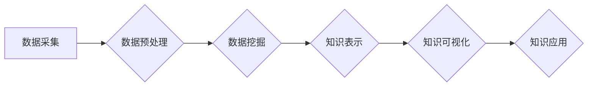

                 

## 程序员如何利用知识发现引擎实现财富自由

> 关键词：知识发现引擎、数据挖掘、机器学习、财富自由、程序员、商业价值、人工智能

### 1. 背景介绍

在当今数据爆炸的时代，信息已经成为最宝贵的资源。程序员作为信息处理和技术创新的核心力量，拥有着独特的优势，可以利用知识发现引擎（KDE）挖掘数据中的价值，实现财富自由。

KDE是一种利用机器学习、数据挖掘等技术，从海量数据中发现隐藏的知识和模式的系统。它可以帮助程序员识别趋势、预测未来、发现新的商业机会，从而创造价值并获得回报。

### 2. 核心概念与联系

#### 2.1  知识发现引擎 (KDE)

KDE 是指利用计算机技术从海量数据中发现隐藏的知识和模式的系统。它通常包含以下几个核心模块：

* **数据预处理:** 清洗、转换和格式化数据，使其适合后续分析。
* **数据挖掘:** 使用算法从数据中提取有价值的信息，例如关联规则、分类模式和聚类结构。
* **知识表示:** 将挖掘出的知识以可理解的形式表示出来，例如图表、报告或知识图谱。
* **知识可视化:** 将知识以直观的方式呈现出来，帮助用户理解和利用发现的知识。

#### 2.2  数据挖掘与机器学习

数据挖掘和机器学习是KDE的核心技术。数据挖掘是指从数据中发现模式和规律，而机器学习是指让计算机通过学习数据自动发现规律。

数据挖掘算法可以分为以下几类：

* **关联规则挖掘:** 发现数据中存在关联关系的项集，例如市场营销中的关联商品推荐。
* **分类:** 将数据划分为不同的类别，例如垃圾邮件过滤。
* **聚类:** 将数据按照相似性分组，例如客户群分析。
* **回归:** 预测连续数值，例如股票价格预测。

机器学习算法可以分为监督学习、无监督学习和强化学习。监督学习需要 labeled 数据，无监督学习不需要 labeled 数据，强化学习通过奖励和惩罚来训练模型。

#### 2.3  KDE 架构



### 3. 核心算法原理 & 具体操作步骤

#### 3.1  算法原理概述

KDE的核心算法原理是利用数据挖掘和机器学习技术，从海量数据中发现隐藏的知识和模式。

#### 3.2  算法步骤详解

1. **数据采集:** 从各种数据源收集相关数据，例如数据库、文件、网络等。
2. **数据预处理:** 清洗、转换和格式化数据，例如删除重复数据、处理缺失值、归一化数据等。
3. **特征选择:** 选择与目标知识相关的特征，例如文本中的关键词、图像中的颜色特征等。
4. **模型训练:** 使用机器学习算法对数据进行训练，例如训练分类模型、聚类模型等。
5. **模型评估:** 使用测试数据评估模型的性能，例如准确率、召回率等。
6. **知识发现:** 利用训练好的模型从数据中发现知识，例如发现关联规则、分类模式、聚类结构等。
7. **知识表示:** 将发现的知识以可理解的形式表示出来，例如图表、报告或知识图谱。
8. **知识可视化:** 将知识以直观的方式呈现出来，帮助用户理解和利用发现的知识。

#### 3.3  算法优缺点

**优点:**

* 可以从海量数据中发现隐藏的知识和模式。
* 可以帮助程序员识别趋势、预测未来、发现新的商业机会。
* 可以提高决策效率和准确性。

**缺点:**

* 需要大量的计算资源和时间。
* 需要专业的知识和技能。
* 发现的知识可能存在偏差或误差。

#### 3.4  算法应用领域

KDE在各个领域都有广泛的应用，例如：

* **商业分析:** 发现市场趋势、客户行为模式、产品需求等。
* **金融分析:** 预测股票价格、识别欺诈交易、评估风险等。
* **医疗诊断:** 辅助医生诊断疾病、预测患者风险、发现新的治疗方法等。
* **科学研究:** 发现新的物理规律、生物机制、社会现象等。

### 4. 数学模型和公式 & 详细讲解 & 举例说明

#### 4.1  数学模型构建

KDE的数学模型通常基于统计学、概率论和机器学习算法。

#### 4.2  公式推导过程

例如，在分类问题中，可以使用逻辑回归模型，其目标函数为：

$$
L(w) = -\frac{1}{m} \sum_{i=1}^{m} y_i \log(h_\theta(x_i)) + (1-y_i) \log(1-h_\theta(x_i))
$$

其中：

* $w$ 是模型参数
* $m$ 是训练样本数量
* $y_i$ 是第 $i$ 个样本的真实标签
* $h_\theta(x_i)$ 是模型对第 $i$ 个样本的预测概率

#### 4.3  案例分析与讲解

例如，可以使用KDE从用户浏览历史数据中发现用户兴趣，并推荐相关商品。

### 5. 项目实践：代码实例和详细解释说明

#### 5.1  开发环境搭建

可以使用Python语言和相关库，例如Scikit-learn、Pandas、Numpy等，搭建KDE开发环境。

#### 5.2  源代码详细实现

```python
from sklearn.feature_extraction.text import TfidfVectorizer
from sklearn.metrics.pairwise import cosine_similarity

# 数据预处理
def preprocess_data(text):
  # ...

# 特征提取
vectorizer = TfidfVectorizer()
tfidf_matrix = vectorizer.fit_transform(text_data)

# 计算余弦相似度
similarity_matrix = cosine_similarity(tfidf_matrix)

# 查找相似文档
def find_similar_documents(query_text, top_n=5):
  # ...

# 应用案例
query_text = "编程语言"
similar_documents = find_similar_documents(query_text)
print(similar_documents)
```

#### 5.3  代码解读与分析

这段代码演示了如何使用TfidfVectorizer和cosine_similarity计算文本之间的相似度。

#### 5.4  运行结果展示

运行结果将显示与查询文本最相似的文档列表。

### 6. 实际应用场景

#### 6.1  程序员个人成长

程序员可以利用KDE分析代码库、学习资源、技术文档等数据，发现学习趋势、掌握新技术、提升编程能力。

#### 6.2  开源项目贡献

程序员可以利用KDE分析开源项目代码、用户反馈、问题报告等数据，发现项目缺陷、改进项目设计、提高项目质量。

#### 6.3  创业项目开发

程序员可以利用KDE分析市场需求、用户行为、竞争对手等数据，发现创业机会、开发创新产品、获得商业成功。

#### 6.4  未来应用展望

随着人工智能技术的不断发展，KDE将应用更加广泛，例如：

* **个性化学习:** 根据用户的学习风格和需求，提供个性化的学习方案。
* **智能代码生成:** 根据用户的需求，自动生成代码片段或完整程序。
* **自动测试:** 自动生成测试用例，提高软件测试效率。

### 7. 工具和资源推荐

#### 7.1  学习资源推荐

* **书籍:**
    * "Data Mining: Concepts and Techniques" by Jiawei Han, Micheline Kamber, and Jian Pei
    * "Introduction to Machine Learning" by Ethem Alpaydin
* **在线课程:**
    * Coursera: Machine Learning by Andrew Ng
    * edX: Data Science Fundamentals

#### 7.2  开发工具推荐

* **Python:** 
    * Scikit-learn: 机器学习库
    * Pandas: 数据分析库
    * Numpy: 数值计算库
* **其他工具:**
    * Weka: 数据挖掘工具
    * RapidMiner: 数据科学平台

#### 7.3  相关论文推荐

* "A Survey of Knowledge Discovery and Data Mining" by Fayyad, U., Piatetsky-Shapiro, G., Smyth, P., &  
* "The Elements of Statistical Learning" by Trevor Hastie, Robert Tibshirani, and Jerome Friedman

### 8. 总结：未来发展趋势与挑战

#### 8.1  研究成果总结

KDE已经取得了显著的成果，在各个领域都有广泛的应用。

#### 8.2  未来发展趋势

未来KDE的发展趋势包括：

* **更强大的算法:** 开发更精确、更有效的算法，例如深度学习算法。
* **更丰富的知识表示:** 探索新的知识表示形式，例如知识图谱和语义网络。
* **更智能的应用:** 开发更智能的KDE应用，例如自动学习和决策。

#### 8.3  面临的挑战

KDE还面临一些挑战，例如：

* **数据质量问题:** 海量数据中存在大量噪声和错误，需要进行有效的清洗和处理。
* **算法解释性问题:** 一些KDE算法难以解释，难以理解其决策过程。
* **伦理问题:** KDE的应用可能引发一些伦理问题，例如数据隐私和算法偏见。

#### 8.4  研究展望

未来KDE的研究将继续探索更强大的算法、更丰富的知识表示和更智能的应用，并解决数据质量、算法解释性和伦理等问题。

### 9. 附录：常见问题与解答

#### 9.1  Q1: KDE需要哪些技术技能？

**A1:** KDE需要掌握数据挖掘、机器学习、编程等技术技能。

#### 9.2  Q2: KDE的应用场景有哪些？

**A2:** KDE的应用场景非常广泛，例如商业分析、金融分析、医疗诊断、科学研究等。

#### 9.3  Q3: 如何选择合适的KDE算法？

**A3:** 选择合适的KDE算法需要根据具体应用场景和数据特点进行选择。

#### 9.4  Q4: KDE的伦理问题有哪些？

**A4:** KDE的应用可能引发数据隐私和算法偏见等伦理问题。


作者：禅与计算机程序设计艺术 / Zen and the Art of Computer Programming 
<end_of_turn>

