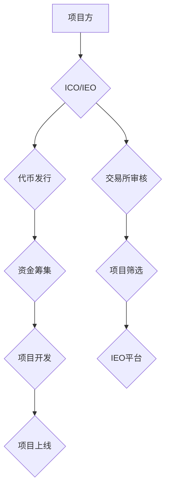

                 

## 程序员如何评估并参与ICO与IEO项目

> 关键词：ICO, IEO, 区块链, 代币, 风险评估, 项目分析, 技术架构, 合规性

## 1. 背景介绍

近年来，区块链技术蓬勃发展，其去中心化、透明和安全等特性吸引了众多开发者和投资者。ICO（首次代币发行）和IEO（首次加密货币发行）作为区块链项目筹集资金的重要方式，也逐渐成为市场热点。然而，ICO和IEO市场也存在着诸多风险和挑战，许多项目最终以失败告终，投资者遭受重大损失。

对于程序员而言，参与ICO和IEO项目不仅可以获得潜在的财务回报，更重要的是可以接触到前沿的区块链技术，参与到行业发展中来。然而，如何评估和参与ICO和IEO项目，需要程序员具备一定的专业知识和风险意识。

## 2. 核心概念与联系

### 2.1 ICO与IEO

* **ICO（Initial Coin Offering）:**  首次代币发行，是指区块链项目方通过发行代币来筹集资金。ICO通常由项目方直接发行代币，并通过在线平台进行销售。

* **IEO（Initial Exchange Offering）:** 首次加密货币发行，是指区块链项目方通过与已有的加密货币交易所合作，在交易所平台上发行代币。IEO通常比ICO更加规范和透明，因为交易所会对项目进行审核和筛选。

**ICO与IEO的关系:**

IEO可以看作是ICO的一种升级版，它在ICO的基础上增加了交易所的参与和监管，从而降低了项目风险和欺诈可能性。

**Mermaid 流程图:**



### 2.2 代币经济学

代币经济学是研究代币在区块链网络中的价值和流通机制的学科。它涉及到代币的供应量、发行机制、使用场景、价值驱动因素等多个方面。

**代币经济学与ICO/IEO的关系:**

代币经济学是ICO和IEO项目成功的关键因素之一。一个合理的代币经济模型可以有效地分配代币价值，激励用户参与，并确保项目的长期可持续发展。

## 3. 核心算法原理 & 具体操作步骤

### 3.1 算法原理概述

ICO和IEO项目通常会采用一些特定的算法来实现代币发行、分配和管理。这些算法通常涉及到加密算法、智能合约、分布式账本技术等。

**例如:**

* **Proof-of-Stake (PoS):** 是一种共识机制，通过持有代币来验证交易和维护网络安全。
* **Token Distribution Algorithm:** 用于分配代币给不同参与者，例如团队成员、早期投资者、社区贡献者等。

### 3.2 算法步骤详解

具体算法步骤会根据项目的具体需求而有所不同，但一般包括以下几个阶段:

1. **代币发行:** 项目方根据预设的代币发行计划，将代币铸造出来并存入智能合约。
2. **代币分配:** 根据代币分配算法，将代币分配给不同参与者。
3. **代币交易:** 用户可以通过交易所或去中心化交易平台进行代币交易。
4. **代币销毁:** 项目方可能会根据项目发展情况，销毁部分代币以控制供应量和维护代币价值。

### 3.3 算法优缺点

**优点:**

* **透明度高:** 算法公开透明，所有参与者都可以了解代币发行和分配机制。
* **安全性高:** 基于加密算法和智能合约，可以有效防止代币被盗或伪造。
* **可编程性强:** 算法可以根据项目需求进行定制化开发，实现灵活的代币管理机制。

**缺点:**

* **复杂性高:** 算法设计和实现需要专业的技术能力。
* **可维护性差:** 算法一旦部署，修改和维护难度较大。
* **风险不可控:** 算法本身无法完全消除项目风险，例如市场波动、技术缺陷等。

### 3.4 算法应用领域

* **去中心化金融 (DeFi):** 代币经济学在DeFi领域中扮演着至关重要的角色，例如稳定币、借贷协议、去中心化交易所等。
* **游戏化:** 代币经济学可以用于设计游戏中的虚拟经济系统，激励玩家参与游戏并获得奖励。
* **供应链管理:** 代币经济学可以用于追踪和管理供应链中的商品和信息，提高效率和透明度。

## 4. 数学模型和公式 & 详细讲解 & 举例说明

### 4.1 数学模型构建

代币经济学模型通常会使用数学公式来描述代币的价值、流通量、供需关系等因素。

**例如:**

* **代币价值模型:**  

$$
V = \frac{S}{D}
$$

其中:

* $V$ 代表代币价值
* $S$ 代表代币总供应量
* $D$ 代表代币市场需求量

* **代币流通量模型:**

$$
Circulating Supply = Total Supply - Locked Supply
$$

其中:

* $Circulating Supply$ 代表流通中的代币数量
* $Total Supply$ 代表代币总供应量
* $Locked Supply$ 代表被锁定或不可流通的代币数量

### 4.2 公式推导过程

代币价值模型和代币流通量模型的推导过程基于经济学的基本原理和市场机制。

* **代币价值模型:** 代币价值取决于其总供应量和市场需求量。当供应量固定时，需求量增加会导致代币价值上升；反之，需求量减少会导致代币价值下降。

* **代币流通量模型:** 代币流通量是指市场上可供交易的代币数量。流通量会影响代币的流动性和价格波动性。

### 4.3 案例分析与讲解

假设一个区块链项目发行总量为1000万个代币，其中500万个代币被锁定在智能合约中，用于项目发展和团队激励。那么，流通中的代币数量为500万个。

如果市场对该项目的兴趣很高，需求量超过了流通量，那么代币价格就会上涨。反之，如果市场对该项目的兴趣不高，需求量低于流通量，那么代币价格就会下跌。

## 5. 项目实践：代码实例和详细解释说明

### 5.1 开发环境搭建

参与ICO和IEO项目开发通常需要使用以下开发环境:

* **区块链平台:** 选择合适的区块链平台，例如以太坊、波卡、Solana等。
* **智能合约开发工具:** 使用 Solidity、Vyper、Rust等语言开发智能合约。
* **开发环境:** 安装必要的软件工具，例如 Truffle、Hardhat、Remix等。

### 5.2 源代码详细实现

由于篇幅限制，这里只提供一个简单的代币发行智能合约的代码示例:

```solidity
pragma solidity ^0.8.0;

contract MyToken {
    string public name = "My Token";
    string public symbol = "MTK";
    uint8 public decimals = 18;
    uint256 public totalSupply;

    mapping(address => uint256) public balanceOf;

    event Transfer(address indexed from, address indexed to, uint256 value);

    constructor(uint256 initialSupply) {
        totalSupply = initialSupply;
        balanceOf[msg.sender] = initialSupply;
    }

    function transfer(address to, uint256 value) public returns (bool) {
        require(balanceOf[msg.sender] >= value, "Insufficient balance");
        balanceOf[msg.sender] -= value;
        balanceOf[to] += value;
        emit Transfer(msg.sender, to, value);
        return true;
    }
}
```

### 5.3 代码解读与分析

* **pragma solidity ^0.8.0;:** 指定合约的 Solidity 版本。
* **contract MyToken { ... }:** 定义一个名为 MyToken 的智能合约。
* **string public name = "My Token";:** 定义代币名称。
* **string public symbol = "MTK";:** 定义代币符号。
* **uint8 public decimals = 18;:** 定义代币的小数位数。
* **uint256 public totalSupply;:** 定义代币总供应量。
* **mapping(address => uint256) public balanceOf;:** 定义每个地址的代币余额。
* **event Transfer(address indexed from, address indexed to, uint256 value);:** 定义代币转账事件。
* **constructor(uint256 initialSupply) { ... }:** 合约构造函数，用于初始化代币总供应量。
* **function transfer(address to, uint256 value) public returns (bool) { ... }:** 定义代币转账函数。

### 5.4 运行结果展示

部署合约后，可以利用区块链浏览器查看代币发行、转账等操作记录。

## 6. 实际应用场景

ICO和IEO项目在各个领域都有着广泛的应用场景:

* **去中心化金融 (DeFi):** 代币可以用于构建去中心化的借贷、交易、保险等金融服务。
* **游戏化:** 代币可以作为游戏中的虚拟货币，激励玩家参与游戏并获得奖励。
* **供应链管理:** 代币可以用于追踪和管理供应链中的商品和信息，提高效率和透明度。
* **数据共享:** 代币可以激励用户分享数据，并获得相应的收益。

### 6.4 未来应用展望

随着区块链技术的不断发展，ICO和IEO项目将会有更广泛的应用场景，例如:

* **数字身份:** 代币可以用于构建去中心化的数字身份系统，保障用户隐私和数据安全。
* **投票和治理:** 代币可以用于构建去中心化的投票和治理系统，提高决策透明度和参与度。
* **知识付费:** 代币可以用于构建知识付费平台，让创作者和用户获得更公平的收益。

## 7. 工具和资源推荐

### 7.1 学习资源推荐

* **书籍:**

    * 《Mastering Ethereum》
    * 《Blockchain Basics》
    * 《Cryptoassets》

* **在线课程:**

    * Coursera: Blockchain Specialization
    * Udemy: Blockchain Development

* **博客和论坛:**

    * Ethereum.org
    * BitcoinTalk

### 7.2 开发工具推荐

* **智能合约开发工具:**

    * Truffle
    * Hardhat
    * Remix

* **区块链浏览器:**

    * Etherscan
    * Polygonscan

* **钱包:**

    * MetaMask
    * MyEtherWallet

### 7.3 相关论文推荐

* **The Bitcoin Whitepaper:** https://bitcoin.org/bitcoin.pdf
* **Ethereum Whitepaper:** https://ethereum.org/en/whitepaper/
* **A Survey of Blockchain Technology:** https://arxiv.org/abs/1803.05342

## 8. 总结：未来发展趋势与挑战

### 8.1 研究成果总结

ICO和IEO项目已经成为区块链领域的重要融资方式，并推动了区块链技术的创新发展。代币经济学模型为区块链项目提供了有效的价值分配和激励机制。

### 8.2 未来发展趋势

* **监管趋严:** 随着ICO和IEO项目的快速发展，各国政府将加强对该领域的监管，制定更完善的法律法规。
* **技术创新:** 区块链技术将不断发展，新的应用场景和商业模式将不断涌现。
* **生态建设:** 区块链生态系统将更加完善，更多的开发者、投资者和用户将参与其中。

### 8.3 面临的挑战

* **项目风险:** ICO和IEO项目存在着一定的风险，例如技术缺陷、团队跑路、市场波动等。
* **监管不确定性:** 监管政策的不确定性可能会影响项目的顺利发展。
* **技术复杂性:** 区块链技术本身较为复杂，需要专业的技术能力才能参与开发和运营。

### 8.4 研究展望

未来，研究者将继续探索ICO和IEO项目的优化方案，降低项目风险，提高项目透明度和可信度。同时，也将研究区块链技术的应用场景，推动区块链技术在各个领域的落地应用。

## 9. 附录：常见问题与解答

**1. ICO和IEO的区别是什么？**

ICO是指项目方直接发行代币，而IEO是指项目方与已有的加密货币交易所合作，在交易所平台上发行代币。

**2. 如何评估ICO和IEO项目的风险？**

需要评估项目团队、技术方案、市场需求、代币经济模型等多个方面。

**3. 如何参与ICO和IEO项目？**

需要选择合适的交易所或平台，并完成KYC身份验证。

**4. ICO和IEO项目是否合法？**

ICO和IEO项目的合法性取决于所在国家的法律法规。

**5. 如何保护自己的利益？**

需要谨慎选择项目，做好风险控制，并了解相关的法律法规。


作者：禅与计算机程序设计艺术 / Zen and the Art of Computer Programming<end_of_turn>

