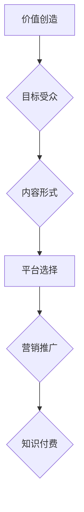

                 

## 程序员的知识付费内容创作工具箱

> 关键词：知识付费、程序员、内容创作、工具、技术博客、在线课程、技术文档、代码示例、算法、数据结构、软件架构

## 1. 背景介绍

随着互联网的蓬勃发展，知识付费市场迅速崛起，程序员作为技术领域的重要力量，也开始积极参与其中。越来越多的程序员选择通过知识付费的方式分享自己的技术经验和技能，并从中获得收益。然而，知识付费内容创作并非易事，需要程序员具备一定的写作能力、教学能力和内容策划能力。

为了帮助程序员更好地进行知识付费内容创作，本文将介绍一些常用的工具和方法，并结合具体的案例进行讲解，希望能为程序员提供一些有价值的参考。

## 2. 核心概念与联系

知识付费内容创作的核心概念包括：

* **价值创造:**  程序员需要提供具有真实价值的内容，例如解决实际问题、提升技能、分享经验等。
* **目标受众:**  程序员需要明确自己的目标受众，并根据他们的需求和水平进行内容创作。
* **内容形式:**  知识付费内容可以采用多种形式，例如技术博客文章、在线课程、技术文档、代码示例等。
* **平台选择:**  程序员需要选择合适的平台进行内容发布和推广，例如博客平台、在线教育平台、技术社区等。
* **营销推广:**  程序员需要进行有效的营销推广，以吸引目标受众并提升内容的曝光度。

**Mermaid 流程图:**



## 3. 核心算法原理 & 具体操作步骤

### 3.1  算法原理概述

知识付费内容创作的本质是一种信息传递和价值交换的过程，可以将其视为一种算法。该算法的核心在于：

* **信息收集:**  程序员需要收集相关领域的知识和信息，例如技术文档、开源代码、行业案例等。
* **信息加工:**  程序员需要对收集到的信息进行加工和整理，例如提取关键信息、进行结构化分析、撰写清晰的文字等。
* **信息输出:**  程序员需要将加工后的信息以合适的形式输出，例如技术博客文章、在线课程、技术文档等。

### 3.2  算法步骤详解

1. **确定主题:**  选择一个具有价值和吸引力的主题，并进行市场调研，了解目标受众的需求。
2. **收集信息:**  通过阅读技术文档、开源代码、行业案例等方式，收集相关领域的知识和信息。
3. **结构化信息:**  对收集到的信息进行分类、整理和结构化，形成清晰的逻辑框架。
4. **撰写内容:**  根据逻辑框架，撰写清晰、简洁、易懂的文字内容，并使用代码示例、图表等辅助说明。
5. **编辑和排版:**  对撰写的文字内容进行编辑和排版，确保内容的准确性、完整性和美观性。
6. **发布和推广:**  选择合适的平台进行内容发布和推广，例如博客平台、在线教育平台、技术社区等。

### 3.3  算法优缺点

**优点:**

* **可重复性强:**  一旦确定了主题和内容框架，程序员可以重复使用该算法创作多个类似的内容。
* **效率高:**  通过使用工具和模板，程序员可以提高内容创作的效率。
* **可量化:**  可以通过网站流量、用户反馈等指标来衡量内容的价值和效果。

**缺点:**

* **缺乏创意:**  如果过度依赖算法，可能会导致内容缺乏创意和个性。
* **容易被模仿:**  算法本身并不具有独特性，容易被其他程序员模仿。
* **需要不断更新:**  技术领域发展迅速，需要不断更新内容以保持其价值和吸引力。

### 3.4  算法应用领域

该算法可以应用于以下领域：

* **技术博客文章创作:**  程序员可以利用该算法创作技术博客文章，分享自己的技术经验和技能。
* **在线课程开发:**  程序员可以利用该算法开发在线课程，教授编程语言、软件开发技术等知识。
* **技术文档撰写:**  程序员可以利用该算法撰写技术文档，帮助用户理解和使用软件产品。
* **代码示例制作:**  程序员可以利用该算法制作代码示例，帮助用户学习和理解编程代码。

## 4. 数学模型和公式 & 详细讲解 & 举例说明

### 4.1  数学模型构建

知识付费内容创作可以抽象为一个数学模型，其中：

* **价值 (V):**  内容的价值取决于其信息量、实用性、原创性等因素。
* **成本 (C):**  内容创作的成本包括时间成本、精力成本、工具成本等。
* **收益 (R):**  内容创作的收益取决于内容的价值、受众规模、推广力度等因素。

该模型可以表示为：

$$R = f(V, C)$$

其中，f()为一个复杂的函数，反映了价值、成本和收益之间的关系。

### 4.2  公式推导过程

为了最大化收益，程序员需要找到一个最佳的价值-成本平衡点。

$$
\begin{aligned}
\text{最大化 } R &= f(V, C) \\
\text{约束条件: } C &\leq K
\end{aligned}
$$

其中，K为程序员可支配的成本上限。

通过优化该模型，程序员可以找到最佳的价值和成本组合，从而最大化收益。

### 4.3  案例分析与讲解

例如，一个程序员想创作一个关于机器学习的在线课程。

* **价值 (V):**  课程内容涵盖了机器学习的基础知识、算法原理、应用案例等，具有较高的实用性和原创性。
* **成本 (C):**  课程的制作成本包括录制视频、编写教材、进行推广等，总成本约为10000元。
* **收益 (R):**  课程的售价为500元，预计可以吸引100名学员报名，总收益为50000元。

在这个案例中，程序员的收益远大于成本，因此该课程的价值-成本平衡点是合理的。

## 5. 项目实践：代码实例和详细解释说明

### 5.1  开发环境搭建

为了方便程序员进行知识付费内容创作，可以搭建一个开发环境，包括：

* **文本编辑器:**  例如VS Code、Sublime Text等，用于撰写代码和文档。
* **版本控制系统:**  例如Git，用于管理代码版本和协作开发。
* **博客平台:**  例如WordPress、Medium等，用于发布技术博客文章。
* **在线教育平台:**  例如Udemy、Coursera等，用于开发和销售在线课程。

### 5.2  源代码详细实现

以下是一个简单的技术博客文章代码示例，使用Markdown语法进行编写：

```markdown
#  程序员的知识付费内容创作工具箱

> 关键词：知识付费、程序员、内容创作、工具、技术博客、在线课程、技术文档、代码示例、算法、数据结构、软件架构

## 1. 背景介绍

随着互联网的蓬勃发展，知识付费市场迅速崛起，程序员作为技术领域的重要力量，也开始积极参与其中。越来越多的程序员选择通过知识付费的方式分享自己的技术经验和技能，并从中获得收益。然而，知识付费内容创作并非易事，需要程序员具备一定的写作能力、教学能力和内容策划能力。

为了帮助程序员更好地进行知识付费内容创作，本文将介绍一些常用的工具和方法，并结合具体的案例进行讲解，希望能为程序员提供一些有价值的参考。

## 2. 核心概念与联系

知识付费内容创作的核心概念包括：

* **价值创造:**  程序员需要提供具有真实价值的内容，例如解决实际问题、提升技能、分享经验等。
* **目标受众:**  程序员需要明确自己的目标受众，并根据他们的需求和水平进行内容创作。
* **内容形式:**  知识付费内容可以采用多种形式，例如技术博客文章、在线课程、技术文档、代码示例等。
* **平台选择:**  程序员需要选择合适的平台进行内容发布和推广，例如博客平台、在线教育平台、技术社区等。
* **营销推广:**  程序员需要进行有效的营销推广，以吸引目标受众并提升内容的曝光度。

```

### 5.3  代码解读与分析

这段代码示例展示了如何使用Markdown语法编写技术博客文章。Markdown是一种轻量级的标记语言，可以方便地格式化文本内容，例如标题、段落、列表、代码块等。

### 5.4  运行结果展示

运行这段代码示例，将会生成一个简单的技术博客文章，可以发布到博客平台进行阅读。

## 6. 实际应用场景

### 6.1  技术博客文章创作

程序员可以利用Markdown语法和博客平台，创作技术博客文章，分享自己的技术经验和技能，并吸引读者关注。

### 6.2  在线课程开发

程序员可以利用在线教育平台，开发和销售在线课程，教授编程语言、软件开发技术等知识，并获得收益。

### 6.3  技术文档撰写

程序员可以利用Markdown语法和版本控制系统，撰写技术文档，帮助用户理解和使用软件产品，并提高软件的易用性和可维护性。

### 6.4  未来应用展望

随着人工智能技术的不断发展，知识付费内容创作将会更加智能化和个性化。例如，人工智能可以帮助程序员自动生成代码示例、撰写技术文档、甚至开发在线课程。

## 7. 工具和资源推荐

### 7.1  学习资源推荐

* **书籍:**  《程序员的自我修养》、《代码的艺术》、《设计模式》等
* **网站:**  Stack Overflow、GitHub、Medium等
* **在线课程:**  Udemy、Coursera、edX等

### 7.2  开发工具推荐

* **文本编辑器:**  VS Code、Sublime Text、Atom等
* **版本控制系统:**  Git、GitHub、GitLab等
* **博客平台:**  WordPress、Medium、Ghost等
* **在线教育平台:**  Udemy、Coursera、Teachable等

### 7.3  相关论文推荐

* **知识付费市场研究:**  《中国知识付费市场发展报告》
* **人工智能在内容创作中的应用:**  《基于深度学习的文本生成模型》

## 8. 总结：未来发展趋势与挑战

### 8.1  研究成果总结

本文介绍了程序员知识付费内容创作的工具和方法，并分析了其核心概念、算法原理、实际应用场景等。

### 8.2  未来发展趋势

未来，知识付费内容创作将会更加智能化、个性化和平台化。

### 8.3  面临的挑战

程序员知识付费内容创作面临着内容原创性、平台竞争、用户信任等挑战。

### 8.4  研究展望

未来研究可以关注人工智能在知识付费内容创作中的应用，以及如何提高内容的原创性和用户体验。

## 9. 附录：常见问题与解答

* **如何确定知识付费内容的主题？**

  程序员可以根据自己的技术领域、经验和兴趣，选择具有价值和市场需求的主题。

* **如何提高知识付费内容的质量？**

  程序员需要注重内容的原创性、实用性和易读性，并进行反复修改和完善。

* **如何推广知识付费内容？**

  程序员可以利用社交媒体、技术社区、邮件营销等方式进行内容推广。


作者：禅与计算机程序设计艺术 / Zen and the Art of Computer Programming 
<end_of_turn>

