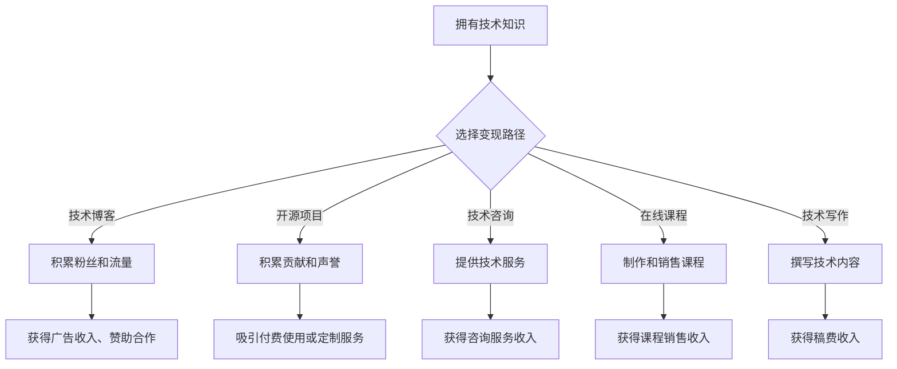

                 

## 程序员的知识变现之路：从技能到财富的转化

> 关键词：程序员，知识变现，技能，财富，技术博客，开源项目，技术咨询，在线课程，技术写作

### 1. 背景介绍

在当今科技飞速发展的时代，程序员作为数字时代的基石，拥有着前所未有的价值。然而，仅仅拥有扎实的编程技能并不能保证程序员的经济成功。如何将自身的技术知识转化为财富，成为众多程序员共同关注的议题。

传统意义上的程序员工作模式，往往局限于为公司提供服务，以薪资作为主要收入来源。但随着互联网的普及和开源文化的兴起，程序员的知识变现方式日益多元化。从技术博客、开源项目到技术咨询、在线课程，程序员可以通过多种途径将自身的技术积累转化为可观的经济收益。

### 2. 核心概念与联系

**2.1 知识变现的本质**

知识变现的核心在于将知识的价值最大化，并将其转化为可货币化的形式。对于程序员而言，其知识主要体现在编程技能、技术经验、项目实战和解决问题的能力等方面。

**2.2 程序员知识变现的路径**

程序员可以通过以下几种路径进行知识变现：

* **技术博客:** 通过撰写技术文章、分享编程经验和项目案例，积累粉丝和流量，从而获得广告收入、赞助合作或推广产品服务的机会。
* **开源项目:** 开发开源软件，积累贡献和声誉，吸引企业或个人付费使用或定制服务。
* **技术咨询:** 利用自身的技术优势，为企业或个人提供技术咨询服务，解决技术难题或提供技术方案。
* **在线课程:** 制作和销售编程课程，将自身的技术知识传授给更多人，获得课程销售收入。
* **技术写作:** 为技术媒体或出版社撰写技术书籍或文章，获得稿费收入。

**2.3 知识变现的流程图**



### 3. 核心算法原理 & 具体操作步骤

**3.1 算法原理概述**

选择一个具体的算法，例如**深度学习算法**，并对其原理进行概述。

深度学习算法是一种基于人工神经网络的机器学习算法，能够从海量数据中自动学习特征，并进行复杂的模式识别和预测。其核心原理是通过多层神经网络结构，将输入数据逐层处理，提取越来越抽象的高层特征，最终实现目标任务。

**3.2 算法步骤详解**

深度学习算法的具体操作步骤包括：

1. **数据预处理:** 对原始数据进行清洗、转换和特征工程，使其适合深度学习模型的训练。
2. **模型构建:** 根据目标任务选择合适的深度学习模型架构，例如卷积神经网络（CNN）、循环神经网络（RNN）或多层感知机（MLP）。
3. **模型训练:** 使用训练数据训练深度学习模型，通过调整模型参数，使其能够准确地预测目标输出。
4. **模型评估:** 使用测试数据评估模型的性能，并根据评估结果进行模型调优。
5. **模型部署:** 将训练好的模型部署到实际应用场景中，用于进行预测或决策。

**3.3 算法优缺点**

**优点:**

* 能够自动学习特征，无需人工特征工程。
* 能够处理海量数据，并从数据中提取复杂模式。
* 在图像识别、自然语言处理等领域取得了突破性进展。

**缺点:**

* 训练数据量要求高，对数据质量要求严格。
* 计算资源消耗大，训练时间长。
* 模型解释性差，难以理解模型的决策过程。

**3.4 算法应用领域**

深度学习算法广泛应用于以下领域：

* **图像识别:** 人脸识别、物体检测、图像分类。
* **自然语言处理:** 机器翻译、文本摘要、情感分析。
* **语音识别:** 语音转文本、语音助手。
* **推荐系统:** 商品推荐、内容推荐。
* **医疗诊断:** 病情预测、疾病诊断。

### 4. 数学模型和公式 & 详细讲解 & 举例说明

**4.1 数学模型构建**

选择一个具体的数学模型，例如**线性回归模型**，并对其进行构建。

线性回归模型是一种用于预测连续变量的监督学习算法。其核心思想是找到一条直线，使得这条直线与训练数据点的距离最小。

**4.2 公式推导过程**

线性回归模型的损失函数为均方误差，其公式如下：

$$
J(\theta) = \frac{1}{2m} \sum_{i=1}^{m} (h_\theta(x^{(i)}) - y^{(i)})^2
$$

其中：

* $J(\theta)$ 为损失函数
* $\theta$ 为模型参数
* $m$ 为训练数据样本数量
* $h_\theta(x^{(i)})$ 为模型预测值
* $y^{(i)}$ 为真实值

通过最小化损失函数，可以得到模型参数的最佳值。

**4.3 案例分析与讲解**

假设我们想要预测房屋价格，已知房屋面积和房屋所在城市的特征数据。我们可以使用线性回归模型，将房屋面积和城市特征作为输入特征，预测房屋价格。

通过训练数据，模型会学习到房屋面积和城市特征与房屋价格之间的关系，并找到一条最佳的直线来拟合数据。

### 5. 项目实践：代码实例和详细解释说明

**5.1 开发环境搭建**

选择合适的编程语言和开发环境，例如Python和Jupyter Notebook。

**5.2 源代码详细实现**

使用Python语言实现线性回归模型的代码示例：

```python
import numpy as np
from sklearn.linear_model import LinearRegression

# 训练数据
X = np.array([[100, 1], [150, 2], [200, 3], [250, 4]])
y = np.array([200, 250, 300, 350])

# 创建线性回归模型
model = LinearRegression()

# 训练模型
model.fit(X, y)

# 预测新数据
new_data = np.array([[300, 5]])
prediction = model.predict(new_data)

# 打印预测结果
print(prediction)
```

**5.3 代码解读与分析**

代码首先导入必要的库，然后定义训练数据和目标变量。接着创建线性回归模型对象，并使用`fit()`方法训练模型。最后使用`predict()`方法预测新数据的房屋价格。

**5.4 运行结果展示**

运行代码后，会输出预测结果，例如：

```
[400.0]
```

这表示根据模型的训练结果，房屋面积为300平方米，位于城市5的房屋价格预计为400元。

### 6. 实际应用场景

**6.1 房屋价格预测**

使用深度学习算法可以对房屋价格进行更精准的预测，考虑更多因素，例如房屋地理位置、装修状况、周边设施等。

**6.2 医疗诊断辅助**

深度学习算法可以辅助医生进行疾病诊断，例如识别病理图像、分析患者症状等，提高诊断准确率。

**6.3 自动驾驶**

深度学习算法是自动驾驶的核心技术之一，用于识别道路场景、预测车辆运动轨迹、控制车辆行驶等。

**6.4 未来应用展望**

随着人工智能技术的不断发展，深度学习算法将在更多领域得到应用，例如个性化教育、金融风险控制、智能客服等。

### 7. 工具和资源推荐

**7.1 学习资源推荐**

* **在线课程:** Coursera、edX、Udacity等平台提供深度学习相关的在线课程。
* **书籍:** 《深度学习》、《神经网络与深度学习》等书籍对深度学习算法进行了深入讲解。
* **开源库:** TensorFlow、PyTorch等开源库提供了深度学习模型的实现和训练工具。

**7.2 开发工具推荐**

* **Jupyter Notebook:** 用于编写和运行Python代码，可视化数据和模型结果。
* **VS Code:** 强大的代码编辑器，支持Python开发和调试。
* **Git:** 用于版本控制和代码协作。

**7.3 相关论文推荐**

* **《ImageNet Classification with Deep Convolutional Neural Networks》**
* **《Attention Is All You Need》**
* **《Generative Adversarial Networks》**

### 8. 总结：未来发展趋势与挑战

**8.1 研究成果总结**

深度学习算法取得了显著的成果，在图像识别、自然语言处理等领域取得了突破性进展。

**8.2 未来发展趋势**

* **模型效率提升:** 研究更轻量级、更高效的深度学习模型，降低训练和部署成本。
* **模型解释性增强:** 研究更易于理解的深度学习模型，提高模型的可解释性和可信度。
* **跨模态学习:** 研究能够处理多种数据类型的深度学习模型，例如文本、图像、音频等。

**8.3 面临的挑战**

* **数据安全和隐私:** 深度学习算法对大量数据依赖，如何保证数据安全和隐私保护是一个重要挑战。
* **算法公平性:** 深度学习算法可能存在偏见，导致不公平的结果，如何确保算法公平性是一个需要解决的问题。
* **伦理问题:** 深度学习算法的应用可能引发伦理问题，例如自动决策的责任归属、人工智能的意识等，需要进行深入探讨。

**8.4 研究展望**

未来，深度学习算法将继续发展，在更多领域发挥重要作用。需要加强对深度学习算法的理论研究，解决算法的挑战和伦理问题，推动深度学习技术安全、可持续发展。

### 9. 附录：常见问题与解答

**9.1 如何选择合适的深度学习模型？**

选择合适的深度学习模型需要根据具体的应用场景和数据特点进行选择。例如，图像识别任务通常使用卷积神经网络，文本分类任务通常使用循环神经网络。

**9.2 如何处理深度学习模型的过拟合问题？**

过拟合是指模型在训练数据上表现良好，但在测试数据上表现较差。可以采用正则化技术、数据增强、交叉验证等方法来解决过拟合问题。

**9.3 如何评估深度学习模型的性能？**

常用的评估指标包括准确率、召回率、F1-score、AUC等。选择合适的评估指标需要根据具体的应用场景和任务目标进行选择。


作者：禅与计算机程序设计艺术 / Zen and the Art of Computer Programming 
<end_of_turn>

